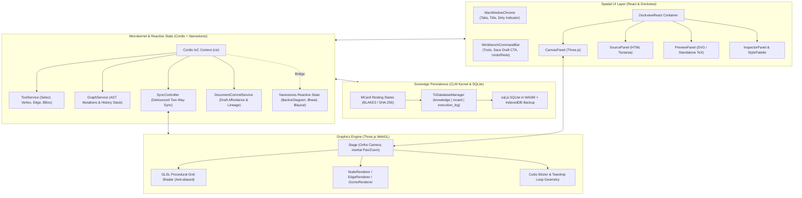
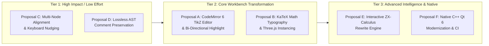
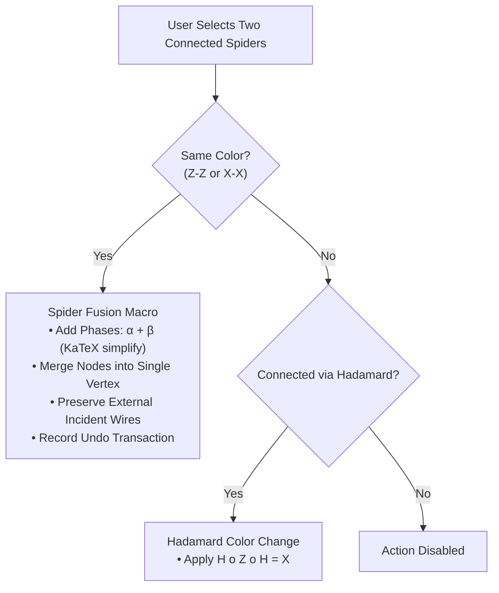

# TikZiT Architecture Audit & Strategic Engineering Recommendations

> **Technical Whitepaper & Modernization Blueprint**  
> *In-Depth Analysis of the Dual-Stack TikZiT Ecosystem, Architectural Gaps, and Strategic Roadmap*  
> **Target:** `tikzit` (v2.2.0) | **Author:** Antigravity AI & TikZiT Core Engineering | **Date:** September 2026

---

## 1. Executive Assessment & System Health Scorecard

[TikZiT](file:///Users/bkoo/.gemini/antigravity/worktrees/tikzit/generate_project_summary/README.md) occupies a unique and crucial niche in scientific software: it bridges formal mathematical diagrammatic languages—specifically **string diagrams, category theory wiring diagrams, and quantum ZX-calculus**—with high-precision **PGF/TikZ** typesetting. Created to construct the 2,500+ diagrams in [*Picturing Quantum Processes* (Coecke & Kissinger, Cambridge University Press, 2017)](http://cambridge.org/pqp), the repository has evolved from its historical C++/Qt foundation into a sophisticated dual-platform architecture featuring the **Web Spatial Workbench** (Astro 7, React, Three.js WebGL, Dockview, Cordis IoC, CLM Kernel).

Following the integration of Sprints 16–19 (MCard diagram lifecycle, multi-document session durability, lineage restoration, prominent draft affordances, individual multi-format export, and sovereign collection export), the codebase is robust, well-tested (314 unit tests, 134 Playwright specs), and mathematically rigorous.

However, an exhaustive audit across the dual codebases reveals distinct opportunities for optimization, modern developer tooling, and domain intelligence.

```
+------------------------------------------------------------------------------------------------------+
|                                   TikZiT Subsystem Health Audit Scorecard                            |
+--------------------------+--------+--------------------+---------------------------------------------+
| Subsystem Area           | Health | Maturity Level     | Primary Assessment & Opportunity            |
+--------------------------+--------+--------------------+---------------------------------------------+
| AST Parser & Grammar     | 🟢 9/10| Production-Ready   | Lossless round-tripping; drops % comments.  |
| Three.js Canvas Engine   | 🟡 8/10| Highly Functional  | Smooth 60fps pan/zoom; plain text math labels|
| Dockview Windowing       | 🟢 9/10| Production-Ready   | Hydration-resilient, 0-panel guard active.  |
| CLM Sovereign Storage    | 🟢 9/10| Production-Ready   | Tri-Database SQLite WASM + MCard lineage.   |
| Source Code Editor       | 🔴 4/10| Technical Debt     | Raw <textarea>; lacks syntax highlight & LSI|
| Layout & Diagramming     | 🟡 6/10| Functional         | Manual drag only; lacks alignment/nudge.    |
| Domain Intelligence (ZX) | 🟡 5/10| Passive Drafting   | No automated rewrites (spider fusion, etc.) |
| Native Desktop (C++/Qt)  | 🟡 7/10| Stable Reference   | Defaults to Qt 5; commented Poppler build.  |
| Multi-Workflow Tooling   | 🟢 9/10| Established Pattern| Git Worktrees enable parallel concurrency.  |
+--------------------------+--------+--------------------+---------------------------------------------+
```

---

## 2. System Anatomy & Dataflow Review

The Web Spatial Workbench coordinates several distinct decoupled layers through an Inversion-of-Control microkernel:



---

## 3. Deep-Dive Subsystem Audits & Technical Debt

### 3.1 Source Panel & Code Editor: The `<textarea>` Bottleneck
- **Location**: [`src/components/workbench/panels/SourcePanel.tsx`](file:///Users/bkoo/.gemini/antigravity/worktrees/tikzit/generate_project_summary/src/components/workbench/panels/SourcePanel.tsx#L125-L135)
- **Current Implementation**:
  ```tsx
  <textarea
    data-testid="tikz-source-editor"
    value={code}
    onChange={(e) => handleChange(e.target.value)}
    onBlur={handleBlur}
    className="w-full flex-1 bg-transparent p-3 text-emerald-400 focus:outline-none resize-none leading-relaxed"
    spellCheck={false}
  />
  ```
- **Identified Issues**:
  1. **Zero Syntax Highlighting**: Plain monochrome green text without lexical colorization for commands (`\node`, `\draw`), styles (`style=...`), coordinates, or labels.
  2. **No Line Numbers or Gutter Indicators**: Users working with large diagrams cannot cross-reference line numbers from parse diagnostics.
  3. **No Bracket or Delimiter Matching**: TikZ relies heavily on balanced `{...}`, `(...)`, and `[...]`. A missing brace causes immediate parse failure with no visual indication of the mismatch.
  4. **Lack of Bi-Directional Highlighting**: Selecting a node on the canvas does not highlight its corresponding code block in the source, and clicking code does not highlight the canvas node.

---

### 3.2 Label Typography: Plain Serif Fallback vs Genuine LaTeX Math
- **Location**: [`src/canvas/renderers/NodeRenderer.ts`](file:///Users/bkoo/.gemini/antigravity/worktrees/tikzit/generate_project_summary/src/canvas/renderers/NodeRenderer.ts#L309-L330)
- **Current Implementation**:
  ```typescript
  private createLabelSprite(text: string, bgColor: string): THREE.Sprite {
    const canvas = document.createElement('canvas');
    canvas.width = 128;
    canvas.height = 128;
    const ctx = canvas.getContext('2d');
    if (ctx) {
      ctx.font = 'bold 56px "Times New Roman", "Cambria Math", serif';
      const cleanText = text.replace(/^\$+|\$+$/g, '').trim();
      ctx.fillText(cleanText, 64, 64);
    }
    // ...
  }
  ```
- **Identified Issues**:
  1. **Raw Markup Displayed**: If a user enters `$\frac{\pi}{2}$`, `$\sqrt{X}$`, or subscripts `$Z_0$`, the canvas displays literal `\frac{\pi}{2}` in Times New Roman instead of rendering fractions, roots, or subscripts.
  2. **Resolution Artifacts**: The fixed 128x128 texture becomes blurry when zooming in on the canvas.
  3. **Performance Waste**: Creating a distinct HTML5 `canvas` and `CanvasTexture` per node causes significant allocation churn for large diagrams.

---

### 3.3 Diagramming Ergonomics: Absence of Alignment & Nudging Tools
- **Location**: [`src/components/workbench/WorkbenchCommandBar.tsx`](file:///Users/bkoo/.gemini/antigravity/worktrees/tikzit/generate_project_summary/src/components/workbench/WorkbenchCommandBar.tsx) and [`src/services/keybindings.ts`](file:///Users/bkoo/.gemini/antigravity/worktrees/tikzit/generate_project_summary/src/services/keybindings.ts)
- **Identified Issues**:
  1. In quantum computing and categorical wiring diagrams, arranging spiders along strict horizontal wires or vertical time-steps is paramount. Currently, users must manually drag each node and inspect the Property Inspector.
  2. No multi-node alignment actions (Align Left, Align Center, Align Top, Align Bottom, Distribute Horizontally, Distribute Vertically).
  3. No keyboard nudging: arrow keys cannot be used to nudge selected nodes by fractional grid units (0.1 or 0.25) or Shift+arrow (1.0).
  4. No `Cmd+S` / `Ctrl+S` keybinding registered in [`keybindings.ts`](file:///Users/bkoo/.gemini/antigravity/worktrees/tikzit/generate_project_summary/src/services/keybindings.ts), even though Sprint 17B added a dedicated Save CTA.

---

### 3.4 AST Round-Trip Fidelity: Comment Stripping
- **Location**: [`src/core/parser/lexer.ts`](file:///Users/bkoo/.gemini/antigravity/worktrees/tikzit/generate_project_summary/src/core/parser/lexer.ts) and [`src/core/parser/emitter.ts`](file:///Users/bkoo/.gemini/antigravity/worktrees/tikzit/generate_project_summary/src/core/parser/emitter.ts)
- **Identified Issues**:
  1. Standard LaTeX comments (`% ...`) inside the `tikzpicture` block are completely ignored by the tokenizer and omitted from `GraphAST`.
  2. Round-tripping any diagram that contains author notes, annotations, or commented-out nodes through the AST completely deletes those comments upon emission.

---

### 3.5 ZX-Calculus Domain Intelligence: Passive vs Active Diagramming
- **Location**: Entire `src/core/` domain model
- **Identified Issues**:
  1. While TikZiT is marketed as having "ZX-Calculus Support", this support is currently limited to graphical presets (green Z spiders, red X spiders, yellow Hadamard boxes).
  2. The software does not understand ZX-calculus mathematics: it cannot fuse spiders, cancel inverse phases, eliminate identity spiders, or verify diagram equivalence.
  3. Researchers must perform all mathematical transformations manually.

---

### 3.6 Native Desktop C++: Build Configuration & Modernization
- **Location**: [`CMakeLists.txt`](file:///Users/bkoo/.gemini/antigravity/worktrees/tikzit/generate_project_summary/CMakeLists.txt)
- **Identified Issues**:
  1. CMake configuration still defaults to `Qt5` (`set(QT_VER "Qt5")`), which is end-of-life.
  2. Poppler PDF library detection is commented out, requiring manual intervention on modern Linux and macOS setups.
  3. CMake lacks modern Apple Silicon ARM64 bundle signing and automated GitHub Actions CI.

---

## 4. Strategic Proposals & Enhancement Specifications

Based on the audit findings, we propose six prioritized engineering initiatives:



---

### Proposal A: Professional Code Editor Upgrade (CodeMirror 6)

#### Objective
Replace the raw HTML `<textarea>` in [`SourcePanel.tsx`](file:///Users/bkoo/.gemini/antigravity/worktrees/tikzit/generate_project_summary/src/components/workbench/panels/SourcePanel.tsx) with a lightweight, extensible **CodeMirror 6** instance equipped with custom TikZ/PGF syntax highlighting and bi-directional canvas focus.

#### Technical Architecture
1. **Custom TikZ Language Grammar**:
   - Highlighting tags for commands (`\node`, `\draw`, `\path`), coordinates `(-1.5, 0.75)`, styles (`style=wire`), and math labels `{$...$}`.
   - Bracket matching extension for balanced `{...}`, `(...)`, and `[...]`.
2. **Bi-Directional Highlighting Protocol**:
   - When a node is selected in Three.js, dispatch `tikzit/source:highlight` with the node ID.
   - CodeMirror computes the AST node's source offset range and scrolls/highlights the corresponding lines with a subtle pulse animation.
   - Clicking a `\node` or `\draw` statement in CodeMirror dispatches a canvas selection event, centering the stage on the targeted element.
3. **Inline Diagnostic Squiggles**:
   - Display `ParseDiagnostic` warnings directly as red/amber squiggly underlines with tooltip messages, matching VS Code ergonomics.

---

### Proposal B: Mathematical Typography (KaTeX) & Instanced Rendering

#### Objective
Render true mathematical formulas on the Three.js canvas using **KaTeX SVG-to-Canvas rendering**, and implement `THREE.InstancedMesh` for large-scale diagram performance.

#### Technical Architecture
1. **KaTeX SVG Texture Pipeline**:
   - Detect if node label contains math delimiters (`$` or LaTeX commands like `\frac`, `\alpha`, `\pi`).
   - Use `katex.renderToString(label, { output: 'html' })` or convert to SVG via `XMLSerializer`.
   - Render the crisp vector SVG onto a dynamic high-DPI canvas texture with automatic Retina scaling ($2\times / 3\times$).
2. **Instanced Mesh Optimization**:
   - For diagrams with hundreds of spiders (e.g. quantum supremacy circuits or tensor networks), partition nodes by shape (`circle`, `rectangle`, `diamond`).
   - Use `THREE.InstancedMesh` with dynamic transform matrices and per-instance color buffers.
   - Reduces WebGL draw calls from $\mathcal{O}(N)$ to $\mathcal{O}(1)$ per shape family, ensuring steady 60 FPS even at 10,000 nodes.

---

### Proposal C: Multi-Node Alignment, Distribution & Nudging Tools

#### Objective
Provide essential vector diagramming layout operations in [`WorkbenchCommandBar.tsx`](file:///Users/bkoo/.gemini/antigravity/worktrees/tikzit/generate_project_summary/src/components/workbench/WorkbenchCommandBar.tsx) and keyboard nudging in [`keybindings.ts`](file:///Users/bkoo/.gemini/antigravity/worktrees/tikzit/generate_project_summary/src/services/keybindings.ts).

#### Technical Specification
1. **Alignment Operations**:
   - **Align Left**: Set $x_i = \min_j(x_j)$ for all selected nodes.
   - **Align Center (Horizontal)**: Set $x_i = \frac{\min(x) + \max(x)}{2}$.
   - **Align Right**: Set $x_i = \max_j(x_j)$.
   - **Align Top / Middle / Bottom**: Equivalent operations along the $Y$ axis.
2. **Equidistant Distribution**:
   - Sort selected nodes along the chosen axis and calculate uniform pitch:
     $$\Delta x = \frac{x_{\max} - x_{\min}}{N - 1}$$
3. **Keyboard Nudge Actions**:
   - Arrow keys: Move selected nodes by $\pm 0.1$ TikZ units (with snapping disabled).
   - Shift + Arrow keys: Move by $\pm 1.0$ TikZ unit.
   - Register `Cmd+S` / `Ctrl+S` globally to invoke `cmd:file:save` (committing to MCard).

---

### Proposal D: Lossless AST Comment & Annotation Preservation

#### Objective
Extend the TypeScript recursive-descent parser and emitter to preserve inline and block comments (`% ...`) throughout bidirectional AST round-trips.

#### Technical Specification
1. **Token Extension in [`lexer.ts`](file:///Users/bkoo/.gemini/antigravity/worktrees/tikzit/generate_project_summary/src/core/parser/lexer.ts)**:
   - Introduce `COMMENT` token type capturing `%[^\n]*`.
2. **AST Schema Augmentation in [`types.ts`](file:///Users/bkoo/.gemini/antigravity/worktrees/tikzit/generate_project_summary/src/core/domain/types.ts)**:
   - Add optional `leadingComments?: string[]` and `trailingComment?: string` to `NodeData`, `EdgeData`, and `GraphAST`.
3. **Emitter Synchronization in [`emitter.ts`](file:///Users/bkoo/.gemini/antigravity/worktrees/tikzit/generate_project_summary/src/core/parser/emitter.ts)**:
   - Re-emit captured comments in their original relative position, ensuring that human-written documentation within TikZ files is never lost.

---

### Proposal E: ZX-Calculus Interactive Rewrite Engine

#### Objective
Transform TikZiT from a passive drawing editor into an active quantum reasoning environment by introducing automated graphical rewrite rules.



#### Supported Rewrite Rules:
1. **Spider Fusion**: $Z(\alpha) \circ Z(\beta) \to Z(\alpha + \beta)$ and $X(\alpha) \circ X(\beta) \to X(\alpha + \beta)$. Automatically simplifies symbolic phase expressions (e.g. $\pi/4 + \pi/4 \to \pi/2$).
2. **Identity Removal**: $Z(0) \to \text{wire}$ for 2-legged spiders with zero phase.
3. **Hadamard Cancellation**: $H \circ H \to \text{wire}$.
4. **PyZX Integration Bridge**: Export diagram to JSON graph format compatible with `pyzx`, run automated full clifford simplification, and re-import the optimized diagram into the Three.js canvas.

---

### Proposal F: Native Desktop C++ Modernization & CI

#### Objective
Upgrade the desktop C++ codebase to modern standards, making **Qt 6** the default and introducing automated GitHub Actions builds.

#### Action Items:
1. Update [`CMakeLists.txt`](file:///Users/bkoo/.gemini/antigravity/worktrees/tikzit/generate_project_summary/CMakeLists.txt) to probe for `Qt6` first with fallback to `Qt5`.
2. Replace deprecated Qt 5 APIs in [`tikzscene.cpp`](file:///Users/bkoo/.gemini/antigravity/worktrees/tikzit/generate_project_summary/src/gui/tikzscene.cpp) (e.g. `QWheelEvent::delta()` -> `angleDelta()`).
3. Add a multi-platform GitHub Actions workflow compiling:
   - macOS (Apple Silicon ARM64 + Intel x86_64 universal binary)
   - Linux (Ubuntu AppImage / Flatpak)
   - Windows (MSVC 2022 executable)

---

## 5. Prioritized Implementation Roadmap & Effort/Impact Matrix

```
+---------------------------------------------------------------------------------------------------------+
|                                    Effort vs Impact Prioritization Matrix                               |
+---------------------------------------------+----------+--------+------------------+--------------------+
| Initiative                                  | Effort   | Impact | Sprint Target    | Primary Milestone  |
+---------------------------------------------+----------+--------+------------------+--------------------+
| 1. Keyboard Nudging & Alignment Tools       | Low (S)  | High   | Sprint 20        | Ergonomics Quickwin|
| 2. Global Save Shortcut (Cmd+S)             | Low (S)  | High   | Sprint 20        | Usability Fix      |
| 3. CodeMirror 6 TikZ Editor Integration     | Med (M)  | High   | Sprint 21        | Workbench UX Jump  |
| 4. Lossless AST Comment Preservation        | Med (M)  | High   | Sprint 21        | File Integrity     |
| 5. KaTeX Math Typography for Canvas Labels  | Med (M)  | High   | Sprint 22        | Visual Quality     |
| 6. Three.js InstancedMesh Performance       | Med (M)  | Med    | Sprint 22        | 10,000 Node Scale  |
| 7. ZX-Calculus Interactive Rewrite Macros   | High (L) | High   | Sprint 23        | Quantum Intelligence|
| 8. Native Desktop Qt 6 & GitHub Actions CI  | Med (M)  | Med    | Sprint 24        | Desktop Release    |
+---------------------------------------------+----------+--------+------------------+--------------------+
```

---

## 6. Conclusion & Next Steps

TikZiT 2.2.0 has established an extraordinarily solid architectural baseline. By addressing the source editor technical debt, enhancing mathematical label typography, introducing layout alignment tools, and layering domain-specific ZX-calculus rewrite intelligence, TikZiT can transcend from an already capable diagram editor into the premier international platform for categorical quantum computing and string diagram research.

---
*For documentation index and navigation, see [`_docs/README.md`](file:///Users/bkoo/.gemini/antigravity/worktrees/tikzit/generate_project_summary/_docs/README.md).*
