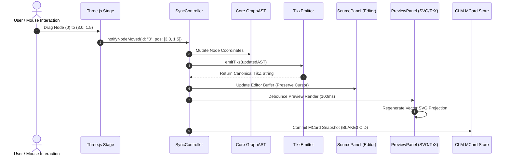
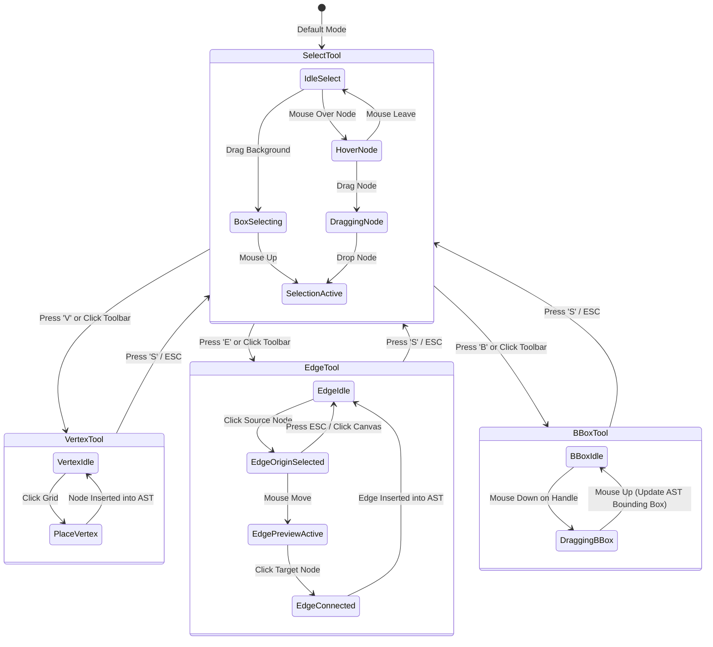
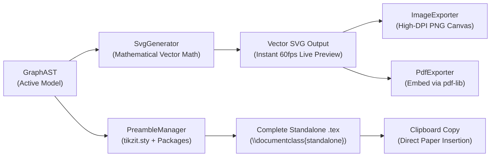
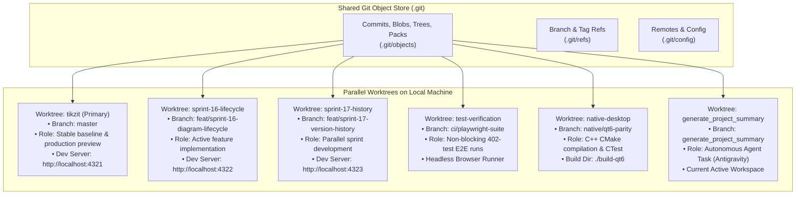

# TikZiT — Comprehensive Project Summary & Architecture Blueprint

> **Canonical System Overview & Engineering Reference**  
> *PGF/TikZ Graphical Diagram Editor with ZX-Calculus Support & Dual-Stack Architecture*  
> **Repository:** `tikzit` | **Version:** `2.2.0` (Synchronized with `origin/master` @ `d19c459`) | **Date:** September 2026

---

## 1. Executive Summary & Core Mission

[TikZiT](file:///Users/bkoo/.gemini/antigravity/worktrees/tikzit/generate_project_summary/README.md) is a specialized graphical diagram editor designed specifically for rapidly authoring graphs, string diagrams, quantum circuits, and category theory wiring diagrams using **PGF/TikZ**. It is famously known as the tool used to construct all 2,500+ diagrams in the canonical text [*Picturing Quantum Processes* (Coecke & Kissinger, Cambridge University Press, 2017)](http://cambridge.org/pqp).

The repository hosts two complementary, production-grade implementations operating over the identical underlying mathematical grammar and file formats:

1. **TikZiT Web Spatial Workbench (v2.2.0)**: A modern, zero-installation, in-browser workstation built on **Astro 7**, **React**, **Three.js (WebGL)**, **Dockview**, **Cordis IoC Microkernel**, **Nanostores**, and **Cubical Logic Model (CLM) Kernel** content-addressed persistence. Features complete MCard diagram lifecycle management, session durability across reloads, version lineage restore, prominent draft-save affordances, individual multi-format export, and sovereign collection backups (Sprints 00–19).
2. **TikZiT Native Desktop Application (v2.1+)**: The classic, high-performance C++ desktop application built with **Qt 5 / Qt 6**, utilizing **Flex** (`tikzlexer.l`) and **Bison** (`tikzparser.y`) for LALR grammar parsing, and background `pdflatex` compilation via Poppler for PDF previews.
3. **Parallel Multi-Workflow Engine**: Built to support concurrent, non-interfering developer, CI, and autonomous AI agent workflows on a single machine via **Git Worktrees** (`git worktree`).

```
+----------------------------------------------------------------------------------------------------+
|                                         TikZiT Ecosystem                                           |
+------------------------------------+-----------------------------------+---------------------------+
|      Web Spatial Workbench         |    Native Desktop Application     | Parallel Worktree Engine  |
+------------------------------------+-----------------------------------+---------------------------+
| • Host: Astro 7 + React Islands    | • Host: C++ (C++17) + Qt 5 / Qt 6 | • Shared Git Object DB    |
| • Engine: Three.js WebGL           | • Engine: QGraphicsView / Scene   | • Isolated Working Trees  |
| • Parser: TypeScript AST Parser    | • Parser: Flex + Bison (LALR)     | • Multi-Sprint Tracks     |
| • Windowing: Dockview Spatial Grid | • Windowing: QMainWindow + Docks  | • Independent Dev Servers |
| • Kernel: Cordis IoC + Nanostores  | • Kernel: Qt Signal/Slot Engine   | • Concurrent Test Runners |
| • Storage: CLM MCard + SQLite WASM | • Storage: Local Filesystem       | • Autonomous Agent Mounts |
| • Lifecycle: Sprints 16-19 CLM     | • Preview: pdflatex + Poppler-Qt  | • Zero Cache Collision    |
+------------------------------------+-----------------------------------+---------------------------+
```

### 1.1 High-Level Dual-Platform Comparison

| Architectural Dimension | Web Spatial Workbench | Native Desktop Application |
| :--- | :--- | :--- |
| **Primary Language** | TypeScript / React / Astro | C++ (C++17) |
| **GUI Framework** | [Dockview React](file:///Users/bkoo/.gemini/antigravity/worktrees/tikzit/generate_project_summary/src/components/workbench/TikzitSpatialWorkbench.tsx) (`dockview-react` 8.3+) | Qt 5 / Qt 6 ([QMainWindow](file:///Users/bkoo/.gemini/antigravity/worktrees/tikzit/generate_project_summary/src/gui/mainwindow.cpp)) |
| **Canvas Rendering** | [Three.js](file:///Users/bkoo/.gemini/antigravity/worktrees/tikzit/generate_project_summary/src/canvas/Stage.ts) (Hardware WebGL, Procedural GLSL Shader) | Qt [QGraphicsView](file:///Users/bkoo/.gemini/antigravity/worktrees/tikzit/generate_project_summary/src/gui/tikzview.h) / [QGraphicsScene](file:///Users/bkoo/.gemini/antigravity/worktrees/tikzit/generate_project_summary/src/gui/tikzscene.h) |
| **Grammar Parser** | [TypeScript Recursive-Descent](file:///Users/bkoo/.gemini/antigravity/worktrees/tikzit/generate_project_summary/src/core/parser/parser.ts) | [Flex](file:///Users/bkoo/.gemini/antigravity/worktrees/tikzit/generate_project_summary/src/data/tikzlexer.l) (`tikzlexer.l`) & [Bison](file:///Users/bkoo/.gemini/antigravity/worktrees/tikzit/generate_project_summary/src/data/tikzparser.y) (`tikzparser.y`) |
| **Code Emitter** | Pure TypeScript [AST Emitter](file:///Users/bkoo/.gemini/antigravity/worktrees/tikzit/generate_project_summary/src/core/parser/emitter.ts) | C++ [TikzAssembler](file:///Users/bkoo/.gemini/antigravity/worktrees/tikzit/generate_project_summary/src/data/tikzassembler.cpp) |
| **State / DI-Container**| [Cordis](file:///Users/bkoo/.gemini/antigravity/worktrees/tikzit/generate_project_summary/src/services/kernel.ts) + [Nanostores](file:///Users/bkoo/.gemini/antigravity/worktrees/tikzit/generate_project_summary/src/stores/createWorkbenchStores.ts) Reactive Bridge | Qt Model/View, `QUndoStack` |
| **Persistence / Storage** | [CLM Kernel](file:///Users/bkoo/.gemini/antigravity/worktrees/tikzit/generate_project_summary/src/services/clm/triadDefinition.ts) (MCard, BLAKE3 CID, Tri-DB SQLite WASM) | Local POSIX/Windows Filesystem (`.tikz`, `.tikzstyles`) |
| **Document Lifecycle** | Full multi-tab durability, dirty safety dialogs, version lineage restore | Single-window document model, standard file dialogs |
| **TeX Preview Engine** | Hybrid Vector-First ([SvgGenerator](file:///Users/bkoo/.gemini/antigravity/worktrees/tikzit/generate_project_summary/src/services/preview/SvgGenerator.ts) + [PreambleManager](file:///Users/bkoo/.gemini/antigravity/worktrees/tikzit/generate_project_summary/src/services/preview/PreambleManager.ts)) | [LaTeXProcess](file:///Users/bkoo/.gemini/antigravity/worktrees/tikzit/generate_project_summary/src/gui/latexprocess.cpp) (`pdflatex` sub-process) |
| **Export Formats** | TikZ Code, SVG, PDF ([PdfExporter](file:///Users/bkoo/.gemini/antigravity/worktrees/tikzit/generate_project_summary/src/services/export/PdfExporter.ts)), PNG (1x/2x/4x), Sovereign SQLite (`.db`) | TikZ Code, PDF (Poppler), EPS, PNG |
| **Offline Support** | Full PWA Service Worker + IndexedDB | Native Desktop Offline Binary |
| **Concurrency Model** | Git Worktrees (multi-port dev servers, isolated test runs) | Git Worktrees (separate CMake build folders) |
| **Test Matrix** | 314 Vitest unit tests + 134 Playwright cross-browser tests | Qt Test (`UnitTests.app`) |

---

## 2. End-to-End System Architecture

The following diagram illustrates the dual-stack topology of TikZiT, highlighting the modern Web Spatial Workbench and its clean-room structural alignment with the Native Qt desktop reference.

```mermaid
flowchart TB
    subgraph Client["Web Client (Browser / PWA)"]
        direction TB
        subgraph Shell["Astro 7 Shell & Island Host"]
            Page["index.astro"] -->|client:only| Workbench["TikzitSpatialWorkbench"]
            Chrome["MacWindowChrome & CommandBar"]
            StatusBar["WorkbenchStatusBar"]
        end

        subgraph Dockview["Dockview Spatial Layout Engine"]
            direction LR
            CanvasPanel["Canvas Panel\n(Three.js WebGL)"]
            SourcePanel["Source Panel\n(CodeMirror/Monaco)"]
            PreviewPanel["Preview Panel\n(Vector SVG / TeX)"]
            InspectorPanel["Inspector Panel\n(Properties & Styles)"]
            Drawer["Corpus Explorer\nDrawer (CLM)"]
        end

        subgraph Runtime["Cordis IoC Microkernel & Reactive State"]
            Ctx["Cordis Context"]
            ToolSvc["ToolService\n(Select, Vertex, Edge, BBox)"]
            GraphSvc["GraphService\n(AST Mutations & Undo/Redo)"]
            SyncCtrl["SyncController\n(Graph <-> Source Bi-Directional)"]
            CommitSvc["DocumentCommitService\n(MCard Lineage & Save Affordance)"]
            NanoBridge["Nanostores Bridge\n($toolMode, $activeDiagram, $head)"]
            Ctx --> ToolSvc
            Ctx --> GraphSvc
            Ctx --> SyncCtrl
            Ctx --> CommitSvc
            Ctx --> NanoBridge
        end

        subgraph Engine["Graphics & Domain Pipeline"]
            direction TB
            Stage["Stage (Scene, Ortho Camera, Raycaster)"]
            Shaders["Custom GLSL Grid Shader"]
            Bezier["Cubic & Teardrop Bézier Geometry"]
            Renderers["NodeRenderer / EdgeRenderer / GizmoRenderer"]
            Stage --> Shaders
            Stage --> Bezier
            Stage --> Renderers
        end

        subgraph CLM["CLM Kernel & Tri-Database Architecture"]
            direction LR
            MCard["MCard (Resting States, BLAKE3 CID)"]
            TriDB["TriDatabaseManager\n(knowledge | mcard | execution_log)"]
            SqliteWasm["sql.js SQLite WASM + IndexedDB"]
            MCard --> TriDB --> SqliteWasm
        end

        subgraph ParserTS["TypeScript TikZ Parser & Emitter"]
            LexerTS["TikzLexer (Token Stream)"]
            ParserTSCore["TikzParser (Recursive Descent)"]
            EmitterTS["TikzEmitter (Deterministic TikZ String)"]
            LexerTS --> ParserTSCore --> EmitterTS
        end
    end

    subgraph Native["C++ / Qt Desktop Reference Oracle"]
        direction TB
        QtMain["MainWindow (QMainWindow)"]
        QtScene["TikzScene & TikzView (QGraphicsView)"]
        FlexBison["Flex (tikzlexer.l) + Bison (tikzparser.y)"]
        Assembler["TikzAssembler (C++ Graph Construction)"]
        PdfLatex["pdflatex Process + Poppler PDF"]
        QtMain --> QtScene
        QtMain --> FlexBison --> Assembler
        QtMain --> PdfLatex
    end

    %% Connections
    Workbench --> Dockview
    Dockview --> Runtime
    CanvasPanel --> Stage
    SourcePanel --> ParserTS
    SyncCtrl <--> ParserTS
    SyncCtrl <--> Stage
    Runtime --> CLM
    ParserTS -.->|Direct 1:1 Grammar Port| FlexBison
    Stage -.->|Visual Parity Calibration| QtScene
```



---

## 3. Core Domain Model & TikZ/PGF Language Engine

TikZiT operates over a strictly defined, mathematically unambiguous subset of PGF/TikZ specifically tailored for quantum graphical calculi (ZX-calculus, ZW-calculus), monoidal categories, and wiring diagrams.

### 3.1 Domain Schema & AST Types

The foundational data contracts reside in [`src/core/domain/types.ts`](file:///Users/bkoo/.gemini/antigravity/worktrees/tikzit/generate_project_summary/src/core/domain/types.ts):

```
+---------------------------------------------------------------------------------+
|                                 GraphAST                                        |
+---------------------------------------------------------------------------------+
| • bbox?: BoundingBox                | • nodes: NodeData[]                       |
| • edges: EdgeData[]                 | • paths: PathData[]                       |
| • styles: TikzStylesCatalog         | • layers: string[]                        |
+---------------------------------------------------------------------------------+
          |                                       |
          v                                       v
+-------------------------------+       +-----------------------------------------+
|          NodeData             |       |               EdgeData                  |
+-------------------------------+       +-----------------------------------------+
| • id: string                  |       | • source: string                        |
| • point: Point2D (x, y)       |       | • target: string                        |
| • style: string               |       | • style: string                         |
| • label?: string              |       | • inAngle?: number                      |
| • data?: GraphElementProperty |       | • outAngle?: number                     |
+-------------------------------+       | • looseness?: number                    |
                                        | • bendMode?: 'left' | 'right' | 'none'  |
                                        | • bendAngle?: number                    |
                                        | • isLoop?: boolean                      |
                                        +-----------------------------------------+
```

### 3.2 Formal Grammar & Supported Syntax

| TikZ Syntax Construct | TikZiT AST Mapping | Purpose / Semantics |
| :--- | :--- | :--- |
| `\path [use as bounding box] (x1,y1) rectangle (x2,y2);` | [`BoundingBox`](file:///Users/bkoo/.gemini/antigravity/worktrees/tikzit/generate_project_summary/src/core/domain/types.ts#L65) | Defines explicit canvas boundaries; preserves framing across exports. |
| `\node [style=Z] (0) at (-1.5, 0.75) {$\alpha$};` | [`NodeData`](file:///Users/bkoo/.gemini/antigravity/worktrees/tikzit/generate_project_summary/src/core/domain/types.ts#L25) | Declares node with ID `0`, assigned style `Z`, Cartesian coords, and label. |
| `\draw [style=wire] (0) to (1);` | [`EdgeData`](file:///Users/bkoo/.gemini/antigravity/worktrees/tikzit/generate_project_summary/src/core/domain/types.ts#L45) (Straight) | Direct straight connection between source `0` and target `1`. |
| `\draw [style=wire, in=180, out=0, looseness=1.25] (0) to (1);` | [`EdgeData`](file:///Users/bkoo/.gemini/antigravity/worktrees/tikzit/generate_project_summary/src/core/domain/types.ts#L45) (Angular) | Cubic Bézier spline with specific incidence angles and tension. |
| `\draw [style=wire, bend left=30] (0) to (1);` | [`EdgeData`](file:///Users/bkoo/.gemini/antigravity/worktrees/tikzit/generate_project_summary/src/core/domain/types.ts#L45) (Bend) | Quadratic or symmetrical Bézier arc deflected by specified degree. |
| `\draw [style=wire, loop] (0) to (0);` | [`EdgeData`](file:///Users/bkoo/.gemini/antigravity/worktrees/tikzit/generate_project_summary/src/core/domain/types.ts#L45) (Teardrop) | Self-loop connection on a single vertex rendered as a teardrop spline. |
| `\begin{pgfonlayer}{nodelayer} ... \end{pgfonlayer}` | `layers['nodelayer']` | Explicit PGF depth layers separating nodes from wiring paths. |
| `\begin{pgfonlayer}{edgelayer} ... \end{pgfonlayer}` | `layers['edgelayer']` | Under-layer ensuring wires are drawn behind node glyphs. |
| `\tikzstyle{Z}=[fill=green, draw=black, shape=circle]` | [`TikzStyle`](file:///Users/bkoo/.gemini/antigravity/worktrees/tikzit/generate_project_summary/src/core/domain/types.ts#L80) | Categorized visual style rules saved into `.tikzstyles` stylesheets. |

### 3.3 Lexer, Parser & Emitter Pipeline

The TypeScript parser in [`src/core/parser`](file:///Users/bkoo/.gemini/antigravity/worktrees/tikzit/generate_project_summary/src/core/parser) is a clean-room recursive-descent port of the C++ Bison grammar (`src/data/tikzparser.y`):

- **Tokenizer ([`TikzLexer`](file:///Users/bkoo/.gemini/antigravity/worktrees/tikzit/generate_project_summary/src/core/parser/lexer.ts))**: Scans input text and extracts tokens including `BEGIN_TIKZPICTURE`, `NODE_CMD`, `DRAW_CMD`, `COORD`, `PROPERTIES`, and braced math formulas `{...}`.
- **Recursive-Descent Parser ([`TikzParser`](file:///Users/bkoo/.gemini/antigravity/worktrees/tikzit/generate_project_summary/src/core/parser/parser.ts))**: Assembles tokens into an immutable `GraphAST` tree. Features safe recovery mode via `safeParseTikz()` returning structured `ParseDiagnostic` objects instead of throwing uncaught exceptions.
- **Deterministic Emitter ([`TikzEmitter`](file:///Users/bkoo/.gemini/antigravity/worktrees/tikzit/generate_project_summary/src/core/parser/emitter.ts))**: Emits normalized, canonical TikZ code with proper indentation, preserving node order, coordinate precision, and layer semantics.

### 3.4 Bi-Directional Synchronization Flow

The state synchronization engine guarantees instant convergence between visual edits on the Three.js stage and text edits in the code editor:



---

## 4. Web Spatial Workbench & Dockview Window Management

The web front-end adopts the **Dockview** spatial windowing framework ([`dockview-react`](file:///Users/bkoo/.gemini/antigravity/worktrees/tikzit/generate_project_summary/src/components/workbench/TikzitSpatialWorkbench.tsx)), enabling multi-dock tab dragging, floating tool palettes, and pane split-equalization.

### 4.1 Workbench Layout Architecture

```
+-----------------------------------------------------------------------------------------------+
| MacWindowChrome: Document Tabs (Multi-Doc) | CloseTabDialog | Zoom Controls | Theme Toggle     |
+-----------------------------------------------------------------------------------------------+
| WorkbenchCommandBar: [Select] [Vertex] [Edge] [BBox] | Undo/Redo | Save Draft CTA | Export Menu|
+----+-----------------------------------------------------+------------------------------------+
| C  | Primary Central Split Grid (DockviewReact Host)     | Right Inspector Rail               |
| o  | +-------------------------+-------------------------+ +--------------------------------+ |
| r  | | Canvas Panel            | TeX Preview Panel       | | Property Inspector             | |
| p  | | • Three.js WebGL Stage  | • Vector SVG Output     | | • Node Coordinates (X, Y)      | |
| u  | | • DraftSaveCallout      | • Standalone TeX Source | | • Assigned TikZ Style          | |
| s  | | • Interactive Gizmos    | • Scale / Zoom Controls | | • LaTeX Label String           | |
|    | +-------------------------+-------------------------+ +--------------------------------+ |
| E  | | Source Panel                                      | | Style Palette                  | |
| x  | | • Bidirectional TikZ Code Editor                  | | • Swatch Grid (Z, X, H, Wire)  | |
| p  | | • Syntax Validation & Error Diagnostics           | | • Style Category Filter        | |
| l  | +---------------------------------------------------+ | • Color / Shape Editor Modal   | |
| o  | Bottom Console & Diagnostics Drawer                 | +--------------------------------+ |
| r  | • Parse errors, LaTeX warnings, CLM transaction log |                                    |
| e  +-----------------------------------------------------+------------------------------------+
| r  | StatusBar: TikZ Dialect | Nodes: 6, Edges: 6 | CID: bafk... | 100% Zoom | Offline Ready (PWA)|
+----+------------------------------------------------------------------------------------------+
```

### 4.2 Panel, Dialog & Viewlet Catalog

| Component | File Path | Description & Functional Responsibility |
| :--- | :--- | :--- |
| `CanvasPanel` | [`CanvasPanel.tsx`](file:///Users/bkoo/.gemini/antigravity/worktrees/tikzit/generate_project_summary/src/components/workbench/panels/CanvasPanel.tsx) | Hosts Three.js WebGL viewport, tool listeners, and in-canvas `DraftSaveCallout` prompt. |
| `SourcePanel` | [`SourcePanel.tsx`](file:///Users/bkoo/.gemini/antigravity/worktrees/tikzit/generate_project_summary/src/components/workbench/panels/SourcePanel.tsx) | Full-featured TikZ text editor with line numbers, error markers, and real-time AST re-parsing. |
| `PreviewPanel` | [`PreviewPanel.tsx`](file:///Users/bkoo/.gemini/antigravity/worktrees/tikzit/generate_project_summary/src/components/workbench/panels/PreviewPanel.tsx) | Instant vector SVG rendering with preamble configuration, zoom controls, and export triggers. |
| `InspectorPanel` | [`InspectorPanel.tsx`](file:///Users/bkoo/.gemini/antigravity/worktrees/tikzit/generate_project_summary/src/components/workbench/panels/InspectorPanel.tsx) | Context-sensitive sidebar displaying properties of selected nodes (ID, coords, style, label) or edges. |
| `ConsolePanel` | [`ConsolePanel.tsx`](file:///Users/bkoo/.gemini/antigravity/worktrees/tikzit/generate_project_summary/src/components/workbench/panels/ConsolePanel.tsx) | Diagnostic output drawer logging parse warnings, CLM receipts, and sync exceptions. |
| `CorpusExplorerDrawer` | [`CorpusExplorerDrawer.tsx`](file:///Users/bkoo/.gemini/antigravity/worktrees/tikzit/generate_project_summary/src/components/workbench/CorpusExplorerDrawer.tsx) | Drawer for browsing PQP ZX corpora, diagram library actions (rename, duplicate, archive), and collection export. |
| `CloseTabDialog` | [`CloseTabDialog.tsx`](file:///Users/bkoo/.gemini/antigravity/worktrees/tikzit/generate_project_summary/src/components/workbench/CloseTabDialog.tsx) | Safe multi-document tab closure modal preventing data loss for dirty unsaved buffers. |
| `ExportDiagramDialog` | [`ExportDiagramDialog.tsx`](file:///Users/bkoo/.gemini/antigravity/worktrees/tikzit/generate_project_summary/src/components/workbench/ExportDiagramDialog.tsx) | Modal dialog for single-diagram export (TikZ, SVG, PNG 1x/2x/4x, PDF) with preview and scaling. |
| `ExportCollectionDialog` | [`ExportCollectionDialog.tsx`](file:///Users/bkoo/.gemini/antigravity/worktrees/tikzit/generate_project_summary/src/components/workbench/ExportCollectionDialog.tsx) | Modal dialog for full MCard collection export to sovereign SQLite `.db` bundles. |
| `VersionPopover` | [`VersionPopover.tsx`](file:///Users/bkoo/.gemini/antigravity/worktrees/tikzit/generate_project_summary/src/components/workbench/panels/VersionPopover.tsx) | Interactive revision lineage popover offering visual preview, visual diff compare, and safe restore. |

---

## 5. High-Performance Three.js WebGL Canvas Engine

The interactive graphics canvas is implemented in [`src/canvas/Stage.ts`](file:///Users/bkoo/.gemini/antigravity/worktrees/tikzit/generate_project_summary/src/canvas/Stage.ts), powered by Three.js WebGL and custom GLSL shaders.

### 5.1 Stage & Rendering Pipeline

1. **Orthographic Camera & Coordinates ([`CameraController.ts`](file:///Users/bkoo/.gemini/antigravity/worktrees/tikzit/generate_project_summary/src/canvas/CameraController.ts))**:
   - Coordinate conversion: $1\text{ TikZ Unit} = 40\text{ Scene Pixels}$.
   - Infinite smooth pan and zoom with inertia damping and bounds enforcement.
   - Screen-to-world and world-to-grid snapping projections.
2. **Procedural Infinite Grid Shader ([`shaders/gridShader.ts`](file:///Users/bkoo/.gemini/antigravity/worktrees/tikzit/generate_project_summary/src/canvas/shaders/gridShader.ts))**:
   - A single screen-space plane running an analytical anti-aliased procedural grid shader.
   - Computes major grid lines (1.0 TikZ unit), minor subdivisions (0.25 unit), and high-contrast axes ($X=0, Y=0$) entirely in the fragment shader without generating millions of geometry lines.
   - Fully dynamic theme responsiveness (automatic dark mode `#1a1d26` and light mode `#f8fafc` tinting).
3. **Node Rendering ([`NodeRenderer.ts`](file:///Users/bkoo/.gemini/antigravity/worktrees/tikzit/generate_project_summary/src/canvas/renderers/NodeRenderer.ts))**:
   - Dynamic instantiation of geometric meshes (circles, squares, diamonds, ellipses).
   - High-resolution HTML5 canvas-generated text textures for LaTeX labels.
   - Selection rings and bounding indicators.
4. **Edge & Bézier Spline Engine ([`EdgeRenderer.ts`](file:///Users/bkoo/.gemini/antigravity/worktrees/tikzit/generate_project_summary/src/canvas/renderers/EdgeRenderer.ts) & [`bezier.ts`](file:///Users/bkoo/.gemini/antigravity/worktrees/tikzit/generate_project_summary/src/canvas/bezier.ts))**:
   - Computes cubic Bézier control points from TikZ `in` and `out` polar angles:
     $$P_1 = P_0 + \frac{L}{3} \cdot (\cos \theta_{\text{out}}, \sin \theta_{\text{out}}), \quad P_2 = P_3 + \frac{L}{3} \cdot (\cos \theta_{\text{in}}, \sin \theta_{\text{in}})$$
   - Full support for `bend left` / `bend right` angular curvature and `looseness` scaling.
   - **Teardrop Self-Loops**: Renders self-connected edges ($V_i \to V_i$) as smooth circular teardrops with configurable orientation (`in=135°`, `out=45°`, `looseness=1.0`).
5. **Interactive Selection & Gizmos ([`GizmoRenderer.ts`](file:///Users/bkoo/.gemini/antigravity/worktrees/tikzit/generate_project_summary/src/canvas/renderers/GizmoRenderer.ts))**:
   - Bounding box lasso rectangles with 8-point resize handles and Bézier control-handle manipulation.

### 5.2 Interactive Tool State Machine



---

## 6. Microkernel, Reactive State & Event Bus

TikZiT Web uses **Cordis** as an Inversion-of-Control (IoC) microkernel paired with **Nanostores** for atomic, zero-overhead reactive UI bindings.

### 6.1 Cordis Service Container Lifecycle

As detailed in [`docs/architecture/SPIKE-CORDIS-CLM.md`](file:///Users/bkoo/.gemini/antigravity/worktrees/tikzit/generate_project_summary/docs/architecture/SPIKE-CORDIS-CLM.md) and [`src/services/kernel.ts`](file:///Users/bkoo/.gemini/antigravity/worktrees/tikzit/generate_project_summary/src/services/kernel.ts), all major subsystems inherit from `cordis.Service`:

- **Automatic Service Attachment**: Invoking `super(ctx, 'serviceName')` attaches the service instance directly to `ctx.serviceName` without redundant provider registration.
- **Lifecycle Guarantees**: Cordis manages the teardown sequence via `[Service.dispose]()`, ensuring WebGL renderers, IndexedDB transactions, and resize observers unregister cleanly without memory leaks.

### 6.2 Reactive Nanostores Bridge

While Cordis coordinates business logic and domain models, **Nanostores** handles high-frequency React component renders ([`nanostores-bridge.ts`](file:///Users/bkoo/.gemini/antigravity/worktrees/tikzit/generate_project_summary/src/services/nanostores-bridge.ts)):

| Nanostore Variable | Data Structure / Type | Functional Purpose |
| :--- | :--- | :--- |
| `$toolMode` | `'select' \| 'vertex' \| 'edge' \| 'bbox'` | Tracks active drawing tool across Toolbar, Command Bar, and Canvas. |
| `$activeDiagram` | `GraphAST` | Holds the live in-memory AST; triggers canvas and preview updates on change. |
| `$documentHead` | `{ hash: string; uri: string; clock: number }` | Tracks active CLM MCard revision and cryptographic BLAKE3 content hash. |
| `$workbenchLayout` | `{ isDrawerCollapsed, drawerWidth, panelCount }` | Stores active Dockview layout, split proportions, and drawer states. |
| `$saveAffordance` | `{ isDraft, canSave, label }` | Coordinates draft-mode amber badge, CTA button, and canvas callout. |
| `$openDocuments` | `OpenDocumentEntry[]` | Tracks open multi-document tabs, dirty states, and active selection. |
| `$theme` | `'dark' \| 'light'` | Synchronizes dark/light CSS classes, Three.js shaders, and SVG preview colors. |
| `$selection` | `{ nodes: string[]; edges: string[] }` | Multiselection list synchronized between canvas raycasting and Inspector. |

---

## 7. Content Lifecycle Management (CLM) & Sovereign Storage

TikZiT integrates the **Cubical Logic Model (`clm-kernel`)**, treating diagrams as immutable, mathematically verifiable, content-addressed artifacts.

### 7.1 MCard Primitives & Content Addressing

Every diagram, stylesheet, and workspace state is captured as an immutable **MCard** ([`triadDefinition.ts`](file:///Users/bkoo/.gemini/antigravity/worktrees/tikzit/generate_project_summary/src/services/clm/triadDefinition.ts)):

- **Canonical URI**: Formatted as `tikzit://diagram/{diagram-id}` or `zx:diagrams:{uuid}` with companion metadata cards under `zx:meta:diagrams:{uuid}`.
- **Cryptographic Hash (CID)**: 256-bit hash (BLAKE3 or SHA-256) calculated over the deterministic canonical serialization.
- **Author Identity**: Decentralized Identifier (`did:key:z6Mkp...`) providing non-repudiable authorship.
- **Monotonic Sequence Clock**: Logical revision clock guaranteeing causal ordering during concurrent edits or branch merging.

### 7.2 The Tri-Database Pillar Architecture

Persistence is organized across three sovereign pillars managed by [`TriDatabaseManager`](file:///Users/bkoo/.gemini/antigravity/worktrees/tikzit/generate_project_summary/src/services/clm/sqliteRuntime.ts):

```
+-------------------------------------------------------------------------------------------------+
|                                 Tri-Database Architecture                                       |
+-------------------------------+---------------------------------+-------------------------------+
|         1. KNOWLEDGE          |            2. MCARD             |       3. EXECUTION_LOG        |
+-------------------------------+---------------------------------+-------------------------------+
| • Canonical ZX Style Catalogs | • Working Diagram Documents     | • Verified Execution Receipts |
| • TikZ Grammar Specifications | • Revision History Ancestry     | • AST Parser Diagnostics      |
| • Formal PQP Rule Definitions | • Workspace Dockview Layouts    | • LaTeX Compilation Logs      |
| • Immutable Presets (Z, X, H) | • Local Unsaved Changes         | • Provenance Audit Trail      |
+-------------------------------+---------------------------------+-------------------------------+
                                                |
                                                v
               +-----------------------------------------------------------------+
               | sql.js In-Memory SQLite (WASM) <---> IndexedDB Persistence      |
               +-----------------------------------------------------------------+
```

### 7.3 Implemented CLM Lifecycle Capabilities (Sprints 16 – 19)

- **Sprint 16 (Diagram Creation & Lifecycle)**: Creating new diagrams under `zx:diagrams:UUID` with companion metadata cards, unified `isDiagramHandle` classification, and carry-over hardening (H1–H8).
- **Sprint 16B (Library Management & Durability)**: Diagram rename, duplicate, and archive/unarchive operations; multi-document tabs with [`CloseTabDialog`](file:///Users/bkoo/.gemini/antigravity/worktrees/tikzit/generate_project_summary/src/components/workbench/CloseTabDialog.tsx); unsaved dirty buffer recovery across reloads; idempotent migration of legacy localStorage via [`legacyImportService.ts`](file:///Users/bkoo/.gemini/antigravity/worktrees/tikzit/generate_project_summary/src/services/clm/legacyImportService.ts).
- **Sprint 17 (Version History & Restore)**: Lineage traversal via [`VersionPopover.tsx`](file:///Users/bkoo/.gemini/antigravity/worktrees/tikzit/generate_project_summary/src/components/workbench/panels/VersionPopover.tsx), visual preview, side-by-side compare, and safe rollback via handle re-registration.
- **Sprint 17B (Draft-to-MCard Save Affordance)**: High-visibility amber draft badge, CommandBar `btn-save-diagram`, and in-canvas `DraftSaveCallout` for 1-click commit.
- **Sprint 18 (Individual Diagram Export)**: Multi-format dialog ([`ExportDiagramDialog.tsx`](file:///Users/bkoo/.gemini/antigravity/worktrees/tikzit/generate_project_summary/src/components/workbench/ExportDiagramDialog.tsx)) supporting TikZ, SVG, PNG (1x/2x/4x), and PDF via File System Access API with blob fallback.
- **Sprint 19 (Complete Collection Export)**: Verified modal ([`ExportCollectionDialog.tsx`](file:///Users/bkoo/.gemini/antigravity/worktrees/tikzit/generate_project_summary/src/components/workbench/ExportCollectionDialog.tsx)) capturing a single coherent snapshot of all diagram handles, metadata cards, and full lineage closures into a sovereign `.db` SQLite archive.

---

## 8. Hybrid Vector-First TeX Preview & Exporter Pipeline

As established in Architecture Decision Record [ADR-006](file:///Users/bkoo/.gemini/antigravity/worktrees/tikzit/generate_project_summary/docs/decisions/preview-engine.md), TikZiT Web implements a **Hybrid Vector-First Pipeline** for instant rendering and high-fidelity output.



### 8.1 Exporter Capabilities & Matrix

| Format | Engine / Implementation | Resolution / Quality | Primary Intended Use Case |
| :--- | :--- | :--- | :--- |
| **TikZ (`.tikz`)** | [`TikzEmitter.ts`](file:///Users/bkoo/.gemini/antigravity/worktrees/tikzit/generate_project_summary/src/core/parser/emitter.ts) | Exact mathematical source | Primary format for `\input{...}` in LaTeX documents. |
| **Vector SVG (`.svg`)** | [`SvgGenerator.ts`](file:///Users/bkoo/.gemini/antigravity/worktrees/tikzit/generate_project_summary/src/services/preview/SvgGenerator.ts) | Lossless infinite resolution | Web publishing, presentations, GitHub README embedding. |
| **PDF Document (`.pdf`)** | [`PdfExporter.ts`](file:///Users/bkoo/.gemini/antigravity/worktrees/tikzit/generate_project_summary/src/services/export/PdfExporter.ts) (`pdf-lib`) | Clean vector PDF wrapper | Direct inclusion in PDFLaTeX / XeLaTeX / LuaLaTeX. |
| **PNG Raster (`.png`)** | [`ImageExporter.ts`](file:///Users/bkoo/.gemini/antigravity/worktrees/tikzit/generate_project_summary/src/services/export/ImageExporter.ts) (Canvas API) | 1x, 2x, 4x Retina Scaling | Quick sharing in chat, slides, social media. |
| **Sovereign DB (`.db`)**| [`corpusExportService.ts`](file:///Users/bkoo/.gemini/antigravity/worktrees/tikzit/generate_project_summary/src/services/clm/corpusExportService.ts) | Full SQLite relational database | Complete portfolio backup, audit trail, version history. |

---

## 9. Native Desktop Application Architecture (C++ / Qt)

The native desktop implementation represents over a decade of continuous refinement. Located in [`src/data/`](file:///Users/bkoo/.gemini/antigravity/worktrees/tikzit/generate_project_summary/src/data) and [`src/gui/`](file:///Users/bkoo/.gemini/antigravity/worktrees/tikzit/generate_project_summary/src/gui), it serves as the golden reference for parsing correctness and visual ergonomics.

### 9.1 Native Subsystem Organization

- **Graph Data Structure (`src/data`)**:
  - [`graph.cpp`](file:///Users/bkoo/.gemini/antigravity/worktrees/tikzit/generate_project_summary/src/data/graph.cpp) / [`graph.h`](file:///Users/bkoo/.gemini/antigravity/worktrees/tikzit/generate_project_summary/src/data/graph.h): High-performance C++ graph model managing `Node`, `Edge`, and `Path` objects.
  - [`tikzparser.y`](file:///Users/bkoo/.gemini/antigravity/worktrees/tikzit/generate_project_summary/src/data/tikzparser.y): Bison LALR formal grammar definition.
  - [`tikzlexer.l`](file:///Users/bkoo/.gemini/antigravity/worktrees/tikzit/generate_project_summary/src/data/tikzlexer.l): Flex regular expression scanner generating the C token stream.
  - [`tikzassembler.cpp`](file:///Users/bkoo/.gemini/antigravity/worktrees/tikzit/generate_project_summary/src/data/tikzassembler.cpp): Semantic action dispatcher that constructs the C++ `Graph` instance during Bison parse traversal.
- **Qt GUI & Viewport (`src/gui`)**:
  - [`mainwindow.cpp`](file:///Users/bkoo/.gemini/antigravity/worktrees/tikzit/generate_project_summary/src/gui/mainwindow.cpp): Central Qt window coordinating menus, toolbars, and dockable property panels.
  - [`tikzscene.cpp`](file:///Users/bkoo/.gemini/antigravity/worktrees/tikzit/generate_project_summary/src/gui/tikzscene.cpp) / [`tikzview.cpp`](file:///Users/bkoo/.gemini/antigravity/worktrees/tikzit/generate_project_summary/src/gui/tikzview.cpp): Subclasses of `QGraphicsScene` and `QGraphicsView` implementing custom coordinate transformations, grid snapping, and selection lassoing.
  - [`nodeitem.cpp`](file:///Users/bkoo/.gemini/antigravity/worktrees/tikzit/generate_project_summary/src/gui/nodeitem.cpp) / [`edgeitem.cpp`](file:///Users/bkoo/.gemini/antigravity/worktrees/tikzit/generate_project_summary/src/gui/edgeitem.cpp): `QGraphicsItem` rendering primitives with Bézier curves, style pen/brush assignment, and bounding hit-testing.
  - [`latexprocess.cpp`](file:///Users/bkoo/.gemini/antigravity/worktrees/tikzit/generate_project_summary/src/gui/latexprocess.cpp): Spawns asynchronous `pdflatex` processes in temporary directories to render native Poppler PDF previews.
  - [`undocommands.cpp`](file:///Users/bkoo/.gemini/antigravity/worktrees/tikzit/generate_project_summary/src/gui/undocommands.cpp): Comprehensive `QUndoCommand` stack providing full transactional undo/redo for every node movement, edge curve adjustment, and style application.

---

## 10. Quality Assurance & Verification Matrix

TikZiT maintains an exhaustive verification framework ensuring zero visual regressions, byte-for-byte AST round-trip invariance, and full cross-browser reliability.

### 10.1 Automated Test Suite Breakdown

```
+--------------------------------------------------------------------------------------------------+
|                                    Automated Verification Matrix                                 |
+------------------------------------+-------------------------------------------------------------+
| Vitest Unit Test Suite (314 tests) | 15 targeted subsystem test suites                           |
|                                    | (clm, export, workspace, parser, canvas, preview, etc.)     |
+------------------------------------+-------------------------------------------------------------+
| Playwright E2E Matrix (134 tests)  | Cross-browser verification across Chromium, Firefox, WebKit  |
| (402 total test executions)        | Covering Sprints 00 through 19 + visual regression suites   |
+------------------------------------+-------------------------------------------------------------+
| Native Desktop C++ Suite           | Qt Test framework running in CMake / CTest                  |
+------------------------------------+-------------------------------------------------------------+
```

### 10.2 Canonical 12-Diagram ZX-Calculus Benchmark Corpus

The project includes the complete canonical 12-diagram suite from *Picturing Quantum Processes*, verified against both the native C++ parser and the web TypeScript parser ([`docs/examples/manifest.json`](file:///Users/bkoo/.gemini/antigravity/worktrees/tikzit/generate_project_summary/docs/examples/manifest.json)):

| ID | Title & Mathematical Axiom | Category | Nodes | Edges | TikZ File | SVG Golden File |
| :--- | :--- | :--- | :---: | :---: | :--- | :--- |
| `01` | **Spider Fusion**: $Z(\alpha) \circ Z(\beta) = Z(\alpha+\beta)$ | Elementary Spiders | 6 | 6 | [`01_spider_fusion.tikz`](file:///Users/bkoo/.gemini/antigravity/worktrees/tikzit/generate_project_summary/docs/examples/zx-calculus/01_spider_fusion.tikz) | [`01_spider_fusion.svg`](file:///Users/bkoo/.gemini/antigravity/worktrees/tikzit/generate_project_summary/docs/examples/zx-calculus/01_spider_fusion.svg) |
| `02` | **Identity Spiders**: $Z(0) = \text{id}$ | Elementary Spiders | 4 | 2 | [`02_identity_spiders.tikz`](file:///Users/bkoo/.gemini/antigravity/worktrees/tikzit/generate_project_summary/docs/examples/zx-calculus/02_identity_spiders.tikz) | [`02_identity_spiders.svg`](file:///Users/bkoo/.gemini/antigravity/worktrees/tikzit/generate_project_summary/docs/examples/zx-calculus/02_identity_spiders.svg) |
| `03` | **Yanking (Cup/Cap)**: Snake Equations | Compact Structure | 6 | 3 | [`03_yanking_cup_cap.tikz`](file:///Users/bkoo/.gemini/antigravity/worktrees/tikzit/generate_project_summary/docs/examples/zx-calculus/03_yanking_cup_cap.tikz) | [`03_yanking_cup_cap.svg`](file:///Users/bkoo/.gemini/antigravity/worktrees/tikzit/generate_project_summary/docs/examples/zx-calculus/03_yanking_cup_cap.svg) |
| `04` | **Cup/Cap Duality**: State-Gate Isomorphism | Compact Structure | 6 | 3 | [`04_cup_cap_duality.tikz`](file:///Users/bkoo/.gemini/antigravity/worktrees/tikzit/generate_project_summary/docs/examples/zx-calculus/04_cup_cap_duality.tikz) | [`04_cup_cap_duality.svg`](file:///Users/bkoo/.gemini/antigravity/worktrees/tikzit/generate_project_summary/docs/examples/zx-calculus/04_cup_cap_duality.svg) |
| `05` | **Bialgebra Law**: Z & X Commutation | Frobenius Algebras | 8 | 8 | [`05_bialgebra_law.tikz`](file:///Users/bkoo/.gemini/antigravity/worktrees/tikzit/generate_project_summary/docs/examples/zx-calculus/05_bialgebra_law.tikz) | [`05_bialgebra_law.svg`](file:///Users/bkoo/.gemini/antigravity/worktrees/tikzit/generate_project_summary/docs/examples/zx-calculus/05_bialgebra_law.svg) |
| `06` | **Hadamard Color Change**: $H \circ Z \circ H = X$ | Complementarity | 6 | 5 | [`06_hadamard_color_change.tikz`](file:///Users/bkoo/.gemini/antigravity/worktrees/tikzit/generate_project_summary/docs/examples/zx-calculus/06_hadamard_color_change.tikz) | [`06_hadamard_color_change.svg`](file:///Users/bkoo/.gemini/antigravity/worktrees/tikzit/generate_project_summary/docs/examples/zx-calculus/06_hadamard_color_change.svg) |
| `07` | **CNOT Gate**: Controlled-NOT Decomposition | Quantum Logic Gates | 4 | 3 | [`07_cnot_gate.tikz`](file:///Users/bkoo/.gemini/antigravity/worktrees/tikzit/generate_project_summary/docs/examples/zx-calculus/07_cnot_gate.tikz) | [`07_cnot_gate.svg`](file:///Users/bkoo/.gemini/antigravity/worktrees/tikzit/generate_project_summary/docs/examples/zx-calculus/07_cnot_gate.svg) |
| `08` | **CZ Gate**: Controlled-Z Decomposition | Quantum Logic Gates | 6 | 4 | [`08_cz_gate.tikz`](file:///Users/bkoo/.gemini/antigravity/worktrees/tikzit/generate_project_summary/docs/examples/zx-calculus/08_cz_gate.tikz) | [`08_cz_gate.svg`](file:///Users/bkoo/.gemini/antigravity/worktrees/tikzit/generate_project_summary/docs/examples/zx-calculus/08_cz_gate.svg) |
| `09` | **SWAP Gate**: Wire Crossing | Permutation & Routing| 4 | 2 | [`09_swap_gate.tikz`](file:///Users/bkoo/.gemini/antigravity/worktrees/tikzit/generate_project_summary/docs/examples/zx-calculus/09_swap_gate.tikz) | [`09_swap_gate.svg`](file:///Users/bkoo/.gemini/antigravity/worktrees/tikzit/generate_project_summary/docs/examples/zx-calculus/09_swap_gate.svg) |
| `10` | **Quantum Teleportation Protocol** | Quantum Protocols | 9 | 7 | [`10_teleportation.tikz`](file:///Users/bkoo/.gemini/antigravity/worktrees/tikzit/generate_project_summary/docs/examples/zx-calculus/10_teleportation.tikz) | [`10_teleportation.svg`](file:///Users/bkoo/.gemini/antigravity/worktrees/tikzit/generate_project_summary/docs/examples/zx-calculus/10_teleportation.svg) |
| `11` | **GHZ State Preparation** | Multi-Qubit States | 5 | 4 | [`11_ghz_state.tikz`](file:///Users/bkoo/.gemini/antigravity/worktrees/tikzit/generate_project_summary/docs/examples/zx-calculus/11_ghz_state.tikz) | [`11_ghz_state.svg`](file:///Users/bkoo/.gemini/antigravity/worktrees/tikzit/generate_project_summary/docs/examples/zx-calculus/11_ghz_state.svg) |
| `12` | **Entanglement Swapping Protocol** | Quantum Protocols | 10 | 8 | [`12_entanglement_swapping.tikz`](file:///Users/bkoo/.gemini/antigravity/worktrees/tikzit/generate_project_summary/docs/examples/zx-calculus/12_entanglement_swapping.tikz) | [`12_entanglement_swapping.svg`](file:///Users/bkoo/.gemini/antigravity/worktrees/tikzit/generate_project_summary/docs/examples/zx-calculus/12_entanglement_swapping.svg) |

---

## 11. Engineering Evolution & Sprint Roadmap

The development of TikZiT Web follows an iterative, sprint-driven engineering process documented in [`docs/sprints/README.md`](file:///Users/bkoo/.gemini/antigravity/worktrees/tikzit/generate_project_summary/docs/sprints/README.md):

### 11.1 Completed Sprint History (Sprints 00 – 19)

```mermaid
flowchart TD
    subgraph Foundation["Phase 1: Foundation & WebGL Engine (Sprints 00-08)"]
        S00["Sprint 00: ZX Demo SVG Corpus"] --> S01["Sprint 01: Core AST Parser"]
        S01 --> S02["Sprint 02: Astro 7 Shell & Cordis Runtime"]
        S02 --> S03["Sprint 03: Three.js WebGL Canvas"]
        S03 --> S04["Sprint 04: Interactive Gestures & Spring Physics"]
        S04 --> S05["Sprint 05/05b: Style Palette & Editable Tools"]
        S05 --> S06["Sprint 06: Preview Pipeline & Exporters"]
        S06 --> S07["Sprint 07: State Sync & CLM MCard Storage"]
        S07 --> S08["Sprint 08: Verification, Benchmarks & PWA"]
    end

    subgraph DesktopParity["Phase 2: Desktop Visual & Asset Parity (Sprints 09-15)"]
        S08 --> S09["Sprint 09: macOS Chrome & Tool Border Parity"]
        S09 --> S10["Sprint 10: Pure White Canvas & Teardrop Loops"]
        S10 --> S11["Sprint 11: Desktop Style Palette & Swatch Grid"]
        S11 --> S12["Sprint 12: Visual Regression Testing & Master Sign-Off"]
        S12 --> S13["Sprint 13: Canvas-Centric Toolbar & Chrome Refinement"]
        S13 --> S14["Sprint 14: Live TeX Preview Curvature Sync"]
        S14 --> S15["Sprint 15: MCard-Backed Corpus Explorer & .db Export"]
    end

    subgraph CLMLifecycle["Phase 3: Diagram Lifecycle, Lineage & Collection Export (Sprints 16-19)"]
        S15 --> S16["Sprint 16: Diagram Creation & MCard Lifecycle"]
        S16 --> S16B["Sprint 16B: Library Management & Session Durability"]
        S16B --> S17["Sprint 17: Version History & Lineage Restore"]
        S17 --> S17B["Sprint 17B: Prominent Draft-Save Affordance"]
        S17B --> S18["Sprint 18: Individual Multi-Format Diagram Export"]
        S18 --> S19["Sprint 19: Complete Sovereign MCard Collection Export"]
    end
```



### 11.2 Active Series Roadmap: The Algebraic Architecture Series (Sprints 20 – 24)

Following the completion and graduation of Sprints 16–19, the active engineering roadmap focuses on **The Algebraic Architecture Series (Sprints 20–24)**, detailed in [`docs/sprints/_active/README.md`](file:///Users/bkoo/.gemini/antigravity/worktrees/tikzit/generate_project_summary/docs/sprints/_active/README.md):

> **Key Architectural Decision D19**: The native C++ Qt codebase (`src/data/`, `src/gui/`) is **formally frozen as an immutable reference implementation and verification oracle**. All active development, feature additions, and modularization focus strictly on the JavaScript/TypeScript/TSX web stack.

| Sprint | Subsystem | Focus & Scope | Target Deliverables |
| :---: | :--- | :--- | :--- |
| **20** | `orchestration` / `build` | Dual-System Makefile & Shared Protocol | Authored root `Makefile` driving CMake & npm; browser independence gate; shared protocol spec. |
| **21** | `shell` / `sync` | Process Algebra & Petri Net Lifecycle | Petri Net document state machine; CSP communication channels; decompose `createWorkbenchRuntime.ts` (1,100 $\to < 350$ LOC). |
| **22** | `interactions` / `styles` | Baldwin Splitting on God Components | Apply Carliss Baldwin's Six Modularity Operators on UI God components (`VersionPopover` 739 LOC, `PreviewPanel` 605 LOC, `CorpusExplorerDrawer` 572 LOC, `WorkbenchCommandBar` 472 LOC) $\to \le 250$ LOC. |
| **23** | `corpus` / `storage` | CLM Tri-Database & Service Decoupling | Prune legacy `DocumentStore` shadow state; decompose `corpusExplorerService.ts` (652 LOC) & `corpusExportService.ts` (484 LOC) into CLM MVP Card actors. |
| **24** | `parser` / `conformance` | Parser Combinator & Protocol Conformance | Modular combinator decomposition for `parser.ts` (494 $\to < 120$ LOC); automated dual-system conformance verification against unmodified C++ reference engine. |

---

## 12. Parallel Multi-Workflow Architecture via Git Worktrees

A major architectural pillar of the TikZiT engineering process is enabling **multiple parallel workflows to proceed simultaneously on a single machine** without lock contention, branch-switching clobber, or build-cache poisoning. This is achieved via **Git Worktrees** (`git worktree`).

### 12.1 The Multi-Workflow Concurrency Imperative

Engineering TikZiT entails managing multiple concurrent concerns that cannot be serialized without severe productivity bottlenecks:

1. **Dual-Stack Complexity**: Working on the C++/Qt desktop stack (CMake builds, Qt 6 migrations, CTest runs) while simultaneously hacking on the Web Spatial Workbench (Astro, TypeScript, Three.js, Vite).
2. **Multi-Track Sprint Development**: Concurrent sprint tracks (e.g. Sprints 16–19) require isolated checkouts so features can be reviewed and tested independently before merging into `main`.
3. **Long-Running Automated Verification**: Running the full Playwright cross-browser matrix (402 test runs) or building production bundles takes multiple minutes. Developers and AI agents must not be blocked or forced to pause work during CI runs.
4. **Autonomous AI Agent & Pair Programming Concurrency**: AI coding assistants (such as Google Antigravity agents) frequently execute research, code reviews, documentation authoring, or refactoring in background processes. A dedicated worktree guarantees that agent operations never overwrite the developer's working directory or uncommitted files.

### 12.2 Git Worktree Architectural Topology

Rather than cloning multiple heavy copies of the repository (which duplicates gigabytes of `.git` object history and desynchronizes remotes), Git Worktrees allow attaching multiple isolated checkout trees to a **single, shared `.git` object database**:



### 12.3 Multi-Workflow Isolation Matrix

Each worktree maintains complete runtime and process isolation:

| Isolation Boundary | Primary Worktree (`master`) | Feature Worktree (`sprint-16`) | CI / E2E Worktree (`test-run`) | Native Desktop Worktree (`cpp`) |
| :--- | :--- | :--- | :--- | :--- |
| **Filesystem Path** | `.../tikzit/` | `.../worktrees/sprint-16/` | `.../worktrees/test-run/` | `.../worktrees/native-desktop/` |
| **Git Branch** | `master` | `feat/sprint-16` | `ci/playwright-suite` | `native/qt6-parity` |
| **Vite Dev Server** | `http://localhost:4321` | `http://localhost:4322` | Off (Headless static build) | N/A |
| **Node Dependencies** | Root `node_modules` | Independent `node_modules` | Frozen CI `node_modules` | N/A |
| **Build Artifacts** | `dist/`, `.astro/` | `dist/`, `.astro/` | `test-results/`, `playwright-report/` | `build/`, `build-test/` (CMake) |
| **Storage / State** | IndexedDB: `tikzit_master` | IndexedDB: `tikzit_s16` | Isolated memory fixture | Native POSIX files |
| **Primary Actor** | Developer Review | Feature Developer | Playwright Test Runner | C++ Compiler (`clang++`) |

### 12.4 Step-by-Step Worktree Operations Manual

#### 1. Creating a Worktree for a Parallel Feature or Sprint
```bash
# Add a new worktree branched from 'master' into a dedicated folder
git worktree add -b feat/sprint-16-mcard-lifecycle ../tikzit-worktrees/sprint-16 master

# Navigate into the isolated worktree
cd ../tikzit-worktrees/sprint-16

# Install Node dependencies in the isolated tree
npm install
```

#### 2. Launching Concurrent Development Servers
To prevent `EADDRINUSE` port collisions, each worktree is assigned an explicit port offset:
```bash
# In worktree 1 (Primary / master):
npm run dev -- --port 4321

# In worktree 2 (Sprint 16):
npm run dev -- --port 4322

# In worktree 3 (Sprint 17):
npm run dev -- --port 4323
```

#### 3. Running Background Non-Blocking Test Suites
Run the intensive Playwright cross-browser test suite in a background worktree without locking the interactive editor:
```bash
# Inside the dedicated CI worktree:
npx playwright test e2e/sprint-16 --reporter=html
```

#### 4. Managing and Listing Active Worktrees
```bash
# Inspect all linked worktrees across the machine
git worktree list

# Sample Output:
# /Users/bkoo/tikzit                             d19c459 [master]
# /Users/bkoo/tikzit-worktrees/sprint-16         a1b2c3d [feat/sprint-16-mcard-lifecycle]
# /Users/bkoo/tikzit-worktrees/native-desktop    e4f5a6b [native/qt6-parity]
# /Users/bkoo/.gemini/antigravity/worktrees/...  d19c459 [generate_project_summary]
```

#### 5. Merging and Tearing Down Completed Worktrees
Once a sprint or task is reviewed, verified, and merged:
```bash
# 1. Return to the primary repo and merge the branch
cd /Users/bkoo/tikzit
git merge feat/sprint-16-mcard-lifecycle

# 2. Delete the worktree directory and administrative link
git worktree remove ../tikzit-worktrees/sprint-16

# 3. Prune stale worktree metadata
git worktree prune

# 4. Safely delete the merged feature branch
git branch -d feat/sprint-16-mcard-lifecycle
```

### 12.5 Autonomous AI Agent & Antigravity Worktree Workflows

The Google Antigravity autonomous development environment natively leverages this architectural pattern. When delegating complex tasks (such as architectural spikes, E2E test runs, or documentation generation), the orchestrator automatically provisions a worktree:

- **Isolated Execution**: Worktrees are instantiated under `~/.gemini/antigravity/worktrees/tikzit/<task_name>`.
- **Zero Disruption**: The agent can run full builds, AST parser fuzzing, or test suites without modifying the developer's uncommitted buffer in VS Code, Xcode, or Qt Creator.
- **Subagent Delegation (`Workspace: 'share'` / `'branch'`)**:
  - `Workspace: 'share'`: Spawns subagents that share the repository object store via worktree checkouts, allowing instantaneous branching without cloning multi-hundred-megabyte repositories.
  - `Workspace: 'branch'`: Creates an entirely branched, isolated workspace for deep speculative refactorings.

### 12.6 Worktree Hygiene & Safeguards

To maintain friction-free multi-worktree operations, adhere to the following best practices:

1. **Branch Exclusivity**: Git enforces that **no two worktrees can check out the exact same branch simultaneously**. Always create a dedicated topic branch (e.g. `feat/sprint-16`) when initializing a worktree.
2. **Directory Placement**: Always create worktrees outside the primary repository directory (e.g. `../tikzit-worktrees/<name>`) or in an explicitly gitignored folder (e.g. `.worktrees/<name>`) to prevent recursive tracking.
3. **Database & Storage Partitioning**: When running local web instances concurrently, ensure that localStorage keys or IndexedDB instances include a worktree identifier (e.g. `tikzit:port4322`) to prevent state crosstalk between different feature branches.
4. **CMake Build Isolation**: For native C++ builds, always invoke CMake in a worktree-local build directory (e.g. `mkdir build && cd build`) so object files (`.o`), moc files (`moc_*.cpp`), and CMake caches never collide with other branches.

---

## 13. Developer Quick-Start & Operations Manual

### 13.1 Web Spatial Workbench

```bash
# 1. Clone repository and navigate to root
cd tikzit

# 2. Install Node dependencies (Node 18+ required)
npm install

# 3. Launch local Vite / Astro development server (http://localhost:4321)
npm run dev

# 4. Run full Vitest unit test suite (314 tests)
npm test

# 5. Execute Playwright end-to-end test suite (134 tests x 3 browsers = 402 test runs)
npm run test:e2e

# 6. Verify and rebuild the 12-example canonical ZX corpus
npm run verify:corpus
npm run build:corpus

# 7. Compile production bundle and PWA service worker
npm run build
```

### 13.2 Native Desktop Application (CMake)

```bash
# 1. Create and enter build directory
mkdir build && cd build

# 2. Configure project with CMake (Requires Qt 5 or Qt 6)
cmake -DCMAKE_BUILD_TYPE=Release ..

# 3. Compile native binary
cmake --build . --parallel

# 4. Run native C++ unit tests
ctest --output-on-failure
```

### 13.3 Repository Directory Map

| Path | Purpose & Contents |
| :--- | :--- |
| [`src/canvas/`](file:///Users/bkoo/.gemini/antigravity/worktrees/tikzit/generate_project_summary/src/canvas) | Three.js WebGL engine, GLSL grid shader, Bézier math, camera controller, tools. |
| [`src/components/`](file:///Users/bkoo/.gemini/antigravity/worktrees/tikzit/generate_project_summary/src/components) | React UI components (Dockview workbench, panels, dialogs, chrome, style palette). |
| [`src/core/`](file:///Users/bkoo/.gemini/antigravity/worktrees/tikzit/generate_project_summary/src/core) | TypeScript domain model, AST types, recursive-descent parser, lexer, emitter. |
| [`src/services/`](file:///Users/bkoo/.gemini/antigravity/worktrees/tikzit/generate_project_summary/src/services) | Cordis microkernel, CLM kernel adapter, exporters, preview engine, storage. |
| [`src/stores/`](file:///Users/bkoo/.gemini/antigravity/worktrees/tikzit/generate_project_summary/src/stores) | Nanostores reactive state stores for tools, selection, layout, theme, save state. |
| [`src/pages/`](file:///Users/bkoo/.gemini/antigravity/worktrees/tikzit/generate_project_summary/src/pages) | Astro page entrypoints (`index.astro`, test-harness runners). |
| [`src/data/`](file:///Users/bkoo/.gemini/antigravity/worktrees/tikzit/generate_project_summary/src/data) | Native C++ data structures (`Graph`, `Node`, `Edge`), Flex lexer, Bison parser. |
| [`src/gui/`](file:///Users/bkoo/.gemini/antigravity/worktrees/tikzit/generate_project_summary/src/gui) | Native Qt desktop GUI (`MainWindow`, `TikzScene`, `TikzView`, `LaTeXProcess`). |
| [`docs/architecture/`](file:///Users/bkoo/.gemini/antigravity/worktrees/tikzit/generate_project_summary/docs/architecture) | Architectural spikes, grammar specifications, and licensing audits. |
| [`docs/decisions/`](file:///Users/bkoo/.gemini/antigravity/worktrees/tikzit/generate_project_summary/docs/decisions) | Architecture Decision Records (ADRs) such as ADR-006 preview engine. |
| [`docs/examples/`](file:///Users/bkoo/.gemini/antigravity/worktrees/tikzit/generate_project_summary/docs/examples) | Canonical 12-diagram ZX-calculus test corpus, manifest, and build scripts. |
| [`docs/sprints/`](file:///Users/bkoo/.gemini/antigravity/worktrees/tikzit/generate_project_summary/docs/sprints) | Complete sprint archive (00–19) and active proposals. |
| [`tests/`](file:///Users/bkoo/.gemini/antigravity/worktrees/tikzit/generate_project_summary/tests) | Vitest unit and integration test suites, fixtures, performance benchmarks. |
| [`e2e/`](file:///Users/bkoo/.gemini/antigravity/worktrees/tikzit/generate_project_summary/e2e) | Playwright end-to-end cross-browser test specifications. |
