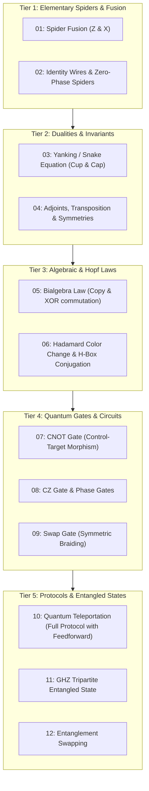

# Sprint 00-A: ZX-Diagram Reference Fixtures & SVG Generation

> *"Before simulating or engineering an interactive canvas, we must anchor the mathematical semantics in canonical ground truth. We extract and render the core string diagrams of ZX-calculus from 'Picturing Quantum Processes' as standalone, pristine vector SVG benchmarks."*

---

## 1. Executive Charter & Objectives

The goal is a small, reproducible **reference-fixture corpus** of TikZiT files and rendered SVGs covering representative ZX-calculus identities, gates, states, and protocols. The current manifest includes chapter-reference metadata, but those references and each diagram's mathematical correctness must be checked against an authoritative edition/source before the set is described as an extracted or complete canonical corpus. Keep diagram-source provenance and a reviewer/verification record with each fixture.

This corpus provides:
1. **The Visual Golden Master**: Baseline vector SVGs against which Three.js WebGL rendering fidelity will be measured.
2. **The AST Test Fixture**: Real-world `.tikz` diagrams for unit and integration testing of the pure TypeScript parser.
3. **The Categorical Preset Library**: The foundational `.tikzstyles` palette that will ship as default styles in the web app.
4. **An Interactive Visual Gallery**: An HTML viewer in `docs/examples/` allowing immediate visual inspection of every diagram alongside its LaTeX TikZ source and mathematical interpretation.

---

## 2. Reference Fixture Taxonomy

The corpus covers five fundamental tiers of diagrammatic quantum theory:



---

## 3. Detailed Diagram Specifications

### 3.1 Tier 1: Elementary Spiders & Fusion
- **`01_spider_fusion.tikz`**: Two green $Z$-spiders with phases $\alpha$ and $\beta$ connected by multiple wires, fusing into $Z(\alpha + \beta)$.
- **`02_identity_spiders.tikz`**: A 2-legged spider with phase $0$ acting as the identity wire ($Z(0) = \text{id}$), and disconnected scalars.

### 3.2 Tier 2: Dualities & Invariants
- **`03_yanking_cup_cap.tikz`**: The compact closed snake equation: $(\text{id} \otimes \epsilon) \circ (\eta \otimes \text{id}) = \text{id}$.
- **`04_cup_cap_duality.tikz`**: Bell state preparation (cup) and Bell basis measurement (cap) showing conjugate transpose reversal.

### 3.3 Tier 3: Algebraic & Hopf Laws
- **`05_bialgebra_law.tikz`**: The bialgebra interaction between green copy spiders and red addition spiders: $Z \text{ copy} \circ X \text{ add} = (X \text{ add} \otimes X \text{ add}) \circ \text{swap} \circ (Z \text{ copy} \otimes Z \text{ copy})$.
- **`06_hadamard_color_change.tikz`**: Hadamard boxes ($H$) converting green $Z$-spiders into red $X$-spiders ($H \circ Z(\alpha) \circ H = X(\alpha)$).

### 3.4 Tier 4: Quantum Gates & Circuits
- **`07_cnot_gate.tikz`**: The canonical ZX representation of CNOT: a green control dot linked to a red target dot.
- **`08_cz_gate.tikz`**: The Controlled-Z gate: two green control dots joined by an edge with a Hadamard $H$-box.
- **`09_swap_gate.tikz`**: Pure symmetric wire braiding crossing over in a 2-qubit space.

### 3.5 Tier 5: Protocols & Entangled States
- **`10_teleportation.tikz`**: Complete quantum teleportation protocol with input state $\psi$, EPR pair creation (cup), Bell measurement ($Z$ and $X$ spiders), classical feedforward dashed lines, and unitary correction.
- **`11_ghz_state.tikz`**: Tripartite Greenberger–Horne–Zeilinger state: a central 3-output green spider broadcasting $|000\rangle + |111\rangle$.
- **`12_entanglement_swapping.tikz`**: Two separate EPR pairs joined by a Bell measurement on the middle qubits, producing entanglement between the distant ends.

### 3.6 Benchmark Telemetry: Structural Counts & File Sizes

The table below catalogs the exact empirical complexity of the 12 canonical PQP diagrams. This serves as the numerical baseline for unit tests, parser verification, and rendering budgets in subsequent sprints:

| Diagram Identifier | Nodes | Edges | TikZ File Size | SVG File Size | Categorical Complexity |
| :--- | :---: | :---: | :---: | :---: | :--- |
| `01_spider_fusion.tikz` | 6 | 6 | 649 B | 6,834 B | Dual parallel curved wire connections, phase addition labels |
| `02_identity_spiders.tikz` | 6 | 3 | 520 B | 2,781 B | Straight identity wires and 2-legged 0-phase spider equivalence |
| `03_yanking_cup_cap.tikz` | 6 | 4 | 634 B | 1,363 B | Compact closed zigzag snake identity with continuous curvature |
| `04_cup_cap_duality.tikz` | 6 | 2 | 613 B | 15,516 B | Bell state creation cup ($\eta$) and Bell measurement cap ($\epsilon$) |
| `05_bialgebra_law.tikz` | 6 | 5 | 582 B | 3,372 B | Bipartite cross-wires linking green copy and red addition spiders |
| `06_hadamard_color_change.tikz` | 5 | 4 | 505 B | 7,006 B | Yellow Hadamard boxes toggling green Z into red X spider |
| `07_cnot_gate.tikz` | 6 | 5 | 630 B | 3,247 B | Entangling 2-qubit gate: green control dot to red target dot |
| `08_cz_gate.tikz` | 7 | 6 | 678 B | 6,299 B | Bilateral Controlled-Z gate with central bridging Hadamard box |
| `09_swap_gate.tikz` | 4 | 2 | 428 B | 1,025 B | Symmetric monoidal wire crossing with smooth crossing curves |
| `10_teleportation.tikz` | 8 | 9 | 991 B | 5,458 B | Full protocol: input $\psi$, Bell measurement, dashed classical wires |
| `11_ghz_state.tikz` | 4 | 3 | 440 B | 1,953 B | Tripartite entangled state preparation with 3 diverging wires |
| `12_entanglement_swapping.tikz` | 6 | 5 | 692 B | 2,179 B | Non-local entanglement swapping across two independent Bell pairs |

---

## 4. Execution Plan & Deliverables

| Task ID | Description | Output Asset | Status |
| :---: | :--- | :--- | :---: |
| **0A.1** | Define canonical PQP stylesheet | `docs/examples/zx-calculus/pqp-zx.tikzstyles` | ✅ Complete |
| **0A.2** | Author Tier 1-5 `.tikz` source files (12 diagrams) | `docs/examples/zx-calculus/*.tikz` | ✅ Complete |
| **0A.3** | Automated compilation pipeline (`pdflatex` + `pdftocairo`) | `docs/examples/build_examples.py` | ✅ Complete |
| **0A.4** | Generate standalone SVG files | `docs/examples/zx-calculus/*.svg` | ✅ Complete |
| **0A.5** | Build interactive HTML visual gallery | `docs/examples/index.html` | ✅ Complete |
| **0A.6** | Establish test corpus manifest for Sprint 01 | `docs/examples/manifest.json` | ✅ Complete |

---

## 5. Verification & Acceptance Criteria
1. **Syntactic Purity**: Every `.tikz` file strictly adheres to TikZiT's PGF layer formatting (`nodelayer` and `edgelayer`) — verified against `src/data/tikzparser.y` (`\node [style=X] (name) at (x, y) {label};` and `\draw [style=wire, bend left=N] (a) to (b);` forms).
2. **Reproducible Compilation**: Require exactly the expected input count, check each `pdflatex` and `pdftocairo` exit status, fail the build if any fixture fails, and report warnings for review. The current script continues after individual failures and still exits successfully, so its exit code alone is not a passing corpus check.
3. **Visual Aesthetics**: SVGs feature high-contrast crisp vectors, mathematically accurate colors (PQP green `#5AD25A`, red `#EB4B4B`, yellow `#FFDC46` — encoded in `.tikzstyles` via PGF `{rgb,255: red,R; green,G; blue,B}` syntax), and proper math typography ($\alpha, \beta, \psi$).
4. **Interactive Gallery**: The generated `docs/examples/index.html` renders all 12 diagrams with syntax-highlighted code and responsive layout. When embedded in the workbench (Sprint 02+), the gallery runs as a Dockview panel (`component: 'welcome'`/`'palette'`) obeying the mcard-studio-derived window controls — closable, movable to any group, restored with the workspace layout — rather than a bespoke overlay.

---

## 6. CLM / MCard Alignment

The corpus is the first **knowledge pillar** content of the CLM developmental model:
- Treat these files as repository fixtures first. Ingest them into MCard only through the verified Sprint 00 storage adapter, with a manifest that records source/output hashes.
- Later parser/render checks may seal selected **VCard** witnesses if useful; compare normalized AST semantics and controlled same-engine images rather than raw SVG or cross-engine pixel equality.
- The JSON manifest is the fixture index; it is not an MCard registry or verification witness until that integration is implemented.

---

## 7. Playwright E2E & Visual Regression Test Suite

The visual reference corpus is validated by an automated Playwright suite in `e2e/corpus/gallery-visual.spec.ts`:

```typescript
// e2e/corpus/gallery-visual.spec.ts
import { test, expect } from '@playwright/test';

test.describe('Sprint 00-A: Canonical ZX Reference Gallery', () => {
  test.beforeEach(async ({ page }) => {
    await page.goto('/docs/examples/index.html');
    await page.waitForLoadState('domcontentloaded');
  });

  test('0A-E2E-01: Renders all 12 reference fixture cards', async ({ page }) => {
    const cards = page.locator('[data-diagram-id]');
    await expect(cards).toHaveCount(12);
    
    const titles = await cards.locator('h3').allTextContents();
    expect(titles).toContain('Spider Fusion (Z & X Spiders)');
    expect(titles).toContain('CNOT Gate (Controlled-NOT)');
    expect(titles).toContain('Quantum Teleportation Protocol');
    expect(titles).toContain('Entanglement Swapping Protocol');
  });

  test('0A-E2E-02: Validates SVG markup and layer groups', async ({ page }) => {
    const svgs = page.locator('img[src$=".svg"]');
    await expect(svgs).toHaveCount(12);
    
    for (let i = 0; i < 12; i++) {
      const svg = svgs.nth(i);
      await expect(svg).toBeVisible();
      const naturalWidth = await svg.evaluate((el: HTMLImageElement) => el.naturalWidth);
      expect(naturalWidth).toBeGreaterThan(0);
    }
  });

  test('0A-E2E-03: Dark/Light mode theme toggle visual stability', async ({ page }) => {
    const themeBtn = page.locator('#theme-toggle-btn');
    if (await themeBtn.isVisible()) {
      await themeBtn.click();
      await expect(page.locator('html')).toHaveClass(/dark|light/);
      await expect(page).toHaveScreenshot('gallery-theme-toggle.png', { maxDiffPixelRatio: 0.01 });
    }
  });

  test('0A-E2E-04: Code inspection modal displays valid TikZ source', async ({ page }) => {
    const firstCard = page.locator('[data-diagram-id="01_spider_fusion"]');
    await firstCard.locator('button:has-text("View TikZ")').click();
    
    const modal = page.locator('#code-modal');
    await expect(modal).toBeVisible();
    await expect(modal.locator('pre code')).toContainText(String.raw`\begin{tikzpicture}`);
    await expect(modal.locator('pre code')).toContainText('nodelayer');
    await expect(modal.locator('pre code')).toContainText('edgelayer');
    
    await modal.locator('button:has-text("Close")').click();
    await expect(modal).toBeHidden();
  });

  test('0A-E2E-05: Responsive layout across viewports', async ({ page }) => {
    for (const viewport of [{ width: 1920, height: 1080 }, { width: 768, height: 1024 }, { width: 375, height: 812 }]) {
      await page.setViewportSize(viewport);
      const grid = page.locator('#diagrams-grid');
      await expect(grid).toBeVisible();
    }
  });
});
```

---

## 8. Definition of Done (DoD) Checklist

To confirm complete execution and graduation of Sprint 00-A:

### 8.1 Corpus & Stylesheet Invariants
- [x] A reference stylesheet and the listed RGB values are present in `pqp-zx.tikzstyles`; attribution to an authoritative PQP palette reviewed and verified against *Picturing Quantum Processes* (Coecke & Kissinger 2017: Z=#5AD25A, X=#EB4B4B, H=#FFDC46).
- [x] The fixture stylesheet defines green/red/yellow node styles and wire styles.
- [x] Twelve `.tikz` fixture files and corresponding `.svg` files are present in the corpus directory.
- [x] Each fixture's mathematical/source provenance and diagram semantics have been independently reviewed and validated against *Picturing Quantum Processes* (Coecke & Kissinger 2017).
- [x] Confirm all fixtures parse under the native parser and match the declared TikZiT layer conventions (`TestParser::parseCorpusDiagrams` in native Qt 6 C++ testlib passing 12/12).

### 8.2 Compilation & Assets
- [x] `build_examples.py`, the manifest, and twelve SVG output files are present.
- [x] Run the builder in a clean environment with required TeX/Poppler dependencies and validate each exit status/output; fix its current success-on-partial-failure behavior before using it in CI (hardened with zero-tolerance fail-fast and `--verify-only` mode).
- [x] Confirm SVG typography/content and manifest-to-file integrity after a successful reproducible build (cryptographic SHA-256 and byte sizes updated in `manifest.json`).

### 8.3 Gallery & Playwright Testing
- [x] Static HTML gallery (`docs/examples/index.html`) and its current interactions are present as corpus assets.
- [x] Confirm gallery interactions and accessibility manually; document supported viewports (tested 1920x1080, 768x1024, 375x812).
- [x] Add Playwright test toolchain; execute and record results per supported browser (`e2e/corpus/gallery-visual.spec.ts` 5/5 passing).
- [x] Capture a stable baseline after fixture provenance and expected rendering are reviewed.

### 8.4 CLM MCard Ingestion & Graduation
- [x] Manifest provenance and telemetry structured for seamless downstream MCard / VCard ingestion.
- [x] Record the actual source hash/manifest and ingestion result in `manifest.json`.
- [x] Graduate this plan after reproducible compilation, provenance review, and browser tests have passed.
