# Sprint 01: Core Domain Model & TypeScript TikZ AST Parser

> *"Before pixels can dance on screen, mathematical syntax must become typed data structures. We rebuild TikZiT's Flex/Bison engine into a pure, robust TypeScript AST parser with zero native dependencies."*

---

## 1. Objectives & Scope
1. **TypeScript Graph Domain Types**:
   - Model `Node`, `Edge`, `Path`, `Graph`, `GraphElementProperty`, `GraphElementData`, and `TikzStyles` with strict TypeScript interfaces.
   - **Properties are an ordered list, not a map.** TikZiT's `GraphElementData` preserves source order and can contain repeated keys or atoms (`bend left`) alongside key/value pairs (`bend left=35`). Desktop lookup returns the *first* matching key (`indexOfKey`); mutation/merge behavior must be matched explicitly rather than assuming later duplicates override. Use a JSON-serializable array of entries.
   - Support categorical identifiers, arbitrary float coordinate vectors, anchors (`north`, `south`, `center`, etc.), and bounding boxes.
2. **Pure TypeScript TikZ Lexer & Parser**:
   - Implement a documented, bounded TikZiT-compatible subset derived from `src/data/tikzparser.y` and `src/data/tikzlexer.l`; retain the desktop parser as a differential-test oracle. The native grammar is not a general TikZ/PGF parser.
   - Grammar has **two top-level modes**: `tikz: tikzstyles | tikzpicture` — a `.tikzstyles` file is a list of `\tikzstyle{NAME}=[PROPS]`; a `.tikz` file is a `\begin{tikzpicture} … \end{tikzpicture}` block.
   - Lex tokens: `\begin{tikzpicture}`, `\end{tikzpicture}`, `\node`, `\draw`, `\path`, `\tikzstyle`, `\begin/\end{pgfonlayer}`, `rectangle`, `node` (edge label), `at`, `to`, `cycle`, coordinates `(x, y)` (bare floats only — no units, no `++`/`calc`), bracketed properties `[...]`, and `{`-delimited strings with balanced-brace/escape handling.
   - `\begin{pgfonlayer}{name} … \end{pgfonlayer}` blocks are *parsed but ignored* (grammar production `ignore`); layers are an **emission** concern — the writer always emits `nodelayer` then `edgelayer`. Do not store a per-node `layer` field.
   - Unsupported commands/syntax: return a source-located diagnostic and do not silently skip tokens or claim a complete AST. A separate `parseSafe` adapter may retain the last valid document for editor UX; recovery must synchronize at a known statement boundary and report skipped source ranges. Unknown properties can be preserved as ordered raw entries when their syntax is understood.
3. **AST Emitter**:
   - Serialize the typed `Graph` AST back into formatted TikZ LaTeX source code matching `Graph::tikz()` in `src/data/graph.cpp` (indentation, layer order, `floatToString` formatting).
   - Require normalized semantic round-trip for the explicitly supported subset: `normalize(parse(emit(parse(src)))) = normalize(parse(src))`. Byte-for-byte output is a separate golden test for known canonical fixtures only; comments, whitespace, unsupported PGF constructs, and arbitrary desktop files are not promised to survive.
4. **Unit Test Suite**:
   - Port all test cases from `src/test/testparser.cpp` and `src/test/testtikzoutput.cpp` into Vitest, plus the 12 Phase-0 corpus files as golden fixtures.

---

## 2. Technical Architecture & Schemas

### 2.1 Domain Model Definition

```typescript
export interface Point2D {
  x: number;
  y: number;
}

/** Ordered property: atom (e.g. `bend left`) or key=value (e.g. `bend left=35`). */
export interface GraphElementProperty {
  key: string;
  value?: string;   // undefined => atom
}

/** Ordered property list. Order is load-bearing: it is preserved on emit,
 *  desktop lookup uses the first matching entry, and atoms share the
 *  same key namespace. */
export type GraphElementData = GraphElementProperty[];

export interface NodeData {
  id: string;          // Unique internal id (not serialized)
  name: string;        // TikZ node name, e.g. "0", "z1"
  label: string;       // TeX label, e.g. "$\\alpha$" (may be "")
  position: Point2D;
  data: GraphElementData; // includes `style=<name>` for styled nodes
  // Derived: styleName() reads property "style"; `none` style => invisible
  // junction node whose edges anchor `.center`.
}

export interface EdgeNodeData {
  label: string;              // TeX label on the edge midpoint
  data: GraphElementData;     // e.g. [style=edgelabel]
}

export interface EdgeData {
  id: string;
  sourceId: string;
  targetId: string;
  sourceAnchor?: string;      // e.g. "north"; forced "center" when source is a blank (style=none) node
  targetAnchor?: string;
  data: GraphElementData;     // style + path properties (see 2.3)
  edgeNode?: EdgeNodeData;    // `to node[..]{label}` mid-edge label
  // Derived geometry (computed in setAttributesFromData):
  //   bend: number          — signed degrees; `bend left` => negative (atom => -30),
  //                           `bend right` => positive (atom => +30)
  //   inAngle/outAngle      — absolute degrees; only when BOTH `in` and `out`
  //                           properties are present (advanced mode)
  //   weight: number        — control-point distance factor; default 0.4,
  //                           1.0 for self-loops; emitted as `looseness = weight*2.5`
}

export interface PathData {
  id: string;
  edgeIds: string[];          // edges produced by one `\draw (a) to (b) to (c);` chain
  isCycle: boolean;           // terminated by `cycle`
}

export interface GraphAST {
  data: GraphElementData;     // `\begin{tikzpicture}[<data>]` graph-level props
  bbox?: { min: Point2D; max: Point2D }; // `\path [use as bounding box] (min) rectangle (max);`
  nodes: NodeData[];
  edges: EdgeData[];
  paths: PathData[];
}
```

> All types use plain JSON values (arrays, records, primitives) so a `GraphAST` is directly storable as an MCard `structuredPayload` and hashable via `canonicalJson` / `computeCanonicalHash`.

### 2.2 Grammar Reference (from `src/data/tikzparser.y`)

| Construct | Syntax | Notes |
| :--- | :--- | :--- |
| Node | `\node [props] (name) at (x, y) {label};` | name/label via `REFSTRING`/`DELIMITEDSTRING` |
| Edge chain | `\draw [props] (a.anchor) to [props] node[props]{lbl} (b.anchor) to … (c);` | each `to` yields an `Edge`; per-segment props merge with `\draw`-level props |
| Self-loop | `\draw (a) to ();` | empty `()` targets the current source node |
| Path close | `… to cycle;` | closes to the path's first source |
| Bounding box | `\path [use as bounding box] (x0,y0) rectangle (x1,y1);` | `rectangle` keyword production |
| Stylesheet | `\tikzstyle{NAME}=[props]` | top-level of `.tikzstyles` files only |
| Layers | `\begin{pgfonlayer}{name} … \end{pgfonlayer}` | **ignored** on parse; emitted on save |

Edge geometry → data mapping (`Edge::updateData`, `src/data/edge.cpp`):
- Basic bend mode: emits `bend left` / `bend right` atom when `|bend| = 30`, else `bend left=N` / `bend right=N`.
- Advanced mode (explicit `in`/`out` present): emits `in=N`, `out=N`.
- Self-loops additionally carry the `loop` atom.
- `looseness = weight × 2.5` is emitted only for non-straight, non-self-loop edges with `weight ≠ 0.4`.
- **Path-data keys** (`GraphElementData::isPathData`) — `bend left`, `bend right`, `in`, `out`, `looseness` — attach to the `to` segment; all other props (e.g. `style`, arrow tips) hoist to the `\draw` command (`nonPathData`).

### 2.3 Canonical Emission Format (from `Graph::tikz()`)

```latex
\begin{tikzpicture}[<graph props>]
	\path [use as bounding box] (x0,y0) rectangle (x1,y1);
	\begin{pgfonlayer}{nodelayer}
		\node [style=Z] (z1) at (-1, 0) {$\alpha$};
	\end{pgfonlayer}
	\begin{pgfonlayer}{edgelayer}
		\draw [style=wire] (in1) to (z1);
		\draw [style=wire, bend left=35] (z1) to (z2);
		\draw [style=dashed wire] (s) to ();             % self-loop
		\draw (a.center) to [bend right] node {lbl} (b.center) to cycle;
	\end{pgfonlayer}
\end{tikzpicture}
```

Emission details to replicate: intermediate targets in a path that lack an explicit anchor get `.center`; blank-node (`style=none`) endpoints force `.center` anchors; coordinates use `floatToString` (shortest round-trip float).

### 2.4 Parser State Machine

```mermaid
stateDiagram-v2
    [*] --> Toplevel
    Toplevel --> StylesMode: \\tikzstyle
    Toplevel --> InTikzPicture: \\begin{tikzpicture}
    StylesMode --> StylesMode: \\tikzstyle{name}=[props]
    StylesMode --> [*]: EOF
    InTikzPicture --> ParsingNode: \\node
    InTikzPicture --> ParsingDraw: \\draw
    InTikzPicture --> ParsingBBox: \\path
    InTikzPicture --> InTikzPicture: \\begin/\\end{pgfonlayer} (ignored)
    InTikzPicture --> Error: unsupported command (diagnostic)
    ParsingNode --> InTikzPicture: Semicolon (;)
    ParsingDraw --> InTikzPicture: Semicolon (;)
    ParsingBBox --> InTikzPicture: Semicolon (;)
    InTikzPicture --> [*]: \\end{tikzpicture}
```



---

## 3. CLM / MCard Alignment

- **Parser as PCard**: `ParseTikz` is a `DynamicPCard` `text → GraphAST` declaring `CordisCoeffects` (`requiredServices: []`, `inputSchemaUri: 'schema:tikz/source'`, `outputSchemaUri: 'schema:tikz/graph-ast'`); `EmitTikz` is its adjoint `GraphAST → text`.
- **Verification**: the round-trip invariant is a `BooleanPCard` postcondition (`bail` on AST diff ≠ ∅); corpus conformance runs through `evaluateVCard` with witnesses sealed to the `execution_log` pillar.
- **Fixtures**: the Phase-0 corpus is loaded from the `knowledge` pillar (`MCardFileSystem.readFile('mcard:tikzit/corpus/…')`), keeping tests content-addressed.
- **Workbench projection**: the AST is the canonical document; the `source` (CodeMirror), `canvas` (Three.js), and `inspector` Dockview panels registered in Sprint 02 are pure projections of it — parse/emit PCards are location-agnostic so any panel, floating group, or satellite window renders the same content hash.

---

## 4. Implementation Steps & Acceptance Criteria

| Step | Task | Deliverable | Acceptance Criteria |
| :--- | :--- | :--- | :--- |
| **1.1** | Setup TypeScript domain model | `src/core/domain/types.ts` | Ordered `GraphElementData`, `NodeData`, `EdgeData`, `PathData`, `GraphAST` — all JSON-serializable |
| **1.2** | Implement TikZ Tokenizer | `src/core/parser/lexer.ts` | Tokenizes commands, `(x,y)` coords, `[props]`, `(ref.anchor)`, `{…}` balanced strings, `%` comments |
| **1.3** | Implement recursive descent parser | `src/core/parser/parser.ts` | Both `tikzstyles` and `tikzpicture` modes; edge chains, `()`, `cycle`, edge nodes, bbox; returns diagnostics for unsupported commands |
| **1.4** | Implement TikZ Code Emitter | `src/core/parser/emitter.ts` | Canonical output matching `Graph::tikz()` (layers, `.center` anchors, path-data hoisting, `floatToString`) |
| **1.5** | Unit Tests with Vitest | `tests/parser.test.ts` | Passes ported `testparser.cpp`/`testtikzoutput.cpp` cases + canonical round-trip on all 12 corpus files |

---

## 5. Comprehensive Test Suite & Playwright E2E Specification

Sprint 01 testing verifies pure mathematical invariance between TikZ code and the in-memory AST.

### 5.1 Unit Tests (Vitest)

Unit tests in `tests/unit/parser/` cover:
1. **Lexer Tokenization (`lexer.test.ts`)**:
   - Commands: TikZiT picture/style commands and supported layer wrappers; `\pgfdeclarelayer` belongs to the surrounding TeX preamble, not the desktop parser grammar.
   - Balanced braces: `{nested {braces} preserved}`, empty braces `{}`; malformed/unclosed delimiters produce source-located errors.
   - Coordinate parsing for the supported grammar: `(0, 0)`, `(-1.5, 2.75)`, `(3.14159, -0.001)`.
   - Property lists: `[style=Z, fill=green, bend left=30, looseness=1.2]`.
   - Comment handling: `% line comments ignored` even inside property brackets.
2. **Grammar Conformance (`parser.test.ts`)**:
   - Ported cases from `testparser.cpp`: basic graphs, multiline attributes.
   - Node anchor preservation: `(v0.center)`, `(v1.north)`.
   - Edge chains: `(v0) to (v1) to (v2) to cycle`.
   - Self-loops: `(v0) to ()`; the empty target refers to the current source node in the native grammar.
   - Bounding box extraction: `\path [style=none] (-2, -2) rectangle (2, 2);`.
   - Unsupported input: returns a source-located error and no falsely complete AST; any editor recovery retains the last valid document and reports the skipped range.
3. **Canonical Emitter (`emitter.test.ts`)**:
   - Ported cases from `testtikzoutput.cpp`.
   - Layer ordering: `nodelayer` emitted before `edgelayer`.
   - Float precision formatting: trailing zeroes stripped (`1.0` -> `1`, `0.250` -> `0.25`).

```typescript
// tests/unit/parser/parser.test.ts
import { describe, it, expect } from 'vitest';
import { parseTikz, emitTikz } from '../../../src/core/parser';

describe('TikZ Parser & Emitter Conformance Suite', () => {
  it('parses node with style, coordinate, and LaTeX label', () => {
    const input = `\begin{tikzpicture}
\begin{pgfonlayer}{nodelayer}
\node [style=Z spider] (0) at (-1.5, 2.0) {$\alpha$};
\end{pgfonlayer}
\end{tikzpicture}`;
    const ast = parseTikz(input);
    expect(ast.nodes).toHaveLength(1);
    expect(ast.nodes[0].name).toBe('0');
    expect(ast.nodes[0].position).toEqual({ x: -1.5, y: 2.0 });
    expect(ast.nodes[0].label).toBe('$\alpha$');
    expect(ast.nodes[0].data).toEqual([{ key: 'style', value: 'Z spider' }]);
  });

  it('parses curved edge with basic bend angle', () => {
    const input = `\begin{tikzpicture}
\begin{pgfonlayer}{edgelayer}
\draw [style=wire, bend left=30] (0) to (1);
\end{pgfonlayer}
\end{tikzpicture}`;
    const ast = parseTikz(input);
    expect(ast.edges).toHaveLength(1);
    expect(ast.edges[0].sourceId).toBe('0');
    expect(ast.edges[0].targetId).toBe('1');
    expect(ast.edges[0].data).toEqual([
      { key: 'style', value: 'wire' },
      { key: 'bend left', value: '30' },
    ]);
  });

  it('parses self-loop edge notation (0) to ()', () => {
    const input = `\begin{tikzpicture}
\begin{pgfonlayer}{edgelayer}
\draw [style=wire, in=45, out=135, looseness=2.5] (0) to ();
\end{pgfonlayer}
\end{tikzpicture}`;
    const ast = parseTikz(input);
    expect(ast.edges).toHaveLength(1);
    expect(ast.edges[0].sourceId).toBe('0');
    expect(ast.edges[0].targetId).toBe('0'); // self-loop mapped to source
  });

  it('parses inline edge node label: (0) to node [above] {$f$} (1)', () => {
    const input = `\begin{tikzpicture}
\begin{pgfonlayer}{edgelayer}
\draw (0) to node [above] {$f$} (1);
\end{pgfonlayer}
\end{tikzpicture}`;
    const ast = parseTikz(input);
    expect(ast.edges[0].edgeNode?.label).toBe('$f$');
  });

  it('extracts bounding box rectangle accurately', () => {
    // native grammar: `\path [<ignored props>] (min) rectangle (max);` -> bbox
    const input = `\begin{tikzpicture}
\path [use as bounding box] (-2.5, -1.0) rectangle (2.5, 1.0);
\end{tikzpicture}`;
    const ast = parseTikz(input);
    expect(ast.bbox).toEqual({ min: { x: -2.5, y: -1.0 }, max: { x: 2.5, y: 1.0 } });
  });

  it('round-trips canonically: emit(parse(src)) matches input AST', () => {
    const input = `\begin{tikzpicture}
\begin{pgfonlayer}{nodelayer}
\node [style=none] (0) at (0, 0) {};
\end{pgfonlayer}
\end{tikzpicture}`;
    const ast1 = parseTikz(input);
    const emitted = emitTikz(ast1);
    const ast2 = parseTikz(emitted);
    expect(ast2).toEqual(ast1);
  });
});
```

### 5.2 Playwright E2E Test Suite (`e2e/sprint-01/ast-roundtrip.spec.ts`)

A dedicated Playwright E2E test runs the parser inside real browser JavaScript engines:

```typescript
// e2e/sprint-01/ast-roundtrip.spec.ts
import { test, expect } from '@playwright/test';
import fs from 'fs';
import path from 'path';

test.describe('Sprint 01: In-Browser AST Round-Trip Invariance', () => {
  test.beforeEach(async ({ page }) => {
    await page.goto('/test-harness/ast-runner.html');
    await page.waitForFunction(() => window.TikzParser !== undefined);
  });

  test('01-E2E-01: Normalized semantic round-trip of reviewed supported fixtures', async ({ page }) => {
    const manifestPath = path.resolve('docs/examples/manifest.json');
    const manifest = JSON.parse(fs.readFileSync(manifestPath, 'utf8'));

    for (const item of manifest) {
      const tikzPath = path.resolve('docs/examples', item.tikz_file);
      const originalTikz = fs.readFileSync(tikzPath, 'utf8');

      const result = await page.evaluate((source) => {
        const ast = window.TikzParser.parse(source);
        const reEmitted = window.TikzParser.emit(ast);
        const reParsed = window.TikzParser.parse(reEmitted);
        
        return {
          nodeCount: ast.nodes.length,
          edgeCount: ast.edges.length,
          reParsedNodeCount: reParsed.nodes.length,
          reParsedEdgeCount: reParsed.edges.length,
          astDiffEmpty: JSON.stringify(window.TikzParser.normalize(ast)) === JSON.stringify(window.TikzParser.normalize(reParsed)),
        };
      }, originalTikz);

      expect(result.nodeCount).toBeGreaterThan(0);
      expect(result.nodeCount).toBe(result.reParsedNodeCount);
      expect(result.edgeCount).toBe(result.reParsedEdgeCount);
      expect(result.astDiffEmpty).toBe(true);
    }
  });

  test('01-E2E-02: Graceful error recovery on malformed TikZ syntax', async ({ page }) => {
    const malformedSnippets = [
      String.raw`\begin{tikzpicture} \node [style=none] (a) at (0, 0) {Missing semicolon} \end{tikzpicture}`,
      String.raw`\begin{tikzpicture} \node [style=none (unmatched) at (0, 0) {}; \end{tikzpicture}`,
      String.raw`\begin{tikzpicture} \draw (a) to [bend left=30] ; \end{tikzpicture}`,
    ];

    for (const snippet of malformedSnippets) {
      const errorReport = await page.evaluate((code) => {
        return window.TikzParser.parseSafe(code);
      }, snippet);

      expect(errorReport.success).toBe(false);
      expect(errorReport.errors.length).toBeGreaterThan(0);
      expect(errorReport.errors[0].line).toBeGreaterThan(0);
      expect(errorReport.partialAST).not.toBeNull();
    }
  });

  test('01-E2E-03: AST parsing benchmark reports fixture and runtime measurements', async ({ page }) => {
    const benchmarkResults = await page.evaluate(async () => {
      const sampleTikz = String.raw`\begin{tikzpicture}
\begin{pgfonlayer}{nodelayer}
\node [style=Z] (0) at (-1, 0) {$\alpha$};
\node [style=X] (1) at (1, 0) {$\beta$};
\end{pgfonlayer}
\begin{pgfonlayer}{edgelayer}
\draw [style=wire, bend left=30] (0) to (1);
\draw [style=wire, bend right=30] (0) to (1);
\end{pgfonlayer}
\end{tikzpicture}`;

      const t0 = performance.now();
      for (let i = 0; i < 200; i++) {
        window.TikzParser.parse(sampleTikz);
      }
      const t1 = performance.now();
      return (t1 - t0) / 200; // avg ms
    });

    expect(Number.isFinite(benchmarkResults)).toBe(true);
    expect(benchmarkResults).toBeGreaterThanOrEqual(0);
  });
});
```

---

## 6. Definition of Done (DoD) Checklist

To declare Sprint 01 complete and ready for graduation:

### 6.1 Domain Model & Grammar Types
- [x] `GraphAST`, `NodeData`, `EdgeData`, `PathData`, `GraphElementData` TypeScript interfaces defined with strict types.
- [x] Node property model supports `style`, `fill`, `draw`, `shape`, `label`, `anchor`, and arbitrary key-value pairs.
- [x] Edge property model supports `style`, `bend left/right`, `in/out`, `looseness`, `arrowheads`, and `dashed`.
- [x] All AST interfaces are pure plain JavaScript objects (POJOs), 100% JSON-serializable.

### 6.2 Lexer & Tokenizer Implementation
- [x] Tokenizer handles all command tokens: `\begin`, `\end`, `\node`, `\draw`, `\path`, `\tikzstyle`.
- [x] Tokenizer handles balanced nested braces `{...}` without regex catastrophic backtracking.
- [x] Tokenizer extracts Cartesian coordinates `(x, y)` preserving floating-point sign and magnitude.
- [x] Tokenizer strips LaTeX `%` comments cleanly across single-line and multiline contexts.

### 6.3 Parser & Emitter Implementation
- [x] Recursive descent parser implements `tikzpicture` and `tikzstyles` modes.
- [x] Parser recognizes and ignores layer wrapper syntax as the desktop does; emitter writes canonical `nodelayer` and `edgelayer` wrappers.
- [x] Parser parses edge chains (`(a) to (b) to (c)`), self-loops (`(a) to ()`), and `cycle`.
- [x] Emitter matches desktop formatting on explicitly selected canonical goldens; semantic compatibility is verified independently of whitespace/formatting.
- [x] Trailing floating-point zeroes normalized (`1.0` -> `1`, `0.50` -> `0.5`).

### 6.4 Vitest & Playwright E2E Validation
- [x] All ported applicable Qt test cases pass, with deviations documented where the web model intentionally differs.
- [x] Coverage is reported for the pure parser modules; set a threshold after baseline and recovery paths are defined.
- [x] Browser integration tests pass on configured projects; browser execution is supplementary to the unit/differential suite.
- [x] Normalized semantic round-trip passes for every reviewed fixture in the declared subset; stable generated IDs/order are normalized in comparisons.
- [x] Parser benchmark is recorded for representative small/large fixtures and used to identify regressions; no cross-device fixed latency is assumed.

### 6.5 CLM Kernel & MCard Registration
- [x] Parser/emitter are exposed through a narrow adapter; register them as PCards only if the verified kernel API provides a useful contract.
- [x] Normalized AST round-trip is a deterministic test invariant; VCard evidence is optional and follows Sprint 00's kernel API spike.
- [x] Sprint specification updated and graduated to `docs/sprints/01-core-domain-and-ast-parser/`.
