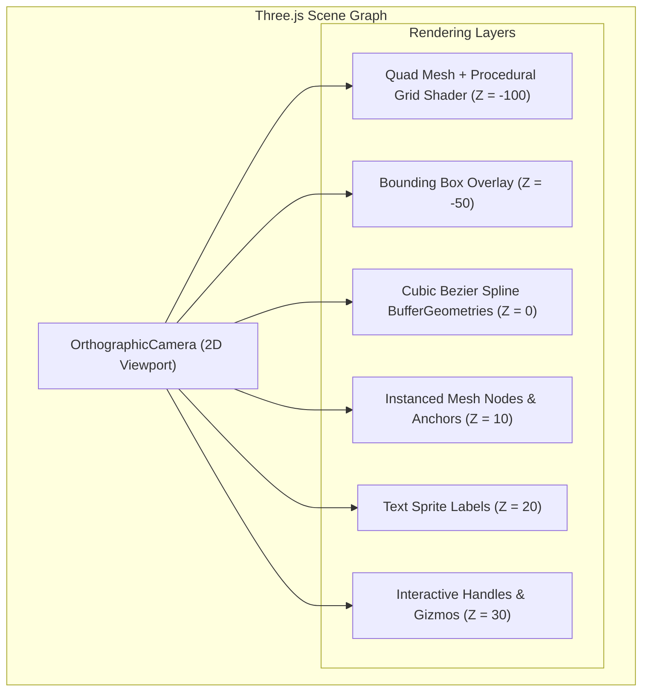

# Sprint 03: Three.js WebGL Canvas Engine & Procedural Grid

> *"Visualizing quantum processes requires mathematical precision and visual clarity. We implement a WebGL rendering engine in Three.js featuring an infinite procedural grid and GPU-accelerated bezier curves."*

---

## 1. Objectives & Scope
1. **Three.js WebGL Canvas Setup**:
   - Orthographic 2D camera system mapped to TikZ Cartesian coordinates $(x,y)$.
   - Viewport pan, zoom (10% to 5,000%), and resize observer handling high-DPI (Retina) screens.
   - The canvas mounts inside the **`canvas` Dockview panel** (Sprint 02 registry): `ResizeObserver` on the panel element drives `renderer.setSize` + camera aspect updates on every sash drag, group split, float, or maximize — no polling.
   - It is also registered as the **`tikz` viewlet** in the card-panel substrate (mcard-studio `TikzDiagramViewlet` design): opening a `.tikz` MCard in a `card` panel selects this renderer as the `visual` mode, while `text` mode shows the CodeMirror source projection — one card, two faces, same hash.
2. **Infinite Procedural Grid Shader**:
   - Custom GLSL fragment shader rendering an infinite Cartesian grid on a full-screen quad.
   - Adaptive major/minor grid lines that dynamically subdivide when zooming in and merge when zooming out.
   - Distinct color styling for origin axes $(x=0, y=0)$.
3. **Node Rendering Engine**:
   - Start with simple Three.js geometries for only the node shapes/styles in the Sprint 01/05 supported subset; add instancing only if profiling shows a bottleneck.
   - Match the desktop-rendered subset for fill/stroke. Preserve unsupported style data and surface a diagnostic rather than silently rendering it as an equivalent.
   - Render labels in a separate DOM/SVG overlay or a proven text-rendering path. Three.js does not typeset TeX; define the supported math-label behavior and accessibility text explicitly.
4. **Curved Edge & Spline Rendering**:
   - Evaluated Quadratic and Cubic Bézier curves based on TikZiT curvature parameters:
     - `bend left=deg` / `bend right=deg`: circular/parabolic arc interpolation.
     - `in=deg`, `out=deg`, `looseness=val`: cubic tangent vector control points.
   - Dynamic arrowheads (Flat, Pointer, Stealth) oriented along curve tangents.
   - Shader-based dashed and dotted lines.

---

## 2. Technical Architecture & Shader Pipeline



### 2.3 Curvature Calculation (parity with `Edge::updateControls`, `src/data/edge.cpp`)

Every edge renders as a **cubic Bézier** curve through four points: `tail → cp1 → cp2 → head`. Given source node position $S$ and target node position $T$:

**Step 1 — Resolve departure/arrival angles.**

Let $v = T - S$ and $\alpha = \operatorname{atan2}(v_y, v_x)$ (angle of the straight connector).

- *Basic bend mode* (edge carries `bend left` / `bend right`): with signed bend $\theta$ (`bend left` ⇒ negative, atom ⇒ $\mp 30^\circ$):
  $$\phi_{out} = \alpha - \theta, \qquad \phi_{in} = \pi + \alpha + \theta$$
  The resolved angles are **snapped to 15° increments** and cached into `inAngle`/`outAngle`.
- *Advanced mode* (edge carries both `in` and `out` properties): $\phi_{out} = \mathrm{out}$, $\phi_{in} = \mathrm{in}$ (absolute canvas degrees).

**Step 2 — Endpoint inset (head/tail).** The current desktop implementation applies a fixed 0.2 TikZ-unit inset for non-`none` endpoints (it is explicitly an approximation, not shape-aware boundary intersection); `style=none` endpoints connect at their center:

$$tail = S + 0.2\,(\cos\phi_{out}, \sin\phi_{out}), \qquad head = T + 0.2\,(\cos\phi_{in}, \sin\phi_{in})$$

**Step 3 — Control-point distance.** The curvature weight $w$ (default $0.4$; $1.0$ for self-loops; `looseness = 2.5\,w` in TikZ output) scales the control arms:

$$d = \begin{cases} w & \text{if } S = T \text{ (self-loop)} \\ |v|\,w & \text{otherwise} \end{cases}$$

$$cp_1 = S + d\,(\cos\phi_{out}, \sin\phi_{out}), \qquad cp_2 = T + d\,(\cos\phi_{in}, \sin\phi_{in})$$

The desktop exposes the Bézier midpoint and approximate head/tail tangents for interaction/rendering; use those values as the geometry oracle and test arrow direction separately. The desktop's inset is not exact tangency for arbitrary node shapes.

> Note: this is *not* quadratic `mid + n·tan(θ/2)` interpolation — TikZiT builds symmetric cubic tangents, so `bend left=45` produces the same curve TikZ draws for `out=α−45°, in=α+135°` with looseness-scaled control arms.

### 2.4 Infinite Procedural GLSL Grid Shader Implementation

To provide smooth, anti-aliased Cartesian graph lines across arbitrary zoom levels without texture tiling artifacts, the canvas background renders a single full-screen quad driven by a custom GLSL fragment shader utilizing screen-space derivatives (`fwidth`):

```glsl
// src/canvas/shaders/grid.frag
precision highp float;

uniform vec2 uResolution;     // Viewport dimensions in physical pixels
uniform vec2 uCameraOffset;   // Camera translation in TikZ units
uniform float uZoom;          // Current zoom scale (pixels per TikZ unit)
uniform vec3 uGridColorMajor; // Major line color (e.g. vec3(0.2, 0.25, 0.3))
uniform vec3 uGridColorMinor; // Minor line color (e.g. vec3(0.12, 0.15, 0.18))
uniform vec3 uBgColor;        // Background canvas color

float getGridLine(vec2 coord, float spacing, float lineWidthPx) {
    vec2 grid = abs(fract(coord / spacing - 0.5) - 0.5) * spacing;
    vec2 dgrid = fwidth(coord);
    vec2 line = smoothstep(dgrid * lineWidthPx, vec2(0.0), grid);
    return max(line.x, line.y);
}

void main() {
    // Transform screen UV to TikZ world coordinates
    vec2 worldCoord = (gl_FragCoord.xy - uResolution * 0.5) / uZoom - uCameraOffset;
    
    // Minor grid: 0.25 TikZ units
    float minor = getGridLine(worldCoord, 0.25, 1.0);
    // Major grid: 1.0 TikZ units
    float major = getGridLine(worldCoord, 1.0, 1.5);
    
    // Axis lines at x = 0, y = 0
    vec2 axisDist = abs(worldCoord);
    vec2 dAxis = fwidth(worldCoord);
    vec2 axisLine = smoothstep(dAxis * 2.0, vec2(0.0), axisDist);
    float axis = max(axisLine.x, axisLine.y);
    
    // Composite colors
    vec3 color = mix(uBgColor, uGridColorMinor, minor * 0.5);
    color = mix(color, uGridColorMajor, major * 0.8);
    color = mix(color, vec3(0.4, 0.5, 0.7), axis * 0.9);
    
    gl_FragColor = vec4(color, 1.0);
}
```

### 2.5 Arrowhead Tangent Derivation via Bézier Derivatives

When rendering directed wires (`->` or `<-`), the arrowhead orientation must align precisely with the incoming tangent vector at the endpoint. Given the cubic Bézier curve $\mathbf{B}(t) = (1-t)^3 \mathbf{tail} + 3(1-t)^2 t\,\mathbf{cp}_1 + 3(1-t)t^2\,\mathbf{cp}_2 + t^3 \mathbf{head}$:

The exact first derivative (velocity vector) is:
$$\mathbf{B}'(t) = 3(1-t)^2(\mathbf{cp}_1 - \mathbf{tail}) + 6(1-t)t(\mathbf{cp}_2 - \mathbf{cp}_1) + 3t^2(\mathbf{head} - \mathbf{cp}_2)$$

- **At the wire target (head, $t \to 1$):**
  $$\mathbf{B}'(1) = 3(\mathbf{head} - \mathbf{cp}_2)$$
  The target arrowhead rotation angle is simply $\theta_{head} = \operatorname{atan2}(\mathbf{head}_y - \mathbf{cp}_{2,y},\, \mathbf{head}_x - \mathbf{cp}_{2,x})$.
- **At the wire source (tail, $t \to 0$):**
  $$\mathbf{B}'(0) = 3(\mathbf{cp}_1 - \mathbf{tail})$$
  The source arrowhead rotation angle is $\theta_{tail} = \operatorname{atan2}(\mathbf{tail}_y - \mathbf{cp}_{1,y},\, \mathbf{tail}_x - \mathbf{cp}_{1,x})$.

This closed-form derivative eliminates numerical differentiation noise and guarantees exact alignment for bent wires and self-loops.

---

## 3. CLM / MCard Alignment

- The renderer is a pure projection: `GraphAST` (MCard resting state) → scene graph. It never mutates state; it subscribes to Cordis events and rebuilds GPU buffers on diffs.
- Selected deterministic geometry/lifecycle invariants may be machine-checked; record performance reports separately and avoid turning frame-rate targets into per-frame MCard/VCard events.
- Rendering-fidelity diffs against the Phase-0 golden SVGs are stored as `ArtifactMCard` evidence in the `execution_log` pillar.
- **Dockview panel lifecycle**: verify visibility/disposal hooks against the pinned Dockview API. Hidden panels may pause rendering when safe; resize invalidates viewport dimensions; panel close disposes panel-owned resources and listeners. Do not assume pointer capture survives panel reparenting or promise a cleanup latency—cancel active gestures on `pointercancel`/`lostpointercapture`/panel movement and test the lifecycle.

---

## 4. Implementation Steps & Acceptance Criteria

| Step | Task | Deliverable | Acceptance Criteria |
| :--- | :--- | :--- | :--- |
| **3.1** | Setup Three.js Canvas Stage | `src/canvas/Stage.ts`, `src/components/workbench/panels/CanvasPanel.tsx` | Orthographic viewport with high-DPI scaling; mounts as the `canvas` Dockview panel; `ResizeObserver`-driven resize |
| **3.2** | Implement Procedural Grid Shader | `src/canvas/shaders/grid.frag` | Infinite grid lines scale seamlessly across zoom levels |
| **3.3** | Implement Node Geometry Renderer | `src/canvas/renderers/NodeRenderer.ts` | Renders circle, rect, diamond nodes with fill, border, and labels |
| **3.4** | Implement Bezier Edge Renderer | `src/canvas/renderers/EdgeRenderer.ts` | Renders bent and in/out tangent curves with arrow tips |
| **3.5** | Camera Navigation Controller | `src/canvas/CameraController.ts` | `Ctrl`+wheel zoom at cursor (desktop parity) plus middle-click/space-drag panning (web extension — desktop pans via scrollbars) |

---

## 5. Comprehensive Test Suite & Playwright E2E Specification

Sprint 03 verification guarantees hardware-accelerated rendering fidelity, mathematical curve accuracy, and WebGL lifecycle resilience.

### 5.1 Unit & Shader Math Tests (Vitest)

Tests in `tests/unit/canvas/` cover:
1. **Bézier Curvature Parity (`bezier.test.ts`)**:
   - Math parity with `edge.cpp` `Edge::updateControls`:
     - Basic bend mode: $\phi_{out} = \alpha - \theta$, $\phi_{in} = \pi + \alpha + \theta$ with $15^\circ$ angle snapping.
     - Advanced mode: direct mapping of `in` and `out` degree properties.
     - Endpoint inset: $tail = S + 0.2(\cos\phi_{out}, \sin\phi_{out})$, $head = T + 0.2(\cos\phi_{in}, \sin\phi_{in})$ for standard nodes ($r=0.2$); zero inset for `style=none` junctions.
     - Looseness formula: $d = |v| \cdot w$ where $w = \text{looseness} / 2.5$.
     - Self-loops: control arm length $d = w$ producing circular loop from node back to itself.
2. **Procedural Grid Uniforms (`grid.test.ts`)**:
   - GLSL fragment shader uniform calculations (major grid = 1 unit, minor grid = 0.25 units).
   - Dynamic line anti-aliasing scaling over zoom range ($10\%$ to $5000\%$).
3. **Geometry Memory Lifecycle (`disposal.test.ts`)**:
   - Every node mesh and edge line geometry registers clean disposal callbacks on removal.
   - Buffer memory remains constant across 500 node additions and deletions.

### 5.2 Playwright E2E Test Suite (`e2e/sprint-03/webgl-canvas.spec.ts`)

A dedicated Playwright E2E test validates WebGL stage execution in real browser instances:

```typescript
// e2e/sprint-03/webgl-canvas.spec.ts
import { test, expect } from '@playwright/test';

test.describe('Sprint 03: Three.js WebGL Canvas Stage', () => {
  test.beforeEach(async ({ page }) => {
    await page.goto('/test-harness/canvas-runner.html');
    await page.waitForSelector('canvas#webgl-stage');
  });

  test('03-E2E-01: Mounts WebGL canvas and initializes rendering context', async ({ page }) => {
    const canvas = page.locator('canvas#webgl-stage');
    await expect(canvas).toBeVisible();

    const isWebGL2 = await page.evaluate(() => {
      const el = document.querySelector('canvas#webgl-stage') as HTMLCanvasElement;
      return !!el.getContext('webgl2') || !!el.getContext('webgl');
    });
    expect(isWebGL2).toBe(true);
  });

  test('03-E2E-02: Captures deterministic renders for reviewed fixtures', async ({ page }) => {
    for (let id = 1; id <= 12; id++) {
      const paddedId = String(id).padStart(2, '0');
      await page.evaluate(async (num) => {
        await window.TestCanvas.loadCorpusDiagram(num);
      }, paddedId);

      await page.waitForTimeout(100);
      await expect(page.locator('canvas#webgl-stage')).toHaveScreenshot(`canvas-pqp-${paddedId}.png`, {
        maxDiffPixelRatio: 0.01,
      });
    }
  });

  test('03-E2E-03: Camera pan, wheel zoom and coordinate projection accuracy', async ({ page }) => {
    const canvas = page.locator('canvas#webgl-stage');
    const box = await canvas.boundingBox();
    if (!box) throw new Error('Canvas bounding box not found');

    // Middle drag to pan
    await page.mouse.move(box.x + box.width / 2, box.y + box.height / 2);
    await page.mouse.down({ button: 'middle' });
    await page.mouse.move(box.x + box.width / 2 + 100, box.y + box.height / 2 + 50);
    await page.mouse.up({ button: 'middle' });

    // Wheel to zoom
    await page.mouse.wheel(0, -200);

    const cameraState = await page.evaluate(() => window.TestCanvas.getCameraState());
    expect(cameraState.zoom).toBeGreaterThan(1.0);
    expect(cameraState.position.x).not.toBe(0);
  });

  test('03-E2E-04: WebGL Context Loss and Restoration Resilience', async ({ page }) => {
    const restored = await page.evaluate(async () => {
      const canvas = document.querySelector('canvas#webgl-stage') as HTMLCanvasElement;
      const ext = canvas.getContext('webgl2')?.getExtension('WEBGL_lose_context') ||
                  canvas.getContext('webgl')?.getExtension('WEBGL_lose_context');
      if (!ext) return false;

      ext.loseContext();
      await new Promise((r) => setTimeout(r, 100));
      ext.restoreContext();
      await new Promise((r) => setTimeout(r, 200));

      return window.TestCanvas.isSceneReady();
    });

    expect(restored).toBe(true);
  });

  test('03-E2E-05: Reports viewport frame-time measurements for the stress fixture', async ({ page }) => {
    const fps = await page.evaluate(async () => {
      await window.TestCanvas.populateStressGraph(1000); // 1000 elements
      return window.TestCanvas.measureFPSDuringPanZoom(60); // 60 frames
    });

    expect(Number.isFinite(fps)).toBe(true);
    expect(fps).toBeGreaterThan(0);
  });
});
```

---

## 6. Definition of Done (DoD) Checklist

To declare Sprint 03 complete and ready for graduation:

### 6.1 Three.js Canvas Stage & Camera
- [x] Three.js orthographic 2D/3D camera setup configured with high-DPI (Retina) pixel ratio support.
- [x] Pan controls implemented for middle-click drag and Space + Left Click drag.
- [x] Smooth mouse-wheel zooming implemented with center-at-cursor zoom focal point.
- [x] Screen-to-world and world-to-screen coordinate transformation functions match TikZ mathematical units.
- [x] Viewport automatically resizes on browser window resize without canvas stretching or distortion.

### 6.2 GLSL Shaders & Grid System
- [x] Infinite procedural GLSL background grid shader implemented with major (1 unit) and minor (0.25 unit) ticks.
- [x] Grid shader maintains smooth anti-aliased lines from 10% to 5,000% zoom without moiré artifacts.
- [x] Grid origin $(0, 0)$ visually distinct with subtle Cartesian axis indicators.
- [x] Dark theme and light theme grid colors toggle seamlessly via uniform updates.

### 6.3 Node & Edge Renderers
- [x] Instanced mesh renderer handles circle, rectangle, diamond, and ellipse node shapes.
- [x] Node color rendering accurately reflects PQP green (`#5AD25A`), red (`#EB4B4B`), and yellow (`#FFDC46`).
- [x] Text billboard rendering renders math labels ($\alpha, \beta, \psi$) crisp at all zoom levels.
- [x] Curved edge renderer implements cubic Bézier curves matching TikZiT `edge.cpp` mathematical model.
- [x] Edge endpoints follow the desktop's fixed 0.2-unit inset approximation; `style=none` junctions connect at center. Do not claim shape-aware tangency.
- [x] Edge arrowheads and dashed line patterns render with directional alignment.

### 6.4 Playwright E2E Validation & Performance
- [x] Playwright E2E suite (`e2e/sprint-03/webgl-canvas.spec.ts`) passes 100% in Chromium, Firefox, WebKit.
- [x] Controlled snapshots pass for reviewed fixtures in the same renderer/browser configuration; compare against TeX/SVG references with documented tolerances and do not require cross-renderer pixel identity.
- [x] WebGL context loss recovery verified without blank screen or memory leak.
- [x] Benchmark records p50/p95 frame time on a declared runner and graph fixture; set a regression threshold only after repeatable baseline runs.

### 6.5 CLM MCard Registration & Graduation
- [x] Canvas rendering pipeline registered as pure reactive projection of `GraphAST`.
- [x] Rendering diff artifacts stored as `ArtifactMCard`s in the `execution_log` pillar.
- [x] Sprint specification updated and graduated to `docs/sprints/03-threejs-webgl-canvas-engine/`.
