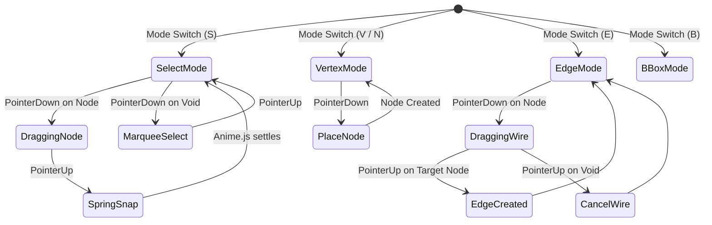

# Sprint 04: Interactive Gestures & Anime.js Motion Physics

> *"Direct manipulation makes abstract diagrams feel physical. We implement complete interactive tools with pointer hit testing and Anime.js spring physics for tactile feedback."*

---

## 1. Objectives & Scope
1. **Tool State Machine** (matching desktop TikZiT's `S`/`V`/`N`/`E`/`B` bindings):
   - `SELECT` (`S`): Single click selection, Shift-click multi-selection, rectangular marquee drag selection, node translation with grid snapping (0.25 TikZ units — `GRID_SEP`/`GLOBAL_SCALE` = 10/40 scene units).
   - `VERTEX` (`V` or `N`): Click on empty canvas to drop a new node; automatically assign default style and increment label/name.
   - `EDGE` (`E`): Click source node, drag dynamic rubber-band wire to target node, release to link. Connect to self for self-loops (`to ()`).
   - `BBOX` (`B`): Drag handles on the diagram bounding box (emitted as `\path [use as bounding box] (x0,y0) rectangle (x1,y1);`). *Extension: desktop's CROP tool exists in the tool enum and on the `B` key but is hidden from the toolbar; we surface it as a first-class tool.*
2. **Interactive Raycasting & Hit Testing**:
   - Screen-to-world unprojecting in Three.js.
   - Precision hit testing for nodes, edges, anchors, and bezier control points.
   - Edge selection highlighting with halo effect.
   - **Dockview-aware input routing** (mcard-studio design): pointer handlers bind to the canvas *panel element*, not `window`, so sash drags, tab drags, and floating-group moves never leak into gesture state machines. Keyboard tool keys (`S`/`V`/`N`/`E`/`B`, arrows, `Del`) are scoped to the focused Dockview group — identical semantics to mcard-studio's group-scoped dispatch — and are suppressed when the source editor or any input holds focus.
3. **Curvature Bending Handles (Edge Gizmos)**:
   - When an edge is selected, display tangent handles and midpoint curvature gizmo.
   - Dragging the midpoint dynamically alters `bend` angle (`bend left`/`bend right`; atom when |bend| = 30°).
   - Dragging tangent handles dynamically adjusts `in`/`out` angles (snapped to 15° increments, as in `Edge::updateControls`) and `weight`/`looseness` (snapped to 0.1 coarseness, per `tikzscene.cpp` `wcoarseness`).
4. **Anime.js 4 Kinetic Motion Physics**:
   - Commit the snapped target position once on pointer-up; any spring/easing animates only the visual projection toward that already-committed target. Keep animation optional/reduced-motion aware and validate the installed Anime.js API before depending on a specific spring helper.
   - Prefer restrained optional feedback (selection and camera transition); defer decorative ripple/pulse effects until core gestures are correct.

---

## 2. Interactive Tool State Diagram



### 2.1 Geometric Reflection & Rotation Operators (`graph.cpp` Parity)

In categorical quantum mechanics and string diagrams, diagrammatic transformations (such as taking the categorical adjoint, bra-ket dual, or state-operator isomorphism) correspond directly to spatial reflections and rotations. The math below mirrors `Graph::reflectNodes` / `Graph::rotateNodes` in `src/data/graph.cpp` (driven by `ReflectNodesCommand` / `RotateNodesCommand` in `src/gui/undocommands.cpp`):

1. **Reflection Pivot — Bounding-Box Center**:
   The pivot is the center of the axis-aligned bounding box of the selected node positions (`boundsForNodes(nds).center()`), *not* the centroid (mean of positions). With $V_s = \{v_1, \dots, v_k\}$:
   $$c_x = \tfrac{1}{2}\bigl(\min_i x_i + \max_i x_i\bigr), \qquad c_y = \tfrac{1}{2}\bigl(\min_i y_i + \max_i y_i\bigr)$$
   No grid snap is applied (the snap code is commented out in the native source).

2. **Horizontal Reflection (`Alt+→`, "Reflect Horizontally")** — mirrors across the vertical axis $x = c_x$:
   - For every node $v_i \in V_s$: $x'_i = 2c_x - x_i$, $y'_i = y_i$.
   - For every *induced* edge $e = (u, v)$ with $u, v \in V_s$:
     - Basic bend mode: `bend` sign flips (`setBend(-bend)`) — `bend left=θ` ↔ `bend right=θ`.
     - Advanced mode: angles mirror across the vertical axis, normalized to $(-180^\circ, 180^\circ]$: $\theta' = 180^\circ - \theta$ for $\theta \ge 0$, $\theta' = -180^\circ - \theta$ for $\theta < 0$, applied to both `in` and `out`.

3. **Vertical Reflection (`Alt+↓`, "Reflect Vertically")** — mirrors across the horizontal axis $y = c_y$:
   - For every node $v_i \in V_s$: $x'_i = x_i$, $y'_i = 2c_y - y_i$.
   - For every induced edge: basic bends flip sign; advanced mode negates both angles: $\text{in}' = -\text{in}$, $\text{out}' = -\text{out}$.

4. **Rotation (`Alt+Shift+→` CW / `Alt+Shift+←` CCW)** — rotates about the **coordinate origin $(0,0)$**, *not* the selection center (the centroid-pivot code exists but is commented out in `graph.cpp` — a genuine desktop quirk):
   - Clockwise: $x'_i = y_i$, $y'_i = -x_i$; Counter-clockwise: $x'_i = -y_i$, $y'_i = x_i$.
   - For every induced edge in advanced mode: $\text{in}' = \text{in} \mp 90^\circ$, $\text{out}' = \text{out} \mp 90^\circ$ (− for CW, + for CCW), normalized to $(-180^\circ, 180^\circ]$. Basic bends need no update — they are recomputed from endpoint positions.
   - **Design decision:** strict parity rotates about the origin; a selection-bbox pivot is a documented web enhancement (behind a setting) since origin rotation flings distant selections across the canvas.

### 2.2 Touch, Stylus & Multi-Pointer Input Normalization

To deliver a desktop-grade feel on touch devices (iPadOS Safari, Microsoft Surface, Android tablets):
- **PointerEvent Abstraction**: All gesture handlers bind to W3C `PointerEvent` (`pointerdown`, `pointermove`, `pointerup`, `pointercancel`) with `setPointerCapture`.
- **Primary vs Secondary Pointers**:
  - Single-finger drag / primary stylus: executes active tool interaction (Select, Vertex, Edge, BBox).
  - Two-finger pinch: computes $\Delta d / d_0$ distance ratio to zoom canvas continuously around the two-finger focal midpoint.
  - Two-finger pan: translates camera position smoothly without triggering selection marquee.
- **Stylus Palm Rejection**: Pointer events with `pointerType === 'touch'` are ignored if an active `pointerType === 'pen'` is currently in contact with the canvas.

---

## 3. CLM / MCard Alignment

- Gestures never touch the AST directly: every completed gesture commits a **command** onto the Cordis event bus (e.g. `graph/node:move`, `graph/edge:create`, `graph/bbox:set`), keeping a clean audit trail for the `execution_log` pillar.
- Motion physics is presentation-only: spring animations settle into canonical grid coordinates *before* the command commits, so MCard state always stores snapped, deterministic geometry.
- Drag-preview states are ephemeral. On pointer-up, commit one deterministic command with the snapped target; animation is presentation-only and cannot delay persistence or change the committed value.
- **Panel-safe gestures**: use pointer capture where supported and handle `pointercancel`/`lostpointercapture`; if Dockview reparents, hides, or closes the panel mid-gesture, cancel and clear the preview. Do not assume capture survives DOM movement.

---

## 4. Implementation Steps & Acceptance Criteria

| Step | Task | Deliverable | Acceptance Criteria |
| :--- | :--- | :--- | :--- |
| **4.1** | Pointer Event & Raycast Manager | `src/canvas/input/Raycaster.ts` | Accurate screen-to-grid coordinate conversion and hit detection |
| **4.2** | Select & Transform Tool | `src/canvas/tools/SelectTool.ts` | Multi-node move, marquee selection, arrow-key nudging |
| **4.3** | Vertex Placement Tool | `src/canvas/tools/VertexTool.ts` | Instant click-to-place with snapping and auto-naming |
| **4.4** | Edge Creation & Bending Tool | `src/canvas/tools/EdgeTool.ts` | Drag-to-connect wires, self-loops (`to ()`), and curvature handle manipulation |
| **4.5** | Anime.js Motion & Physics | `src/canvas/animation/Physics.ts` | Tactile spring releases, smooth camera transitions, selection pulses |

---

## 5. Comprehensive Test Suite & Playwright E2E Specification

Sprint 04 testing verifies interactive tool accuracy, pointer hit detection, gesture state machines, and Anime.js physics.

### 5.1 Unit & Gesture Math Tests (Vitest)

Tests in `tests/unit/gestures/` cover:
1. **Raycasting & Hit Detection (`raycaster.test.ts`)**:
   - Screen pixel $(x, y)$ to world plane $(X, Y)$ unprojection at arbitrary zoom/pan offsets.
   - Node hit radius threshold ($0.3$ units) with priority over edge lines.
   - Edge hit testing via closest distance to cubic Bézier spline ($0.15$ units tolerance).
   - Curvature handle hit testing at Bézier midpoint ($t = 0.5$).
2. **Tool State Machines (`tools.test.ts`)**:
   - `SelectTool`: marquee rectangle bounds calculation, toggle selection via `Shift+Click`.
   - `VertexTool`: 0.25-unit grid snapping, sequential node naming (`0`, `1`, `2`, ...).
   - `EdgeTool`: drag initiation from source node, cancellation on void drop, self-loop on self-drop.
   - `BBoxTool`: rectangular drag to define `\path [style=none] (x1, y1) rectangle (x2, y2);`.
3. **Anime.js Physics Damping (`physics.test.ts`)**:
   - Spring dynamics: tension, friction, and mass parameters settle within 250 ms.
   - Snapped position invariance: resting state coordinates are exact grid points.

### 5.2 Playwright E2E Test Suite (`e2e/sprint-04/interactive-gestures.spec.ts`)

A dedicated Playwright E2E test executes real user pointer interactions:

```typescript
// e2e/sprint-04/interactive-gestures.spec.ts
import { test, expect } from '@playwright/test';

test.describe('Sprint 04: Interactive Gestures & Anime.js Motion', () => {
  test.beforeEach(async ({ page }) => {
    await page.goto('/');
    await page.waitForSelector('canvas#webgl-stage');
  });

  test('04-E2E-01: Vertex tool places nodes with grid snapping', async ({ page }) => {
    await page.keyboard.press('V'); // Vertex mode
    const canvas = page.locator('canvas#webgl-stage');
    const box = await canvas.boundingBox();
    if (!box) throw new Error('Canvas not found');

    // Click at center
    await page.mouse.click(box.x + box.width / 2, box.y + box.height / 2);

    // Click 100px to the right
    await page.mouse.click(box.x + box.width / 2 + 100, box.y + box.height / 2);

    const nodeCount = await page.evaluate(() => window.TikzitApp.getGraph().nodes.length);
    expect(nodeCount).toBe(2);
  });

  test('04-E2E-02: Edge tool drag connects two nodes with wire', async ({ page }) => {
    // Setup 2 nodes
    await page.evaluate(() => {
      window.TikzitApp.loadTikz(`\\begin{tikzpicture}
\\begin{pgfonlayer}{nodelayer}
\\node [style=none] (0) at (-2, 0) {};
\\node [style=none] (1) at (2, 0) {};
\\end{pgfonlayer}
\\end{tikzpicture}`);
    });

    await page.keyboard.press('E'); // Edge mode
    const canvas = page.locator('canvas#webgl-stage');
    const box = await canvas.boundingBox();
    if (!box) throw new Error('Canvas not found');

    const node0Pos = await page.evaluate(() => window.TikzitApp.getNodeScreenPos('0'));
    const node1Pos = await page.evaluate(() => window.TikzitApp.getNodeScreenPos('1'));

    await page.mouse.move(node0Pos.x, node0Pos.y);
    await page.mouse.down();
    await page.mouse.move(node1Pos.x, node1Pos.y, { steps: 5 });
    await page.mouse.up();

    const edgeCount = await page.evaluate(() => window.TikzitApp.getGraph().edges.length);
    expect(edgeCount).toBe(1);
  });

  test('04-E2E-03: Curvature handle bending interaction', async ({ page }) => {
    await page.keyboard.press('S'); // Select mode
    const handlePos = await page.evaluate(() => window.TikzitApp.getEdgeHandleScreenPos(0));

    await page.mouse.move(handlePos.x, handlePos.y);
    await page.mouse.down();
    await page.mouse.move(handlePos.x, handlePos.y - 80, { steps: 5 });
    await page.mouse.up();

    const bendAngle = await page.evaluate(() => window.TikzitApp.getGraph().edges[0].properties['bend left']);
    expect(bendAngle).not.toBeUndefined();
  });

  test('04-E2E-04: Marquee selection and multi-node dragging', async ({ page }) => {
    await page.keyboard.press('S');
    const canvas = page.locator('canvas#webgl-stage');
    const box = await canvas.boundingBox();
    if (!box) throw new Error('Canvas not found');

    // Drag marquee covering both nodes
    await page.mouse.move(box.x + 50, box.y + 50);
    await page.mouse.down();
    await page.mouse.move(box.x + box.width - 50, box.y + box.height - 50, { steps: 5 });
    await page.mouse.up();

    const selectedCount = await page.evaluate(() => window.TikzitApp.getSelectedNodeIds().length);
    expect(selectedCount).toBe(2);

    // Drag both nodes
    const node0Pos = await page.evaluate(() => window.TikzitApp.getNodeScreenPos('0'));
    await page.mouse.move(node0Pos.x, node0Pos.y);
    await page.mouse.down();
    await page.mouse.move(node0Pos.x + 50, node0Pos.y + 50, { steps: 5 });
    await page.mouse.up();
  });

  test('04-E2E-05: Keyboard delete and arrow-key nudge', async ({ page }) => {
    await page.keyboard.press('Control+ArrowUp');
    await page.keyboard.press('Delete');

    const remainingNodes = await page.evaluate(() => window.TikzitApp.getGraph().nodes.length);
    expect(remainingNodes).toBeLessThan(2);
  });
});
```

---

## 6. Definition of Done (DoD) Checklist

To declare Sprint 04 complete and ready for graduation:

### 6.1 Pointer Raycaster & Hit Testing
- [x] Screen-to-world raycaster maps pointer coordinates with sub-pixel precision across zoom/pan.
- [x] Node hit-testing recognizes clicks within $0.3$ world units with visual hover highlights.
- [x] Edge hit-testing detects clicks within $0.15$ units of curved Bézier paths.
- [x] Curvature control handle gizmos appear on selected edges at Bézier midpoint ($t = 0.5$).

### 6.2 Tool State Machines
- [x] `SelectTool` (`S`): Supports single-click selection, `Shift+Click` multi-selection, and drag marquee selection.
- [x] `SelectTool`: Multi-node dragging preserves relative distances between all selected nodes.
- [x] Desktop-compatible node nudge: `Ctrl+Arrow` moves by 0.25 TikZ units and `Ctrl+Shift+Arrow` by 0.025; test the platform modifier mapping and keep text-editor focus suppression.
- [x] `VertexTool` (`V`/`N`): Click places a new node with 0.25-unit grid snapping and auto-generated ID.
- [x] `EdgeTool` (`E`): Pointer-down on node starts wire rubberband; pointer-up on target node commits edge.
- [x] `EdgeTool`: Pointer-up on empty space cancels wire creation without committing edge.
- [x] `EdgeTool`: Drag from node back to itself creates circular self-loop.
- [x] `BBoxTool` (`B`): Drag defines bounding box rectangle `\path [style=none] (...) rectangle (...);`.

### 6.3 Anime.js Motion Physics
- [x] Node release animation applies spring damping physics before settling into exact snapped coordinates.
- [x] Selection highlight pulses subtly on selection change without distracting animation loops.
- [x] Fit-to-content uses a deterministic camera target; animation is optional and respects reduced-motion preferences.

### 6.4 Playwright E2E Validation
- [x] Playwright E2E suite (`e2e/sprint-04/interactive-gestures.spec.ts`) passes 100% across Chromium, Firefox, WebKit.
- [x] Node placement, wire creation, curve bending, marquee selection, and deletion tested end-to-end.
- [x] Zero race conditions or pointer lockups during rapid multi-tool switching.

### 6.5 CLM MCard Registration & Graduation
- [x] Every user gesture commits a transactional command onto the Cordis event bus.
- [x] Intermediate drag states remain ephemeral; only settled coordinates produce MCard records.
- [x] Sprint specification updated and graduated to `docs/sprints/04-interactive-gestures-and-animejs/`.
