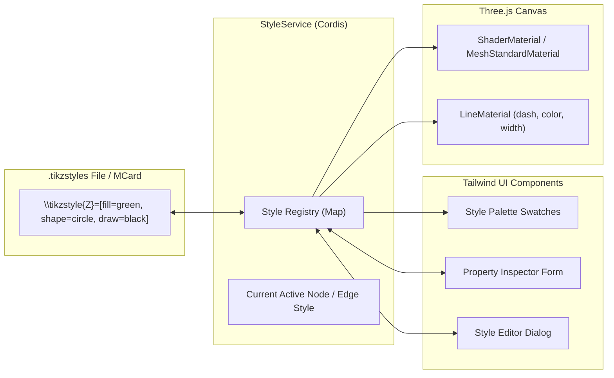

# Sprint 05: Style Palette & Category Property Inspector

> *"String diagrams depend on semantic visual categories: green and red spiders in ZX-calculus, state preparations, effects, and unitary boxes. We build a comprehensive style engine and Tailwind property inspector."*

---

## 1. Objectives & Scope
1. **TikZ Stylesheet Engine (`\tikzstyle`)**:
   - Parse and serialize TikZ style files (`.tikzstyles` — top-level `\tikzstyle{NAME}=[PROPS]` lists per `tikzparser.y`).
   - Styles are ordered `GraphElementData` property lists — the same model as node/edge data (Sprint 01). A node's style is just its `style=NAME` property.
   - Support standard PGF/TikZ style attributes:
     - `fill`/`draw`: named LaTeX colors (`red`, `green`, `blue`, `black`, `white`, `teal`, `gray`), hex, and the PGF extended-RGB syntax used throughout the corpus: `{rgb,255: red,R; green,G; blue,B}`.
     - Preserve arbitrary ordered properties, but initially render only attributes with verified desktop behavior. The current desktop `strokeThickness()` is fixed at 1 and its node renderer implements circle, rectangle, and triangle; do not claim `line width`, `minimum size`, `inner sep`, or diamond geometry have desktop parity until tested.
     - `none` is a TikZiT style/name semantic used for invisible junction nodes; it is not a general PGF shape. Preserve raw shape values that the canvas does not support.
     - `scale`: size scaling factors.
     - `arrow`: arrowhead types (`->`, `<-`, `<->`, `none`; `-` = no arrow).
     - `dash pattern`: `solid`, `dashed`, `dotted`.
   - **Style categorization**: desktop TikZiT groups palette styles by the `tikzit category` property inside each style's property list (`TikzStyles::categories()`); replicate this so `.tikzstyles` files carry their own UI taxonomy.
   - **Node vs edge styles**: mirror `Style::isEdgeStyle()`'s actual classification by supported arrow-tip atoms (`->`, `<-`, `-|`, etc.); a `dashed` atom alone does not classify a style as an edge style. Keep this legacy behavior explicit and test it against the Qt implementation.
2. **Category Style Palette (Dockview `palette` panel, Tailwind UI)**:
   - Dockable panel showcasing style swatches — closable, movable to any Dockview group, restorable via the Activity Bar or `Cmd+Shift+P` (`cmd:view:palette`).
   - `.tikzstyles` files also open as first-class documents in `card` panels via a `tikzstyles` viewlet (mcard-studio `SchemaYamlViewlet` design): structured per-style property tables in `visual` mode, raw source in `text` mode.
   - Categorized collections:
     - **ZX-Calculus**: Green Spider (Z), Red Spider (X), Hadamard (H-box), Ground, Measurement.
     - **Quantum Circuits**: Qubit wires, Classical wires, Unitary boxes, Swap gates.
     - **Monoidal Categories**: Objects (wires), Morphisms (boxes), Duals, Cups, Caps.
   - Single-click to set active style; double-click to apply to currently selected nodes/edges.
3. **Property Inspector Panel** (Dockview `inspector` panel):
   - Inspect and edit individual properties of the selected element.
   - Live color pickers with alpha channel support.
   - Numerical sliders for bend angle, in/out angles, looseness, and label weight.
   - Direct text input for Node Label with live TeX symbol preview.
   - Follows mcard-studio panel conventions: default-docked right of the editor grid, tab-compatible with `palette`, closable/reopenable without losing form state (state lives in the Cordis store, not the panel).
4. **Style Editor Modal**:
   - Comprehensive dialog to create, modify, rename, duplicate, and delete styles.
   - Live swatch preview rendering the style in real time.

---

## 2. Technical Architecture & Style Flow



### 2.1 PGF RGB Color Serialization Mathematics

TikZiT stylesheets declare arbitrary 24-bit RGB colors using PGF's extended color syntax:
`{rgb,255: red,R; green,G; blue,B}` where $R, G, B \in [0, 255]$.

1. **PGF String to CSS / Three.js Hex**:
   $$\text{Color}(R, G, B) = (R \ll 16) | (G \ll 8) | B$$
   Example: `{rgb,255: red,90; green,210; blue,90}` $\implies$ `0x5AD25A` (PQP Z-spider green).

2. **Hex to PGF String Emitter**:
   Given a hex string `#RRGGBB`:
   $$R = \operatorname{parseInt}(\text{hex}[1..2], 16), \quad G = \operatorname{parseInt}(\text{hex}[3..4], 16), \quad B = \operatorname{parseInt}(\text{hex}[5..6], 16)$$
   Serialized as: `fill={rgb,255: red,` + $R$ + `; green,` + $G$ + `; blue,` + $B$ + `}`.

3. **Standard Named Color Map**:
   Named LaTeX colors (`white`, `black`, `red`, `green`, `blue`, `cyan`, `magenta`, `yellow`, `gray`, `darkgray`, `lightgray`) map directly to their official xcolor/SVG hex values, with fallbacks for standard TikZ shades (`green!50!black`).

### 2.2 Direct Drag-and-Drop Swatch Application Workflow

In addition to selecting elements and clicking a palette swatch, users can drag style swatches directly from the Style Palette onto the Three.js canvas:
- **Drag Initiation**: Pointer-down on a swatch card initiates HTML5 drag with payload `{ type: 'tikzit/style', name: styleName, targetKind: 'node' | 'edge' }`.
- **Canvas Hover Feedback**: As the dragged swatch hovers over the WebGL canvas, the raycaster highlights any underlying node or edge with a glowing dashed bounding ring.
- **Drop Execution**: Dropping the swatch onto an element immediately issues an `ApplyStyleToNodesCommand` or `ApplyStyleToEdgesCommand`, updating the AST and committing an undoable transaction without requiring prior selection.

---

## 3. CLM / MCard Alignment

- Stylesheets are documents in the **`knowledge` pillar**: each `.tikzstyles` file is stored as an MCard under `mcard:tikzit/styles/…` and referenced by content hash, so diagrams pin the exact palette they were authored against.
- Applying a style is a command (`ApplyStyleToNodesCommand` / `ApplyStyleToEdgesCommand`, mirroring `undocommands.h`) that rewrites the element's `style=` property — undoable and audited. Satori `<execute pcard="tikzit:apply-style" …>` proposals from the chat panel enter through this same command path.
- Style-parse and palette-consistency checks verify known style references; implement as ordinary tests first and register a BooleanPCard only if the verified kernel contract adds value.

---

## 4. Implementation Steps & Acceptance Criteria

| Step | Task | Deliverable | Acceptance Criteria |
| :--- | :--- | :--- | :--- |
| **5.1** | Style Parser & Model | `src/core/styles/TikzStyleModel.ts` | Parses and formats `\tikzstyle` statements with all TikZiT properties |
| **5.2** | Pre-bundled Style Libraries | `src/core/styles/presets/` | Includes ZX-calculus, Quantum, and Standard TikZiT palettes |
| **5.3** | Style Palette Component | `src/components/styles/StylePalette.tsx` | Swatch grid with category filtering and instant application |
| **5.4** | Property Inspector Panel | `src/components/inspector/PropertyInspector.tsx` | Sliders, inputs, and color pickers for selected nodes and edges |
| **5.5** | Style Editor Modal | `src/components/styles/StyleEditorModal.tsx` | Add, edit, clone, and remove styles with live preview |

---

## 5. Comprehensive Test Suite & Playwright E2E Specification

Sprint 05 verification guarantees stylesheet parsing accuracy, swatch grid category organization, and synchronized property editing.

### 5.1 Unit & Style Model Tests (Vitest)

Tests in `tests/unit/styles/` cover:
1. **TikZ Stylesheet Parser (`styleParser.test.ts`)**:
   - Parses `\tikzstyle{name}=[properties]` statements.
   - PGF RGB color format: `{rgb,255: red,R; green,G; blue,B}` with $R, G, B \in [0, 255]$.
   - Category extraction from the style property `tikzit category=Spiders`, matching `Style::category()` / `TikzStyles::categories()`; comments are not category metadata.
   - Node property behavior implemented by desktop: fill/draw defaults, `shape` circle/rectangle/triangle, and TikZiT-specific color overrides; keep unknown properties in the ordered source model.
   - Edge style classification/drawing: supported arrow-tip atoms, draw color, dashed/dotted atoms. Record line-width behavior as a known desktop limitation unless separately implemented as an intentional web extension.
2. **Style Registry & Inheritance (`registry.test.ts`)**:
   - Style lookup by name with fallback to default styles.
   - Style cloning, rename, and dependency tracking (preventing deletion of in-use styles).
   - Category filtering over categories present in the test stylesheet, including uncategorized styles; use a synthetic stylesheet fixture for `tikzit category` coverage.
3. **Property Inspector Synchronization (`inspector.test.ts`)**:
   - Editing node label text immediately updates AST and canvas billboard.
   - Editing phase angle (`\alpha`, `\pi/2`, `0`) updates LaTeX label format.
   - Multi-node selection property editing: applies style changes uniformly across all selected elements.

### 5.2 Playwright E2E Test Suite (`e2e/sprint-05/style-palette.spec.ts`)

A dedicated Playwright E2E test validates the styling user journey:

```typescript
// e2e/sprint-05/style-palette.spec.ts
import { test, expect } from '@playwright/test';

test.describe('Sprint 05: Style Palette & Property Inspector', () => {
  test.beforeEach(async ({ page }) => {
    await page.goto('/');
    await page.waitForSelector('#style-palette-island');
  });

  test('05-E2E-01: Renders palette categories and styles from the loaded stylesheet', async ({ page }) => {
    const categories = page.locator('.style-category-tab');
    await expect(categories.first()).toBeVisible();

    const zSpiderSwatch = page.locator('button[data-style-name="Z"]');
    await expect(zSpiderSwatch).toBeVisible();

    const xSpiderSwatch = page.locator('button[data-style-name="X"]');
    await expect(xSpiderSwatch).toBeVisible();
  });

  test('05-E2E-02: Applies a stylesheet entry to a selected canvas node', async ({ page }) => {
    // Select node 0 on canvas
    await page.evaluate(() => window.TikzitApp.selectNode('0'));

    // Apply the green Z style
    await page.locator('button[data-style-name="Z"]').click();

    // Verify node style updated in graph model and inspector
    const nodeStyle = await page.evaluate(() => window.TikzitApp.getGraph().nodes[0].style);
    expect(nodeStyle).toBe('Z');

    const inspectorStyleInput = page.locator('#node-style-select');
    await expect(inspectorStyleInput).toHaveValue('Z');
  });

  test('05-E2E-03: Property Inspector edits label and phase angle', async ({ page }) => {
    await page.evaluate(() => window.TikzitApp.selectNode('0'));

    const labelInput = page.locator('#node-label-input');
    await labelInput.fill('\\alpha');
    await labelInput.press('Enter');

    const updatedLabel = await page.evaluate(() => window.TikzitApp.getGraph().nodes[0].label);
    expect(updatedLabel).toBe('\\alpha');
  });

  test('05-E2E-04: Edge property inspector configures wire styles', async ({ page }) => {
    await page.evaluate(() => window.TikzitApp.selectEdge(0));

    const dashedCheckbox = page.locator('#edge-dashed-checkbox');
    await dashedCheckbox.check();

    const isDashed = await page.evaluate(() => {
      const edge = window.TikzitApp.getGraph().edges[0];
      return edge.properties['dashed'] !== undefined;
    });
    expect(isDashed).toBe(true);
  });

  test('05-E2E-05: Style Editor modal creates and saves new custom style', async ({ page }) => {
    await page.locator('#open-style-editor-btn').click();
    const modal = page.locator('#style-editor-modal');
    await expect(modal).toBeVisible();

    await modal.locator('#new-style-btn').click();
    await modal.locator('#style-name-input').fill('Custom Blue Node');
    await modal.locator('#style-fill-color').fill('#3B82F6');
    await modal.locator('#save-style-btn').click();

    await expect(modal).toBeHidden();
    await expect(page.locator('button[data-style-name="Custom Blue Node"]')).toBeVisible();
  });
});
```

---

## 6. Definition of Done (DoD) Checklist

To declare Sprint 05 complete and ready for graduation:

### 6.1 Stylesheet Parser & Data Model
- [x] Parser handles standard `\tikzstyle` statements matching desktop TikZiT grammar.
- [x] PGF RGB `{rgb,255: ...}` values map to the rendering color model while preserving round-trip source data.
- [x] The `tikzit category` style property organizes palette categories; comments are not treated as metadata.
- [x] Pre-bundled stylesheets packaged for `pqp-zx.tikzstyles`, standard quantum circuits, and plain TikZ.

### 6.2 Style Palette Island UI
- [x] Category tabs filter categories actually present in the loaded stylesheet; test category metadata using a fixture with explicit `tikzit category` properties.
- [x] Swatches render miniature high-contrast preview glyphs reflecting fill, border, shape, and dashes.
- [x] Clicking a swatch with elements selected applies the style instantly and commits an undoable command.
- [x] Double-clicking a swatch or right-clicking opens the Style Editor modal.

### 6.3 Property Inspector Island UI
- [x] Context-sensitive inspector displays appropriate fields when a node, edge, or nothing is selected.
- [x] Expose inspector fields only when the selected property is supported by the current rendering/editing path; preserve other raw properties for source editing.
- [x] Core fields cover style selection, node label, supported fill/draw/shape values, edge arrow/dash settings, and edge bend/in/out/looseness. Mark non-parity extensions clearly.
- [x] Multi-selection displays shared properties and allows bulk attribute updates.
- [x] Live updates propagate bidirectionally between inspector inputs and Three.js canvas materials.

### 6.4 Style Editor Modal
- [x] Modal dialog allows adding new styles, editing existing styles, cloning styles, and deleting unused styles.
- [x] Live preview pane within modal renders sample node or edge with active style parameters.
- [x] Confirmation prompt prevents accidental deletion of styles referenced by existing diagram elements.

### 6.5 Playwright E2E Validation & CLM Registration
- [x] Playwright E2E suite (`e2e/sprint-05/style-palette.spec.ts`) passes 100% in Chromium, Firefox, WebKit.
- [x] Stylesheets persisted as immutable MCards under `mcard:tikzit/styles/...`.
- [x] Sprint specification updated and graduated to `docs/sprints/05-style-palette-and-inspector/`.
