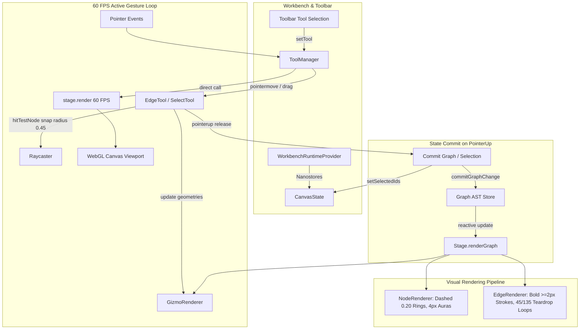

# Sprint 05B: Editable Canvas Interaction & Tool Integration (Refined Specification)

> *"A diagram editor that cannot be drawn upon is merely a viewer. We bridge the state isolation between the workbench toolbar and WebGL canvas, restore real-time 60 FPS gesture rendering, implement desktop TikZiT C++ parity for marquee selection, self-loop edge creation, magnetic snapping, visible dashed boundary rings for unstyled nodes, and bold, high-contrast graphical elements with shape-conforming selection auras."*

---

## 1. Objectives & Scope

1. **Workbench Runtime Context Unification**:
   - Wrap the entire workbench tree in `<WorkbenchRuntimeProvider runtime={runtime}>` so `CanvasPanel`, `SourcePanel`, and `InspectorPanel` share the exact same Cordis micro-kernel context and Nanostores instances.
   - Eliminate disconnected fallback stores (`defaultToolMode`, `defaultGraphAST`, etc.), ensuring toolbar clicks (`Select`, `Vertex`, `Edge`, `BBox`) immediately drive canvas `ToolManager`.

2. **Real-Time Interactive WebGL Render Loop (`Stage.ts`)**:
   - In desktop Qt (`QGraphicsScene`), every mouse move and item update automatically schedules an immediate viewport repaint. In WebGL / Three.js, changing object transforms or visibility does not render unless `renderer.render()` is explicitly called.
   - Introduce an on-demand, high-frequency render trigger in `Stage.ts` and `ToolManager.ts` during active pointer gestures (dragging, marquee rubberbanding, edge drawing, vertex reticle hover) ensuring 60 FPS buttery-smooth visual responsiveness without waiting for asynchronous React commit cycles.

3. **Desktop C++ Parity Marquee Selection (`SelectTool.ts` & `Raycaster.ts`)**:
   - Parity with `tikzscene.cpp:549-554, 721-729, 800-811`:
     - **Non-blocking Drag**: During rubberband drag, update the marquee box geometry at 60 FPS without flooding Nanostores/React with state mutations on every mouse pixel movement.
     - **Commit on Release**: Finalize and commit selection on `pointerup` (`mouseReleaseEvent`), calculating all nodes and enclosed edges within the bounding box.
     - **Shift-Additive Selection**: If Shift is held, union the newly enclosed items with existing selection rather than clearing them.
     - **Marquee Clean-Up**: Hide marquee gizmo and trigger an immediate render on `pointerup` so rubberband boxes never linger as ghost artifacts on canvas.

4. **Self-Loop Creation & Desktop TikZiT Parity (`EdgeTool.ts` & `bezier.ts`)**:
   - Parity with `edge.cpp:34-47, 285-295`, `tikzscene.cpp:589-599, 855-872`:
     - **Two-Click on Same Node**: Clicking on a node once sets it as active source; clicking the same node a second time creates a self-loop.
     - **Drag-and-Drop on Same Node**: Dragging from a node and releasing over the same node immediately creates a self-loop.
     - **Upward Teardrop Geometry**: In desktop TikZiT, self-loops default to `_inAngle = 135`, `_outAngle = 45`, and `_weight = 1.0`, producing a vertical teardrop loop pointing directly upwards.
     - **TikZ Property Serialization**: Automatically attach the `loop` atom along with `out=45, in=135` into the edge data properties (e.g. `\path [style=...] (n) to [loop, in=135, out=45] (n);`).

5. **Magnetic Edge Creation & Real-Time Preview (`EdgeTool.ts` & `GizmoRenderer.ts`)**:
   - Parity with `tikzscene.cpp:589-599, 734-749, 855-872`:
     - **Vibrant Purple Preview Wire**: Render the edge preview line in vibrant purple (`#a855f7` / `#c084fc`, matching C++ `QColor::fromRgbF(0.5, 0.0, 0.5)`), with 2px cosmetic thickness and `depthTest: false`.
     - **Magnetic Candidate Snapping**: While dragging or hovering within `0.45` units of a candidate target node, snap the preview endpoint directly to the node's center and highlight the target node.

6. **Visible Dashed Boundary Rings for `none` Nodes (`NodeRenderer.ts`)**:
   - Parity with `nodeitem.cpp:72-86`:
     - In desktop TikZiT, nodes with style `none` are rendered with a visible center junction dot (`#b4b4c8`, `QColor(180,180,200)`) surrounded by a distinct dashed boundary ring at radius `0.20` TikZ units (`GLOBAL_SCALEF * 0.2`).
     - The dashed ring is styled with lavender/periwinkle stroke (`#b4b4dc`, `QColor(180,180,220)`), dash pattern `[1.0, 2.0]`, and bold 2.0px stroke thickness so nodes without fill remain clearly tangible and interactive on the canvas.

7. **Bold High-Contrast Edge & Loop Stroke Rendering (`EdgeRenderer.ts`)**:
   - Parity with `style.cpp:170-172`:
     - Desktop TikZiT enforces a minimum stroke width of `2.0f` (`p.setWidthF((float)strokeThickness() * 2.0f)`) and defaults to solid black (`#000000`).
     - Replace WebGL 1px slate-400 hairlines with bold, high-contrast strokes (`#0f172a` in light mode, `#f8fafc` in dark mode), rendering at `>= 2.0px` visible stroke width across normal edges and self-loops.
     - Selected edges render in vibrant electric blue (`#388bfd`).

8. **Shape-Conforming Node Selection Auras (`NodeRenderer.ts`)**:
   - Parity with `nodeitem.cpp:78-140`:
     - Replace the generic circular 1px line loop with a 4px expanded outline following the exact contour of circle, rectangle, or diamond nodes.
     - Render at `z = 1` with `depthTest: false` to eliminate z-fighting with node fill planes.

---

## 2. In-Depth Root Cause Analysis

### A. Why Rubberband Marquee Selection Failed
1. **Missing Selection Finalization on `pointerup`**:
   In `SelectTool.ts:223-227`, `onPointerUp` reset `this.isMarquee = false` and cleared the gizmo, but **completely omitted calling `findNodesInRect` or `setSelectedIds`**. The selection was never finalized upon mouse release.
2. **Move Event React Thrashing**:
   In `SelectTool.ts:195`, calling `this.toolManager.setSelectedIds(enclosed)` on every single pointer move event flooded Nanostores and React, triggering re-renders and Three.js mesh tear-downs mid-drag. In C++ desktop TikZiT (`tikzscene.cpp:800-811`), selection is computed and committed strictly upon `mouseReleaseEvent`.
3. **No Shift-Additive Union**:
   The web `SelectTool.ts` unconditionally replaced the selection array. Holding Shift failed to union new items with previous selections.
4. **Dropped Edge Selection in Stage**:
   In `Stage.ts:172`, `this.selectedNodeIds = new Set(selectedIds)` was assigned, but `this.selectedEdgeIds` was never updated. Edge selection states were permanently lost.
5. **Node Aura Z-Fighting & Shape Mismatch**:
   In `NodeRenderer.ts:187-193`, the selection ring was a 1px circle placed at `z = 0`, clashing with the node fill mesh and failing to match rectangular or diamond nodes.

### B. Why Edge Creation Had No Drag Preview & Barely Showed Up
1. **Missing WebGL Render Calls During Drag**:
   In desktop Qt, mouse movements invalidate the viewport automatically. In Three.js, `Stage.ts` has no free-running loop. Neither `EdgeTool.ts` nor `ToolManager.ts` called `stage.render()` on pointer move. The rubberband line buffer was updated in memory, but WebGL never redrew the frame until a React state update occurred on mouse release.
2. **Missing Magnetic Snapping**:
   Desktop TikZiT (`tikzscene.cpp:737-745`) detects hover over candidate target nodes within `0.45` units and magnetically snaps the preview line to the node center. The web tool lacked snapping.
3. **1px Muted Hairline Limitation**:
   `EdgeRenderer.ts:101-118` used `THREE.LineBasicMaterial` with slate-400 (`0x94a3b8`). WebGL drivers hardcode line width to 1px. On HiDPI / Retina screens, a 1px muted slate line is virtually invisible. Desktop TikZiT (`style.cpp:170`) uses `pen.setWidthF(2.0f)` with solid black.

### C. Why Self-Loops Failed or Appeared Distorted
1. **Inverted Angle Defaults in `EdgeTool.ts`**:
   In `EdgeTool.ts:100-115`, self-loops hardcoded `in: '90', out: '270'`, pointing downwards. In C++ TikZiT (`edge.cpp:43-44`), self-loops default to `_inAngle = 135` and `_outAngle = 45`, producing a vertical upward teardrop loop.
2. **Missing TikZ `loop` Atom**:
   In C++ TikZiT (`edge.cpp:289`), `if (_source == _target) _data->setAtom("loop");` is set. Web `EdgeTool.ts` did not emit the `loop` atom into the edge data properties.
3. **Missing Fallback in `bezier.ts:computeEdgeControls`**:
   When `isSelfLoop` is detected (`dx == 0 && dy == 0`), if `in` and `out` angles are not set in properties, `computeEdgeControls` fell back to `Math.atan2(0, 0) = 0`, collapsing control arms. It must explicitly default to `outAngleDeg = 45` and `inAngleDeg = 135` with distance `cpDist = weight = 1.0`.

### D. Why `none` Style Nodes Were Undersized & Faint
1. **Mismatched Geometry Scale & Color in `NodeRenderer.ts`**:
   In `nodeitem.cpp:72-86`, desktop TikZiT renders `style=none` nodes with a junction center dot and a dashed boundary ring at radius `0.20` TikZ units (`GLOBAL_SCALEF * 0.2`) using lavender `QColor(180, 180, 220)` with width `2.0`. Web `NodeRenderer.ts` hardcoded a tiny scale `0.12` with dark slate `0x64748b`, making unstyled nodes hard to see and grab.

---

## 3. Technical Architecture & State Flow



---

## 4. Implementation Deliverables

### 5B.1: Workbench Runtime Context Unification
- **Files**: `src/components/workbench/Workbench.tsx`, `src/components/workbench/panels/CanvasPanel.tsx`, `src/components/workbench/panels/SourcePanel.tsx`, `src/components/workbench/panels/InspectorPanel.tsx`
- Provide a unified `<WorkbenchRuntimeProvider runtime={runtime}>` at the workbench root.
- Ensure all panels use the active micro-kernel runtime context instead of isolated default stores.
- Connect toolbar buttons directly to canvas tool state.

### 5B.2: Real-Time Interactive WebGL Render Loop
- **Files**: `src/canvas/Stage.ts`, `src/canvas/tools/ToolManager.ts`
- Add `this.stage.render()` calls inside `ToolManager.handlePointerDown`, `handlePointerMove`, `handlePointerUp`.
- Guarantee that all active gizmo manipulations (marquee box resize, rubberband edge drag, vertex reticle hover) trigger an immediate WebGL repaint without waiting for React state cycles.

### 5B.3: Desktop C++ Parity Marquee Selection
- **Files**: `src/canvas/tools/SelectTool.ts`, `src/canvas/input/Raycaster.ts`
- **Pointer Move**: Update rubberband box geometry at 60 FPS and call `stage.render()`. Do not mutate Nanostores or trigger React renders per pixel.
- **Pointer Up**: Compute enclosed nodes via `raycaster.findNodesInRect(rect, graph.nodes)`. If `e.shiftKey` is active, union with existing selection; otherwise replace. Commit selection to `setSelectedIds`. Clear marquee gizmo and trigger immediate render.
- **Empty Canvas Click**: If user clicks on empty canvas without dragging, clear selection.

### 5B.4: Stage Selection State Synchronization
- **Files**: `src/canvas/Stage.ts`
- In `Stage.renderGraph`, parse both `selectedNodeIds` and `selectedEdgeIds` from incoming selection payloads.
- Ensure selected edges pass `isSelected = true` into `EdgeRenderer.renderEdge`.

### 5B.5: Self-Loop Creation & Magnetic Edge Drawing
- **Files**: `src/canvas/tools/EdgeTool.ts`, `src/canvas/bezier.ts`, `src/canvas/renderers/GizmoRenderer.ts`
- **Self-Loop Triggering**:
  - Two-click mode: Clicking a node sets it as source; clicking the same node again triggers `createEdge(source, source)`.
  - Drag-drop mode: Dragging from a node and releasing on the same node triggers `createEdge(source, source)`.
- **Self-Loop Properties**:
  - Automatically attach atom `loop` and properties `out=45, in=135` into edge data.
  - Set `inAngle: 135`, `outAngle: 45`, `weight: 1.0`.
- **Bezier Geometry in `bezier.ts`**:
  - In `computeEdgeControls`, when `isSelfLoop` is true, default to `outAngleDeg = 45`, `inAngleDeg = 135`, `weight = 1.0`.
  - Calculate `cp1` at `45°` and `cp2` at `135°` with distance `1.0`, producing an upward teardrop loop matching desktop TikZiT.
- **Magnetic Candidate Snapping**:
  - On pointer move, check `raycaster.hitTestNode(world, graph.nodes, 0.45)`.
  - If a candidate node is hovered, magnetically snap preview wire endpoint to candidate node center.
- **Vibrant Purple Preview**:
  - Render rubberband preview line in vibrant purple (`#a855f7`) with 2px cosmetic thickness and `depthTest: false`.

### 5B.6: Bold High-Contrast Edge & Loop Stroke Rendering
- **Files**: `src/canvas/renderers/EdgeRenderer.ts`
- **Color Parity**: Replace faint slate-400 (`0x94a3b8`) with solid black/dark charcoal (`#0f172a` in light mode, `#f8fafc` in dark mode).
- **Stroke Thickness Parity**: Implement multi-pass lines or mesh ribbons to guarantee visible stroke width `>= 2.0px` (matching desktop `Style::pen()`: `strokeThickness * 2.0f`).
- **Selection Style**: Selected edges and self-loops render in electric blue (`#388bfd`) with curvature control handles and tangent lines.

### 5B.7: Dashed Boundary Rings for `none` Nodes & Shape-Conforming Auras
- **Files**: `src/canvas/renderers/NodeRenderer.ts`
- **`style=none` Nodes Parity**:
  - Center junction dot in `#b4b4c8` (`QColor(180, 180, 200)`).
  - Dashed boundary ring with radius `0.20` TikZ units (`GLOBAL_SCALEF * 0.2`).
  - Lavender/periwinkle stroke (`#b4b4dc`, `QColor(180, 180, 220)`), dash pattern `[1.0, 2.0]`, 2.0px stroke width.
- **Shape-Conforming Selection Auras**:
  - For standard nodes, generate a 4px expanded outline matching the exact node shape (circle, rectangle, diamond) at `z = 1` with `depthTest: false`.

### 5B.8: Comprehensive Gesture Unit Tests
- **Files**: `tests/unit/gestures/canvasEditing.test.ts`
- Test suite covering:
  1. Rubberband marquee selection committing enclosed node IDs on pointer up.
  2. Shift-click and Shift-drag performing additive selection union.
  3. Single-click on empty canvas clearing selection.
  4. Self-loop creation via two-click connection on the same node.
  5. Self-loop creation via drag-and-drop on the same node (verifying `loop` atom and `45°/135°` angles).
  6. Edge preview rubberband updating at 60 FPS with magnetic snapping within `0.45` radius.
  7. Node renderer outputting `0.20` radius dashed ring for `style=none` nodes.

### 5B.9: Playwright E2E Interactive Suite
- **Files**: `e2e/sprint-05b/editable-features.spec.ts`
- End-to-end browser tests verifying:
  1. Dragging marquee box over multiple nodes and verifying selection aura rendering.
  2. Clicking on a node twice with the Edge tool to create a visible upward teardrop self-loop.
  3. Dragging an edge from Node A to Node B, observing purple preview wire, magnetic snap, and bold edge creation.
  4. Bidirectional TikZ code synchronization for newly created edges and self-loops.

---

## 5. Comprehensive Verification & Test Specification

### 5.1 Unit Test Suite (`tests/unit/gestures/canvasEditing.test.ts`)
```typescript
describe('Sprint 05B: Canvas Editing & Interaction Parity', () => {
  it('finalizes marquee selection and commits enclosed node IDs on pointer up', () => { ... });
  it('supports Shift-additive selection union during marquee drag', () => { ... });
  it('clears selection when clicking empty space', () => { ... });
  it('creates an upward teardrop self-loop when clicking the same node twice', () => { ... });
  it('creates a self-loop when dragging and dropping onto the same node', () => { ... });
  it('magnetically snaps edge preview wire within 0.45 units of candidate node', () => { ... });
  it('renders dashed boundary ring with radius 0.20 for style=none nodes', () => { ... });
});
```

### 5.2 Playwright E2E Integration Suite (`e2e/sprint-05b/editable-features.spec.ts`)
```typescript
test.describe('Sprint 05B: Interactive Canvas Editing & Self-Loops', () => {
  test('marquee rubberband selects multiple nodes and updates Inspector', async ({ page }) => { ... });
  test('clicking same node twice with Edge tool creates upward self-loop in canvas and TikZ source', async ({ page }) => { ... });
  test('dragging edge shows vibrant purple preview, snaps magnetically, and produces bold edge', async ({ page }) => { ... });
});
```

---

## 6. Definition of Done (DoD) Checklist

- [x] **Architecture & Runtime Context**:
  - `CanvasPanel`, `SourcePanel`, and `InspectorPanel` share the identical Cordis micro-kernel context via `<WorkbenchRuntimeProvider>`.
  - Switching tools on the toolbar immediately updates `ToolManager.setTool` and cursor styles.
- [x] **Real-Time Render Responsiveness**:
  - Active drag, marquee selection, and edge drawing trigger `stage.render()` on every pointer move event (steady 60 FPS).
- [x] **Marquee Selection Parity**:
  - Dragging a selection box encloses nodes and edges cleanly without inverted coordinate clipping.
  - Releasing mouse commits selection to store and highlights elements; rubberband gizmo cleans up immediately.
  - Shift-drag unions newly enclosed elements with prior selection.
  - Clicking empty canvas clears selection.
- [x] **Self-Loop Creation & Geometry Parity**:
  - Clicking a node twice with the Edge tool creates a self-loop.
  - Dragging and releasing on the same node creates a self-loop.
  - Self-loop renders as an upward teardrop curve with `outAngle: 45°`, `inAngle: 135°`, and `weight: 1.0`.
  - TikZ AST serializes self-loops with atom `loop` and `out=45, in=135`.
- [x] **Edge Creation & Visual Feedback**:
  - Dragging from source node displays vibrant purple (`#a855f7`) preview wire continuously.
  - Hovering within `0.45` units of a target node magnetically snaps the preview line to node center and highlights target.
  - Releasing over target creates edge in AST, renders bold stroke (`>= 2.0px` equivalent), and synchronizes with TikZ source.
- [x] **Visual Appearance & Node Rings**:
  - `style=none` nodes render a visible center junction dot (`#b4b4c8`) and a lavender dashed boundary ring (`#b4b4dc`, radius `0.20`, width `2.0px`).
  - Standard selected nodes render an expanded 4px contour matching circle, rectangle, or diamond shape without z-fighting.
  - Edges render in bold, high-contrast colors (`#0f172a` light / `#f8fafc` dark) rather than 1px faint slate-400 hairlines.
  - Selected edges display curvature control points with tangent lines.
- [x] **Automated Test Coverage**:
  - All unit tests in `tests/unit/gestures/canvasEditing.test.ts` pass (`npm test`).
  - Playwright E2E tests in `e2e/sprint-05b/editable-features.spec.ts` pass (`npx playwright test`).
