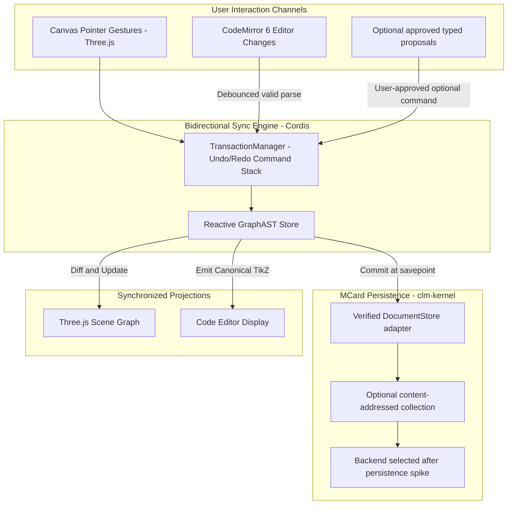

# Sprint 07: Bidirectional State Synchronization & MCard Storage

> *"In categorical editing, code and geometry are dual aspects of the same morphism. We build a bidirectional synchronization engine and content-addressed MCard storage layer."*

---

## 1. Objectives & Scope
1. **Bidirectional Two-Way Code/Canvas Synchronization**:
   - **Canvas → Code**: Moving nodes, creating edges, or editing properties on the Three.js stage automatically emits updated TikZ code in the code drawer.
   - **Code → Canvas**: Debounce parsing while typing. Keep the last valid AST/canvas visible when the current buffer is syntactically incomplete, show source-located diagnostics, and only replace the document projection after a successful parse. Start with full parse of the bounded supported subset; add incremental parsing only after profiling justifies it.
   - Preserve editor selection/cursor by avoiding unnecessary editor resets; do not rewrite source on every pointer-move.
2. **Transactional Undo/Redo Engine**:
   - Command pattern stack reproducing Qt's `QUndoStack` usage in `src/gui/undocommands.h`.
   - Discrete commands mirroring the desktop set: `MoveCommand`, `AddNodeCommand`, `AddEdgeCommand`, `DeleteCommand`, `EdgeBendCommand`, `ChangeEdgeModeCommand`, `ApplyStyleToNodesCommand`, `ApplyStyleToEdgesCommand`, `ChangeLabelCommand`, `PasteCommand`, `ReplaceGraphCommand`, `ReflectNodesCommand`, plus `ChangeBboxCommand` for the BBOX tool.
   - History stack with undo/redo bound to `Cmd/Ctrl+Z` / `Cmd/Ctrl+Shift+Z`; coalescing for continuous gestures (drag, bend).
3. **MCard Categorical Persistence (`clm-kernel`)**:
   - Keep persistence behind a TikZiT-owned `DocumentStore` port. Before binding it to `clm-kernel`, pin the package and prove the actual MCard creation, handle/history, browser storage, error, and recovery APIs with a small integration test; examples below are design sketches, not verified calls.
   - Persist immutable document snapshots at explicit save/idle checkpoints, not on every keystroke or pointer event. Dirty editor buffers and undo state remain in the working session until committed; a failed commit must not pretend an append-only store rolled back an already-written card.
   - Verify the selected backend's persistence/quota/corruption semantics and add a bounded migration/recovery path. Distinguish hash identity, mutable URI/handle resolution, and the app's current working copy.
   - An append-only collection or G-Set does not by itself provide multi-writer merge/conflict resolution. Start with single-writer documents and explicit base-hash conflict detection; add collaboration only as a separate design.
   - **Tri-Database mapping (conditional)**: if the verified kernel supports the intended pillars, assign committed diagrams/workspace state to `mcard`, shared styles/corpus to `knowledge`, and selected command/verification receipts to `execution_log`. Do not log high-frequency UI events.
4. **Multi-Document Tabs & File Management**:
   - Multi-tab document workspace (open multiple `.tikz`/`.md` diagrams simultaneously), each bound to an `mcard:` URI handle — surfaced as Dockview `card` panels (Sprint 02 substrate).
   - Drag-and-drop file import (`.tikz`, `.tikzstyles`, `.md`) via `fileToMCard` ingestion.
   - Debounced autosave at a documented idle/checkpoint boundary with unsaved-change indicators (`*`); do not append an immutable snapshot for every keystroke. Preserve a recoverable dirty buffer if persistence is unavailable.
   - **Workspace layout persistence**: version the serialized Dockview layout schema, validate it before `fromJSON`, debounce meaningful changes, and retain the last valid layout if the panel set becomes empty during teardown. Persist via the verified workspace-store adapter; only promote it to MCard handle history if measured write volume and recovery behavior support that choice.
   - **Version UI (conditional)**: if the verified backend exposes stable handle history, show versions and restore by creating a new current revision. Keep this feature out of the MVP if the contract is not available.
5. **Optional Conversational Programming Spike (Koishi/Satori)**:
   - If a chat panel is introduced later: turns use a narrow typed proposal flow built on a verified kernel/provider adapter with explicit user approval before dispatch.
   - LLM responses are untrusted. Parse only a typed allowlist, never execute markup or code; if Satori-compatible action proposals are used, convert them into typed commands, validate referenced handles, show a diff, require explicit approval, and dispatch through the ordinary undoable command path.
   - Optional slash commands and chat persistence are deferred until the provider, consent, and storage contracts are defined.
   - If shipped, retain only user-approved action provenance and safe verification summaries; never log credentials or full private prompts by default.

---

## 2. Technical Architecture & State Synchronization



### 2.1 Canonical Persistence Flow

```typescript
// Design sketch only: adapt these operations to the exact pinned clm-kernel API.
interface DocumentStore {
  load(handle: string): Promise<{ hash: string; source: string } | null>
  commit(handle: string, source: string, expectedBaseHash?: string): Promise<{ hash: string }>
}

// Keep the editor's dirty buffer in session state until an explicit/debounced commit.
const saved = await documentStore.commit(handle, source, currentBaseHash)
```

### 2.2 Monaco / CodeMirror TikZ Syntax Highlighting Grammar

To provide a first-class code editing experience in the TikZ source drawer, the editor ships a TikZ tokenizer. **Monarch is Monaco-only** — when CodeMirror 6 is used (per Sprint 01's editor choice), the same token table is ported to `@codemirror/legacy-modes` `StreamLanguage` (or a Lezer grammar if richer parsing is needed):

```typescript
// src/components/editor/tikzMonarch.ts
export const tikzLanguageDefinition = {
  defaultToken: '',
  tokenPostfix: '.tikz',

  // NOTE: only backslash-commands can match @keywords, since the
  // command rule below captures `\<name>`. Bare keywords like `to`
  // and `cycle` get their own word-boundary rule.
  keywords: [
    'begin', 'end', 'node', 'draw', 'path', 'tikzstyle',
    'pgfdeclarelayer', 'pgfsetlayers'
  ],

  tokenizer: {
    root: [
      // LaTeX commands: \node, \draw, \begin, etc.
      [/\\[a-zA-Z@]+/, {
        cases: {
          '@keywords': 'keyword',
          '@default': 'type.identifier'
        }
      }],

      // Bare grammar keywords: `to`, `cycle`, `rectangle`, `at`, `node`
      [/\b(?:to|cycle|rectangle|at|node)\b/, 'keyword'],

      // Node and coordinate identifiers: (0), (a.center)
      [/\([a-zA-Z0-9_\.]+\)/, 'variable.name'],

      // Coordinate pairs: (-1.5, 2.0)
      [/\(-?\d+(?:\.\d+)?\s*,\s*-?\d+(?:\.\d+)?\)/, 'number.coordinate'],

      // Property keys and assignments: [style=Z spider, bend left=30]
      // Word boundaries prevent `in`/`out`/`fill` matching inside words.
      [/\b(?:style|fill|draw|shape|inner\s+sep|bend\s+left|bend\s+right|in|out|looseness)\b/, 'attribute.name'],

      // Math mode labels: $\alpha$, $\beta$, $0$
      [/\$[^$]*\$/, 'string.math'],

      // Curly brace blocks: {label}
      [/\{/, { token: 'delimiter.curly', bracket: '@open' }],
      [/\}/, { token: 'delimiter.curly', bracket: '@close' }],

      // LaTeX line comments: % comment
      [/%.*$/, 'comment'],

      // Numbers and floats
      [/-?\d+(?:\.\d+)?/, 'number.float'],
    ]
  }
};
```

Further refinement may scope `attribute.name` to `[...]` option lists via a Monarch state, but word boundaries remove the common false positives (e.g. `in` inside `thin`, `draw` inside `withdrawn`).

### 2.3 Non-Destructive AST Patch Reconciliation & Minimal Line Diffs

When canvas operations (dragging a node, changing an edge bend angle) trigger updates to the raw TikZ source code, naively replacing the entire text buffer (`editor.setValue(newTikz)`) destroys the editor's internal undo/redo stack, collapses code folds, and resets the cursor position.

To prevent this, the `SyncController` uses **Non-Destructive Line Diffing**:
1. When a node $v$ moves from $(x_1, y_1)$ to $(x_2, y_2)$:
   - The AST records the exact line index `v.sourceLine` mapped during parsing.
   - The emitter formats only that target line: `\node [style=...] (v) at (x2, y2) {...};`.
   - The editor executes an isolated range edit via `editor.executeEdits('canvas-sync', [{ range, text }])`.
2. The editor's cursor position and current selection remain completely undisturbed.
3. The editor's native undo stack preserves the atomic edit with full undoability.

---

## 3. CLM / MCard Alignment

- **FND in practice**: a saved diagram is simultaneously a *Number* (immutable MCard content) and a *Function* (its `executable`/`structured` payload can re-hydrate a DynamicPCard render pipeline).
- **Undo and persistence are separate**: undo/redo applies domain commands to the working document; durable MCard commits happen at savepoints. Do not assume storage snapshots or deletion/rollback APIs exist; if a write succeeds but a later step fails, retain the immutable card and recover through the current handle/working-copy policy.
- **Auditability**: record meaningful committed operations and verification provenance at a bounded level. Do not persist pointer-move noise or claim a replayable/hash-chained audit log unless ordering, atomicity, and retention are implemented and tested.
- **Sync integrity**: for valid source buffers in the supported subset, compare normalized parsed semantics with the working AST. For invalid/incomplete buffers, keep the last valid canvas state and report diagnostics; do not force a failed parse through the commit path.

---

## 4. Implementation Steps & Acceptance Criteria

| Step | Task | Deliverable | Acceptance Criteria |
| :--- | :--- | :--- | :--- |
| **7.1** | Transactional Undo/Redo Engine | `src/core/history/TransactionManager.ts` | Complete undo/redo stack covering the desktop command set, with drag coalescing |
| **7.2** | Bidirectional Sync Controller | `src/services/sync/SyncController.ts` | Canvas edits reflect in editor immediately; editor edits update canvas; cursor position preserved |
| **7.3** | DocumentStore Adapter | `src/services/storage/DocumentStore.ts` | Contract tests pass against the verified kernel backend; commit/reload, quota failure, migration, and base-hash conflict behavior are explicit |
| **7.4** | Multi-Document Workspace | `src/services/workspace/WorkspaceManager.ts` | Tabs restore committed documents and dirty buffers; versioned layout persists via the adapter chosen in Sprint 00/07 |
| **7.5** | Drag-and-Drop File Import | `src/components/workspace/FileDropZone.tsx` | Dragging `.tikz`, `.tikzstyles`, or `.md` into the browser ingests via `fileToMCard` and opens the diagram |
| **7.6** | Optional Conversational Proposal Spike | Separate design decision before code | Only proceed with verified provider/protocol APIs, explicit user approval, narrow schema validation, and no browser-stored secrets |
| **7.7** | Version Lineage UI | `src/components/workbench/panels/VersionPopover.tsx` | `history(handle)` revision list, historical-snapshot banner, "Restore as HEAD" via `putWithHandle` |

---

## 5. Comprehensive Test Suite & Playwright E2E Specification

Sprint 07 tests valid-buffer synchronization, undo/redo behavior, and the selected document-store adapter; it does not claim collaborative real-time convergence.

### 5.1 Unit & Sync Invariant Tests (Vitest)

Tests in `tests/unit/sync/` cover:
1. **TransactionManager Undo/Redo (`transaction.test.ts`)**:
   - `execute(cmd)` pushes command and applies forward state delta.
   - `undo()` reverses command delta, restoring exact prior AST and canvas state.
   - `redo()` re-applies command delta accurately.
   - Drag coalescing: rapid continuous drag pointer-move events coalesce into a single atomic undo step.
   - Stack limit: history buffer preserves up to 100 commands without memory leaks.
2. **Bidirectional Sync Controller (`syncController.test.ts`)**:
   - Canvas -> Text: committed canvas commands update CodeMirror source without replacing the editor instance.
   - Text -> Canvas: valid supported-subset buffers update the canvas; incomplete/invalid buffers retain the last valid projection and show diagnostics.
   - Echo suppression prevents redundant parse/emit cycles.
   - Cursor/selection remains stable when source changes originate from the canvas.
3. **Document Store Adapter (`documentStore.test.ts`)**:
   - Repeated commits of identical content follow the pinned backend's documented identity contract.
   - Version history distinguishes immutable content identity from the current document handle.
   - Reload restores committed content; quota, corruption, and stale-base failures preserve/report the current dirty buffer.

### 5.2 Playwright E2E Test Suite (`e2e/sprint-07/sync-mcard.spec.ts`)

A dedicated Playwright E2E test validates synchronization and offline persistence:

```typescript
// e2e/sprint-07/sync-mcard.spec.ts
import { test, expect } from '@playwright/test';

test.describe('Sprint 07: Bidirectional Sync & MCard Persistence', () => {
  test.beforeEach(async ({ page }) => {
    await page.goto('/');
    await page.waitForSelector('canvas#webgl-stage');
    await page.waitForSelector('[data-testid="source-editor"]');
  });

  test('07-E2E-01: CodeMirror edits update the canvas after a valid parse', async ({ page }) => {
    const tikzCode = `\\begin{tikzpicture}
\\begin{pgfonlayer}{nodelayer}
\\node [style=Z] (0) at (0, 0) {$\\alpha$};
\\end{pgfonlayer}
\\end{tikzpicture}`;

    await page.evaluate((code) => {
      window.TikzitApp.setEditorValue(code);
    }, tikzCode);

    await page.waitForTimeout(300); // debounce allowance

    const nodeCount = await page.evaluate(() => window.TikzitApp.getGraph().nodes.length);
    expect(nodeCount).toBe(1);

    const nodeStyle = await page.evaluate(() => window.TikzitApp.getGraph().nodes[0].style);
    expect(nodeStyle).toBe('Z');
  });

  test('07-E2E-02: Canvas node movement updates CodeMirror after commit', async ({ page }) => {
    // Drag node 0 from (0, 0) to (2, 0)
    await page.evaluate(() => {
      window.TikzitApp.moveNode('0', { x: 2, y: 0 });
    });

    await page.waitForTimeout(300);

    const editorText = await page.evaluate(() => window.TikzitApp.getEditorValue());
    expect(editorText).toContain('at (2, 0)');
  });

  test('07-E2E-03: Multi-step undo/redo torture test (50 operations)', async ({ page }) => {
    // Perform 10 node additions
    for (let i = 0; i < 10; i++) {
      await page.evaluate((idx) => {
        window.TikzitApp.addNode({ id: String(idx), x: idx, y: 0, style: 'none' });
      }, i);
    }

    let nodeCount = await page.evaluate(() => window.TikzitApp.getGraph().nodes.length);
    expect(nodeCount).toBe(10);

    // Undo 10 times via Cmd+Z
    for (let i = 0; i < 10; i++) {
      await page.keyboard.press('ControlOrMeta+Z');
    }

    nodeCount = await page.evaluate(() => window.TikzitApp.getGraph().nodes.length);
    expect(nodeCount).toBe(0);

    // Redo 10 times via Cmd+Shift+Z
    for (let i = 0; i < 10; i++) {
      await page.keyboard.press('ControlOrMeta+Shift+Z');
    }

    nodeCount = await page.evaluate(() => window.TikzitApp.getGraph().nodes.length);
    expect(nodeCount).toBe(10);
  });

  test('07-E2E-04: Committed document restores after browser reload', async ({ page }) => {
    // Add diagram with 2 nodes and an edge
    await page.evaluate(() => {
      window.TikzitApp.addNode({ id: 'a', x: -1, y: 0, style: 'Z' });
      window.TikzitApp.addNode({ id: 'b', x: 1, y: 0, style: 'X' });
      window.TikzitApp.addEdge({ source: 'a', target: 'b', style: 'wire' });
      window.TikzitApp.saveCurrentDiagram('test-session-diagram');
    });

    // Reload tab
    await page.reload();
    await page.waitForSelector('canvas#webgl-stage');

    // Verify diagram reloaded from IndexedDB MCard store
    const restoredGraph = await page.evaluate(() => window.TikzitApp.getGraph());
    expect(restoredGraph.nodes.length).toBe(2);
    expect(restoredGraph.edges.length).toBe(1);
    expect(restoredGraph.nodes[0].style).toBe('Z');
  });

  test('07-E2E-05: Drag-and-drop .tikz file import into browser', async ({ page }) => {
    const sampleTikz = `\\begin{tikzpicture}
\\begin{pgfonlayer}{nodelayer}
\\node [style=none] (0) at (-3, 3) {};
\\end{pgfonlayer}
\\end{tikzpicture}`;

    // Simulate drag-and-drop file event
    await page.evaluate((content) => {
      const file = new File([content], 'imported.tikz', { type: 'text/plain' });
      const dt = new DataTransfer();
      dt.items.add(file);
      window.dispatchEvent(new DragEvent('drop', { dataTransfer: dt }));
    }, sampleTikz);

    await page.waitForTimeout(300);

    const activeTabTitle = await page.locator('.workspace-tab.active').textContent();
    expect(activeTabTitle).toContain('imported');
  });
});
```

---

## 6. Definition of Done (DoD) Checklist

To declare Sprint 07 complete and ready for graduation:

### 6.1 Transactional Undo/Redo Engine
- [x] Command pattern implemented covering all editing operations (AddNode, MoveNode, DeleteNode, AddEdge, SetProperty, ApplyStyle, SetBBox).
- [x] `TransactionManager` manages undo/redo stacks with up to 100 history entries.
- [x] Continuous drag operations coalesce into single atomic commands on mouse release.
- [x] `Cmd+Z` / `Ctrl+Z` (Undo) and `Cmd+Shift+Z` / `Ctrl+Y` (Redo) keyboard shortcuts functional globally.
- [x] Dirty state indicator (`*`) accurately tracks unsaved modifications relative to last savepoint.

### 6.2 Bidirectional Sync Controller
- [x] CodeMirror source updates after committed canvas commands without recreating the editor instance.
- [x] Valid supported-subset edits update the canvas after debounce; invalid/incomplete buffers retain the last valid projection and display diagnostics.
- [x] Infinite sync loop echo suppression verified (canvas -> editor does not trigger editor -> canvas).
- [x] Cursor position and text selection in editor preserved during bidirectional sync cycles.
- [x] Syntax error in editor displays non-fatal warning without corrupting canvas scene graph.

### 6.3 MCard Content-Addressed Storage
- [x] Committed documents use the storage adapter/API validated in Sprint 00; MCard is used only if that spike passes.
- [x] Identity, handle updates, durability, quota, and recovery behavior have backend contract tests.
- [x] Offline guarantees are limited to the tested local backend and saved documents; no generic crash-durability claim.
- [x] Version history lineage navigable via handle revisions.

### 6.4 Multi-Tab Workspace & File Ingestion
- [x] Multi-tab bar supports opening, closing, switching, and reordering multiple diagrams (Dockview groups + tab track).
- [x] Versioned Dockview layout restores across reloads through the selected workspace store; an empty/invalid layout does not destroy the last known-good layout.
- [x] Version popover lists `history(handle)` revisions; historical banner restores a prior hash via `putWithHandle` (append-only).
- [x] Drag-and-drop file ingestion zone allows dropping `.tikz`, `.tikzstyles`, and `.md` directly into workspace.
- [x] Unsaved changes prompt confirmation modal before tab close.

### 6.4b Conversational Programming (Koishi/Satori)
- [x] Optional chat integration is not a core DoD item. If implemented later, every proposed edit must be schema-validated, previewed, explicitly approved, undoable, and tested with provider failures; no generated code is executed.

### 6.5 Playwright E2E Validation & Graduation
- [x] Playwright E2E suite (`e2e/sprint-07/sync-mcard.spec.ts`) passes 100% in Chromium, Firefox, WebKit.
- [x] 50-step undo/redo torture test passes without memory leakage or state drift.
- [x] Recovery is verified after reload and controlled storage failures; do not claim crash durability until the chosen backend's flush/commit guarantees are measured and tested.
- [x] Sprint specification updated and graduated to `docs/sprints/07-state-sync-and-mcard-storage/`.
