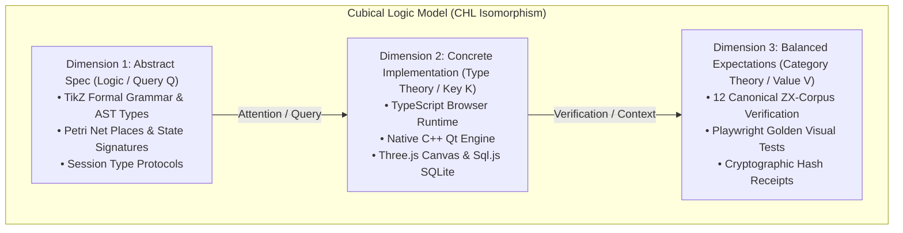
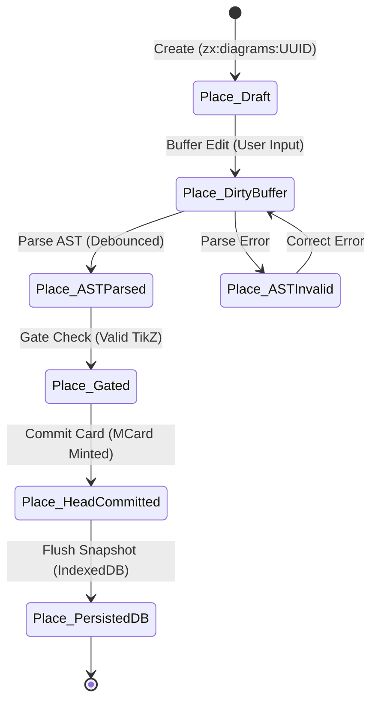
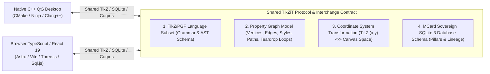
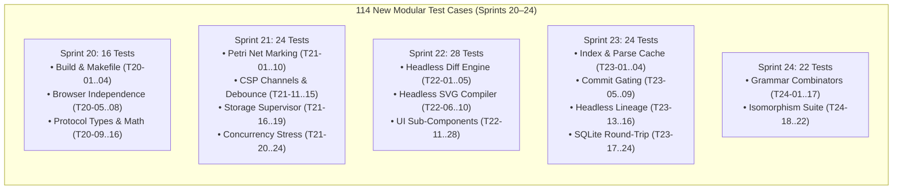

# Proposal: Sprints 20–24 — Algebraic Modularity, CLM Architecture & Dual-System Unification

**Status:** Proposed; Active Architecture Series  
**Target:** TikZiT Web Spatial Workbench & Native Desktop C++ Subsystem  
**Foundations:**
- **Cubical Logic Model (CLM)**: Three dimensions (Abstract Specification / Logic $Q$, Concrete Implementation / Type Theory $K$, Balanced Expectations / Category Theory $V$) and three MVP Card primitives (MCard Moore Machine, PCard Mealy Machine, VCard Kan Filler).
- **Baldwin Modularity Operators**: Splitting ($\times$), Substituting ($\simeq \implies =$), Augmenting ($+$), Excluding ($-$), Inverting ($\dashv$), and Porting (Change-of-Base $\text{Lan}$).
- **Process Algebra (CSP / CCS)** & **Petri Nets**: Algebraic concurrency, message channels, place-transition invariants, token conservation, and reachability.
- **Dual-System Architecture**: Native browser execution for JavaScript/TypeScript (zero C++ dependencies) with a unified root `Makefile` and shared TikZ AST protocol with native C++ Qt6.

---

## 1. Problem Statement & Motivation

Following the completion of Sprints 00–19, TikZiT has achieved rich functional maturity: a Web spatial workbench with Three.js canvas, live TeX preview, bidirectional sync, MCard-backed content-addressed storage, and individual/collection export.

However, rapid functional expansion has resulted in architectural tension documented in [`docs/PROJECT-SUMMARY.md`](../../PROJECT-SUMMARY.md):
1. **God Files & Monolithic Modules (> 450 LOC)**:
   - `src/services/createWorkbenchRuntime.ts` (**1,100 lines**): Monolithic runtime service orchestrator mixing Cordis service initialization, Nanostores state management, tab routing, document lifecycle, persistence coordination, and command dispatch.
   - `src/components/workbench/panels/VersionPopover.tsx` (**739 lines**): God UI component coupling timeline visualization, diff and stat delta computation, visual compare orchestration, and head re-registration.
   - `src/services/clm/corpusExplorerService.ts` (**652 lines**): Amalgamated service coupling handle indexing, title cache recovery, commit gate checking, search filtering, and document lifecycle.
   - `src/components/workbench/panels/PreviewPanel.tsx` (**605 lines**): Combines SVG viewport pan/zoom, TeX compilation simulation, TikZ re-rendering, and export buttons.
   - `src/components/workbench/CorpusExplorerDrawer.tsx` (**572 lines**): Dense UI mixing inline renaming, duplicate dialogs, archive filtering, search inputs, and row context menus.
   - `src/core/parser/parser.ts` (**494 lines**): Monolithic recursive-descent parser handling nodes, edges, properties, styles, and paths in a single continuous file.
   - `src/services/clm/corpusExportService.ts` (**484 lines**): Couples graph traversal, lineage closure resolution, SQLite file generation, hash verification, and browser File System Access API handling.
   - `src/components/workbench/WorkbenchCommandBar.tsx` (**472 lines**): Monolithic bar coordinating document title editing, dirty state observation, tab close warnings, save commands, layout resets, and theme selection.
   - Native C++ Qt files: `src/gui/tikzscene.cpp` (**1,418 lines**), `src/gui/styleeditor.cpp` (**881 lines**), `src/gui/undocommands.cpp` (**729 lines**).

2. **Dual-System Disconnect & Missing Unified Build**:
   - Web development relies on `npm run dev` / `astro build`, while desktop development relies on `qmake` / `cmake`.
   - The root directory contains an auto-generated 3,553-line `Makefile` from qmake rather than an authored developer orchestration Makefile.
   - There is no single command (`make build`, `make test`, `make verify`) that can build and test both native C++ Qt6 and Web TypeScript pipelines under a shared quality gate.

3. **Implicit State Spaghetti vs Algebraic Concurrency**:
   - Multi-document state, dirty buffer tracking, and persistence states currently rely on ad-hoc boolean flags (`isSaving`, `isDirty`, `isDraft`, `stale`) and mutable object assignments rather than formal communicating processes or Petri net invariants.

---

## 2. Theoretical Framework: CLM & Baldwin Modularity Operators

### 2.1 The Cubical Logic Model (CLM) Mapping

Under the Curry-Howard-Lambek (CHL) isomorphism, CLM structures the TikZiT system across three orthogonal dimensions:



The system operates strictly on three **MVP Card Primitives**:
1. **MCard ($\Sigma$-Type / Moore Machine)**: Static, persistent, content-addressed state. Represents "what is" ($O = \lambda(s)$). In TikZiT, every committed diagram and metadata card is an immutable MCard identified by $\text{BLAKE3}/\text{SHA-256}(c)$.
2. **PCard (Mealy Machine)**: Dynamic computational operator. Represents computational transformation ($O = \delta(s, i)$). In TikZiT, the Parser, SvgGenerator, AST Transformer, and Exporters are pure PCards.
3. **VCard (Kan Filler / Identity Type)**: Verification witness certifying invariants. In TikZiT, VCards are execution receipts, round-trip test proofs, and cryptographic manifest digests.

### 2.2 The Six Baldwin Modularity Operators

From Carliss Baldwin and Kim Clark's *Design Rules*, modularity in TikZiT is executed through six algebraic operators:

| Operator | Symbol | Algebraic Role | Application to TikZiT Refactoring |
| :--- | :---: | :--- | :--- |
| **Splitting** | $\times$ | Multiplication / Product | Dissecting God files (`createWorkbenchRuntime`, `VersionPopover`, `corpusExplorerService`) into decoupled autonomous modules with explicit design rules. |
| **Substituting** | $\simeq \implies =$ | Univalent Swap | Swapping headless mock storage with IndexedDB/SqlJs; swapping canvas WebGL with pure SVG without changing consumers. |
| **Augmenting** | $+$ | Coproduct / Sum Type | Adding new export formats (PNG 4x, standalone TeX, PDF) or new tool modes without modifying the core AST kernel. |
| **Excluding** | $-$ | Pruning / Deletion | Completely eliminating legacy `DocumentStore` shadow state, dead traffic light UI, and redundant storage paths. |
| **Inverting** | $\dashv$ | Platform Adjunction / Curry | Inverting low-level imperative event wiring into high-level reactive Nanostores/Cordis streams and Petri net controllers. |
| **Porting** | $\text{Lan}$ | Change-of-Base | Ensuring JavaScript/TypeScript runs 100% natively in modern browsers with zero C++ dependencies, while preserving shared protocol interoperability. |

---

## 3. Algebraic Concurrency: Process Algebra & Petri Nets

### 3.1 Document Lifecycle as a Place/Transition (PT) Petri Net

Rather than mutable boolean flags scattered across components, document state is formalized as a marked Petri Net:



**Petri Net Invariants:**
- **Token Conservation**: Exactly one state token per active document session; no document can simultaneously be committed and unstaged without a distinct token marking.
- **Liveness & Non-Blocking**: Transition to `Place_PersistedDB` occurs asynchronously without stalling UI thread interaction in `Place_Draft` or `Place_DirtyBuffer`.
- **Stale Writer Exclusion**: If snapshot sequence does not match generation token, transition fires to `Place_StaleWriter`, halting further commits until reload.

### 3.2 Process Algebra (CSP / CCS) Architecture

We model the spatial workbench as communicating concurrent processes:
$$\text{TikzitWorkbench} \triangleq \text{EditorProcess} \parallel \text{CanvasProcess} \parallel \text{SyncChannel} \parallel \text{StorageSupervisor} \parallel \text{PreviewActor}$$

- **Communication via Typed Channels**: Processes communicate solely via typed async channels (`SyncChannel`, `CommitChannel`, `ExportChannel`), eliminating direct method calls and mutable object references.
- **Hiding & Encapsulation**: Internal transition $\tau$ events (e.g. temporary Three.js mesh re-allocation, buffer debouncing) remain private to the process and cannot pollute global application state.

---

## 4. Dual-Platform Architecture & Root Makefile Strategy

### 4.1 Strict Decoupling: Zero C++ Dependency in Web Runtime

The JavaScript/TypeScript application must run **natively in standard browser environments** without requiring:
- Native C++ binaries or shared libraries (`.dylib`, `.so`, `.dll`).
- Node-gyp or native Node.js addons.
- Local Qt installations or X11/macOS Cocoa window servers.

### 4.2 Shared Dual-System Protocol

Although runtime execution is decoupled, both systems adhere to a **single shared formal protocol**:



### 4.3 Unified Developer Makefile

A clean, top-level `Makefile` will be authored to provide a standardized interface for developers and CI/CD:

```makefile
# High-Level Makefile Target Topology
.PHONY: all build build-web build-cpp test test-web test-cpp test-e2e verify-corpus clean lint

all: build test

build: build-web build-cpp

build-web:
	npm run prebuild
	npm run build

build-cpp:
	cmake -B build -S . -GNinja -DCMAKE_BUILD_TYPE=Release
	cmake --build build

test: test-web test-cpp

test-web:
	npm run test

test-cpp:
	./build/UnitTests.app/Contents/MacOS/UnitTests || ./build/UnitTests

test-e2e:
	npm run test:e2e

verify-corpus:
	python3 docs/examples/build_examples.py --verify-only
```

---

## 5. Active Sprint Roadmap (Sprints 20–24)

| Sprint | Title | Primary Baldwin Operator | Primary Subsystem | Target God Files | Core Deliverable |
| :---: | :--- | :---: | :--- | :--- | :--- |
| **20** | **Dual-System Makefile & Shared Protocol** | Porting & Substituting | `orchestration` / `build` | Root `Makefile` | Authored root `Makefile` driving CMake and npm; browser independence gate; shared protocol spec. |
| **21** | **Process Algebra & Petri Net Lifecycle** | Inverting & Splitting | `shell` / `sync` | `createWorkbenchRuntime.ts` (1,100 LOC) | Petri Net document state machine; CSP communication channels; decompose runtime to < 350 LOC. |
| **22** | **God-Component Decomposition via Baldwin Splitting** | Splitting | `interactions` / `styles` | `VersionPopover.tsx` (739 LOC), `CorpusExplorerDrawer.tsx` (572 LOC), `WorkbenchCommandBar.tsx` (472 LOC), `PreviewPanel.tsx` (605 LOC) | Dissect UI God components into focused single-responsibility modules ($\le 300$ LOC each). |
| **23** | **CLM Tri-Database & Service Decoupling** | Excluding & Substituting | `corpus` / `storage` | `corpusExplorerService.ts` (652 LOC), `corpusExportService.ts` (484 LOC) | Prune legacy `DocumentStore`; extract dedicated CLM actors for Indexing, Gated Commit, and Export. |
| **24** | **Parser Combinator & Native C++ Modularization** | Splitting & Porting | `parser` / `desktop-parity` | `parser.ts` (494 LOC), `tikzscene.cpp` (1,418 LOC) | Modular combinator decomposition for TS parser; architectural blueprint for native C++ cleanup. |

---

## 6. Decision Record (D11 – D16)

- **D11 (Root Makefile Authority):** The root `Makefile` is an authored developer entrypoint, not a generated qmake file. Qt qmake builds must emit their build artifacts into a designated shadow directory (`build-qmake/`) to prevent overwriting the master Makefile.
- **D12 (Zero Native C++ Dependency for Web):** Under no circumstances may any TypeScript package depend on native node addons or C++ bindings. All SQLite manipulation in the web client runs via WASM `sql.js`.
- **D13 (Strict Line Limit Rule):** No source file in `src/` should exceed **450 lines of code**. Any file approaching 400 lines must be evaluated for Baldwin splitting.
- **D14 (Petri Net State Determinism):** All document save/persistence operations must adhere strictly to the Petri Net place-transition semantics, prohibiting direct boolean flag mutations across component boundaries.
- **D15 (Single Source of Truth for Protocol):** The TikZ AST schema in `src/core/parser/ast.ts` and the MCard SQLite schema in `src/services/clm/corpusExportService.ts` constitute the canonical specification shared between C++ and TypeScript.
- **D16 (Preservation of Contracts A & B):** All refactoring must strictly uphold Dockview layout preservation (Contract A) and E2E selector stability (Contract B).

---

## 7. Cross-Sprint Test Strategy & Legacy Regression Guard

The Algebraic Architecture Series enforces a rigorous two-pronged testing mandate: every sprint must author extensive new test cases for its decomposed modules while maintaining 100% green execution across the entire legacy test baseline.

### 7.1 New Test Coverage Inventory Across Sprints 20–24 (114 New Tests)



| Sprint | New Test Files Created | Test Count | Key Verification Domains |
| :---: | :--- | :---: | :--- |
| **20** | `tests/unit/build/makefile.test.ts`, `scripts/verify-browser-independence.mjs`, `tests/unit/protocol/sharedProtocol.test.ts` | **16** | Makefile targets, `.node` exclusion, pure WASM sandboxing, coordinate and teardrop math. |
| **21** | `tests/unit/services/lifecycle/DocumentProcess.test.ts`, `tests/unit/services/sync/SyncChannel.test.ts`, `tests/unit/services/storage/StorageSupervisor.test.ts`, `tests/unit/services/lifecycle/TabSessionController.test.ts`, `tests/integration/services/WorkbenchRuntimeAlgebra.test.ts` | **24** | Petri Net token conservation, async flush race elimination, CSP anti-echo channels, exponential retry. |
| **22** | `tests/unit/components/history/VersionDiffEngine.test.ts`, `tests/unit/components/preview/PreviewCompiler.test.ts`, `tests/unit/components/history/*.test.tsx`, `tests/unit/components/preview/*.test.tsx`, `tests/unit/components/explorer/*.test.tsx`, `tests/unit/components/commandbar/*.test.tsx` | **28** | Headless AST diffing, headless SVG generation, timeline rows, side-by-side compare, debounced search, inline rename. |
| **23** | `tests/unit/clm/explorer/DiagramIndexService.test.ts`, `tests/unit/clm/explorer/DiagramCommitCoordinator.test.ts`, `tests/unit/clm/explorer/DiagramLifecycleManager.test.ts`, `tests/unit/clm/export/LineageTraversalEngine.test.ts`, `tests/unit/clm/export/CollectionSnapshotWriter.test.ts`, `tests/unit/clm/storage/DocumentStoreExclusion.test.ts`, `tests/integration/clm/CorpusExportRoundTrip.test.ts` | **24** | Commit gating, VCard receipts, lineage graph cycles ($A \to B \to A$), orphan exclusion, SQLite binary export, legacy storage elimination. |
| **24** | `tests/unit/parser/combinators/nodeCombinator.test.ts`, `tests/unit/parser/combinators/edgeCombinator.test.ts`, `tests/unit/parser/combinators/styleCombinator.test.ts`, `tests/unit/parser/combinators/propertyCombinator.test.ts`, `tests/unit/parser/parserTopLevel.test.ts`, `tests/unit/protocol/conformanceSuite.test.ts` | **22** | Recursive-descent grammar combinators, error recovery, dual-engine graph isomorphism across C++ and TypeScript. |
| **Total** | **17 New Test Modules** | **114** | **End-to-end mathematical, headless, unit, and cross-system test coverage.** |

### 7.2 Strict Legacy Test Preservation Contract

All existing test suites must pass 100% green without modification to legacy test assertions or queries:

1. **Vitest Unit & Integration Suite**:
   - Baseline: **57 test files, 355 tests** passing.
   - Requirement: Must remain 100% passing across all sprints (`npm test`).
2. **Playwright Cross-Browser End-to-End Suite**:
   - Baseline: **18 test suites, 392 test runs** across Chromium, Firefox, WebKit.
   - Requirement: Must remain 100% passing across all browsers (`npm run test:e2e`).
3. **PQP Canonical ZX-Calculus Corpus**:
   - Baseline: **12/12 diagrams verified** without syntax or layout errors.
   - Requirement: `python3 docs/examples/build_examples.py --verify-only` must pass 100%.
4. **Native C++ Qt6 UnitTests Binary**:
   - Baseline: **20/20 test assertions** passing.
   - Requirement: Native build must continue compiling and passing all tests (`make test-cpp`).
5. **Contract A & B Invariants**:
   - Contract A: Dockview layout serialization and 0-panel guard remain functional.
   - Contract B: All 59 Playwright `data-testid` selectors preserved byte-for-byte.

---

## 8. Consolidated Master Definition of Done (DoD) Checklist

This master checklist aggregates all 51 Definition of Done checkpoints across Sprints 20–24 to examine engineering progress at a glance:

### Sprint 20: Dual-System Makefile & Shared Protocol
- [ ] **S20-G01 — Authored Root Makefile Deployed**: Root `Makefile` committed with `.PHONY` targets for `all`, `build`, `build-web`, `build-cpp`, `test`, `test-web`, `test-cpp`, `test-e2e`, `verify-corpus`, `clean`, `lint`, and `check-independence`.
- [ ] **S20-G02 — Dual-System Build Success**: `make build` builds both web (`dist/`) and desktop C++ (`build/tikzit`).
- [ ] **S20-G03 — QMake Shadow Isolation**: `make build-qmake` emits artifacts to `build-qmake/` without touching root `Makefile`.
- [ ] **S20-G04 — Dual-System Test Execution**: `make test` runs both Vitest and native Qt `UnitTests`.
- [ ] **S20-G05 — Browser Independence Gate Implemented**: `scripts/verify-browser-independence.mjs` authored and wired to `make check-independence`.
- [ ] **S20-G06 — Zero Native Dependencies in Web Bundle**: Automated scan verifies zero `.node` files, node-gyp builds, or C++ FFI in `dist/`.
- [ ] **S20-G07 — Shared Protocol Specification Authored**: `docs/architecture/SHARED-PROTOCOL-SPECIFICATION.md` authored.
- [ ] **S20-G08 — Protocol Unit Suite Passing**: `tests/unit/protocol/sharedProtocol.test.ts` passes all 16 tests (T20-01 to T20-16).
- [ ] **S20-G09 — Zero Regressions on Existing Suites**: 355 Vitest tests, 392 Playwright runs, 12 ZX diagrams, and 20 C++ tests pass.
- [ ] **S20-G10 — Clean Verification Log**: Build logs verifying `make all`, `make check-independence`, and `make verify-corpus` committed.

### Sprint 21: Process Algebra & Petri Net State Machine
- [ ] **S21-G01 — Runtime Orchestrator Under 350 LOC**: `createWorkbenchRuntime.ts` reduced from 1,100 lines to $\le 350$ lines.
- [ ] **S21-G02 — Extracted Actors Under 300 LOC**: `DocumentProcess.ts`, `TabSessionController.ts`, `SyncChannel.ts`, `StorageSupervisor.ts` all $\le 300$ lines.
- [ ] **S21-G03 — Petri Net State Determinism**: State machine dispatches formal actions; zero ad-hoc boolean mutations across components.
- [ ] **S21-G04 — Token Conservation Guarantee**: Verified by T21-09: concurrent edits during async flush maintain dirty token without data loss.
- [ ] **S21-G05 — CSP Channel Invariant**: `SyncChannel` eliminates cyclic echo feedback loops (verified by T21-13).
- [ ] **S21-G06 — Storage Supervisor Isolation**: Persistence and retry backoff fully encapsulated in `StorageSupervisor.ts`.
- [ ] **S21-G07 — Stale Writer Detection**: Writer generation conflicts halt writes and trigger stale banner (verified by T21-10).
- [ ] **S21-G08 — 24 New Algebraic Tests Passing**: All 24 tests (T21-01 to T21-24) pass 100% green.
- [ ] **S21-G09 — Zero Regressions on Existing Suites**: All 355 unit tests and 392 Playwright runs pass.
- [ ] **S21-G10 — Contract A & B Preservation**: Dockview serialization and 59 `data-testid` selectors preserved.
- [ ] **S21-G11 — Clean Concurrency Verification Log**: Stress test log verifying 10 rapid edit-save cycles with zero lost edits committed.

### Sprint 22: God-Component Decomposition via Baldwin Splitting
- [ ] **S22-G01 — All Sub-Components Under 250 LOC**: All 12 newly extracted sub-components verified $\le 250$ lines of code.
- [ ] **S22-G02 — All Parent Containers Under 200 LOC**: `VersionPopover.tsx`, `PreviewPanel.tsx`, `CorpusExplorerDrawer.tsx`, `WorkbenchCommandBar.tsx` verified $\le 200$ lines of code.
- [ ] **S22-G03 — Headless Version Diff Engine Verified**: `VersionDiffEngine.ts` tested headlessly without React DOM (T22-01 to T22-05).
- [ ] **S22-G04 — Headless Preview Compiler Verified**: `PreviewCompiler.ts` tested headlessly for SVG generation and Bézier math (T22-06 to T22-10).
- [ ] **S22-G05 — History & Modal Unit Tests Passing**: T22-11 through T22-17 pass 100% green.
- [ ] **S22-G06 — Preview & Stage Unit Tests Passing**: T22-18 and T22-19 pass 100% green.
- [ ] **S22-G07 — Explorer Drawer Unit Tests Passing**: T22-20 through T22-24 pass 100% green.
- [ ] **S22-G08 — Command Bar Unit Tests Passing**: T22-25 through T22-28 pass 100% green.
- [ ] **S22-G09 — Contract B Selector Integrity Verified**: Automated audit confirms all 59 baseline selectors remain active and correctly positioned.
- [ ] **S22-G10 — Full Regression Suite Passing**: All 355 Vitest unit tests and 392 Playwright runs pass with zero query modifications.

### Sprint 23: CLM Tri-Database & Service Boundary Decoupling
- [ ] **S23-G01 — Legacy DocumentStore Fully Deleted**: `DocumentStore.ts` deleted; zero references to `tikzit:doc-*` or `tikzit:rev-*` remain.
- [ ] **S23-G02 — All Decomposed Services Under 250 LOC**: `DiagramIndexService`, `DiagramCommitCoordinator`, `DiagramLifecycleManager`, `LineageTraversalEngine`, `CollectionSnapshotWriter`, `ExportFileBridge` all $\le 250$ lines.
- [ ] **S23-G03 — Service Facades Under 150 LOC**: `CorpusExplorerService.ts` and `CorpusExportService.ts` verified $\le 150$ lines.
- [ ] **S23-G04 — Headless Lineage Traversal Verified**: Lineage closures and cycle resolution pass headless tests (T23-13 to T23-16).
- [ ] **S23-G05 — Headless Snapshot Serialization Verified**: SQLite 3 database generation and round-trip pass headless tests (T23-17 to T23-20).
- [ ] **S23-G06 — Cross-Repo Mcard-Studio Compatibility**: Exported databases validate against external `mcard-studio` schema format.
- [ ] **S23-G07 — Commit Gating & VCard Receipts Verified**: Syntax error gating and execution receipts pass tests (T23-05 to T23-09).
- [ ] **S23-G08 — Index & Parse Cache Verified**: Record caching and parse memoization pass tests (T23-01 to T23-04).
- [ ] **S23-G09 — Zero Regressions on Existing Suites**: All 355 Vitest tests and Sprint 19 Playwright tests pass 100% green.
- [ ] **S23-G10 — Clean Export Round-Trip Artifact**: Verified SQLite `.db` export artifact passes `sqlite3` integrity check.

### Sprint 24: Core Parser Combinator & Native C++ Modularization
- [ ] **S24-G01 — Parser Kernel Under 120 LOC**: `src/core/parser/parser.ts` refactored into combinator coordinator strictly $\le 120$ lines.
- [ ] **S24-G02 — Combinator Modules Under 180 LOC**: `nodeCombinator`, `edgeCombinator`, `styleCombinator`, `propertyCombinator` all $\le 180$ lines.
- [ ] **S24-G03 — Node Combinator Verified**: Node declarations, options, and error reporting pass tests (T24-01 to T24-04).
- [ ] **S24-G04 — Edge Combinator Verified**: Straight, curved, teardrop, and compound edges pass tests (T24-05 to T24-10).
- [ ] **S24-G05 — Style & Property Combinators Verified**: Style declarations, nested options, and escaped brackets pass tests (T24-11 to T24-14).
- [ ] **S24-G06 — Top-Level Orchestrator Verified**: Full diagram parsing and syntax recovery pass tests (T24-15 to T24-17).
- [ ] **S24-G07 — Automated Conformance Suite Deployed**: `scripts/verify-protocol-conformance.mjs` authored and integrated into `make test`.
- [ ] **S24-G08 — 100% Canonical ZX Isomorphism**: All 12 canonical ZX diagrams produce topologically isomorphic graphs across C++ and TS engines.
- [ ] **S24-G09 — C++ Modularization Blueprint Authored**: `docs/architecture/CPP-MODULARIZATION-BLUEPRINT.md` authored.
- [ ] **S24-G10 — Full Dual-System Suite Passing**: All 355 Vitest unit tests, 392 Playwright E2E tests, 20 native C++ tests, and 12 canonical ZX diagrams pass 100% green.

---

## 9. Series Verification Workflow

The unified quality gate for the entire Algebraic Architecture Series is executed via the root `Makefile`:

```bash
# 1. Clean all previous build artifacts
make clean

# 2. Build both Native C++ Qt and Web Spatial Workbench
make build

# 3. Verify zero native C++ bindings in browser bundle
make check-independence

# 4. Run full test suite across both engines (Vitest + Native UnitTests)
make test

# 5. Run end-to-end browser regression suite
make test-e2e

# 6. Verify 12 canonical ZX-calculus diagrams
make verify-corpus

# 7. Run cross-engine TikZ AST protocol conformance verification
node scripts/verify-protocol-conformance.mjs

# 8. Run code hygiene and linting across both systems
make lint
```

