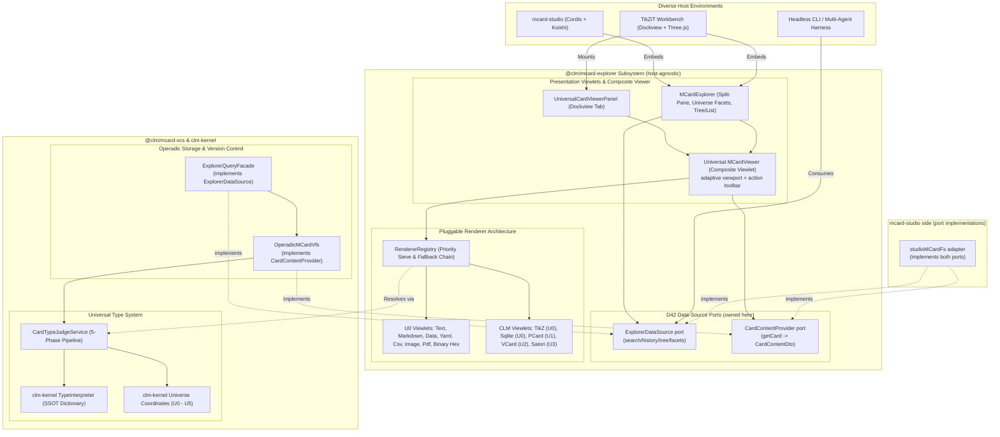

# Proposal: Sprints 30–34 — Universal Type Interpretation, Stratified Type Lattice & Multimodal MCard Rendering Engine

**Status:** Proposed; Active Architecture Series  
**Target:** Universal Polyglot MCard Type Classification (`@clm/mcard-vcs/type`) & Multimodal Renderer Architecture (`@clm/mcard-explorer/renderers`) Grounded in `clm-kernel` and `mcard-studio`  
**Authors:** BMAD Engineering Roundtable:
- **Winston** (System Architect & Double Category Theorist)
- **Amelia** (Senior Software Engineer & Implementation Specialist)
- **Sally** (UX Designer & Reactive Lens Ergonomist)
- **John** (Product Manager & Ecosystem Bridge Lead)
- **Mary** (Business Analyst & Quality Auditor)

**Theoretical & Ontological Foundations:**
- **The CLM Ontological Axiom**: *"All Things Are MCards"* — Every entity across the computational universe (a TikZ diagram, a ZX-calculus graph, a markdown document, a JSON schema, a YAML configuration, a CSV dataset, an image asset, a Colored Petri Net process, a Hoare sandwich proof witness, a Satori dialogue turn, a SQLite collection database, or a raw binary asset) is an immutable, content-addressable MCard possessing a cryptographic hash (`blake3:...`) and a mutable handle or URI.
- **Stratified Type Lattice & Universe Coordinates ($U_0 \to U_5$)** (`clm-kernel` layer5 `typeLattice` — consumed via the **root package export**; `dist/` paths are not in the `exports` map):
  - **$U_0$ (MCard CAS Storage)**: Content-addressed static representations (TikZ diagrams, text, markdown, JSON, YAML, CSV, images, SQLite collections, binary blobs).
  - **$U_1$ (PCard Dynamic Transitions)**: Linear dynamic transitions & Colored Petri Nets / State machines (CPN-VM). Transitions, places, markings, tokens, firing rules.
  - **$U_2$ (VCard Proof Receipts)**: Cryptographic identity, zero-knowledge proofs, Hoare sandwich receipts $[P]\{C\}[Q]$, audit trails, Merkle proofs.
  - **$U_3$ (Satori Speech Acts & Cordis Mesh)**: Agent dialogues, Satori speech acts (`<card>`, `<execute>`, `<propose>`, `<verify>`), conversational continuations.
  - **$U_4$ (Membranes & Omnichannel Interaction Surfaces)**: Presentation viewlets, UI widgets, dashboards, canvases, dockview panes.
  - **$U_5$ (Meta-Gamma Continuous Learning)**: Meta-circular reflection, telemetry hooks, adaptive learning heuristics.
- **Double Operadic Theory of Systems (DOTS)** (`Hub/Theory/Category Theory/Double Operadic Theory of Systems.md`):
  - **Type Judgment Functor**: $\mathcal{J}: \mathbf{MCard} \to \mathcal{L}_{U_0..U_5}$, mapping unclassified content-addressable bytes to stratified lattice coordinates.
  - **Renderer Resolution Sieve**: A monoidal priority filter $\mathcal{R}: \mathbf{TypeJudgment} \times \mathbf{Content} \to \mathbf{Viewlet}$.
  - **The Four DOTS Programming Idioms**:
    1. **Getter / Setter**: Type-aware conversational lenses projecting typed views of raw card content ($S \dashv G$).
    2. **Dispatch / Callback**: Loosely coupled event bus broadcasting type judgment events and renderer lifecycle hooks.
    3. **Mealy / Moore Machines**: MCards as passive Moore state carriers across universes $U_0$–$U_5$; Viewlets and interactive tools as Mealy transitions.
    4. **Porting / Inversion**: Baldwin Change-of-Base $\operatorname{Lan}_K F$ porting `mcard-studio`'s renderer descriptor model into `@clm/mcard-explorer` with zero host coupling.
- **Existing Systems Grounding** (verified against installed sources):
  - `clm-kernel` (v0.0.1): `TypeInterpreter` (5-phase deterministic judgment pipeline over a **48-type bundled SSOT `type_dictionary`**, `TypeInterpreter.createDefault()`, `registerType(TypeDefinition)`, `judge(options)` → `TypeJudgment`), `layer5/typeLattice.ts` (`UniverseLevel`, `getUniverseCoordinates`, `isStratified`, `validateUniverseLevel`), `layer0/typed_value.ts` (`TypedValue`, `VALID_UNIVERSES` = `'U0'..'U5'`, `UNIVERSE_NAMES`, `computeContentHash`), `layer2/mime.ts` (`detectMime`, `isBinary`), `layer2/classifier.ts` (`classifyClm`, `detectDialect`, `detectEpistemicStatus`), `fileToMCard`.
  - `mcard-studio` (verified paths — earlier drafts cited nonexistent `domain/renderers.ts`/`artifactRenderers.tsx`):
    - `src/components/studio/views/cardViewlets/CardViewletRegistry.ts` — priority-sorted viewlet registry (`register`/`unregister`/`findBestViewlet(mcard, tab)`), lazy-loaded viewlets.
    - `src/components/studio/views/cardViewlets/types.ts` — `CardViewletDefinition { id, priority, supportedTabs: CardTabKind[], supportedExtensions?, supportedMimes?, predicate?, component }`, `CardTabKind = 'visual'|'text'|'raw_data'|'raw'|'merkle'`, `CardViewletProps`.
    - `src/services/cardTypeDetector.ts` — `detectCardType(node) → CardTypeDetails { detectedType, mimeType, category, subclass: 'MCard'|'PCard'|'VCard', renderer }` heuristic sniffer.
    - `src/lib/renderers/` + `src/lib/cardRenderer.ts` — DOM-string render helpers (metadata, sections, witness, provenance).
    - Existing viewlets to align with: `TikzDiagramViewlet`, `MarkdownViewlet`, `ClmPcardViewlet`, `WitnessVcardViewlet`, `SvgViewlet`, `ImageViewlet`, `PdfViewlet`, `TableGridCsvViewlet`, `XmlViewlet`, `JsonObjectViewlet`, `TextViewlet`, `RawDataViewlet`, `MerkleProofViewlet`.
  - TikZiT: `src/packages/mcard-vcs` (Operadic VFS, Merkle VCS, `ExplorerQueryFacade`), `src/packages/mcard-explorer` (`MCardExplorerEngine`, `MCardExplorer.tsx`), `CorpusExplorerDrawer.tsx`, Dockview workbench runtime.

---

## 1. Executive Summary & Problem Statement

### 1.1 The Challenge: Monomodal Blindness in MCard Explorer
In Sprints 25–29, we isolated TikZiT's storage, version control, and card exploration into autonomous, zero-DOM subsystems:
- `@clm/mcard-vcs`: Headless operadic VFS, Merkle DAG version control, and `ExplorerQueryFacade`.
- `@clm/mcard-explorer`: Headless `MCardExplorerEngine`, action registry, and UI tree/list viewlets.

However, the explorer currently suffers from **monomodal blindness** — and a structural coupling problem that blocks adoption by `mcard-studio`:
1. **Assumption of Diagram-Only Content**: The explorer assumes all cards are TikZ diagrams (`zx:diagrams:*`, `zx:examples:*`). When a user or AI agent creates or queries cards containing markdown documentation, JSON schemas, Petri net workflows (PCards), proof witnesses (VCards), dialogue turns (Satori), or SQLite collections, the explorer has no mechanism to identify what they are or how to preview them.
2. **Underutilized Type System**: Although `clm-kernel` provides a sophisticated 5-phase `TypeInterpreter` (48-type SSOT dictionary), a 6-tier stratified type lattice ($U_0 \to U_5$), `TypedValue`, and `detectMime`/`isBinary`/`detectEpistemicStatus` sniffers, `@clm/mcard-vcs` and `@clm/mcard-explorer` store and query raw MIME strings without type judgment, universe stratification, or feature extraction.
3. **Explorer–VFS Hard Coupling (verified in code)**: `MCardExplorerEngine`'s constructor takes a concrete `ExplorerQueryFacade` imported from `../../mcard-vcs/explorer/ExplorerQueryFacade`, which itself binds concrete `OperadicMCardVfs` + `MCardVcsEngine`. `@clm/mcard-explorer` therefore **cannot be adopted by `mcard-studio`** (which has its own `studioMCardFs`) without dragging the entire TikZiT VCS stack. The packages must be separated by a **data-source port interface** (ADR D42).
4. **Siloed Rendering Technology**: `mcard-studio` has a real pluggable viewlet architecture (`CardViewletRegistry` + `CardViewletDefinition`, Sprint 200-era `cardViewlets/`), but its registry is keyed to `MCardFileNode`/`CardTabKind` and locked inside the studio tree. TikZiT cannot preview non-TikZ cards, headless agents cannot inspect card previews, and the two registries have divergent descriptor shapes.

### 1.2 The Strategic Vision: A Universal Multimodal MCard Explorer
This proposal establishes **Sprints 30–34** to elevate `MCard Explorer` into a universal, multimodal, universe-aware card exploration and rendering engine:
1. **Universal Type Judgment (`@clm/mcard-vcs/type`)**: Integrate `clm-kernel`'s `TypeInterpreter` and stratified type lattice into the core VFS and explorer query facade. Every card is automatically judged across 5 phases (magic bytes, text patterns, validators, extensions, binary heuristics) and tagged with its canonical MIME type, Universe coordinate ($U_0$–$U_5$), category, and confidence.
2. **Pluggable Polyglot Renderer Registry (`@clm/mcard-explorer/renderers`)**: Port and generalize `mcard-studio`'s `CardViewletRegistry`/`CardViewletDefinition` architecture into `@clm/mcard-explorer` (our superset type is `RendererDescriptor`, D34). Host applications and plugins can register custom viewlets, governed by a priority-ordered fallback chain.
3. **Core Polyglot & Higher-Universe Viewlet Suite**:
   - $U_0$ Static Data & Code: `TextCardRenderer`, `MarkdownCardRenderer`, `DataCardRenderer` (JSON/XML), `YamlCardRenderer`, `CsvCardRenderer`, `ImageCardRenderer`, `PdfCardRenderer`, `BinaryHexCardRenderer`.
   - $U_0$ Specialized: `TikzCardRenderer` (SVG/Canvas preview with "Open in Editor" CTA) and `SqliteCollectionRenderer` (inspects tables, DDL, and cards inside sovereign `.db` collections).
   - $U_1$ Dynamic State: `PCardRenderer` (Petri net transitions, places, tokens, and enabled firing rules).
   - $U_2$ Proofs & Receipts: `VCardRenderer` (cryptographic proof witness, Hoare sandwich receipts $[P]\{C\}[Q]$, Blake3 Merkle proofs).
   - $U_3$ Agent Speech Acts: `SatoriCardRenderer` (dialogue stream, speech act tags, interactive continuation).
4. **Adaptive Viewport & In-Viewer Export (`MCardViewer`)**:
   - **Viewport modes** (ADR D44): each `RendererDescriptor` declares a `viewport` mode — `fit` (images/SVG scale-to-pane), `scroll` (long text/code), `zoom` (images, PDFs, diagrams with pan/zoom chrome), `paged` (PDFs, multi-record data), `split` (raw+rendered dual views) — and `MCardViewer` adapts its container, scrollbars, and chrome per mode when a different media type is selected.
   - **Export while viewing** (ADR D45): viewlets declare `actions` (e.g. `export.png`, `export.pdf`, `export.svg`, `export.tikz`); `MCardViewer` surfaces them in the card toolbar; the host adapter (Sprint 34) bridges them to the existing `diagramExportCoordinator.exportDiagramArtifact({format, pngScale})` pipeline (PNG 1x/2x/4x, PDF via `PdfExporter`, SVG, verbatim TikZ/TeX) — no second export implementation.
   - Universal Card Viewlet embedded directly inside `MCardExplorer` via split-pane or preview drawer.
   - Dynamic facet filter strip supporting Universe levels ($U_0$–$U_5$) and categories (`diagram`, `markdown`, `data`, `process`, `proof`).
   - Satori `type:'custom'` `mcard-viewer` element for conversational embedding (per D30/D42 conventions).
5. **Multimodal Sample Media Corpus (`tests/fixtures/multimodal-media/`)**: A deterministic, regenerated fixture set exercising every renderer and viewport mode — tiny PNG/SVG, minimal PDF (via `pdf-lib`), Markdown, JSON/YAML/CSV samples, `.tikz` + ZX-graph, `.pcard.json`, `.vcard.json`, `.satori.xml`, and a sovereign `.db` (via kernel `compilePortableSqlite`) — consumed by Sprint 31–34 tests and by a `npm run seed:media` dev harness that loads them into the explorer for manual QA.
6. **TikZiT Dockview Integration & Cross-System Conformance**:
   - First-class `UniversalCardViewerPanel` mounted in TikZiT's Dockview workbench.
   - Cross-system conformance test suite ensuring 100% parity between TikZiT, `mcard-studio`, and headless CLI environments.
   - Zero-regression audit guaranteeing 100% preservation of Contract B selectors (212 literals), Contract D LOC limits ($\le 250$ LOC), and Contract E zero-DOM isolation.



### 1.3 `clm-kernel` Layer Map — where each deliverable lives

The kernel is organized as a strict stratified stack; this series must slot into it rather than re-implement across layers. **Dependency rule: our packages may only consume kernel layers ≤ their own stratum** (a $U_4$ viewlet may read $U_0$–$U_3$ kernel APIs; storage code may never import layer-4 membrane modules).

| Kernel Layer | Kernel Surface (verified exports) | Our Deliverable | Universe |
| :--- | :--- | :--- | :--- |
| **L0** Kenotic core | `TypedValue`, `VALID_UNIVERSES`, `UNIVERSE_NAMES`, `computeContentHash`, `StorageBackend`, `MCardCollection`, hash providers | `CardView` type enrichment aligns to `TypedValueDict` shape | $U_0$ |
| **L1** Dynamics | `PrimitivePCard`, `DynamicPCard`, `BailVerdict`, CPN-VM, Petri topology | `PCardRenderer` visualizes kernel `PlaceDef`/`TransitionDef`/`MarkingMap` | $U_1$ |
| **L2** Persistence | `MCardFileSystem`, `TriDatabaseManager`, `detectMime`, `isBinary`, `classifyClm`, `detectDialect`, `detectEpistemicStatus`, `fileToMCard`, Merkle builders | `OperadicMCardVfs`, `ExplorerQueryFacade` (data-source adapter), `CardTypeJudgeService` (wraps `TypeInterpreter`) | $U_0$–$U_2$ |
| **L3** Protocol | `parseSatoriXml`, `SatoriElement`, speech acts, `SatoriService`, continuations | `SatoriCardRenderer`, `<mcard-viewer>` custom element codec | $U_3$ |
| **L4** Membrane | `renderSatoriToHypermedia`, membrane/gateway, host surfaces | `RendererRegistry`, all viewlets, `MCardViewer`, `UniversalCardViewerPanel` | $U_4$ |
| **L5** Reflection | `layer5/typeLattice` (`UniverseLevel`, `getUniverseCoordinates`, `isStratified`, `validateUniverseLevel`), `TypeInterpreter` (top-level export) | universe coordinate mapping, facet strip, judgment metadata | $U_5$ |

> **Module separation mandate (D42)**: `@clm/mcard-explorer` defines the data-source **port** (`ExplorerDataSource` + `CardContentProvider` interfaces in `explorer/core/datasource/`); `@clm/mcard-vcs` **implements** it via `ExplorerQueryFacade`/`OperadicMCardVfs`. Dependency arrow must point **vcs → explorer port**, never explorer → vcs concrete classes. `mcard-studio` will implement the same port over `studioMCardFs` (`vfsCore.ts`), making both packages independently consumable downstream.

---

## 2. Architectural Colloquy: The BMAD Roundtable

### 2.1 Winston (System Architect)
> *"Let us ground this work in the ontological purity of the **Cubical Logic Model (CLM)** and the **Double Operadic Theory of Systems (DOTS)**:
>
> 1. **The Axiom of Universal MCards**: In traditional software, developers invent ad-hoc abstractions: files, records, documents, ASTs, messages, logs. In CLM, this fragmentation is rejected. *All things are MCards.* An MCard is a point in a stratified type lattice $\mathcal{L}$, equipped with content-addressable storage ($U_0$), transition dynamics ($U_1$), cryptographic verification ($U_2$), and communicative agency ($U_3$).
> 2. **Type Judgment as a Category Functor**: When an MCard enters the system, its raw bytes are unformed. The `TypeInterpreter` acts as a deterministic functor:
>    $$\mathcal{J}: \mathbf{MCard}_{raw} \longrightarrow \mathbf{TypeJudgment}(\text{MIME}, \text{Universe}, \text{Category})$$
>    This classification is invariant under serialization, network transport, or storage backend.
> 3. **Renderer Resolution as a Monoidal Sieve**: A renderer is a functor mapping typed MCard content into an observable membrane viewlet ($U_4$). The `RendererRegistry` implements a priority-ordered monoid under fallback composition:
>    $$\mathcal{R} = R_1 \oplus R_2 \oplus \dots \oplus R_{\text{fallback}}$$
>    where each descriptor $R_i$ tests applicability via a pure predicate. If $R_{\text{exact}}$ matches the MIME type or universe level, it executes; otherwise, the request cascades down the sieve until the absorbing element ($R_{\text{text}}$ or $R_{\text{binary}}$) is reached.
> 4. **Moore Carriers and Mealy Membranes**: The card is an immutable Moore machine ($O = \lambda(s)$). The rendering viewlet is a Mealy membrane ($O = \delta(s, i)$), accepting user interactions (zooming, folding, paging, clicking links) and projecting state updates back into the conversational lens."*

### 2.2 Amelia (Senior Software Engineer)
> *"Looking at implementation realities across our packages and `mcard-studio`:
>
> 1. **Zero-DOM Headless Core**: The type judgment engine (`CardTypeJudgeService`), the `RendererRegistry` core, and the query facade must have **zero DOM references** and **zero host imports**. They must run flawlessly in Node.js, Vitest, Bun, and browser web workers.
> 2. **Contract D Discipline ($\le 250$ LOC)**: In `mcard-studio`, components like `CLMView.tsx` grew to 500+ lines. We will not allow that here. We will enforce strict modularity:
>    - `TextCardRenderer.tsx` $\le 120$ LOC.
>    - `MarkdownCardRenderer.tsx` $\le 160$ LOC.
>    - `DataCardRenderer.tsx` $\le 180$ LOC.
>    - `YamlCardRenderer.tsx` $\le 160$ LOC.
>    - `CsvCardRenderer.tsx` $\le 180$ LOC.
>    - `ImageCardRenderer.tsx` $\le 140$ LOC.
>    - `BinaryHexCardRenderer.tsx` $\le 180$ LOC.
>    - `TikzCardRenderer.tsx` $\le 180$ LOC.
>    - `SqliteCollectionRenderer.tsx` $\le 210$ LOC.
>    - `PCardRenderer.tsx` $\le 210$ LOC.
>    - `VCardRenderer.tsx` $\le 210$ LOC.
>    - `SatoriCardRenderer.tsx` $\le 200$ LOC.
>    - `MCardViewer.tsx` $\le 220$ LOC.
> 3. **Seamless Porting from `mcard-studio`**: `mcard-studio` already solved polyglot viewlets in `cardViewlets/CardViewletRegistry.ts` (`CardViewletDefinition`: `id`, `priority`, `supportedTabs`, `supportedMimes`/`supportedExtensions`, `predicate`, `component`) and `services/cardTypeDetector.ts`. We generalize that descriptor shape into `@clm/mcard-explorer/renderers` and provide a `toCardViewletDefinition()` adapter so both applications consume identical descriptors!"*

### 2.3 Sally (UX Designer)
> *"From a UX and ergonomic perspective, this completely transforms the MCard Explorer:
>
> 1. **Universe & Category Facet Strip**: Instead of just filtering by arbitrary strings, the top of `MCardExplorer` will feature clean, color-coded Universe chips:
>    - `All` (Show entire corpus)
>    - `U0 Data / Code` (Diagrams, Markdown, JSON, YAML, CSV, Images)
>    - `U1 PCard` (Processes, Petri Nets, Workflows)
>    - `U2 VCard` (Proofs, Signatures, Verification Receipts)
>    - `U3 Satori` (Agent Dialogues, Turn Logs)
>    alongside semantic category chips (`diagram`, `markdown`, `data`, `process`, `proof`).
> 2. **Instant Preview Pane (Split View / Drawer)**: When browsing cards in the explorer, users shouldn't have to navigate away or open a heavy modal just to see what a card contains. Selecting a card immediately loads the `MCardViewer` in an adjacent inspector panel with responsive syntax highlighting, table formatting, or SVG diagram rendering.
> 3. **High-Contrast Theme Parity**: Every viewlet will strictly adhere to TikZiT's dark/light aesthetic (`bg-neutral-900`, `border-neutral-800`, `text-neutral-200` in dark mode; `bg-white`, `border-slate-200`, `text-slate-800` in light mode) with high-contrast typography and subtle hover micro-animations."*

### 2.4 John (Product Manager)
> *"This solves the single biggest conceptual hurdle for the entire CLM project:
>
> 1. **TikZiT Becomes a True CLM Workbench**: Previously, TikZiT felt like a TikZ-only diagramming tool that had some experimental MCard storage tacked on. With Sprints 30–34, TikZiT becomes a full-fledged CLM workbench capable of browsing, inspecting, and manipulating *any* card in the knowledge mesh. A researcher can view a ZX diagram, read the accompanying markdown proof notes, inspect the underlying JSON tensor data, verify the VCard cryptographic receipt, and run the PCard Petri net transition, all within one coherent interface!
> 2. **Immediate Synergy with `mcard-studio`**: By standardizing the renderer registry and viewlets in `@clm/mcard-explorer`, `mcard-studio` can immediately retire its custom rendering code and adopt this unified package. Both applications share identical card viewing capabilities, paving the way for seamless cross-application federation."*

### 2.5 Mary (Business Analyst & Quality Auditor)
> *"My focus remains total quality, zero regression, and contract compliance:
>
> 1. **Contract B Selector Preservation**: We have 212 verified literal `data-testid` selectors across TikZiT. All existing selectors (`drawer-corpus-explorer`, `mcard-explorer`, `mcard-tree`, `mcard-search-bar`, etc.) must remain 100% untouched. Any new viewlets must introduce well-scoped, prefixed testids (e.g. `data-testid="mcard-viewer"`, `data-testid="renderer-markdown"`, `data-testid="universe-chip-u1"`).
> 2. **Contract E Zero-DOM Boundary**: The type judgment service and core renderer resolution engine must not import `window`, `document`, or host React elements in headless tests.
> 3. **Vitest Verification Suite**: We currently maintain 93 test files and 505 passing tests (kickoff-recorded baseline; Playwright: 405 runs / 27 spec files). Every sprint must introduce comprehensive unit tests with 100% green runs. At the conclusion of Sprint 34, all 505 baseline tests plus all new multimodal tests must pass without exception."*

---

## 3. Architectural Decision Records (ADRs D32–D45)

### ADR D32: Incorporation of `clm-kernel` TypeInterpreter into `@clm/mcard-vcs`
- **Context**: Content stored in `OperadicMCardVfs` requires deterministic type classification without hardcoded string matching.
- **Decision**: Author `CardTypeJudgeService` inside `src/packages/mcard-vcs/type/`, wrapping `TypeInterpreter.createDefault()` from `clm-kernel` (imported from the **`'clm-kernel'` root export** — the package `exports` map does **not** expose `./dist/*` or `./layer5`; deep paths will fail resolution). The service **registers only delta types** missing from the bundled 48-type SSOT dictionary (Satori turn, ZX-graph) via `registerType(TypeDefinition)` — it does **not** re-declare types the dictionary already owns.
- **Consequences**: Deterministic 5-phase classification for every card. Judgments remain `TypeJudgment` objects (kernel shape); we do not fork the type.

### ADR D33: Stratified Type Lattice & Universe Level Hierarchy ($U_0 \to U_5$)
- **Context**: Cards must be categorized by ontological depth according to CLM layer 5 specifications.
- **Decision**: `TypeJudgment.universe` is a **string** (`'U0'`–`'U5'`, kernel `Universe` type), not the `UniverseLevel` enum — the enum ↔ string mapping goes through `UNIVERSE_NAMES`/`getUniverseCoordinates()`. `CardView` and `ExplorerCardSummaryDto` store the string coordinate plus a derived `universeName`.
- **Consequences**: Enables ontological filtering; stays wire-compatible with `mcard-studio` (whose `detectMime`/dictionary emits the same string coordinates).

### ADR D34: Pluggable Priority-Ordered Renderer Registry Pattern
- **Context**: Multiple viewlets may be capable of rendering a given card (e.g. raw text vs. markdown vs. preview).
- **Decision**: Generalize `mcard-studio`'s **actual** registry (`CardViewletRegistry`/`CardViewletDefinition` in `src/components/studio/views/cardViewlets/`) into a host-agnostic `RendererDescriptor`. Our descriptor is a **superset**: `matches(input)` predicate plus optional `supportedTabs`, `supportedMimes`, `supportedExtensions` fields mirroring `CardViewletDefinition` so descriptors translate bidirectionally (`toCardViewletDefinition()` adapter is the documented mcard-studio porting seam).
- **Consequences**: Viewlets can be registered, extended, or overridden without modifying the explorer core. Fallback chain guarantees 100% renderability. `mcard-studio` can mount our descriptors through a mechanical adapter rather than a rewrite.

### ADR D35: Universal `BaseCardRendererProps` Interface
- **Context**: Renderers need a standardized props contract across diverse data types.
- **Decision**: Define `BaseCardRendererProps`:
  ```ts
  export interface BaseCardRendererProps {
    handle: string;
    hash: string;
    content: Uint8Array;
    text: string;
    mimeType: string;
    universe: string;
    category: string;
    metadata?: Record<string, unknown>;
    style?: React.CSSProperties;
    onAction?: (actionId: string, payload?: unknown) => Promise<void>;
  }
  ```
- **Consequences**: Clean decoupling between card storage, viewer container, and concrete viewlets.

### ADR D36: Modular Polyglot Viewlet Suite ($\le 250$ LOC per Component)
- **Context**: Rendering diverse formats can lead to monolithic "god-components".
- **Decision**: Break viewlets into discrete, single-responsibility components in `src/packages/mcard-explorer/renderers/`: Text, Markdown, Data, Yaml, Csv, Image, BinaryHex, Tikz, Sqlite, PCard, VCard, Satori.
- **Consequences**: Strict compliance with Contract D LOC ceilings. Isolated testing and fast incremental compilation.

### ADR D37: Native TikZ Preview Card Renderer (`TikzCardRenderer`)
- **Context**: TikZ diagrams need rich preview in the explorer without launching the full Three.js spatial editing canvas.
- **Decision**: Implement `TikzCardRenderer` utilizing TikZiT's existing SVG preview pipeline, displaying node/edge statistics, an "Open in Canvas" action affordance, and **in-viewer export actions** (`export.png` 1x/2x/4x, `export.pdf`, `export.svg`, `export.tikz`, `export.tex`) dispatched through `onAction` — the host wires them to the graduated Sprint-18 pipeline (`diagramExportCoordinator.exportDiagramArtifact`), never a parallel implementation.
- **Consequences**: Fast, lightweight previewing of diagram cards in the explorer drawer and dockview panels, with one-click sovereign export without leaving the explorer.

### ADR D38: Sovereign SQLite Collection Renderer (`SqliteCollectionRenderer`)
- **Context**: Sovereign collections exported as `.db` files (Sprint 19/23) are valid MCards that contain tables, DDL schemas, and bundled cards.
- **Decision**: Implement `SqliteCollectionRenderer` that reads SQLite headers, inspects table schemas and row counts, and lists contained MCard handles.
- **Consequences**: Users can directly inspect and explore exported `.db` collections inside the explorer.

### ADR D39: Higher-Universe CLM Viewlets (PCard, VCard, Satori)
- **Context**: Non-static MCards (Petri nets, cryptographic proofs, dialogue turns) require specialized ontological visualizations.
- **Decision**: Implement `PCardRenderer` ($U_1$), `VCardRenderer` ($U_2$), and `SatoriCardRenderer` ($U_3$) displaying transition graphs, Hoare sandwich receipts, and conversation bubbles respectively.
- **Consequences**: Coherence with the CLM principle that all things are MCards.

### ADR D40: Universal Card Viewer Composite Viewlet (`MCardViewer`)
- **Context**: `MCardExplorer` needs a unified entry point to resolve and render cards.
- **Decision**: Author `MCardViewer.tsx` coordinating `RendererRegistry`, active card state, loading spinners, and error boundaries.
- **Consequences**: Single component can be mounted inside `MCardExplorer`, in Dockview tabs, or in Satori speech acts.

### ADR D41: Dockview `UniversalCardViewerPanel` & Zero-Regression Host Re-anchoring
- **Context**: TikZiT's workbench uses Dockview for flexible layout management.
- **Decision**: Register `UniversalCardViewerPanel` as a native Dockview tab component, linked to the active selection of `CorpusExplorerDrawer`.
- **Consequences**: Full user flexibility: users can dock the card viewer anywhere in their multi-pane workbench layout.

### ADR D42: Explorer–VFS Separation via Data-Source Ports
- **Context**: `MCardExplorerEngine` currently hard-imports concrete `ExplorerQueryFacade` (which binds `OperadicMCardVfs` + `MCardVcsEngine`) from `../../mcard-vcs/`. This makes `@clm/mcard-explorer` unusable by `mcard-studio` — the stated downstream consumer — without the entire TikZiT VCS stack.
- **Decision**: `@clm/mcard-explorer/core/datasource/` defines two host-agnostic ports:
  - `ExplorerDataSource` — `search(filter)`, `history(handle)`, `tree()`, `facets()` returning serializable DTOs (`ExplorerCardSummaryDto`, `ExplorerTreeNode`, `ExplorerHistoryEntryDto` — DTO ownership moves here).
  - `CardContentProvider` — `getCard(handleOrHash): Promise<CardContentDto>` for `MCardViewer`.
  `MCardExplorerEngine` and `MCardViewer` depend **only on the ports**. `ExplorerQueryFacade` becomes a thin adapter in `mcard-vcs` implementing `ExplorerDataSource`; `OperadicMCardVfs` gains a `CardContentProvider` adapter. `mcard-studio` implements the ports over `studioMCardFs` — documented as the downstream porting contract.
- **Consequences**: Both `@clm/mcard-explorer` and `@clm/mcard-vcs` become independently consumable. The dependency arrow inverts to **vcs → explorer port**. The isolation gate gains a rule: `mcard-explorer/core` must not import `../../*/storage|vcs` paths.

### ADR D43: Canonical MIME Alignment with Kernel SSOT Dictionary
- **Context**: Earlier drafts invented MIME strings that conflict with the kernel's bundled 48-type `type_dictionary` (`text/vnd.tikz` vs `text/x-tikz`; `application/vnd.clm.pcard+json` vs `application/vnd.pcard+json`; `application/vnd.clm.vcard+json` vs `application/vnd.vcard+json`; `application/vnd.sqlite3` vs `application/x-sqlite3`). Conflicting mimes break mcard-studio interop (its `detectMime` resolves the same dictionary).
- **Decision**: All sprint specs and fixtures use **canonical dictionary mimes**. `CardTypeJudgeService` registers only dictionary deltas (`application/vnd.satori.turn+xml`, `application/vnd.zx-graph+json`). **Known kernel divergence flagged**: the dictionary lists `application/vnd.vcard+json` at `U1` while `typeLattice` places VCard at $U_2$ — our judge applies a lattice-override for `.vcard` payloads (documented, single site) rather than forking the dictionary.
- **Consequences**: Cross-system type judgments are byte-identical; divergence is isolated to one override table.

### ADR D44: Adaptive Viewport Modes on Renderer Descriptors
- **Context**: A fixed viewport wastes space on images (needs fit/zoom), forces scroll on tall hex dumps (needs virtual scroll), and has no paging model for PDFs or table data. Different media types demand different container behavior — "the viewport adapts to the selected card type."
- **Decision**: `RendererDescriptor` gains `viewport?: ViewportMode` (`'fit' | 'scroll' | 'zoom' | 'paged' | 'split'`, default `'scroll'`) plus optional `aspect?: 'square'|'wide'|'tall'`. `MCardViewer` maps the resolved descriptor's mode onto container classes and chrome (zoom controls only for `zoom`; pager only for `paged`; dual pane only for `split`). Mode changes animate on selection change.
- **Consequences**: The preview pane behaves correctly per media type without per-renderer container hacks; new viewlets get correct UX by declaring one field.

### ADR D45: Multimodal Sample Media Fixture Corpus & In-Viewer Export
- **Context**: Renderers, viewports, and the conformance suite all need real per-type content; ad-hoc fixtures rot and binaries drift. Separately, viewing a diagram card should allow export without leaving the explorer.
- **Decision**:
  - `tests/fixtures/multimodal-media/` holds canonical samples (PNG, SVG, PDF via `pdf-lib`, Markdown, JSON, YAML, CSV, `.tikz`, ZX-graph JSON, `.pcard.json`, `.vcard.json`, `.satori.xml`, `.db` via `compilePortableSqlite`), generated deterministically by `scripts/generate-media-fixtures.mjs`; `npm run seed:media` mounts them as MCards in a dev `IndexedDbStorageVFS`/`studioMCardFs` for manual QA in both TikZiT and `mcard-studio`.
  - `RendererDescriptor` gains `actions?: RendererAction[]` (`{id, label, icon?, payload?}`) surfaced by `MCardViewer`'s toolbar; `TikzCardRenderer` declares `export.png`/`export.pdf`/`export.svg`/`export.tikz`/`export.tex`, dispatched via `onAction` and bridged by the Sprint-34 host adapter into `diagramExportCoordinator.exportDiagramArtifact({format, pngScale})` — reusing `ImageExporter`/`PdfExporter`/`saveArtifact`, never a second pipeline.
- **Consequences**: Every renderer + viewport mode has exercised content; the same corpus drives unit tests, the conformance suite, and live demos in both hosts; export-while-viewing works with zero duplicated export code.

---

## 4. Master Sprint Series Breakdown (Sprints 30–34)

| Sprint | Subsystem Bin | Specification Document | Primary Focus & Deliverables | DoD Target |
| :---: | :--- | :--- | :--- | :---: |
| **30** | `corpus` | [`SPRINT-30-UNIVERSAL-TYPE-JUDGMENT-AND-STRATIFIED-TYPE-LATTICE.md`](./SPRINT-30-UNIVERSAL-TYPE-JUDGMENT-AND-STRATIFIED-TYPE-LATTICE.md) | Universal Type Judgment & Stratified Type Lattice Integration (`@clm/mcard-vcs/type`). Wrap `clm-kernel`'s `TypeInterpreter` & `typeLattice`; 5-phase pipeline; enrich `CardView` and `ExplorerCardSummaryDto`. | 30-DOD-01 – 30-DOD-10 |
| **31** | `interactions` | [`SPRINT-31-PLUGGABLE-POLYGLOT-RENDERER-REGISTRY-AND-VIEWLETS.md`](./SPRINT-31-PLUGGABLE-POLYGLOT-RENDERER-REGISTRY-AND-VIEWLETS.md) | Pluggable Polyglot Renderer Registry & Base Viewlet Suite (`@clm/mcard-explorer/renderers`). Port `mcard-studio` descriptor model; build Text, Markdown, Data, Yaml, Csv, Image, BinaryHex viewlets ($\le 250$ LOC). | 31-DOD-01 – 31-DOD-10 |
| **32** | `interactions` | [`SPRINT-32-CLM-HIGHER-UNIVERSE-CARD-RENDERERS.md`](./SPRINT-32-CLM-HIGHER-UNIVERSE-CARD-RENDERERS.md) | Higher-Universe Card Renderers: TikZ, PCard, VCard, Satori & SQLite (`@clm/mcard-explorer/renderers/clm`). Implement domain viewlets for $U_0$ TikZ/SQLite, $U_1$ PCard, $U_2$ VCard, $U_3$ Satori. | 32-DOD-01 – 32-DOD-10 |
| **33** | `shell` | [`SPRINT-33-UNIVERSAL-MCARD-VIEWER-AND-EXPLORER-INTEGRATION.md`](./SPRINT-33-UNIVERSAL-MCARD-VIEWER-AND-EXPLORER-INTEGRATION.md) | Universal Card Viewlet (`MCardViewer`) & Explorer Master Integration (`@clm/mcard-explorer/ui`). Composite viewer, split-pane drawer in `MCardExplorer`, Universe facet filter chips ($U_0$–$U_5$), keyboard navigation. | 33-DOD-01 – 33-DOD-10 |
| **34** | `verification` | [`SPRINT-34-TIKZIT-DOCKVIEW-INTEGRATION-AND-VERIFICATION-MATRIX.md`](./SPRINT-34-TIKZIT-DOCKVIEW-INTEGRATION-AND-VERIFICATION-MATRIX.md) | TikZiT Dockview Integration, Cross-System Conformance & Verification Matrix. Native `UniversalCardViewerPanel`, `CorpusExplorerDrawer` wiring, cross-system conformance suite, Contract B/D/E audits. | 34-DOD-01 – 34-DOD-10 |

---

## 5. Definition of Done (DoD) Framework

Every sprint in this series must strictly comply with the following 6 Core DoD Pillars:
1. **Contract B Selector Preservation**: All 212 literal `data-testid` selectors and 12 dynamic prefix families verified intact via `node scripts/audit-testids.mjs --check` (kickoff-recorded baseline; regenerate and diff deliberately if the count moves).
2. **Contract D Module Size Ceiling**: Every newly authored or refactored TypeScript/React file must not exceed 250 LOC.
3. **Contract E Zero-DOM Isolation**: Headless modules must contain zero references to `window`, `document`, `HTMLElement`, `navigator`. **Scope note**: `scripts/check-vcs-isolation.mjs` currently scans `mcard-vcs/{storage,vcs,explorer,cordis,satori}` + `mcard-explorer/core` — Sprint 30 adds `mcard-vcs/type`, Sprint 31 adds `mcard-explorer/renderers/registry`, and the script's `TARGET_DIRECTORIES` must be extended accordingly (viewlets under `renderers/base|clm|ui` are React/DOM by design and are excluded from the DOM-globals scan but remain inside the *host-import* rule).
4. **Full Automated Test Coverage**: Every component and service must have matching Vitest tests. Zero regressions allowed across existing 505 tests (kickoff-recorded baseline, 93 files).
5. **Architectural Coherence**: All cards must be treated uniformly as content-addressed MCards stratified across $U_0$–$U_5$ universe levels, with kernel-layer discipline per §1.3 (no layer-N code importing layer->N surfaces).
6. **Cross-System Portability & Package Separation (D42)**: `@clm/mcard-explorer` and `@clm/mcard-vcs` must each be adoptable **independently** — explorer binds to `ExplorerDataSource`/`CardContentProvider` ports it defines itself; `mcard-vcs` provides one implementation; `mcard-studio` will provide another over `studioMCardFs`. No `mcard-explorer` file may import `mcard-vcs` concrete classes.
