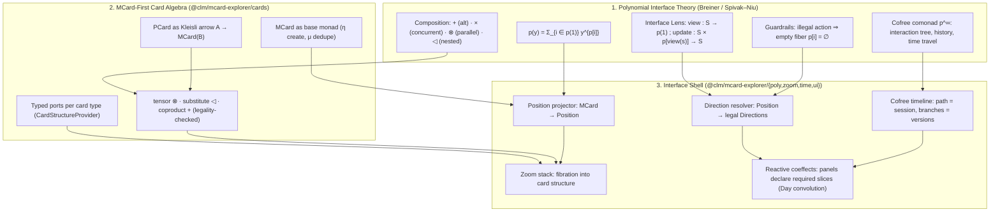

# Proposal: Sprints 36–40 — Polynomial Interface UI & Spatiotemporal Compositionality

**Series ID:** `PROPOSAL-36-40`
**Subsystem Category:** `interactions`, `shell`, `verification`
**Target:** `@clm/mcard-explorer/{poly,cards,zoom,time,ui}`, `src/components/workbench/explorer`, `src/components/workbench/CorpusExplorerDrawer.tsx`
**Baseline:** 670 Vitest tests / 109 files · 295 literal `data-testid` selectors + 17 dynamic prefix families · Contract D ≤ 250 LOC
**Governing Principle:** **MCard manipulation is the first-class object.** The explorer is not a file browser that happens to show cards; it is a *polynomial interface* over a content-addressed card algebra.
**Status:** 📋 Drafted / Active

---

## 1. Executive Summary & Problem Statement

Sprints 30–35 made `MCard Explorer` *multimodal*: any card type can be classified, rendered, exported, and persisted. It did not make it *compositional*. The interface still behaves like a static index — a list of things you look at — rather than an interface in the technical sense that **[[StudyNotes: Literature/Reading notes/@Spencer_Breiner_Polynomial_Interfaces|Spencer Breiner's *Polynomial Interfaces*]]** gives the word: a dependent structure of *positions* (shapes/views) and *directions* (the affordances legally available **at** each position).

### 1.1 Verified current state (measured, not assumed)

| Component | LOC | What it actually does |
| :--- | ---: | :--- |
| `src/components/workbench/CorpusExplorerDrawer.tsx` | 201 | View switcher + diagram list + rename/menu state + recovery banners + persistence footer (5+ concerns) |
| `src/packages/mcard-explorer/ui/MCardExplorer.tsx` | 193 | Search + facets + tree/flat toggle + keyboard nav + dual-pane + preview toggle (6 concerns) |
| `src/packages/mcard-explorer/core/MCardExplorerEngine.ts` | 193 | Query, facet, tree build, selection, sort, view mode, action routing (7 concerns) |
| `src/packages/mcard-explorer/ui/MCardViewer.tsx` | 172 | Header + viewport + toolbar + actions + error boundary |
| `src/components/workbench/explorer/ExplorerEntryRow.tsx` | 157 | Row + badges + inline rename + overflow menu; **15-prop / 10-callback interface** |
| `src/components/workbench/explorer/ExplorerSectionList.tsx` | 96 | **Pure pass-through** of the same 15 props to every row |
| `src/packages/mcard-explorer/ui/MCardTree.tsx` | 84 | Syntactic `:`-namespace tree; folders expand/collapse; leaves select — **zero affordances** |
| `src/packages/mcard-explorer/actions/ExplorerActionRegistry.ts` | 73 | Card-keyed action map with `isAvailable?(card)` — the seed of an affordance algebra |

### 1.2 The five structural defects

1. **Directions are not position-indexed.** `ExplorerEntryRow` hardcodes `Rename / Duplicate / Export / Preview / Archive` (`ExplorerEntryRow.tsx:131-151`), gated only by `type !== 'draft'`. The available actions do **not** depend on the card's universe, category, mutability, or the current selection/viewport. `ExplorerActionRegistry.isAvailable?(card)` is a partial step — it sees a *card*, never a *position* — so it cannot express "this button exists only in this state."

2. **Illegal actions are possible rather than impossible.** Nothing prevents `Rename` on a seeded example, `Archive` on a legacy-imported card, or `Export…` on a type with no exporter. Breiner's Semagrams result is the opposite discipline: *the interface supplies zero directions for illegal actions*, so the invalid state is unreachable rather than merely unhandled.

3. **The list view is a closed, monomodal union.** `ExplorerItem.type: 'draft' | 'diagram' | 'example'` (`ExplorerEntryRow.tsx:10`) cannot represent a markdown note, a PDF, a PCard, a Satori turn, or a `zx:artifacts:*` export — despite Sprints 30–35 having made all of those first-class card types. The diagrams list is structurally blind to the corpus it browses.

4. **The typed facet capability is present but unused.** `ExplorerQueryFacade.search()` already pushes `universe`, `category`, and `payloadKind` into **SQL `WHERE` clauses** (`ExplorerQueryFacade.ts:59-69`), and `ExplorerSearchFilter` documents them as SQL-level (`core/datasource/types.ts`). But `MCardExplorerEngine.refresh()` passes only `pattern` and `limit`, then filters client-side with `item.handle.toLowerCase().includes(facet)` (`MCardExplorerEngine.ts:117`). Facets are substring matches on *handle text*, not typed positions.

5. **No composition, no zoom, no time.** `OperadicMCardVfs` exposes `get / getContent / getByHash / putCard / set / on / withSavepoint / listHandles(prefix) / has / delete / getHandleHistory / exportSovereignDb / importBinary / verifyLensLaws / close`. There is **no** containment, port, composition, or structure-projection API. Consequently the UI can *display* an MCard but cannot *manipulate* one: no tensor composition, no nesting/substitution, no drill-down into a SQLite collection's contained cards or a PCard's net, and no navigable interaction history. The tree is built by `handle.split(':')` (`MCardExplorerEngine.ts:138`) — namespace syntax, not card structure.

### 1.3 Consequence for the vault's thesis

The vault is explicit that the card-centric system's interface *is* a card browser and that MCard is the base monad that PCard (Kleisli arrow) and VCard (monad transformer) are defined over — see **[[StudyNotes: Hub/Theory/Integration/The Card-Centric Operating System - Cordis, MVP Cards, and the Browser-Native PKC Mesh|The Card-Centric Operating System]]** §2.1.1, and the rank–nullity reading of the MVP triad in the Breiner note §1. Today's explorer honours the *storage* half of that thesis (content-addressed, immutable, provenance-bearing) but not the *interaction* half: the user manipulates rows in a list, not MCards in an algebra.

---

## 2. Strategic Vision: From Card Index to Polynomial Interface

**Thesis.** `MCard Explorer` becomes a *polynomial interface over the MCard algebra*: every view is a position, every affordance is a direction of that position's fiber, and every user act is a lens update that produces a new MCard-shaped state. Composition (⊗, ◁, +), structure zoom (fibration), and time (cofree interaction tree) become first-class interface operations rather than features bolted onto a list.



*Diagram: theory → card algebra → interface shell. Each layer consumes only the layer above it.*

### 2.1 Four commitments

| # | Commitment | Concrete consequence |
| :--: | :--- | :--- |
| **C1** | **MCard manipulation is first-class** | Every interface operation is expressed as an operation on cards (`create`, `get`, `derive`, `invoke`, `compose`, `zoom`), never on view-model rows. No `ExplorerItem`-style ad-hoc unions. |
| **C2** | **Directions are position-indexed and legal-by-construction** | The UI renders exactly `resolveDirections(position)`; illegal directions are *absent from the fiber*, so guardrails are structural, not validation callbacks. |
| **C3** | **Composition is an interface operation** | ⊗ / ◁ / + are available in the explorer with typed port checking; incompatible wiring has no direction and therefore cannot be attempted. |
| **C4** | **Space and time are navigable** | Structure zoom (space: fibration into contained cards) and cofree-tree timeline (time: session path, version branches, time travel) are primary navigation, not hidden menus. |

### 2.2 What "better Spatiotemporal Compositionality" means here

Following **[[StudyNotes: Literature/Spatiotemporal Computing - From M100 Hardware Dataflow and Cordis Algebraic Compositionality to Digital Synesthesia|Spatiotemporal Computing]]** and **[[StudyNotes: Literature/Reading notes/PDFAnnotated/Annotated PDF of Cordis - a Meta Framework for Spatiotemporal Composability|Cordis]]**:

- **Spatial composability** = *reactive coeffects*: each panel/view declares the precise slice of ambient context it requires and reacts to changes in it. Today the drawer, viewer, and explorer coordinate through broad global stores (`$corpusQuery`, `$corpusView`, `$previewCardHandle`) — coarse coeffects that cause cascading re-renders and implicit coupling.
- **Temporal composability** = *revertible effects* ($\partial\Gamma$): every context mutation carries a tracked inverse, so unmounting a panel, cancelling a composition, or rolling back a zoom leaves **zero residue**. Today the explorer's state mutations (`selectHandle`, `toggleFolder`, `setFacet`) are untracked and irreversible.

Both axes are currently absent from the interface. Sprints 38–39 add them.

---

## 3. Theoretical Foundations (Vault Citations)

| Source | Load-bearing idea for this series |
| :--- | :--- |
| **[[StudyNotes: Literature/Reading notes/@Spencer_Breiner_Polynomial_Interfaces]]** | `p(y) = Σ_{i∈p(1)} y^{p[i]}`; positions/directions; Elm loop as lens `S y^S → p`; guardrails; Day convolution for multi-component UI; cofree `p^∞` for debugging/time-travel |
| **[[StudyNotes: Literature/Annotation/Transcription of Polynomial Interfaces]]** · **[[StudyNotes: Literature/Annotation/Polynomial Interfaces Transcript by Spencer Breiner]]** | Full colloquium transcript: mode-dependent affordances (the submit button absent until the buffer is non-empty); Semagrams `dwd-zoom` multi-level drill-down; categorical database schema editor rejecting invalid connections |
| **[[StudyNotes: Fleeting/Inbox/Semagrams]]** | Port-graphs and wiring diagrams as syntax; functorial semantics; attributes on objects; "interface-based composition … explicit interfaces (ports)" |
| **[[StudyNotes: Hub/Theory/Integration/Lenses and Directionality in Web and Cloud Architecture]]** | Pattern 1 getter/setter split; **Pattern 2 component composition via Day convolution** ("composing stateful components without state entanglement"); **Pattern 3 state-dependent actions via position-indexed directions** |
| **[[StudyNotes: Hub/Theory/Integration/The Card-Centric Operating System - Cordis, MVP Cards, and the Browser-Native PKC Mesh]]** | MCard is the base monad (η/μ); PCard is a Kleisli arrow; VCard is a monad transformer; the PKC interface *is* a card browser; syscall table (`MCard.get`, `MCard.create`, `PCard.invoke`, `PCard.fork`) |
| **[[StudyNotes: Literature/Spatiotemporal Computing - From M100 Hardware Dataflow and Cordis Algebraic Compositionality to Digital Synesthesia]]** | Spatial = reactive coeffects; temporal = revertible effects $\partial\Gamma$; unified context category $\langle \Gamma, \partial\Gamma, \otimes, \mathbf{1}\rangle$ |
| **[[StudyNotes: Hub/Theory/Integration/State Recovery Paradigms - Replay, Inversion, and Atomic Mutation in Redux, Cordis, and Nanostores]]** | Replay vs inversion vs atomic mutation — the design space for the timeline and rollback semantics |
| **[[StudyNotes: Literature/People/Spencer Breiner]]** | Author context; NIST/QuICS; diagrammatic modelling and operads for systems engineering |

> **Vault reference convention.** `StudyNotes:` paths point outside this repository (vault root `~/Documents/DataVault/StudyNotes`). They are cited as code-spans rather than Markdown links so the repository's relative-link audit stays green.

---

## 4. What the Kernel Provides vs. What We Must Author

A hard constraint discovered while auditing: **`clm-kernel`'s `PolynomialFunctor` is *numeric* polynomial arithmetic, not polynomial-interface algebra.**

```ts
// node_modules/clm-kernel/dist/polynomial.d.ts — VERIFIED
export interface Monomial<A = unknown> { readonly coefficient: number; readonly exponent: number; readonly tag?: A; }
export declare class PolynomialFunctor<X = unknown> {
  evaluate(x: number): number;          // ← numeric evaluation
  compose(q: PolynomialFunctor<X>): PolynomialFunctor<X>;
  add(other: PolynomialFunctor<X>): PolynomialFunctor<X>;
  // …degree, derivative, scale, pow
}
```

There is **no** `Position`, `Direction`, `PolyInterface`, `Lens`, `Operad`, `Port`, or `Wiring` export in the kernel's root surface. `Poly` as *interaction algebra* must therefore be authored in `@clm/mcard-explorer/poly` — and the kernel's numeric form reused only where it genuinely applies (coefficient/exponent **censuses**, e.g. "this position has 3 directions" or degree-based cardinality checks), never as the interface model itself.

| Concern | Kernel (reuse) | Authored here (new) |
| :--- | :--- | :--- |
| Numeric polynomial arithmetic | `PolynomialFunctor`, `Monomial` | — |
| Type/universe judgment | `TypeInterpreter`, `TypeJudgment`, `UniverseLevel`, `UNIVERSE_NAMES` | Position projection on top |
| Petri/PCard structure | `PlaceDef`, `TransitionDef`, `ArcDef`, `MarkingMap`, `PetriNetTopology`, `fireTransition`, `isTransitionEnabled` | PCard `CardStructureProvider` + port derivation |
| Collection structure | `parsePortableSqlite`, `compilePortableSqlite`, `MCardFileSystem`, `TriDatabaseManager` | SQLite `CardStructureProvider` (contained cards) |
| Conversational structure | `parseSatoriXml`, `SatoriElement`, `satoriToMCard`, `speechActToSatoriMessage` | Satori `CardStructureProvider` (nested `<card>` elements) |
| Verification | `VCardResult`, `assessEquivalence`, `verifyMerkleIntegrity` | Composition legality witnesses |
| Lifecycle/disposal | `FiberLifecycle` (7 states), `DisposableList`, `SavepointGuard` | Revertible-effect journal over them |
| Interface algebra | **nothing** | `PolyInterface`, `Position`, `Direction`, `InterfaceLens`, `CardOperad`, `ZoomStack`, `InteractionTree` |
| Storage/VCS | `OperadicMCardVfs`, `MCardVcsEngine`, `ExplorerQueryFacade` | Composition/zoom adapters (ports only — ADR D42 holds) |

### 4.2 Kernel Layer Placement (ADR D57)

The kernel is a strict stratified stack. Every module this series authors must declare **which stratum it sits at** and consume only layers **at or below** it.

| Layer | Kernel surface (verified in `dist/index.d.ts`) | Our modules at this stratum | Import rule |
| :--- | :--- | :--- | :--- |
| **L0** — values & content identity | `TypedValue`, `TypedValueDict`, `computeContentHash`, `detectMime`, `isBinary`, `canonicalizeUri` | `cards/handles.ts` (η/μ over content), `poly/census.ts` (numeric polynomial) | root export |
| **L1** — process & dynamics | `PlaceDef`, `TransitionDef`, `ArcDef`, `MarkingMap`, `PetriNetTopology`, `fireTransition`, `isTransitionEnabled` | `cards/ports.ts` (PCard provider), `zoom/providers/PcardStructureProvider.ts` | root export |
| **L2** — storage & structured classification | `MCardFileSystem`, `TriDatabaseManager`, `parsePortableSqlite`, `compilePortableSqlite`, `buildMerkleTreeFromEntries`, `classifyClm`, `detectDialect` | `cards/handles.ts` ports, `zoom/providers/SqliteStructureProvider.ts`, `core/FacetResolver.ts` (typed filter vocabulary) | root export |
| **L3** — speech acts & conversational protocol | `parseSatoriXml`, `SatoriElement`, `satoriToMCard`, `speechActToSatoriMessage` | `zoom/providers/SatoriStructureProvider.ts` | root export |
| **L4** — membrane, gateways, viewlets | `HypermediaNode`, hypermedia renderers, `FiberLifecycle`, `DisposableList`, `SavepointGuard`, `PtrCordisEngine` | **`poly/`**, **`zoom/`**, **`time/`**, **`ui/`** — the interface strata | root export |
| **L5** — type lattice & meta | `TypeInterpreter`, `TypeJudgment`, `UniverseLevel`, `UNIVERSE_NAMES`, `isStratified`, `getUniverseCoordinates` | consumed only (never extended): `poly/types.ts` carries `TypeJudgment` by reference | **root export only** — see below |

> [!WARNING]
> **`layer5` has no subpath export.** Verified against the installed package: `exports` contains `.`, `./bin/clmEval`, `./layer0`, `./layer1`, `./layer2`, `./layer3`, `./layer4`, `./shared`, `./membrane`, `./gateway`, `./tui`, `./chatbot`, `./client` — and **no `./layer5`**. `dist/layer5/` exists on disk but is unreachable by import specifier. All lattice/judgment symbols must come from the **root** `'clm-kernel'` import. This is the same class of error corrected in the Sprints 30–34 audit; it is now an enforced gate (Sprint 40 `check-layer-imports.mjs`).

**Placement consequence.** The four new strata are all **L4** (interface/membrane) consuming L0–L3 read-only and L5 by reference. That is why none of them may hold storage, hashing, parsing, or execution logic: those belong to L0–L3 and are reused. A module that appears to need L2 logic must take a **port** instead (ADR D42).

### 4.3 `mcard-studio` Alignment Contract (ADR D54–D56)

`mcard-studio` is the reference implementation of *generalized MCard browsing and exploration*. Its conventions were verified in `~/Documents/Development/GovTech/MCard_TDD/mcard-studio` and are adopted here so the two hosts converge rather than diverge.

**What the studio already has (verified):**

| Studio artefact | Path | What it establishes |
| :--- | :--- | :--- |
| Facade + concern modules | `src/services/vfs/{vfsCore,vfsContent,vfsHandles,vfsMutations,vfsPersistence,vfsSync,vfsVersions,vfsAssets,vfsBootstrap,vfsCordis,vfsUtils}.ts` + `mcardVfs.ts` facade | 11 single-concern modules behind one facade — the decomposition pattern this series mirrors |
| Thin-orchestrator discipline | `views/fileTree/MCardFileTree.tsx` — *"thin orchestrator (≤150 lines, INV-304-09)"*, *"memoized tree construction (INV-304-10)"* | The studio's own LOC ceiling for orchestrators is **150**, matching our ADR D53 concern target |
| Hook-per-concern | `views/fileTree/hooks/{useFileTreeSync,useInlineRename,useDragAndDrop,useFolderContext,useCardInsertion}.ts` | Presentation concerns become hooks, not props — the pattern behind our `CardRowProps` reduction |
| Path tree projection | `src/utils/artifactTree.ts` — `buildArtifactTree`, `filterArtifacts`, `TreeNode` (dir-first sort) | The studio's tree; our `TreeProjection` must be semantically compatible |
| Ad-hoc direction resolution | `src/lib/renderers/forwardBrowsing.ts` — `findForwardBrowsingTargets` → `{reason: 'consumes' \| 'same-runtime' \| 'transition'}` | The studio's *informal* affordance fiber, computed by regex over YAML — the thing our `Direction` algebra generalizes |
| Cordis fiber binding | `src/hooks/useCordisFiber.ts` — `clientContext.isolate('fiber:name')` + `DisposableList` LIFO teardown on unmount | The host-side resource half of zero-residue disposal |
| Kenotic Cordis wiring | `src/services/vfs/vfsCordis.ts` — *"The Context is passed IN — never imported"*, `ctx.effect(fn)` returns a disposer, `ctx.provide('vfs.core', …)`, `declare module 'cordis'` augmentation | The dependency-inversion rule for host context |
| Viewlet registry + adapters | `views/cardViewlets/{CardViewletRegistry.ts,types.ts,ViewletErrorBoundary.tsx,ViewletLoadingSpinner.tsx}` | Already the port target of ADR D34 |
| Navigation strategy | `.agents/skills/mcard-navigation/SKILL.md` — Hybrid Explorer: sidebar tree + breadcrumbs + command palette; **"URL as State"**; *"Plugin System: Allow registering custom navigation providers"* | Our navigation must be **provider-based** and deep-linkable |
| Store discipline | `src/stores/*.ts` (11 nanostores atoms, incl. `$mcardTree`, `$activeMCard`, `$syncMode`) | Nanostores atoms are the natural coeffect slices |
| Root-only kernel imports | 39 files import `'clm-kernel'`; **zero** `clm-kernel/layer*` or `dist/` imports | The layer-import discipline is already studio convention |

**Ownership matrix (extends ADR D42):**

| Concern | `@clm/mcard-explorer` ships | `mcard-studio` implements / consumes |
| :--- | :--- | :--- |
| Interface algebra (`poly/`) | Full: positions, directions, lens, guardrails, registry, coeffect host | Consumes; binds `CoeffectHost` to its `Context` |
| Card algebra (`cards/`) | Full: ports, legality, composition, handle ops | Implements `CardStorePort`/`CardVcsPort`/`CardRuntimePort` over `studioMCardFs`; replaces `findForwardBrowsingTargets` with a port-backed provider |
| Zoom (`zoom/`) | Full: stack + providers | Adds providers for studio-only card types (Spatial3d, Webapp, Mesh topology) |
| Time (`time/`) | Full: interaction tree, journal, replay | Binds the journal to `useCordisFiber`'s `DisposableList` |
| Views (`ui/`) | Full, headless-safe | Mounts in `cardViewlets/` via `toCardViewletDefinition` (D34) |
| Navigation | `NavigationProvider` port + default providers | Registers custom providers (its documented extensibility plan) |
| Storage / VCS | Ports only | `studioMCardFs` (`vfsCore`) — the SSOT |

**Three rules the alignment imposes on every sprint:**
1. **Facade + concern modules** (ADR D54): each package exposes one façade per capability and splits its internals to ≤ 150 LOC single-concern modules; no module may be imported across concerns.
2. **Kenotic context** (ADR D55): host context (Cordis `Context`, stores) is **passed in, never imported**; every effect returns a disposer; disposal is zero-residual.
3. **Navigation is a port** (ADR D56): navigation providers, breadcrumbs, and deep links are expressed as ports/positions so both hosts — and the command palette — share one implementation.

---

## 5. Sprint Series Overview

| Sprint | Bin | Focus | Kernel stratum | Primary new modules |
| :---: | :--- | :--- | :--- | :--- |
| **36** | `interactions` | **Polynomial Interface Core & Affordance Algebra** — positions, dependent directions, lens, guardrails; typed facets; engine decomposition | **L4** consuming L5 (judgment) + L2 (typed filter vocabulary) | `poly/{types,lens,registry,guardrails,census,coeffects}.ts`, `core/{ExplorerStateStore,TreeProjection,FacetResolver,SelectionModel}.ts` |
| **37** | `interactions` | **MCard-First Card Algebra & Composition Surface** — monad ops, typed ports, ⊗ / ◁ / + with legality checking; kill the monomodal `ExplorerItem` union and the 15-prop interface | **L4** consuming L0 (η/μ), L1 (PCard ports), L2 (store ports) | `cards/{ports,legality,composition,handles,providers}.ts`, `ui/CardCompositionSurface.tsx` |
| **38** | `shell` | **Operadic Zoom & Multi-Level Navigation** — fibration into card structure (SQLite/Satori/PCard/ZX), zoom stack, boundary consistency | **L4** consuming L1/L2/L3 structure APIs | `zoom/{types,stack,boundary,providers/*}.ts`, `ui/{PositionTree,ZoomBreadcrumb}.tsx` |
| **39** | `shell` | **Cofree Timeline, Revertible Effects & Coeffect Panels** — interaction tree, time travel, tracked inverses, reactive coeffects, Day-convolution panel decoupling | **L4** consuming L4 lifecycle (`FiberLifecycle`, `DisposableList`, `SavepointGuard`) | `time/{InteractionTree,journal,replay,timeline}.ts`, `poly/coeffects.ts`, `ui/{TimelineScrubber,ViewerShell,ViewportHost}.tsx` |
| **40** | `verification` | **Polynomial Conformance, Guardrail Proofs & Host Realignment** — law suites (lens/monad/operad/tensor), guardrail negative tests, layer + dependency gates, drawer decomposition, mcard-studio parity | all strata (verifies placement) | `tests/conformance/polynomial-*.test.ts`, `scripts/{check-layer-imports,check-explorer-deps,audit-concerns}.mjs` |

Dependency chain: **36 → 37 → 38 → 39 → 40**. Sprint 37 needs the direction algebra; 38 needs ports; 39 needs the position/lens model; 40 verifies all four, enforces the layer gate, and migrates the host.

---

## 6. Architectural Decision Records (ADRs D46–D57)

### ADR D46: The Interface Polynomial Is Authored Here, Not Reused from the Kernel
- **Context**: `clm-kernel` exports `PolynomialFunctor`, but its `evaluate(x: number)` signature proves it is *numeric* arithmetic (coefficients × variable powers), not the positions/directions interaction algebra of Breiner/Spivak–Niu.
- **Decision**: Author `PolyInterface`, `Position`, `Direction`, and `InterfaceLens` in `@clm/mcard-explorer/poly`. Reuse the kernel's `PolynomialFunctor` **only** for numeric censuses of a resolved fiber (degree/cardinality assertions in tests and diagnostics), behind a thin adapter. Do **not** fork or extend the kernel class.
- **Consequence**: The interface algebra stays zero-DOM and host-agnostic; `mcard-studio` can adopt it unchanged.

### ADR D47: Directions Are Resolved, Never Hardcoded
- **Context**: `ExplorerEntryRow` hardcodes five menu items gated by `type !== 'draft'`; `ExplorerActionRegistry.isAvailable?(card)` sees a card but not a position.
- **Decision**: Views render **only** what `resolveDirections(position)` returns. A direction is `{ id, label, fiber, legality, execute }` where `legality(position): boolean` and an *empty* resolution is the guardrail — illegal acts have no DOM. Hardcoded button lists are prohibited in explorer views.
- **Consequence**: Guardrails become structural; the Semagrams "invalid connections cannot be dragged" property is inherited. Negative tests assert *absence*.

### ADR D48: MCard Is the Unit of Manipulation
- **Context**: The list view's closed `'draft' | 'diagram' | 'example'` union cannot represent the multimodal corpus built in Sprints 30–35.
- **Decision**: All interface operations are card operations — `cardCreate` (η), `cardGet` (μ-dedupe), `cardDerive`, `cardInvoke` (PCard as Kleisli arrow), `cardCompose`, `cardZoom`. View models are *projections* of positions, never independent unions. Adopt the Card-Centric OS syscall vocabulary.
- **Consequence**: One algebra serves tree, list, composition surface, and viewer.

### ADR D49: Typed Facets Replace Substring Matching
- **Context**: `ExplorerQueryFacade` already emits SQL `WHERE` clauses for `universe` / `category` / `payloadKind`; the engine ignores them and does `handle.includes(facet)` client-side.
- **Decision**: Facets are **typed filters** resolved to `ExplorerSearchFilter` fields and pushed to the data source. A facet is a *position predicate*, not a string. Client-side substring filtering is removed.
- **Consequence**: Facet semantics become correct and scalable; the engine's `refresh()` shrinks.

### ADR D50: Structure Zoom Is a Fibration with Boundary Consistency
- **Context**: `OperadicMCardVfs` has no containment API; the tree is `handle.split(':')`. The vault's Semagrams `dwd-zoom` and operadic-VFS readings both require drilling into a card's interior while preserving the outer contract.
- **Decision**: Introduce `CardStructureProvider` (per MIME/universe) projecting a card into child positions, composed into a `ZoomStack`. Editing or composing *inside* a zoom level must validate against the **outer** level's port contract before commit; a provider that cannot project a type yields an empty fiber (no zoom direction), never an error.
- **Consequence**: Hierarchical navigation becomes principled; nested edits cannot silently violate the enclosing interface.

### ADR D51: Time Is the Cofree Interaction Tree
- **Context**: `getHandleHistory()` returns a flat array; the UI has no timeline, and explorer mutations are untracked.
- **Decision**: Model the session as a path in the cofree comonad $p^\infty$ over the interface polynomial: nodes are positions, edges are taken directions, branches are alternative continuations (including version branches). Time travel = re-rooting the path; the VCS lineage supplies branch structure.
- **Consequence**: History, undo/redo, and "what could I have done here?" become one structure; debugging and user education share an implementation.

### ADR D52: Panels Declare Coeffects; Effects Are Revertible
- **Context**: `$corpusQuery`, `$corpusView`, `$previewCardHandle` are broad global stores; mutations are irreversible; Cordis's spatiotemporal duality is unimplemented in the shell.
- **Decision**: Each panel declares a **coeffect** (the context slices it requires) and re-evaluates reactively; inter-panel coordination follows Day convolution (independent local state, explicit interface). Every context mutation is recorded as a **revertible effect** with a tracked inverse in an operation journal, so unmount/rollback leaves zero residue.
- **Consequence**: Cascading re-renders and stale-state desynchronisation become structurally difficult; panel disposal is leak-free by construction.

### ADR D53: One Concern Per Module; No God Files
- **Context**: `CorpusExplorerDrawer` (201 LOC, 5+ concerns), `MCardExplorer` (193, 6 concerns), `MCardExplorerEngine` (193, 7 concerns), and a 15-prop / 10-callback interface passed through two components.
- **Decision**: Contract D's ≤ 250 LOC is treated as a **ceiling of last resort**, not a target. Modules are split by concern to ≤ 150 LOC with a single responsibility; prop interfaces are capped at 8 members, with action sets passed as *one resolved direction list* rather than N callbacks. Any module exceeding 150 LOC must document its second concern and the reason it has not been split.
- **Consequence**: The decomposition table in §7 is a deliverable, verified by an automated concern-audit script.

### ADR D54: Studio-Parity Module Contract — Façade + Concern Modules
- **Context**: `mcard-studio` decomposes its VFS into 11 single-concern modules behind one façade (`src/services/vfs/*` + `mcardVfs.ts`), and states its own orchestrator ceiling explicitly: *"thin orchestrator (≤150 lines, INV-304-09)"* in `views/fileTree/MCardFileTree.tsx`. Its presentation concerns live in hooks (`useFileTreeSync`, `useInlineRename`, `useDragAndDrop`, `useFolderContext`, `useCardInsertion`), not in prop lists.
- **Decision**: Adopt the same shape in `@clm/mcard-explorer`: **one façade per capability** (`poly/index.ts`, `cards/index.ts`, `zoom/index.ts`, `time/index.ts`), internals split to ≤ 150 LOC single-concern modules, and presentation concerns expressed as hooks rather than callbacks. Cross-concern imports (e.g. `cards/` importing `zoom/` internals) are forbidden; only the façade is importable by sibling packages.
- **Consequence**: Both hosts read the same module boundaries; `check-explorer-deps.mjs` enforces façade-only imports. Studio convergence needs no new conventions — it already follows them.

### ADR D55: Kenotic Host Context — Passed In, Never Imported; Effects Return Disposers
- **Context**: `mcard-studio`'s `vfsCordis.ts` states the rule directly — *"The Context is passed IN — never imported — so this module stays below the kenotic boundary and avoids the `cordisClient → mcardVfs` import cycle"* — and wires resources with `ctx.effect(fn)` (returns a disposer) plus `ctx.provide('vfs.core', …)` and a `declare module 'cordis'` augmentation. `useCordisFiber` binds component lifetime to `ctx.isolate('fiber:name')` and unwinds a `DisposableList` on unmount.
- **Decision**: No package module may import `cordis`, `cordisClient`, or any host store. Host context arrives as an **argument**; every effect returns a disposer; `OperationJournal` (Sprint 39) composes the kernel's `DisposableList` and mirrors `ctx.effect` semantics so that a studio fiber and a TikZiT panel dispose identically. Coeffect slices bind to host stores (nanostores atoms in both hosts) through the host, not the package.
- **Consequence**: Zero import cycles across the kenotic boundary; disposal is zero-residual (studio's INV-255-02) in both hosts by the same mechanism.

### ADR D56: Navigation Is a Port, and Positions Are Deep-Linkable
- **Context**: The studio's `mcard-navigation` skill specifies a "Hybrid Explorer" (sidebar tree + breadcrumbs + command palette), names **"URL as State"** as a core principle (`/mcard/[id]` deep links), and plans *"Plugin System: Allow registering custom navigation providers (e.g., fetching MCards from a remote GitHub repo instead of local files)"*. TikZiT has no such provider seam and no deep links.
- **Decision**: Introduce a `NavigationProvider` port (id, label, applicability predicate, `resolveRoot()` / `resolveChildren(position)`) and make every position **addressable**: `Position.id` is a stable, serialisable path that can be encoded in a URL hash and decoded back. Breadcrumbs (Sprint 38), the timeline (Sprint 39), and a command-palette surface are all *consumers* of the port, not separate navigation stacks.
- **Consequence**: One navigation implementation serves TikZiT, `mcard-studio`, and a headless CLI; adding a corpus source (remote, mesh, archive) is a provider registration, not a UI change.

### ADR D57: Every Module Declares Its Kernel Stratum; Imports Go Upstream Only
- **Context**: §4.2 establishes the placement table. `clm-kernel`'s `exports` map omits `./layer5` (verified), so lattice symbols are root-export-only; a deep import fails module resolution at build time.
- **Decision**: Each module's header comment declares its stratum (`@layer L4`) and the kernel symbols it consumes. Consumption is **at or below** the module's stratum, from the **root** `'clm-kernel'` export only. New strata in this series are all L4 (interface) consuming L0–L3 read-only and L5 by reference. `check-layer-imports.mjs` (Sprint 40) fails the build on a violation, including any `clm-kernel/layer*`, `clm-kernel/dist/*`, or `./layer5` specifier.
- **Consequence**: The layered approach stops being documentation and becomes a build gate; storage/parsing/execution logic cannot leak into the interface strata.

---

## 7. God-File & Dependency Remediation Map

| Current module | LOC | Concerns | Target decomposition (Sprint) |
| :--- | ---: | ---: | :--- |
| `MCardExplorerEngine.ts` | 193 | 7 | `ExplorerStateStore` (state+subscribe) · `TreeProjection` · `FacetResolver` (typed) · `SelectionModel` · `ExplorerEngine` façade ≤ 120 (**36**) |
| `MCardExplorer.tsx` | 193 | 6 | `ExplorerToolbar` (search+view toggle) · `FacetStrip` · `ExplorerListPane` · `ExplorerPreviewPane` · `ExplorerKeyboardScope` (**36**) |
| `CorpusExplorerDrawer.tsx` | 201 | 5+ | `DrawerViewSwitcher` · `DiagramListView` · `DrawerBanners` · `DrawerPersistenceFooter` · thin `CorpusExplorerDrawer` shell ≤ 120 (**40**) |
| `ExplorerEntryRow.tsx` | 157 | 4 | `CardPositionRow` (render) · `CardRowAffordances` (directions) · `InlineRenameField` · 15 props → 1 resolved direction list (**37**) |
| `ExplorerSectionList.tsx` | 96 | 2 | `PositionGroupList` — drops the pass-through prop wall (**37**) |
| `MCardTree.tsx` | 84 | 2 | `PositionTree` (folders with affordances + zoom affordance) (**38**) |
| `MCardViewer.tsx` | 172 | 5 | `ViewerShell` · `ViewerHeader` (already extracted toolbar) · `ViewportHost` (**39**) |

**Dependency rules** (enforced by `scripts/check-explorer-deps.mjs` + `scripts/check-layer-imports.mjs`, Sprint 40):
- **Façade-only imports** (ADR D54): sibling packages import `poly/index.ts`, `cards/index.ts`, `zoom/index.ts`, `time/index.ts` — never internals.
- **Layer discipline** (ADR D57): every module declares `@layer`; kernel consumption is root-export-only and at-or-below the module's stratum; `clm-kernel/layer*`, `clm-kernel/dist/*`, and `./layer5` specifiers fail the build.
- `poly/` depends on **nothing** but types (`clm-kernel` root imports, type-only).
- `cards/` depends on the `poly/` façade + kernel L0/L1/L2 APIs; **never** on `ui/`.
- `zoom/`, `time/` depend on the `poly/` and `cards/` façades; never on `mcard-vcs` concretes (ADR D42).
- `ui/` depends on all four façades; host (`src/components/workbench`) depends on `ui/` only.
- **Kenotic boundary** (ADR D55): no package module imports `cordis`, `cordisClient`, or host stores; context is an argument.

---

## 8. Verification Strategy

| Gate | Method |
| :--- | :--- |
| **Lens laws** | GetSet / SetGet / SetSet property tests over every registered `InterfaceLens` (Sprint 40) |
| **Monad laws** | Left unit, right unit, associativity for `cardCreate`/`cardGet`/`cardDerive` (Sprint 40) |
| **Operad & tensor laws** | Associativity of ◁; coherence of ⊗ with `+`; identity port (Sprint 40) |
| **Guardrail proofs** | Negative tests: illegal direction is **absent** from the resolved fiber for ≥ 12 adversarial cases (Sprint 37/40) |
| **Boundary consistency** | Zoom-inner edit rejected when it violates the outer port contract (Sprint 38/40) |
| **Zero residue** | Revertible-effect journal replay: unmount/rollback leaves byte-identical context (Sprint 39/40) |
| **Coeffect isolation** | Panel state changes do not re-render unrelated panels (Sprint 39/40) |
| **Contract B** | `node scripts/audit-testids.mjs --check` against the regenerated baseline; new selectors added deliberately |
| **Contract D/E** | ≤ 250 LOC ceiling (≤ 150 concern target), zero DOM globals in headless modules |
| **Kernel layer placement** (D57) | `check-layer-imports.mjs`: every module declares `@layer`; root-export-only kernel imports; no `layer*`/`dist`/`layer5` specifiers |
| **Façade discipline** (D54) | `check-explorer-deps.mjs`: sibling imports go through `index.ts` façades only; no cross-concern internals |
| **Kenotic boundary** (D55) | grep gate: zero `cordis`/`cordisClient`/host-store imports inside `@clm/mcard-explorer`; context is an argument everywhere |
| **Studio parity** | `tests/conformance/studio-parity.test.ts`: `TreeProjection` ≡ `buildArtifactTree` semantics; `toCardViewletDefinition` field parity; `NavigationProvider` shape parity; journal teardown ≡ `useCordisFiber` semantics |
| **Regression** | Full Vitest suite (670 baseline) + Playwright |

---

## 9. Risks & Mitigations

| Risk | Mitigation |
| :--- | :--- |
| Interface algebra becomes academic and unusable | Every abstraction must ship with a *visible* UI consequence in the same sprint (guardrails, composition surface, zoom, timeline). No abstraction without a surface. |
| Over-fragmentation into 40 micro-modules | Concern-based split with a hard minimum (≥ 40 LOC) and a documented second concern when a module exceeds 150 LOC. |
| `mcard-studio` divergence | ADR D54 adopts the studio's own module contract (façade + ≤150-LOC concern modules + hook-per-concern), so convergence requires no new studio conventions. ADR D55 adopts its kenotic Cordis rule verbatim. Sprint 40 runs a parity suite against `buildArtifactTree`, `CardViewletDefinition`, `NavigationProvider`, and `useCordisFiber` teardown semantics. |
| Layer drift (interface code absorbing L0–L3 logic) | ADR D57 makes the stratum a declared, gated property; `check-layer-imports.mjs` fails the build on a deep kernel import or a wrong-stratum consumption. |
| Two `DisposableList` implementations (studio `src/fiber/disposable.ts` vs kernel export) | The series uses the **kernel** export; Sprint 39's journal composes it, and Sprint 40 records the studio convergence item (studio keeps its path-inversion contract `p · (−p) ≃ refl` as a documented wrapper, not a fork). |
| Migration churn in the host drawer | Sprint 40 keeps all Contract B selectors; the switcher and diagram list are preserved as projections, not rewritten. |
| Kernel capability over-claim | §4.1 table is the authority: numeric `PolynomialFunctor` is **not** the interface algebra; ADR D46 forbids pretending otherwise. §4.2 records that `layer5` is not importable as a subpath. |

---

## 10. See Also

**Vault (theory)**
- **[[StudyNotes: Literature/Reading notes/@Spencer_Breiner_Polynomial_Interfaces]]** — primary source for this series.
- **[[StudyNotes: Hub/Theory/Integration/Lenses and Directionality in Web and Cloud Architecture]]** — the three architectural patterns this series implements.
- **[[StudyNotes: Hub/Theory/Integration/The Card-Centric Operating System - Cordis, MVP Cards, and the Browser-Native PKC Mesh]]** — MCard-as-monad, syscall vocabulary.
- **[[StudyNotes: Literature/Spatiotemporal Computing - From M100 Hardware Dataflow and Cordis Algebraic Compositionality to Digital Synesthesia]]** — coeffect/effect duality.

**`mcard-studio` (reference implementation — `~/Documents/Development/GovTech/MCard_TDD/mcard-studio`)**
- `src/services/vfs/*` + `mcardVfs.ts` — façade + 11 concern modules (ADR D54 precedent).
- `src/components/studio/views/fileTree/MCardFileTree.tsx` + `hooks/*` — thin orchestrator (≤150 LOC, INV-304-09) + hook-per-concern.
- `src/utils/artifactTree.ts` — `buildArtifactTree` / `TreeNode` (tree parity target).
- `src/lib/renderers/forwardBrowsing.ts` — `findForwardBrowsingTargets` (the ad-hoc direction fiber this series generalizes).
- `src/hooks/useCordisFiber.ts`, `src/services/vfs/vfsCordis.ts` — kenotic context + disposer discipline (ADR D55).
- `src/components/studio/views/cardViewlets/*` — viewlet registry + error boundary/loading patterns (ADR D34 port target).
- `.agents/skills/mcard-navigation/SKILL.md` — Hybrid Explorer, URL-as-state, navigation providers (ADR D56).

**Graduated precedent (this repository)**
- `docs/sprints/interactions/31-pluggable-polyglot-renderer-registry-and-viewlets/` (registry/descriptor patterns)
- `docs/sprints/shell/33-universal-mcard-viewer-and-explorer-integration/` (viewer shell)
- `docs/sprints/interactions/35-multimodal-artifact-export-and-database-persistence/` (action bridge)
