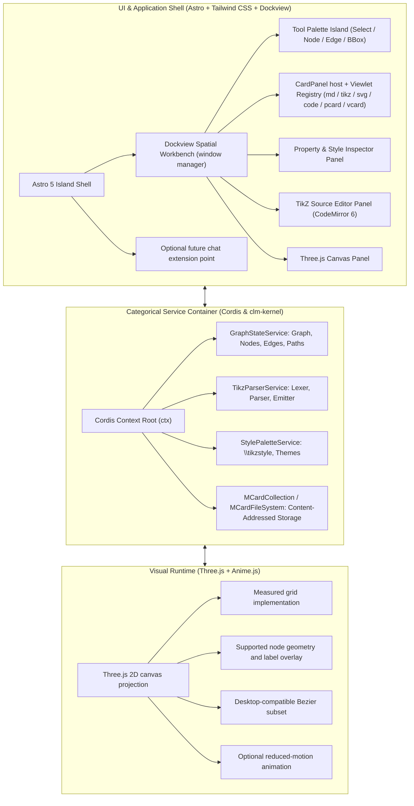

# TikZiT Web: Active Sprints Suite
**Master Roadmap for Astro + Three.js + Anime.js + Tailwind + clm-kernel Web Application**

> *Transforming TikZiT from a native desktop application into a state-of-the-art, high-performance, categorical Web platform for quantum processes and string diagrams.*

---

## 1. Architectural Vision

**TikZiT Web** is a complete, modern web re-implementation of **TikZiT** (the graphical editor used for all 2,500+ diagrams in Cambridge University Press's *Picturing Quantum Processes* by Bob Coecke and Aleks Kissinger).

This suite of active sprints specifies the transition of TikZiT's C++/Qt architecture into a modular, cloud-ready, and offline-capable Web platform leveraging:
- **Astro (proposed; version to pin in Sprint 00)**: Static-first shell with one hydrated React workbench island; keep Dockview panels inside that island to preserve a single client-side state/lifecycle boundary.
- **Three.js**: Hardware-accelerated WebGL 2D/3D canvas with infinite procedural grid shaders, vector node meshes, and GPU-driven curved bezier edges.
- **Anime.js (optional; API/version to verify)**: Use only for presentation-level motion after deterministic edits work; honor reduced-motion preferences and do not make domain state depend on animation completion.
- **Tailwind CSS**: Sleek, high-density technical UI with dark/light themes, floating toolbars, and responsive dockable property inspectors.
- **Dockview** (`dockview-react`): the workbench window manager — a VS Code-grade docking engine providing split/tabbed/floating panel groups, sash resizing, and serializable layouts (`toJSON`/`fromJSON`). Every document surface (canvas, TikZ source, inspector, preview) is a Dockview panel.
- **CardPanel Viewlet Substrate**: mcard-studio's universal content panel design — every opened MCard renders in a `card` Dockview panel whose **viewlet registry** picks the best renderer by MIME/schema (`.tikz` → Three.js canvas, `.md` → Markdown viewlet, `.svg`/images → image viewlet, `.tikzstyles`/JSON → schema/code viewlet, PCard/VCard → triadic/witness viewlets, fallback → raw hex/text). Mode tabs (Visual | Text | Raw Data | Payload CAS | Merkle Proof) are capability-gated per card.
- **Markdown Authoring (phased)**: planned CodeMirror source editing and safe basic preview; wiki-links, KaTeX, Mermaid, transclusion, and inline TikZ are optional extensions gated by security, package, and performance validation.
- **Conversational Programming (optional future extension)**: Koishi/Satori are considered design/protocol references, not selected runtime dependencies. A later provider adapter may present typed proposals; edits require a visible diff, explicit user approval, schema validation, and the ordinary undoable command path. No model execution or provider secrets are part of the core MVP.
- **clm-kernel / Cordis (proposed; API and browser support to verify)**: intended CLM/MCard integration behind an adapter. Pin only versions that pass the repository's ESM/browser/license/storage smoke tests; the desktop repo currently has no npm integration.

> **Package note:** the bare `mcard` package on npm is an unrelated React component library. All MCard types (`MCard`, `MCardCollection`, `MCardFileSystem`, `StorageBackend`) come from `clm-kernel`.

> **Design provenance (mcard-studio):** the workbench window-management model is adapted from the **mcard-studio** project (`MCard_TDD/mcard-studio`) — the reference CLM-native PWA workbench built on Astro + React + `dockview-react`. We adopt its *design* — shell anatomy (Activity Bar → sidebars → editor grid → bottom panel → status bar), tab/sash/keyboard semantics, the depress/restore "kenotic shell" lifecycle, `clm:*`-style CustomEvent routing, BroadcastChannel window sync, and persisted serialized layouts — re-implemented natively for TikZiT. **No mcard-studio code is imported**; this suite specifies an equivalent design in this repository's own codebase.

---

## 2. Repository Baseline, Feasibility Gates, and Delivery Status

The repository currently contains the native Qt/C++ TikZiT application, its Flex/Bison parser, and Qt tests. It does **not** yet contain the proposed Astro/React/TypeScript application, npm manifest/lockfile, Vitest setup, Playwright setup, or web runtime. Treat this suite as a greenfield web implementation plan that uses the native application as a behavioral reference and differential-test oracle; none of the planned web components or tests should be described as implemented until they exist and pass in this repository.

Before feature work, Sprint 00 must establish: (1) a buildable web shell and CI baseline; (2) a small dependency/API spike for Dockview, Cordis/clm-kernel, and the selected TeX engine; (3) the supported TikZ subset and known limitations; and (4) licensing/provenance review for any ported or adapted parser behavior. Versions and API examples remain provisional until pinned in a lockfile and exercised by a smoke test. Deliver in vertical slices with explicit exit criteria; sprint durations and global performance numbers are targets to measure, not commitments.

The corpus files/gallery may be present as fixtures, but their presence does not imply that browser E2E, MCard ingestion, visual parity, or mathematical verification has run. Mark each deliverable complete only with a reproducible command and recorded result.

## 3. The CLM Developmental Model

The following mapping is the intended design, not current application behavior. Verify package APIs and keep the integration behind an adapter. Use the **Cubical Logic Model** where it adds traceable value, without requiring every UI event, test assertion, render frame, or transient editor state to become an MCard/PCard/VCard:

| CLM Layer / Concept | Role in TikZiT Web |
| :--- | :--- |
| **MCard** (resting state, `s ∈ S`) | Immutable, content-addressed value: `.tikz` sources, `.tikzstyles` sheets, `GraphAST` snapshots, exported SVG/PDF artifacts. Hashed with prefixed BLAKE3 by default (SHA-256 supported via `Sha256Provider`). |
| **PCard** (function, FND) | Represent meaningful reusable transformations as PCards when useful; keep pure parser/rendering functions independently testable and avoid wrapping trivial/internal steps. Confirm exact `CordisCoeffects` fields against the pinned kernel API. |
| **BooleanPCard** (X → 2) | Invariant gates (Hoare preconditions/postconditions): parse success, round-trip fidelity, layout bounds — returning `BailVerdict.pass()` / `BailVerdict.bail(reason)`. |
| **VCard** (verification sandwich) | Use for selected reproducible, release/domain verification runs after validating the API; ordinary unit/E2E test results remain in the test runner and CI artifacts. |
| **Lifecycle MCards** | Sprint bookkeeping uses the built-in schemas: `SprintStatusMCard`, `ArtifactMCard`, `DesignDecisionMCard`, `CommitMCard`, `FeedbackMCard` (`clm-kernel` `schemas/lifecycle`). |
| **TriDatabaseManager** | Three pillars: `knowledge` (styles, grammar schemas, corpus), `execution_log` (commands, verification receipts), `mcard` (active diagram workspace + handles). |
| **Storage backends** | Select only after the Sprint 00 package/API and browser persistence spike. Verify quota, flush/commit, migration, and recovery behavior; keep a replaceable storage adapter. |

`MCardCollection` is a **G-Set CRDT**: append-only and content-addressed with **no delete operation**. Document versioning uses handle lineage (`putWithHandle` → `history(handle)`), not mutable records.

---

## 4. Active Sprint Matrix

| Sprint ID | File | Phase / Epoch | Core Focus & Tech Stack | Status |
| :--- | :--- | :--- | :--- | :--- |
| **Sprint 00-A** | [SPRINT-00-ZX-DEMO-SVG-CORPUS.md](./SPRINT-00-ZX-DEMO-SVG-CORPUS.md) | **Fixtures** | TikZ/SVG reference corpus and static gallery | **Assets present; web validation pending** |
| **Sprint 00** | [SPRINT-00-MASTER-ORCHESTRATION.md](./SPRINT-00-MASTER-ORCHESTRATION.md) | **Bootstrap & Architecture** | Web app baseline, dependency/API spikes, scope and acceptance gates | **Planned** |
| **Sprint 01** | [SPRINT-01-CORE-DOMAIN-AND-AST-PARSER.md](./SPRINT-01-CORE-DOMAIN-AND-AST-PARSER.md) | **Foundation** | Supported-subset TypeScript parser/emitter and differential tests | **Planned** |
| **Sprint 02** | [SPRINT-02-ASTRO-SHELL-AND-CORDIS-RUNTIME.md](./SPRINT-02-ASTRO-SHELL-AND-CORDIS-RUNTIME.md) | **Workbench Shell** | Astro client workbench, Dockview, validated service adapter | **Planned** |
| **Sprint 03** | [SPRINT-03-THREEJS-WEBGL-CANVAS-ENGINE.md](./SPRINT-03-THREEJS-WEBGL-CANVAS-ENGINE.md) | **Rendering Core** | Three.js 2D projection for the explicitly supported graph subset | **Planned** |
| **Sprint 04** | [SPRINT-04-INTERACTIVE-GESTURES-AND-ANIMEJS-PHYSICS.md](./SPRINT-04-INTERACTIVE-GESTURES-AND-ANIMEJS-PHYSICS.md) | **Interaction** | Core tools, deterministic commands, accessible input handling | **Planned** |
| **Sprint 05** | [SPRINT-05-STYLE-PALETTE-AND-PROPERTY-INSPECTOR.md](./SPRINT-05-STYLE-PALETTE-AND-PROPERTY-INSPECTOR.md) | **Styling & Inspector** | Desktop-parity style subset plus explicitly identified extensions | **Planned** |
| **Sprint 06** | [SPRINT-06-PREVIEW-PIPELINE-AND-EXPORTERS.md](./SPRINT-06-PREVIEW-PIPELINE-AND-EXPORTERS.md) | **TeX & Export** | TeX engine spike, preview and tested export formats | **Planned; engine feasibility gate required** |
| **Sprint 07** | [SPRINT-07-STATE-SYNCHRONIZATION-AND-MCARD-PERSISTENCE.md](./SPRINT-07-STATE-SYNCHRONIZATION-AND-MCARD-PERSISTENCE.md) | **Persistence** | Editor sync, undo/redo, MCard adapter and conflict handling | **Planned; API contract gate required** |
| **Sprint 08** | [SPRINT-08-VERIFICATION-BENCHMARKING-AND-DEPLOYMENT.md](./SPRINT-08-VERIFICATION-BENCHMARKING-AND-DEPLOYMENT.md) | **QA & Release** | Browser capability matrix, measured budgets, offline and release gates | **Planned** |

---

## 5. Technology Stack Mapping

---
---

## 6. Proposed Testing Hierarchy & Playwright E2E Matrix

After Sprint 00 establishes these tools, use **Vitest** for pure logic and service-adapter tests and **Playwright** for user journeys. The test paths below are planned targets, not existing tests. Run WebGL rendering assertions only in browser/CI configurations proven to expose the required context; use capability/fallback tests in other engines instead of assuming identical GPU behavior across Chromium, Firefox, and WebKit.

| Sprint ID | Focus | Playwright E2E Test Suite | Key E2E Scenarios Validated |
| :--- | :--- | :--- | :--- |
| **Sprint 00-A** | Reference Corpus | `e2e/corpus/gallery-visual.spec.ts` | 12 PQP reference SVG cards, SVG DOM tags, dark mode visual stability, modal inspection |
| **Sprint 01** | Domain & AST | `e2e/sprint-01/ast-roundtrip.spec.ts` | Supported-subset browser parsing, normalized semantic round-trip on reviewed fixtures, source-located diagnostics |
| **Sprint 02** | Shell & Cordis | `e2e/sprint-02/workbench-shell.spec.ts` | Initial Dockview shell, layout resize/restore, tool buttons (`S`/`V`/`E`/`B`), theme and input suppression |
| **Sprint 03** | Three.js WebGL | `e2e/sprint-03/webgl-canvas.spec.ts` | Canvas mounting, coordinate projection, reviewed fixture comparison, and context-loss/fallback behavior |
| **Sprint 04** | Gestures & Motion | `e2e/sprint-04/interactive-gestures.spec.ts` | Node placement, wire drag/connect, curvature handles, marquee selection, reduced-motion handling |
| **Sprint 05** | Styles & Inspector | `e2e/sprint-05/style-palette.spec.ts` | Palette categories from fixture metadata, Z/X swatch application, label editing and style editor |
| **Sprint 06** | Preview & Exports | `e2e/sprint-06/preview-exporters.spec.ts` | Verified supported TeX fixtures, cold/warm timing report, clipboard/download fallbacks and actual export validation |
| **Sprint 07** | Sync & MCard | `e2e/sprint-07/sync-mcard.spec.ts` | CodeMirror/Canvas valid-buffer sync, undo/redo, committed-document reload and storage-failure recovery |
| **Sprint 08** | QA & Deploy | `e2e/sprint-08/e2e-master-suite.spec.ts` | Browser capability matrix, measured performance profiles, local-document offline recovery |

---

## 7. Master Definition of Done (DoD) Quality Standard

No sprint may graduate from `docs/sprints/_active/` to its permanent archive directory in `docs/sprints/` until its checklist is executable in the repository and evidence (commands, results, supported-browser notes) is recorded. Do not treat aspirational targets as pass/fail gates until a baseline has been measured:

- [ ] **Supported-Subset Parity**: Documented element behavior, coordinate math, and property semantics match desktop TikZiT; unsupported constructs are explicit.
- [ ] **Unit Tests**: all implemented tests pass; set coverage thresholds only after the parser/domain boundaries and baseline are established.
- [ ] **Playwright E2E**: all required workflows pass in the browser engines actually configured and supported; WebGL assertions are capability-gated.
- [ ] **Visual Regression**: compare controlled renders with documented dimensions/engine; use geometry/semantic tests where cross-engine pixel stability is not realistic.
- [ ] **Performance**: report measurements on named fixtures/devices and set regression budgets from repeatable baselines.
- [ ] **Resource Lifecycle**: repeated open/close, undo/redo, and context-loss tests show owned resources/listeners are released.
- [ ] **CLM/MCard (if selected)**: only committed state uses the verified content-addressed adapter; audit scope and retention are explicit.
- [ ] **Graduation Protocol**: Sprint document finalized, DoD checkboxes verified, and archive updated.
