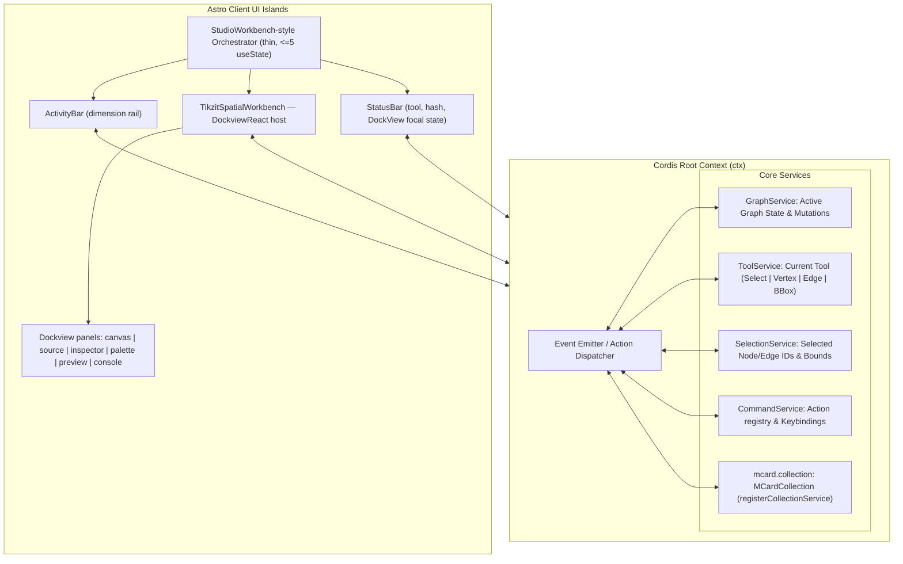

# Sprint 02: Astro Shell & Cordis Service Container

> *"A creative workbench must feel responsive, seamless, and rock-solid. We scaffold the Astro application with Tailwind CSS and integrate clm-kernel's Cordis service container to drive all reactive state."*

---

## 1. Objectives & Scope
1. **Astro 5 Project Scaffold**:
   - Modern Astro setup with Tailwind CSS (configured with dark mode and technical typography).
   - Component island architecture ensuring zero runtime overhead for static chrome.
   - Static-first build; if SSR is introduced later, host the kernel behind `clm-kernel/gateway` (the Triad Gateway for Astro/Next.js/Vite).
2. **Cordis / CLM Kernel Service Integration**:
   - First verify package availability, ESM/browser compatibility, declared exports, license, and the exact APIs required by the app. Pin tested versions in the package manifest and lockfile; wrap the chosen kernel API behind `src/services/kernel.ts`. Do not assume a version/API based on the mcard-studio source or an earlier plan.
   - Select a Dockview release after the spike, pin the exact compatible version in the lockfile, and verify the React/Astro client-only integration, required panel APIs, theme imports, serialization/restoration, and browser support against that release. Do not use an open-ended `^8.x` range as the reproducibility pin.
   - Establish the root service context and register only the services needed by the first vertical slice. Use Cordis/clm-kernel plugins or built-ins only after their exact exports/lifecycle are confirmed by Sprint 00's smoke test; otherwise keep a small local adapter and avoid speculative service names.
3. **Dockview Spatial Workbench** (window manager: `dockview-react`; design lineage: **mcard-studio**, design only — no code import):
   - **Activity Bar** (48px left rail): dimension switcher (Canvas / Styles / Preview) + settings gear; 2px active indicator.
   - **Left Sidebar** (160–600px, default 260px, `Cmd+B`): Tool Palette (`Select`, `Vertex`, `Edge`, `BBox`) + file/corpus explorer.
   - **Editor Grid**: tab bar + Dockview host. Start with `welcome`, `source`, and a placeholder `canvas` panel; introduce inspector/palette/preview/card viewlets in the dependent sprints. Keep each panel as a client-side React component inside the single workbench island, not a separately hydrated Astro island.
   - **Bottom Panel** (80–500px, default 200px, `` Ctrl+` ``): tabs `Problems` / `Output` / `Console`, with maximize-restore and close controls.
   - **Secondary Sidebar — Chat (deferred/disabled by default)**: reserve a Dockview-compatible extension point only. Do not ship a model selector, provider credentials, LLM execution, or Satori command dispatch in the shell sprint; those require a separately scoped security/provider design and an explicit user-confirmation flow.
   - **Status Bar** (24px): tool state, cursor coordinates, snap indicator, MCard hash, storage-backend and `DockView: N tabs` indicators.
   - **Sashes**: 5px draggable separators (`role="separator"`, `aria-orientation`), hover/drag accent line, double-click reset to defaults; inside the Dockview host, sash double-click equalizes groups to 50/50.
   - **Tab semantics**: `openTabs` map + `activeTabKey`; Close / Close All (`Cmd+K Cmd+W` chord) / Close Others / Close to the Right; scrollable tab track with overflow arrows; active tab auto-scrolled into view.
   - **Kenotic depress/restore**: `$isWorkbenchDepressed` atom — Welcome viewport (zero IDE chrome) ↔ elevated workbench via a floating `DockviewRestoreAnchor`-style button and the status-bar indicator, with zero state loss.
   - **MVP split & fullscreen**: in-window Dockview split/close/swap and the W3C Fullscreen API with graceful denial handling. Native tab split and satellite/dual-window modes are deferred until browser capability and cross-window recovery spikes pass.
4. **Global Keybinding Engine**:
   - Bind hotkeys matching TikZiT desktop (`src/gui/tikzscene.cpp` `keyPressEvent`): `S` (Select), `V`/`N` (Vertex), `E` (Edge), `B` (Bounding box / crop), `Cmd/Ctrl+Z` (Undo), `Cmd/Ctrl+Shift+Z` (Redo), `Backspace/Delete` (Delete selected), `Ctrl+Arrow`/`Ctrl+Shift+Arrow` (node nudge; see the desktop increments in Sprint 04). Document keys are scoped to the active Dockview group.
   - Workbench chrome keys (mcard-studio parity): `Cmd/Ctrl+Shift+P` palette, `Cmd/Ctrl+P` quick open, `Cmd/Ctrl+B` sidebar, `` Ctrl+` `` bottom panel, `Cmd/Ctrl+\` split toggle, `Cmd/Ctrl+S` save, `Cmd/Ctrl+K Cmd/Ctrl+W` close-all chord.
   - Note: desktop TikZiT's toolbar exposes only Select/Vertex/Edge — the `CROP`/`BBOX` tool exists in the tool enum and is reachable via `B`; we surface it explicitly in the web UI.

---

## 2. Technical Architecture & Service Mesh



### 2.1 Cordis Integration Notes
- Services declare dependencies via `ctx.inject('name')` / `ctx.inject([...], cb)`; UI islands never hold direct references to each other.
- All mutations flow as commands/events on the context (e.g. `ctx.emit('tool:set', 'edge')`, `ctx.emit('graph/node:add', {...})`), keeping rendering, state, and UI decoupled per the master invariants.
- `CordisCoeffects` declared by PCard stages (parser, exporter) resolve against this same context via `resolveCoeffects`.

### 2.2 Dockview Window-Management Design (mcard-studio lineage)

The window manager is **Dockview** (`dockview-react@^8.x`). The workbench adopts the mcard-studio interaction design but is reimplemented for TikZiT. Before coding against the design, verify each named event/API against the pinned Dockview version; examples in this plan describe behavior, not guaranteed method names:

- **Thin orchestrator**: `TikzitWorkbench.tsx` owns only chrome visibility state (sidebar/bottom-panel/chat visible, bottom maximized, settings open). All document/layout state lives in stores synced to `DockviewApi`.
- **`useDockviewSync` analog**: on `DockviewReadyEvent` → `api.fromJSON(savedLayout)`; fallback: one panel per open tab, else a default `canvas` + `source` pair. `onDidLayoutChange` → debounced (250ms) `api.toJSON()` → workspace-layout store (localStorage now, MCard snapshot in Sprint 07); never persist 0-panel layouts. `onDidActivePanelChange` / `onDidRemovePanel` → Cordis actions (`tikzit:tab:select`, `tikzit:tab:close`) with an `isSyncing` re-entrancy guard.
- **Panel registry**: `components = { card, canvas, source, inspector, palette, preview, console, welcome }`; panels added via `api.addPanel({ id, component, title, params: { handle }, position: { referencePanel, direction } })`.
- **Command routing**: use a typed command/service boundary for chrome-to-panel actions. Prefer Dockview's documented API for docking/layout and keep any app-level events local, namespaced, and covered by tests; do not make cross-window synchronization or a large CustomEvent vocabulary a shell prerequisite.
- **Command palette & quick open**: `Cmd/Ctrl+Shift+P` command palette dispatching `cmd:*` IDs (`cmd:view:sidebar`, `cmd:view:panel`, `cmd:view:split`, `cmd:view:chat`, `cmd:dock:depress`, `cmd:dock:restore`, `cmd:tabs:close-all`); `Cmd+P` quick open for `.tikz`/`.md` handles.
- **Performance**: `React.lazy` for the Dockview host; `registerIdlePrewarm` (`requestIdleCallback`, respects `Save-Data`/2g, `?noprewarm=1` escape hatch); skeleton suspense fallback and an error boundary around the dock host.

### 2.3 CardPanel & Viewlet Substrate (mcard-studio lineage)

Every opened MCard renders inside a `card` Dockview panel — the TikZiT analog of mcard-studio's `CardPanel.tsx`:

- **Viewlet registry**: a `CardViewletRegistry` analog (`src/components/workbench/viewlets/registry.ts`) maps `{ id, title, priority, matches(card), component }`. Priority order picks the best viewlet per MIME/schema: `tikz` → canvas/AST view; `markdown` → rendered Markdown; `image`/`svg` → image viewlet; `tikzstyles`/JSON/YAML → schema/code viewlet; `pcard`/`vcard` → triadic CLM viewers; fallback → `text`/`raw`.
- **Mode tabs** (mcard-studio's `CARD_VIEW_TABS`): `Visual | Text | Raw Data | Payload CAS | Merkle Proof`, capability-gated by `canFit(tab, card)` — e.g. `visual` is enabled only when a viewlet can render the card's type.
- **Lazy stratification**: heavy viewlets (markdown compiler, SVG/image, tikz preview) load via `React.lazy`; each render sits inside a `ViewletErrorBoundary` with *fallback-to-text* then *fallback-to-raw* — mirroring mcard-studio's degradation contract.
- **Universal actions toolbar** (mcard-studio `CardPanelActionsToolbar` design): `Copy` (clipboard-native, images via offscreen canvas), `Save As` (W3C `showSaveFilePicker`), `Replace` (re-ingest file → new content hash), `CAS Save` (flush → `MCardFileSystem`).
- **Version header**: handle lineage popover listing `history(handle)` revisions with a historical-snapshot banner and "Restore as HEAD" — the UI face of Sprint 07's `putWithHandle` lineage.

### 2.4 Markdown Viewlet & Conversational Panel (mcard-studio lineage)

- **Markdown extension point**: the shell registers a viewlet slot only. Markdown editing/rendering is implemented in Sprint 06 after the storage and sanitization design is clear; begin there with source editing and safe basic rendering, then gate Mermaid, KaTeX, media embeds, transclusion, and inline TikZ as separate capabilities.
- **Conversational programming (future extension)**: Koishi/Satori are design references only until the exact protocol/library and `clm-kernel` API are verified. Any later assistant output is untrusted input: parse against a narrow schema, show a proposed diff, require explicit user approval, then dispatch through ordinary validated undoable commands. Never execute model-supplied code or persist provider secrets in the browser.

### 2.5 Design Tokens & Tailwind CSS Variable Specification

The workbench shell uses a calibrated CSS variable design token system to ensure seamless theme switching (Dark / Light) with high visual density:

| CSS Variable | Dark Theme (Default) | Light Theme | Semantic Role |
| :--- | :--- | :--- | :--- |
| `--bg-app` | `#0D1117` | `#F6F8FA` | Root application background |
| `--bg-panel` | `#161B22` | `#FFFFFF` | Dockview panels, toolbar, and inspector background |
| `--bg-panel-header` | `#21262D` | `#F0F2F5` | Dockview tab bar and collapsible section headers |
| `--border-subtle` | `#30363D` | `#D0D7DE` | Panel dividers, toolbar borders, and input strokes |
| `--border-focus` | `#58A6FF` | `#0969DA` | Active panel highlight, focused input outline |
| `--text-primary` | `#F0F6FC` | `#1F2328` | High-contrast labels, titles, and active code text |
| `--text-secondary` | `#8B949E` | `#656D76` | Inactive tabs, helper descriptions, and shortcut badges |
| `--sash-hover` | `#58A6FF` | `#0969DA` | Dockview splitter hover state indicator |
| `--spider-z-green` | `#5AD25A` | `#45B845` | PQP Z-spider node fill and green wire accent |
| `--spider-x-red` | `#EB4B4B` | `#D93636` | PQP X-spider node fill and red wire accent |
| `--hadamard-yellow` | `#FFDC46` | `#F5C800` | PQP Hadamard box fill and color-change marker |
| `--wire-default` | `#C9D1D9` | `#24292F` | Default quantum wire / edge line stroke |
| `--wire-dashed` | `#8B949E` | `#656D76` | Classical feedforward communication wire stroke |

---

## 3. CLM / MCard Alignment

- If the Cordis integration spike passes, this container may resolve coeffects for selected reusable stages; do not require every later stage to declare one.
- `SprintStatusMCard` for Sprint 02 records the service registry topology; any service-graph change is a `DesignDecisionMCard`.
- Kernel state (tool, selection, graph handle) lives in the `mcard` pillar; UI chrome state stays ephemeral (never persisted as MCards).

---

## 4. Implementation Steps & Acceptance Criteria

| Step | Task | Deliverable | Acceptance Criteria |
| :--- | :--- | :--- | :--- |
| **2.1** | Bootstrap web app | `package.json`, `astro.config.mjs`, lockfile | Minimal client island builds and runs in CI; framework versions are pinned after the Sprint 00 dependency spike |
| **2.2** | Service adapter proof | `src/services/kernel.ts` | Only verified kernel exports are wrapped and smoke-tested; a local minimal service boundary remains possible if the spike fails |
| **2.3** | Build Dockview Workbench Shell | `src/components/workbench/TikzitWorkbench.tsx`, `src/components/workbench/DockviewHost.tsx`, `src/components/workbench/useDockviewSync.ts` | Activity Bar + sashes + Dockview editor grid + bottom panel + status bar; `dockview-react` pinned; layout `toJSON`/`fromJSON` round-trip works across reload |
| **2.4** | Minimal CardPanel/Viewlet Host | `src/components/workbench/panels/CardPanelHost.tsx`, `src/components/workbench/viewlets/registry.ts` | A typed panel can choose a renderer for the currently supported document types with a safe text fallback; richer tabs are deferred |
| **2.5** | Optional Chat Extension Point | No provider code in Sprint 02 | Keep absent/disabled by default; define no credential, model, or action behavior until separately approved and scoped |
| **2.6** | Implement Tool Palette Island | `src/components/toolbar/ToolPalette.tsx` | Visual tools (Select, Vertex, Edge, BBox) sync to `ToolService` |
| **2.7** | Implement Keybinding Dispatcher | `src/services/keybindings.ts` | `S`/`V`/`N`/`E`/`B`, undo/redo, delete, arrow-key nudge, and chrome keys (`Cmd+B`, `` Ctrl+` ``, `Cmd+\`, `Cmd+K Cmd+W`) route to corresponding actions |

---

## 5. Comprehensive Test Suite & Playwright E2E Specification

Sprint 02 verification guarantees the responsive stability of the multi-panel layout and Cordis lifecycle.

### 5.1 Unit & Integration Tests (Vitest)

Tests in `tests/unit/shell/` cover:
1. **Cordis Service Mesh (`kernel.test.ts`)**:
   - Context root (`ctx`) initialization and plugin attachment via `ctx.plugin()`.
   - Dependency injection resolution via `ctx.inject(['graph', 'tool'], cb)`.
   - Event bus publication/subscription isolation (events do not leak across disposed plugins).
   - Coeffects resolution matching `clm-kernel` contract.
2. **Keybinding Dispatcher (`keybindings.test.ts`)**:
   - `S` switches tool to `SelectTool`.
   - `V` or `N` switches tool to `VertexTool`.
   - `E` switches tool to `EdgeTool`.
   - `B` switches tool to `BBoxTool`.
   - Contextual suppression: shortcuts do not trigger when user is typing in text inputs or code editor.

### 5.2 Playwright E2E Test Suite (`e2e/sprint-02/workbench-shell.spec.ts`)

A dedicated Playwright E2E test validates the desktop workbench experience:

```typescript
// e2e/sprint-02/workbench-shell.spec.ts
import { test, expect } from '@playwright/test';

test.describe('Sprint 02: Astro Workbench Shell & Cordis Runtime', () => {
  test.beforeEach(async ({ page }) => {
    await page.goto('/');
    await page.waitForSelector('#tikzit-workbench');
  });

  test('02-E2E-01: Mounts the initial Dockview workbench shell', async ({ page }) => {
    await expect(page.locator('#activity-bar')).toBeVisible();
    await expect(page.locator('#dockview-host')).toBeVisible();
    await expect(page.locator('[data-panel="source"]')).toBeVisible();
    await expect(page.locator('[data-panel="canvas"]')).toBeVisible();
  });

  test('02-E2E-02: Tool selection switches active tool via UI and keyboard', async ({ page }) => {
    const selectBtn = page.locator('button[data-tool="select"]');
    const vertexBtn = page.locator('button[data-tool="vertex"]');
    const edgeBtn = page.locator('button[data-tool="edge"]');
    const bboxBtn = page.locator('button[data-tool="bbox"]');

    // UI Clicks
    await vertexBtn.click();
    await expect(vertexBtn).toHaveAttribute('data-active', 'true');
    await expect(selectBtn).toHaveAttribute('data-active', 'false');

    await edgeBtn.click();
    await expect(edgeBtn).toHaveAttribute('data-active', 'true');

    // Keyboard Shortcuts
    await page.keyboard.press('S');
    await expect(selectBtn).toHaveAttribute('data-active', 'true');

    await page.keyboard.press('V');
    await expect(vertexBtn).toHaveAttribute('data-active', 'true');

    await page.keyboard.press('E');
    await expect(edgeBtn).toHaveAttribute('data-active', 'true');

    await page.keyboard.press('B');
    await expect(bboxBtn).toHaveAttribute('data-active', 'true');
  });

  test('02-E2E-03: Dockview sash resize, double-click reset, collapse and expand', async ({ page }) => {
    // Dockview sashes render as .dv-sash; shell sashes use role="separator"
    const sash = page.locator('.dv-sash, [role="separator"]').first();
    await expect(sash).toBeVisible();
    const box = await sash.boundingBox();
    if (box) {
      await page.mouse.move(box.x + box.width / 2, box.y + box.height / 2);
      await page.mouse.down();
      await page.mouse.move(box.x + 100, box.y + box.height / 2);
      await page.mouse.up();
      // Double-click resets sash to default size (mcard-studio semantics)
      await page.mouse.dblclick(box.x + box.width / 2, box.y + box.height / 2);
    }

    const drawerToggle = page.locator('#toggle-source-drawer');
    await drawerToggle.click();
    await expect(page.locator('#source-drawer-island')).toHaveClass(/collapsed|hidden/);
    await drawerToggle.click();
    await expect(page.locator('#source-drawer-island')).toBeVisible();
  });

  test('02-E2E-03b: Tab close operations (Close All / Others / Right)', async ({ page }) => {
    await page.locator('[data-testid="editor-tabs-more-actions-btn"]').click();
    await expect(page.locator('[data-testid="tabs-more-actions-dropdown"]')).toBeVisible();
    await page.locator('[data-testid="tabs-close-others-btn"]').click();
    await page.locator('[data-testid="editor-tabs-more-actions-btn"]').click();
    await page.locator('[data-testid="tabs-close-all-btn"]').click();
    await expect(page.locator('.editor-tab')).toHaveCount(0);
  });

  test('02-E2E-03c: Workbench depress/restore preserves open tabs', async ({ page }) => {
    const tabCount = await page.locator('.editor-tab').count();
    await page.locator('[data-testid="status-dockview-focal"]').click(); // depress
    await expect(page.locator('[data-action="restore-dockview"]')).toBeVisible();
    await page.locator('[data-action="restore-dockview"]').click(); // restore
    await expect(page.locator('.editor-tab')).toHaveCount(tabCount);
  });

  test('02-E2E-03d: Dockview layout persists across reload', async ({ page }) => {
    const before = await page.locator('.dv-group').count();
    await page.reload();
    await page.waitForSelector('#tikzit-workbench');
    await expect(page.locator('.dv-group')).toHaveCount(before);
  });

  test('02-E2E-04: Theme switching and dark mode persistence', async ({ page }) => {
    const themeBtn = page.locator('#theme-selector-btn');
    await themeBtn.click();
    await page.locator('button[data-theme="dark"]').click();
    await expect(page.locator('html')).toHaveClass(/dark/);

    await page.reload();
    await expect(page.locator('html')).toHaveClass(/dark/);
  });

  test('02-E2E-05: Keybinding suppression inside text inputs', async ({ page }) => {
    const searchInput = page.locator('input[type="text"]').first();
    if (await searchInput.isVisible()) {
      await searchInput.focus();
      await page.keyboard.type('sever');
      // Tool should NOT switch to 'E' or 'V'
      await expect(searchInput).toHaveValue('sever');
    }
  });
});
```

---

## 6. Definition of Done (DoD) Checklist

To declare Sprint 02 complete and ready for graduation:

### 6.1 Astro & Tailwind Shell Setup
- [ ] Astro 5 hybrid/island application scaffolded with Tailwind CSS and Vite.
- [ ] Dockview workbench implemented per §2.2 (mcard-studio design lineage): Activity Bar, resizable sidebars with sashes, tabbed editor grid, bottom panel, status bar.
- [ ] CSS design tokens implemented for dark and light themes matching professional creative suites.
- [ ] Dockview groups support split, tab drag-between-groups, sash resize, and double-click reset; shell regions resize via `Sash` components with min/max clamps.
- [ ] Tab bar implements scroll overflow arrows and the More-Actions menu (Close All / Others / Right).
- [ ] `card` panels resolve viewlets via the registry and render capability-gated mode tabs (Visual / Text / Raw / CAS / Merkle).
- [ ] Chat is not part of the shell acceptance gate; if a placeholder is retained, it has no provider, credentials, or executable action path.
- [ ] Depress/restore lifecycle works with zero tab loss; serialized layout round-trips through `toJSON`/`fromJSON`.
- [ ] Zero layout shift (CLS < 0.05) during page hydration and client island mounting.

### 6.2 Cordis Service Mesh & CLM Kernel
- [ ] The selected service adapter builds and passes lifecycle tests; CLM/Cordis packages are used only if Sprint 00 verification succeeds.
- [ ] The container manages only the services required by the implemented slice; no speculative service mesh is required.
- [ ] Event bus routes tool activations, selection updates, and keyboard dispatch cleanly.
- [ ] No circular dependencies or memory leaks across service lifecycle subscriptions.

### 6.3 Tool Palette & Keyboard Dispatch
- [ ] Tool palette island renders buttons for Select (`S`), Vertex (`V`/`N`), Edge (`E`), and BBox (`B`).
- [ ] Active tool state synchronizes bidirectionally between UI buttons and `ToolService`.
- [ ] Global keybinding listener dispatches commands accurately across all supported shortcuts.
- [ ] Keybinding listener suppresses single-key hotkeys when typing in form inputs or editors.

### 6.4 Playwright E2E Validation
- [ ] Playwright E2E test suite (`e2e/sprint-02/workbench-shell.spec.ts`) passes 100% in Chromium, Firefox, WebKit.
- [ ] Layout resizing, tool switching, drawer toggle, and theme switching tested and verified.
- [ ] Responsive layouts verified across desktop (1920x1080), laptop (1366x768), and tablet (768x1024).

### 6.5 CLM MCard Registration & Graduation
- [ ] Service registry topology and keybinding map recorded as `DesignDecisionMCard`.
- [ ] Sprint specification updated and graduated to `docs/sprints/02-astro-shell-and-cordis-runtime/`.
