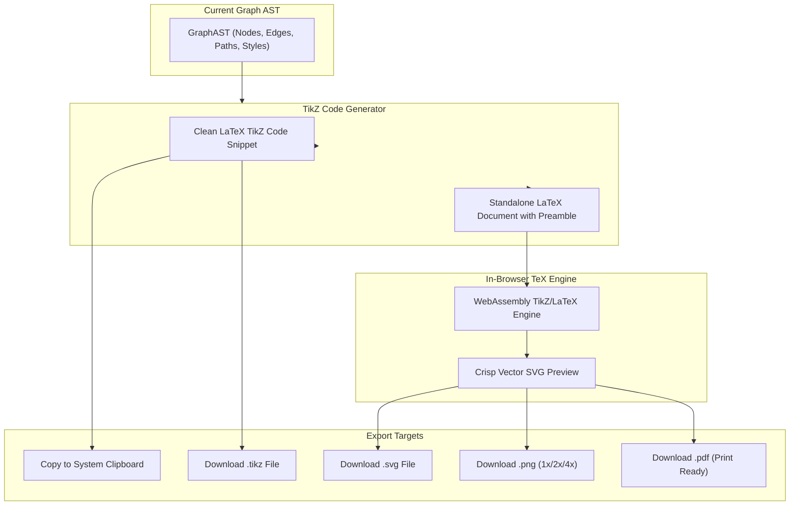
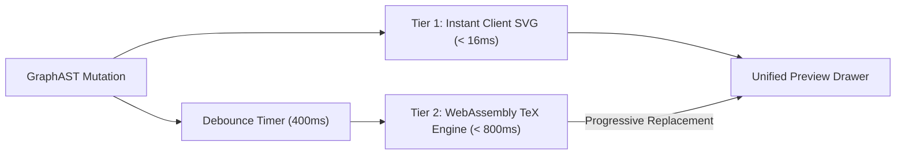

# Sprint 06: Live TeX Preview Pipeline & Multi-Format Exporters

> *"The ultimate proof of a TikZ diagram is its compilation in LaTeX. We provide an instant, client-side TeX preview alongside high-fidelity exports to SVG, standalone PDF, PNG, and TikZ code."*

---

## 1. Objectives & Scope
1. **Client-Side TeX Preview Engine**:
   - Recreate the useful preview workflow in the browser; the native implementation invokes external `pdflatex` and Poppler, so a browser replacement is a new capability with a narrower compatibility envelope.
   - Begin with a time-boxed engine spike: verify the chosen browser TeX/WASM engine's license, bundle size, supported TeX/PGF packages, TikZiT layer/style behavior, fonts, worker/CSP requirements, and output quality on the fixture set. Select it only if that proof passes; otherwise scope preview to a documented supported subset or an explicitly configured compile service.
   - Measure cold initialization (download, worker startup, engine initialization) separately from warm compilation on named fixtures and supported devices. A Three.js projection is a useful visual fallback, but it is not a TeX compilation result and must be labeled as an approximate canvas preview; unsupported TeX must show diagnostics rather than claim print fidelity.
   - Preamble/package support is limited to the engine's verified bundled set. Do not promise arbitrary packages or user macros in the browser; define resource/time limits and reject unsupported package directives with a clear diagnostic.
2. **Side-by-Side / Popover Preview** (Dockview `preview` panel):
   - Preview lives in a first-class Dockview panel — docked beside the canvas via the `tikzit:split-50-50` preset, floated into its own group, or popped to a satellite window (BroadcastChannel `tikzit-window-bus`, mcard-studio `WindowSyncBus` design: `primary`/`satellite` roles, `WINDOW_ANNOUNCE`/`STATE_HYDRATE`/`ACTIVE_DOC_CHANGED`/`WINDOW_CLOSING`).
   - Auto-compilation debouncing (compiles 500ms after user pauses editing).
   - Zoomable, panable vector preview matching LaTeX print fidelity.
   - The panel header exposes the **universal actions toolbar** (mcard-studio `CardPanelActionsToolbar` design): `Copy` (SVG/text to clipboard, PNG via offscreen canvas), `Save As` (`showSaveFilePicker`), `Replace`, `CAS Save` (flush → MCard).
3. **Markdown Viewlet Pipeline** (`MarkdownViewlet` design):
   - The preview pipeline doubles as the renderer for `tikz`-fenced code blocks inside `.md` documents — the same `compileTikz` morphism produces inline diagram SVGs in the `markdown` viewlet.
   - Start with Markdown source editing and a safe rendered preview. Sanitize generated HTML, disable raw HTML by default, allowlist link/media URL schemes, and bound Mermaid/KaTeX work. Add wiki-links, transclusion, and embedded TikZ as separately tested extensions; the compiler can be pure, but rendering still needs a safe browser boundary.
4. **Multi-Format Exporters**:
   - **TikZ Code Export**: Copy snippet to clipboard with 1-click; download `.tikz` file.
   - **SVG Export**: Export vector SVG from a tested TeX result or a dedicated supported-subset SVG renderer. Three.js WebGL canvas output is raster, not SVG; do not promise embedded fonts unless the selected pipeline proves it.
   - **High-DPI Raster Export**: Export PNG at 1x, 2x, 4x Retina resolutions with transparent or solid background.
   - **Standalone PDF Export**: Convert the verified SVG result through a library that actually supports SVG-to-PDF drawing (for example, PDFKit with an SVG adapter), then validate vector preservation and fonts. `pdf-lib` does not directly embed arbitrary SVG. If no safe, browser-compatible vector path is proven, ship PNG/PDF raster fallback with the limitation clearly stated. This exporter does not compile LaTeX.
   - **Markdown Export**: rendered `.md` documents export as sanitized standalone HTML; PDF printing uses the same verified SVG-capable conversion path or browser print, not `pdf-lib` SVG embedding.

---

## 2. Preview & Export Pipeline Flow



### 2.1 Dual-Tier Preview Engine Architecture

To reconcile the conflicting demands of instantaneous typing feedback (< 16 ms) and publication-grade TeX typographic accuracy, the preview subsystem operates as a dual-tier progressive pipeline:



1. **Tier 1 (Instant Vector Projection)**:
   - Evaluated synchronously upon every AST mutation in < 16 ms.
   - Converts the AST directly into an in-memory `<svg>` string using native SVG `<path>`, `<circle>`, and `<text>` elements.
   - Immediately renders in the preview viewport so the user feels zero typing lag during rapid editing.
2. **Tier 2 (High-Fidelity WebAssembly TeX Compilation)**:
   - Triggers after a 400 ms debounce of quiet typing.
   - Compiles a complete standalone LaTeX document through the in-browser WebAssembly TeX engine (TikZJax / SwiftLaTeX WASM).
   - Generates true Computer Modern font glyphs, complex PGF mathematical curves, and exact TeX spacing.
   - Smoothly cross-fades into the preview viewport to replace the Tier 1 preview.

### 2.2 Multi-Resolution PNG & Vector PDF Export Specifications

1. **PNG Rasterization with Retina Scaling**:
   - Uses an offscreen HTML5 canvas element with high device-pixel ratio ($DPR \in \{1, 2, 4\}$):
     - **1x (Standard)**: 72 DPI, ideal for web embeds and chat sharing.
     - **2x (Retina)**: 144 DPI, crisp rendering for high-resolution displays.
     - **4x (Print Quality)**: 288–300 DPI, publication-grade resolution for papers and posters.
   - Transparent background toggle: exports with alpha transparency or solid white ground.
2. **Vector PDF Assembly (`pdf-lib`)**:
   - `pdf-lib` cannot embed an arbitrary SVG document. Assembly draws each element via `PDFPage.drawSvgPath(pathData)` with explicit fill/stroke ops extracted from the compiled SVG; text requires embedding a subsetted font (e.g. Computer Modern) or path-outlined glyphs. A rasterized-PDF fallback (PNG-in-PDF) remains available and is labeled as such.
   - Preserves infinite scalability without bitmap pixelation when the vector path is used.
   - Embeds standard document metadata (`Creator: TikZiT Web`, `Title: Diagram ID`).

---

## 3. CLM / MCard Alignment

- If a verified kernel integration is retained, model the TeX compile as a reusable transformation and record selected source/output provenance. Avoid persisting every live preview keystroke/compile into the durable execution log; previews are transient until the user exports or saves an artifact.
- Exports produce `ArtifactMCard`s (`origin: 'manual'`, `content_type: image/svg+xml | image/png | application/pdf`) sealed with their provenance: source diagram hash + emitter version.
- Preview availability is gated by a `BooleanPCard` precondition (engine initialized) and postcondition (output parses as valid SVG).

---

## 4. Implementation Steps & Acceptance Criteria

| Step | Task | Deliverable | Acceptance Criteria |
| :--- | :--- | :--- | :--- |
| **6.1** | TeX Engine Feasibility Spike | `docs/decisions/preview-engine.md` | A supported fixture set compiles in target browsers with documented package/font limits, licenses, startup size, and failure behavior; otherwise the MVP scope is revised |
| **6.2** | Live Preview Dockview Panel | `src/components/workbench/panels/PreviewPanel.tsx` | Docked/floating/satellite preview with zoom and auto-compile toggle; universal actions toolbar (Copy / Save As / Replace / CAS Save) |
| **6.2b** | Markdown Viewlet | `src/components/workbench/viewlets/MarkdownViewlet.tsx`, `src/services/markdown/markdownCompiler.ts` | Safe source/edit and preview for a documented Markdown subset; advanced renderers are capability-gated and sanitized |
| **6.3** | Preamble Configuration Manager | `src/services/preview/PreambleManager.ts` | Validates a small allowlisted set against the selected engine; unsupported packages fail visibly |
| **6.4** | SVG & PNG Exporter | `src/services/export/ImageExporter.ts` | SVG uses the verified vector source; PNG rasterizes at requested scale |
| **6.5** | PDF Exporter | `src/services/export/PdfExporter.ts` | Converts tested SVG through a proven SVG-capable PDF path; fallback and fidelity are documented |

---

## 5. Comprehensive Test Suite & Playwright E2E Specification

Sprint 06 verification demonstrates the selected preview engine's supported subset, validates actual export payloads, and tests clipboard behavior with permission-aware fallbacks.

### 5.1 Unit & Exporter Tests (Vitest)

Tests in `tests/unit/export/` cover:
1. **Preamble Generator (`preamble.test.ts`)**:
   - Compiles full LaTeX document templates including `\usepackage{tikz}`, `\pgfdeclarelayer{nodelayer}`, `\pgfdeclarelayer{edgelayer}`, and `\pgfsetlayers{edgelayer,nodelayer,main}`.
   - Preamble customization accepts only an explicit allowlist supported by the verified engine; arbitrary package injection is not an MVP feature.
2. **SVG & Image Exporters (`imageExporter.test.ts`)**:
   - Clean SVG string serialization stripping internal canvas annotations.
   - Exact SVG bounding box calculation based on node radius and Bézier curve extrema.
   - PNG export offscreen canvas rendering at 1x, 2x (Retina), and 4x (Print) resolutions.
3. **PDF Exporter (`pdfExporter.test.ts`)**:
   - PDF tests exercise the selected SVG-capable conversion path; assert page dimensions, expected content, and whether output is vector or raster. Do not treat a PDF header as a fidelity test.
   - PDF document metadata tags (Title, Author, Producer = TikZiT Web).

### 5.2 Playwright E2E Test Suite (`e2e/sprint-06/preview-exporters.spec.ts`)

A dedicated Playwright E2E test validates preview rendering and export downloads:

```typescript
// e2e/sprint-06/preview-exporters.spec.ts
import { test, expect } from '@playwright/test';

test.describe('Sprint 06: Live TeX Preview & Exporters', () => {
  test.beforeEach(async ({ page }) => {
    await page.goto('/');
    await page.waitForSelector('#preview-drawer-island');
  });

  test('06-E2E-01: Opens preview and compiles a supported fixture', async ({ page }) => {
    await page.locator('#toggle-preview-drawer-btn').click();
    const previewDrawer = page.locator('#preview-drawer-island');
    await expect(previewDrawer).toBeVisible();

    const previewSvg = previewDrawer.locator('svg.rendered-tex-preview');
    await expect(previewSvg).toBeVisible({ timeout: 15_000 }); // WASM cold init allowance
  });

  test('06-E2E-02: Clipboard copy button copies valid TikZ source', async ({ page, context }) => {
    await context.grantPermissions(['clipboard-read', 'clipboard-write']);
    await page.locator('#copy-tikz-code-btn').click();

    const clipboardText = await page.evaluate(() => navigator.clipboard.readText());
    expect(clipboardText).toContain('\\begin{tikzpicture}');
    expect(clipboardText).toContain('\\end{tikzpicture}');
  });

  test('06-E2E-03: Download .tikz file export verification', async ({ page }) => {
    const downloadPromise = page.waitForEvent('download');
    await page.locator('#export-menu-btn').click();
    await page.locator('button[data-export-format="tikz"]').click();

    const download = await downloadPromise;
    expect(download.suggestedFilename()).toMatch(/\.tikz$/);

    const stream = await download.createReadStream();
    const chunks: Buffer[] = [];
    for await (const chunk of stream) chunks.push(Buffer.from(chunk));
    const content = Buffer.concat(chunks).toString('utf8');

    expect(content).toContain('\\begin{tikzpicture}');
  });

  test('06-E2E-04: Download .svg vector file export verification', async ({ page }) => {
    const downloadPromise = page.waitForEvent('download');
    await page.locator('#export-menu-btn').click();
    await page.locator('button[data-export-format="svg"]').click();

    const download = await downloadPromise;
    expect(download.suggestedFilename()).toMatch(/\.svg$/);

    const stream = await download.createReadStream();
    const chunks: Buffer[] = [];
    for await (const chunk of stream) chunks.push(Buffer.from(chunk));
    const content = Buffer.concat(chunks).toString('utf8');

    expect(content).toContain('<svg');
    expect(content).toContain('viewBox');
  });

  test('06-E2E-05: Download .png high-resolution image verification', async ({ page }) => {
    const downloadPromise = page.waitForEvent('download');
    await page.locator('#export-menu-btn').click();
    await page.locator('button[data-export-format="png-2x"]').click();

    const download = await downloadPromise;
    expect(download.suggestedFilename()).toMatch(/\.png$/);

    const stream = await download.createReadStream();
    const chunks: Buffer[] = [];
    for await (const chunk of stream) chunks.push(Buffer.from(chunk));
    const buffer = Buffer.concat(chunks);

    // Verify PNG magic header: 0x89 0x50 0x4E 0x47
    expect(buffer[0]).toBe(0x89);
    expect(buffer[1]).toBe(0x50);
    expect(buffer[2]).toBe(0x4e);
    expect(buffer[3]).toBe(0x47);
  });

  test('06-E2E-06: Download .pdf print-ready document verification', async ({ page }) => {
    const downloadPromise = page.waitForEvent('download');
    await page.locator('#export-menu-btn').click();
    await page.locator('button[data-export-format="pdf"]').click();

    const download = await downloadPromise;
    expect(download.suggestedFilename()).toMatch(/\.pdf$/);

    const stream = await download.createReadStream();
    const chunks: Buffer[] = [];
    for await (const chunk of stream) chunks.push(Buffer.from(chunk));
    const buffer = Buffer.concat(chunks);

    // Verify PDF header '%PDF-'
    expect(buffer.toString('utf8', 0, 5)).toBe('%PDF-');
  });
});
```

---

## 6. Definition of Done (DoD) Checklist

To declare Sprint 06 complete and ready for graduation:

### 6.1 WebAssembly TeX Preview Pipeline
- [ ] If the feasibility spike selects a WASM engine, prove worker initialization, CSP, asset caching, package support, and browser fallback; otherwise revise the preview scope.
- [ ] Record warm compile p50/p95 for the supported fixture set on a declared runner; adopt a budget only after stable measurements.
- [ ] Cold initialization shows a non-blocking background progress bar without UI freezing.
- [ ] Compare supported fixtures against `pdflatex` using documented geometry/text checks and visual tolerances; do not require byte- or pixel-identical output across different engines.
- [ ] Debounced compilation trigger avoids running expensive TeX builds on every keystroke.

### 6.2 Preview Dockview Panel UI
- [ ] Preview panel supports tested in-window Dockview docking/splitting. Satellite-window presentation is optional and only enabled after browser capability detection and state-recovery tests.
- [ ] Preview viewport supports pinch-to-zoom and pan controls.
- [ ] Auto-compile toggle allows users to pause compilation during heavy graph construction.
- [ ] Error console tab captures TeX compiler logs and line-number errors with jump-to-line support.
- [ ] Copy works where clipboard permissions allow and has a user-visible fallback; Save As uses `showSaveFilePicker` only when available and otherwise downloads a Blob; persistence goes through the verified storage adapter.
- [ ] Markdown viewlet renders `.md` cards with KaTeX, Mermaid, callouts, and inline `tikz`-fence diagrams; `source` panel edits the same card with debounced persistence.

### 6.3 Preamble Configuration Manager
- [ ] Any preamble editor is restricted to the engine's tested package/library allowlist and reports unsupported requests.
- [ ] Default preamble declares required PGF layers (`nodelayer`, `edgelayer`, `main`).
- [ ] Preamble configurations persist across sessions in local storage.

### 6.4 Multi-Format Exporters
- [ ] One-click "Copy TikZ Code" copies formatted code to clipboard with toast notification.
- [ ] `.tikz` exporter downloads pure TikZ fragment with correct layer directives.
- [ ] `.svg` exporter outputs standalone, scalable vector graphics with accurate bounding box.
- [ ] `.png` exporter renders sharp images at 1x, 2x (Retina), and 4x (print) resolutions.
- [ ] PDF export uses a tested SVG-capable vector conversion path; tests verify expected page bounds and vector content, or clearly label a raster fallback.

### 6.5 Playwright E2E Validation & CLM Registration
- [ ] Playwright E2E suite (`e2e/sprint-06/preview-exporters.spec.ts`) passes 100% in Chromium, Firefox, WebKit.
- [ ] Export events produce `ArtifactMCard`s sealed with source diagram hash in `execution_log`.
- [ ] Sprint specification updated and graduated to `docs/sprints/06-preview-pipeline-and-exporters/`.
