# Sprint 08: End-to-End Verification, Performance Benchmarks & Deployment

> *"A tool used for technical diagrams needs clear compatibility boundaries, reproducible verification, measured performance, and dependable local-document recovery."*

---

## 1. Objectives & Scope
1. **End-to-End Verification Suite**:
   - Comprehensive test suite in Playwright testing real browser workflows:
     - Opening the 12-diagram Phase-0 ZX corpus (`docs/examples/zx-calculus/`, indexed by `docs/examples/manifest.json`) plus generated stress variants.
     - Placing nodes, connecting edges, and setting bends.
     - Applying ZX-calculus styles from the palette.
     - Modifying TikZ code directly in the code editor.
     - Verifying canonical round-trip equality (`parse(emit(parse(src))) ≅ parse(src)`) between imported and exported TikZ code.
   - Validate WebGL capability per browser/runner. Use Chromium+SwiftShader only for deterministic CI rendering if the pinned Playwright/browser version exposes a working context; use feature-detection/fallback smoke tests in Firefox/WebKit unless their CI WebGL support is proven. Compare controlled same-engine renders or semantic geometry, not unlike renderers as if pixels must match exactly.
2. **Performance Benchmarking & Optimization**:
   - Benchmark representative small, medium, and stress fixtures; label the 1,000-node/2,500-edge case as a stress target rather than a supported default until profiling demonstrates feasibility.
   - Record frame-time percentiles on documented reference hardware. Do not apply a 60-FPS gate to SwiftShader or variable shared CI runners; add regression thresholds only after repeated baseline measurements on a stable runner.
   - Memory leak audits (Three.js geometry disposal, shader cleanup, event listener unregistration).
3. **Cross-Platform & Offline PWA Capabilities**:
   - Add a PWA manifest/service worker only after defining which static app assets and already-saved documents are available offline. Remote model providers and uncached TeX packages are not offline capabilities.
   - Verify installability and storage behavior on a declared browser/device matrix; do not claim every platform is supported from a desktop Playwright run.
   - Treat touch gestures and Apple Pencil as separate device testing, with pointer events and accessible non-touch alternatives.
4. **Production Build & CI/CD Pipeline**:
   - Vite bundle optimization, code splitting, and WebAssembly asset prefetching.
   - Automated GitHub Actions build and deployment pipeline.

---

## 2. Test Architecture & Benchmark Targets

```mermaid
flowchart LR
    subgraph Test_Runner ["Playwright Test Harness"]
        E2E_Import["Import & Round-Trip Tests"]
        E2E_Interaction["Tool Gesture Tests"]
        E2E_Styles["Style & Category Tests"]
        E2E_Export["SVG / PDF Export Tests"]
    end

    subgraph Performance_Gates ["Performance Benchmarks"]
        FPS_Gate["Frame-time profile on declared hardware and fixture"]
        Load_Gate["Cold/repeat load measured on documented profiles"]
        Compile_Gate["TeX cold init separated from warm fixture compile"]
        Memory_Gate["Repeated lifecycle/disposal and recovery checks"]
    end

    subgraph Deploy_Target ["Production Release"]
        PWA_Bundle["PWA Desktop App"]
        Web_Deploy["Static Web Deployment"]
    end

    Test_Runner --> Performance_Gates
    Performance_Gates --> Deploy_Target
```



### 2.1 Production CI/CD GitHub Actions Workflow Specification

To enforce quality gates on every commit and pull request, the automated build and testing pipeline is defined in `.github/workflows/ci.yml`:

```yaml
# .github/workflows/ci.yml
name: TikZiT Web CI/CD Pipeline

on:
  push:
    branches: [ master, main ]
  pull_request:
    branches: [ master, main ]

jobs:
  test-and-verify:
    runs-on: ubuntu-latest
    timeout-minutes: 25

    steps:
      - name: Checkout Repository
        uses: actions/checkout@v4

      - name: Setup Node.js 20
        uses: actions/setup-node@v4
        with:
          node-version: 20
          cache: 'npm'

      - name: Install Dependencies
        run: npm ci

      - name: Run ESLint & TypeScript Typecheck
        run: |
          npm run lint
          npm run typecheck

      - name: Run Vitest Unit & Integration Suites
        run: npm run test:unit -- --coverage

      - name: Install Playwright Browsers with Dependencies
        run: npx playwright install --with-deps chromium firefox webkit

      - name: Run Playwright End-to-End Test Matrix
        run: npx playwright test
        env:
          CI: true

      - name: Upload Playwright Test Report Artifact
        if: always()
        uses: actions/upload-artifact@v4
        with:
          name: playwright-report
          path: playwright-report/
          retention-days: 14

      - name: Build Production Web Bundle
        run: npm run build

      - name: Deploy to GitHub Pages
        if: github.ref == 'refs/heads/master' && github.event_name == 'push'
        uses: peaceiris/actions-gh-pages@v3
        with:
          github_token: ${{ secrets.GITHUB_TOKEN }}
          publish_dir: ./dist
```

### 2.2 Web Vitals & Accessibility (a11y) Conformance Standards

The production application bundle must satisfy the following Core Web Vitals and accessibility criteria:

| Metric | Target Threshold | Measuring Tool / Oracle | Failure Action |
| :--- | :--- | :--- | :--- |
| **Largest Contentful Paint (LCP)** | $\le 1.2\text{ s}$ | Lighthouse CI / Chrome DevTools | Defer heavy WASM loads to background worker |
| **Interaction to Next Paint (INP)** | $\le 50\text{ ms}$ | PerformanceObserver (Web Vitals) | Optimize gesture state handlers; avoid long frames |
| **Cumulative Layout Shift (CLS)** | $\le 0.02$ | Web Vitals / Playwright | Reserve exact dimensions for toolbar and dock panels |
| **First Input Delay (FID)** | $\le 80\text{ ms}$ | Web Vitals / Lighthouse | Code-split non-critical property inspectors |
| **Keyboard Accessibility (a11y)** | 100% WCAG 2.1 AA | Axe-core / Playwright `axe-playwright` | Ensure all buttons have `aria-label` and visible focus |
| **Color Contrast Ratio** | $\ge 4.5:1$ (text), $\ge 3:1$ (ui) | Chrome DevTools Contrast Checker | Calibrate dark/light Tailwind palette tokens |

---

## 3. CLM / MCard Alignment — Closing the Loop

Sprint 08 operationalizes the CLM verification model end-to-end:

- Express selected deterministic domain invariants as `BooleanPCard`s where the verified kernel API supports them. Keep ordinary UI/E2E/performance assertions in the test runner; optionally seal release-level verification summaries as VCards without writing every test event into production storage.
- **Golden-master diffs** (canvas render vs Phase-0 SVG) are stored as `ArtifactMCard`s with `origin: 'test'`, and regressions raise `FeedbackMCard`s (`source: 'ci'`, `severity: 'error'`).
- **Sprint graduation**: on all gates passing, a `SprintStatusMCard` (`status: 'completed'`, `quality_gate_passed: true`, `deliverables: [...]`) is committed — after which this document graduates from `_active/` to `docs/sprints/08-verification-and-deployment/` per the README workflow.
- Release bundles are hashed `ArtifactMCard`s (`origin: 'package'`), so the deployed PWA is itself content-addressed and reproducible.

---

## 4. Implementation Steps & Acceptance Criteria

| Step | Task | Deliverable | Acceptance Criteria |
| :--- | :--- | :--- | :--- |
| **8.1** | Playwright E2E Test Suite | `e2e/tikzit.spec.ts` | Required workflows pass on the verified browser matrix; suite inventory reflects implemented features |
| **8.2** | Reference Fixture Corpus | `tests/fixtures/pqp/` | Reviewed supported fixtures parse/render/export with per-file results; stress graphs are separately labeled |
| **8.3** | WebGL Performance Profiling | `tests/perf/benchmark.ts` | Reproducible frame-time report on a declared reference setup; CI gate added only after a stable baseline |
| **8.4** | PWA Offline Service Worker | `src/pwa/service-worker.ts` | App shell and committed local documents work offline within documented storage limits |
| **8.5** | Production Release Pipeline | `.github/workflows/deploy.yml` | Automated build, test, and release pipeline |

---

## 5. Master Playwright End-to-End Suite Matrix & Benchmark Rig

Sprint 08 adds the production validation rig after earlier feature suites exist. The following suite map is a proposed inventory; remove or defer scenarios for features that are not shipped, and avoid promising a fixed test count:

```mermaid
flowchart TD
    subgraph Suite1 ["Suite 1: Desktop Parity (e2e/suites/workflow-desktop-parity.spec.ts)"]
        DP1["08-E2E-01: Full ZX Bell State Creation Workflow"]
        DP2["08-E2E-02: Yanking Cup/Cap Snake Construction"]
        DP3["08-E2E-03: Multi-Node Group Alignment & Dragging"]
        DP4["08-E2E-04: Self-Loop and Multi-Edge Topology"]
    end

    subgraph Suite2 ["Suite 2: PQP Corpus Golden Regression (e2e/suites/pqp-canonical-corpus.spec.ts)"]
        CR1["08-E2E-05 to 16: Reviewed fixture regression"]
        CR2["08-E2E-17: Supported export and TeX compile check"]
    end

    subgraph Suite3 ["Suite 3: Synchronization & Persistence (e2e/suites/sync-history-persistence.spec.ts)"]
        SP1["08-E2E-18: 100-Step Undo/Redo Stress Test"]
        SP2["08-E2E-19: CodeMirror valid-buffer sync"]
        SP3["08-E2E-20: Committed local document reload/recovery"]
        SP4["08-E2E-21: Multi-Tab Session Restoration"]
    end

    subgraph Suite4 ["Suite 4: Performance & Hardware Stress (e2e/suites/webgl-performance-stress.spec.ts)"]
        PS1["08-E2E-22: Frame-time profile for a labeled stress fixture"]
        PS2["08-E2E-23: Repeated lifecycle/disposal checks"]
        PS3["08-E2E-24: WebGL Context Loss Recovery Under Load"]
    end

    subgraph Suite5 ["Suite 5: PWA & Offline Standalone (e2e/suites/pwa-offline-standalone.spec.ts)"]
        PW1["08-E2E-25: Service Worker Caching & Offline Launch"]
        PW2["08-E2E-26: PWA Manifest & Installability Validation"]
        PW3["08-E2E-27: Network Disconnect Zero-Interruption Editing"]
    end

    subgraph Suite6 ["Suite 6: Workbench & Viewlet UX (e2e/suites/workbench-viewlets.spec.ts)"]
        WV1["08-E2E-28: CardPanel mode tabs + viewlet fallback-to-text"]
        WV2["08-E2E-29: Markdown edit + render round-trip with inline tikz fence"]
        WV3["08-E2E-30: Dockview layout restore + Restore-as-HEAD banner"]
        WV4["08-E2E-31: Optional chat proposal preview, approval, and undo"]
    end
```



### 5.1 Playwright Production Master Spec Sample

```typescript
// e2e/suites/workflow-desktop-parity.spec.ts
import { test, expect } from '@playwright/test';

test.describe('Sprint 08: Desktop TikZiT Parity & End-to-End Workflows', () => {
  test.beforeEach(async ({ page }) => {
    await page.goto('/');
    await page.waitForSelector('canvas#webgl-stage');
  });

  test('08-E2E-01: Creates and styles a two-node connected graph fixture', async ({ page }) => {
    // 1. Switch to Vertex mode and place two nodes
    await page.keyboard.press('V');
    const canvas = page.locator('canvas#webgl-stage');
    const box = await canvas.boundingBox();
    if (!box) throw new Error('Canvas box not found');

    await page.mouse.click(box.x + 300, box.y + 200); // Node 0 (Control)
    await page.mouse.click(box.x + 300, box.y + 400); // Node 1 (Target)

    // 2. Style Control as Z (green) and Target as X (red)
    await page.keyboard.press('S');
    await page.evaluate(() => window.TikzitApp.selectNode('0'));
    await page.locator('button[data-style-name="Z"]').click();

    await page.evaluate(() => window.TikzitApp.selectNode('1'));
    await page.locator('button[data-style-name="X"]').click();

    // 3. Connect Control to Target with Wire
    await page.keyboard.press('E');
    const n0 = await page.evaluate(() => window.TikzitApp.getNodeScreenPos('0'));
    const n1 = await page.evaluate(() => window.TikzitApp.getNodeScreenPos('1'));

    await page.mouse.move(n0.x, n0.y);
    await page.mouse.down();
    await page.mouse.move(n1.x, n1.y, { steps: 5 });
    await page.mouse.up();

    // 4. Verify the expected node/edge fixture
    const graph = await page.evaluate(() => window.TikzitApp.getGraph());
    expect(graph.nodes.length).toBe(2);
    expect(graph.edges.length).toBe(1);
    expect(graph.nodes[0].style).toBe('Z');
    expect(graph.nodes[1].style).toBe('X');

    // 5. Verify emitted TikZ contains the selected styles and edge
    const tikzCode = await page.evaluate(() => window.TikzitApp.getEditorValue());
    expect(tikzCode).toContain('[style=Z] (0)');
    expect(tikzCode).toContain('[style=X] (1)');
    expect(tikzCode).toContain('(0) to (1)');
  });
});
```

---

## 6. Master Sprint 08 Definition of Done (DoD) Checklist

To declare Sprint 08 complete, approve production release, and finalize project graduation:

### 6.1 Playwright End-to-End Suite Coverage
- [ ] All required tests pass in CI for configured projects; report retries/failures and quarantine only with an issue/owner, not as a substitute for fixing flakes.
- [ ] Browser-specific WebGL tests use a verified context or assert graceful fallback; do not assume every engine offers equivalent GPU behavior.
- [ ] Workflow suite verifies the shipped editor operations against reviewed fixtures; mathematical identity claims require separate domain review.
- [ ] Visual regression tests cover reviewed fixtures with same-engine baselines and documented tolerances; semantic checks cover cross-renderer output.
- [ ] Workbench suite verifies implemented Dockview controls and Markdown features; conversational actions are tested only if separately shipped and require preview/approval/undo.

### 6.2 Performance & Resource Gates
- [ ] Capture baseline frame-time distributions for representative and stress fixtures on documented reference hardware.
- [ ] Do not gate frame rate on software SwiftShader or shared CI; add a threshold only on a stable, repeatable runner.
- [ ] Measure cold and repeat app-shell load on declared device/network profiles before setting a budget.
- [ ] If browser TeX is retained, report cold initialization and warm compile separately for supported fixtures.
- [ ] Verify resource disposal and repeated undo/redo behavior; use browser heap measurements only where exposed and stable.

### 6.3 PWA & Offline Readiness
- [ ] Service worker caches only versioned assets whose size/licensing and update behavior are reviewed; TeX WASM is optional pending bundle-size and offline proof.
- [ ] App launches and edits already-saved local documents offline; remote compilation/model features show an explicit unavailable state.
- [ ] PWA web app manifest configured with icons, standalone display mode, and theme color.
- [ ] Record Lighthouse results on a fixed profile; treat score thresholds as project targets, not a release gate until the baseline and test conditions are agreed.

### 6.4 Cross-Platform & Device Support
- [ ] Publish a supported-browser/device matrix based on actual manual and automated runs; distinguish tested from expected support.
- [ ] Verify touch interaction on at least one real touch device before claiming tablet support.

### 6.5 Production Build & CI/CD Pipeline
- [ ] Automated GitHub Actions CI workflow runs lint, unit tests, and Playwright E2E suite on every PR.
- [ ] Production bundle size is reported against a documented budget; large TeX/Markdown/viewlet chunks are lazy-loaded where measured to improve startup.
- [ ] Release bundles tagged with semantic versions and published to GitHub Releases and CDN.

### 6.6 CLM Kernel Audit & Project Graduation
- [ ] If the CLM kernel integration is retained, record the verified sprint/release summary using the pinned lifecycle API; CI artifacts remain the primary test evidence.
- [ ] All 8 development sprints graduated from `docs/sprints/_active/` to permanent folders in `docs/sprints/`.
- [ ] Master documentation indices updated and signed off.
