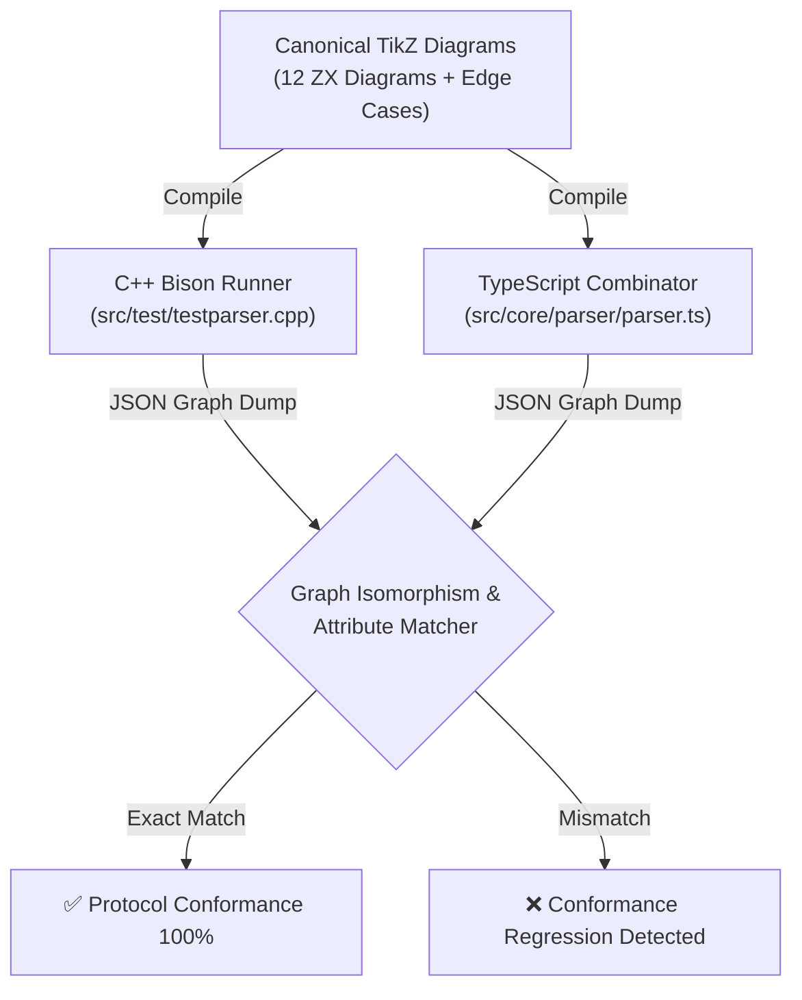

# Sprint 24: Core Parser Combinator & Native C++ Modularization

**Status:** Proposed; not started  
**Primary Baldwin Operator:** Splitting ($\times$) & Porting ($\text{Lan}$)  
**Primary Subsystem:** `parser` / `desktop-parity`  
**Depends on:** [Sprint 20](./SPRINT-20-DUAL-SYSTEM-MAKEFILE-AND-SHARED-PROTOCOL.md), [Sprint 21](./SPRINT-21-PROCESS-ALGEBRA-AND-PETRI-NET-LIFECYCLE.md)  
**Parent Proposal:** [Sprints 20–24](./PROPOSAL-20-24-ALGEBRAIC-MODULARITY-CLM-AND-BUILD-UNIFICATION.md)

---

## 1. Objective

Apply Carliss Baldwin's **Splitting Operator** ($\mathcal{B}_{\text{split}}$) to decompose the 494-line monolithic TypeScript parser ([`src/core/parser/parser.ts`](../../../src/core/parser/parser.ts)) into modular grammar combinators ($\le 180$ LOC each). Author a comprehensive architectural blueprint to refactor the monolithic native C++ Qt source files (`tikzscene.cpp` at **1,418 lines**, `styleeditor.cpp` at **881 lines**, and `undocommands.cpp` at **729 lines**), and establish an automated **Dual-System Protocol Conformance Test Suite** proving bit-for-bit semantic equivalence between the native C++ Flex/Bison engine and the browser TypeScript parser.

---

## 2. Current Gaps & Architectural Tension

1. **Monolithic TypeScript Parser (`src/core/parser/parser.ts`, 494 LOC)**:
   - A single monolithic class handles lexical stream tokenization, `\node` declarations, `\draw` and `\path` operations, `\tikzstyle` definitions, and coordinate transformations.
   - Adding support for new TikZ syntax (e.g. edge labels, decorations, matrix layouts) requires modifying this high-risk central file.

2. **Native C++ Qt God Files (> 450 LOC)**:
   - `src/gui/tikzscene.cpp` (**1,418 lines**): Monolithic `QGraphicsScene` mixing mouse event dispatch, interactive edge drawing, grid snapping, rubber-band marquee selection, and key events.
   - `src/gui/styleeditor.cpp` (**881 lines**): Massive dialog handling Qt item models, color palettes, preview rendering, and category assignment.
   - `src/gui/undocommands.cpp` (**729 lines**): Combines every single `QUndoCommand` in the entire desktop application into one massive translation unit.

3. **Absence of Automated Conformance Verification**:
   - Despite sharing the same TikZ language target, the C++ Bison parser (`tikzparser.y`) and TypeScript parser are tested in isolation. There is no automated test that parses a diagram with both engines and asserts graph isomorphism.

---

## 3. TypeScript Parser Modularization Plan

Deconstruct `src/core/parser/parser.ts` into a combinator directory:

```
src/core/parser/
├── parser.ts                     # Main parser entrypoint & tokenizer orchestration (<= 120 LOC)
├── combinators/
│   ├── nodeCombinator.ts         # \node statements, coordinates & labels (<= 150 LOC)
│   ├── edgeCombinator.ts         # \draw & \path operations, curves & self-loops (<= 180 LOC)
│   ├── styleCombinator.ts        # \tikzstyle declarations & properties (<= 120 LOC)
│   └── propertyCombinator.ts     # Key-value options bracket parser [in=..., out=...] (<= 130 LOC)
├── lexer.ts                      # Lexical tokenizer matching Flex rules (existing, <= 180 LOC)
└── ast.ts                        # Canonical AST TypeScript interfaces (existing, <= 120 LOC)
```

### 3.1 Combinator Responsibilities
- **`nodeCombinator.ts`**: Parses `\node [options] (name) at (x,y) {label};`. Extracts node geometry, style references, and mathematical coordinates.
- **`edgeCombinator.ts`**: Parses `\draw [options] (u) to (v);` and `\path`. Accurately parses bend angles, in/out degrees, and signature teardrop loops (`\draw [in=135, out=45, loop] (u) to ();`).
- **`styleCombinator.ts`**: Parses `\tikzstyle{name}=[options]` declarations into structured `Style` objects.
- **`propertyCombinator.ts`**: Parses bracketed option lists (`[key=value, ...]`), correctly tokenizing colors, dimensions, and quoted strings.
- **`parser.ts`**: Pure top-level coordinator. Iterates tokens and delegates to combinators based on command keywords. Total lines strictly $\le 120$.

---

## 4. Native C++ Qt Refactoring Blueprint

To bring the C++ desktop codebase into architectural parity with the web modularity standards, author an actionable refactoring plan for the C++ subsystem:

### 4.1 Decomposing `src/gui/undocommands.cpp` (729 LOC)
Split into atomic command classes under `src/gui/commands/`:
- `AddNodeCommand.cpp` / `.h`
- `RemoveElementsCommand.cpp` / `.h`
- `MoveElementsCommand.cpp` / `.h`
- `AddEdgeCommand.cpp` / `.h`
- `ChangePropertyCommand.cpp` / `.h`

### 4.2 Decomposing `src/gui/tikzscene.cpp` (1,418 LOC)
Adopt the Tool State Machine pattern implemented in the web application (`src/canvas/tools/`):
- Extract scene tools: `SelectSceneTool`, `NodeSceneTool`, `EdgeSceneTool`, `CropSceneTool`.
- Reduce `tikzscene.cpp` to pure canvas event routing and item container management.

---

## 5. Dual-System Automated Conformance Suite

Create `scripts/verify-protocol-conformance.mjs` integrated into `make test`:



The script:
1. Passes canonical `.tikz` files through both C++ and TypeScript parsers.
2. Asserts identical node count, edge count, node positions (accounting for $Y$-coordinate scaling), edge styles, and bend angles.
3. Fails if either parser fails to support a construct supported by the other.

---

## 6. Acceptance Criteria

- **AC-24-01 (Parser Line Count Limit)**: `src/core/parser/parser.ts` is reduced to **fewer than 120 lines of code**.
- **AC-24-02 (Combinator Module Line Limit)**: Each newly created parser combinator (`nodeCombinator.ts`, `edgeCombinator.ts`, `styleCombinator.ts`, `propertyCombinator.ts`) does not exceed **180 lines of code**.
- **AC-24-03 (Parser Round-Trip Invariant)**: All existing parser unit tests in `tests/unit/parser/` pass 100% green with zero regressions.
- **AC-24-04 (C++ Refactoring Blueprint)**: `docs/architecture/CPP-MODULARIZATION-BLUEPRINT.md` is authored, providing exact class hierarchies and splitting maps for `tikzscene.cpp`, `styleeditor.cpp`, and `undocommands.cpp`.
- **AC-24-05 (Automated Conformance Gate)**: `scripts/verify-protocol-conformance.mjs` executes in `make test`, asserting 100% AST isomorphism across all 12 canonical ZX diagrams.
