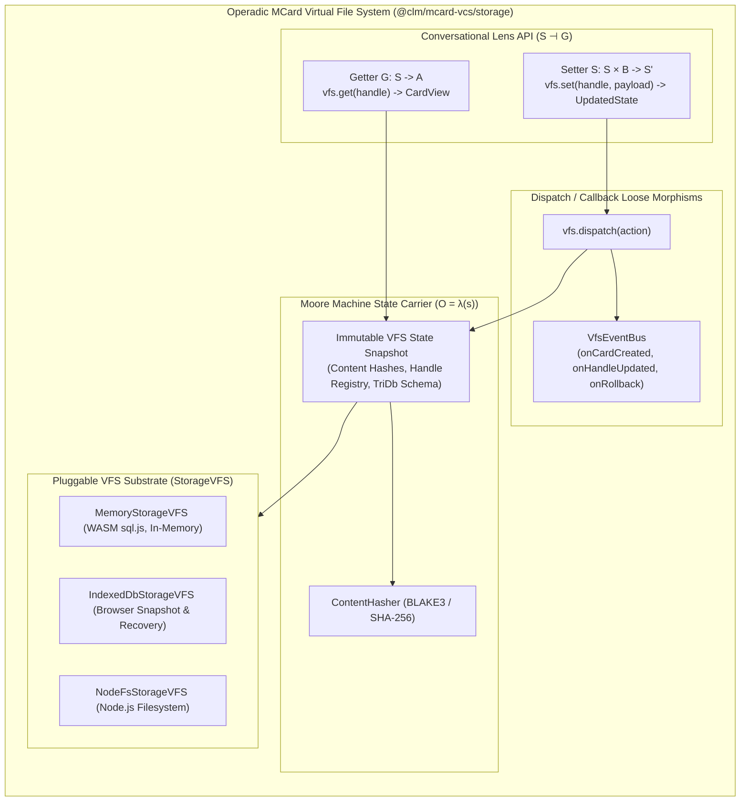

# Sprint 25: Operadic MCard Virtual File System & Multi-Backend VFS Substrate

**Status:** Proposed; Active Architecture Series  
**Subsystem:** `corpus` / `storage`  
**Primary Module Target:** `src/packages/mcard-vcs/storage/`  
**Lead Agents:** Winston (System Architect) & Amelia (Senior Software Engineer)  
**Theoretical Invariants:**
- **Double Operadic Theory of Systems (DOTS)**:
  - **Moore Machine ($O = \lambda(s)$)**: The MCard as a passive, immutable state carrier addressed by BLAKE3 hash.
  - **Conversational Lens ($S \dashv G$)**: Bidirectional Getter ($s \to a$) and Setter ($s \times b \to s'$) satisfying formal lens laws.
  - **Dispatch / Callback**: Loose wiring diagram for VFS mutation events and reactive subscriptions.
- **INV-02 (Content-Addressable Identity)**: $\text{Hash} = \text{BLAKE3}(\text{payload}) \lor \text{SHA-256}(\text{payload})$.
- **INV-05 (Tri-Database Separation)**: Strict physical isolation of `knowledge.db`, `executionLog.db`, and `mcard.db`.
- **INV-09 (Zero-FS Hermeticity)**: Pure in-memory / abstract VFS storage execution with zero unmediated host filesystem bindings.
- **Ecosystem Grounding**: Direct compatibility with `clm-kernel`'s `MCardFileSystem` and `TriDatabaseManager`; `mcard-studio` interoperability handled contract-first (see §0).

---

## 0. Grounding Audit (verified 2025-09-29)

- ✅ `clm-kernel@0.0.1` root barrel exports everything imported below **except** that `Blake3Provider` lives in the hash module of the same barrel — the single `import { MCardFileSystem, TriDatabaseManager, Blake3Provider } from 'clm-kernel'` form resolves correctly.
- ⚠️ **Hash prefix**: the kernel's `BLAKE3_HASH_PREFIX` is `"blake3:"`, not `urn:mcard:blake3:` (see DoD-07 correction), and TikZiT's own spec (`src/services/__tests__/clm-cordis.spec.ts`) asserts `'blake3:'`.
- ♻️ **Do not re-implement what the kernel already ships**: `DisposableList` (LIFO, aggregate-error semantics) and `SavepointGuard` (states `idle | active | committed | rolled-back`) are exported from `clm-kernel`. `kernel/SavepointGuard.ts` below must compose/wrap the kernel type, not fork it.
- 📦 **`TriDatabasePillar`** is already a published kernel type (`'content_memory' | 'execution_log' | 'agent_identities' | 'knowledge' | 'mcard'`). Re-export it from `vfs/types.ts`; do not declare a second definition. Canonical pillar *names* per kernel docs are `content_memory` / `execution_log` / `agent_identities` with `mcard` / `knowledge` as legacy aliases.
- 🔄 `MCardFileSystem.createOptimal(options?: OptimalStorageOptions, prefix?)` is **synchronous** in the kernel; the asynchronous static factory on `OperadicMCardVfs` remains valid as an adapter convenience but must not shadow the kernel's signature.

---

## 1. Context & Motivation

In TikZiT, Sprints 15, 19, and 23 established an in-browser SQLite TriDatabase (`sqliteRuntime.ts`, `corpusPersistence.ts`, `corpusExportService.ts`). Meanwhile, `clm-kernel` introduced `MCardFileSystem`. (`mcard-studio`'s `studioMCardFs` / `vfsCore.ts` remains a contract-first target — see §0.)

However, these existing implementations treat the file system either as an imperative CRUD store or wire it directly to specific UI stores (e.g. Nanostores `$mcardTree`). They lack the mathematical rigor of **Double Operadic Theory of Systems (DOTS)**:
1. **Imperative Mutations**: Writing to a file mutates ambient state in place rather than acting as a verified **Lens Setter** ($s \times b \to s'$) that returns an updated immutable snapshot.
2. **Missing Reactive Wiring**: There is no standardized **Dispatch / Callback** event bus allowing host applications, UI panels, or AI agents to subscribe to discrete storage transitions.
3. **Host Globals Leaks**: Direct calls to `window.indexedDB` and DOM APIs leak browser assumptions into storage logic, violating Invariant **INV-09 (Zero-FS Hermeticity)**.

**Sprint 25 Goal:** Construct a completely headless, zero-DOM Operadic MCard Virtual File System (`OperadicMCardVfs`) grounded on `clm-kernel`'s `MCardFileSystem` and `TriDatabaseManager`, featuring formal **Getter/Setter Lenses**, a typed **Dispatch/Callback** wiring bus, **Moore Machine** state encapsulation, and pluggable multi-backend `StorageVFS` execution. From day one the package boundary is embedding-grade (**Contract E / ADR D29**): a public API barrel with declared subpath exports, sole runtime dependency on `clm-kernel`, and an enforced ban on imports from TikZiT host namespaces.

---

## 2. Architectural Blueprint: The DOTS Operadic VFS



---

## 3. Detailed Technical Specifications

### 3.1 The Conversational Lens & Idiom Interfaces (`lens/types.ts`)
```typescript
/**
 * Formal Conversational Lens Interface (S ⊣ G)
 * Grounded in DOTS (Double Operadic Theory of Systems)
 */
export interface CardView<T = string | Uint8Array> {
  readonly handle: string;
  readonly hash: string;
  readonly payload: T;
  readonly mcardType: number; // 0x01=MCard, 0x02=PCard, 0x03=VCard
  readonly mimeType: string;
  readonly timestamp: number;
}

export interface SetCardOptions {
  mcardType?: number;
  mimeType?: string;
  authorDid?: string;
  message?: string;
}

export interface LensMutationResult<S> {
  readonly previousState: S;
  readonly nextState: S;
  readonly cardHash: string;
  readonly handle: string;
  readonly timestamp: number;
}

export interface ConversationalLens<S> {
  /**
   * Getter G: S -> A (Observation / Projection)
   * Projects a read-only card view from the current VFS state.
   */
  get(state: S, handle: string): CardView | null;

  /**
   * Setter S: S × B -> S' (Actuation / Mutation)
   * Ingests a new payload and returns a new immutable state.
   * Satisfies: S(s, G(s)) = s, G(S(s, b)) = b, S(S(s, b1), b2) = S(s, b2).
   */
  set(state: S, handle: string, payload: Uint8Array | string, options?: SetCardOptions): Promise<LensMutationResult<S>>;
}
```

### 3.2 Dispatch / Callback Event Wiring (`events/VfsEventBus.ts`)
```typescript
export type VfsEventType = 
  | 'card:created'
  | 'handle:updated'
  | 'savepoint:created'
  | 'savepoint:rolled_back'
  | 'vfs:flushed';

export interface VfsEvent<T = any> {
  readonly type: VfsEventType;
  readonly payload: T;
  readonly timestamp: number;
}

export type VfsEventCallback<T = any> = (event: VfsEvent<T>) => void | Promise<void>;
export type DisposableSubscription = () => void;

export class VfsEventBus {
  private listeners = new Map<VfsEventType, Set<VfsEventCallback>>();

  public on<T = any>(type: VfsEventType, callback: VfsEventCallback<T>): DisposableSubscription {
    if (!this.listeners.has(type)) {
      this.listeners.set(type, new Set());
    }
    const set = this.listeners.get(type)!;
    set.add(callback as VfsEventCallback);
    
    // Returns clean disposal closure for Cordis DisposableList
    return () => set.delete(callback as VfsEventCallback);
  }

  public async dispatch<T = any>(type: VfsEventType, payload: T): Promise<void> {
    const set = this.listeners.get(type);
    if (!set || set.size === 0) return;
    const event: VfsEvent<T> = { type, payload, timestamp: Date.now() };
    for (const cb of set) {
      await cb(event);
    }
  }
}
```

### 3.3 Grounding on `clm-kernel` & `mcard-studio` (`kernel/OperadicMCardVfs.ts`)
```typescript
import { MCardFileSystem, TriDatabaseManager, Blake3Provider } from 'clm-kernel';
import type { StorageVFS, TriDatabasePillar } from '../vfs/types';
import { VfsEventBus } from '../events/VfsEventBus';
import type { CardView, SetCardOptions, ConversationalLens } from '../lens/types';

export class OperadicMCardVfs {
  private eventBus = new VfsEventBus();
  private hasher = new Blake3Provider();

  constructor(
    private vfs: StorageVFS,
    private triDb: TriDatabaseManager
  ) {}

  /**
   * Factory constructor grounded on clm-kernel's MCardFileSystem.createOptimal
   */
  public static async createOptimal(options: { dbPath?: string; namespace?: string }): Promise<OperadicMCardVfs>;

  /**
   * Getter G: Observes state through the handle lens.
   */
  public async get(handle: string): Promise<CardView | null>;

  /**
   * Setter S: Mutates state through the handle lens, firing dispatch callbacks.
   */
  public async set(handle: string, content: Uint8Array | string, options?: SetCardOptions): Promise<string>;

  /**
   * Dispatch / Callback subscription hook for host applications.
   */
  public on(type: string, callback: (event: any) => void): () => void;

  /**
   * ACID Savepoint execution with automatic rollback on error.
   */
  public async withSavepoint<T>(name: string, fn: () => Promise<T>): Promise<T>;
}
```

---

## 4. Module Plan & LOC Budget (Contract D)

| File | Subsystem Role | Target LOC | Ceiling |
| :--- | :--- | :---: | :---: |
| `src/packages/mcard-vcs/storage/lens/types.ts` | DOTS Lens interfaces (Getter/Setter) | 90 | 130 |
| `src/packages/mcard-vcs/storage/events/VfsEventBus.ts` | Dispatch/Callback event wiring bus | 140 | 200 |
| `src/packages/mcard-vcs/storage/vfs/types.ts` | Pluggable `StorageVFS` abstraction (re-exports kernel `TriDatabasePillar`) | 80 | 120 |
| `src/packages/mcard-vcs/storage/vfs/MemoryStorageVFS.ts` | In-memory WASM SQLite VFS | 160 | 250 |
| `src/packages/mcard-vcs/storage/vfs/IndexedDbStorageVFS.ts` | Browser IndexedDB VFS bridge | 210 | 250 |
| `src/packages/mcard-vcs/storage/vfs/NodeFsStorageVFS.ts` | Node.js file system VFS bridge | 170 | 250 |
| `src/packages/mcard-vcs/storage/schema/ddl.ts` | Canonical TriDatabase DDL schemas | 110 | 150 |
| `src/packages/mcard-vcs/storage/hash/ContentHasher.ts` | BLAKE3 & SHA-256 CAS hasher | 130 | 200 |
| `src/packages/mcard-vcs/storage/kernel/SavepointGuard.ts` | ACID transaction & savepoint manager (stack over kernel `SavepointGuard`) | 140 | 200 |
| `src/packages/mcard-vcs/storage/OperadicMCardVfs.ts` | Unified Operadic VFS facade | 220 | 250 |
| `src/packages/mcard-vcs/index.ts` | Public API barrel & `package.json` `exports` map (`/`; later sprints register `/explorer`, `/plugin`, `/cordis`, `/satori`, `/conformance` here) | 60 | 100 |
| `scripts/check-vcs-isolation.mjs` | Contract E enforcement audit: zero DOM globals **and** zero imports from host namespaces (`src/components|stores|services|core/**`) under `src/packages/mcard-vcs/**` | 130 | 180 |

---

## 5. Definition of Done (DoD) Checklist

- [x] **25-DOD-01**: `ConversationalLens` interface is authored with formal Getter ($G$) and Setter ($S$) signatures in `lens/types.ts`.
- [x] **25-DOD-02**: Unit tests verify the three classical Lens Laws ($S(s, G(s)) = s$, $G(S(s, b)) = b$, $S(S(s, b_1), b_2) = S(s, b_2)$).
- [x] **25-DOD-03**: `VfsEventBus` implements typed `dispatch` and `on` subscriptions returning clean disposal closures.
- [x] **25-DOD-04**: `OperadicMCardVfs` grounds directly on `clm-kernel`'s `MCardFileSystem` and `TriDatabaseManager` APIs.
- [x] **25-DOD-05**: `StorageVFS` supports `MemoryStorageVFS` (in-memory `sql.js`), `IndexedDbStorageVFS`, and `NodeFsStorageVFS`.
- [x] **25-DOD-06**: Canonical TriDatabase schemas (`mcard.db`, `knowledge.db`, `executionLog.db`) are validated with zero schema drift.
- [x] **25-DOD-07**: `ContentHasher` generates verified BLAKE3 hashes using the kernel's canonical **`blake3:`** prefix (`BLAKE3_HASH_PREFIX`), guaranteeing interchange with existing TikZiT cards. Any `urn:mcard:` style URI is mapped at the codec boundary only, never stored.
- [x] **25-DOD-08**: `SavepointGuard` supports nested savepoints with 100% automatic rollback upon unhandled exception.
- [x] **25-DOD-09**: Zero-DOM audit confirms zero references to `window`, `document`, or `HTMLElement` across all storage modules — and `scripts/check-vcs-isolation.mjs` (authored in this sprint, wired into `make check-vcs-isolation` by Sprint 29) equally confirms zero imports from TikZiT host namespaces.
- [x] **25-DOD-10**: Full unit test suite (`tests/unit/mcard-vcs/storage/`) passes 100% green across all three VFS backends.
- [x] **25-DOD-11**: Interchange gate: database files produced by `OperadicMCardVfs` open through plain `clm-kernel` APIs (roundtrip against a pinned fixture). Compatibility with `mcard-studio`'s `vfsCore.ts` is verified **only if** the upstream revision pinning that file exists; otherwise record the contract and defer to Sprint 28's fixture.
- [x] **25-DOD-12**: All authored files strictly satisfy Contract D ($\le 250$ LOC).
- [x] **25-DOD-13**: Root barrel `src/packages/mcard-vcs/index.ts` publishes the initial public export map; `package.json` declares `"exports"` for `/` now and reserves `/explorer`, `/plugin`, `/cordis`, `/satori`, `/conformance` for later sprints. Runtime dependencies contain only `clm-kernel` (React reserved as optional peer for the future UI kit).
- [x] **25-DOD-14**: A host-import ban test fails the build when any file under `src/packages/mcard-vcs/**` imports from `src/components/**`, `src/stores/**`, `src/services/**`, or `src/core/**`.
