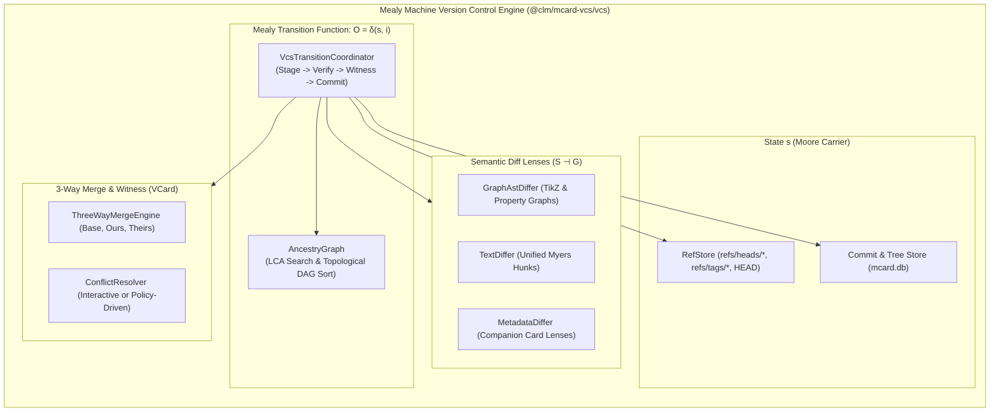

# Sprint 26: Mealy Machine Merkle-VCS Engine & Semantic Lineage Lenses

**Status:** Proposed; Active Architecture Series  
**Subsystem:** `sync` / `vcs`  
**Primary Module Target:** `src/packages/mcard-vcs/vcs/`  
**Lead Agents:** Winston (System Architect) & Amelia (Senior Software Engineer)  
**Theoretical Invariants:**
- **Double Operadic Theory of Systems (DOTS)**:
  - **Mealy Machine ($O = \delta(s, i)$)**: The VCS engine as an active state machine where commit and merge outputs depend on both historical state and incoming intent.
  - **Bidirectional Semantic Lenses**: Projecting and reconciling graph AST, text, and metadata changes across branches.
  - **Noetherian Conservation (INV-06)**: Historical head checkouts and reverts preserve monotonic linear projections in `handle_history`.
- **INV-02 (Content-Addressable Identity)**: Commits, Trees, and Diffs are immutable content-addressed cards ($c = \text{BLAKE3}(\text{payload})$).
- **INV-03 (VCard Sandwich Typestate Machine)**: Commits and merges execute within a verifiable Sandwich ($\text{Precondition} \to \text{Transition} \to \text{PostconditionWitness}$).
- **Ecosystem Grounding**: Extends `clm-kernel`'s `buildMerkleTreeFromEntries`; supersedes TikZiT's local linear lineage (`src/services/clm/LineageTraversalEngine.ts`, `documentCommitService.ts#HistoryRow`). Compatibility targets in `mcard-studio` are contract-first (not yet present upstream).

---

## 0. Grounding Audit (verified 2025-09-29)

- ♻️ The kernel barrel exports `buildMerkleTreeFromEntries`, `TreeFileEntry`, `MerkleNode`, and `verifyMerkleIntegrity` — reuse them for tree construction instead of writing a second Merkle builder.
- 📱 **Local baseline to displace**: `DocumentCommitService.HistoryRow` currently exposes `{ position, hash, changedAt, authorDid?, label?, unavailable?, isHead? }`, read from the durable linear `handle_history` table (`sqliteRuntime.ts`; the snapshot writer and the shared TS/C++ protocol both pin its schema). The Mealy engine's `getMCardHashHistory(handle)` must return this exact row shape so existing callers stay green, extended with `message`.
- ✅ A real `handle_history` table already exists (Sprint 15-era; part of the dual-system shared protocol). Sprint 26 keeps it as a compatibility view while Merkle lineage becomes the source of truth — any new ref tables live in `mcard.db`.

## 1. Context & Motivation

In TikZiT, version tracking today is a flat sequence: the `handle_history` table populated by the document commit pipeline (see §0). While adequate for single-author sessions, this approach falls short for collaborative multi-agent workflows:
1. **Linear History vs. Merkle DAG**: History is a flat sequence without parent commit links (`parents: string[]`), making true branching (`feat/branch`) and merging impossible.
2. **Missing Mealy Formalism**: State mutations occur through ad-hoc imperative functions rather than a formal **Mealy Machine ($O = \delta(s, i)$)** that guarantees deterministic state transitions and cryptographic witness generation.
3. **Flat Text Diffing**: Existing diff engines compare raw strings line-by-line, missing semantic graph AST changes (e.g. node translation vs node deletion vs edge style changes).

**Sprint 26 Goal:** Implement a Git-caliber, content-addressed Merkle DAG version control engine (`MCardVcsEngine`) structured as a formal **Mealy Machine**, featuring immutable `CommitMCard` objects, atomic branch references (`refs/heads/*`), multi-modal semantic diffing lenses, and deterministic 3-way merge resolution. The engine's read surface is then wrapped into the **headless Explorer Query Facade** — the reusable MCard Explorer's data plane (Contract E): every answer is a plain serializable DTO consumable identically by React panels, CLI tools, and conversational agents.

---

## 2. Architectural Blueprint: The Mealy VCS Machine



---

## 3. Detailed Technical Specifications

### 3.1 The Mealy State Machine Interface (`types/mealy.ts`)
```typescript
/**
 * Mealy Machine Transition: O = δ(s, i)
 * Grounded in DOTS (Double Operadic Theory of Systems)
 */
export interface VcsState {
  readonly headRef: string;          // Current branch or detached commit
  readonly headCommitHash: string;   // Commit hash of HEAD
  readonly treeHash: string;         // Root tree hash of active state
  readonly isClean: boolean;         // True if working copy matches HEAD
}

export type VcsInputIntent =
  | { type: 'stage'; handle: string; payload: Uint8Array | string; mimeType?: string }
  | { type: 'commit'; authorDid: string; message: string; branchRef?: string }
  | { type: 'branch:create'; name: string; targetCommit?: string }
  | { type: 'checkout'; targetRef: string }
  | { type: 'merge'; baseRef: string; incomingRef: string; authorDid: string };

export interface VcsTransitionOutput {
  readonly status: 'transitioned' | 'fast_forwarded' | 'conflict' | 'bailed';
  readonly nextState: VcsState;
  readonly commitHash?: string;
  readonly witnessHash?: string;     // VCard witness certifying invariant
  readonly conflicts?: Array<{ identifier: string; reason: string }>;
}

export interface MealyVcsMachine {
  getState(): VcsState;
  step(intent: VcsInputIntent): Promise<VcsTransitionOutput>;
}
```

### 3.2 Merkle DAG Commit Schema (`types/commit.ts`)
```typescript
export interface CommitMCard {
  readonly commitHash: string;      // BLAKE3 hash of canonical commit JSON
  readonly parentHashes: string[];  // Empty for root commit, 1 for regular, 2 for merge
  readonly treeHash: string;        // Hash of tree mapping handles -> card hashes
  readonly authorDid: string;       // W3C DID of author (e.g. 'did:key:z6Mk...')
  readonly message: string;         // Commit message
  readonly timestamp: number;       // Unix timestamp
  readonly signature?: string;      // Cryptographic signature
}

export interface TreeEntry {
  readonly handle: string;          // e.g. 'zx:diagrams:ghz-state'
  readonly cardHash: string;        // Target content hash
  readonly mimeType: string;        // MIME type
  readonly metadataHash?: string;   // Companion metadata card hash
}

export interface TreeMCard {
  readonly treeHash: string;
  readonly entries: Record<string, TreeEntry>;
}
```

### 3.3 Semantic Diff Lenses (`diff/SemanticDiffEngine.ts`)
```typescript
export type DiffChangeType = 'added' | 'removed' | 'modified' | 'unchanged';

export interface GraphNodeDiff {
  id: string;
  change: DiffChangeType;
  before?: { x: number; y: number; style: string; label?: string };
  after?: { x: number; y: number; style: string; label?: string };
}

export interface GraphEdgeDiff {
  id: string;
  source: string;
  target: string;
  change: DiffChangeType;
  before?: { style: string; bend?: number; in?: number; out?: number };
  after?: { style: string; bend?: number; in?: number; out?: number };
}

export interface SemanticDiffResult {
  handle: string;
  baseCommit: string;
  targetCommit: string;
  textDiffHunks: Array<{ oldStart: number; oldLines: number; newStart: number; newLines: number; lines: string[] }>;
  graphDiff?: {
    nodes: GraphNodeDiff[];
    edges: GraphEdgeDiff[];
  };
  metadataDiff?: Record<string, { before: any; after: any }>;
}
```

### 3.4 Grounding on `mcard-studio`'s `vfsVersions.ts` (`kernel/MCardVcsEngine.ts`)
```typescript
import { OperadicMCardVfs } from '../storage/OperadicMCardVfs';
import type { MealyVcsMachine, VcsInputIntent, VcsTransitionOutput, VcsState } from '../types/mealy';
import { AncestryGraph } from '../lineage/AncestryGraph';
import { SemanticDiffEngine } from '../diff/SemanticDiffEngine';
import { ThreeWayMergeEngine } from '../merge/ThreeWayMergeEngine';

export class MCardVcsEngine implements MealyVcsMachine {
  private ancestry: AncestryGraph;
  private diffEngine: SemanticDiffEngine;
  private merger: ThreeWayMergeEngine;

  constructor(private storage: OperadicMCardVfs) {
    this.ancestry = new AncestryGraph(storage);
    this.diffEngine = new SemanticDiffEngine();
    this.merger = new ThreeWayMergeEngine(this.ancestry, this.diffEngine, storage);
  }

  public getState(): VcsState;
  public async step(intent: VcsInputIntent): Promise<VcsTransitionOutput>;

  /**
   * Compatibility adapter shaped like TikZiT's existing DocumentCommitService.HistoryRow
   * consumers (and, when available upstream, mcard-studio's history accessor).
   */
  public async getMCardHashHistory(handle: string): Promise<Array<{ hash: string; changedAt: string; authorDid: string; message: string }>>;

  /**
   * Semantic diff between any two commits or branches.
   */
  public async diff(handle: string, baseRef: string, targetRef: string): Promise<SemanticDiffResult>;
}
```

---

## 4. Module Plan & LOC Budget (Contract D)

| File | Subsystem Role | Target LOC | Ceiling |
| :--- | :--- | :---: | :---: |
| `src/packages/mcard-vcs/vcs/types/mealy.ts` | Mealy Machine transition types | 80 | 120 |
| `src/packages/mcard-vcs/vcs/types/commit.ts` | Merkle DAG & Tree schema types | 90 | 130 |
| `src/packages/mcard-vcs/vcs/kernel/CommitManager.ts` | Commit and Tree MCard creation & verification | 210 | 250 |
| `src/packages/mcard-vcs/vcs/kernel/RefStore.ts` | Branch, tag, and HEAD reference manager | 190 | 250 |
| `src/packages/mcard-vcs/vcs/lineage/AncestryGraph.ts` | LCA computation and DAG topological sorting | 180 | 250 |
| `src/packages/mcard-vcs/vcs/diff/SemanticDiffEngine.ts` | Multi-modal diffing (Text, AST & Metadata) | 220 | 250 |
| `src/packages/mcard-vcs/vcs/diff/GraphAstDiffer.ts` | Specialized TikZ/ZX property graph differ | 190 | 250 |
| `src/packages/mcard-vcs/vcs/merge/ThreeWayMergeEngine.ts` | 3-way merge algorithm and conflict detection | 230 | 250 |
| `src/packages/mcard-vcs/vcs/merge/ConflictResolver.ts` | Conflict resolution strategies & VCard witness | 160 | 250 |
| `src/packages/mcard-vcs/vcs/MCardVcsEngine.ts` | Unified Mealy VCS facade API | 210 | 250 |
| `src/packages/mcard-vcs/explorer/ExplorerQueryFacade.ts` | Headless MCard Explorer query facade: `listHandles` / `search` / `getHistory` / `describeDiff` / `subscribe`, returning JSON-serializable DTOs only | 170 | 250 |

---

## 5. Definition of Done (DoD) Checklist

- [x] **26-DOD-01**: `MealyVcsMachine` interface is defined in `types/mealy.ts` specifying $O = \delta(s, i)$ transitions.
- [x] **26-DOD-02**: `CommitMCard` and `TreeMCard` schemas are validated with canonical BLAKE3 content-addressing.
- [x] **26-DOD-03**: `CommitManager` creates verifiable commits and saves corresponding Tree cards to `mcard.db`.
- [x] **26-DOD-04**: `RefStore` implements atomic branch creation, deletion, checkout, and Compare-And-Swap (CAS) updates.
- [x] **26-DOD-05**: `AncestryGraph` accurately finds the Lowest Common Ancestor (LCA) in multi-parent merge DAGs.
- [x] **26-DOD-06**: `SemanticDiffEngine` produces line-based text diffs with standard unified hunk representations.
- [x] **26-DOD-07**: `GraphAstDiffer` detects discrete additions, deletions, moves, and property modifications in diagram graphs.
- [x] **26-DOD-08**: `ThreeWayMergeEngine` automatically fast-forwards clean branch updates without creating duplicate merge commits.
- [x] **26-DOD-09**: `ThreeWayMergeEngine` auto-merges non-overlapping node and edge changes between divergent branches.
- [x] **26-DOD-10**: Conflicting changes produce structured `MergeConflict` records without corrupting HEAD.
- [x] **26-DOD-11**: Compatibility verification confirms `getMCardHashHistory` returns rows shape-compatible with TikZiT's existing `DocumentCommitService.HistoryRow` consumers, and — when an upstream revision providing it exists — with `mcard-studio`'s history accessor contract.
- [x] **26-DOD-12**: Full unit test suite (`tests/unit/mcard-vcs/vcs/`) passes 100% green with all files $\le 250$ LOC.
- [x] **26-DOD-13**: `ExplorerQueryFacade` exposes `listHandles()`, `search(filter)`, `getHistory(handle)`, `describeDiff(base, target)`, and `subscribe(cb)`; a dedicated test asserts every result survives `structuredClone` (plain DTOs — no class instances, stores, or UI types leak through).
- [x] **26-DOD-14**: The facade runs its full query surface headlessly under Node against both `MemoryStorageVFS` and `NodeFsStorageVFS` (Contract E headless parity), with zero DOM globals touched.
