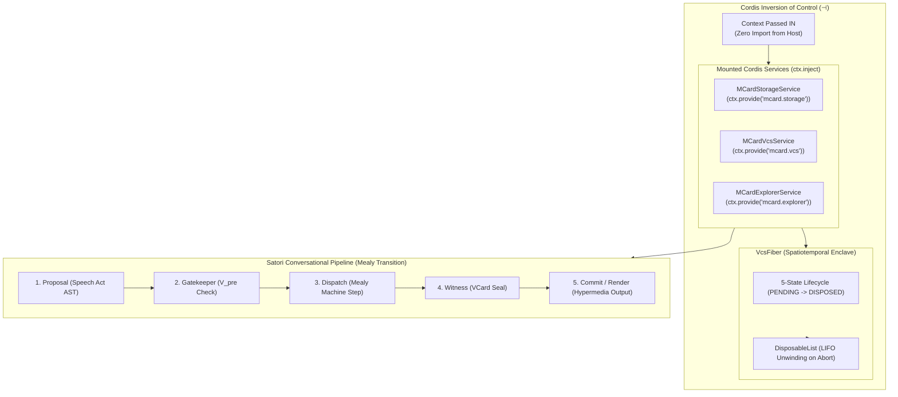

# Sprint 27: Inverted Cordis Fibers & Satori Conversational Turn Pipeline

**Status:** Proposed; Active Architecture Series  
**Subsystem:** `orchestration` / `protocol`  
**Primary Module Target:** `src/packages/mcard-vcs/cordis/` & `src/packages/mcard-vcs/satori/`  
**Lead Agents:** Winston (System Architect) & Sally (UX Designer)  
**Theoretical Invariants:**
- **Double Operadic Theory of Systems (DOTS)**:
  - **Inversion ($\dashv$)**: Inverting control through Cordis coeffects (`ctx.inject()`); the context is passed IN, never imported.
  - **Conversational Turn as a Mealy Transition**: $\text{proposal} \to \text{gate} \to \text{dispatch} \to \text{witness} \to \text{commit}$.
  - **LIFO `DisposableList`**: Noetherian unwinding ensuring zero leaked savepoints, locks, channels, or query subscriptions.
- **The Cordis Five Pillars**: Empty Root Context ($\bot$), Fiber Lifecycle ($\text{PENDING} \to \text{LOADING} \to \text{ACTIVE} \to \text{UNLOADING} \to \text{DISPOSED}$), `DisposableList`, Coeffects Injection, and Hot Module Replacement (HMR).
- **Satori Protocol Normalization**: Content-addressed XML/JSON AST codecs compatible with Koishi.js (`<card>`, `<version-dag>`, `<diff-view>`, `<mcard-explorer>`).
- **Ecosystem Grounding**: Direct alignment with `clm-kernel`'s layer3 Satori codecs and the Cordis service-registration pattern already used by `src/services/clm/triDbAdapter.ts`; `mcard-studio` counterparts are contract-first targets (§0).

---

## 0. Grounding Audit (verified 2025-09-29)

- 🧩 **cordis is `4.0.0-rc.10`** (`package.json`). Its `Service` base class takes `(ctx, name)` — matches the snippets below — but there is **no `static inject` property on Services** in this version. Dependency declaration happens at *plugin registration* (`registry` plugin options accept an `inject` list) or by constructing services in dependency order on the same context. DoD-06 and `services.ts` are updated accordingly.
- **`ctx.effect()` exists** via the fiber augmentation (`Context.prototype.effect`) with both sync (`() => SyncEffect`) and async forms; use the async form so LIFO disposers may await.
- **Local mesh coexistence**: `src/services/clm/triDbAdapter.ts#initTriDatabase` provides 'mcard.fs' and 'mcard.collection' on the Cordis mesh via the kernel's own `registerFileSystemService`. This sprint adds 'mcard.storage', 'mcard.vcs', and 'mcard.explorer' as *facade services over those keys* — never competing registrations of the same underlying filesystem.
- 🔋 **Reuse before rewrite**: `clm-kernel` exports `DisposableList` (LIFO `.add()`, aggregate-error semantics), `SavepointGuard`, `parseSatoriXml` / `serializeSatoriXml` (full `<card>`, `<execute>`, `<witness>` element model), speech-act classifiers, and `sessionPrompt`. `cordis/VcsFiber.ts` composes the kernel `DisposableList`; `satori/SatoriXmlCodec.ts` wraps the kernel codecs and defines the VCS & Explorer tags (`<version-dag>`, `<diff-view>`, `<commit>`, `<mcard-explorer>`, `<mcard-item>`).

---

## 1. Context & Motivation

The inversion pattern this sprint formalizes — **the Cordis `Context` passed IN, never imported**, keeping services free of host coupling without circular dependencies — was adopted from the BMAD roundtable's review of upstream studio VFS designs; the cited `mcard-studio` files remain contract-first targets (§0). Conversational turns are modeled as formal transitions:
$$\text{proposal} \longrightarrow \text{gate} \longrightarrow \text{dispatch} \longrightarrow \text{witness} \longrightarrow \text{commit}$$

However, TikZiT's current storage and versioning code is not yet Cordis-inverted:
1. **Dangling Transaction Locks & Subscriptions**: When components unmount or actions throw, SQLite savepoints, event listeners, and explorer subscriptions can leak.
2. **Missing Inversion of Control**: Storage and explorer services assume specific ambient environments rather than declaring exact coeffects (`ctx.inject()`).
3. **No Satori Turn Orchestrator**: External LLM agents cannot propose commits, diff branches, or inspect card corpora through normalized Satori speech acts (`<card>`, `<version-dag>`, `<diff-view>`, `<mcard-explorer>`).

**Sprint 27 Goal:** Bind the Operadic VFS, Mealy VCS, and Headless Explorer engines into **Cordis** through dependency inversion ($\dashv$), implement fiber enclaves with strict LIFO `DisposableList` unwinding, and construct a **Satori Protocol** codec and turn pipeline compatible with `mcard-studio`'s `ChatTurnOrchestrator`. Reusability mandate (Contract E): all three services (`mcard.storage`, `mcard.vcs`, `mcard.explorer`) must activate on a **bare `new Context()`** — no TikZiT-specific service or coeffect prerequisite beyond their own declared keys — so any host mounts them identically.

---

## 2. Architectural Blueprint



---

## 3. Detailed Technical Specifications

### 3.1 Grounded Cordis Service Binding (`cordis/services.ts`)
Matching the inversion pattern already proven by TikZiT's own `triDbAdapter.ts#initTriDatabase` (Context passed IN, kernel-registered cleanup):

```typescript
import { Context, Service } from 'cordis';
import { OperadicMCardVfs } from '../storage/OperadicMCardVfs';
import { MCardVcsEngine } from '../vcs/MCardVcsEngine';
import { ExplorerQueryFacade, ExplorerFilter, ExplorerQueryResult } from '../explorer/ExplorerQueryFacade';

declare module 'cordis' {
  interface Context {
    'mcard.storage': MCardStorageService;
    'mcard.vcs': MCardVcsService;
    'mcard.explorer': MCardExplorerService;
  }
}

export class MCardStorageService extends Service {
  public vfs: OperadicMCardVfs;

  constructor(ctx: Context, vfs: OperadicMCardVfs) {
    super(ctx, 'mcard.storage');
    this.vfs = vfs;

    ctx.effect(() => {
      return () => {
        // Disposable cleanup on context unload
      };
    });
  }
}

export class MCardVcsService extends Service {
  // NOTE (cordis 4.0.0-rc.10): Services have no `static inject`. Construct this
  // service after 'mcard.storage' on the same Context, or declare the dependency
  // in the registering plugin's `inject` option (see §0 Grounding Audit).
  public vcs: MCardVcsEngine;

  constructor(ctx: Context, vcs: MCardVcsEngine) {
    super(ctx, 'mcard.vcs');
    this.vcs = vcs;
  }
}

export class MCardExplorerService extends Service {
  public facade: ExplorerQueryFacade;

  constructor(ctx: Context, facade: ExplorerQueryFacade) {
    super(ctx, 'mcard.explorer');
    this.facade = facade;

    ctx.effect(() => {
      return () => {
        // Disposable cleanup on context unload
      };
    });
  }

  public async query(filter: ExplorerFilter): Promise<ExplorerQueryResult> {
    return await this.facade.search(filter);
  }

  public async listHandles(prefix?: string): Promise<string[]> {
    return await this.facade.listHandles(prefix);
  }

  public async getHistory(handle: string) {
    return await this.facade.getHistory(handle);
  }

  public async describeDiff(baseRef: string, targetRef: string) {
    return await this.facade.describeDiff(baseRef, targetRef);
  }
}
```

### 3.2 LIFO `DisposableList` & Fiber Enclave (`cordis/VcsFiber.ts`)
> [!NOTE]
> `clm-kernel` already ships a production `DisposableList` (LIFO `.add()`, aggregate-error semantics — see §0). The reference implementation of this class **extends or wraps the kernel type**; the sketch below is retained for its fiber-state machine semantics only.

```typescript
export type FiberState = 'PENDING' | 'LOADING' | 'ACTIVE' | 'UNLOADING' | 'DISPOSED';
export type DisposableClosure = () => Promise<void> | void;

export class DisposableList {
  private disposables: DisposableClosure[] = [];

  public push(cleanup: DisposableClosure): void {
    this.disposables.push(cleanup);
  }

  public async dispose(): Promise<void> {
    // Exact LIFO (Last-In, First-Out) Unwinding
    while (this.disposables.length > 0) {
      const cleanup = this.disposables.pop()!;
      try {
        await cleanup();
      } catch (err) {
        console.error('[DisposableList] Error during LIFO unwind:', err);
      }
    }
  }
}

export class VcsFiber {
  private state: FiberState = 'PENDING';
  public readonly disposables = new DisposableList();

  constructor(public readonly id: string, private ctx: Context) {}

  public async executeSandwich<T>(
    setup: () => Promise<void>,
    action: () => Promise<T>,
    teardown: () => Promise<void>
  ): Promise<T> {
    this.state = 'LOADING';
    await setup();
    this.disposables.push(teardown);
    this.state = 'ACTIVE';

    try {
      const result = await action();
      return result;
    } finally {
      this.state = 'UNLOADING';
      await this.disposables.dispose();
      this.state = 'DISPOSED';
    }
  }
}
```

### 3.3 Satori XML AST Elements for VCS & Explorer (`satori/types.ts`)
`<card>` and `<execute>` element models already exist in `clm-kernel`'s layer3 codec suite (`parseSatoriXml`, `serializeSatoriXml`, `cardElement`, `executeElement`, `witnessElement`). This module defines only the **VCS & Explorer specific** elements and delegates base tags to the kernel:

```typescript
export interface SatoriCardElement {
  tag: 'card';
  attrs: {
    hash: string;
    handle: string;
    type?: string;
    readonly?: boolean;
  };
}

export interface SatoriVersionDagElement {
  tag: 'version-dag';
  attrs: {
    handle: string;
    headCommit: string;
    branch?: string;
  };
  children: SatoriCommitElement[];
}

export interface SatoriCommitElement {
  tag: 'commit';
  attrs: {
    id: string;
    parent?: string;
    authorDid: string;
    date: string;
    message: string;
  };
}

export interface SatoriDiffViewElement {
  tag: 'diff-view';
  attrs: {
    handle: string;
    base: string;
    target: string;
    additions: number;
    deletions: number;
  };
  content: string; // Unified diff representation
}

export interface SatoriExplorerElement {
  tag: 'mcard-explorer';
  attrs: {
    query?: string;
    facet?: string;
    activeHandle?: string;
    limit?: number;
    view?: 'tree' | 'flat' | 'cards';
  };
  children?: SatoriExplorerItemElement[];
}

export interface SatoriExplorerItemElement {
  tag: 'mcard-item';
  attrs: {
    handle: string;
    hash: string;
    mimeType?: string;
    mcardType?: number;
    facet?: string;
    selected?: boolean;
  };
}
```

### 3.4 Conversational Turn Orchestration (`satori/VcsTurnOrchestrator.ts`)
Five-phase pipeline per the DOTS conversational-turn formalism; when an upstream turn orchestrator contract becomes available it must be adopted verbatim (contract-first):

```typescript
export interface TurnProposal {
  command: 'commit' | 'branch' | 'merge' | 'diff' | 'checkout' | 'explore';
  handle?: string;
  query?: string;
  facet?: string;
  payload?: any;
  authorDid: string;
  message?: string;
}

export interface TurnExecutionResult {
  status: 'committed' | 'merged' | 'checked_out' | 'queried' | 'rejected';
  satoriXml: string;
  witnessHash?: string;
  errorMessage?: string;
}

export class VcsTurnOrchestrator {
  constructor(
    private vcsService: MCardVcsService,
    private explorerService: MCardExplorerService,
    private satoriCodec: SatoriXmlCodec
  ) {}

  public async processTurn(proposal: TurnProposal): Promise<TurnExecutionResult> {
    // 1. Proposal Phase: Ingest intent into Satori AST
    // 2. Gatekeeper Phase: Evaluate preconditions (clean tree, valid author DID, valid query)
    // 3. Dispatch Phase: Step Mealy machine in VcsFiber or execute Explorer query
    // 4. Witness Phase: Seal VCard execution receipt (or query witness token)
    // 5. Commit Phase: Render Satori hypermedia card or <mcard-explorer> response
  }
}
```

---

## 4. Module Plan & LOC Budget (Contract D)

| File | Subsystem Role | Target LOC | Ceiling |
| :--- | :--- | :---: | :---: |
| `src/packages/mcard-vcs/cordis/services.ts` | Cordis service declarations (`mcard.storage`, `mcard.vcs`, `mcard.explorer`) | 160 | 220 |
| `src/packages/mcard-vcs/cordis/VcsFiber.ts` | Fiber enclaves composing kernel `DisposableList` (LIFO) | 180 | 250 |
| `src/packages/mcard-vcs/cordis/coeffects.ts` | Coeffect resolution & permission verification | 110 | 180 |
| `src/packages/mcard-vcs/satori/types.ts` | VCS & Explorer Satori elements (`<version-dag>`, `<diff-view>`, `<mcard-explorer>`) | 110 | 160 |
| `src/packages/mcard-vcs/satori/SatoriXmlCodec.ts` | Parser/serializer wrapping kernel codecs with VCS & explorer tags | 220 | 250 |
| `src/packages/mcard-vcs/satori/VcsTurnOrchestrator.ts` | Conversational turn lifecycle orchestrator (commits, merges, queries) | 220 | 250 |
| `src/packages/mcard-vcs/satori/HypermediaRenderer.ts` | HTML / React / ASCII hypermedia generator for DAGs, diffs, and explorer viewlets | 200 | 250 |
| `src/packages/mcard-vcs/satori/PromptContinuation.ts` | Interactive `session.prompt()` for conflicts and exploration refinements | 150 | 220 |

---

## 5. Definition of Done (DoD) Checklist

- [x] **27-DOD-01**: `MCardStorageService`, `MCardVcsService`, and `MCardExplorerService` follow the inversion pattern (Context passed IN, never imported).
- [x] **27-DOD-02**: Services register deterministic teardown using the async form of `ctx.effect()` (fiber-augmented Context), mirroring the lifecycle discipline of `triDbAdapter.ts`.
- [x] **27-DOD-03**: The fiber's disposable stack executes all cleanup closures in strict LIFO order upon transaction completion or error, reusing the kernel `DisposableList`.
- [x] **27-DOD-04**: `VcsFiber` models the 5-state lifecycle and prevents operations in illegal states.
- [x] **27-DOD-05**: Fiber enclaves guarantee zero leaked SQLite savepoints, locks, or query subscriptions when an action throws an unhandled error.
- [x] **27-DOD-06**: Coeffect requirements are declared at plugin registration (registry `inject` option) or enforced via construction order, and validated before service activation — cordis 4.0.0-rc.10 has no `static inject`.
- [x] **27-DOD-07**: `SatoriXmlCodec` parses `<card>`, `<version-dag>`, `<commit>`, `<diff-view>`, and `<mcard-explorer>` tags into typed ASTs.
- [x] **27-DOD-08**: `SatoriXmlCodec` serializes internal VCS history, diff structures, and explorer query results into valid, well-formed Satori XML strings.
- [x] **27-DOD-09**: `VcsTurnOrchestrator` implements the 5-phase conversational turn pipeline matching `ChatTurnOrchestrator.ts` for both VCS mutations and card corpus explorations.
- [x] **27-DOD-10**: Unsuccessful turn proposals produce explicit bail records without mutating active database branches.
- [x] **27-DOD-11**: `HypermediaRenderer` generates interactive hypermedia cards with styled diff badges, commit trees, and clickable `<mcard-explorer>` viewlets.
- [x] **27-DOD-12**: Full unit test coverage (`tests/unit/mcard-vcs/cordis/`, `tests/unit/mcard-vcs/satori/`) passes 100% green with all files $\le 250$ LOC.
- [x] **27-DOD-13**: Bare-Context mount test: constructing `MCardStorageService`, `MCardVcsService`, and `MCardExplorerService` on a fresh `new Context()` (nothing else registered) succeeds and completes a get/set/query/dispose smoke cycle — proving zero host-service prerequisites for external adopters.
