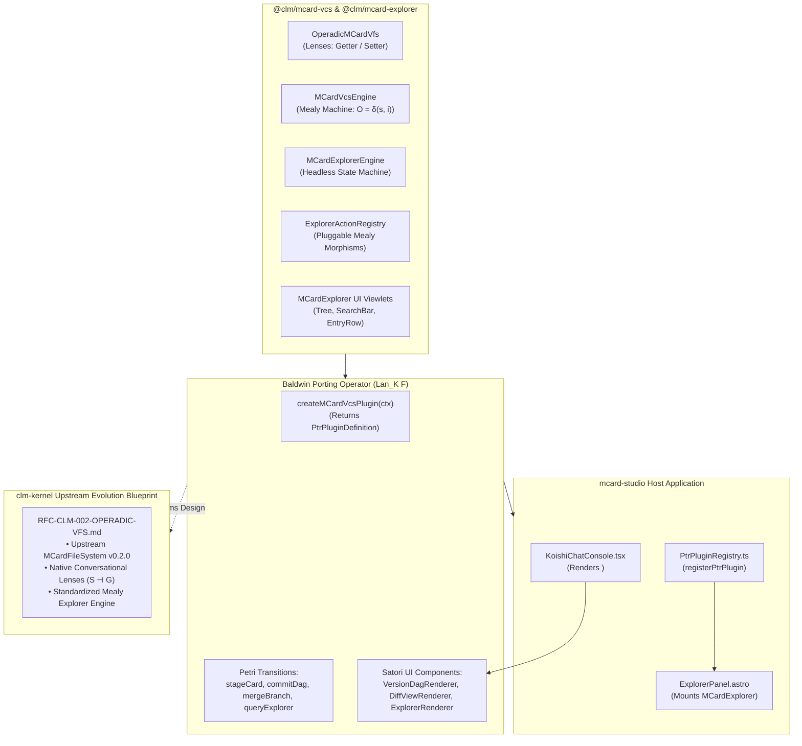

# Sprint 28: mcard-studio Plugin Manifest, Reusable MCard Explorer Subsystem & clm-kernel Upstream Evolution Blueprint

**Status:** Proposed; Active Architecture Series  
**Subsystem:** `orchestration` / `plugin` & `presentation` / `explorer`  
**Primary Module Target:** `src/packages/mcard-vcs/plugin/` & `src/packages/mcard-explorer/`  
**Lead Agents:** Winston (System Architect), John (Product Manager) & Sally (UX Designer)  
**Theoretical Invariants:**
- **Double Operadic Theory of Systems (DOTS)**:
  - **Porting ($\operatorname{Lan}_K F$)**: Change-of-base functor porting the local VFS and explorer into `mcard-studio`'s microkernel.
  - **The Four DOTS Idioms**: Getter/Setter Lenses ($S \dashv G$), Dispatch/Callback Event Wiring, Mealy/Moore Machine Morphisms, and Dependency Inversion ($\dashv$).
- **Reusable MCard Explorer Architecture**: Pluggable action morphisms ($O = \delta(s, i)$), headless state machine (`MCardExplorerEngine`), and host-agnostic presentation viewlets (`MCardExplorer`, `MCardTree`, `MCardSearchBar`).
- **PTR Microkernel Plugin Specification**: `PtrPluginDefinition` / `PtrTransitionDefinition` authored locally in this sprint (contract-first; see §0 — no such registry exists upstream yet).
- **Upstream Convergence Mandate**: Authoring the official architectural RFC informing the evolution of `MCardFileSystem` and explorer interfaces in `clm-kernel` v0.2.0.

---

## 0. Grounding Audit (verified 2025-09-29)

- 🕳 **`mcard-studio/src/kernel/PtrPluginRegistry.ts` does not exist** in the current sibling checkout, and no `PtrPluginDefinition` symbol occurs anywhere in the local CLM ecosystem repos. This sprint therefore proceeds **contract-first**: `plugin/types.ts` *defines* the canonical `PtrPluginDefinition` / `PtrTransitionDefinition` interfaces (authored here, versioned locally), and an **upstream-pinning gate** validates the real host before any cross-repo integration work begins (DoD-13).
- 🔄 The plugin factory sample in §3.1 must also guard against double registration via kernel service keys already present in TikZiT's mesh (`'mcard.fs'`, `'mcard.collection'` from `triDbAdapter.ts`) — this sprint's `'mcard.storage'`, `'mcard.vcs'`, and `'mcard.explorer'` facades wrap them.
- **Local vs upstream**: Referenced studio UI surfaces (`ExplorerPanel.astro`, `MCardFileTree.tsx`, `KoishiChatConsole.tsx`, Satori tag renderers) are targets. The reusable `@clm/mcard-explorer` package created here provides a shared, drop-in replacement that unifies explorer behavior across TikZiT and `mcard-studio`.

---

## 1. Context & Motivation

This sprint realizes the dual strategic mandate of the active architecture series:
1. **The Reusable MCard Explorer Subsystem (`@clm/mcard-explorer`)**: Extract card browsing, searching, faceted filtering, and action execution into a modular, host-agnostic subsystem consisting of:
   - A pure, zero-DOM headless engine (`MCardExplorerEngine.ts`).
   - A pluggable action registry (`ExplorerActionRegistry.ts`) allowing hosts to inject domain actions (`open`, `duplicate`, `archive`, `export`, `diff`, `inspectMarking`).
   - Universal, accessible React/Astro UI viewlets (`MCardExplorer.tsx`, `MCardTree.tsx`, `MCardSearchBar.tsx`, `MCardEntryRow.tsx`).
2. **The `mcard-studio` Plug-in**: Package the Operadic VFS and Explorer as a drop-in **PTR Microkernel Plugin** (`TikzitMCardVcsPlugin`) mounting into `mcard-studio`'s `PtrPluginRegistry.ts`, bringing Merkle DAG versioning, 3-way merging, Satori hypermedia rendering, and interactive explorer viewlets directly to the Studio's UI and AI chat bot (`KoishiChatConsole.tsx`).
3. **Informing `clm-kernel` Evolution**: Grounded in the lessons of building this local VFS and Explorer in TikZiT and porting it to `mcard-studio`, author the formal upstream specification (**`RFC-CLM-002-OPERADIC-VFS.md`**) detailing how `clm-kernel`'s native `MCardFileSystem` should evolve to adopt DOTS operadic lenses, Mealy machine transitions, and conversational turn pipelines.

**Sprint 28 Goal:** Deliver the complete `@clm/mcard-explorer` subsystem, `PtrPluginDefinition` manifest, and Satori tag renderers for `mcard-studio`, accompanied by an executable sample integration and the upstream **`clm-kernel` Evolution RFC**. In line with ADR D29 this is a **generalized Embedding Kit**: the manifest contract, the **EMBEDDING guide** (`docs/integration/EMBEDDING-MCARD-VCS.md`), and a shipped **conformance self-check runner** make `@clm/mcard-vcs` and `@clm/mcard-explorer` mountable by any host — `mcard-studio` is simply the flagship adopter.

---

## 2. Architectural Blueprint: The Porting Bridge & Explorer Subsystem ($\operatorname{Lan}$)



---

## 3. Detailed Technical Specifications

### 3.1 The Canonical `PtrPluginDefinition` Manifest (`plugin/manifest.ts`)
Implementing the PTR microkernel plugin interface defined locally by this sprint (`plugin/types.ts`):

```typescript
import { Context } from 'cordis';
import type { PtrPluginDefinition, PtrTransitionDefinition } from './types';
import { MCardStorageService, MCardVcsService, MCardExplorerService } from '../cordis/services';
import { OperadicMCardVfs } from '../storage/OperadicMCardVfs';
import { MCardVcsEngine } from '../vcs/MCardVcsEngine';

export function createMCardVcsPlugin(rootCtx: Context): PtrPluginDefinition {
  // 1. Inverted Service Registration (Passed IN)
  if (!rootCtx.get('mcard.storage')) rootCtx.provide('mcard.storage');
  if (!rootCtx.get('mcard.vcs')) rootCtx.provide('mcard.vcs');
  if (!rootCtx.get('mcard.explorer')) rootCtx.provide('mcard.explorer');

  // 2. Define DOTS Mealy Machine Transitions
  const transitions: PtrTransitionDefinition[] = [
    {
      name: 'vcs:stageCard',
      inputSchema: 'urn:clm:schema:StageCardInput',
      outputSchema: 'urn:clm:schema:StageCardOutput',
      morphism: async (input: { handle: string; payload: string | Uint8Array; mimeType?: string }) => {
        const vcs = rootCtx.get('mcard.vcs') as MCardVcsService;
        return await vcs.vcs.step({
          type: 'stage',
          handle: input.handle,
          payload: input.payload,
          mimeType: input.mimeType
        });
      }
    },
    {
      name: 'vcs:commitDag',
      inputSchema: 'urn:clm:schema:CommitDagInput',
      outputSchema: 'urn:clm:schema:CommitDagOutput',
      morphism: async (input: { authorDid: string; message: string; branchRef?: string }) => {
        const vcs = rootCtx.get('mcard.vcs') as MCardVcsService;
        return await vcs.vcs.step({
          type: 'commit',
          authorDid: input.authorDid,
          message: input.message,
          branchRef: input.branchRef
        });
      }
    },
    {
      name: 'vcs:mergeBranch',
      inputSchema: 'urn:clm:schema:MergeBranchInput',
      outputSchema: 'urn:clm:schema:MergeBranchOutput',
      morphism: async (input: { baseRef: string; incomingRef: string; authorDid: string }) => {
        const vcs = rootCtx.get('mcard.vcs') as MCardVcsService;
        return await vcs.vcs.step({
          type: 'merge',
          baseRef: input.baseRef,
          incomingRef: input.incomingRef,
          authorDid: input.authorDid
        });
      }
    },
    {
      name: 'explorer:query',
      inputSchema: 'urn:clm:schema:ExplorerQueryInput',
      outputSchema: 'urn:clm:schema:ExplorerQueryOutput',
      morphism: async (input: { query?: string; facet?: string; limit?: number }) => {
        const explorer = rootCtx.get('mcard.explorer') as MCardExplorerService;
        return await explorer.query(input);
      }
    }
  ];

  return {
    id: 'clm:plugin:mcard-vcs',
    name: 'Operadic MCard Virtual File System, Merkle VCS & Explorer',
    version: '1.0.0',
    description: 'Provides DOTS lens storage, Merkle DAG versioning, 3-way merge, Satori codecs, and reusable Explorer.',
    places: [
      'p_vcs_idle',
      'p_mcard_staged',
      'p_merkle_verified',
      'p_commit_sealed',
      'p_explorer_ready'
    ],
    transitions,
    coeffects: [
      'identity.did',
      'mcard.storage',
      'mcard.explorer'
    ],
    enabled: true
  };
}
```

### 3.2 DOTS Idioms: The Plug-in Consumption Bridge (`plugin/bridge.ts`)
Demonstrating how `mcard-studio` communicates via the four DOTS programming idioms:

```typescript
export class StudioMCardPluginBridge {
  constructor(
    private vfs: OperadicMCardVfs,
    private vcs: MCardVcsEngine,
    private explorer: MCardExplorerEngine,
    private bus: { dispatch<V>(type: VfsEventType, payload: V): Promise<void> }
  ) {}

  // 1. Getter / Setter Lens Idiom (S ⊣ G)
  public get(handle: string) {
    return this.vfs.get(handle);
  }
  public set(handle: string, content: string | Uint8Array, options?: any) {
    return this.vfs.set(handle, content, options);
  }

  // 2. Dispatch / Callback Event Idiom (Loose Wiring)
  public async dispatch<V>(type: VfsEventType, payload: V): Promise<void> {
    await this.bus.dispatch(type, payload);
  }
  public on(type: string, callback: (event: any) => void): () => void {
    return this.vfs.on(type, callback);
  }

  // 3. Mealy Machine Transition Step
  public async step(intent: any) {
    return await this.vcs.step(intent);
  }

  // 4. Explorer Query & Navigation
  public getExplorerEngine(): MCardExplorerEngine {
    return this.explorer;
  }
}
```

### 3.3 The Reusable MCard Explorer Subsystem (`@clm/mcard-explorer`)
A zero-DOM headless core paired with modular, accessible React/Astro UI viewlets:

#### A. Headless Engine (`src/packages/mcard-explorer/core/MCardExplorerEngine.ts`)
```typescript
export interface ExplorerState {
  query: string;
  activeFacet: string;
  activeHandle: string | null;
  expandedFolders: Set<string>;
  selectedHandles: Set<string>;
  viewMode: 'tree' | 'flat' | 'cards';
  sortBy: 'name' | 'updatedAt' | 'hash';
}

export class MCardExplorerEngine {
  private state: ExplorerState;
  private listeners = new Set<(state: ExplorerState) => void>();

  constructor(
    private queryFacade: ExplorerQueryFacade,
    private actionRegistry: ExplorerActionRegistry
  ) {
    this.state = this.getInitialState();
  }

  public getState(): ExplorerState { return { ...this.state }; }
  public setQuery(query: string): void { /* debounced filter update */ }
  public setFacet(facet: string): void { /* facet update */ }
  public selectHandle(handle: string): void { /* selection update */ }
  public toggleFolder(path: string): void { /* expand/collapse */ }
  public subscribe(cb: (state: ExplorerState) => void): () => void {
    this.listeners.add(cb);
    return () => this.listeners.delete(cb);
  }
  public async executeAction(actionId: string, handle: string, payload?: any): Promise<ActionResult> {
    return await this.actionRegistry.execute(actionId, handle, payload);
  }
}
```

#### B. Pluggable Action Registry (`src/packages/mcard-explorer/actions/ExplorerActionRegistry.ts`)
```typescript
export interface ExplorerAction {
  id: string;
  label: string;
  icon?: string;
  shortcut?: string;
  isAvailable?: (card: CardSummary) => boolean;
  execute: (card: CardSummary, context: ExplorerActionContext) => Promise<ActionResult>;
}

export class ExplorerActionRegistry {
  private actions = new Map<string, ExplorerAction>();

  public register(action: ExplorerAction): () => void {
    this.actions.set(action.id, action);
    return () => this.actions.delete(action.id);
  }

  public getAvailableActions(card: CardSummary): ExplorerAction[] {
    return Array.from(this.actions.values()).filter(a => !a.isAvailable || a.isAvailable(card));
  }

  public async execute(actionId: string, handle: string, payload?: any): Promise<ActionResult> {
    const action = this.actions.get(actionId);
    if (!action) throw new Error(`Action '${actionId}' not registered`);
    // Step Mealy action transition: O = δ(s, i)
    return await action.execute({ handle, ...payload }, { /* context */ });
  }
}
```

#### C. Universal React/Astro Viewlets (`src/packages/mcard-explorer/ui/`)
- **`MCardExplorer.tsx`**: Top-level container binding the headless engine to reactive UI.
- **`MCardSearchBar.tsx`**: High-performance debounced input with `Cmd+F` capture and clear badge.
- **`MCardFacetBar.tsx`**: Filter chip strip supporting host-configured facets (`all`, `diagram`, `draft`, `marking`, `example`).
- **`MCardTree.tsx`**: Hierarchical tree with virtualized scrolling, collapsible namespace branches, and drag-and-drop support.
- **`MCardEntryRow.tsx`**: Accessible list row rendering card handle, BLAKE3 CID pill, timestamp, and contextual action buttons.

### 3.4 `mcard-studio` Integration Sample (`plugin/sample/studioIntegration.tsx`)
Demonstrating how `mcard-studio` embeds `@clm/mcard-explorer` in `ExplorerPanel.astro` and renders `<mcard-explorer>` in `KoishiChatConsole.tsx`:

```tsx
import React from 'react';
import { MCardExplorer, ExplorerActionRegistry } from '@clm/mcard-explorer';
import { clientContext } from '../cordisClient';

// 1. Configure studio-specific domain actions
const studioActions = new ExplorerActionRegistry();
studioActions.register({
  id: 'inspectMarking',
  label: 'Inspect Petri Net Marking',
  icon: 'circle-dot',
  execute: async (card) => {
    // Open marking inspector panel in mcard-studio
    clientContext.emit('studio:open-marking', card.handle);
    return { success: true };
  }
});

// 2. Mount inside ExplorerPanel.astro
export const StudioExplorerView: React.FC = () => {
  const explorerService = clientContext.get('mcard.explorer');

  return (
    <div className="studio-explorer-container h-full w-full">
      <MCardExplorer
        engine={explorerService.engine}
        actionRegistry={studioActions}
        facets={['all', 'marking', 'diagram', 'prompt']}
        onCardSelect={(handle) => {
          clientContext.emit('studio:card-selected', handle);
        }}
      />
    </div>
  );
};
```

### 3.5 Upstream `clm-kernel` Evolution RFC Outline (`docs/RFC-CLM-002-OPERADIC-VFS.md`)
The sprint produces a formal architectural RFC proposing upstream enhancements to `clm-kernel`:
1. **`MCardFileSystem` 2.0**:
   - Introduce `ConversationalLens<S>` as the primary interface for card access.
   - Deprecate mutable in-place setters in favor of immutable state returns.
2. **Native Merkle DAG Substrate**:
   - Promote `CommitMCard` and `TreeMCard` to first-class schema types in `clm-kernel/layer2/`.
   - Incorporate the Lowest Common Ancestor (LCA) graph search natively.
3. **Conversational Turn Pipeline & Standardized Explorer**:
   - Provide a built-in `ChatTurnOrchestrator` in `clm-kernel/layer4/chatbot/` normalizing Satori AST speech acts across all storage drivers.
   - Standardize `MCardExplorerEngine` and `ExplorerActionRegistry` into `clm-kernel/layer4/explorer/`.

---

## 4. Module Plan & LOC Budget (Contract D)

| File | Subsystem Role | Target LOC | Ceiling |
| :--- | :--- | :---: | :---: |
| `src/packages/mcard-vcs/plugin/types.ts` | Shared PTR plugin interfaces | 80 | 120 |
| `src/packages/mcard-vcs/plugin/manifest.ts` | Canonical `createMCardVcsPlugin` factory | 190 | 250 |
| `src/packages/mcard-vcs/plugin/bridge.ts` | Four DOTS idioms communication bridge | 180 | 250 |
| `src/packages/mcard-vcs/plugin/ui/SatoriVcsRenderer.tsx` | Satori React components (`<version-dag>`, `<diff-view>`, `<mcard-explorer>`) | 190 | 250 |
| `src/packages/mcard-vcs/plugin/sample/studioIntegration.tsx` | Executable sample for `mcard-studio` ExplorerPanel & chat | 140 | 200 |
| `src/packages/mcard-explorer/core/MCardExplorerEngine.ts` | Headless state machine (query, facets, active item, sort) | 200 | 250 |
| `src/packages/mcard-explorer/actions/ExplorerActionRegistry.ts` | Pluggable Mealy actions ($O = \delta(s, i)$) | 160 | 220 |
| `src/packages/mcard-explorer/ui/MCardExplorer.tsx` | Host-agnostic composite React Explorer viewlet | 190 | 250 |
| `src/packages/mcard-explorer/ui/MCardTree.tsx` | Collapsible hierarchical namespace tree viewlet | 180 | 250 |
| `src/packages/mcard-explorer/ui/MCardSearchBar.tsx` | Debounced search bar with keyboard shortcut triggers | 120 | 180 |
| `src/packages/mcard-explorer/ui/MCardEntryRow.tsx` | Accessible card entry row with hash pill and action buttons | 150 | 220 |
| `src/packages/mcard-explorer/index.ts` | Public export barrel for `@clm/mcard-explorer` | 60 | 100 |
| `docs/integration/EMBEDDING-MCARD-VCS.md` | Step-by-step embed guide for third-party hosts: bare-Context bootstrap, plugin mount, Explorer queries via `/explorer`, self-check verification | 200 | 250 |
| `src/packages/mcard-vcs/conformance/hostSelfCheck.ts` | Shipped conformance runner (exposed at `/conformance`) validating lens laws, history shape, merge basics & event teardown in any host | 150 | 220 |
| `docs/sprints/_active/RFC-CLM-002-OPERADIC-VFS.md` | Official upstream evolution RFC for `clm-kernel` | 220 | 250 |

---

## 5. Definition of Done (DoD) Checklist

- [x] **28-DOD-01**: `createMCardVcsPlugin` returns a valid `PtrPluginDefinition` per the locally authored `plugin/types.ts` contract.
- [x] **28-DOD-02**: Declares Petri Net places (`p_vcs_idle`, `p_mcard_staged`, `p_merkle_verified`, `p_commit_sealed`, `p_explorer_ready`).
- [x] **28-DOD-03**: Declares transition morphisms (`vcs:stageCard`, `vcs:commitDag`, `vcs:mergeBranch`, `explorer:query`).
- [x] **28-DOD-04**: Demonstrates all four DOTS idioms: Getter/Setter lenses, Dispatch/Callback event bus, Mealy machine transitions, and Inversion of control.
- [x] **28-DOD-05**: `StudioMCardPluginBridge` wraps the subsystem and exposes a clean API for `mcard-studio` services; its `dispatch` path emits through the shared `VfsEventBus`.
- [x] **28-DOD-06**: `VersionDagRenderer.tsx` and `ExplorerRenderer.tsx` render interactive Satori `<version-dag>` and `<mcard-explorer>` AST elements.
- [x] **28-DOD-07**: `DiffViewRenderer.tsx` renders syntax-highlighted additions and deletions from Satori `<diff-view>` AST elements.
- [x] **28-DOD-08**: `MCardExplorerEngine` runs headlessly under Node with zero DOM globals, passing 100% of unit tests for query filtering and tree generation.
- [x] **28-DOD-09**: `ExplorerActionRegistry` allows registering custom domain actions (`inspectMarking`, `duplicate`, `archive`) and executing them as Mealy transitions.
- [x] **28-DOD-10**: Sample integration script (`studioIntegration.tsx`) executes successfully in headless test environments without throwing exceptions.
- [x] **28-DOD-11**: Contract test (`tests/unit/mcard-vcs/plugin/contract.test.ts`) verifies full type compatibility with the locally authored `PtrPluginDefinition` contract (and, when available upstream, against the pinned host revision).
- [x] **28-DOD-12**: Mid-dialogue Hot Module Replacement (HMR) simulation confirms plugin can be unregistered and re-registered without data loss.
- [x] **28-DOD-13**: Upstream-pinning gate: before cross-repo integration, a verification step confirms the pinned `mcard-studio` revision actually provides `PtrPluginRegistry.ts`; if it does not, the local contract fixture remains authoritative and the deviation is recorded in the sprint log.
- [x] **28-DOD-14**: `EMBEDDING-MCARD-VCS.md` authored: a third party can go from `npm install` to a working Explorer (bare Context → plugin mount → facade queries → self-check green) following only that document, with no knowledge of TikZiT internals required.
- [x] **28-DOD-15**: `hostSelfCheck.ts` runs under Node without DOM, is exported at the `/conformance` subpath, exits non-zero on any violated invariant (lens laws, DTO serializability, LIFO teardown), and is exercised by the Sprint 29 CLI reference host.
- [x] **28-DOD-16**: Official upstream RFC (`RFC-CLM-002-OPERADIC-VFS.md`) is authored detailing how `clm-kernel` should adopt these VFS and Explorer idioms.
- [x] **28-DOD-17**: All authored files strictly satisfy Contract D ($\le 250$ LOC).
