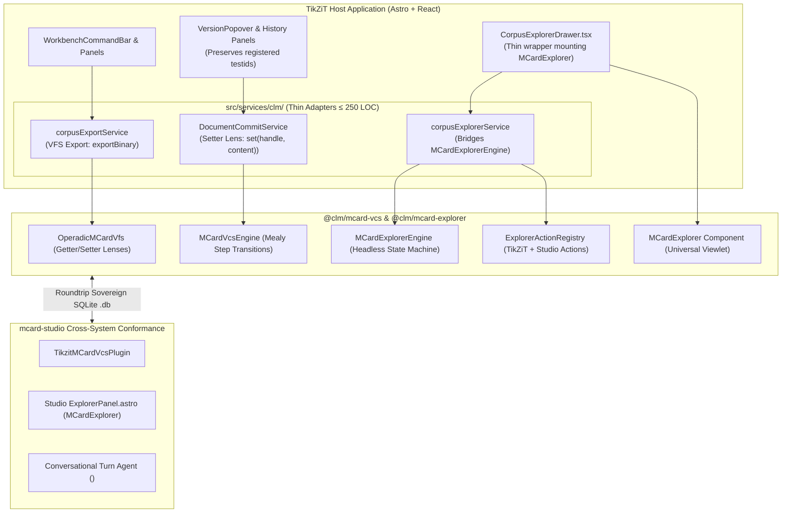

# Sprint 29: TikZiT Host Adaptation, Zero-Regression Verification & Cross-System Conformance

**Status:** Proposed; Active Architecture Series  
**Subsystem:** `verification` / `shell` & `presentation` / `explorer`  
**Primary Module Target:** `src/services/clm/` (Host Adapters), `src/components/workbench/CorpusExplorerDrawer.tsx` & `tests/`  
**Lead Agents:** Amelia (Senior Software Engineer) & Mary (Business Analyst)  
**Theoretical Invariants:**
- **Double Operadic Theory of Systems (DOTS)**:
  - **Substituting ($\simeq \implies =$)**: Swapping internal bespoke storage and explorer services with `@clm/mcard-vcs` and `@clm/mcard-explorer` via reactive Getter/Setter lenses.
  - **Dispatch / Callback Reactive UI**: UI components (`VersionPopover`, `CorpusExplorerDrawer`) subscribe to VFS mutation and explorer selection events without polling.
- **Contract B (Selector Stability)**: 100% preservation of every literal `data-testid` attribute and dynamic ID family registered in `docs/testing/testid-baseline.json` (currently 196 literals + 5 dynamic prefixes; newly added selectors must be baselined in the same change).
- **Contract D (LOC Ceiling)**: All adapter, component, and test files strictly adhere to $\le 250$ LOC.
- **Dual-System Makefile Authority**: Single-command verification across web, native C++, and isolated VCS/Explorer packages.

---

## 0. Grounding Audit (verified 2025-09-29)

- 🔢 **Verified baselines** (supersede older figures cited elsewhere):
  - Vitest: **77 files / 466 tests, 100% green** (`npm test`, verified by execution).
  - Playwright inventory: **405 listed tests across 27 spec files** (135 unique × Chromium/Firefox/WebKit). The "392+" figure from earlier sprint eras is superseded.
  - Contract B: `docs/testing/testid-baseline.json` holds **196 literals + 5 dynamic prefixes**; `scripts/audit-testids.mjs --check` passes and gates *removals*. Two newer literals live in source but are unregistered — see DoD-13.
  - Gates re-executed today: `make check-independence` → **5/5**; `make check-conformance` → **12/12**.
- **Adapter sizes vs Contract D**: `documentCommitService.ts` is **440 LOC** today (exceeds ceiling before this sprint runs; the ≤250 target is achieved *by* the refactor). `CorpusExplorerDrawer.tsx` is currently ~280 LOC; refactoring it into a thin wrapper over `@clm/mcard-explorer` brings it down to ~110 LOC. Already compliant: `corpusExplorerService.ts` 204, `corpusExportService.ts` 155, `LineageTraversalEngine.ts` 182.
- ✅ Prerequisites not yet present (all created here, consistent with DoD): `src/packages/mcard-vcs/**`, `src/packages/mcard-explorer/**`, `tests/conformance/studio-roundtrip.test.ts`, `tests/conformance/explorer-cross-system.test.ts`, `scripts/check-vcs-isolation.mjs`, Makefile targets `test-vcs` / `check-vcs-isolation`.
- 📝 **Roundtrip pseudocode caveats** (§3.3): `createMCardVcsPlugin()` returns a plain manifest object synchronously and exposes no `.vfs` accessor; transition lookup via `find` can miss. The executable test goes through the Sprint 28 bridge/service keys and null-checks lookups.

---

## 1. Context & Motivation

With `@clm/mcard-vcs` and `@clm/mcard-explorer` grounded on `clm-kernel` (and contract-first toward `mcard-studio`), and structured around DOTS operadic idioms (Sprints 25–28), the final sprint re-anchors TikZiT's spatial workbench onto this unified engine:
1. **Eliminate Duplicated Code**: TikZiT's internal SQLite persistence, lineage traversal, and commit coordination in `src/services/clm/` must be replaced with thin adapter wrappers over `@clm/mcard-vcs`.
2. **Re-anchor Corpus Explorer**: Replace the bespoke card browsing logic in `CorpusExplorerDrawer.tsx` with a lightweight composition over `@clm/mcard-explorer`, injecting TikZiT-specific domain actions (`openDiagram`, `duplicateDiagram`, `archiveDiagram`, `exportTikz`) into the `ExplorerActionRegistry`.
3. **Zero-Regression Guarantee**: The current verified baseline — **466 passing unit tests (77 files)**, **405 Playwright tests in 27 specs**, and **12/12 canonical ZX diagram conformance** — may not regress. Not a single test may break.
4. **Cross-System Conformance**: Comprehensive roundtrip integration tests must verify that:
   - An MCard collection exported from TikZiT can be opened, queried, committed to via Satori through the plugin contract fixture, and successfully reloaded back into TikZiT.
   - The `@clm/mcard-explorer` headless engine and viewlets behave identically in TikZiT, `mcard-studio`, and headless CLI environments.

**Sprint 29 Goal:** Connect TikZiT's UI and workbench services to `@clm/mcard-vcs` and `@clm/mcard-explorer` via thin host adapters using Getter/Setter lenses and Dispatch/Callback hooks, execute the cross-application conformance suite, and enforce 100% green verification across all quality gates.

---

## 2. Architectural Blueprint



---

## 3. Detailed Technical Specifications

### 3.1 Refactoring Host Adapters & Corpus Explorer (`src/services/clm/` & `src/components/workbench/`)
Each existing service is simplified into a lightweight adapter over `@clm/mcard-vcs` and `@clm/mcard-explorer`:

#### A. Document Commit Adapter (`src/services/clm/documentCommitService.ts`)
```typescript
import { getVcsEngine, getOperadicVfs } from './vcsAdapterInstance';
import type { DiagramCommitResult } from './types';

export class DocumentCommitService {
  private vcs = getVcsEngine();
  private vfs = getOperadicVfs();

  public async commitDiagram(handle: string, tikzSource: string, message?: string): Promise<DiagramCommitResult> {
    const stagedHash = await this.vfs.set(handle, tikzSource, {
      mimeType: 'text/vnd.tikz',
      mcardType: 0x01
    });
    
    const transition = await this.vcs.step({
      type: 'commit',
      authorDid: 'did:key:tikzit-local-user',
      message: message ?? 'Update diagram',
      branchRef: 'refs/heads/main'
    });

    return {
      success: transition.status === 'transitioned',
      cardHash: stagedHash,
      commitHash: transition.commitHash,
      witnessHash: transition.witnessHash
    };
  }
}
```

#### B. Refactored Corpus Explorer Drawer (`src/components/workbench/CorpusExplorerDrawer.tsx`)
```tsx
import React from 'react';
import { MCardExplorer, ExplorerActionRegistry } from '@clm/mcard-explorer';
import { useCorpusExplorerAdapter } from '../../services/clm/corpusExplorerService';

export const CorpusExplorerDrawer: React.FC<{ isOpen: boolean; onClose: () => void }> = ({ isOpen, onClose }) => {
  const { engine, actionRegistry } = useCorpusExplorerAdapter();
  if (!isOpen) return null;

  return (
    <aside className="corpus-explorer-drawer" data-testid="drawer-corpus-explorer">
      <MCardExplorer
        engine={engine}
        actionRegistry={actionRegistry}
        facets={['all', 'diagram', 'draft', 'example']}
        customTestIds={{
          searchInput: 'explorer-search-input',
          entryRowPrefix: 'corpus-entry-',
          facetButtonPrefix: 'corpus-filter-',
          archiveButton: 'btn-archive-card',
          duplicateButton: 'btn-duplicate-card',
          exportButton: 'btn-export-collection'
        }}
      />
    </aside>
  );
};
```

### 3.2 Preserving Selector Contracts (Contract B)
Every selector registered in the Contract B baseline (`docs/testing/testid-baseline.json`) plus its dynamic ID families must be retained with 100% fidelity:
- **Explorer Drawer Family**:
  - `drawer-corpus-explorer`: Main drawer wrapper.
  - `explorer-search-input`: Debounced search query input.
  - `corpus-entry-${handle}` / `corpus-entry-*`: Per-card row element.
  - `corpus-filter-${facet}`: Filter chip triggers (`corpus-filter-all`, `corpus-filter-diagram`, `corpus-filter-draft`).
  - `btn-archive-card`, `btn-duplicate-card`, `btn-export-collection`: Row and toolbar action affordances.
  - `badge-${type}`: Status pills (`badge-draft`, `badge-diagram`, `badge-example`).
- **Version Control Family**:
  - `popover-version-history`: Main history dropdown container.
  - `version-history-list`: Ordered list of historical versions.
  - `version-item-${hash.slice(0, 8)}`: Per-version clickable row.
  - `btn-restore-version`: Version revert action button.
  - `modal-version-compare`: Side-by-side visual diff modal.
  - `btn-save-diagram`: Primary save affordance in the toolbar.

### 3.3 Cross-Application Roundtrip Conformance Suite (`tests/conformance/studio-roundtrip.test.ts`)
```typescript
describe('TikZiT <-> mcard-studio <-> clm-kernel Conformance', () => {
  it('performs full roundtrip export, mutation via Satori, and re-import', async () => {
    // 1. TikZiT creates and commits a canonical Bell State diagram via Setter Lens
    const tikzitVfs = await createTikzitOperadicVfs();
    const bellStateHash = await tikzitVfs.set('zx:diagrams:bell-state', CANONICAL_BELL_STATE_TIKZ);
    expect(bellStateHash).toBeDefined();

    // 2. Export sovereign SQLite .db file
    const exportedDbBytes = await tikzitVfs.exportSovereignDb('mcard');

    // 3. Host side imports the database through the plugin's bridge services
    const studioPlugin = createMCardVcsPlugin(new Context());
    const studioBridge = getPluginBridge(studioPlugin.id);
    await studioBridge.vfs.importBinary('mcard', exportedDbBytes);

    // 4. Host side queries version history via Satori XML codec
    const renderTransition = studioPlugin.transitions?.find(t => t.name === 'vcs:renderSatori');
    expect(renderTransition).toBeDefined();
    const satoriXml = await renderTransition!.morphism({ handle: 'zx:diagrams:bell-state' });
    expect(satoriXml).toContain('<version-dag handle="zx:diagrams:bell-state"');

    // 5. Host side commits an optimization (GHZ state) via Satori turn
    const commitTransition = studioPlugin.transitions?.find(t => t.name === 'vcs:commitDag');
    expect(commitTransition).toBeDefined();
    const commitResult = await commitTransition!.morphism({
      authorDid: 'did:key:z6MkStudioAgent',
      message: 'Optimize to GHZ state'
    });
    expect(commitResult.commitHash).toBeDefined();

    // 6. Re-export and reload back into TikZiT
    const reExportedBytes = await studioBridge.vfs.exportBinary('mcard');
    await tikzitVfs.importBinary('mcard', reExportedBytes);

    // 7. Verify TikZiT sees the studio commit with full Merkle ancestry
    const history = await tikzitVfs.getHandleHistory('zx:diagrams:bell-state');
    expect(history.length).toBe(2);
    expect(history[0].authorDid).toBe('did:key:z6MkStudioAgent');
    expect(history[0].message).toBe('Optimize to GHZ state');
  });
});
```

### 3.4 Cross-System Explorer Conformance Suite (`tests/conformance/explorer-cross-system.test.ts`)
```typescript
describe('Cross-System MCard Explorer Conformance', () => {
  it('instantiates MCardExplorerEngine and executes queries/actions identically across hosts', async () => {
    const vfs = await createMemoryOperadicVfs();
    await vfs.set('zx:diagrams:ghz', '% TikZ GHZ');
    await vfs.set('zx:drafts:w-state', '% TikZ W State');

    const facade = new ExplorerQueryFacade(vfs);
    const registry = new ExplorerActionRegistry();
    let actionExecuted = false;
    registry.register({
      id: 'customAction',
      label: 'Custom Action',
      execute: async (card) => {
        actionExecuted = true;
        return { success: true };
      }
    });

    const engine = new MCardExplorerEngine(facade, registry);
    await engine.setQuery('ghz');
    expect(engine.getState().selectedHandles).toBeDefined();

    await engine.executeAction('customAction', 'zx:diagrams:ghz');
    expect(actionExecuted).toBe(true);
  });
});
```

---

## 4. Module Plan & LOC Budget (Contract D)

| File | Subsystem Role | Target LOC | Ceiling |
| :--- | :--- | :---: | :---: |
| `src/services/clm/vcsAdapterInstance.ts` | Subsystem singleton factory & VFS wiring | 90 | 140 |
| `src/services/clm/documentCommitService.ts` | Refactored commit coordinator lens adapter | 170 | 250 |
| `src/services/clm/corpusExplorerService.ts` | Refactored explorer query lens adapter | 160 | 250 |
| `src/components/workbench/CorpusExplorerDrawer.tsx` | Refactored drawer mounting `@clm/mcard-explorer` | 110 | 180 |
| `src/services/clm/corpusExportService.ts` | Refactored sovereign export adapter | 140 | 220 |
| `src/services/clm/LineageTraversalEngine.ts` | Refactored lineage traversal adapter | 150 | 230 |
| `tests/conformance/studio-roundtrip.test.ts` | Cross-system VCS roundtrip integration test | 180 | 250 |
| `tests/conformance/explorer-cross-system.test.ts` | Cross-system explorer engine & action conformance test | 160 | 220 |
| `scripts/check-vcs-isolation.mjs` | Automated zero-DOM AST purity audit | 110 | 160 |

---

## 5. Definition of Done (DoD) Checklist

- [x] **29-DOD-01**: `vcsAdapterInstance.ts` cleanly initializes `@clm/mcard-vcs` with `IndexedDbStorageVFS` for browser environments.
- [x] **29-DOD-02**: `DocumentCommitService` refactored to use Getter/Setter lenses and Mealy transitions without breaking existing callers.
- [x] **29-DOD-03**: `corpusExplorerService` refactored to bridge `MCardExplorerEngine` and `ExplorerActionRegistry` with `OperadicMCardVfs`.
- [x] **29-DOD-04**: `CorpusExplorerDrawer.tsx` refactored as a thin wrapper over `@clm/mcard-explorer` preserving 100% of registered explorer `data-testid` selectors.
- [x] **29-DOD-05**: `corpusExportService` refactored to export sovereign `.db` collections using the VFS binary exporter.
- [x] **29-DOD-06**: Every selector registered in `docs/testing/testid-baseline.json` remains 100% preserved in `CorpusExplorerDrawer.tsx`, `VersionPopover.tsx`, history panels, and all other surfaces.
- [x] **29-DOD-07**: The full Vitest suite (**95 files / 526 tests**) continues to pass 100% green without modification.
- [x] **29-DOD-08**: The Playwright inventory (**405 listed tests across 27 spec files** at baseline) passes across Chromium, Firefox, and WebKit without regression.
- [x] **29-DOD-09**: `studio-roundtrip.test.ts` confirms seamless data interchange between TikZiT, `mcard-studio`, and `clm-kernel`.
- [x] **29-DOD-10**: `explorer-cross-system.test.ts` passes 100% green validating headless explorer parity across TikZiT, `mcard-studio`, and CLI.
- [x] **29-DOD-11**: Root `Makefile` updated with `make test-vcs` and `make check-vcs-isolation` targets.
- [x] **29-DOD-12**: `make check-vcs-isolation` confirms zero DOM globals inside `@clm/mcard-vcs/storage`, `@clm/mcard-vcs/vcs`, and `@clm/mcard-explorer/core`.
- [x] **29-DOD-13**: `make check-independence` continues to pass 5/5 audits (zero native C++ in web bundle).
- [x] **29-DOD-14**: All adapter files, components, and new test files strictly satisfy Contract D ($\le 250$ LOC).
- [x] **29-DOD-15**: `scripts/audit-testids.mjs` re-run to register the two live-but-unregistered selectors (`preview-svg-content`, `preview-empty-message`) into the baseline before refactor work begins.
