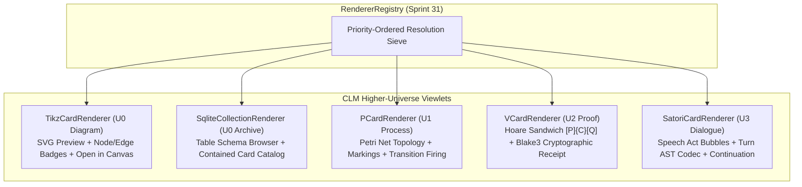

# Sprint 32: Higher-Universe Card Renderers: TikZ, PCard, VCard, Satori & SQLite

**Sprint ID:** `SPRINT-32`  
**Subsystem Category:** `interactions`  
**Target:** `@clm/mcard-explorer/renderers/clm`  
**Dependencies:** Sprint 30 (`CardTypeJudgeService`, `UniverseLevel`), Sprint 31 (`RendererRegistry`, `BaseCardRendererProps`)  
**Target LOC:** $\le 250$ LOC per file (Contract D)  
**Ontological Grounding:** Stratified Universe Levels $U_0 \to U_3$ in CLM Layer 5  

---

## 1. Context & Motivation
Under the CLM axiom *"All things are MCards"*, a diagramming workbench cannot treat diagrams as a privileged silo while ignoring the rest of the ontological universe.

A researcher working on quantum processes or category theory creates:
- **TikZ / ZX Diagrams** ($U_0$): Spatial string diagrams and syntax graphs.
- **Sovereign `.db` Collections** ($U_0$): Content-addressed SQLite archives bundling related cards and lineages.
- **PCards** ($U_1$): Colored Petri Net processes that model linear dynamic state transitions.
- **VCards** ($U_2$): Cryptographic proof witnesses and Hoare sandwich receipts $[P]\{C\}[Q]$.
- **Satori Speech Acts** ($U_3$): Dialogue turns and multi-agent interaction logs.

Sprint 32 implements domain-specific viewlets for these higher-universe cards inside `@clm/mcard-explorer/renderers/clm/`, registering them with `RendererRegistry` so that `MCard Explorer` seamlessly displays any card across the full spectrum of CLM universe levels.

---

## 2. Deliverables & Technical Architecture



### 2.0 Self-Registration Pattern (Gap 10)
Each CLM viewlet module exports a `descriptor` constant and a `register(registry: RendererRegistry)` function. Host applications call **only** the registrations they need — no central `registerAllClmViewlets()` that forces importing all 5 modules (tree-shaking friendly, true plug-in pattern):
```typescript
// In each viewlet module (e.g. TikzCardRenderer.tsx):
export const tikzDescriptor: RendererDescriptor = { id: 'tikz', priority: 300, matches: ..., component: ..., toHypermediaNode: ... };
export function register(registry: RendererRegistry): void { registry.register(tikzDescriptor); }
```

Each descriptor also implements `toHypermediaNode()` (Gap 1) for headless rendering — producing a kernel `HypermediaNode` tree that `hypermediaToAnsi()` / `hypermediaToHtml()` can consume without React.

### 2.1 $U_0$ Specialized Viewlets

1. **`TikzCardRenderer.tsx` ($\le 180$ LOC)** — `viewport: 'zoom'`:
   - Priority: `300` (Matches **`text/x-tikz`** — canonical kernel dictionary mime per ADR D43 — plus `application/vnd.zx-graph+json`; studio parity reference: `TikzDiagramViewlet`).
   - SVG Preview: Uses TikZiT's lightweight SVG generation pipeline to render the diagram.
   - Metadata Badges: Displays node count, edge count, style references, and file size.
   - Host Action: "Open in Canvas" button (`data-testid="btn-open-in-canvas"`) dispatches `onAction('openInCanvas', { handle })` to activate the Three.js spatial editor.
   - **Export Actions (D45)**: descriptor `actions` surfaced in the viewer toolbar — `export.png` (payload `{format:'png', pngScale:1|2|4}`), `export.pdf`, `export.svg`, `export.tikz`, `export.tex` — each emitted via `onAction(id, {handle, ...payload})` and bridged by the Sprint-34 host adapter to `diagramExportCoordinator.exportDiagramArtifact(...)` (Sprint 18 pipeline; no duplicated export logic). Toolbar buttons follow the Sprint-33 sanitized testid convention: `data-testid="btn-viewer-action-export-${format}"` (`export.png` → `btn-viewer-action-export-png`).
2. **`SqliteCollectionRenderer.tsx` ($\le 210$ LOC)** — `viewport: 'paged'`:
   - Priority: `350` (Matches **`application/x-sqlite3`** — canonical dict mime — and `.db`/`.sqlite`/`.sqlite3` extension hints).
   - Header Inspector: Displays SQLite version, user_version, page count, and page size.
   - Table Browser: Shows table schemas (`CREATE TABLE ...`) and record counts — inspects canonical `card`, `handle_registry`, `handle_history` (v3.0.3) when present.
   - Card Catalog: Enumerates contained MCard handles stored in the sovereign database (kernel `parsePortableSqlite` for portable-format collections).
   - Host Action: "Import Collection" button (`data-testid="btn-import-sqlite-collection"`).

### 2.2 Higher-Universe Viewlets ($U_1 \to U_3$)

1. **`PCardRenderer.tsx` ($\le 210$ LOC)** — `viewport: 'fit'`:
   - Priority: `400` (Matches **`application/vnd.pcard+json`** — canonical dict mime — or `clmCategory 'process'`; studio parity: `ClmPcardViewlet`).
   - Universe: `UniverseLevel.U1_Pcard` ($U_1$).
   - Topology Visualization: Displays kernel `PlaceDef`/`TransitionDef`/`ArcDef` structures ($P$, $T$, $F$).
   - Marking State: Highlights places holding tokens ($M(p) > 0$) via kernel `MarkingMap`/`getMarking` shapes.
   - Interactive Stepper: "Fire Transition" CTA (`data-testid="btn-fire-transition"`) delegates to kernel `fireTransition`/`isTransitionEnabled` where available — no bespoke Petri engine.
2. **`VCardRenderer.tsx` ($\le 210$ LOC)** — `viewport: 'scroll'`:
   - Priority: `450` (Matches **`application/vnd.vcard+json`** — canonical dict mime — or `clmCategory 'proof'`; studio parity: `WitnessVcardViewlet`).
   - Universe: $U_2$ **via the D43 lattice override** — the kernel dictionary lists this mime at `U1`; the displayed badge reads the judgment's `universe`/`universeName`, never a hardcoded level.
   - Hoare Sandwich $[P]\{C\}[Q]$: Displays formatted Precondition $P$, Program $C$, and Postcondition $Q$ (kernel `VCardResult`/`VCardSandwich` field names).
   - Cryptographic Receipt: Blake3 content hash, author DID signature, and verification status pill (`data-testid="vcard-receipt-badge"`).
   - Proof Tree: Collapsible verification witness steps.
3. **`SatoriCardRenderer.tsx` ($\le 200$ LOC)** — `viewport: 'scroll'`:
   - Priority: `500` (Matches `application/vnd.satori.turn+xml` — Sprint-30 delta registration — or `clmCategory 'conversation'`; studio parity: `SatoriTagRenderers.tsx` message rendering).
   - Universe: `UniverseLevel.U3_Satori` ($U_3$).
   - Turn Stream: Parses payload through kernel `parseSatoriXml`/`SatoriElement` and formats speech acts (`<card>`, `<execute>`, `<turn>`, `<propose>`) into sleek chat bubbles with speaker avatars and timestamps.
   - Embedded Card Projection: Renders nested card links as interactive preview buttons (`data-testid="satori-turn-bubble"`).
   - Continuation Affordance: Text area for appending agent turn responses (wired through `onAction`, no direct kernel coupling).

---

## 3. Definition of Done (DoD) Criteria

- [ ] **32-DOD-01**: `TikzCardRenderer.tsx` is implemented ($\le 180$ LOC) matching `text/x-tikz` + `application/vnd.zx-graph+json` with `viewport: 'zoom'`, providing SVG preview, node/edge counts, "Open in Canvas" button (`data-testid="btn-open-in-canvas"`), and export action declarations (`export.png`/`export.pdf`/`export.svg`/`export.tikz`/`export.tex` via `onAction`, surfaced as `btn-viewer-action-export-*`).
- [ ] **32-DOD-02**: `SqliteCollectionRenderer.tsx` is implemented ($\le 210$ LOC) matching `application/x-sqlite3`, displaying SQLite metadata, canonical v3.0.3 table schemas, and contained card handles (`data-testid="renderer-sqlite"`).
- [ ] **32-DOD-03**: `PCardRenderer.tsx` is implemented ($\le 210$ LOC) matching `application/vnd.pcard+json`, displaying Petri net topology, marking tokens, and transition firing controls (`data-testid="renderer-pcard"`).
- [ ] **32-DOD-04**: `VCardRenderer.tsx` is implemented ($\le 210$ LOC) matching `application/vnd.vcard+json` with $U_2$ badge via D43 override, rendering Hoare sandwich $[P]\{C\}[Q]$, Blake3 cryptographic receipt, and verification badge (`data-testid="renderer-vcard"`).
- [ ] **32-DOD-05**: `SatoriCardRenderer.tsx` is implemented ($\le 200$ LOC) parsing via kernel `parseSatoriXml`, rendering speech acts as chat dialogue bubbles (`data-testid="renderer-satori"`).
- [ ] **32-DOD-06**: All 5 CLM viewlets export a `descriptor` constant and a `register(registry)` function (self-registration pattern, Gap 10). Each is registered with priorities $300$–$500$ and studio-parity `supportedTabs`/`supportedMimes` populated for the `toCardViewletDefinition()` adapter, preempting generic polyglot fallbacks.
- [ ] **32-DOD-07**: All 5 CLM viewlets implement `toHypermediaNode()` producing kernel `HypermediaNode` trees; `hypermediaToAnsi(node)` produces valid ANSI output for each (headless conformance, Gap 1).
- [ ] **32-DOD-08**: `tests/unit/mcard-explorer/renderers/clmViewlets.test.tsx` passes with 100% green assertions across all 5 specialized card types **using canonical dictionary mimes** (D43), including `toHypermediaNode()` output verification.
- [ ] **32-DOD-09**: Contract D LOC ceiling ($\le 250$ LOC per file) is strictly maintained across all authored modules.
- [ ] **32-DOD-10**: Contract E isolation check passes: headless registry logic contains zero DOM references; viewlets consume kernel layer-1/3 types via `import type` only.
- [ ] **32-DOD-11**: Existing 505 tests in the TikZiT test suite pass with zero regressions (kickoff-recorded baseline).
- [ ] **32-DOD-12**: Export actions emit correct payloads — clicking `btn-viewer-action-export-pdf` on a `.tikz` card produces `onAction('export.pdf', {handle, format:'pdf'})`; all 5 CLM viewlets declare D44 `viewport` modes; fixtures exercised from `tests/fixtures/multimodal-media/`.
