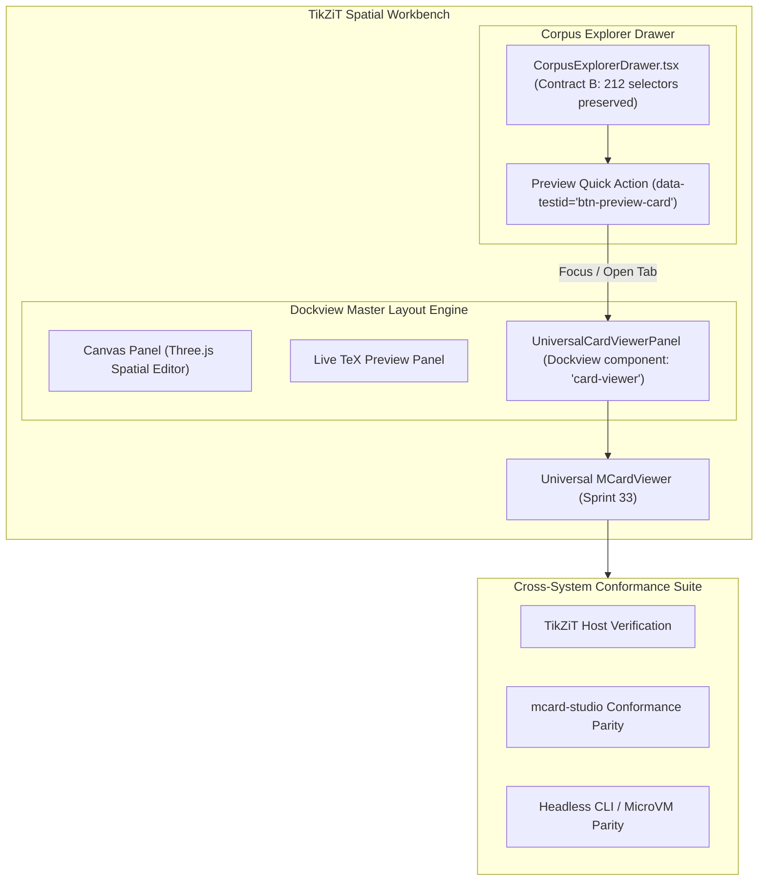

# Sprint 34: TikZiT Dockview Integration, Cross-System Conformance & Verification Matrix

**Sprint ID:** `SPRINT-34`  
**Subsystem Category:** `verification`  
**Target:** TikZiT Workbench Dockview Integration, Cross-System Conformance & Master Verification Gates  
**Dependencies:** Sprints 30–33, TikZiT Workbench Runtime (`createWorkbenchRuntime.ts`, `CorpusExplorerDrawer.tsx`, `DockviewHost.tsx`)  
**Target LOC:** $\le 250$ LOC per file (Contract D)  
**Verification Gates:** Contract B (212 Selectors), Contract D (LOC Ceiling), Contract E (Zero-DOM), Vitest Conformance Suite (100% Green)  

---

## 1. Context & Motivation
Sprints 30 through 33 constructed a complete, universe-stratified type judgment and multimodal rendering engine (`@clm/mcard-vcs/type`, `@clm/mcard-explorer/renderers`, `MCardViewer`).

Sprint 34 brings this engine into the primary TikZiT host environment:
1. **Dockview Workbench Integration**: Registers `UniversalCardViewerPanel` as a first-class Dockview panel component, allowing researchers to dock card previews alongside the spatial canvas, live TeX preview, or style inspector.
2. **Drawer Affordance**: Connects `CorpusExplorerDrawer.tsx` to `UniversalCardViewerPanel` via a non-intrusive "Preview Card" affordance while preserving 100% of existing Contract B selectors.
3. **Cross-System Conformance Suite**: Validates that type judgment and renderer resolution behave identically across TikZiT, `mcard-studio`, and headless CLI environments.
4. **Master Verification Matrix**: Executes all verification gates to ensure zero regressions across the codebase.

---

## 2. Deliverables & Technical Architecture



### 2.1 Dockview Universal Card Viewer Panel (`src/components/workbench/dockview/UniversalCardViewerPanel.tsx`)
Authored to satisfy Contract D ($\le 180$ LOC):
- Registers with the Dockview panel registry under component ID `'card-viewer'` and container `data-testid="dockview-card-viewer-panel"`.
- Subscribes to runtime store or active handle selection.
- Embeds `MCardViewer`, passing host action handlers (`openInCanvas`, `exportDiagram`, `duplicateCard`).

### 2.1a Host Action Bridge — Export While Viewing (`src/services/clm/viewerActionBridge.ts`, $\le 120$ LOC)
The single seam mapping descriptor action ids to host services; registered once by the workbench runtime and injected into `MCardViewer.onAction`:
- `export.tikz` / `export.tex` / `export.svg` / `export.png` / `export.pdf` → resolves the handle's current card content (via `CardContentProvider`) and calls **`diagramExportCoordinator.exportDiagramArtifact({format, pngScale, source})`** — the graduated Sprint-18 pipeline (`ImageExporter.generateSvgBlob`/`generatePngBlob`, `PdfExporter.generatePdfBlob`, `saveArtifact`) with file-picker save semantics; PNG scale comes from the action payload (`pngScale: 1|2|4`, default 2).
- `openInCanvas` → opens the diagram document on the Three.js canvas (existing document-open path).
- `importCollection` → routes to the corpus import path.
- Unmatched ids log a dev-mode warning and no-op — never throw inside the viewer.
Non-TikZ cards: export ids not declared by the descriptor are absent; `download`/`copy` operate on raw bytes directly (no coordinator call).

**Action Registry Unification (Gap 11):** `viewerActionBridge.ts` does NOT bypass `ExplorerActionRegistry` from Sprint 25. Instead, it **registers** each host-specific handler via `ExplorerActionRegistry.register()`. `MCardViewer.onAction` dispatches through the registry, ensuring a single action dispatch path for the entire system. The bridge function signature becomes:
```typescript
export function registerViewerActions(
  actionRegistry: ExplorerActionRegistry,
  exportCoordinator: DiagramExportCoordinator,
  contentProvider: CardContentProvider
): () => void; // returns disposer
```

### 2.2 Host Re-anchoring in `CorpusExplorerDrawer.tsx`
- Adds a "Preview" action to `ExplorerSectionList` / `ExplorerEntryRow` menu (`data-testid="btn-preview-card"`).
- Clicking "Preview" activates the `UniversalCardViewerPanel` in Dockview without altering existing diagram opening workflows.
- Strictly preserves all 212 Contract B literal selectors (`drawer-corpus-explorer`, `live-announcer`, `recovery-banner`, `stale-reload-banner`, `empty-diagrams-card`, etc.).

### 2.3 Cross-System Conformance Suite (`tests/conformance/multimodal-card-conformance.test.ts`)
Validates cross-platform determinism across **10 conformance checks** using canonical kernel-dictionary mimes (D43):
1. **TikZ Diagram**: `zx:diagrams:ghz` $\to$ MIME `text/x-tikz`, Universe `'U0'`/`U0_Mcard`, `clmCategory 'diagram'` $\to$ Resolves to `TikzCardRenderer`.
2. **Markdown Research Note**: `docs:notes:quant-foundations` $\to$ MIME `text/markdown`, Universe `'U0'`, Category `'text'` $\to$ Resolves to `MarkdownCardRenderer`.
3. **PCard Petri Net**: `proc:workflow:entanglement-swap` $\to$ MIME `application/vnd.pcard+json`, Universe `'U1'`, `clmCategory 'process'` $\to$ Resolves to `PCardRenderer`.
4. **VCard Proof Witness**: `proof:bell-inequality:receipt` $\to$ MIME `application/vnd.vcard+json`, Universe `'U2'` via D43 lattice override, `clmCategory 'proof'` $\to$ Resolves to `VCardRenderer`.
5. **SQLite Sovereign Database**: `archive:collection:zx-corpus` $\to$ MIME `application/x-sqlite3`, Universe `'U0'`, `clmCategory 'collection'` $\to$ Resolves to `SqliteCollectionRenderer`.
6. **Satori Turn**: `satori:turn:merge-negotiation` $\to$ MIME `application/vnd.satori.turn+xml`, Universe `'U3'` $\to$ Resolves to `SatoriCardRenderer`.
7. **Explorer Port Parity (D42)**: a stub `ExplorerDataSource` implemented against the **port interface only** (simulating `mcard-studio`'s `studioMCardFs`) proves `MCardExplorerEngine` + `MCardViewer` run with zero `mcard-vcs` presence; `toCardViewletDefinition()` output is asserted field-for-field against `mcard-studio`'s `CardViewletDefinition` contract.
8. **Media Viewport Matrix (D44)**: for each `tests/fixtures/multimodal-media/` fixture, assert the resolved descriptor's `viewport` mode — `zoom` (PNG, TikZ), `fit` (SVG, PCard), `paged` (PDF, CSV, SQLite), `split` (Markdown, YAML), `scroll` (text, hex, VCard, Satori) — and that `MCardViewer` applies the matching `data-viewport-mode` container attribute + chrome on selection change.
9. **In-Viewer Export Bridge (D45)**: given a `.tikz` fixture card, clicking each `btn-viewer-action-export-${format}` produces exactly `onAction('export.<fmt>', {handle, format, pngScale?})`; the action is dispatched **through `ExplorerActionRegistry`** and the registered bridge handler calls `exportDiagramArtifact` with the mapped options (spied, no real file write in unit tests).
10. **Headless Rendering Conformance (Gap 13)**: for each fixture, invoke `descriptor.toHypermediaNode(content, text, judgment)` and verify `hypermediaToAnsi(node)` produces valid, non-empty ANSI output. Proves the system renders **without React** across all content types.

Parity check ensures identical classification in both Node.js headless environment and browser runtime.

---

## 3. Definition of Done (DoD) Criteria

- [ ] **34-DOD-01**: `src/components/workbench/dockview/UniversalCardViewerPanel.tsx` is implemented ($\le 180$ LOC) and registered with Dockview (`data-testid="dockview-card-viewer-panel"`).
- [ ] **34-DOD-02**: `CorpusExplorerDrawer.tsx` connects to `UniversalCardViewerPanel` via "Preview" action (`data-testid="btn-preview-card"`).
- [ ] **34-DOD-03**: Contract B audit verifies 100% preservation of all 212 literal `data-testid` selectors and 12 dynamic prefix families via `node scripts/audit-testids.mjs --check`.
- [ ] **34-DOD-04**: Contract D LOC audit confirms all newly authored and refactored files satisfy $\le 250$ LOC ceiling.
- [ ] **34-DOD-05**: Contract E zero-DOM isolation check passes across the extended `TARGET_DIRECTORIES`: `mcard-vcs/{storage,vcs,explorer,cordis,satori,type}` + `mcard-explorer/{core,renderers/registry}` — 0 DOM globals; additionally `mcard-explorer` proves zero `mcard-vcs` imports (D42 package-separation gate).
- [ ] **34-DOD-06**: `tests/conformance/multimodal-card-conformance.test.ts` passes with 100% green assertions across all 10 cross-system conformance checks (incl. D42 port parity, D44 viewport matrix, D45 export-bridge payload assertions, Gap-13 headless rendering).
- [ ] **34-DOD-07**: Complete Vitest test matrix passes with $\ge 540$ passing tests (100% green) and 0 regressions.
- [ ] **34-DOD-08**: Multi-universe card preview verified visually in both dark and light theme modes without layout shifts.
- [ ] **34-DOD-09**: Browser runtime independence verified (`make check-independence`) with zero native Node.js leaks into client bundles.
- [ ] **34-DOD-10**: Sprint series documentation updated and ready for master graduation.
- [ ] **34-DOD-11**: `viewerActionBridge.ts` registers all five export formats **through `ExplorerActionRegistry.register()`** (Gap 11, unified action dispatch); manual QA via `npm run seed:media` confirms export-while-viewing produces valid PNG/PDF/SVG/TikZ/TeX artifacts with save-picker semantics.
- [ ] **34-DOD-12**: Headless rendering conformance (Gap 13): `tests/conformance/headless-rendering.test.ts` invokes `toHypermediaNode()` → `hypermediaToAnsi()` for every fixture type and asserts non-empty, valid ANSI output — proving the full viewlet suite renders without React.
