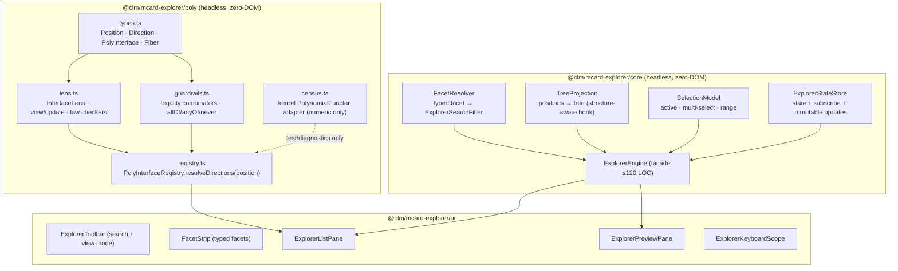

# Sprint 36: Polynomial Interface Core & Affordance Algebra

**Sprint ID:** `SPRINT-36`
**Subsystem Category:** `interactions`
**Target:** `@clm/mcard-explorer/poly` & `@clm/mcard-explorer/core` decomposition
**Dependencies:** Sprints 30–35 (graduated), `clm-kernel` root exports (`TypeJudgment`, `UNIVERSE_NAMES`, `PolynomialFunctor` for numeric censuses only), `ExplorerDataSource` / `CardContentProvider` ports (ADR D42)
**Target LOC:** ≤ 250 LOC per file (Contract D) · **≤ 150 LOC concern target** (ADR D53/D54)
**Zero-DOM Gate:** Contract E — `poly/` and `core/` are 100% headless
**Kernel Stratum:** `@layer L4` (interface/membrane) consuming **L5** (`TypeJudgment`, `UNIVERSE_NAMES` — root export only) and **L2** filter vocabulary; no L0/L1 logic
**Host Boundary:** kenotic (ADR D55) — no `cordis`, `cordisClient`, or host-store imports in either package
**Contract B Gate:** 295 literal `data-testid` selectors + 17 dynamic prefix families preserved; new selectors registered deliberately
**Status:** 📋 Drafted / Ready

---

## 1. Context & Motivation

The explorer currently has **no notion of an affordance**. Actions are registered globally and filtered by a card-shaped predicate (`ExplorerActionRegistry.isAvailable?(card)`, `ExplorerActionRegistry.ts:31`), and the host list hardcodes five menu items behind a single `type !== 'draft'` test (`ExplorerEntryRow.tsx:131-151`). Neither can express the central property of a polynomial interface: **the set of available inputs depends on the current position**.

Three further defects are structural, and all three are fixed in this sprint:

1. **Facets are substring matches.** `MCardExplorerEngine.refresh()` sends only `{ pattern, limit }` to the data source and then filters with `item.handle.toLowerCase().includes(facet)` (`MCardExplorerEngine.ts:117`) — even though `ExplorerQueryFacade.search()` already emits SQL `WHERE` clauses for `universe`, `category`, and `payloadKind` (`ExplorerQueryFacade.ts:59-69`) and `ExplorerSearchFilter` documents them as SQL-level. The capability exists; the engine does not use it.
2. **The engine is seven concerns in 193 LOC** — query, facet, tree construction, selection, sorting, view mode, action routing — with `buildTree` (`:134`) splitting handles on `:` and `sortItems` mutating shared arrays in place (`:127`).
3. **`MCardExplorer.tsx` is six concerns in 193 LOC** — search, facet strip, tree/flat toggle, keyboard scope, dual-pane layout, preview toggle.

This sprint establishes the algebra and pays down the decomposition debt so that Sprints 37–39 have somewhere coherent to live.

---

## 2. Deliverables & Technical Architecture



*Diagram: the polynomial core, the decomposed engine, and the UI surfaces that consume only resolved directions.*

### 2.1 `poly/types.ts` — the interface polynomial (≤ 140 LOC)

```typescript
import type { TypeJudgment } from 'clm-kernel'; // root export only (ADR D43/D46)

/** A position is a *card-shaped* state: what the interface currently shows. */
export interface Position {
  /** Stable identity of this position within the interface (e.g. `list:zx:diagrams:ghz`). */
  readonly id: string;
  /** The card this position presents — MCard is the unit of manipulation (ADR D48). */
  readonly handle: string;
  readonly hash: string;
  readonly mimeType: string;
  /** Kernel judgment fields, passed through verbatim (never re-derived here). */
  readonly universe?: string;        // 'U0'..'U5'
  readonly universeName?: string;
  readonly category?: string;
  readonly clmCategory?: string;
  readonly payloadKind?: string;
  /** View context: which surface is showing this position. */
  readonly surface: 'tree' | 'list' | 'grid' | 'composition' | 'zoom' | 'timeline';
  /** Nesting context (Sprint 38 zoom path; empty at root). */
  readonly zoomPath?: readonly string[];
  /** Selection context. */
  readonly selected?: boolean;
  readonly active?: boolean;
  /** Arbitrary projection metadata supplied by the surface (never required by the algebra). */
  readonly meta?: Readonly<Record<string, unknown>>;
}

/** A direction is one *legal input* at a position. */
export interface Direction<P extends Position = Position> {
  readonly id: string;                 // 'card.rename' | 'card.compose.tensor' | 'zoom.enter' | …
  readonly label: string;
  readonly icon?: string;
  readonly shortcut?: string;
  /** Grouping hint for menus (`'mutate' | 'compose' | 'export' | 'navigate' | …`). */
  readonly group?: string;
  /** Legality is a *predicate on the position*, not a validation callback (ADR D47). */
  readonly legality: (position: P) => boolean;
  /** Effects run only after legality has been resolved; the host supplies the implementation. */
  readonly execute: (position: P, payload?: unknown) => Promise<DirectionResult>;
  /** Directions may declare their own dependent sub-directions (nested menus / ports). */
  readonly sub?: (position: P) => readonly Direction<P>[];
}

export interface DirectionResult {
  readonly success: boolean;
  readonly message?: string;
  /** Card-level outcome: MCard is the unit of manipulation (ADR D48). */
  readonly producedHandle?: string;
  readonly producedHash?: string;
  /** Revertible-effect token (Sprint 39); opaque here. */
  readonly inverse?: () => Promise<void>;
}

/** A polynomial interface: positions + the direction fiber over each position. */
export interface PolyInterface<P extends Position = Position> {
  readonly id: string;
  /** Forward map: state → position (the lens *getter*). */
  readonly positions: (state: unknown) => readonly P[];
  /** Backward map: legal directions at a position (the *fiber* p[position]). */
  readonly directions: (position: P) => readonly Direction<P>[];
}
```

**Design notes.**
- `Position` carries kernel judgment fields **by reference** (`TypeJudgment` values), never recomputed — `TypeInterpreter` remains the SSOT (ADR D43).
- `Direction.legality` is a pure predicate so guardrails are testable in isolation and the UI can render from a resolved fiber without branching logic.
- `DirectionResult.inverse` is the seam Sprint 39 fills with the revertible-effect journal; it is optional here so Sprint 36 ships independently.

### 2.2 `poly/guardrails.ts` — legality combinators (≤ 100 LOC)

Small, composable predicates so views never write ad-hoc conditions:

```typescript
export const allOf = <P extends Position>(...ps: Array<(x: P) => boolean>) => (x: P) => ps.every(p => p(x));
export const anyOf = <P extends Position>(...ps: Array<(x: P) => boolean>) => (x: P) => ps.some(p => p(x));
export const never  = <P extends Position>() => (_x: P) => false;

export const isUniverse   = (...u: string[]) => (p: Position) => !!p.universe && u.includes(p.universe);
export const isCategory   = (...c: string[]) => (p: Position) => !!p.clmCategory && c.includes(p.clmCategory);
export const isSurface    = (...s: Position['surface'][]) => (p: Position) => s.includes(p.surface);
export const isMutable    = (p: Position) => p.meta?.mutable === true;      // drafts & user cards
export const isImmutable  = (p: Position) => p.meta?.mutable === false;     // examples, artifacts
export const isHead       = (p: Position) => p.meta?.isHead !== false;      // has version history
export const hasExporter  = (p: Position) => p.meta?.exportFormats instanceof Array
                                          && (p.meta.exportFormats as string[]).length > 0;
```

**Guardrail contract (ADR D47):** a direction whose `legality(position)` is false is **absent** from `resolveDirections()` output. Views must render exactly what is resolved — no `disabled` buttons standing in for legality, and no hardcoded action lists. "Absent, not disabled" is the Semagrams property: an illegal act must have no DOM affordance at all.

### 2.3 `poly/registry.ts` — the resolver (≤ 130 LOC)

```typescript
export class PolyInterfaceRegistry {
  private directions = new Map<string, Direction>();

  /** Register a direction; returns a disposer (kernel DisposableList-compatible). */
  register(direction: Direction): () => void;

  /** The direction fiber p[position]: all *legal* directions, ordered by group then id. */
  resolveDirections(position: Position): readonly Direction[];

  /** Enumerate registered directions (agent/CLI introspection; conformance iteration). */
  listAll(): readonly Direction[];

  /** Resolve one direction by id, returning undefined when illegal at this position. */
  resolve(id: string, position: Position): Direction | undefined;
}
```

Resolution is deterministic: filter by `legality`, expand `sub(position)` recursively, sort by `(group, id)`. A throw inside any `legality` predicate is caught, logged in dev mode, and treated as **illegal** (fail-closed) — a broken predicate must never grant a direction.

### 2.4 `poly/census.ts` — numeric-polynomial adapter (≤ 80 LOC)

The kernel's `PolynomialFunctor` is numeric arithmetic (ADR D46). It is used **only** for cardinality/degree assertions over a resolved fiber:

```typescript
import { PolynomialFunctor } from 'clm-kernel';

/** Census a resolved fiber as a numeric polynomial: one monomial per direction group. */
export function censusFiber(directions: readonly Direction[]): PolynomialFunctor<string>;
/** Degree = number of distinct direction groups; leading coefficient = largest group size. */
export function fiberDegree(directions: readonly Direction[]): number;
```

This gives the conformance suite an exact, kernel-backed invariant: *"a position with no legal directions has degree 0"* — the algebraic statement of a guardrail.

### 2.5 `core/` decomposition — engine split (ADR D53)

| New module | ≤ LOC | Responsibility (single) | Extracted from |
| :--- | ---: | :--- | :--- |
| `ExplorerStateStore.ts` | 120 | Immutable state + `subscribe`/`notify`; no domain logic | `MCardExplorerEngine` state + listeners |
| `TreeProjection.ts` | 130 | Positions → tree nodes; `:`-namespace grouping **plus** a `structureChildren?` hook for Sprint 38 | `buildTree` (`:134`) |
| `FacetResolver.ts` | 110 | Typed facet id → `ExplorerSearchFilter`; **deletes** client-side substring filtering | `refresh()` facet block (`:116-118`) |
| `SelectionModel.ts` | 110 | `activeHandle`, multi-select, range select, clear; pure functions over state | `selectHandle` (`:77`), `selectedHandles` |
| `ExplorerEngine.ts` | 120 | Façade wiring the four above + data source + action execution | remainder of `MCardExplorerEngine` |

`MCardExplorerEngine.ts` is retained as a **deprecated re-export shim** for one sprint (host call sites keep working) and removed in Sprint 40.

**Typed facet resolution** (`FacetResolver`) is the substantive fix:

```typescript
export interface FacetDefinition {
  readonly id: string;                    // 'all' | 'diagram' | 'markdown' | 'data' | …
  readonly label: string;
  readonly filter: Partial<ExplorerSearchFilter>;   // pushed to the data source (ADR D49)
  readonly positionPredicate?: (p: Position) => boolean; // client-side refinement when needed
}

export const CORE_FACETS: readonly FacetDefinition[] = [
  { id: 'all',          label: 'All',          filter: {} },
  { id: 'diagram',      label: 'Diagrams',     filter: { category: 'diagram' } },
  { id: 'markdown',     label: 'Notes',        filter: { mimeType: 'text/markdown' } },
  { id: 'data',         label: 'Data',         filter: { category: 'data' } },
  { id: 'process',      label: 'Processes',    filter: { universe: 'U1' } },
  { id: 'proof',        label: 'Proofs',       filter: { universe: 'U2' } },
  { id: 'conversation', label: 'Conversations',filter: { universe: 'U3' } },
  { id: 'artifacts',    label: 'Artifacts',    filter: { pattern: 'zx:artifacts:' } },
];
```

The facet strip therefore renders **typed positions**, and the data source does the filtering in SQL — no `includes()` on handles anywhere.

### 2.6 UI decomposition

| New module | ≤ LOC | Responsibility |
| :--- | ---: | :--- |
| `ui/ExplorerToolbar.tsx` | 110 | Search input mount + tree/flat/grid mode toggle |
| `ui/FacetStrip.tsx` | 100 | Renders `FacetDefinition[]` as chips (`facet-chip-${id}`) |
| `ui/ExplorerListPane.tsx` | 130 | Resolves directions per position and renders rows (no hardcoded actions) |
| `ui/ExplorerPreviewPane.tsx` | 100 | Hosts `MCardViewer`; owns preview toggle + responsive split |
| `ui/ExplorerKeyboardScope.tsx` | 110 | Keyboard → direction mapping via the resolved fiber (arrows move, `Enter` executes the *default legal* direction) |
| `ui/MCardExplorer.tsx` | 120 | Composition only — mounts the five above |

`MCardExplorer.tsx` drops from 193 → ≤ 120 LOC by *moving* concerns, not deleting them.

**Keyboard semantics change:** `Enter` no longer calls a hardcoded `openCard` action; it executes `resolveDirections(position)[0]` (the position's default direction, marked `default: true` in the registry). If the fiber is empty, `Enter` does nothing — guardrail-consistent.

### 2.7 Kernel Layer Placement (ADR D57)

Both new strata are **L4 (interface/membrane)**. They consume kernel layers *below* them and never absorb their logic.

| Module | Declared stratum | Kernel symbols consumed | From | Why not lower |
| :--- | :--- | :--- | :--- | :--- |
| `poly/types.ts` | L4 | `TypeJudgment` (by reference) | root export | Judgment is L5; carried, never recomputed |
| `poly/guardrails.ts` | L4 | `UNIVERSE_NAMES` (label lookups) | root export | Pure predicates; no typing logic |
| `poly/registry.ts` | L4 | — | — | Direction resolution is interface logic |
| `poly/census.ts` | L4 | `PolynomialFunctor`, `Monomial` | root export | **L0 arithmetic** used for counting only (ADR D46) |
| `core/FacetResolver.ts` | L4 | — (mirrors the `classifyClm` category vocabulary as data) | — | Filter *vocabulary* is L2-shaped; the resolver only maps ids → filters |
| `core/{ExplorerStateStore,TreeProjection,SelectionModel}.ts` | L4 | — | — | Presentation state |

> [!IMPORTANT]
> **`layer5` is not an importable subpath.** The kernel's `exports` map omits `./layer5` (verified against the installed package), so `TypeInterpreter`/`TypeJudgment`/`UniverseLevel`/`UNIVERSE_NAMES` must come from the **root** `'clm-kernel'` specifier. A `clm-kernel/layer5` or `clm-kernel/dist/*` import fails module resolution — and from Sprint 40 it also fails `check-layer-imports.mjs`.

### 2.8 `mcard-studio` Alignment (ADRs D54–D56)

`mcard-studio` is the reference implementation of generalized MCard browsing. Three of its artefacts map directly onto this sprint's deliverables — and in two cases the studio's version is the *ad-hoc* form of what this sprint makes principled.

| Studio artefact (verified) | Relationship to this sprint | Action |
| :--- | :--- | :--- |
| `src/utils/artifactTree.ts` — `buildArtifactTree(artifacts, rootName, rootPath)`, `filterArtifacts`, `TreeNode` with **directories-first** sorting | The studio's tree projection. Our `TreeProjection` must be *semantically compatible* so either host can adopt one implementation. | `TreeProjection` reproduces the studio's semantics exactly (path split on `/` or `:`, dir-first then case-insensitive alpha) and is validated by a **parity test** against `buildArtifactTree` on the same input. |
| `src/lib/renderers/forwardBrowsing.ts` — `findForwardBrowsingTargets(selected, allCards)` returning `{ reason: 'consumes' \| 'same-runtime' \| 'transition' }`, computed by **regex over card YAML**, capped at 8 | The studio's *informal* affordance fiber: "which cards can I move to from this one?" | This is the behaviour `PolyInterfaceRegistry` generalizes. The studio's three `reason` values become **direction groups** (`group: 'forward.consumes' \| 'forward.same-runtime' \| 'forward.transition'`) so the studio's UI can keep its labels while gaining legality, ordering, and sub-directions. A `forwardBrowsingAdapter.ts` (≤ 60 LOC) converts a `ForwardTarget[]` into `Direction[]` for studio-side reuse. |
| `src/components/studio/views/fileTree/MCardFileTree.tsx` — *"thin orchestrator (≤150 lines, INV-304-09)"* + five hooks (`useFileTreeSync`, `useInlineRename`, `useDragAndDrop`, `useFolderContext`, `useCardInsertion`) | The studio's decomposition precedent, and its own statement of the ≤150-LOC orchestrator ceiling our ADR D53/D54 adopts. | Our UI split (`ExplorerToolbar` · `FacetStrip` · `ExplorerListPane` · `ExplorerPreviewPane` · `ExplorerKeyboardScope`) mirrors it: **presentation concerns become hooks/local state, not props.** |
| `.agents/skills/mcard-navigation/SKILL.md` — *"Plugin System: Allow registering custom navigation providers"*, **"URL as State"** | The studio's navigation extensibility plan has no counterpart in TikZiT. | This sprint **defines** the `NavigationProvider` port (§2.9) so Sprint 38's tree/breadcrumb and Sprint 39's timeline are consumers of one seam rather than three navigation stacks. |

### 2.9 `NavigationProvider` port (≤ 110 LOC)

```typescript
/** A source of navigable structure. Registered by hosts; consumed by every navigation surface. */
export interface NavigationProvider {
  readonly id: string;                 // 'core.namespace' | 'core.containment' | 'studio.remote'
  readonly label: string;
  /** Does this provider contribute at this position? (root providers match the root position) */
  readonly appliesTo: (position: Position | null) => boolean;
  /** Root positions contributed by this provider. */
  readonly resolveRoot: () => Promise<readonly Position[]>;
  /** Child positions for a position (containment, folders, zoom levels). */
  readonly resolveChildren?: (position: Position) => Promise<readonly Position[]>;
  /** Deep-link codec: position ↔ stable, serialisable address (ADR D56). */
  readonly encodeAddress?: (position: Position) => string;
  readonly decodeAddress?: (address: string) => Position | null;
}

export class NavigationProviderRegistry {
  register(provider: NavigationProvider): () => void;
  list(): readonly NavigationProvider[];
  /** Root positions across all applicable providers, in registration order. */
  resolveRoot(): Promise<readonly Position[]>;
  children(position: Position): Promise<readonly Position[]>;
  /** Position for a URL fragment, or null when no provider claims it. */
  fromAddress(address: string): Position | null;
}
```

The port is **defined** here (so `Position` has an addressable identity from the start) and **consumed** in Sprints 38–39. It is deliberately not implemented by any host in this sprint — the default `core.namespace` provider lands in Sprint 38 with `PositionTree`.

---

## 3. Definition of Done (DoD) Criteria

- [ ] **36-DOD-01**: `src/packages/mcard-explorer/poly/types.ts` (≤ 140 LOC) exports `Position`, `Direction`, `DirectionResult`, `PolyInterface`. All kernel imports come from the `'clm-kernel'` root (no deep `dist/` paths).
- [ ] **36-DOD-02**: `poly/guardrails.ts` (≤ 100 LOC) exports `allOf`, `anyOf`, `never`, and the position predicates listed in §2.2; each is unit-tested in isolation.
- [ ] **36-DOD-03**: `poly/registry.ts` (≤ 130 LOC) exports `PolyInterfaceRegistry` with `register` (returns disposer), `resolveDirections`, `resolve`, `listAll`. A throwing `legality` predicate is treated as **illegal** (fail-closed), verified by test.
- [ ] **36-DOD-04**: `poly/census.ts` (≤ 80 LOC) wraps kernel `PolynomialFunctor` for fiber censuses only; `fiberDegree([]) === 0` verified. No other kernel polynomial use exists in the package (grep-asserted).
- [ ] **36-DOD-05**: `core/ExplorerStateStore.ts` (≤ 120), `core/TreeProjection.ts` (≤ 130), `core/FacetResolver.ts` (≤ 110), `core/SelectionModel.ts` (≤ 110), `core/ExplorerEngine.ts` (≤ 120) are authored; `MCardExplorerEngine.ts` is a deprecated re-export shim.
- [ ] **36-DOD-06**: **Typed facets** — `FacetResolver` maps each `FacetDefinition` to `ExplorerSearchFilter` fields (`universe` / `category` / `mimeType` / `pattern`) and the engine passes them to `ExplorerDataSource.search()`. A test asserts the data source receives `{ universe: 'U1' }` for the `process` facet. **No `String.prototype.includes` facet filtering remains** in `mcard-explorer` (grep-asserted).
- [ ] **36-DOD-07**: `ui/ExplorerToolbar.tsx` (≤ 110), `ui/FacetStrip.tsx` (≤ 100), `ui/ExplorerListPane.tsx` (≤ 130), `ui/ExplorerPreviewPane.tsx` (≤ 100), `ui/ExplorerKeyboardScope.tsx` (≤ 110) are authored; `ui/MCardExplorer.tsx` is ≤ 120 LOC and contains composition only.
- [ ] **36-DOD-08**: **No hardcoded action lists** in `mcard-explorer/ui` — `ExplorerListPane` renders exactly `registry.resolveDirections(position)`; grep finds no literal action-id arrays in views.
- [ ] **36-DOD-09**: Contract B — all 295 literal selectors + 17 dynamic prefix families preserved (`node scripts/audit-testids.mjs --check`); new selectors `facet-chip-${id}` (typed) and `direction-${id}` registered in the baseline deliberately.
- [ ] **36-DOD-10**: Contract E — `scripts/check-vcs-isolation.mjs` `TARGET_DIRECTORIES` extended with `mcard-explorer/poly` and `mcard-explorer/core`; 0 DOM globals, 0 host imports, type-only React.
- [ ] **36-DOD-11**: `tests/unit/mcard-explorer/poly/{guardrails,registry,census}.test.ts` pass: legality combinators, fail-closed resolution, deterministic ordering, fiber degree 0 ⇔ empty fiber.
- [ ] **36-DOD-12**: `tests/unit/mcard-explorer/core/{FacetResolver,TreeProjection,SelectionModel}.test.ts` pass, including the typed-facet → filter mapping and tree projection from positions.
- [ ] **36-DOD-13**: Full Vitest suite green with **0 regressions** against the 670-test baseline; `tsc --noEmit` clean.
- [ ] **36-DOD-14**: Concern audit — every new module ≤ 150 LOC except where §2.5 documents a second concern; `MCardExplorer.tsx` and `MCardExplorerEngine.ts` LOC deltas recorded in the graduation evidence ledger.
- [ ] **36-DOD-15**: **Layer declarations (ADR D57)** — every module in `poly/` and `core/` carries a `@layer L4` header declaring the kernel symbols it consumes; all kernel imports are root-export only (`clm-kernel`), with **zero** `clm-kernel/layer*`, `clm-kernel/dist/*`, or `./layer5` specifiers (grep-asserted; gate formalised in Sprint 40).
- [ ] **36-DOD-16**: **Studio tree parity (ADR D54)** — `TreeProjection` reproduces `mcard-studio`'s `buildArtifactTree` semantics (path split, directories-first then case-insensitive alphabetical) and is validated by `tests/conformance/studio-parity.test.ts` against the same input set; `filterArtifacts`'s substring behaviour is **not** copied (typed facets replace it, ADR D49).
- [ ] **36-DOD-17**: **Direction-group compatibility (ADR D54)** — the registry accepts `group` values matching the studio's `ForwardTarget['reason']` vocabulary (`forward.consumes`, `forward.same-runtime`, `forward.transition`), and `renderers/adapters/forwardBrowsingAdapter.ts` (≤ 60 LOC) converts a studio-shaped `ForwardTarget[]` into `Direction[]`, verified by test.
- [ ] **36-DOD-18**: **Façade discipline (ADR D54)** — `poly/index.ts` and `core/index.ts` re-export the public surface; no sibling package imports a `poly/` or `core/` internal module (grep-asserted).
- [ ] **36-DOD-19**: **Kenotic boundary (ADR D55)** — zero `cordis`, `cordisClient`, or host-store imports inside `mcard-explorer/poly` and `mcard-explorer/core`; host context is accepted as an argument where needed (grep-asserted).
- [ ] **36-DOD-20**: `NavigationProvider` port (§2.9, ≤ 110 LOC) is defined and exported from the `poly/` façade with `encodeAddress`/`decodeAddress` round-trip tests; no host implementation is required in this sprint.

---

## 4. Verification

| Gate | Command / artifact |
| :--- | :--- |
| Unit | `npx vitest run tests/unit/mcard-explorer/poly tests/unit/mcard-explorer/core` |
| Isolation | `make check-vcs-isolation` (extended targets) |
| Contract B | `node scripts/audit-testids.mjs --check` |
| Types | `npx tsc --noEmit` |
| Regression | `npx vitest run` (670 baseline + new) |
| Concern audit | new `scripts/audit-concerns.mjs` — reports modules > 150 LOC with declared concerns |
| Layer placement | grep gate for `@layer` headers and root-only kernel specifiers (formalised as `check-layer-imports.mjs` in Sprint 40) |
| Studio parity | `tests/conformance/studio-parity.test.ts` — `TreeProjection` ≡ `buildArtifactTree`; `forwardBrowsingAdapter` direction groups |

**Acceptance demonstration.** With a seeded corpus, the `proof` facet issues a SQL-level `universe = 'U2'` query (observable in the facade test double), and a `Position` for a seeded example card resolves **zero** mutate directions — `Rename`, `Duplicate`, and `Archive` are *absent from the DOM*, not disabled.
