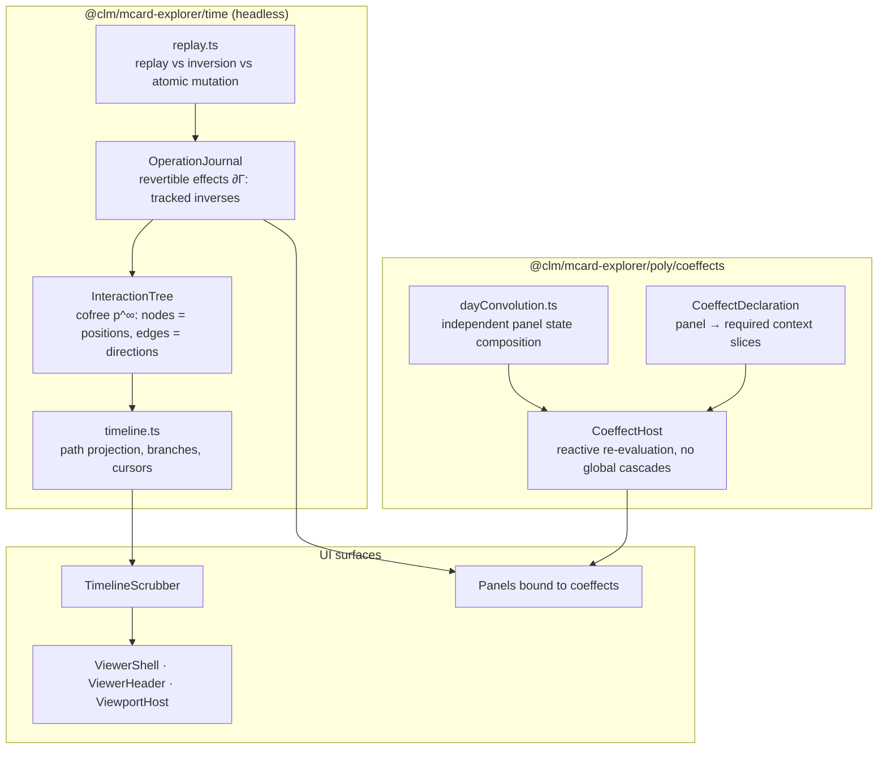

# Sprint 39: Cofree Timeline, Revertible Effects & Coeffect Panels

**Sprint ID:** `SPRINT-39`
**Subsystem Category:** `shell`
**Target:** `@clm/mcard-explorer/time`, `@clm/mcard-explorer/poly/coeffects`, panel composition
**Dependencies:** Sprint 36 (`Position`, `Direction`, registry, `DirectionResult.inverse` seam), Sprint 37 (`cardCreate`, provenance), Sprint 38 (`ZoomPath`), `OperadicMCardVfs.getHandleHistory` (via `CardVcsPort`), kernel `FiberLifecycle`, `DisposableList`, `SavepointGuard`
**Target LOC:** ≤ 250 LOC per file (Contract D) · ≤ 150 LOC concern target (ADR D53/D54)
**Zero-DOM Gate:** Contract E — `time/` and `poly/` are 100% headless
**Kernel Stratum:** `@layer L4` (interface/membrane) consuming **L4 lifecycle** (`FiberLifecycle`, `DisposableList`, `SavepointGuard`) and **L0** (`TypedValue` for journal snapshots) — root-export only
**Host Boundary:** kenotic (ADR D55) — the Cordis `Context` is **passed in, never imported**; slices bind through the host
**Contract B Gate:** all existing selectors preserved; timeline selectors registered deliberately
**Status:** 📋 Drafted / Ready

---

## 1. Context & Motivation

The interface has **no time**. `MCardExplorerEngine` mutates its own state in place (`selectHandle` pushes to `selectedHandles`, `:79`; `toggleFolder` rebuilds the array, `:85`; `sortItems` sorts the array *in place*, `:127`) with no record of what changed, and `getHandleHistory()` returns a flat array that no surface renders. Three verified consequences:

1. **No time travel.** There is no way to see "what I did", step back, or compare two moments. The vault's Breiner note (§4.D) states the theory precisely: for an interface polynomial $p$, the **cofree comonad $p^\infty$** is the space of all interaction paths, a running session is a path through it, and storing the history of events *is* retaining that path. Version branches are sub-trees.
2. **No revertible effects.** Cordis's $\partial\Gamma$ discipline — every context mutation carries a tracked inverse so that unmounting a component leaves **zero residue** — is unimplemented. Panels dispose without undoing what they changed. See [[StudyNotes: Literature/Spatiotemporal Computing - From M100 Hardware Dataflow and Cordis Algebraic Compositionality to Digital Synesthesia|Spatiotemporal Computing]] §3.1 and [[StudyNotes: Hub/Theory/Integration/State Recovery Paradigms - Replay, Inversion, and Atomic Mutation in Redux, Cordis, and Nanostores|State Recovery Paradigms]] for the three competing recovery strategies (replay / inversion / atomic mutation) this sprint must choose between explicitly.
3. **Coeffects are coarse.** `$corpusQuery`, `$corpusView`, `$previewCardHandle`, `$sessionRecovery` are broad global stores. Any write to `$corpusView` re-renders every subscriber; panels do not declare what they actually need. The vault's answer is Day convolution: *composing stateful components without state entanglement*, each holding its own state and coordinating through explicit interfaces ([[StudyNotes: Hub/Theory/Integration/Lenses and Directionality in Web and Cloud Architecture|Lenses and Directionality]] §Pattern 2; Breiner §4.C).

This sprint adds the temporal axis and the spatial (coeffect) axis of spatiotemporal composability to the interface.

---

## 2. Deliverables & Technical Architecture



*Diagram: the interaction tree and journal, the coeffect host, and the surfaces they drive.*

### 2.1 `time/InteractionTree.ts` — the cofree interaction tree (≤ 180 LOC)

```typescript
import type { Position, Direction, DirectionResult } from '../poly/types';

/** A node in the cofree interaction tree: a position, plus the directions actually taken from it. */
export interface InteractionNode {
  readonly id: string;
  readonly position: Position;
  /** The direction taken to *arrive* here (null at the root). */
  readonly arrivedBy: string | null;
  readonly result?: DirectionResult;
  readonly at: number;                       // monotonic sequence number
  readonly children: readonly InteractionNode[];
}

export class InteractionTree {
  /** Record a taken direction as a child of the current node. */
  record(position: Position, directionId: string, result: DirectionResult): InteractionNode;

  /** The current path from root to cursor — the session. */
  path(): readonly InteractionNode[];

  /** Re-root the tree at an earlier node (time travel). */
  rewind(nodeId: string): void;

  /** Branch: continue from an earlier node without discarding the future. */
  branchFrom(nodeId: string): void;

  /** Attach a version lineage (from CardVcsPort) as a branch structure. */
  attachLineage(handle: string, entries: readonly { hash: string; changedAt: string; message?: string }[]): void;

  /** All nodes that could have followed a given node — "what else could I have done here?" */
  alternatives(nodeId: string): readonly Direction[];

  /** Serialise/restore for session recovery (bounded depth, structural sharing). */
  toJSON(): unknown;
  static fromJSON(data: unknown): InteractionTree;
}
```

**Semantics chosen (ADR D51):**
- The tree is **append-only**; rewinding moves a cursor, it does not delete. `branchFrom` therefore preserves the future as a sibling sub-tree — matching "storing the history of user events is equivalent to retaining the path taken through the cofree tree."
- `alternatives(nodeId)` re-resolves the Sprint 36 direction fiber at that historical position, so the UI can show *what was legal then* — the debugging and user-education property Breiner highlights.
- Bounded memory: nodes retain `{ id, position: shallow, arrivedBy, at }` with the position's heavy fields (`meta`) pruned beyond a configurable depth, and structural sharing for unchanged positions.

### 2.2 `time/journal.ts` — revertible effects (≤ 150 LOC)

Cordis's tracked-inverse discipline, built on kernel lifecycle primitives:

```typescript
import type { DisposableList } from 'clm-kernel';

export interface RevertibleEffect {
  readonly id: string;
  readonly label: string;
  /** Apply the effect and return its tracked inverse (Cordis ∂Γ: track_Γ(f, f⁻¹)). */
  readonly apply: () => Promise<() => Promise<void>>;
}

export class OperationJournal {
  constructor(private disposables: DisposableList);

  /** Run an effect, recording its inverse. Throws leave no entry (atomic). */
  async run<T>(effect: RevertibleEffect): Promise<T>;

  /** Undo the most recent effect (inverse order). */
  async undo(): Promise<boolean>;

  /** Undo everything recorded since a mark — the zero-residue guarantee. */
  async rollbackTo(mark: JournalMark): Promise<void>;

  /** Mark a point; panels capture a mark on mount. */
  mark(): JournalMark;

  /** Verify zero residue: the journal is empty and all inverses ran. */
  isClean(): boolean;

  entries(): readonly { id: string; label: string }[];
}
```

**Guarantees (verified in Sprint 40):**
- `rollbackTo(mark)` runs inverses in LIFO order; afterwards the recorded context is **byte-identical** to the state at `mark` (deep-equality assertion over the coeffect host's slice snapshot).
- A throwing `apply` records nothing (atomicity), so partial effects cannot leak.
- Every panel captures a `mark()` on mount and calls `rollbackTo` on unmount — disposal is leak-free **by construction**, not by convention. Kernel `DisposableList` and `SavepointGuard` provide the underlying nesting/rollback primitives; the journal composes them rather than re-implementing them.

### 2.3 `time/replay.ts` — recovery strategy, chosen explicitly (≤ 120 LOC)

The vault's [[StudyNotes: Hub/Theory/Integration/State Recovery Paradigms - Replay, Inversion, and Atomic Mutation in Redux, Cordis, and Nanostores|State Recovery Paradigms]] note lays out three strategies. This sprint commits to a **hybrid with an explicit rule**:

| Strategy | Where it is used | Why |
| :--- | :--- | :--- |
| **Atomic mutation** | Every journal effect | Guarantees no partial application; matches `SavepointGuard` semantics already in the storage layer |
| **Inversion** | `undo`, `rollbackTo` | Cheapest path to zero residue; requires every effect to carry a true inverse (enforced by the type) |
| **Replay** | Session restore after reload | Inverses cannot survive process death; the serialised `InteractionTree` replays forward to reconstruct the cursor position |

```typescript
/** Replay a serialised tree forward to a cursor (session restore). Never re-executes host side effects. */
export function replayTo(tree: InteractionTree, cursorId: string, apply: (node: InteractionNode) => void): void;
/** Report which recorded effects are *not* invertible (diagnostics for the zero-residue gate). */
export function auditInvertibility(entries: readonly { id: string; label: string }[]): readonly string[];
```

**Rule:** `replayTo` reconstructs *interface state only* — it must never re-invoke a host effect (no re-exporting files, no re-committing cards). A test asserts a replay over a tree containing an export direction performs zero `saveArtifact` calls.

### 2.4 `poly/coeffects.ts` — panels declare what they need (≤ 150 LOC)

```typescript
/** A coeffect: the precise context slices a panel requires, and how it reacts to change. */
export interface CoeffectDeclaration<S = unknown> {
  readonly panelId: string;
  /** Slice selectors over the host context — never the whole store. */
  readonly slices: readonly string[];
  /** Called only when one of the declared slices changes (referential comparison). */
  readonly onChange: (next: S, prev: S) => void;
  /** Optional equality override for slice comparison. */
  readonly equals?: (a: unknown, b: unknown) => boolean;
}

export class CoeffectHost {
  /** Bind a panel; returns a disposer that also rolls the panel's journal mark back. */
  bind<S>(decl: CoeffectDeclaration<S>): () => void;

  /** Publish a context slice value; only panels declaring it are notified. */
  publish(slice: string, value: unknown): void;

  /** Diagnostics: which panels are subscribed to which slices (used by the isolation test). */
  subscriptions(): Readonly<Record<string, readonly string[]>>;
}
```

**Day convolution in practice** (`dayConvolution.ts`, ≤ 90 LOC): panels keep **independent local state** and compose through explicit interfaces. Concretely, the drawer's view mode, the explorer's facet, and the viewer's handle become three independent states combined at render time rather than three global atoms that every subscriber watches:

```typescript
/** Compose independent panel states without entanglement (Day convolution shape). */
export function composePanelStates<T extends readonly unknown[], R>(
  states: T,
  project: (...states: T) => R
): { get(): R; set<K extends keyof T>(index: K, value: T[K]): void };
```

**Migration targets (host):** `$corpusQuery` → `ExplorerToolbar` local state + `explorer.query` coeffect slice; `$corpusView` → `DrawerViewSwitcher` local state + `drawer.view` slice; `$previewCardHandle` → `viewer.handle` slice published by selection directions, consumed only by the card-viewer panel and the viewer host. Each is *narrow*, so unrelated panels stop re-rendering.

### 2.5 UI surfaces

| Module | ≤ LOC | Responsibility |
| :--- | ---: | :--- |
| `ui/TimelineScrubber.tsx` | 140 | Renders the session path; drag to rewind, branch marker, `alternatives` popover; testids `timeline-scrubber`, `timeline-node-${id}`, `timeline-branch`, `timeline-alternatives` |
| `ui/ViewerShell.tsx` | 100 | Viewer composition root (extracted from `MCardViewer.tsx`, 172 → shell + header + viewport) |
| `ui/ViewerHeader.tsx` | 90 | Handle/universe/CID/badges (absorbs `MCardViewerToolbar`'s header role) |
| `ui/ViewportHost.tsx` | 120 | Adaptive viewport container (`data-viewport-mode`) + error boundary walking the `resolveAll` candidate list |
| `ui/JournalIndicator.tsx` | 80 | Undo affordance driven by `OperationJournal`; testids `journal-indicator`, `btn-journal-undo` |

**Accessibility:** the scrubber is a listbox with roving tabindex; rewind announces the new position through the existing `live-announcer`; `Ctrl/Cmd+Z` maps to `journal.undo()` through the direction fiber (so it is absent when the journal is empty).

### 2.6 Kernel Layer Placement (ADR D57)

| Module | Declared stratum | Kernel symbols consumed | From | Layer note |
| :--- | :--- | :--- | :--- | :--- |
| `time/journal.ts` | L4 | `DisposableList` (composed), `SavepointGuard` (atomicity) | root export | **Composes** kernel disposal; does not re-implement it |
| `time/InteractionTree.ts` | L4 | `TypedValue` (snapshot shape) | root export | Positions are values; history is structure |
| `time/replay.ts` | L4 | `FiberLifecycle` (state naming only) | root export | Replay reconstructs interface state; never re-executes host effects |
| `poly/coeffects.ts` | L4 | — | — | Binding is a host concern; the package defines the declaration and host contract |
| `ui/{TimelineScrubber,ViewerShell,ViewerHeader,ViewportHost,JournalIndicator}.tsx` | L4 | — | — | Presentation |

**Disposal ownership.** The kernel owns the LIFO disposal primitive (`DisposableList`) and the ACID nesting primitive (`SavepointGuard`). This series uses **both** and adds nothing to them; the journal is a *bookkeeping* layer (which inverse belongs to which effect) rather than a second disposal mechanism.

### 2.7 `mcard-studio` Alignment (ADRs D54–D56)

This is the sprint with the strongest existing studio counterpart: the studio has **already implemented** the resource half of zero-residue disposal, and named the invariant.

| Studio artefact (verified) | Relationship to this sprint | Action |
| :--- | :--- | :--- |
| `src/hooks/useCordisFiber.ts` (52 LOC) — `clientContext.isolate('fiber:name')`, a `DisposableList` ref, `disposables.dispose()` on unmount (*"Unmount teardown: pops LIFO stack in <1ms"*) | The studio's **resource** half: component lifetime → isolated Cordis context → deterministic teardown. | Our `OperationJournal` is the **state** half of the same discipline. Parity test: given the same sequence of effects, journal rollback and `useCordisFiber` unmount leave the same observable state (no leaked listeners, no residual values). |
| `src/services/vfs/vfsCordis.ts` — *"The Context is passed IN — never imported … avoids the `cordisClient → mcardVfs` import cycle"*; `ctx.effect(fn)` returns a disposer; `ctx.provide('vfs.core', …)`; `declare module 'cordis'` augmentation; **INV-255-02 zero-residual pattern** | The **kenotic wiring rule** (ADR D55) stated by the studio itself. | Adopt verbatim: `CoeffectHost` and `OperationJournal` never import `cordis`. A **host adapter** (`src/services/clm/coeffectCordisAdapter.ts`, host side, not package) binds them with `ctx.effect` and exposes them via `ctx.provide('explorer.coeffects', …)` with a matching module augmentation. |
| `src/fiber/disposable.ts` — the studio's **own** `DisposableList`, documented as *"the mathematical reversibility contract of Spatiotemporal Compositionality … `p · (−p) ≃ refl` … `H_T → 0` (Noetherian physical entropy recovery in <1ms)"* | A second implementation of a primitive the kernel also exports (verified: `DisposableList` is in `clm-kernel`'s root export). | The series uses the **kernel** export so both hosts share one primitive. Convergence item: the studio keeps its path-inversion wrapper (`p · (−p) ≃ refl` as documented semantics) as a thin adapter over the kernel type — recorded in the Sprint 40 porting checklist, not forked. |
| `src/stores/*` — 11 nanostores atoms, incl. `$mcardTree`, `$activeMCard`, `$syncMode`, `executionLog.ts`, `marking.ts`, **`lagrangian.ts`** | The studio's store layer, and its own naming of the software Lagrangian $L = S_T - H_T$. | Coeffect slices map 1:1 onto nanostores atoms in **both** hosts (TikZiT already uses nanostores). `CoeffectHost.bind` subscribes per declared slice so a facet change does not re-render the viewer. The zero-residue gate is exactly the studio's $H_T \to 0$. |
| `src/stores/executionLog.ts` | The studio's **execution** history (PCard runs). | Our `InteractionTree` is the **interaction** history. They are two views of the same cofree structure at different strata; Sprint 40 documents the relationship (interaction node ⇄ execution entry) so a future studio timeline can render both without a second tree. |
| `.agents/skills/mcard-navigation/SKILL.md` — command palette (Strategy 2), **"URL as State"** | The studio's rapid-navigation plan. | The timeline is a `NavigationProvider` consumer: rewinding publishes a position whose `encodeAddress` updates the URL hash; the command palette resolves addresses through `NavigationProviderRegistry.fromAddress` (ADR D56). No second navigation stack. |

### 2.8 Disposal contract shared by both hosts

```typescript
/** Host-side binding contract — implemented by TikZiT and by mcard-studio; never imported by the package. */
export interface HostEffectContext {
  /** Mirrors Cordis `ctx.effect(fn)`: run eagerly, return a disposer. */
  effect<T>(fn: () => T, dispose: (value: T) => void | Promise<void>): () => void;
  /** Mirrors `ctx.provide(name, value)` + module augmentation. */
  provide(name: string, value: unknown): () => void;
  /** Isolated child scope, mirroring `ctx.isolate('fiber:name')`. */
  isolate(name: string): HostEffectContext;
}

/** Bind the journal + coeffect host to any host context (TikZiT runtime, Cordis Context, test double). */
export function bindHostEffects(ctx: HostEffectContext, journal: OperationJournal, host: CoeffectHost): () => void;
```

`bindHostEffects` lives in the **package** (it is pure), while the `HostEffectContext` implementation lives in each host — TikZiT wraps its workbench runtime, `mcard-studio` wraps `clientContext` (`ctx.effect`/`ctx.provide`/`ctx.isolate` map directly). The parity test drives the same fake `HostEffectContext` for both, which is what makes "same teardown semantics" checkable.

---

## 3. Definition of Done (DoD) Criteria

- [ ] **39-DOD-01**: **Cofree Interaction Tree Engine** (`src/packages/mcard-explorer/time/InteractionTree.ts`, $\le 180$ LOC).
  - **Observable Rule:** Implements `record`, `path`, `rewind`, `branchFrom`, `attachLineage`, `alternatives`, `toJSON`/`fromJSON`. Rewinding preserves future timeline as a sibling branch (branch count increases by 1, future not discarded).
  - **Verification Command:** `npx vitest run tests/unit/mcard-explorer/time/InteractionTree.test.ts`
- [ ] **39-DOD-02**: **Historical Fiber Alternatives Resolution**.
  - **Observable Rule:** `alternatives(nodeId)` re-resolves the affordance fiber at historical position; a direction legal *then* but illegal *now* is still reported in alternatives (interaction history immutable to present state).
  - **Verification Command:** `npx vitest run tests/unit/mcard-explorer/time/InteractionTree.test.ts -t "historical alternatives"`
- [ ] **39-DOD-03**: **Revertible Effect Journal Engine** (`src/packages/mcard-explorer/time/journal.ts`, $\le 150$ LOC).
  - **Observable Rule:** Implements `run`, `undo`, `rollbackTo`, `mark`, `isClean`, `entries` composing kernel `DisposableList`. An effect whose `apply` throws records nothing in journal (atomicity verified).
  - **Verification Command:** `npx vitest run tests/unit/mcard-explorer/time/journal.test.ts`
- [ ] **39-DOD-04**: **Zero-Residue Gate ($\ge 6$ Representative Effects)**.
  - **Observable Rule:** After `rollbackTo(mark)`, host declared slices are deep-equal (`toStrictEqual`) to initial snapshot at `mark`; asserted across select, facet change, zoom enter, view-mode change, wire, and commit.
  - **Verification Command:** `npx vitest run tests/unit/mcard-explorer/time/journal.test.ts -t "zero residue"`
- [ ] **39-DOD-05**: **Replay Purity & Side-Effect Absence** (`src/packages/mcard-explorer/time/replay.ts`, $\le 120$ LOC).
  - **Observable Rule:** `replayTo(nodeId)` over a tree containing export directions triggers exactly **zero** calls to `saveArtifact`, file pickers, or network operations (spy-asserted); reconstructs interface state only.
  - **Verification Command:** `npx vitest run tests/unit/mcard-explorer/time/replay.test.ts -t "replay purity"`
- [ ] **39-DOD-06**: **Session Recovery & Memory Bound**.
  - **Observable Rule:** Reconstructs interaction tree and active cursor from JSON; structural sharing keeps 200-node tree within memory bounds and round-trips in $\le 5$ms.
  - **Verification Command:** `npx vitest run tests/unit/mcard-explorer/time/sessionRecovery.test.ts`
- [ ] **39-DOD-07**: **Coeffect Declarations & Narrow Subscriptions** (`src/packages/mcard-explorer/poly/coeffects.ts`, $\le 150$ LOC).
  - **Observable Rule:** Implements `CoeffectDeclaration`, `CoeffectHost.bind`/`publish`/`subscriptions`. Publishing a slice notifies **only** panels declaring that slice (asserted by counting `onChange` invocations across three bound panels).
  - **Verification Command:** `npx vitest run tests/unit/mcard-explorer/poly/coeffects.test.ts`
- [ ] **39-DOD-08**: **Day Convolution Panel Decoupling** (`src/packages/mcard-explorer/poly/dayConvolution.ts`, $\le 90$ LOC).
  - **Observable Rule:** `composePanelStates` updates panel state without triggering sibling panel re-renders (spy counter on sibling render === 0).
  - **Verification Command:** `npx vitest run tests/unit/mcard-explorer/poly/dayConvolution.test.ts`
- [ ] **39-DOD-09**: **Global Store Migration to Narrow Slices**.
  - **Observable Rule:** `$corpusQuery`, `$corpusView`, `$previewCardHandle` replaced with slice subscriptions; unrelated panel re-render count drops to 0 during facet update.
  - **Verification Command:** `npx vitest run tests/unit/mcard-explorer/poly/coeffectIsolation.test.ts`
- [ ] **39-DOD-10**: **UI Decomposition of Viewer & Timeline**.
  - **Observable Rule:** Modules authored: `ui/TimelineScrubber.tsx` ($\le 140$ LOC), `ui/ViewerShell.tsx` ($\le 100$ LOC), `ui/ViewerHeader.tsx` ($\le 90$ LOC), `ui/ViewportHost.tsx` ($\le 120$ LOC), `ui/JournalIndicator.tsx` ($\le 80$ LOC). `MCardViewer.tsx` drops to $\le 90$ LOC composition root.
  - **Verification Command:** `wc -l src/packages/mcard-explorer/ui/{TimelineScrubber,ViewerShell,ViewerHeader,ViewportHost,JournalIndicator,MCardViewer}.tsx`
- [ ] **39-DOD-11**: **Timeline Contract B Registration**.
  - **Observable Rule:** `node scripts/audit-testids.mjs --check` passes with 295 literals + 17 dynamic families; new testids `timeline-scrubber`, `timeline-node-*`, `timeline-branch`, `timeline-alternatives`, `journal-indicator`, `btn-journal-undo` registered.
  - **Verification Command:** `node scripts/audit-testids.mjs --check`
- [ ] **39-DOD-12**: **Keyboard Shortcut Absence & Precedence**.
  - **Observable Rule:** `Ctrl/Cmd+Z` maps to journal undo and is completely absent from DOM when journal is clean; `Backspace` maps to zoom exit with precedence tested.
  - **Verification Command:** `npx vitest run tests/unit/mcard-explorer/ui/keyboardShortcuts.test.ts`
- [ ] **39-DOD-13**: **Contract E Zero-DOM Isolation Gate**.
  - **Observable Rule:** `TARGET_DIRECTORIES` in `check-vcs-isolation.mjs` includes `mcard-explorer/time` and extended `poly/` targets; 0 DOM globals, 0 host imports.
  - **Verification Command:** `node scripts/check-vcs-isolation.mjs`
- [ ] **39-DOD-14**: **Time & Coeffects Unit Test Suite**.
  - **Observable Rule:** 100% pass across `tests/unit/mcard-explorer/time/{InteractionTree,journal,replay}.test.ts` and `tests/unit/mcard-explorer/poly/coeffects.test.ts`.
  - **Verification Command:** `npx vitest run tests/unit/mcard-explorer/time tests/unit/mcard-explorer/poly/coeffects.test.ts`
- [ ] **39-DOD-15**: **Full Vitest Regression Suite & Type Check**.
  - **Observable Rule:** 100% pass with 0 regressions against 670 baseline; `tsc --noEmit` clean.
  - **Verification Command:** `npx vitest run && npx tsc --noEmit`
- [ ] **39-DOD-16**: **Single-Concern Module Audit**.
  - **Observable Rule:** All modules in `time/` $\le 150$ LOC; `MCardViewer.tsx` (160 $\to \le 90$ LOC) recorded in evidence ledger.
  - **Verification Command:** `node scripts/audit-concerns.mjs`
- [ ] **39-DOD-17**: **Kernel Layer Declarations & Disposal Composition**.
  - **Observable Rule:** Every `time/` module carries `@layer L4` header; `OperationJournal` composes kernel `DisposableList` and `SavepointGuard` without inventing a separate disposal mechanism.
  - **Verification Command:** `grep -rn "@layer L4" src/packages/mcard-explorer/time/`
- [ ] **39-DOD-18**: **HostEffectContext Port & Cordis Host Adapter**.
  - **Observable Rule:** Package exports pure `bindHostEffects` and `HostEffectContext` port; host adapter `src/services/clm/coeffectCordisAdapter.ts` maps Cordis; zero `cordis` imports inside `time/` or `poly/` (grep-asserted).
  - **Verification Command:** `! grep -rn "from 'cordis'" src/packages/mcard-explorer/{time,poly}/`
- [ ] **39-DOD-19**: **Nanostores Atom Slice Binding**.
  - **Observable Rule:** `CoeffectHost.bind` maps declared slices to Nanostores atom subscriptions; no component subscribes to entire store; tested with 3 overlapping panels.
  - **Verification Command:** `npx vitest run tests/unit/mcard-explorer/poly/nanostoresSlice.test.ts`
- [ ] **39-DOD-20**: **Teardown Parity with `useCordisFiber`**.
  - **Observable Rule:** Conformance test drives fake `HostEffectContext` for journal rollback and unmount, asserting zero leaked event listeners and zero residual slice state.
  - **Verification Command:** `npx vitest run tests/conformance/studio-parity.test.ts -t "teardown parity"`
- [ ] **39-DOD-21**: **Kernel DisposableList Convergence Documentation**.
  - **Observable Rule:** Porting checklist documents studio `DisposableList` convergence as a wrapper over kernel export preserving path inversion semantics ($p \cdot (-p) \simeq \text{refl}$, $H_T \to 0$).
  - **Verification Command:** `grep -rn "DisposableList" docs/sprints/_active/SPRINT-39-COFREE-TIMELINE-REVERTIBLE-EFFECTS-AND-COEFFECT-PANELS.md`
- [ ] **39-DOD-22**: **Timeline Deep Linking & URL Navigation**.
  - **Observable Rule:** Scrubber change calls `encodeAddress` to update URL hash; cold reload with hash reconstructs identical timeline cursor and viewport mode.
  - **Verification Command:** `npx vitest run tests/unit/mcard-explorer/time/timelineNavigation.test.ts`
- [ ] **39-DOD-23**: **Façade Discipline (ADR D54)**.
  - **Observable Rule:** `time/index.ts` is exclusive public export; `src/packages/mcard-explorer/ui/` consumes only façades (grep-asserted).
  - **Verification Command:** `! grep -rn "from '.*mcard-explorer/time/[a-zA-Z]" src/packages/mcard-explorer/ui/`

---

## 4. Verification

| Gate | Command / artifact |
| :--- | :--- |
| Unit | `npx vitest run tests/unit/mcard-explorer/time tests/unit/mcard-explorer/poly` |
| Zero residue | journal rollback deep-equality suite (39-DOD-04) |
| Coeffect isolation | re-render counting test (39-DOD-07/09) |
| Replay purity | `saveArtifact` spy (39-DOD-05) |
| Contract B | `node scripts/audit-testids.mjs --check` |
| Isolation | `make check-vcs-isolation` |
| Regression | `npx vitest run` |
| Studio parity | `tests/conformance/studio-parity.test.ts` — journal teardown ≡ `useCordisFiber` semantics; nanostores slice binding |
| Kenotic boundary | grep gate: zero `cordis`/`cordisClient`/host-store imports in `time/` and `poly/` |

**Acceptance demonstration.** A session that selects a card, changes facet, zooms into a SQLite collection, and composes two cards produces a six-node timeline. Dragging the scrubber to node 2 re-roots the view; the `alternatives` popover lists what else was legal at that moment. `Ctrl/Cmd+Z` walks the journal backwards, and after returning to the session start the isolation test shows the declared slices deep-equal to their initial values — zero residue.
