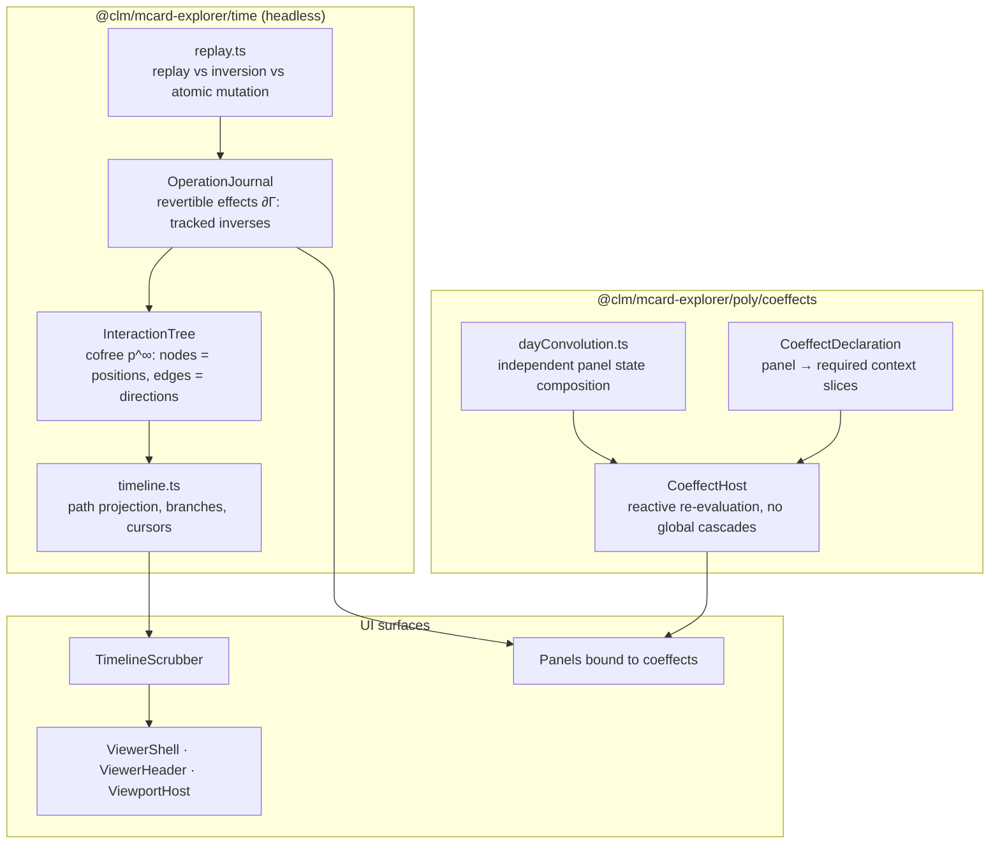

# Sprint 39: Cofree Timeline, Revertible Effects & Coeffect Panels

**Sprint ID:** `SPRINT-39`
**Subsystem Category:** `shell`
**Target:** `@clm/mcard-explorer/time`, `@clm/mcard-explorer/poly/coeffects`, panel composition
**Dependencies:** Sprint 36 (`Position`, `Direction`, registry, `DirectionResult.inverse` seam), Sprint 37 (`cardCreate`, provenance), Sprint 38 (`ZoomPath`), `OperadicMCardVfs.getHandleHistory` (via `CardVcsPort`), kernel `FiberLifecycle`, `DisposableList`, `SavepointGuard`
**Target LOC:** ≤ 250 LOC per file (Contract D) · ≤ 150 LOC concern target (ADR D53/D54)
**Zero-DOM Gate:** Contract E — `time/` and `poly/` are 100% headless
**Kernel Stratum:** `@layer L4` (interface/membrane) consuming **L4 lifecycle** (`FiberLifecycle`, `DisposableList`, `SavepointGuard`) and **L0** (`TypedValue` for journal snapshots) — root-export only
**Host Boundary:** kenotic (ADR D55) — the Cordis `Context` is **passed in, never imported**; slices bind through the host
**Contract B Gate:** all existing selectors preserved; timeline selectors registered deliberately
**Status:** 📋 Drafted / Ready

---

## 1. Context & Motivation

The interface has **no time**. `MCardExplorerEngine` mutates its own state in place (`selectHandle` pushes to `selectedHandles`, `:79`; `toggleFolder` rebuilds the array, `:85`; `sortItems` sorts the array *in place*, `:127`) with no record of what changed, and `getHandleHistory()` returns a flat array that no surface renders. Three verified consequences:

1. **No time travel.** There is no way to see "what I did", step back, or compare two moments. The vault's Breiner note (§4.D) states the theory precisely: for an interface polynomial $p$, the **cofree comonad $p^\infty$** is the space of all interaction paths, a running session is a path through it, and storing the history of events *is* retaining that path. Version branches are sub-trees.
2. **No revertible effects.** Cordis's $\partial\Gamma$ discipline — every context mutation carries a tracked inverse so that unmounting a component leaves **zero residue** — is unimplemented. Panels dispose without undoing what they changed. See [[StudyNotes: Literature/Spatiotemporal Computing - From M100 Hardware Dataflow and Cordis Algebraic Compositionality to Digital Synesthesia|Spatiotemporal Computing]] §3.1 and [[StudyNotes: Hub/Theory/Integration/State Recovery Paradigms - Replay, Inversion, and Atomic Mutation in Redux, Cordis, and Nanostores|State Recovery Paradigms]] for the three competing recovery strategies (replay / inversion / atomic mutation) this sprint must choose between explicitly.
3. **Coeffects are coarse.** `$corpusQuery`, `$corpusView`, `$previewCardHandle`, `$sessionRecovery` are broad global stores. Any write to `$corpusView` re-renders every subscriber; panels do not declare what they actually need. The vault's answer is Day convolution: *composing stateful components without state entanglement*, each holding its own state and coordinating through explicit interfaces ([[StudyNotes: Hub/Theory/Integration/Lenses and Directionality in Web and Cloud Architecture|Lenses and Directionality]] §Pattern 2; Breiner §4.C).

This sprint adds the temporal axis and the spatial (coeffect) axis of spatiotemporal composability to the interface.

---

## 2. Deliverables & Technical Architecture



*Diagram: the interaction tree and journal, the coeffect host, and the surfaces they drive.*

### 2.1 `time/InteractionTree.ts` — the cofree interaction tree (≤ 180 LOC)

```typescript
import type { Position, Direction, DirectionResult } from '../poly/types';

/** A node in the cofree interaction tree: a position, plus the directions actually taken from it. */
export interface InteractionNode {
  readonly id: string;
  readonly position: Position;
  /** The direction taken to *arrive* here (null at the root). */
  readonly arrivedBy: string | null;
  readonly result?: DirectionResult;
  readonly at: number;                       // monotonic sequence number
  readonly children: readonly InteractionNode[];
}

export class InteractionTree {
  /** Record a taken direction as a child of the current node. */
  record(position: Position, directionId: string, result: DirectionResult): InteractionNode;

  /** The current path from root to cursor — the session. */
  path(): readonly InteractionNode[];

  /** Re-root the tree at an earlier node (time travel). */
  rewind(nodeId: string): void;

  /** Branch: continue from an earlier node without discarding the future. */
  branchFrom(nodeId: string): void;

  /** Attach a version lineage (from CardVcsPort) as a branch structure. */
  attachLineage(handle: string, entries: readonly { hash: string; changedAt: string; message?: string }[]): void;

  /** All nodes that could have followed a given node — "what else could I have done here?" */
  alternatives(nodeId: string): readonly Direction[];

  /** Serialise/restore for session recovery (bounded depth, structural sharing). */
  toJSON(): unknown;
  static fromJSON(data: unknown): InteractionTree;
}
```

**Semantics chosen (ADR D51):**
- The tree is **append-only**; rewinding moves a cursor, it does not delete. `branchFrom` therefore preserves the future as a sibling sub-tree — matching "storing the history of user events is equivalent to retaining the path taken through the cofree tree."
- `alternatives(nodeId)` re-resolves the Sprint 36 direction fiber at that historical position, so the UI can show *what was legal then* — the debugging and user-education property Breiner highlights.
- Bounded memory: nodes retain `{ id, position: shallow, arrivedBy, at }` with the position's heavy fields (`meta`) pruned beyond a configurable depth, and structural sharing for unchanged positions.

### 2.2 `time/journal.ts` — revertible effects (≤ 150 LOC)

Cordis's tracked-inverse discipline, built on kernel lifecycle primitives:

```typescript
import type { DisposableList } from 'clm-kernel';

export interface RevertibleEffect {
  readonly id: string;
  readonly label: string;
  /** Apply the effect and return its tracked inverse (Cordis ∂Γ: track_Γ(f, f⁻¹)). */
  readonly apply: () => Promise<() => Promise<void>>;
}

export class OperationJournal {
  constructor(private disposables: DisposableList);

  /** Run an effect, recording its inverse. Throws leave no entry (atomic). */
  async run<T>(effect: RevertibleEffect): Promise<T>;

  /** Undo the most recent effect (inverse order). */
  async undo(): Promise<boolean>;

  /** Undo everything recorded since a mark — the zero-residue guarantee. */
  async rollbackTo(mark: JournalMark): Promise<void>;

  /** Mark a point; panels capture a mark on mount. */
  mark(): JournalMark;

  /** Verify zero residue: the journal is empty and all inverses ran. */
  isClean(): boolean;

  entries(): readonly { id: string; label: string }[];
}
```

**Guarantees (verified in Sprint 40):**
- `rollbackTo(mark)` runs inverses in LIFO order; afterwards the recorded context is **byte-identical** to the state at `mark` (deep-equality assertion over the coeffect host's slice snapshot).
- A throwing `apply` records nothing (atomicity), so partial effects cannot leak.
- Every panel captures a `mark()` on mount and calls `rollbackTo` on unmount — disposal is leak-free **by construction**, not by convention. Kernel `DisposableList` and `SavepointGuard` provide the underlying nesting/rollback primitives; the journal composes them rather than re-implementing them.

### 2.3 `time/replay.ts` — recovery strategy, chosen explicitly (≤ 120 LOC)

The vault's [[StudyNotes: Hub/Theory/Integration/State Recovery Paradigms - Replay, Inversion, and Atomic Mutation in Redux, Cordis, and Nanostores|State Recovery Paradigms]] note lays out three strategies. This sprint commits to a **hybrid with an explicit rule**:

| Strategy | Where it is used | Why |
| :--- | :--- | :--- |
| **Atomic mutation** | Every journal effect | Guarantees no partial application; matches `SavepointGuard` semantics already in the storage layer |
| **Inversion** | `undo`, `rollbackTo` | Cheapest path to zero residue; requires every effect to carry a true inverse (enforced by the type) |
| **Replay** | Session restore after reload | Inverses cannot survive process death; the serialised `InteractionTree` replays forward to reconstruct the cursor position |

```typescript
/** Replay a serialised tree forward to a cursor (session restore). Never re-executes host side effects. */
export function replayTo(tree: InteractionTree, cursorId: string, apply: (node: InteractionNode) => void): void;
/** Report which recorded effects are *not* invertible (diagnostics for the zero-residue gate). */
export function auditInvertibility(entries: readonly { id: string; label: string }[]): readonly string[];
```

**Rule:** `replayTo` reconstructs *interface state only* — it must never re-invoke a host effect (no re-exporting files, no re-committing cards). A test asserts a replay over a tree containing an export direction performs zero `saveArtifact` calls.

### 2.4 `poly/coeffects.ts` — panels declare what they need (≤ 150 LOC)

```typescript
/** A coeffect: the precise context slices a panel requires, and how it reacts to change. */
export interface CoeffectDeclaration<S = unknown> {
  readonly panelId: string;
  /** Slice selectors over the host context — never the whole store. */
  readonly slices: readonly string[];
  /** Called only when one of the declared slices changes (referential comparison). */
  readonly onChange: (next: S, prev: S) => void;
  /** Optional equality override for slice comparison. */
  readonly equals?: (a: unknown, b: unknown) => boolean;
}

export class CoeffectHost {
  /** Bind a panel; returns a disposer that also rolls the panel's journal mark back. */
  bind<S>(decl: CoeffectDeclaration<S>): () => void;

  /** Publish a context slice value; only panels declaring it are notified. */
  publish(slice: string, value: unknown): void;

  /** Diagnostics: which panels are subscribed to which slices (used by the isolation test). */
  subscriptions(): Readonly<Record<string, readonly string[]>>;
}
```

**Day convolution in practice** (`dayConvolution.ts`, ≤ 90 LOC): panels keep **independent local state** and compose through explicit interfaces. Concretely, the drawer's view mode, the explorer's facet, and the viewer's handle become three independent states combined at render time rather than three global atoms that every subscriber watches:

```typescript
/** Compose independent panel states without entanglement (Day convolution shape). */
export function composePanelStates<T extends readonly unknown[], R>(
  states: T,
  project: (...states: T) => R
): { get(): R; set<K extends keyof T>(index: K, value: T[K]): void };
```

**Migration targets (host):** `$corpusQuery` → `ExplorerToolbar` local state + `explorer.query` coeffect slice; `$corpusView` → `DrawerViewSwitcher` local state + `drawer.view` slice; `$previewCardHandle` → `viewer.handle` slice published by selection directions, consumed only by the card-viewer panel and the viewer host. Each is *narrow*, so unrelated panels stop re-rendering.

### 2.5 UI surfaces

| Module | ≤ LOC | Responsibility |
| :--- | ---: | :--- |
| `ui/TimelineScrubber.tsx` | 140 | Renders the session path; drag to rewind, branch marker, `alternatives` popover; testids `timeline-scrubber`, `timeline-node-${id}`, `timeline-branch`, `timeline-alternatives` |
| `ui/ViewerShell.tsx` | 100 | Viewer composition root (extracted from `MCardViewer.tsx`, 172 → shell + header + viewport) |
| `ui/ViewerHeader.tsx` | 90 | Handle/universe/CID/badges (absorbs `MCardViewerToolbar`'s header role) |
| `ui/ViewportHost.tsx` | 120 | Adaptive viewport container (`data-viewport-mode`) + error boundary walking the `resolveAll` candidate list |
| `ui/JournalIndicator.tsx` | 80 | Undo affordance driven by `OperationJournal`; testids `journal-indicator`, `btn-journal-undo` |

**Accessibility:** the scrubber is a listbox with roving tabindex; rewind announces the new position through the existing `live-announcer`; `Ctrl/Cmd+Z` maps to `journal.undo()` through the direction fiber (so it is absent when the journal is empty).

### 2.6 Kernel Layer Placement (ADR D57)

| Module | Declared stratum | Kernel symbols consumed | From | Layer note |
| :--- | :--- | :--- | :--- | :--- |
| `time/journal.ts` | L4 | `DisposableList` (composed), `SavepointGuard` (atomicity) | root export | **Composes** kernel disposal; does not re-implement it |
| `time/InteractionTree.ts` | L4 | `TypedValue` (snapshot shape) | root export | Positions are values; history is structure |
| `time/replay.ts` | L4 | `FiberLifecycle` (state naming only) | root export | Replay reconstructs interface state; never re-executes host effects |
| `poly/coeffects.ts` | L4 | — | — | Binding is a host concern; the package defines the declaration and host contract |
| `ui/{TimelineScrubber,ViewerShell,ViewerHeader,ViewportHost,JournalIndicator}.tsx` | L4 | — | — | Presentation |

**Disposal ownership.** The kernel owns the LIFO disposal primitive (`DisposableList`) and the ACID nesting primitive (`SavepointGuard`). This series uses **both** and adds nothing to them; the journal is a *bookkeeping* layer (which inverse belongs to which effect) rather than a second disposal mechanism.

### 2.7 `mcard-studio` Alignment (ADRs D54–D56)

This is the sprint with the strongest existing studio counterpart: the studio has **already implemented** the resource half of zero-residue disposal, and named the invariant.

| Studio artefact (verified) | Relationship to this sprint | Action |
| :--- | :--- | :--- |
| `src/hooks/useCordisFiber.ts` (52 LOC) — `clientContext.isolate('fiber:name')`, a `DisposableList` ref, `disposables.dispose()` on unmount (*"Unmount teardown: pops LIFO stack in <1ms"*) | The studio's **resource** half: component lifetime → isolated Cordis context → deterministic teardown. | Our `OperationJournal` is the **state** half of the same discipline. Parity test: given the same sequence of effects, journal rollback and `useCordisFiber` unmount leave the same observable state (no leaked listeners, no residual values). |
| `src/services/vfs/vfsCordis.ts` — *"The Context is passed IN — never imported … avoids the `cordisClient → mcardVfs` import cycle"*; `ctx.effect(fn)` returns a disposer; `ctx.provide('vfs.core', …)`; `declare module 'cordis'` augmentation; **INV-255-02 zero-residual pattern** | The **kenotic wiring rule** (ADR D55) stated by the studio itself. | Adopt verbatim: `CoeffectHost` and `OperationJournal` never import `cordis`. A **host adapter** (`src/services/clm/coeffectCordisAdapter.ts`, host side, not package) binds them with `ctx.effect` and exposes them via `ctx.provide('explorer.coeffects', …)` with a matching module augmentation. |
| `src/fiber/disposable.ts` — the studio's **own** `DisposableList`, documented as *"the mathematical reversibility contract of Spatiotemporal Compositionality … `p · (−p) ≃ refl` … `H_T → 0` (Noetherian physical entropy recovery in <1ms)"* | A second implementation of a primitive the kernel also exports (verified: `DisposableList` is in `clm-kernel`'s root export). | The series uses the **kernel** export so both hosts share one primitive. Convergence item: the studio keeps its path-inversion wrapper (`p · (−p) ≃ refl` as documented semantics) as a thin adapter over the kernel type — recorded in the Sprint 40 porting checklist, not forked. |
| `src/stores/*` — 11 nanostores atoms, incl. `$mcardTree`, `$activeMCard`, `$syncMode`, `executionLog.ts`, `marking.ts`, **`lagrangian.ts`** | The studio's store layer, and its own naming of the software Lagrangian $L = S_T - H_T$. | Coeffect slices map 1:1 onto nanostores atoms in **both** hosts (TikZiT already uses nanostores). `CoeffectHost.bind` subscribes per declared slice so a facet change does not re-render the viewer. The zero-residue gate is exactly the studio's $H_T \to 0$. |
| `src/stores/executionLog.ts` | The studio's **execution** history (PCard runs). | Our `InteractionTree` is the **interaction** history. They are two views of the same cofree structure at different strata; Sprint 40 documents the relationship (interaction node ⇄ execution entry) so a future studio timeline can render both without a second tree. |
| `.agents/skills/mcard-navigation/SKILL.md` — command palette (Strategy 2), **"URL as State"** | The studio's rapid-navigation plan. | The timeline is a `NavigationProvider` consumer: rewinding publishes a position whose `encodeAddress` updates the URL hash; the command palette resolves addresses through `NavigationProviderRegistry.fromAddress` (ADR D56). No second navigation stack. |

### 2.8 Disposal contract shared by both hosts

```typescript
/** Host-side binding contract — implemented by TikZiT and by mcard-studio; never imported by the package. */
export interface HostEffectContext {
  /** Mirrors Cordis `ctx.effect(fn)`: run eagerly, return a disposer. */
  effect<T>(fn: () => T, dispose: (value: T) => void | Promise<void>): () => void;
  /** Mirrors `ctx.provide(name, value)` + module augmentation. */
  provide(name: string, value: unknown): () => void;
  /** Isolated child scope, mirroring `ctx.isolate('fiber:name')`. */
  isolate(name: string): HostEffectContext;
}

/** Bind the journal + coeffect host to any host context (TikZiT runtime, Cordis Context, test double). */
export function bindHostEffects(ctx: HostEffectContext, journal: OperationJournal, host: CoeffectHost): () => void;
```

`bindHostEffects` lives in the **package** (it is pure), while the `HostEffectContext` implementation lives in each host — TikZiT wraps its workbench runtime, `mcard-studio` wraps `clientContext` (`ctx.effect`/`ctx.provide`/`ctx.isolate` map directly). The parity test drives the same fake `HostEffectContext` for both, which is what makes "same teardown semantics" checkable.

---

## 3. Definition of Done (DoD) Criteria

- [ ] **39-DOD-01**: `time/InteractionTree.ts` (≤ 180 LOC) implements `record`, `path`, `rewind`, `branchFrom`, `attachLineage`, `alternatives`, `toJSON`/`fromJSON`. Rewinding preserves the future as a sibling branch (asserted).
- [ ] **39-DOD-02**: `alternatives(nodeId)` re-resolves the Sprint 36 fiber at a historical position; a test asserts that a direction legal *then* but illegal *now* is still reported as an alternative (history is not rewritten by present state).
- [ ] **39-DOD-03**: `time/journal.ts` (≤ 150 LOC) implements `run`/`undo`/`rollbackTo`/`mark`/`isClean`/`entries` over a kernel `DisposableList`. A throwing `apply` records nothing (atomicity test).
- [ ] **39-DOD-04**: **Zero-residue gate** — after `rollbackTo(mark)`, the coeffect host's declared slices are deep-equal to their snapshot at `mark`; asserted for ≥ 6 representative effects (select, facet change, zoom enter, view-mode change, wire, commit).
- [ ] **39-DOD-05**: `time/replay.ts` (≤ 120 LOC) implements `replayTo` and `auditInvertibility`. A replay over a tree containing an export direction performs **zero** `saveArtifact` calls (spy-asserted) — replay reconstructs interface state only.
- [ ] **39-DOD-06**: Session recovery restores the tree and cursor via `fromJSON`/`replayTo`, with bounded depth and structural sharing; a test round-trips a 200-node tree within the configured memory bound.
- [ ] **39-DOD-07**: `poly/coeffects.ts` (≤ 150 LOC) implements `CoeffectDeclaration`, `CoeffectHost.bind`/`publish`/`subscriptions`. Publishing a slice notifies **only** panels declaring it (asserted by counting `onChange` invocations across three bound panels).
- [ ] **39-DOD-08**: `poly/dayConvolution.ts` (≤ 90 LOC) implements `composePanelStates`; a test asserts independent state updates do not re-render sibling projections.
- [ ] **39-DOD-09**: Host migration — `$corpusQuery`, `$corpusView`, `$previewCardHandle` are replaced by narrow coeffect slices with panel-local state; unrelated-panel re-render count drops to zero in the isolation test (measured, not asserted by inspection).
- [ ] **39-DOD-10**: `ui/TimelineScrubber.tsx` (≤ 140), `ui/ViewerShell.tsx` (≤ 100), `ui/ViewerHeader.tsx` (≤ 90), `ui/ViewportHost.tsx` (≤ 120), `ui/JournalIndicator.tsx` (≤ 80) are authored; `MCardViewer.tsx` drops from 172 LOC to a composition root ≤ 90 LOC.
- [ ] **39-DOD-11**: Timeline testids (`timeline-scrubber`, `timeline-node-*`, `timeline-branch`, `timeline-alternatives`, `journal-indicator`, `btn-journal-undo`) registered; Contract B audit passes with all 295 literals + 17 families preserved.
- [ ] **39-DOD-12**: Keyboard — `Ctrl/Cmd+Z` maps to the journal undo direction and is **absent** (not disabled) when the journal is empty; `Backspace` remains zoom exit (Sprint 38) with a precedence test.
- [ ] **39-DOD-13**: Contract E — `mcard-explorer/time` and the extended `poly/` targets scan clean (0 DOM globals, 0 host imports).
- [ ] **39-DOD-14**: `tests/unit/mcard-explorer/time/{InteractionTree,journal,replay}.test.ts` and `tests/unit/mcard-explorer/poly/coeffects.test.ts` pass with the cases above.
- [ ] **39-DOD-15**: Full Vitest suite green with **0 regressions** against the 670-test baseline; `tsc --noEmit` clean.
- [ ] **39-DOD-16**: Concern audit — all new modules ≤ 150 LOC or documented; `MCardViewer.tsx` (172 → ≤ 90) and the global-store migration recorded in the graduation evidence ledger.
- [ ] **39-DOD-17**: **Layer declarations (ADR D57)** — every `time/` module carries a `@layer L4` header naming the kernel symbols it consumes; imports are root-export only. `OperationJournal` **composes** the kernel's `DisposableList` and `SavepointGuard` — it defines no second disposal mechanism (grep + test).
- [ ] **39-DOD-18**: **`HostEffectContext` port + `bindHostEffects` (ADR D55)** — the package ships the pure binder (§2.8) and the port; the Cordis implementation lives in a **host adapter** (`src/services/clm/coeffectCordisAdapter.ts`) using `ctx.effect` / `ctx.provide` / `ctx.isolate` with a matching `declare module 'cordis'` augmentation. Zero `cordis` imports inside `time/` and `poly/` (grep-asserted).
- [ ] **39-DOD-19**: **Nanostores slice binding** — `CoeffectHost.bind` maps each declared slice to a nanostores atom subscription in **both** hosts (TikZiT runtime and `mcard-studio`'s `src/stores/*`); no component subscribes to a whole store. A test binds three panels to overlapping slices and asserts only declaring panels fire.
- [ ] **39-DOD-20**: **Teardown parity with `useCordisFiber`** — `tests/conformance/studio-parity.test.ts` drives the same fake `HostEffectContext` for journal rollback and for `useCordisFiber`-style unmount, asserting identical observable state (no leaked listeners, no residual slice values).
- [ ] **39-DOD-21**: **`DisposableList` convergence documented** — the porting checklist records that `mcard-studio/src/fiber/disposable.ts` becomes a thin wrapper over the kernel export, preserving its documented path-inversion semantics (`p · (−p) ≃ refl`, `H_T → 0`) rather than remaining a second implementation.
- [ ] **39-DOD-22**: **Timeline as a navigation consumer (ADR D56)** — rewinding publishes a position whose `encodeAddress` updates the URL hash, and a cold load of that address restores the same cursor; the relationship between `InteractionTree` (interaction history) and the studio's `src/stores/executionLog.ts` (execution history) is documented in the bin README.
- [ ] **39-DOD-23**: **Façade discipline (ADR D54)** — `time/index.ts` and the extended `poly/index.ts` are the only importable surfaces; `ui/` consumes façades only (grep-asserted).

---

## 4. Verification

| Gate | Command / artifact |
| :--- | :--- |
| Unit | `npx vitest run tests/unit/mcard-explorer/time tests/unit/mcard-explorer/poly` |
| Zero residue | journal rollback deep-equality suite (39-DOD-04) |
| Coeffect isolation | re-render counting test (39-DOD-07/09) |
| Replay purity | `saveArtifact` spy (39-DOD-05) |
| Contract B | `node scripts/audit-testids.mjs --check` |
| Isolation | `make check-vcs-isolation` |
| Regression | `npx vitest run` |
| Studio parity | `tests/conformance/studio-parity.test.ts` — journal teardown ≡ `useCordisFiber` semantics; nanostores slice binding |
| Kenotic boundary | grep gate: zero `cordis`/`cordisClient`/host-store imports in `time/` and `poly/` |

**Acceptance demonstration.** A session that selects a card, changes facet, zooms into a SQLite collection, and composes two cards produces a six-node timeline. Dragging the scrubber to node 2 re-roots the view; the `alternatives` popover lists what else was legal at that moment. `Ctrl/Cmd+Z` walks the journal backwards, and after returning to the session start the isolation test shows the declared slices deep-equal to their initial values — zero residue.
