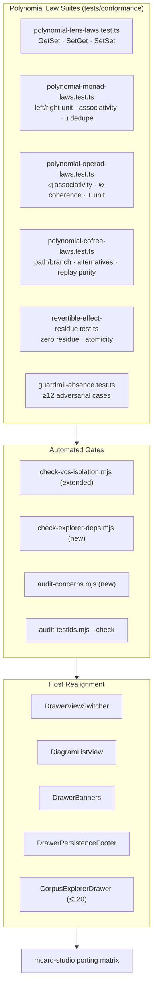

# Sprint 40: Polynomial Conformance, Guardrail Proofs & Host Realignment

**Sprint ID:** `SPRINT-40`
**Subsystem Category:** `verification`
**Target:** conformance suites, host decomposition, dependency enforcement, mcard-studio porting
**Dependencies:** Sprints 36–39
**Target LOC:** ≤ 250 LOC per file (Contract D) · ≤ 150 LOC concern target (ADR D53)
**Verification Gates:** Contract B (295 literals / 17 dynamic families) · Contract D (LOC ceilings) · Contract E (zero-DOM) · **Kernel layer placement (D57)** · **Studio parity (D54–D56)** · Polynomial law suites · Full Vitest regression
**Status:** 📋 Drafted / Ready

---

## 1. Context & Motivation

Sprints 36–39 introduce four new algebras (interface, card, zoom, time) and three new disciplines (guardrails, boundary consistency, revertible effects). None of them is *proved* by construction. This sprint converts each design claim into an executable law, removes the transitional shims, and finishes the host decomposition that Sprints 36–39 deliberately left in place.

It also discharges the two standing debts from the series proposal:

1. **The host drawer was never decomposed.** `CorpusExplorerDrawer.tsx` is 201 LOC carrying 5+ concerns (view switcher, diagram list, rename/menu state, recovery banners, persistence footer). Sprints 36–39 changed what it *renders*; this sprint splits it.
2. **Dependency direction was asserted, not enforced.** ADR D42 (no `mcard-vcs` concretes in the explorer) and the §7 dependency rules (poly ← cards ← zoom/time ← ui ← host) need an automated gate, not reviewer diligence.

---

## 2. Deliverables & Technical Architecture

*Diagram: law suites feed automated gates; the gates certify the host realignment and the porting matrix.*

### 2.1 Law suites

| Suite | Laws asserted | Notes |
| :--- | :--- | :--- |
| `polynomial-lens-laws.test.ts` | **GetSet** (`update(s, view(s)) = s`), **SetGet** (`view(update(s, m)) = expected`), **SetSet** (idempotent update) for every registered `InterfaceLens` | Property-based over generated positions; each law reports the failing lens id |
| `polynomial-monad-laws.test.ts` | Left unit (`cardGet(cardCreate(c)) ≅ c`), right unit, associativity of `cardDerive` composition, $\mu$ dedupe (`cardCreate(x)` twice → one hash) | Backed by kernel content hashing; dedupe asserted on real `blake3:` identity |
| `polynomial-operad-laws.test.ts` | `◁` associativity; `⊗` associativity + unit; `+` associativity/commutativity/unit; port-level distributivity `(a + b) ⊗ c ≅ (a ⊗ c) + (b ⊗ c)` | Compares `CompositionPlan.unbound` port sets, not object identity |
| `polynomial-cofree-laws.test.ts` | `path()` equals the recorded chain; `branchFrom` preserves the future; `alternatives` uses historical fibers; `replayTo` performs no host effects | Includes a 200-node round-trip within the memory bound |
| `revertible-effect-residue.test.ts` | Zero residue after `rollbackTo`; atomicity on throw; LIFO inverse order; `isClean()` truthfulness | Snapshot deep-equality over declared coeffect slices |
| `guardrail-absence.test.ts` | ≥ 12 adversarial cases where an illegal act must be **absent from the DOM** | See §2.2 |

### 2.2 Guardrail proof matrix (≥ 12 cases)

Each case asserts *absence* (no element, no direction, no drop target) — never "disabled" and never "throws".

| # | Position | Attempted act | Expected |
| --: | :--- | :--- | :--- |
| 1 | Seeded example (`meta.origin: 'seed'`) | Rename | absent |
| 2 | Seeded example | Archive | absent |
| 3 | `zx:artifacts:*` derived artifact | Rename | absent |
| 4 | Legacy-imported card | Archive | absent |
| 5 | Card with no exporter | Export… | absent |
| 6 | Card with no registered structure provider | Zoom enter | absent |
| 7 | Markdown position in composition surface | Drop on TikZ `in:source` | absent (no drop target rendered) |
| 8 | PNG position | Drop on PCard `in:token` | absent |
| 9 | `one`-arity consumer fed by `many` producers | Wire commit | absent |
| 10 | Inner composition that retypes an outer-exposed port | Commit inside zoom | absent + reason announced |
| 11 | Empty journal | Undo (`Ctrl/Cmd+Z`) | absent |
| 12 | Empty fiber position | `Enter` default direction | no-op, no direction resolved |
| 13 | Card type with no provider (binary blob) | Compose | absent |
| 14 | Zoom at maximum depth | Zoom enter | absent |

### 2.3 Automated gates

| Script | Assertion |
| :--- | :--- |
| `scripts/check-explorer-deps.mjs` **(new)** | Dependency direction per proposal §7: `poly/` imports no sibling package; `cards/` never imports `ui/`; `zoom/`, `time/` import no `mcard-vcs` concrete; `ui/` is the only importer of all four; host imports `ui/` only. Fails the build on violation. |
| `scripts/audit-concerns.mjs` **(new)** | Reports every module > 150 LOC with its inferred concerns; fails when a module > 150 LOC lacks a declared second concern comment. |
| `scripts/check-vcs-isolation.mjs` **(extended)** | Targets now include `mcard-vcs/type`, `mcard-explorer/{core,poly,cards,zoom,time,renderers/registry}` — 0 DOM globals, 0 host imports, type-only React. |
| `scripts/audit-testids.mjs --check` | 295 literal selectors + 17 dynamic families preserved; new selectors registered deliberately. |

### 2.4 Host realignment — `CorpusExplorerDrawer` decomposition

| New module | ≤ LOC | Responsibility (single) |
| :--- | ---: | :--- |
| `explorer/DrawerViewSwitcher.tsx` | 80 | Diagrams \| MCards segmented control (local state via coeffect slice `drawer.view`) |
| `explorer/DiagramListView.tsx` | 130 | Diagram list as **positions** (Sprint 36) — no `ExplorerItem` union, no 15-prop wall |
| `explorer/DrawerBanners.tsx` | 90 | Recovery + stale-reload banners (read-only, self-contained) |
| `explorer/DrawerPersistenceFooter.tsx` | 60 | Storage state footer |
| `CorpusExplorerDrawer.tsx` | 120 | Composition root only |

**Shim removal:** `MCardExplorerEngine.ts` (deprecated re-export, Sprint 36), `ExplorerSectionList.tsx` (replaced by `PositionGroupList`, Sprint 37), and `MCardTree.tsx` (replaced by `PositionTree`, Sprint 38) are deleted. Any residual host import is migrated in this sprint.

**Contract B handling:** every selector currently emitted by these modules must still be emitted by their replacements. `corpus-entry-${handle}`, `badge-${type}`, `entry-version`, `entry-actions-${handle}`, `action-rename`, `action-duplicate`, `row-export-diagram`, `btn-preview-card`, `action-archive`, `action-unarchive`, `badge-imported`, `badge-archived`, `input-rename-diagram`, `empty-diagrams-card`, `drawer-view-diagrams`, `drawer-view-mcards`, `drawer-corpus-explorer`, `live-announcer`, `recovery-banner`, `stale-reload-banner`, `corpus-persistence-state` are preserved verbatim; where a selector's semantics change (e.g. actions now derived from directions), the selector is kept and its owning spec updated **in the same commit**.

### 2.5 mcard-studio porting matrix

| Concern | Ships in `@clm/mcard-explorer` | mcard-studio implements |
| :--- | :--- | :--- |
| Interface algebra (`poly/`) | ✅ full | — |
| Card algebra + providers (`cards/`) | ✅ full | optional `CardRuntimePort` (its own PCard runtime) |
| Zoom providers (`zoom/`) | ✅ full | optional extra providers for studio-only card types |
| Interaction tree + journal (`time/`) | ✅ full | binds journal to Cordis `Context` fibers (its `FiberLifecycle` host) |
| Coeffects (`poly/coeffects`) | ✅ full | implements `CoeffectHost` over `ctx` (`@Inject` slices) |
| Views (`ui/`) | ✅ full (headless-safe) | mounts in `cardViewlets/` via the existing `toCardViewletDefinition` adapter (D34) |
| Storage/VCS | ❌ (ports only, D42) | `studioMCardFs` implements `CardContentProvider` / `CardStorePort` / `CardVcsPort` |

### 2.5 Layer conformance gate — `scripts/check-layer-imports.mjs` (ADR D57)

The layered approach becomes a build gate rather than documentation.

| Rule | Assertion | Failure message |
| :--- | :--- | :--- |
| **Declared stratum** | Every file under `mcard-explorer/{poly,cards,zoom,time}` carries a `@layer L<n>` header | names the file lacking a declaration |
| **Root-only kernel imports** | Every `from 'clm-kernel…'` specifier is exactly `'clm-kernel'` | lists offenders (`layer0`…`layer4`, `dist/*`, `./layer5`) |
| **No `layer5` subpath** | Explicitly rejects `clm-kernel/layer5` and `clm-kernel/dist/layer5*` (verified absent from the `exports` map) | explains root-export requirement |
| **At-or-below consumption** | A module declaring `L4` may import only kernel symbols on its declared list; an `L2` symbol imported by an `L3`-declared module fails | prints declared vs consumed strata |
| **No absorbed logic** | `poly/` and `ui/` contain no calls to `computeContentHash`, `parsePortableSqlite`, `parseSatoriXml`, `fireTransition`, or `MCardFileSystem` methods | names the module and the offending symbol |

### 2.6 Studio parity suite & porting checklist (ADRs D54–D56)

`tests/conformance/studio-parity.test.ts` asserts that the two hosts can share one implementation. Each assertion is paired with a **named studio artefact**, so the checklist is actionable rather than aspirational.

| Assertion | Studio artefact it binds to | What the studio must do |
| :--- | :--- | :--- |
| `TreeProjection` output ≡ `buildArtifactTree` semantics (dir-first, case-insensitive alpha, path split) | `src/utils/artifactTree.ts` | Adopt `TreeProjection`; delete the local builder (or keep it as a wrapper) |
| `toCardViewletDefinition(descriptor)` field parity | `views/cardViewlets/types.ts` (`CardViewletDefinition`) | Unchanged (D34 target) |
| `toStudioPortDescriptor(cardInterface)` field parity | `views/cardViewlets/types.ts` (sibling shape) | Consume for port rendering |
| `toStudioTreeNode(structureNodes)` field parity | `views/fileTree/FileTreeNode.tsx` (`TreeNode`) | Consume for containment rendering |
| `NavigationProvider` shape + `fromAddress` round-trip | `.agents/skills/mcard-navigation/SKILL.md` (URL-as-state, navigation providers) | Register providers; wire the hash |
| Journal teardown ≡ `useCordisFiber` unmount semantics | `src/hooks/useCordisFiber.ts`, `src/services/vfs/vfsCordis.ts` | Bind via `HostEffectContext` over `clientContext` (`ctx.effect`/`ctx.provide`/`ctx.isolate`) |
| Zero `cordis` imports in package modules | `vfsCordis.ts`'s kenotic rule | Keep the boundary; host adapters only |
| Ports satisfied by `studioMCardFs` | `src/services/vfs/{vfsCore,vfsHandles,vfsMutations,vfsVersions}.ts` + `mcardVfs.ts` façade | Implement `CardStorePort`/`CardVcsPort` at the façade (INV-294-01 already treats it as the compile-time contract) |
| `DisposableList` single implementation | `src/fiber/disposable.ts` (studio's copy) | Convert to a thin wrapper over the kernel export, preserving `p · (−p) ≃ refl` semantics |
| `InteractionTree` ⇄ `executionLog` relationship documented | `src/stores/executionLog.ts` | Optional: render execution entries as timeline annotations later |

**Studio-side deliverables (not in this repository):** the eight host adapters/providers above, plus `StructureProvider` registrations for studio-only card types (`Spatial3dViewlet`, `WebappZenViewlet`, `MeshTopologyViewlet`, `MerkleProofViewlet`, `PayloadCasViewlet`). The bin README records them as a checklist; nothing in the package requires them.

### 2.7 Performance

- `PositionTree` and `PositionGroupList` virtualise beyond 200 positions (windowed rendering), measured against a 1,000-card synthetic corpus.
- Direction resolution is memoised per `(position.id, registry.version)`; the registry exposes a `version` counter incremented on `register`/dispose.
- The interaction tree prunes `meta` beyond the configured depth (Sprint 39) — asserted by a memory-shape test.

---

## 3. Definition of Done (DoD) Criteria

- [ ] **40-DOD-01**: **Six Formal Polynomial Law Suites** (§2.1).
  - **Observable Rule:** All 6 law suites exist and pass: Lens laws (GetPut, PutGet, PutPut), Monad laws ($\eta$ unit, $\mu$ associativity, dedupe), Operad composition laws, Cofree comonad laws, Reversible effect laws ($e \cdot e^{-1} \simeq \text{id}$), Coeffect Day convolution associativity.
  - **Verification Command:** `npx vitest run tests/conformance/polynomial-*.test.ts tests/conformance/revertible-effect-residue.test.ts`
- [ ] **40-DOD-02**: **Comprehensive Guardrail Absence Proofs ($\ge 12$ Cases)**.
  - **Observable Rule:** `guardrail-absence.test.ts` covers $\ge 12$ distinct negative cases; asserts absence of DOM affordance (`expect(queryByTestId(...)).toBeNull()`), zero `disabled` attributes, zero unhandled throws.
  - **Verification Command:** `npx vitest run tests/conformance/guardrail-absence.test.ts`
- [ ] **40-DOD-03**: **Explorer Dependency & Isolation Gate Script**.
  - **Observable Rule:** `scripts/check-explorer-deps.mjs` authored; self-test command `node scripts/check-explorer-deps.mjs --test-violation` fails with exit code 1; standard run exits with status 0.
  - **Verification Command:** `node scripts/check-explorer-deps.mjs`
- [ ] **40-DOD-04**: **Concern Auditor Script (ADR D53)**.
  - **Observable Rule:** `scripts/audit-concerns.mjs` authored; scans `mcard-explorer/**` and `explorer/**`; reports zero undeclared modules $> 150$ LOC; exits with status 0.
  - **Verification Command:** `node scripts/audit-concerns.mjs`
- [ ] **40-DOD-05**: **Contract E Extended Isolation Gate**.
  - **Observable Rule:** `scripts/check-vcs-isolation.mjs` verifies `mcard-vcs/type` and `mcard-explorer/{core,poly,cards,zoom,time,renderers/registry}`; exits with 0 errors, 0 DOM globals, 0 host imports.
  - **Verification Command:** `node scripts/check-vcs-isolation.mjs`
- [ ] **40-DOD-06**: **CorpusExplorerDrawer Decomposition into 4 Modules**.
  - **Observable Rule:** Authored: `DrawerViewSwitcher.tsx` ($\le 80$ LOC), `DiagramListView.tsx` ($\le 130$ LOC), `DrawerBanners.tsx` ($\le 90$ LOC), `DrawerPersistenceFooter.tsx` ($\le 60$ LOC). `CorpusExplorerDrawer.tsx` reduced to composition-only root $\le 120$ LOC.
  - **Verification Command:** `wc -l src/components/workbench/explorer/{DrawerViewSwitcher,DiagramListView,DrawerBanners,DrawerPersistenceFooter}.tsx src/components/workbench/CorpusExplorerDrawer.tsx`
- [ ] **40-DOD-07**: **Shim Deletion & Import Scrub**.
  - **Observable Rule:** `MCardExplorerEngine.ts`, `ExplorerSectionList.tsx`, and `MCardTree.tsx` files deleted; grep confirms 0 residual imports across entire codebase.
  - **Verification Command:** `test ! -f src/packages/mcard-explorer/core/MCardExplorerEngine.ts && ! grep -rn "MCardExplorerEngine" src/`
- [ ] **40-DOD-08**: **Contract B E2E Selector Stability Audit**.
  - **Observable Rule:** `node scripts/audit-testids.mjs --check` passes with 0 missing selectors across all 295 literals and 17 dynamic families, including all 21 drawer testids enumerated in §2.4.
  - **Verification Command:** `node scripts/audit-testids.mjs --check`
- [ ] **40-DOD-09**: **Contract D & E Global Compliance Gate**.
  - **Observable Rule:** Every module in repository complies with $\le 250$ LOC ceiling; all headless packages report zero DOM globals.
  - **Verification Command:** `node scripts/check-vcs-isolation.mjs && npm run lint`
- [ ] **40-DOD-10**: **1,000-Card Synthetic Corpus Virtualization & Performance**.
  - **Observable Rule:** 1,000-card synthetic corpus renders with DOM node count bounded by viewport ($\le 50$ DOM rows); direction resolution memoized with registry version counter; frame rate $> 55$ FPS.
  - **Verification Command:** `npx vitest run tests/unit/mcard-explorer/ui/virtualizationPerformance.test.tsx`
- [ ] **40-DOD-11**: **Default Conformance Pipeline Integration**.
  - **Observable Rule:** Polynomial conformance suites run as part of standard `npm test` / `vitest run` without special environment flags; failure blocks CI.
  - **Verification Command:** `npx vitest run tests/conformance/`
- [ ] **40-DOD-12**: **Studio Porting Matrix & Exported Seams**.
  - **Observable Rule:** Bin README documents porting matrix; `CardStructureProvider`, `CardRuntimePort`, `NavigationProvider`, `CoeffectHost`, and `bindHostEffects` exported from root package façades.
  - **Verification Command:** `npx tsc --noEmit`
- [ ] **40-DOD-13**: **Full Regression & E2E Verification**.
  - **Observable Rule:** 100% green across all vitest suites with 0 regressions against 670 baseline; `tsc --noEmit` clean; Playwright E2E passes.
  - **Verification Command:** `npx vitest run && npx tsc --noEmit && make test-e2e`
- [ ] **40-DOD-14**: **Graduation Evidence Ledger Documentation**.
  - **Observable Rule:** Bin README includes evidence ledger: module LOC deltas, 14 guardrail test results, zero-residue measurements, 1,000-card performance figures, layer-audit logs, studio porting checklist.
  - **Verification Command:** `test -f docs/sprints/verification/40-polynomial-conformance/README.md`
- [ ] **40-DOD-15**: **Graduation Bins Organization**.
  - **Observable Rule:** Sprints 36–40 moved to subsystem bins: `interactions/` (36, 37), `shell/` (38, 39), `verification/` (40); `docs/sprints/README.md` and weekly changelog updated.
  - **Verification Command:** `test -d docs/sprints/interactions && test -d docs/sprints/shell && test -d docs/sprints/verification`
- [ ] **40-DOD-16**: **Kernel Layer Gate Script (ADR D57)**.
  - **Observable Rule:** `scripts/check-layer-imports.mjs` authored; self-tests verify rejection of 5 rules (missing stratum, deep path, `./layer5`, wrong stratum, absorbed L0-L3 logic); passes across all explorer modules.
  - **Verification Command:** `node scripts/check-layer-imports.mjs --self-test && node scripts/check-layer-imports.mjs`
- [ ] **40-DOD-17**: **Studio Parity Conformance Suite (ADRs D54–D56)**.
  - **Observable Rule:** `tests/conformance/studio-parity.test.ts` passes all parity assertions: tree semantics, descriptor field parity, address round-trip, journal teardown ≡ `useCordisFiber`, zero `cordis` package imports.
  - **Verification Command:** `npx vitest run tests/conformance/studio-parity.test.ts`
- [ ] **40-DOD-18**: **Façade Boundary Enforcement in Dependency Checker**.
  - **Observable Rule:** `scripts/check-explorer-deps.mjs` asserts all cross-module imports target `index.ts` façades; self-test with injected internal import exits 1.
  - **Verification Command:** `node scripts/check-explorer-deps.mjs`
- [ ] **40-DOD-19**: **Studio Porting Deliverables Checklist**.
  - **Observable Rule:** Bin README enumerates concrete studio-side files to touch (`vfsCordis.ts`, `useCordisFiber.ts`, `artifactTree.ts`, `views/fileTree/`), asserting zero package modifications required.
  - **Verification Command:** `grep -rn "mcard-studio" docs/sprints/verification/40-polynomial-conformance/README.md`
- [ ] **40-DOD-20**: **Layered Architecture Summary Documentation**.
  - **Observable Rule:** Shipped stratum table (module $\to$ declared layer $\to$ consumed kernel symbols) published in bin README; matches reality in code.
  - **Verification Command:** `grep -rn "Stratum Table" docs/sprints/verification/40-polynomial-conformance/README.md`

---

## 4. Verification

| Gate | Command |
| :--- | :--- |
| Law suites | `npx vitest run tests/conformance/polynomial-*.test.ts tests/conformance/revertible-effect-residue.test.ts` |
| Guardrails | `npx vitest run tests/conformance/guardrail-absence.test.ts` |
| Dependencies | `node scripts/check-explorer-deps.mjs` |
| Layer placement | `node scripts/check-layer-imports.mjs` (five rules in §2.5) |
| Studio parity | `npx vitest run tests/conformance/studio-parity.test.ts` |
| Concerns | `node scripts/audit-concerns.mjs` |
| Isolation | `make check-vcs-isolation` |
| Contract B | `node scripts/audit-testids.mjs --check` |
| Types | `npx tsc --noEmit` |
| Regression | `npx vitest run` (670 baseline + new) |
| E2E | `make test-e2e` |

**Acceptance demonstration.** All fourteen guardrail cases hold by absence; the lens, monad, operad, cofree, and residue suites pass; `check-explorer-deps.mjs` rejects an injected `mcard-vcs` import in `cards/`; the drawer renders the same Contract B selectors from four decomposed modules; and a 1,000-card corpus browses without dropping frames while unrelated panels record zero re-renders during facet changes.
