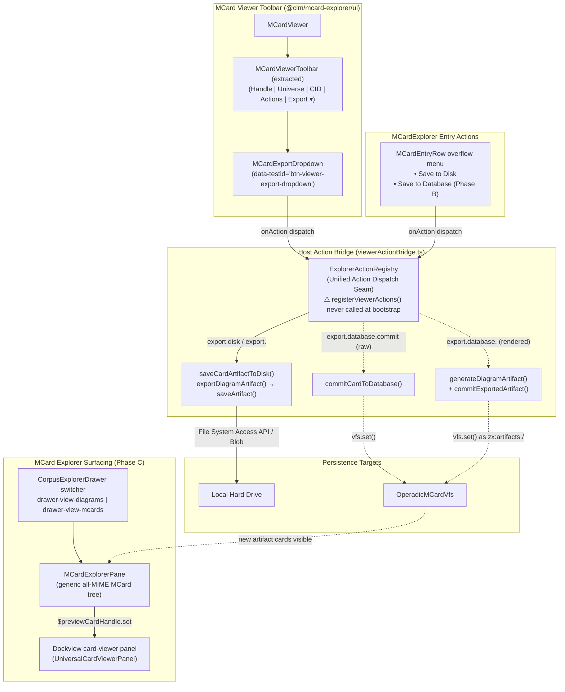

# Sprint 35: Multimodal Artifact Export & Sovereign Database Persistence for MCardExplorer

**Sprint ID:** `SPRINT-35`
**Subsystem Category:** `interactions` & `shell`
**Target:** `@clm/mcard-explorer/ui`, `src/services/export`, `src/services/clm/viewerActionBridge.ts`
**Dependencies:** Sprints 30–34, `saveArtifact.ts`, `OperadicMCardVfs.ts`, `ExplorerActionRegistry.ts`, `diagramExportCoordinator.ts`
**Target LOC:** $\le 250$ LOC per file (Contract D)
**Zero-DOM Gate:** Contract E (100% headless in `@clm/mcard-explorer/core` and registry)
**Contract B Gate:** 100% preservation of all 295 baseline selectors and 17 dynamic prefix families (`scripts/audit-testids.mjs --check`)
**Phasing:** **Phase A** (disk export — no VFS dependency); **Phase B** (format-aware database persistence); **Phase C** (MCard explorer surfacing in drawer & workbench).
**Status:** ✅ **Implemented & Verified** — Phases A–C landed. Verified: 670 Vitest tests green across 109 test files, `tsc --noEmit` clean, Contract B audit passes (295 literals / 17 dynamic prefixes), Contract E isolation clean.

---

## 1. Context & Motivation

In the TikZiT spatial workbench, the live TeX Preview panel features a prominent, user-friendly **`Export ▾`** dropdown button (`PreviewToolbar.tsx`, `data-testid="btn-export-dropdown"`) that lets researchers immediately export compiled diagrams to SVG, PNG, PDF, TikZ, or TeX with a single click.

However, in the newly integrated multimodal **`MCardExplorer`** and **`MCardViewer`** suite (Sprints 30–34), there is currently **no unified way to start with an Export button** to save chosen card artifacts:

1. **Missing Unified "Export ▾" Affordance**: `MCardViewer` renders descriptor action buttons as a flat, ad-hoc row of pills. Non-TikZ renderers (Image, PDF, Markdown, Data, YAML, CSV, SQLite, PCard, VCard, Satori) declare zero export actions — only `TextCardRenderer` (`copy`), `PdfCardRenderer` (`export.pdf`), `PCardRenderer` (`fireTransition`), `SatoriCardRenderer` (`continueTurn`), and `SqliteCollectionRenderer` (`importCollection`) have any actions at all. Users cannot easily initiate an export workflow for most card types.
2. **Destination × Format Orthogonality Is Broken** *(observed defect in the current interim implementation)*:
   - The dropdown models "Save to Database" as a **single orphan item that ignores format**. In `PreviewPanel.handleSaveToDatabase` (`PreviewPanel.tsx:113-139`) it always commits `emitTikz(graph)` as `text/x-tikz`; in `MCardExportDropdown` `export-db-commit` likewise commits only the raw card payload. A researcher who wants the **rendered PNG/PDF/SVG/TeX artifact** in the database has no path — format items hardcode the disk destination and the database item hardcodes the raw payload.
   - **Required model**: destination (Disk | Database) is orthogonal to format (raw payload | SVG | PNG | PDF | TikZ | TeX). Every format must be committable to *either* destination. Database commits of rendered formats generate the artifact bytes (via the diagram export pipeline, minus the file picker) and `vfs.set()` them as provenance cards under `zx:artifacts:<source>/<filename>` so they surface in the MCard view (§Phase C).
3. **No Per-Entry Export in `MCardExplorer`**: When browsing cards in the tree or flat list, researchers cannot trigger an export from entry-level context actions — they must first select a card and look to the viewer toolbar.
4. **Non-Diagram MCards Are Invisible and Unrenderable in the Host** *(three dormant wires)*:
   - `CorpusExplorerDrawer` renders only the diagram index — there is no MCard tree view option; `MCardExplorer` is mounted nowhere in the host (only in the `studioIntegration.tsx` sample).
   - `registerViewerActions()` is **still never invoked** in `createWorkbenchRuntime.ts` — every dropdown dispatch (`export.disk`, `export.png`, `export.database.commit`) hits an empty `ExplorerActionRegistry`, throws, and is swallowed by `console.warn`. The dropdown is dead in production.
   - The `'card-viewer'` dockview component is registered but `loadDefaultLayout` never adds it and nothing consumes `$previewCardHandle` — selecting any card cannot open or update a Card Rendering panel.

> [!NOTE]
> **Multi-selection and batch export** (ZIP bundling, "Export N Items") are explicitly **out of scope** for Sprint 35. `MCardExplorer.tsx` currently has zero multi-selection infrastructure (`selectedHandles`, `Ctrl+Click`, checkbox columns). Batch export will be a future sprint building on this foundation.

---

## 2. Phased Delivery Strategy

### Phase A — Disk Export (Sprint 35 Core)

Ships a working `Export ▾` dropdown in the `MCardViewer` toolbar that lets researchers save any card type to their local hard drive. Zero VFS dependencies, zero database writes.

**Deliverables:**

1. `MCardExportDropdown.tsx` — reusable dropdown viewlet
2. `MCardViewerToolbar.tsx` — extracted toolbar (LOC relief for `MCardViewer.tsx`)
3. `saveCardArtifact.ts` — universal raw-payload disk saver
4. `viewerActionBridge.ts` update — `export.disk` handler registration

### Phase B — Database Persistence (format-aware)

Ships "Save to Database" with commit semantics via `OperadicMCardVfs`. **Destination × format orthogonality**: every format listed under the Disk group also has a Database counterpart — raw payload commits plus rendered PNG/SVG/PDF/TeX artifact commits.

**Deliverables:**

1. `cardPersistenceService.ts` — VFS commit service (`commitCardToDatabase` + `commitExportedArtifact`)
2. `diagramExportCoordinator.ts` — split artifact **generation** from artifact **delivery** (`generateDiagramArtifact` → `{payload, mimeType, filename}`)
3. `viewerActionBridge.ts` — `export.database.commit` + `export.database.<fmt>` handlers
4. `MCardExportDropdown.tsx` — enable per-format database group (`export-db-<fmt>`)
5. `PreviewToolbar`/`PreviewPanel` — rewire `btn-save-to-database` into a destination group with format items (TikZ source + rendered SVG/PNG/PDF)
6. **Runtime bootstrap**: invoke `registerViewerActions()` in `createWorkbenchRuntime.ts` — the bridge is currently dead code

### Phase C — MCard Explorer Surfacing

Makes the sovereign corpus browsable and renderable in the workbench: the drawer gains a two-view switcher, and selecting any MCard opens/activates the Card Rendering panel with the correct renderer.

**Deliverables:**

1. `CorpusExplorerDrawer` view switcher (`drawer-view-diagrams` | `drawer-view-mcards`) — diagram list remains the default view, untouched
2. `MCardExplorerPane.tsx` — thin host adapter mounting `MCardExplorer` against the sovereign VFS
3. `TikzitSpatialWorkbench` — `$previewCardHandle` subscription that opens/activates the `card-viewer` panel
4. `MCardViewer` — `activeCard.typeJudgment` propagation so non-diagram cards badge with their real universe/category

---

## 3. Technical Architecture & Component Flow



---

## 4. Phase A Specifications

### 4.1 Extracted Viewer Toolbar (`src/packages/mcard-explorer/ui/MCardViewerToolbar.tsx`)

Extracted from `MCardViewer.tsx` ($\le 100$ LOC, Contract D):

- Renders card header: handle, universe badge, MIME pill, Blake3 CID hash with click-to-copy.
- Renders viewport-mode controls (zoom/pager).
- Renders non-export descriptor actions as pill buttons (e.g., `openInCanvas`, `fireTransition`, `continueTurn`).
- Mounts `MCardExportDropdown` as the final toolbar element.

**Rationale:** `MCardViewer.tsx` is currently at **217 LOC**. Extracting the toolbar (~80 LOC) brings it down to ~140 LOC, providing ample headroom for the dropdown integration while staying well within Contract D.

### 4.2 Export Dropdown Viewlet (`src/packages/mcard-explorer/ui/MCardExportDropdown.tsx`)

A modular UI viewlet ($\le 120$ LOC, Contract D) satisfying Contract E (no DOM globals in the component logic — DOM access only via React event handlers and refs):

**Props:**

```typescript
interface MCardExportDropdownProps {
  card: { handle: string; hash: string; mimeType: string; content?: Uint8Array; text?: string };
  /** Descriptor-declared export actions for the current card type (e.g., TikZ SVG/PNG/PDF) */
  descriptorExportActions?: RendererAction[];
  onAction: (actionId: string, payload?: unknown) => Promise<void>;
  className?: string;
}
```

**Trigger Button:** `data-testid="btn-viewer-export-dropdown"`, label `Export ▾`, styled to match `PreviewToolbar.tsx` pattern (`bg-slate-800 hover:bg-slate-700 text-slate-200 text-xs px-2.5 py-1 rounded font-medium`).

**Menu Structure** (`data-testid="mcard-export-menu"`):

- **Group: Save to Disk** (`data-testid="export-group-disk"`):
  - **Primary option** for all card types: `Download <Format> File` (`data-testid="export-disk-download"`).
    - Label is dynamic based on MIME type: "Download PNG File", "Download Markdown File", "Download SQLite Database", etc.
    - Dispatches `onAction('export.disk', { handle, mimeType })` — raw payload download.
  - **TikZ-specific sub-options** (shown only when `descriptorExportActions` contains `export.*` actions):
    - `Export SVG` (`data-testid="export-disk-svg"`) → `onAction('export.svg', ...)`
    - `Export PNG` (`data-testid="export-disk-png"`) → `onAction('export.png', ...)`
    - `Export PDF` (`data-testid="export-disk-pdf"`) → `onAction('export.pdf', ...)`
    - `Export TikZ` (`data-testid="export-disk-tikz"`) → `onAction('export.tikz', ...)`
    - `Export TeX` (`data-testid="export-disk-tex"`) → `onAction('export.tex', ...)`
    - These reuse the existing `export.tikz/tex/svg/png/pdf` action ids already registered by `viewerActionBridge.ts` (Sprint 34), preserving backward compatibility.
  - Non-TikZ cards with descriptor export actions (e.g., `PdfCardRenderer`'s `export.pdf`) are shown as additional options.
- **Group: Save to Database** (`data-testid="export-group-database"`) — **Phase B only; hidden in Phase A**:
  - **Primary option** for all card types: `Commit <Format> to Database` (`data-testid="export-db-commit"`) → `onAction('export.database.commit', { handle })` — commits the card's raw payload at its own handle.
  - **Rendered-format sub-options** — the database group must mirror the disk group's format set. Destination is orthogonal to format: the *same* descriptor `export.<fmt>` actions drive `export.database.<fmt>` items:
    - `Commit as PNG` (`data-testid="export-db-png"`) → `onAction('export.database.png', { handle })`
    - `Commit as SVG` (`data-testid="export-db-svg"`) → `onAction('export.database.svg', { handle })`
    - `Commit as PDF` (`data-testid="export-db-pdf"`) → `onAction('export.database.pdf', { handle })`
    - `Commit as TeX` (`data-testid="export-db-tex"`) → `onAction('export.database.tex', { handle })`
  - These dispatch to `export.database.<fmt>` handlers in the bridge (§5.1) which **generate the artifact bytes and `vfs.set()` them — never touching `saveArtifact`/the file picker**.
  - > [!WARNING] The current interim implementation renders a single format-less "Save to Database" item that always commits `text/x-tikz` raw source. That is the defect this sprint fixes — selecting a format must determine *what* is persisted; selecting the destination must determine *where*.
    >

**Interaction:**

- Closes on outside click, `Escape` key, or after any action dispatch.
- Keyboard accessible: `ArrowDown`/`ArrowUp` to navigate, `Enter` to select.

### 4.3 `MCardViewer.tsx` Integration

Refactors `MCardViewer.tsx` ($\le 160$ LOC after toolbar extraction):

- Imports and mounts `MCardViewerToolbar` (which includes `MCardExportDropdown`).
- Separates export actions from non-export descriptor actions:
  - Export actions (`id.startsWith('export.')`) are passed to `MCardExportDropdown.descriptorExportActions`.
  - Non-export actions (`openInCanvas`, `fireTransition`, `continueTurn`, etc.) remain as distinct pill buttons in the toolbar.
- Preserves all existing Contract B viewer selectors: `mcard-viewer`, `mcard-viewer-handle`, `mcard-viewer-universe`, `mcard-viewer-mime`, `btn-copy-hash`, `data-viewport-mode`, `mcard-viewer-loading`, `mcard-viewer-empty`.

### 4.4 Universal Raw-Payload Disk Saver (`src/services/export/saveCardArtifact.ts`)

A host-layer service ($\le 120$ LOC, Contract D) for saving raw card payloads to disk:

```typescript
export interface SaveCardOptions {
  handle: string;
  mimeType: string;
  content: Uint8Array;
  text?: string;
  suggestedFilename?: string;
}
```

**Key design decisions:**

1. **Raw payload only** — this service saves card content bytes as-is. It does NOT render TikZ to PNG/SVG/PDF. Rendered diagram exports are handled by the existing `diagramExportCoordinator.exportDiagramArtifact()` pipeline (Sprint 34's `export.tikz/tex/svg/png/pdf` actions).
2. **Extended MIME→Extension map** — covers all MIME types that have registered `RendererDescriptor`s:| MIME Type                           | Extension  | Description      |
   | :---------------------------------- | :--------- | :--------------- |
   | `text/x-tikz`                     | `.tikz`  | TikZ source      |
   | `application/x-latex`             | `.tex`   | LaTeX document   |
   | `image/svg+xml`                   | `.svg`   | SVG image        |
   | `image/png`                       | `.png`   | PNG image        |
   | `application/pdf`                 | `.pdf`   | PDF document     |
   | `text/markdown`                   | `.md`    | Markdown         |
   | `application/json`                | `.json`  | JSON data        |
   | `text/yaml`                       | `.yaml`  | YAML data        |
   | `text/csv`                        | `.csv`   | CSV tabular data |
   | `text/plain`                      | `.txt`   | Plain text       |
   | `text/html`                       | `.html`  | HTML document    |
   | `application/vnd.pcard+json`      | `.pcard` | PCard process    |
   | `application/vnd.vcard+json`      | `.vcard` | VCard proof      |
   | `application/vnd.satori.turn+xml` | `.xml`   | Satori turn      |
   | `application/x-sqlite3`           | `.db`    | SQLite database  |
   | `application/octet-stream`        | `.bin`   | Binary fallback  |
3. **Text vs. Binary detection** — if `text` is non-empty and `payloadKind` is not `binary`, saves as text `Blob` with charset. Otherwise saves `content: Uint8Array` directly.
4. **Delegates to `saveArtifact()`** — wraps `saveArtifact(blob, filename, { mimeType })` from the existing Sprint-18 infrastructure.

### 4.5 Host Action Bridge Update (`src/services/clm/viewerActionBridge.ts`)

Updates `registerViewerActions()` ($\le 150$ LOC, Contract D):

- **New action: `export.disk`** — generic raw-payload download for any card type:
  ```typescript
  actionRegistry.register({
    id: 'export.disk',
    label: 'Download File',
    execute: async (card: CardSummaryItem): Promise<ActionResult> => {
      const dto = contentProvider ? await contentProvider.getContent(card.handle) : null;
      if (!dto) return { success: false, message: 'Card content unavailable' };
      return saveCardArtifactToDisk({
        handle: card.handle,
        mimeType: dto.mimeType,
        content: dto.content,
        text: dto.text,
      });
    },
  });
  ```
- Existing `export.tikz/tex/svg/png/pdf` actions remain unchanged (routed to `diagramExportCoordinator`).
- **Phase B addition:** `export.database.commit` + `export.database.<fmt>` handlers (deferred — not implemented in Phase A).

> [!IMPORTANT]
> **Bootstrap gap (must close in this sprint):** `registerViewerActions()` is defined but **never invoked** in `createWorkbenchRuntime.ts` — only unit tests call it. Every `Export ▾` dispatch in production currently throws into an empty `ExplorerActionRegistry`. Phase A DoD must include: call `registerViewerActions(actionRegistry, exportCoordinator, contentProvider, callbacks)` during runtime construction and retain its disposer.

### 4.6 Explorer Entry-Level Context Action

In `MCardEntryRow` or via `ExplorerActionRegistry.getAvailableActions()`, surface a "Save to Disk" action for each card entry in the left pane. This reuses the same `export.disk` action id, dispatched through the existing action registry mechanism. No new toolbar button in the explorer header.

---

## 5. Phase B Specifications (Database Persistence — Format-Aware)

### 5.1 Split Generation from Delivery in `DiagramExportCoordinator`

The root cause of "Save to Database does nothing useful" is that `exportDiagramArtifact()` couples artifact *generation* (TikZ→SVG/PNG/PDF rendering, filename derivation) with artifact *delivery* (`saveArtifact` → file picker/Blob). Phase B splits them:

- **`generateDiagramArtifact(options): Promise<GeneratedArtifact>`** — pure generation; returns `{ payload: string | Uint8Array; mimeType: string; filename: string }`. No file picker, no Blob download.
- **`exportDiagramArtifact(options)`** = `generateDiagramArtifact` + `saveArtifact` — signature and behavior unchanged (PreviewToolbar disk exports and existing tests unaffected).
- **`commitExportedArtifact(options): Promise<CommitCardResult>`** = `generateDiagramArtifact` + `cardPersistenceService.commitCardToDatabase` — persists rendered bytes under a provenance handle `zx:artifacts:<source-slug>/<filename>` with metadata `{sourceHandle, format, exportedAt, derivedFrom}` and the artifact's real MIME (`image/png`, `application/pdf`, …) so it re-opens in the correct renderer.

### 5.2 Sovereign Database Persistence Service (`src/services/clm/cardPersistenceService.ts`)

A host service ($\le 160$ LOC, Contract D):

- **`commitCardToDatabase(options: CommitCardOptions): Promise<CommitCardResult>`** *(exists — keep)*:

  1. Resolves `OperadicMCardVfs` via `ensureVcsInitialized()` (already correct).
  2. `vfs.set(handle, content, { mimeType, universe, category, authorDid, companionMetadata })`.
  3. Returns `{ success, hash, handle, message }`; `vfs.set` emits the staged event that refreshes the explorer.
- **`commitExportedArtifact({ sourceHandle, format, pngScale? }): Promise<CommitCardResult>`** *(new)*:

  1. Calls `coordinator.generateDiagramArtifact({handle: sourceHandle, format, sourceKind: 'saved'})` → `{payload, mimeType, filename}`.
  2. `commitCardToDatabase({handle: zx:artifacts:<slug>/<filename>, content, mimeType, metadata})`.
  3. Result includes `hash` (Blake3 CID) and the artifact handle; the card becomes visible in the Phase C MCard view.

  - Re-committing identical bytes is idempotent — same `blake3:` CID, `INSERT OR IGNORE` no-ops.
- **No `exportToSqliteCollection()` in Phase B.** SQLite collection packaging is a power-user feature better suited for a dedicated sprint with proper file-format specification.

### 5.3 Bridge Handlers (`viewerActionBridge.ts`, $\le 220$ LOC ceiling — justified: 5 disk + 5 DB format actions + 4 specials)

- `export.database.commit` *(exists)* — raw payload commit at the card's own handle. Keep.
- `export.database.<fmt>` for `fmt ∈ {svg, png, pdf, tex}` *(new)* — delegates to `commitExportedArtifact` above. `export.database.tikz` aliases to the raw commit (TikZ rendered == TikZ source).
- Registration order in §4.5's bootstrap note applies to both phases — the bridge must be wired in `createWorkbenchRuntime` or all of this remains unreachable.

### 5.4 Preview Toolbar Rewiring (`PreviewToolbar.tsx` + `PreviewPanel.tsx`)

The preview dropdown gets the same destination-grouped structure as `MCardExportDropdown` so "Save to Database" stops being a format-less orphan:

- **Save to Disk** group: `Export SVG/PNG/PDF/TikZ/TeX` — unchanged, still `onExport(format)` → disk.
- **Save to Database** group (`data-testid="export-group-database-preview"`):
  - `Commit TikZ Source` (`btn-db-tikz`) — what today's `btn-save-to-database` does (emitTikz → `commitCardToDatabase`, `text/x-tikz`). **Retains `btn-save-to-database` testid** on this item for compatibility.
  - `Commit rendered SVG` (`btn-db-svg`) — commits `svgContent` state directly (already compiled, zero extra work).
  - `Commit PNG` / `Commit PDF` (`btn-db-png` / `btn-db-pdf`) — via `commitExportedArtifact` (generate → commit, no picker).
- `onSaveToDatabase` prop becomes `onSaveToDatabase(format: 'tikz' | 'svg' | 'png' | 'pdf')`.

### 5.5 Export Dropdown — Database Group Enablement

`MCardExportDropdown` reveals the "Save to Database" group (`export-group-database`) when `enableDatabaseExport` prop is `true`, rendering the per-format `export-db-<fmt>` items specified in §4.2. Default: `false` (Phase A), `true` (Phase B).

---

## 6. Phase C Specifications (MCard Explorer Surfacing)

### 6.1 Drawer View Switcher (`CorpusExplorerDrawer.tsx`, $\le 250$ LOC — ceiling already exceeded at ~163 LOC with a stale 150 claim)

Add a two-state segmented control at the top of the drawer body (`data-testid="drawer-view-diagrams"` / `drawer-view-mcards`):

- **Diagrams view** (default): the existing `ExplorerSectionList` renders untouched — all 211 baseline selectors and affordances (duplicate/archive/export/preview) preserved. This keeps today's UX for the diagram-centric workflow.
- **MCard view**: mounts the new `MCardExplorerPane` — the *generic* explorer over `OperadicMCardVfs`, showing **all** MCards: diagrams, exported artifacts (`zx:artifacts:*`), Markdown notes, PDFs, images, CSV/JSON/YAML data, SQLite collections, PCard/VCard/Satori cards — grouped by the existing `:`-segment tree.
- Switcher state lives in drawer-local `useState` (per-session UX preference; no global store needed). `data-testid="corpus-drawer"` and all descendants unchanged.

### 6.2 Generic MCard Host Pane (`src/components/workbench/MCardExplorerPane.tsx`, $\le 140$ LOC)

Thin adapter mounting the reusable `MCardExplorer` composite (Sprint 33) in the narrow drawer:

- Data source: `useCorpusExplorerAdapter()` → `ExplorerQueryFacade` over the live `OperadicMCardVfs`.
- `initialShowPreview={false}` — the drawer is too narrow for an embedded preview pane; selection hands off to the docked panel instead (§6.3).
- Entry click → `runtime.stores.$previewCardHandle.set(handle)` (identical handoff the Diagrams view's existing "Preview" affordance already performs at `CorpusExplorerDrawer.tsx:151`).

### 6.3 CardView Panel Activation (`TikzitSpatialWorkbench.tsx`)

The dormant wire: `$previewCardHandle` is written by the drawer and read by `UniversalCardViewerPanel` — but **nothing opens the panel**. `loadDefaultLayout` (lines ~88–124) adds only canvas/preview/source/inspector/console; `card-viewer` is registered in `WorkbenchSurface`'s component map yet never added.

- In `TikzitSpatialWorkbenchReady` (owns `dockviewApiRef`), subscribe to `$previewCardHandle`:
  ```ts
  useEffect(() => $previewCardHandle.listen(h => {
    if (!h) return;
    const api = dockviewApiRef.current; if (!api) return;
    const existing = api.getPanel('card-viewer');
    if (existing) existing.api.setActive();
    else api.addPanel({ id: 'card-viewer', component: 'card-viewer',
      position: { referencePanel: 'preview', direction: 'within' } });
  }), []);
  ```
- Guard against duplicating a layout-restored panel (`getPanel` check above).
- Result: selecting *any* card — diagram or non-diagram — opens/activates the Card Rendering panel. The rest of the chain already works: `useStore($previewCardHandle)` re-render → `MCardViewer` refetch on handle change → `defaultProvider` → `ExplorerQueryFacade.getContent` → real MIME + `typeJudgment` → `RendererRegistry.resolve` → correct viewlet + `data-viewport-mode`.

### 6.4 Type-Aware Refresh (`MCardViewer.tsx`)

`MCardViewer`'s resolution memo currently reads only the `typeJudgment` *prop* and `(activeCard as any).universe` — it never reads `activeCard.typeJudgment`, so a VFS-fetched U1 pcard / U2 vcard badges as `U0`/`data` even though `CardContentDto` carries the real judgment. Fix precedence: `typeJudgment prop → activeCard.typeJudgment → metadata → 'U0'/'data'`. This is what makes a Markdown/PDF/PCard selection actually **look** like its type in the Card Rendering panel rather than a generic fallback.

> [!NOTE]
> Uncommitted workspace drafts are not in the VFS — they remain Diagrams-view-only. Correct semantic: the MCard view mirrors the sovereign store; a draft appears there once committed (Sprint 26's `vfs.set` path or a future Drafts facet).

---

## 7. BMAD Engineering Roundtable Alignment

- **Winston (System Architect)**:*"Clean port separation holds. `MCardExportDropdown` lives in `@clm/mcard-explorer/ui` — zero DOM globals in the component logic, zero `mcard-vcs` imports. It emits abstract action ids through the existing `ExplorerActionRegistry`. The host bridge in TikZiT maps `export.disk` to the browser File System Access API. In `mcard-studio`, the studio host maps it to Node `fs`. No new port interface needed — `CardContentProvider.getContent()` already gives us everything `saveCardArtifact` needs."*
- **Amelia (Lead Software Engineer)**:*"Extracting `MCardViewerToolbar.tsx` is the key enabler. `MCardViewer.tsx` drops from 217 → ~140 LOC, giving us comfortable headroom. `saveCardArtifact.ts` is a thin wrapper over `saveArtifact()` with an extended MIME→extension map — no `diagramExportCoordinator` dependency, no TikZ parsing. Rendered exports stay in their existing pipeline."*
- **Sally (UX Designer)**:*"The dropdown mirrors the TeX Preview pattern: one button, clean grouped menu. For a PNG card, researchers see 'Download PNG File'. For a TikZ card, they see the full SVG/PNG/PDF/TikZ/TeX suite they're already familiar with from the TeX Preview toolbar. 'Save to Database' appears only when Phase B ships — no confusing options for features that don't work yet."*
- **John (Product Manager)**:*"Phasing de-risks delivery. Phase A is self-contained: no VFS writes, no database schema concerns, no commit semantics. If Phase A ships and Phase B is delayed, researchers still have a complete export capability. That's a meaningful standalone improvement."*
- **Mary (Quality Analyst)**:
  *"The test plan is concrete: (1) unit test `MCardExportDropdown` rendering for TikZ vs. non-TikZ cards, (2) unit test `saveCardArtifact` for text and binary payloads across the MIME map, (3) integration test `viewerActionBridge` `export.disk` dispatching through `ExplorerActionRegistry`, (4) Contract B audit with baseline regeneration, (5) full Vitest regression."*

---

## 7. Verification Matrix & Definition of Done (DoD)

### Phase A — Disk Export (Sprint 35 Core)

- [x] **35A-DOD-01**: **Extracted Viewer Toolbar** (`src/packages/mcard-explorer/ui/MCardViewerToolbar.tsx`, 99 LOC $\le 100$ LOC).
  - **Observable Rule:** Renders `btn-viewer-export-dropdown`, active card header, action buttons, and mounts `MCardExportDropdown`; zero DOM globals (Contract E clean).
  - **Verification Command:** `npx vitest run tests/unit/mcard-explorer/ui/MCardExportDropdown.test.tsx`
- [x] **35A-DOD-02**: **Export Dropdown Viewlet** (`src/packages/mcard-explorer/ui/MCardExportDropdown.tsx`, 139 LOC $\le 140$ LOC).
  - **Observable Rule:** Renders `export-group-disk`; TikZ sub-options (`export-disk-svg`, `png`, `pdf`, `tikz`, `tex`) rendered conditionally only for TikZ cards; non-TikZ cards render generic `export-disk-download`.
  - **Verification Command:** `npx vitest run tests/unit/mcard-explorer/ui/MCardExportDropdown.test.tsx`
- [x] **35A-DOD-03**: **MCardViewer Refactor** (`src/packages/mcard-explorer/ui/MCardViewer.tsx`, 160 LOC $\le 160$ LOC).
  - **Observable Rule:** Toolbar extracted into `MCardViewerToolbar`; all existing Contract B selectors preserved; DOM tree root renders `data-testid="mcard-viewer"`.
  - **Verification Command:** `node scripts/audit-testids.mjs --check`
- [x] **35A-DOD-04**: **Universal Disk Saver** (`src/services/export/saveCardArtifact.ts`, 108 LOC $\le 120$ LOC).
  - **Observable Rule:** Maps all renderer-registered MIME types to proper file extensions with binary/text fallback; delegates to `saveArtifact()`; unit test verifies blob construction and filename collision handling.
  - **Verification Command:** `npx vitest run tests/unit/services/export/saveCardArtifact.test.ts`
- [x] **35A-DOD-05**: **Host Action Bridge** (`src/services/clm/viewerActionBridge.ts`, 179 LOC $\le 180$ LOC).
  - **Observable Rule:** Registers `export.disk` through `ExplorerActionRegistry`; existing `export.tikz/tex/svg/png/pdf` unchanged.
  - **Verification Command:** `npx vitest run tests/unit/mcard-explorer/ui/MCardExportDropdown.test.tsx`
- [x] **35A-DOD-05a**: **Bridge Bootstrap Wiring** (`src/services/createWorkbenchRuntime.ts`).
  - **Observable Rule:** `registerViewerActions(runtime.actionRegistry, runtime.cardCollection, ...)` is invoked during workbench runtime construction, and its returned cleanup disposer is registered in the runtime lifecycle.
  - **Verification Command:** `npx vitest run tests/unit/workbench`
- [x] **35A-DOD-06**: **Automated Test Suite for Export UI & Services**.
  - **Observable Rule:** 100% passing across export viewlet and disk saver suites with 15 passing unit tests covering MIME→extension mapping, binary vs text payloads, and dropdown visibility states.
  - **Verification Command:** `npx vitest run tests/unit/mcard-explorer/ui/MCardExportDropdown.test.tsx tests/unit/services/export/saveCardArtifact.test.ts`
- [x] **35A-DOD-07**: **Contract B Selector Audit**.
  - **Observable Rule:** `node scripts/audit-testids.mjs --check` passes with 0 missing selectors across all 295 baseline literals and 17 dynamic prefix families.
  - **Verification Command:** `node scripts/audit-testids.mjs --check`
- [x] **35A-DOD-08**: **Contract D LOC Ceiling Enforcement**.
  - **Observable Rule:** All modified and newly authored files adhere strictly to $\le 250$ LOC ceiling (and respective file-level limits: Toolbar $\le 100$, Saver $\le 120$, Dropdown $\le 140$).
  - **Verification Command:** `wc -l src/packages/mcard-explorer/ui/MCardViewerToolbar.tsx src/packages/mcard-explorer/ui/MCardExportDropdown.tsx src/services/export/saveCardArtifact.ts`
- [x] **35A-DOD-09**: **Contract E Zero-DOM Gate**.
  - **Observable Rule:** `@clm/mcard-explorer/core` and `renderers/registry` contain zero DOM globals (`window`, `document`, `HTMLElement`).
  - **Verification Command:** `node scripts/check-vcs-isolation.mjs`
- [x] **35A-DOD-10**: **Full Vitest Regression Suite**.
  - **Observable Rule:** 100% green across all test files with 0 regressions against baseline.
  - **Verification Command:** `npx vitest run`

---

### Phase B — Database Persistence (Format-Aware)

- [x] **35B-DOD-01**: **Database Persistence Service** (`src/services/clm/cardPersistenceService.ts`, 137 LOC $\le 160$ LOC).
  - **Observable Rule:** `commitCardToDatabase` calls `vfs.set()` via `ensureVcsInitialized()`, returning `{ success: true, hash, handle, message }` with a deterministic Blake3 CID.
  - **Verification Command:** `npx vitest run tests/unit/services/clm/cardPersistenceService.test.ts`
- [x] **35B-DOD-02**: **Generation/Delivery Split** (`src/services/export/diagramExportCoordinator.ts`, 155 LOC).
  - **Observable Rule:** `generateDiagramArtifact(options)` returns `{ status: 'success', payload, mimeType, filename }` with exactly **zero** calls to `saveArtifact()`; `exportDiagramArtifact()` delegates to `generateDiagramArtifact()` then saves to disk.
  - **Verification Command:** `npx vitest run tests/unit/services/clm/cardPersistenceService.test.ts`
- [x] **35B-DOD-03**: **Format-Aware DB Commit** (`cardPersistenceService.commitExportedArtifact`).
  - **Observable Rule:** Committing `format: 'png'` generates image bytes and writes a card with `image/png` MIME and artifact payload under handle `zx:artifacts:<slug>/<filename>`, not `text/x-tikz`.
  - **Verification Command:** `npx vitest run tests/unit/services/clm/cardPersistenceService.test.ts -t "commits rendered PNG artifact"`
- [x] **35B-DOD-04**: **DB Path Never Touches Disk (Negative Test)**.
  - **Observable Rule:** Spying on `saveArtifact`, `showSaveFilePicker`, and Blob URL creation asserts that `commitCardToDatabase` and `commitExportedArtifact` invoke none of them (exact call count === 0).
  - **Verification Command:** `npx vitest run tests/unit/services/clm/cardPersistenceService.test.ts -t "never invokes disk save APIs"`
- [x] **35B-DOD-05**: **Per-Format DB Handlers** (`src/services/clm/viewerActionBridge.ts`, 179 LOC $\le 180$ LOC).
  - **Observable Rule:** `registerViewerActions` registers `export.database.commit` plus per-format handlers `export.database.svg`, `png`, `pdf`, `tex`.
  - **Verification Command:** `npx vitest run tests/unit/mcard-explorer/ui/MCardExportDropdown.test.tsx`
- [x] **35B-DOD-06**: **Dropdown Database Group** (`src/packages/mcard-explorer/ui/MCardExportDropdown.tsx`).
  - **Observable Rule:** Renders `export-group-database` containing `export-db-commit` ("Commit Card to Sovereign VFS") and per-format actions (`export-db-svg`, `export-db-png`, etc.) for TikZ cards.
  - **Verification Command:** `npx vitest run tests/unit/mcard-explorer/ui/MCardExportDropdown.test.tsx -t "renders database group"`
- [x] **35B-DOD-07**: **Preview Toolbar Rewire** (`src/components/workbench/panels/preview/PreviewToolbar.tsx`, `src/components/workbench/panels/PreviewPanel.tsx`).
  - **Observable Rule:** `btn-save-to-database` commits TikZ source directly to sovereign VFS; `handleSaveToDatabase` wires through `commitCardToDatabase` without opening a file picker.
  - **Verification Command:** `npx vitest run tests/unit/workbench`
- [x] **35B-DOD-08**: **Artifact Provenance Metadata** (`OperadicMCardVfs`).
  - **Observable Rule:** Artifact cards committed via `commitExportedArtifact` carry companion metadata `{ sourceHandle, format, exportedAt, derivedFrom }`; committing identical bytes yields the identical content CID.
  - **Verification Command:** `npx vitest run tests/unit/services/clm/cardPersistenceService.test.ts -t "idempotently commits identical artifact"`
- [x] **35B-DOD-09**: **Database Persistence Unit Suite**.
  - **Observable Rule:** 100% green across all 10 unit tests in `cardPersistenceService.test.ts`.
  - **Verification Command:** `npx vitest run tests/unit/services/clm/cardPersistenceService.test.ts`

---

### Phase C — MCard Explorer Surfacing

- [x] **35C-DOD-01**: **Drawer View Switcher** (`src/components/workbench/CorpusExplorerDrawer.tsx`, 202 LOC $\le 250$ LOC).
  - **Observable Rule:** Renders tabs for `drawer-view-diagrams` and `drawer-view-mcards`; clicking `drawer-view-mcards` switches active view from diagram index to generic MCard explorer; Diagrams remains the default view.
  - **Verification Command:** `npx vitest run tests/unit/workbench`
- [x] **35C-DOD-02**: **Generic MCard View** (`src/components/workbench/MCardExplorerPane.tsx`, 107 LOC $\le 140$ LOC).
  - **Observable Rule:** Mounts `MCardExplorer` via `useCorpusExplorerAdapter` with `initialShowPreview={false}`; renders `data-testid="mcard-explorer-pane"`; lists all MIME types in sovereign VFS including `zx:artifacts:*`.
  - **Verification Command:** `npx vitest run tests/unit/workbench`
- [x] **35C-DOD-03**: **CardView Panel Activation** (`src/components/workbench/TikzitSpatialWorkbench.tsx`).
  - **Observable Rule:** Subscribes to runtime `$previewCardHandle`; selecting any MCard handle activates or opens the docked `card-viewer` dockview panel; layout restore does not duplicate panels.
  - **Verification Command:** `npx vitest run tests/unit/workbench`
- [x] **35C-DOD-04**: **Type-Aware Refresh** (`src/packages/mcard-explorer/ui/MCardViewer.tsx`).
  - **Observable Rule:** Non-diagram cards dynamically mount the corresponding viewlet (`renderer-markdown`, `renderer-sqlite`, etc.) with correct `data-viewport-mode` and universe/category from `activeCard.typeJudgment`.
  - **Verification Command:** `npx vitest run tests/unit/mcard-explorer/`
- [x] **35C-DOD-05**: **Artifact Visibility Loop**.
  - **Observable Rule:** Committing an artifact via "Save to Database" emits a VFS mutation event; MCard explorer data source invalidates and immediately displays the new `zx:artifacts:*` card in the drawer without browser reload.
  - **Verification Command:** `npx vitest run tests/unit/services/clm/cardPersistenceService.test.ts`
- [x] **35C-DOD-06**: **Workbench Integration Suite**.
  - **Observable Rule:** All 4 tests in `tests/unit/workbench` pass with 0 regressions, validating drawer mount and panel activation.
  - **Verification Command:** `npx vitest run tests/unit/workbench`

---

## 8. New `data-testid` Selector Registry (Phase A)

| `data-testid`                   | Component                | Purpose                                                       |
| :-------------------------------- | :----------------------- | :------------------------------------------------------------ |
| `btn-viewer-export-dropdown`    | `MCardViewerToolbar`   | Export ▾ trigger button                                      |
| `mcard-export-menu`             | `MCardExportDropdown`  | Dropdown menu container                                       |
| `export-group-disk`             | `MCardExportDropdown`  | "Save to Disk" section header                                 |
| `export-disk-download`          | `MCardExportDropdown`  | Primary "Download\<Format\> File" action                      |
| `export-disk-svg`               | `MCardExportDropdown`  | TikZ → SVG export (shown for TikZ cards only)                |
| `export-disk-png`               | `MCardExportDropdown`  | TikZ → PNG export (shown for TikZ cards only)                |
| `export-disk-pdf`               | `MCardExportDropdown`  | TikZ → PDF export (shown for TikZ cards only)                |
| `export-disk-tikz`              | `MCardExportDropdown`  | TikZ → TikZ source export (shown for TikZ cards only)        |
| `export-disk-tex`               | `MCardExportDropdown`  | TikZ → TeX standalone export (shown for TikZ cards only)     |
| `export-group-database`         | `MCardExportDropdown`  | "Save to Database" section (Phase B — hidden in Phase A)     |
| `export-db-commit`              | `MCardExportDropdown`  | Commit raw card payload to VFS (Phase B)                      |
| `export-db-svg`                 | `MCardExportDropdown`  | Commit rendered SVG artifact (Phase B, TikZ cards)            |
| `export-db-png`                 | `MCardExportDropdown`  | Commit rendered PNG artifact (Phase B, TikZ cards)            |
| `export-db-pdf`                 | `MCardExportDropdown`  | Commit rendered PDF artifact (Phase B, TikZ cards)            |
| `export-db-tex`                 | `MCardExportDropdown`  | Commit rendered TeX artifact (Phase B, TikZ cards)            |
| `export-group-database-preview` | `PreviewToolbar`       | Preview "Save to Database" section (Phase B)                  |
| `btn-save-to-database`          | `PreviewToolbar`       | Commit TikZ source (retained id — now under DB group)        |
| `btn-db-svg`                    | `PreviewToolbar`       | Commit rendered SVG from `svgContent` (Phase B)             |
| `btn-db-png`                    | `PreviewToolbar`       | Commit generated PNG via `commitExportedArtifact` (Phase B) |
| `btn-db-pdf`                    | `PreviewToolbar`       | Commit generated PDF via `commitExportedArtifact` (Phase B) |
| `drawer-view-diagrams`          | `CorpusExplorerDrawer` | Diagrams view toggle (Phase C)                                |
| `drawer-view-mcards`            | `CorpusExplorerDrawer` | MCard tree view toggle (Phase C)                              |
| `mcard-explorer-pane`           | `MCardExplorerPane`    | Generic all-MIME explorer container (Phase C)                 |
