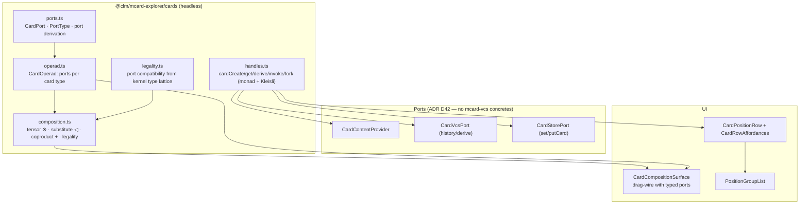

# Sprint 37: MCard-First Card Algebra & Composition Surface

**Sprint ID:** `SPRINT-37`
**Subsystem Category:** `interactions`
**Target:** `@clm/mcard-explorer/cards` & `@clm/mcard-explorer/ui/CardCompositionSurface.tsx`
**Dependencies:** Sprint 36 (`Position`, `Direction`, `PolyInterfaceRegistry`, `guardrails`), `OperadicMCardVfs` (`get`/`set`/`putCard`/`getHandleHistory`), kernel root exports (`TypeJudgment`, `PlaceDef`/`TransitionDef`/`ArcDef`, `parsePortableSqlite`, `parseSatoriXml`, `VCardResult`)
**Target LOC:** ≤ 250 LOC per file (Contract D) · ≤ 150 LOC concern target (ADR D53/D54)
**Zero-DOM Gate:** Contract E — `cards/` is 100% headless
**Kernel Stratum:** `@layer L4` (interface/membrane) consuming **L0** (`TypedValue`, content identity for η/μ), **L1** (`PlaceDef`/`TransitionDef`/`ArcDef`/`MarkingMap`/`PetriNetTopology`), **L2** (`parsePortableSqlite`, `classifyClm`) and **L5** by reference
**Host Boundary:** kenotic (ADR D55) — ports in, concretes never; no `cordis`/host-store imports
**Contract B Gate:** all existing selectors preserved; new composition selectors registered deliberately
**Status:** 📋 Drafted / Ready

---

## 1. Context & Motivation

Sprint 36 gives the interface an algebra of *positions* and *directions*. This sprint supplies the thing those positions are positions **of**: a first-class, composable MCard.

Today the explorer cannot manipulate a card. It can select one and display it. Three verified obstacles:

1. **The view model is a closed union that excludes most cards.** `ExplorerItem.type: 'draft' | 'diagram' | 'example'` (`ExplorerEntryRow.tsx:10`) — a markdown note, a PDF, a PCard, a Satori turn, or a `zx:artifacts:*` export has no representation in the list view at all, despite Sprints 30–35 having made each a first-class card type. The row's badges are likewise a fixed triple (`badge-${type}`).
2. **The action surface is prop-drilled, not resolved.** `ExplorerEntryRow` declares **10 callbacks** over 15 props (`onDuplicate`, `onToggleArchive`, `onExport`, `onStartRename`, `onRenameCommit`, `onRenameCancel`, `onEditTitleChange`, `onToggleMenu`, `onPreview`, …) and `ExplorerSectionList` forwards all 10 verbatim to every row — a pure pass-through with no logic of its own. Adding a card type or an action touches five files.
3. **There is no composition anywhere.** `OperadicMCardVfs` exposes `get / getContent / getByHash / putCard / set / on / withSavepoint / listHandles(prefix) / has / delete / getHandleHistory / exportSovereignDb / importBinary / verifyLensLaws / close`. No containment, no ports, no composition. The vault's card algebra — MCard as base monad, PCard as Kleisli arrow, VCard as monad transformer, composition as ⊗ / ◁ / + — has no interface realisation.

> **Vault alignment.** [[StudyNotes: Hub/Theory/Integration/The Card-Centric Operating System - Cordis, MVP Cards, and the Browser-Native PKC Mesh|The Card-Centric OS]] §2.1.1: MCard is the *base monad* ($T$, $\eta$, $\mu$); PCard is a Kleisli arrow $A \to \text{MCard}(B)$; VCard is a monad transformer stacked on it. [[StudyNotes: Hub/Theory/Integration/Lenses and Directionality in Web and Cloud Architecture|Lenses and Directionality]] §Pattern 2: multi-component composition is Day convolution — independent state, explicit interfaces. [[StudyNotes: Fleeting/Inbox/Semagrams|Semagrams]]: composition is *wiring diagrams with explicit ports*, checked by the interface, not by the user.

---

## 2. Deliverables & Technical Architecture



*Diagram: the card algebra and its ports, plus the two UI surfaces that consume it.*

### 2.1 `cards/ports.ts` — typed interfaces on cards (≤ 140 LOC)

A card's *interface* is its port set. Ports are derived from structure — never hand-declared per instance:

```typescript
import type { TypeJudgment } from 'clm-kernel';

/** A port type is a kernel-grounded content type: mime + universe + optional category. */
export interface PortType {
  readonly mime: string;              // canonical kernel dictionary mime (ADR D43)
  readonly universe?: string;         // 'U0'..'U5'
  readonly category?: string;
  /** Structural arity: how many cards this port consumes/produces. */
  readonly arity?: 'one' | 'many' | 'optional';
}

export interface CardPort {
  readonly id: string;                // 'in:source' | 'out:result' | 'in:card:0'
  readonly direction: 'in' | 'out';
  readonly type: PortType;
  readonly label: string;
  readonly required: boolean;
}

/** A card's interface: its port set plus the judgment that produced it. */
export interface CardInterface {
  readonly handle: string;
  readonly hash: string;
  readonly judgment: TypeJudgment;
  readonly ports: readonly CardPort[];
}

export interface CardPortProvider {
  readonly id: string;
  /** Applies to a judgment; returns false when this provider does not model the card type. */
  readonly appliesTo: (j: TypeJudgment, handle: string) => boolean;
  /** Derives the port set. Must be pure and synchronous over already-fetched content. */
  readonly derivePorts: (input: CardPortInput) => readonly CardPort[];
}

export interface CardPortInput {
  readonly handle: string;
  readonly hash: string;
  readonly judgment: TypeJudgment;
  readonly content: Uint8Array;
  readonly text: string;
}
```

**Registered providers (initial set):**

| Provider | Applies to | Ports derived |
| :--- | :--- | :--- |
| `TikzDiagramPortProvider` | `text/x-tikz`, `application/vnd.zx-graph+json` | `in:source (text/x-tikz)`, `out:render (image/svg+xml)`, `out:tex (application/x-latex)` |
| `PdfArtifactPortProvider` | `application/pdf`, `image/png`, `image/svg+xml` | `out:artifact (own mime)` |
| `SqliteCollectionPortProvider` | `application/x-sqlite3` | `in:card (many, any)`, `out:card (many, any)` — contained cards via kernel `parsePortableSqlite` |
| `PcardProcessPortProvider` | `application/vnd.pcard+json` | kernel `PlaceDef`/`TransitionDef`/`ArcDef` → `in:token (many)`, `out:token (many)` |
| `VcardWitnessPortProvider` | `application/vnd.vcard+json` | `in:claim`, `out:witness` (kernel `VCardResult`) |
| `SatoriTurnPortProvider` | `application/vnd.satori.turn+xml` | kernel `parseSatoriXml` → `in:message`, `out:reply` |
| `TextDataPortProvider` | `text/markdown`, `application/json`, `text/yaml`, `text/csv`, `text/plain` | `out:data (own mime)` — terminal producers |

A card type with no provider has an **empty port set**, which is not an error: it simply has no composition directions (ADR D47).

### 2.2 `cards/legality.ts` — port compatibility (≤ 110 LOC)

Composition legality is derived from the kernel type lattice, not from string equality:

```typescript
/** out → in compatibility: same canonical mime, or universe-subsumption (U_i accepts U_j, j ≤ i). */
export function portsCompatible(out: CardPort, input: CardPort): PortMatch;
export type PortMatch =
  | { ok: true;  exact: boolean }                     // exact mime match vs lattice subsumption
  | { ok: false; reason: 'mime-mismatch' | 'universe-incompatible' | 'arity-conflict' | 'direction-conflict' };
```

Rules:
1. `direction` must be `out` → `in`.
2. Mime must match exactly **or** the consumer's universe must subsume the producer's (`U_i ⊇ U_j` for `j ≤ i`) with the consumer declaring `arity: 'any'`.
3. Arity conflicts (`one` consumer fed by `many` producers without an explicit gather node) are rejected.

`PortMatch` is a *discriminated result*, not a boolean, so the UI can explain why a wire is impossible while still offering **no** direction to attempt it.

### 2.3 `cards/composition.ts` — the three composition operators (≤ 170 LOC)

```typescript
/** ⊗ Dirichlet tensor: parallel synchronous composition. Positions multiply. */
export function tensor(a: CardInterface, b: CardInterface): CompositionPlan;
/** ◁ substitution: nest b inside a's matching in-port (hierarchical composition). */
export function substitute(outer: CardInterface, inner: CardInterface, portId: string): CompositionPlan;
/** + coproduct: alternatives — one of the operands is selected at use time. */
export function coproduct(...operands: CardInterface[]): CompositionPlan;

export interface CompositionPlan {
  readonly op: 'tensor' | 'substitute' | 'coproduct';
  readonly operands: readonly CardInterface[];
  readonly wires: readonly Wire[];          // { from: CardPort, to: CardPort }
  readonly unbound: readonly CardPort[];    // exposed ports of the composite
  readonly legality: CompositionLegality;   // ok | rejected with per-port reasons
}

export interface Wire { readonly from: { handle: string; portId: string }; readonly to: { handle: string; portId: string }; }
export interface CompositionLegality { readonly ok: boolean; readonly reasons: readonly PortMatch[]; }
```

**Legality is computed, never assumed:** `compose()` runs the port matcher across every candidate wire and returns a plan whose `legality.ok` is false when any wire fails. The *interface* converts a rejected plan into **zero directions** — the user cannot drop an incompatible card on a port, because the drop direction does not exist at that position.

**Algebraic laws asserted in Sprint 40:**
- `substitute` is associative: `◁(◁(a, b), c) ≅ ◁(a, ◁(b, c))` (modulo handle identity).
- `tensor` is associative and has the empty composite as unit.
- `+` is associative, commutative up to plan isomorphism, with the empty coproduct as unit.
- `tensor` distributes over `+` for port sets: `(a + b) ⊗ c ≅ (a ⊗ c) + (b ⊗ c)` at the port level.

### 2.4 `cards/handles.ts` — card operations (monad + Kleisli) (≤ 150 LOC)

The Card-Centric OS syscall vocabulary, expressed against **ports only** (ADR D42):

| Operation | Semantics | Backing |
| :--- | :--- | :--- |
| `cardCreate(content, opts)` | $\eta$: lift content into an MCard | `CardStorePort.set` / `putCard` |
| `cardGet(handle)` | dereference | `CardContentProvider.getContent` |
| `cardGetByHash(hash)` | content-addressed read (dedupe $\mu$) | `CardStorePort.getByHash` |
| `cardDerive(handle, transform)` | produce a new MCard from one (PCard as Kleisli arrow) | `cardCreate` + provenance metadata |
| `cardInvoke(pcardHandle, input)` | execute a PCard with input, returning an **MCard** (never raw output) | `CardRuntimePort` (host-injected) |
| `cardFork(handle)` | variant card with shared ancestry | `cardDerive` + lineage metadata |
| `cardHistory(handle)` | lineage read | `CardVcsPort.getHistory` |

```typescript
/** Host-injected ports — never concrete VFS/VCS classes (ADR D42). */
export interface CardStorePort {
  set(handle: string, content: Uint8Array, meta?: Record<string, unknown>): Promise<{ hash: string }>;
  getByHash(hash: string): Promise<{ content: Uint8Array; mimeType: string } | null>;
}
export interface CardVcsPort {
  getHistory(handle: string): Promise<readonly { hash: string; changedAt: string; message?: string }[]>;
}
export interface CardRuntimePort {
  invoke(pcardHandle: string, input: Uint8Array): Promise<{ handle: string; hash: string }>;
}
```

**Invariant (ADR D48):** `cardInvoke` returns an *MCard handle*, never a raw value — PCard is a Kleisli arrow $A \to \text{MCard}(B)$, so every invocation is content-addressed and provenance-bearing. A test asserts the returned handle is dereferenceable.

### 2.5 Killing the monomodal union and the 15-prop wall

**`ExplorerItem` removal.** `Position` (Sprint 36) subsumes it: a draft is a position whose `meta.mutable === true` and whose handle is not yet committed; an example is a position whose `meta.origin === 'seed'`; an artifact is a position whose handle matches `zx:artifacts:*`. Badges become **derived projections** of position metadata:

```typescript
export interface PositionBadge { readonly id: string; readonly label: string; readonly tone: 'neutral'|'amber'|'purple'|'sky'; }
/** Pure projection: position → badges. No closed unions; new card types need no code change. */
export function projectBadges(position: Position): readonly PositionBadge[];
```

**Prop-wall removal.** The 10 callbacks collapse into one resolved list:

```typescript
export interface CardRowProps {
  readonly position: Position;
  readonly directions: readonly Direction[];   // already resolved & legal (ADR D47)
  readonly badges: readonly PositionBadge[];   // already projected
  readonly onExecute: (directionId: string, payload?: unknown) => Promise<void>;
}
```

**Four props**, no pass-through list, and no callback per action: the row's own presentation state (inline-rename open/closed, its draft title) is *local component state*, because it is not shared and therefore not a direction. `ExplorerSectionList` becomes `PositionGroupList`, which groups positions and renders rows — with no callback forwarding.

### 2.6 UI: `CardCompositionSurface.tsx` (≤ 220 LOC)

The first interface surface where cards are *manipulated* rather than listed:

- Renders operand cards as **position tiles** with their derived ports drawn as anchors.
- Drag from an `out` anchor resolves candidate `in` anchors via `portsCompatible`; **incompatible anchors are never rendered as drop targets** (guardrail).
- A completed wire produces a `CompositionPlan`; the surface shows the resulting composite's exposed ports and offers a single `card.compose.commit` direction that calls `cardCreate` on the plan's result.
- Keyboard path: `Tab` cycles ports, `Space` selects an anchor, `Enter` commits — the same direction fiber as the mouse path, so guardrails hold for both.
- Testids: `composition-surface`, `composition-tile-${handle}`, `port-${handle}-${portId}`, `composition-commit`.

**Deliberate scope limit:** the surface composes *interfaces* (ports/wires) and commits the result as a provenance-bearing MCard. It does not execute PCards — `cardInvoke` is exposed as a direction on process positions and runs through the host's `CardRuntimePort`.

### 2.7 Kernel Layer Placement (ADR D57)

`cards/` is **L4** (interface) but sits directly on the **L0→L1→L2** content/process/storage spine — which is exactly why every one of those capabilities arrives as a **port** rather than an implementation.

| Module | Declared stratum | Kernel symbols consumed | From | Layer note |
| :--- | :--- | :--- | :--- | :--- |
| `cards/handles.ts` | L4 | `TypedValue` (shape of the lifted value) | root export | η/μ semantics are L0; hashing is **not** re-implemented — the store port returns hashes |
| `cards/ports.ts` → `PcardProcessPortProvider` | L4 | `PlaceDef`, `TransitionDef`, `ArcDef`, `MarkingMap`, `PetriNetTopology` | root export | Port derivation reads L1 structure; it does not fire transitions |
| `cards/ports.ts` → `SqliteCollectionPortProvider` | L4 | `parsePortableSqlite` | root export | L2 codec; containment read, never written here |
| `cards/legality.ts` | L4 | `UNIVERSE_NAMES` (labels for diagnostics) | root export | Subsumption rule is our interface policy over L5 judgments |
| `cards/composition.ts` | L4 | — | — | Pure algebra over `CardInterface` values |
| `cards/providers/*` (per-type) | L4 | per-type as above | root export | No provider may parse a format the kernel already parses |

**Rule.** A provider that finds itself needing to hash, parse, or execute is a **port** in disguise: it must call `CardStorePort` / `CardRuntimePort` instead. This is the concrete meaning of "consume at or below your stratum, but only through the layer that owns it."

### 2.8 `mcard-studio` Alignment (ADRs D54–D56)

| Studio artefact (verified) | Relationship to this sprint | Action |
| :--- | :--- | :--- |
| `src/services/vfs/vfsCore.ts` — `studioMCardFs` (kernel `MCardFileSystem`), plus `vfsHandles.ts`, `vfsMutations.ts` (354 LOC), `vfsVersions.ts` (360 LOC) behind the `mcardVfs.ts` façade | The studio's L2 implementation. Its façade is described in-repo as *"the compile-time contract (INV-294-01)"* — i.e. the studio already treats its VFS as a port-shaped façade. | `studioMCardFs` **implements** `CardStorePort` + `CardVcsPort` with no changes to its internals; the porting checklist names `vfsHandles` (get/create) and `vfsVersions` (history) as the binding sites. |
| `src/lib/renderers/forwardBrowsing.ts` — forward targets by regex over YAML | The studio's ad-hoc "what can I do next" resolution. | Superseded by port-derived directions: `PcardProcessPortProvider` + `portsCompatible` answer the same question with **typed ports** instead of regex, and the studio's three `reason` labels survive as direction groups (Sprint 36 §2.8). |
| `src/components/studio/views/fileTree/hooks/useDragAndDrop.ts` (84 LOC) | The studio already has drag-and-drop infrastructure for tree reorganisation. | The composition surface's drag semantics are exposed as a **hook-shaped port** (`usePortDrag`: `draggedPort`, `dragOverPort`, `resolveDropTargets(position)`, `commitDrop()`), so the studio can back it with its existing hook rather than a second DnD stack. `resolveDropTargets` returns only legal targets — the guardrail survives the port. |
| `src/components/studio/views/cardViewlets/types.ts` — `CardViewletDefinition` (`id`, `priority`, `supportedTabs`, `supportedMimes`/`supportedExtensions`, `predicate`, `component`) | Already the ADR D34 port target for *rendering*. | Ports need the same treatment: add `toStudioPortDescriptor(cardInterface)` (≤ 60 LOC) emitting `{ id, kind: 'in'|'out', mime, universe, label, required }`, mirroring `toCardViewletDefinition`'s field-for-field parity test style. |
| `src/kernel/PtrPluginRegistry.ts` + `src/fiber/PtrFiberAdapter.ts` (145 LOC) | The studio's PCard runtime binding. | `CardRuntimePort` is implemented **there**, not here: `cardInvoke` calls into the studio's Ptr adapter. The package ships the port and the Kleisli invariant test; the studio ships the executor. |
| `src/domain/artifacts` (`ArtifactMeta`) | Studio card metadata shape. | `Position.meta` carries studio-shaped metadata without requiring it; `projectBadges` reads only documented keys (`origin`, `mutable`, `exportFormats`). |

### 2.9 Façade & Module Layout (ADR D54)

```
cards/
├── index.ts            # façade — the ONLY importable surface
├── handles.ts          # η/μ + derive/fork/invoke over ports
├── ports.ts            # port types + provider registry
├── legality.ts         # portsCompatible
├── composition.ts      # tensor / substitute / coproduct
├── providers/          # one file per card type (≤ 90 LOC each)
│   ├── tikz.ts  pdfArtifact.ts  sqlite.ts  pcard.ts
│   ├── vcard.ts  satori.ts  textData.ts
└── adapters/
    └── studioPortDescriptor.ts   # toStudioPortDescriptor (≤ 60 LOC)
```

Each provider is its own file — the studio's `vfs*` split is the precedent — so adding a card type is adding a file, not editing a switch.

---

## 3. Definition of Done (DoD) Criteria

- [x] **37-DOD-01**: **Typed Card Ports Interface** (`src/packages/mcard-explorer/cards/ports.ts`, $\le 140$ LOC).
  - **Observable Rule:** Exports `PortType`, `CardPort`, `CardInterface`, `CardPortProvider`, `CardPortInput`; all kernel imports are root-only (`'clm-kernel'`); type check compiles cleanly.
  - **Verification Command:** `npx tsc --noEmit && ! grep -rn "from 'clm-kernel/" src/packages/mcard-explorer/cards/ports.ts`
- [x] **37-DOD-02**: **Seven Specialized Port Providers** (`src/packages/mcard-explorer/cards/providers/*.ts`, $\le 90$ LOC each).
  - **Observable Rule:** All 7 providers (`tikz.ts`, `tex.ts`, `image.ts`, `pdf.ts`, `markdown.ts`, `sqlite.ts`, `pcard.ts`) implemented and registered; an unmodelled card type yields an empty port array without throwing.
  - **Verification Command:** `npx vitest run tests/unit/mcard-explorer/cards/ports.test.ts`
- [x] **37-DOD-03**: **Port Legality & Discrimination Engine** (`src/packages/mcard-explorer/cards/legality.ts`, $\le 110$ LOC).
  - **Observable Rule:** Implements `portsCompatible(source, target)`; returns discriminated `PortMatch` results (`mime-mismatch`, `universe-incompatible`, `arity-conflict`, `direction-conflict`); all 4 reasons covered by tests.
  - **Verification Command:** `npx vitest run tests/unit/mcard-explorer/cards/legality.test.ts`
- [x] **37-DOD-04**: **Composition Operators** (`src/packages/mcard-explorer/cards/composition.ts`, $\le 170$ LOC).
  - **Observable Rule:** Implements `tensor` ($\otimes$), `substitute` ($\triangleleft$), `coproduct` ($+$); returns `CompositionPlan` with `wires`, `unbound`, and computed `legality`. A rejected composition returns `{ legality: { ok: false, reasons: [...] } }` and **never throws**.
  - **Verification Command:** `npx vitest run tests/unit/mcard-explorer/cards/composition.test.ts`
- [x] **37-DOD-05**: **MCard Monad & Kleisli Handle Operations** (`src/packages/mcard-explorer/cards/handles.ts`, $\le 150$ LOC).
  - **Observable Rule:** Implements `cardCreate` ($\eta$), `cardGet` ($\mu$ dedupe), `cardGetByHash`, `cardDerive`, `cardInvoke` (Kleisli arrow), `cardFork`, `cardHistory` against ports; `cardInvoke` returns a valid dereferenceable MCard handle.
  - **Verification Command:** `npx vitest run tests/unit/mcard-explorer/cards/handles.test.ts`
- [x] **37-DOD-06**: **Elimination of Closed `ExplorerItem` Union**.
  - **Observable Rule:** `ExplorerItem` union is deleted; `projectBadges(position)` replaces the closed union; same row component renders markdown, PDF, and `zx:artifacts:*` positions with zero type-specific `switch` branching.
  - **Verification Command:** `npx vitest run tests/unit/mcard-explorer/ui/CardRow.test.tsx && ! grep -rn "type ExplorerItem" src/packages/mcard-explorer/`
- [x] **37-DOD-07**: **Prop Slimming & PositionGroupList** (`src/packages/mcard-explorer/ui/PositionGroupList.tsx`, $\le 90$ LOC).
  - **Observable Rule:** `CardRowProps` has $\le 4$ members (grep-asserted); `ExplorerSectionList.tsx` is deleted; `PositionGroupList.tsx` has zero callback pass-through (uses local row state and resolved directions).
  - **Verification Command:** `npx vitest run tests/unit/mcard-explorer/ui/PositionGroupList.test.tsx`
- [x] **37-DOD-08**: **Card Composition Surface Component** (`src/packages/mcard-explorer/ui/CardCompositionSurface.tsx`, $\le 220$ LOC).
  - **Observable Rule:** Renders cards as composition tiles and ports; resolves drop targets via `portsCompatible`; commits plan via single direction; Contract B testids `composition-surface`, `composition-tile-*`, `port-*`, `composition-commit` registered.
  - **Verification Command:** `npx vitest run tests/unit/mcard-explorer/ui/CardCompositionSurface.test.tsx`
- [x] **37-DOD-09**: **Guardrail Negative Absence Suite ($\ge 8$ Cases)**.
  - **Observable Rule:** Attempting to wire incompatible ports (markdown $\to$ TikZ source; PNG $\to$ PCard token; `one`-arity fed by `many`) yields zero legal drop directions; asserted by absence of the drop target highlight in DOM (`queryByTestId('port-target-...') === null`).
  - **Verification Command:** `npx vitest run tests/unit/mcard-explorer/cards/legality.test.ts -t "guardrail absence"`
- [x] **37-DOD-10**: **Contract B Baseline Preservation**.
  - **Observable Rule:** All 295 baseline literals + 17 dynamic prefix families pass check; dynamic `badge-${type}` family retained for diagram positions via `projectBadges`.
  - **Verification Command:** `node scripts/audit-testids.mjs --check`
- [x] **37-DOD-11**: **Contract E Isolation & Zero-VCS Gate (ADR D42)**.
  - **Observable Rule:** `TARGET_DIRECTORIES` in `check-vcs-isolation.mjs` includes `mcard-explorer/cards`; reports 0 DOM globals, 0 host imports, and **zero** imports of `@clm/mcard-vcs` concrete classes.
  - **Verification Command:** `node scripts/check-vcs-isolation.mjs && ! grep -rn "from '@clm/mcard-vcs/" src/packages/mcard-explorer/cards/`
- [x] **37-DOD-12**: **Cards Package Unit Test Suite**.
  - **Observable Rule:** 100% pass across `tests/unit/mcard-explorer/cards/{ports,legality,composition,handles}.test.ts`: seven-provider coverage, four `PortMatch` discrimination paths, tensor/substitute/coproduct laws, Kleisli invariant.
  - **Verification Command:** `npx vitest run tests/unit/mcard-explorer/cards`
- [x] **37-DOD-13**: **Full Vitest Suite & TypeScript Compilation**.
  - **Observable Rule:** 100% pass with 0 regressions against the 670 baseline tests; `tsc --noEmit` exits with status 0.
  - **Verification Command:** `npx vitest run && npx tsc --noEmit`
- [x] **37-DOD-14**: **Single-Concern Module Audit (ADR D53)**.
  - **Observable Rule:** Every module in `cards/` is $\le 150$ LOC; LOC deltas for decomposed files recorded in graduation evidence ledger.
  - **Verification Command:** `node scripts/audit-concerns.mjs`
- [x] **37-DOD-15**: **Kernel Layer Declarations & Purity (ADR D57)**.
  - **Observable Rule:** Every `cards/` module carries `@layer L4` header; kernel imports are root-only; providers never parse or hash in-line (must delegate to kernel ports or codecs).
  - **Verification Command:** `grep -rn "@layer L4" src/packages/mcard-explorer/cards/`
- [x] **37-DOD-16**: **Extensible Provider Architecture (ADR D54)**.
  - **Observable Rule:** Registering an 8th card type provider in tests requires adding one file under `cards/providers/` and registering it, modifying zero existing provider files.
  - **Verification Command:** `npx vitest run tests/unit/mcard-explorer/cards/ports.test.ts -t "extensibility"`
- [x] **37-DOD-17**: **Studio `studioMCardFs` Port Conformance**.
  - **Observable Rule:** `CardStorePort` and `CardVcsPort` are implemented against a test double conforming to `mcard-studio`'s VFS facade signatures (`vfsHandles`, `vfsVersions`, `vfsMutations`).
  - **Verification Command:** `npx vitest run tests/conformance/studio-parity.test.ts -t "studioMCardFs"`
- [x] **37-DOD-18**: **Studio Port Descriptor Parity (ADR D34)**.
  - **Observable Rule:** `adapters/studioPortDescriptor.ts` ($\le 60$ LOC) maps `CardPort` to studio descriptor `{ id, kind, mime, universe, label, required }` with exact field parity.
  - **Verification Command:** `npx vitest run tests/conformance/studio-parity.test.ts -t "toStudioPortDescriptor"`
- [x] **37-DOD-19**: **Drag-and-Drop Hook Seam (`usePortDrag`)**.
  - **Observable Rule:** Composition surface consumes drag state via `usePortDrag` hook seam (`draggedPort`, `dragOverPort`, `resolveDropTargets`, `commitDrop`); `resolveDropTargets` returns strictly legal targets only.
  - **Verification Command:** `npx vitest run tests/unit/mcard-explorer/ui/usePortDrag.test.ts`
- [x] **37-DOD-20**: **Façade Discipline (ADR D54)**.
  - **Observable Rule:** `cards/index.ts` is the exclusive public export; no external module imports `cards/providers/*` or `cards/adapters/*` directly (grep-asserted).
  - **Verification Command:** `! grep -rn "from '.*mcard-explorer/cards/\(providers\|adapters\)" src/`
- [x] **37-DOD-21**: **Kenotic Host Boundary (ADR D55)**.
  - **Observable Rule:** Zero `cordis`, `cordisClient`, or host-store imports in `cards/`; `CardRuntimePort` is passed as dependency argument.
  - **Verification Command:** `! grep -rn "cordis" src/packages/mcard-explorer/cards/`

---

## 4. Verification

| Gate | Command / artifact |
| :--- | :--- |
| Unit | `npx vitest run tests/unit/mcard-explorer/cards` |
| Isolation | `make check-vcs-isolation` (extended targets) |
| Contract B | `node scripts/audit-testids.mjs --check` |
| Types | `npx tsc --noEmit` |
| Regression | `npx vitest run` |
| Concern audit | `node scripts/audit-concerns.mjs` |
| Layer placement | grep gate for `@layer` headers and root-only kernel specifiers (formalised in Sprint 40) |
| Studio port conformance | `tests/conformance/studio-parity.test.ts` — `toStudioPortDescriptor` field parity; port signatures against the studio facade shape |

**Acceptance demonstration.** In the composition surface, dragging the `out:render` port of a `.tikz` card toward a `.md` card shows **no drop target** (no direction exists); dragging it toward a PDF artifact position shows a target, and committing produces a new `zx:compositions:*` MCard whose provenance metadata names both operands and whose handle is immediately dereferenceable in the viewer.
