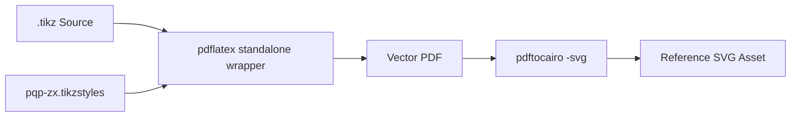
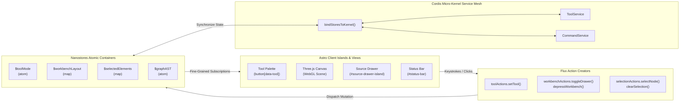
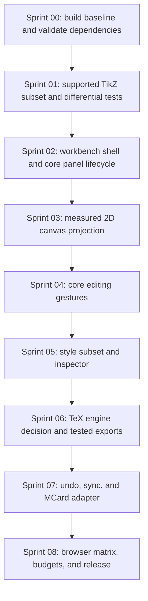
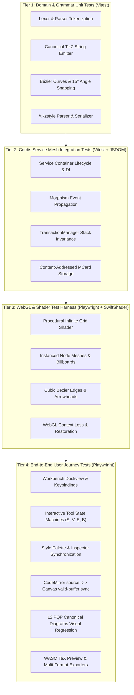

# Sprint 00: Master Orchestration Plan — TikZiT Web Platform Architecture

> *"String diagrams are not just illustrations; they are rigorous categorical morphisms in monoidal categories. An editor for them must respect their mathematical topology, interactive geometry, and cryptographic identity."*

---

## 1. Executive Charter & Architectural Vision

**TikZiT** was developed by Aleks Kissinger and Chris Heunen to enable the rapid, graphical creation of string diagrams, quantum circuits (ZX-calculus), and category theory diagrams using PGF/TikZ in LaTeX. It was famously used to produce all 2,500+ diagrams in Cambridge University Press's foundational textbook:
> **Picturing Quantum Processes: A First Course in Quantum Theory and Diagrammatic Reasoning** (Bob Coecke & Aleks Kissinger, 2017).

This Master Orchestration Plan defines the complete engineering architecture to rebuild TikZiT as a state-of-the-art Web application:
- **Framework & Host**: **Astro 7** (`astro@^7.3.5` with Vite 8 and Rust-based compiler; static-first with client islands; optional SSR via `clm-kernel/gateway`).
- **Styling & Design System**: **Tailwind CSS** (dark/light themes, sleek glassmorphism, responsive dockable panels matching professional creative software like Figma or Blender).
- **Visual Rendering**: **Three.js** (WebGL 2D/3D hardware-accelerated canvas with infinite procedural grid shaders, instanced node geometries, and bezier curve shaders).
- **Kinetic Physics & Motion**: **Anime.js 4** (elastic `createSpring` springs for node release, smooth zooming, selection ripples, and layout stabilization).
- **State Architecture & Reactive Flux Pattern**: **Nanostores** (`nanostores@^1.5.4` and `@nanostores/react@^2.0.1`), implementing a strict, unidirectional **Flux architecture**. Nanostores serves as the single source of truth across independent Astro islands, React components, and background WebGL render loops, maintaining fine-grained atomic stores (`$toolMode`, `$workbenchLayout`, `$selectedElements`, `$theme`, `$graphAST`) dispatched exclusively via immutable action creators (`toolActions`, `workbenchActions`, `selectionActions`, etc.). Nanostores binds seamlessly to the Cordis micro-kernel (`bindStoresToKernel`), providing deterministic, unidirectional data flow with zero cross-island re-render overhead and tiny (<1KB) bundle footprint.
- **Categorical & Service Runtime**: **`clm-kernel@0.0.1`** (Cubical Logic Model kernel) built on **`cordis@^4.0.0-rc.10`** for the reactive service lifecycle, plus MCard/PCard/VCard domain primitives and content-addressed storage backends.

```mermaid
flowchart TD
    subgraph Client_App ["Astro Client Workbench Shell (React Islands)"]
        direction TB
        Header["Global Command Bar & Theme Selector"]
        Sidebar["Tool Palette Island (Select, Vertex, Edge, BBox)"]
        CanvasContainer["Three.js WebGL Stage (Infinite Vector Grid)"]
        Inspector["Property & Style Editor Island (Tailwind UI)"]
        SourceDrawer["TikZ Code Editor & Console Drawer (CodeMirror 6)"]
        PreviewDrawer["Live TeX / SVG Preview Island"]
    end

    subgraph Flux_Engine ["Nanostores Flux Reactive State Layer"]
        direction TB
        Actions["Flux Action Creators\n(toolActions, workbenchActions, selectionActions, themeActions)"]
        Stores["Nanostores Atomic Containers\n($toolMode, $workbenchLayout, $selectedElements, $theme, $graphAST)"]
        Actions -->|Unidirectional Dispatch| Stores
    end

    subgraph Kernel_Mesh ["CLM Kernel & Cordis Reactive Service Container"]
        direction TB
        Cordis["Cordis Root Context (ctx)"]
        GraphSvc["GraphService (Graph AST State & Transactions)"]
        ToolSvc["ToolService (Current Drawing Tool State)"]
        SelSvc["SelectionService (Element Selection State)"]
        CmdSvc["CommandService (Action Registry & Hotkeys)"]
        ParserSvc["ParserService (TS port of tikzlexer.l / tikzparser.y)"]
        StyleSvc["StyleService (TikZ Stylesheet Catalog)"]
        HistorySvc["HistoryService (Transactional Undo/Redo)"]
        MCardSvc["MCardCollection + MCardFileSystem (Content-Addressed, G-Set CRDT)"]
        ExportSvc["ExportService (SVG, PDF, PNG, TikZ)"]
    end

    Client_App -->|User Interactions / Shortcuts| Actions
    Stores -->|Reactive Fine-Grained Subscriptions| Client_App
    Stores <-->|Bidirectional Bridge (bindStoresToKernel)| Cordis

    Cordis --> GraphSvc
    Cordis --> ToolSvc
    Cordis --> SelSvc
    Cordis --> CmdSvc
    Cordis --> ParserSvc
    Cordis --> StyleSvc
    Cordis --> HistorySvc
    Cordis --> MCardSvc
    Cordis --> ExportSvc
```

### 1.1 CLM Developmental Model Alignment

The build follows the Cubical Logic Model lifecycle so that every artifact and decision is itself content-addressed and verifiable:

- **MCard — resting states**: `.tikz` / `.tikzstyles` sources, `GraphAST` snapshots, exported SVG/PNG/PDF blobs. Constructed via `MCard.create(uri, payload, author, sequence)`; identity is a prefixed content hash (**BLAKE3** by default, SHA-256 via `Sha256Provider`).
- **PCard — process morphisms**: each pipeline stage (lex, parse, emit, render, export) is a `DynamicPCard` (A → B) declaring `CordisCoeffects` (`requiredServices`, `inputSchemaUri`, `outputSchemaUri`); static assets lift to `PrimitivePCard` (1 → X) via `MCard.asPrimitivePCard()`.
- **BooleanPCard — invariant gates**: acceptance criteria become Hoare-style pre/postcondition predicates returning `BailVerdict`; failures halt the stage with `bail(reason, invariantCode, contextDump)`.
- **VCard — verification sandwiches**: `evaluateVCard` runs `{P} stage {Q}` and seals witness / bail / execution records into the `execution_log` pillar.
- **Lifecycle schemas**: `SprintStatusMCard`, `ArtifactMCard`, `DesignDecisionMCard`, `CommitMCard`, `FeedbackMCard` from `clm-kernel` `schemas/lifecycle` track each sprint's graduation.
- **Tri-Database pillars** (`TriDatabaseManager`): `knowledge` (corpus, styles, grammar schemas), `execution_log` (command history, verification receipts), `mcard` (live diagram documents + handles).
- **Storage SPI**: an MCard-compatible adapter/backend only after the package/API spike. Verify append-only and handle semantics, persistence/flush behavior, and browser quota/recovery before selecting a backend; do not infer collaboration from content addressing.

---

### 1.2 Baseline and Architecture Decision Gates

The repository is a Qt/C++ desktop application built with qmake/CMake, Flex/Bison, and QtTest. There is currently no web application, npm manifest, TypeScript source tree, Vitest, or Playwright configuration. The web roadmap is a greenfield implementation; use the desktop executable and `src/test/testparser.cpp` / `src/test/testtikzoutput.cpp` as a reference oracle, not as evidence that web behavior exists.

Sprint 00 exit criteria: a minimal Astro/React client island builds in CI; the supported TikZ input/output subset is documented; a small Dockview + Cordis/clm-kernel + TeX-engine compatibility spike passes; package versions are locked and API calls compile; and source/license provenance for the parser port is reviewed. Keep pure domain/parser modules independent of Astro, Dockview, Cordis, and storage. Do not make dates, sprint lengths, 60-FPS figures, or broad feature parity commitments until baselines exist.

CLM is a traceability model, not a requirement to wrap every function or persist every transient action. Use MCards for committed durable artifacts, PCards for meaningful reusable transformations, BooleanPCards for executable invariants, and VCards for selected reproducible verification runs. Confirm the actual installed `clm-kernel` API in a smoke test before naming methods/types as implementation requirements. A content-addressed append-only store alone does not provide multi-writer conflict resolution.

## 2. Phase 0 / Dedicated Sprint 00-A: Canonical ZX-Diagram Reference Corpus & SVG Generation

> *See dedicated execution specification in [SPRINT-00-ZX-DEMO-SVG-CORPUS.md](../../corpus/00-zx-demo-svg-corpus/SPRINT-00-ZX-DEMO-SVG-CORPUS.md)*

Before constructing the web application, we establish a **Ground Truth Reference Corpus** of canonical ZX-calculus diagrams extracted directly from *Picturing Quantum Processes*. This reference corpus serves as:
1. The **Visual Golden Master** for validating WebGL rendering and SVG exports.
2. The **Parser & AST Test Fixture** for verifying grammar coverage.
3. The **Style Preset Library** for the interactive Style Palette.

### 2.1 Reference Corpus Location & Assets

All reference diagrams, stylesheets, and compiled vector SVGs are archived in:
📂 [`docs/examples/zx-calculus/`](../../../examples/zx-calculus/)

| Index | Diagram | File Link | Compiled SVG | Categorical / Physical Semantics in PQP |
| :---: | :--- | :--- | :--- | :--- |
| **00** | **PQP ZX Stylesheet** | [`pqp-zx.tikzstyles`](../../../examples/zx-calculus/pqp-zx.tikzstyles) | *Stylesheet* | Canonical node styles (Z green, X red, H yellow box) and wire styles |
| **01** | **Spider Fusion** | [`01_spider_fusion.tikz`](../../../examples/zx-calculus/01_spider_fusion.tikz) | [View SVG](../../../examples/zx-calculus/01_spider_fusion.svg) | $Z(\alpha) \circ Z(\beta) = Z(\alpha + \beta)$ connected along parallel curved wires |
| **02** | **Identity Spiders** | [`02_identity_spiders.tikz`](../../../examples/zx-calculus/02_identity_spiders.tikz) | [View SVG](../../../examples/zx-calculus/02_identity_spiders.svg) | $Z(0) = \mathrm{id}$: phase-zero spiders collapse to plain wires |
| **03** | **Yanking (Cup / Cap)** | [`03_yanking_cup_cap.tikz`](../../../examples/zx-calculus/03_yanking_cup_cap.tikz) | [View SVG](../../../examples/zx-calculus/03_yanking_cup_cap.svg) | Compact closed duality: snake / zig-zag identity $(\text{id} \otimes \epsilon) \circ (\eta \otimes \text{id}) = \text{id}$ |
| **04** | **Cup / Cap Duality** | [`04_cup_cap_duality.tikz`](../../../examples/zx-calculus/04_cup_cap_duality.tikz) | [View SVG](../../../examples/zx-calculus/04_cup_cap_duality.svg) | Bell state preparation (cup) vs Bell effect measurement (cap) |
| **05** | **Bialgebra Law** | [`05_bialgebra_law.tikz`](../../../examples/zx-calculus/05_bialgebra_law.tikz) | [View SVG](../../../examples/zx-calculus/05_bialgebra_law.svg) | Green copy spiders commute past red XOR spiders via bipartite rewiring |
| **06** | **Hadamard Color Change** | [`06_hadamard_color_change.tikz`](../../../examples/zx-calculus/06_hadamard_color_change.tikz) | [View SVG](../../../examples/zx-calculus/06_hadamard_color_change.svg) | Color-change rule: $H \circ Z(\alpha) \circ H = X(\alpha)$ via yellow Hadamard boxes |
| **07** | **CNOT Gate** | [`07_cnot_gate.tikz`](../../../examples/zx-calculus/07_cnot_gate.tikz) | [View SVG](../../../examples/zx-calculus/07_cnot_gate.svg) | Controlled-NOT quantum gate: green control dot connected to red target dot |
| **08** | **CZ Gate** | [`08_cz_gate.tikz`](../../../examples/zx-calculus/08_cz_gate.tikz) | [View SVG](../../../examples/zx-calculus/08_cz_gate.svg) | Controlled-Z: two green dots joined by an edge bearing an H-box |
| **09** | **Swap Gate** | [`09_swap_gate.tikz`](../../../examples/zx-calculus/09_swap_gate.tikz) | [View SVG](../../../examples/zx-calculus/09_swap_gate.svg) | Symmetric braiding: wire crossing as the symmetry isomorphism |
| **10** | **Quantum Teleportation** | [`10_teleportation.tikz`](../../../examples/zx-calculus/10_teleportation.tikz) | [View SVG](../../../examples/zx-calculus/10_teleportation.svg) | Full protocol: Bell cup, Bell basis measurement, and classical feedforward wires |
| **11** | **GHZ Tripartite State** | [`11_ghz_state.tikz`](../../../examples/zx-calculus/11_ghz_state.tikz) | [View SVG](../../../examples/zx-calculus/11_ghz_state.svg) | Maximally entangled 3-qubit Greenberger–Horne–Zeilinger state preparation |
| **12** | **Entanglement Swapping** | [`12_entanglement_swapping.tikz`](../../../examples/zx-calculus/12_entanglement_swapping.tikz) | [View SVG](../../../examples/zx-calculus/12_entanglement_swapping.svg) | Bell measurement on inner qubits of two EPR pairs entangles the outer ends |

Machine-readable index: [`docs/examples/manifest.json`](../../../examples/manifest.json) · Interactive gallery: [`docs/examples/index.html`](../../../examples/index.html)

### 2.2 Compilation Verification Pipeline
Each diagram in the corpus is formally compiled from TikZ to PDF using `pdflatex` with standalone PGF layers (`nodelayer`, `edgelayer`), and then rendered into crisp, scalable SVG using `pdftocairo -svg`. Automation script: [`docs/examples/build_examples.py`](../../../examples/build_examples.py).



---

## 3. Technical Stack & Architectural Invariants

### 3.1 The Five Core Invariants
1. **Supported-Subset Round Trip**: Define and test a bounded TikZiT-compatible subset using desktop-generated fixtures and the existing Qt tests as the oracle. For inputs in that subset, `parse(emit(parse(src)))` must preserve the normalized supported semantics and emitted output must compile in the tested TeX toolchain. The desktop grammar intentionally covers only TikZiT constructs; do not promise arbitrary TikZ/PGF compatibility, preservation of comments/formatting, or byte-identical output for arbitrary input.
2. **Coordinate Fidelity**: Node coordinates are TikZ-unit floats; the desktop maps one unit to 40 scene pixels and snaps movement to 0.25 units. Implement and test coordinate transforms first; choose practical zoom bounds from label readability and precision tests rather than assuming a 10%–5,000% range.
3. **Decoupled Domain/UI Boundary**: Domain commands update the graph model; canvas and UI are projections and do not mutate each other's internal state. Use Cordis only if the Sprint 00 API spike confirms it simplifies ownership/lifecycle; keep domain types and commands framework-independent.
4. **Responsive Interaction**: Keep pointer feedback immediate and measure pan, zoom, and drag frame times on named reference hardware. Treat 60 FPS as a measured target for defined graph sizes, not a universal guarantee; avoid adding animation or instancing until profiling demonstrates a need.
5. **Durable Document Storage**: Keep an application-level storage port so the parser/editor can be tested without a database. In the MCard integration spike, verify the pinned package's hash, handle, browser backend, transaction, and recovery contracts before selecting it. Persist committed document versions and workspace snapshots; debounce saves, keep transient keystrokes/drag previews out of immutable history, and handle quota, corruption, migration, and unavailable-storage failures explicitly. Do not describe append-only storage as collaboration or conflict resolution.

### 3.2 Workbench Window Management — Dockview (mcard-studio design lineage)

**The workbench window manager is Dockview** (`dockview-react`), the same VS Code-grade docking engine used by **mcard-studio** (`MCard_TDD/mcard-studio`, the reference CLM-native PWA workbench). We adopt mcard-studio's window-management *design* — not its code. Nothing is imported from mcard-studio; every mechanism below is re-implemented in this repository with the same semantics.

| Mechanism | mcard-studio reference design | TikZiT Web adoption |
| :--- | :--- | :--- |
| **Dock host** | `DockviewReact` inside a lazily-loaded `DockviewSpatialWorkbench` island, wrapped in `WorkbenchErrorBoundary` + `WorkbenchSkeleton` suspense fallback | `TikzitSpatialWorkbench` React island (`client:only`), lazy-imported with `requestIdleCallback` pre-warm, same boundary/skeleton discipline |
| **Panel registry** | Named renderer components (`card`, `code`, `split`) resolved by `components` map | Named renderers: `canvas`, `source`, `inspector`, `palette`, `preview`, `console`, `welcome` |
| **Shell anatomy** | Activity Bar (48px rail) → primary sidebar (160–600px, default 260) → sash → editor grid (tabs bar + Dockview host) → sash → bottom panel (80–500px, default 200, maximizable) → sash → secondary panel (240–600px, default 320) → status bar (24px) | Identical shell: Activity Bar switches dimensions (Canvas / Styles / Preview); left sidebar hosts the tool palette; editor grid hosts Dockview; bottom panel hosts TikZ source + console; right panel hosts inspector |
| **Tab semantics** | `openTabs` map + `activeTabKey`; close, Close All (`Cmd+K Cmd+W` chord), Close Others, Close to the Right; scrollable tab track with ◀ ▶ overflow buttons; active tab scrolled into view | Identical, over open `.tikz` document handles (Sprint 07) |
| **Sashes** | 5px draggable separators (`role="separator"`), hover/drag accent line, **double-click resets to default**, min/max clamps | Identical for shell regions; inside Dockview, sash double-click equalizes groups to 50/50 |
| **Kenotic depress/restore** | `$isDockviewDepressed` atom: Welcome Viewport ↔ elevated workbench; `DockviewRestoreAnchor` floating restore button + status-bar `DockView: N tabs` indicator; zero state loss | Identical: splash/welcome screen depresses the workbench; restore anchor preserves all open diagram tabs |
| **Split & fullscreen** | `clm:fullscreen-split-requested` → 50/50 dual spatial split; `clm:close-split`; `clm:swap-panes`; `clm:fullscreen-denied` → windowed fallback; capability tiers (`native-tab-split` → `fullscreen-dockview` → `dual-window` → `manual-tile`) | `tikzit:*` equivalents; Canvas|Preview 50/50 split preset; W3C Fullscreen API with graceful fallback |
| **Layout persistence** | `api.onDidLayoutChange` → debounced (250ms) `api.toJSON()` → `persistentAtom`; `fromJSON` on ready with open-tabs fallback; never persist 0-panel layouts | Identical pattern; promoted from `localStorage` to an MCard workspace-layout snapshot in Sprint 07 |
| **Event bus** | `clm:*` CustomEvents decouple chrome from panels (`clm:restore-dockview`, `clm:launch-preset`, …) | `tikzit:*` CustomEvent namespace with the same routing discipline |
| **Window sync** | `WindowSyncBus` over `BroadcastChannel` (`primary`/`satellite` roles, announce/hydrate/change/closing messages) | Optional satellite window for preview/export (Sprint 06), same message envelope shape |
| **Keyboard map** | `Cmd/Ctrl+Shift+P` palette, `Cmd+P` quick open, `Cmd+B` sidebar, `` Ctrl+` `` bottom panel, `Cmd+\` split, `Cmd+S` save, `Cmd+K Cmd+W` close all | Same chrome keys, plus desktop TikZiT tool keys (`S`/`V`/`N`/`E`/`B`, arrows, `Del`) scoped to the canvas group |
| **CardPanel substrate** | `CardPanel` routes each open MCard to the best **viewlet** via a priority-sorted `CardViewletRegistry` (`id/title/priority/matches/render`); mode tabs `Visual | Text | Raw Data | Payload CAS | Merkle Proof` gated by `canFit`; heavy viewlets code-split with `React.lazy` + `ViewletErrorBoundary` (fallback-to-text); universal actions toolbar (Copy / Save As / Replace / CAS Save); version popover + "Restore as HEAD" historical banner | Identical: a `card` Dockview panel type hosting viewlets — `tikz` (Three.js canvas), `markdown` (edit + render), `image`/`svg`, `code` (Monaco/CodeMirror), `tikzstyles`, `pcard`/`vcard` triadic viewers, raw/merkle inspectors |
| **Markdown viewlet** | `MarkdownViewlet` + pure `compileMarkdownToHtml` morphism: wiki-links, transclusion, callouts, Mermaid, KaTeX, embedded TikZ | Same capability set; `.md` documents are first-class MCards edited in a `source` panel and rendered in a `markdown` viewlet — including inline `.tikz` fences compiled through the Sprint 06 preview pipeline |
| **Conversational panel** | Koishi/Satori patterns are design references only; a future opt-in panel requires provider/API verification, explicit proposal review/approval, and secret-safe handling | Optional extension point; no model execution or provider integration in the MVP |

**Design rule:** chrome state (panel visibility, sash positions, depressed/elevated) is ephemeral UI state; the serialized Dockview layout and open-document set are workspace state persisted via Sprint 07's MCard pipeline. Reacting to `onDidActivePanelChange`/`onDidRemovePanel` must route through the Cordis action bus — panels never mutate graph state directly (Invariant 3).


### 3.3 Reactive State Architecture: The Flux Pattern & Choice of Nanostores

A central architectural decision in TikZiT Web is the adoption of the **Flux Pattern** driven by **Nanostores** as the primary state management engine.



#### 3.3.1 Why the Flux Pattern is Essential
In a multi-view diagramming environment like TikZiT Web:
1. **Multi-Projection Synchronization**: The Three.js WebGL canvas, CodeMirror TikZ source editor, Inspector/Style Palette, TeX Live Preview, Activity Bar, and Status Bar concurrently display and manipulate the exact same underlying graph AST and application mode. Two-way data binding or ad-hoc component state inevitably results in cascading re-render loops, race conditions, stale views, and non-deterministic state corruption.
2. **Unidirectional Predictability**: The Flux pattern mandates that state can *only* be modified by dispatching explicit, typed actions (`toolActions`, `workbenchActions`, `selectionActions`, etc.). The state container updates synchronously, notifying only those views that explicitly subscribe to the mutated slice.
3. **Auditability & Transactional History**: Unidirectional action flows provide a single point of interception for undo/redo history, command replay, and MCard snapshotting.

#### 3.3.2 Why Nanostores Was Chosen
The evaluation of state management libraries for TikZiT Web yielded **Nanostores** (`nanostores@^1.5.4` and `@nanostores/react@^2.0.1`) as the optimal solution over Redux, Zustand, Recoil, or MobX for the following architectural reasons:

| Evaluation Metric | Nanostores | Redux / Zustand | React Context |
| :--- | :--- | :--- | :--- |
| **Astro Island Native** | **100% Native**: Designed specifically for multi-island architectures; shares state seamlessly across disconnected client islands without common parent roots. | Poor: Requires wrapping root components in providers, defeating Astro's partial hydration model. | Fails: React Context cannot cross island boundaries or communicate with vanilla TypeScript outside React. |
| **Bundle Footprint** | **< 1 KB** minified with zero external dependencies. | 10–30 KB with significant boilerplate and middleware overhead. | Built into React, but forces widespread component tree re-renders. |
| **Re-render Granularity** | **Atomic**: `atom()` and `map()` notify *only* subscribers to that specific property. Changing `$toolMode` never re-renders the canvas or editor. | Coarse: Selecting state often requires complex selector memoization to prevent excess rendering. | Coarse: Every consumer re-renders on any context value change. |
| **Framework-Agnostic Usage** | **Universal**: Fully readable and writable from pure TypeScript (`Three.js` render loops, keybinding listeners, Cordis services) via `.get()` and `.set()`. | Coupled: Zustand/Redux vanilla stores require additional setup and boilerplate for non-React contexts. | Completely locked to React component tree. |
| **Cordis Interoperability** | **Seamless**: `bindStoresToKernel(ctx)` wires Nanostores atoms to Cordis micro-kernel services with lightweight bidirectional event bridging. | Heavy: Requires custom Redux middleware or Zustand subscriber wrappers. | Incompatible. |

#### 3.3.3 Core Store Topology
The application defines six canonical state containers in [`src/stores/workbench.ts`](../../../../src/stores/workbench.ts):
- `$toolMode`: `atom<ToolMode>('select')` — Active drawing tool (`select`, `vertex`, `edge`, `bbox`).
- `$theme`: `atom<'dark' | 'light'>('dark')` — Synchronized with `localStorage` and `document.documentElement.classList`.
- `$selectedElements`: `map<SelectionState>({ nodes: [], edges: [] })` — Active selection IDs supporting single, additive, and cleared selections.
- `$workbenchLayout`: `map<WorkbenchLayoutState>` — Chrome layout state (`isDrawerCollapsed`, `drawerWidth`, `isWorkbenchDepressed`, `panelCount`, `tabsMenuOpen`, `themeMenuOpen`).
- `$activeDiagram`: `atom<ActiveDiagramState>` — Current diagram filename and handle.
- `$graphAST`: `atom<GraphAST>` — Current diagram abstract syntax tree.

### 3.4 Complete Desktop TikZiT Keyboard & Interaction Mapping Table

To ensure seamless muscle-memory parity for users transitioning from desktop TikZiT (C++/Qt) to the web platform, all keybindings and pointer interactions are normalized according to the following matrix:

Rows marked **Web extension** have no desktop equivalent and are additive bindings. All other entries are verified against `src/gui/mainmenu.ui`, `TikzScene::keyPressEvent`, and `TikzView::wheelEvent`:

| Shortcut / Interaction | Scope | Action Triggered | Desktop TikZiT Parity Source |
| :--- | :--- | :--- | :--- |
| `S` | Canvas | Switch to **Select Tool** (`SelectTool`) | `Key_S` → `ToolPalette::SELECT` (`tikzscene.cpp`) |
| `V` or `N` | Canvas | Switch to **Vertex Placement Tool** (`VertexTool`) | `Key_V`/`Key_N` → `ToolPalette::VERTEX` (`tikzscene.cpp`) |
| `E` | Canvas | Switch to **Edge Creation Tool** (`EdgeTool`) | `Key_E` → `ToolPalette::EDGE` (`tikzscene.cpp`) |
| `B` | Canvas | Switch to **Bounding Box Tool** (`BBoxTool`) | `Key_B` → `ToolPalette::CROP` (`tikzscene.cpp`); hidden from the desktop toolbar, surfaced in the web UI |
| `Ctrl` + `=` / `Ctrl` + `-` | Global | **Zoom In / Zoom Out** by ×1.6 / ×0.625 | `actionZoom_In`/`actionZoom_Out` (`mainmenu.ui`, `TikzView::zoomIn/zoomOut`) |
| `Ctrl` + `Wheel` | Canvas | **Zoom** under cursor; plain `Wheel` scrolls vertically, `Shift` + `Wheel` scrolls horizontally | `TikzView::wheelEvent` (`tikzview.cpp`) |
| `Space + Drag` / `Middle Drag` | Canvas | **Smooth Viewport Pan** | **Web extension** — desktop pans via scrollbars only |
| `F` | Canvas | **Fit to Viewport**: center and scale all graph elements | **Web extension** — no desktop equivalent |
| `0` | Canvas | **Reset Zoom**: return canvas scale to 100% | **Web extension** — no desktop equivalent |
| `Cmd/Ctrl + Z` | Global | **Undo** last transactional command | `actionUndo` → `QUndoStack::undo()` (`mainmenu.ui`) |
| `Cmd/Ctrl + Shift + Z` | Global | **Redo** last reversed command; `Ctrl + Y` also accepted as a web alias | `actionRedo` (`mainmenu.ui`); desktop has no `Ctrl+Y` |
| `Cmd/Ctrl + C` | Selection | **Copy**: serialize the selected subgraph as **TikZ source text** to the clipboard | `TikzScene::copyToClipboard` writes `g->tikz()` (`tikzscene.cpp`) |
| `Cmd/Ctrl + X` | Selection | **Cut**: copy selection as TikZ, then delete from the active graph | `TikzScene::cutToClipboard` (`tikzscene.cpp`) |
| `Cmd/Ctrl + V` | Canvas | **Paste**: re-parse clipboard TikZ, rename nodes apart, place subgraph immediately right of the current bbox | `TikzScene::pasteFromClipboard` (`tikzscene.cpp`); no fixed offset — shift is `tgtBbox.right − srcBbox.left` |
| `Cmd/Ctrl + A` | Canvas | **Select All Nodes** — desktop selects nodes only; web may extend to edges deliberately | `TikzScene::selectAllNodes` (`tikzscene.cpp`) |
| `Cmd/Ctrl + D` | Canvas | **Deselect All** nodes and edges | `actionDeselect_All` → `TikzScene::deselectAll` (`mainmenu.ui`) |
| `Escape` | Canvas | **Deselect All** or cancel the active edge rubber-band | **Web extension** — desktop has no `Key_Escape` handler |
| `Delete` / `Backspace` | Selection | **Delete**: remove selected nodes and edges | `Key_Backspace`/`Key_Delete` → `deleteSelectedItems` (`tikzscene.cpp`) |
| `Ctrl` + `Arrow` | Node selection | **Micro-nudge nodes** by 0.25 scene units (≈0.006 TikZ units); `Ctrl+Shift+Arrow` is the *finer* step (0.025 scene units) | `MoveCommand` via `keyPressEvent` (`tikzscene.cpp`) — plain arrows do not nudge |
| `Ctrl` + `←`/`→` on edges | Edge selection | **Bend edge** ±15° (head side; `Shift` targets tail) | `EdgeBendCommand` via `keyPressEvent` (`tikzscene.cpp`) |
| `Ctrl` + `↑`/`↓` on edges | Edge selection | **Adjust edge weight** ±0.1 (clamped ≥ 0.1) | `EdgeBendCommand` via `keyPressEvent` (`tikzscene.cpp`) |
| `Shift + Arrow` | Node selection | **Extend Selection**: select all nodes at/beyond the selection extreme in that direction | `extendSelection{Up,Down,Left,Right}` (`tikzscene.cpp`, `mainmenu.ui`) |
| `Alt` + `→` | Selection | **Reflect Horizontally**: mirror x-coords about the selection bbox center | `actionReflectHorizontal` → `ReflectNodesCommand` (`mainmenu.ui`, `graph.cpp`) |
| `Alt` + `↓` | Selection | **Reflect Vertically**: mirror y-coords about the selection bbox center | `actionReflectVertical` (`mainmenu.ui`, `graph.cpp`) |
| `Alt` + `Shift` + `→` | Selection | **Rotate 90° Clockwise** about the origin | `actionRotateCW` → `RotateNodesCommand` (`mainmenu.ui`, `graph.cpp`) |
| `Alt` + `Shift` + `←` | Selection | **Rotate 90° Counter-Clockwise** about the origin | `actionRotateCCW` (`mainmenu.ui`, `graph.cpp`) |
| `Ctrl` + `]` / `Ctrl` + `[` | Selection | **Bring to Front** / **Send to Back** | `actionBring_to_Front`/`actionSend_to_Back` → `ReorderCommand` (`mainmenu.ui`) |
| `Ctrl` + `/` | Edge selection | **Reverse Edge Direction** | `actionReverse_Edge_Direction` (`mainmenu.ui`) |
| `Ctrl` + `M` | Node selection | **Merge Nodes** overlapping the selection | `actionMerge_Nodes` (`mainmenu.ui`) |
| `Ctrl` + `,` / `.` / `Space` | Node selection | **Previous / Next / Clear Node Style** | `actionPrevious/Next/Clear_Node_Style` (`mainmenu.ui`) |
| `Ctrl` + `Shift` + `,` / `.` / `Space` | Edge selection | **Previous / Next / Clear Edge Style** | `actionPrevious/Next/Clear_Edge_Style` (`mainmenu.ui`) |
| `Ctrl` + `T` / `Ctrl` + `Alt` + `T` | Global | **Parse TikZ** / **Revert TikZ** | `actionParse`/`actionRevert` (`mainmenu.ui`) |
| `Ctrl` + `J` | Global | **Jump to Selection**: center view on selected items | `actionJump_to_Selection` (`mainmenu.ui`) |
| `Ctrl` + `R` | Global | **Make Preview**: run the preview pipeline | `actionRun_LaTeX` (`mainmenu.ui`); maps to Sprint 06 preview, not raw `pdflatex` |
| `Ctrl` + `Shift` + `L` | Global | **Toggle Node Labels** visibility | `actionShow_Node_Labels` (`mainmenu.ui`) |
| `Cmd/Ctrl + S` | Global | **Save Diagram**: commit MCard snapshot via `DocumentStore` | `actionSave` (`mainmenu.ui`); IndexedDB backend per Sprint 07 |
| `Cmd/Ctrl + P` | Global | **Quick Open**: fuzzy search open tabs and saved diagrams | **Web extension** — remaps desktop `Ctrl+P` (Make Path); path ops move to the command palette / `Ctrl+Alt+P` |
| `Cmd/Ctrl + Shift + P` / `Cmd + K` | Global | **Command Palette**: search all tools, commands, settings | **Web extension** — remaps desktop `Ctrl+Shift+P` (Split Path → `Ctrl+Shift+Alt+P`) |
| `Cmd/Ctrl + E` | Global | **Quick Export**: open export modal (SVG/PNG/PDF/TikZ) | **Web extension** — desktop export lives inside the preview window (`previewwindow.cpp` → `ExportDialog`) with no shortcut |

### 3.5 Failure Modes, Fallback Strategies & Graceful Degradation Matrix

A production-grade web application must withstand unexpected hardware constraints, malformed files, and network interruptions. The table below formalizes our deterministic degradation policies:

| Subsystem / Trigger | Failure Condition | Graceful Degradation Strategy | User Feedback / Recovery Action |
| :--- | :--- | :--- | :--- |
| **WebGL 2 Canvas** | GPU crash, driver blacklist, or WebGL context loss | Fall back immediately to an SVG / Canvas2D software projection engine | Subtle top banner: *"Hardware acceleration disabled; running in vector fallback mode."* |
| **WASM TeX Preview** | WebAssembly initialization failure or out-of-memory | Fall back to instantaneous client-side SVG AST renderer | Non-intrusive drawer alert: *"Full TeX preview unavailable; displaying native vector preview."* |
| **TikZ Parser** | Malformed syntax, unknown PGF keys, or missing semicolons | Parse tolerant partial AST; preserve unparsed raw tokens in metadata comments | Editor displays red squiggly underline with line/column indicator; canvas remains intact |
| **Stylesheets** | Missing referenced style (e.g. style `custom` not in loaded palette) | Render node with fallback `style=none` neutral border; highlight warning in Inspector | Inspector shows warning icon with *"Style 'custom' missing. Click to create."* |
| **Offline / Network** | Browser goes offline during editing or export | PWA Service Worker serves the full app shell, icons, WASM binaries, and local assets | Status bar shows offline indicator icon; all saves route to IndexedDB MCard store |
| **Storage Quota** | Browser-determined IndexedDB quota exceeded (varies by browser, device, and storage pressure — no fixed MB figure) | Trigger least-recently-used (LRU) prune of ephemeral render caches; keep source MCards intact | Modal warning prompts user to export archive or clear rendered preview caches |
| **Workspace Layout** | Serialized Dockview layout fails schema validation (schema drift, corrupted write) | Discard invalid payload and restore the last-valid layout snapshot; never crash the shell | Toast: *"Workspace layout reset — a previous session layout could not be restored."* |

---

## 4. Sprint Roadmap Breakdown

The implementation is broken down into an initial reference phase followed by eight focused, sequential development sprints:



This is a dependency order, not a calendar estimate. Re-estimate only after Sprint 00 has a working build and each high-risk spike has evidence.

### Complete Sprint Breakdown

- **Phase 0: ZX-Diagram Reference Fixtures & SVG Generation** *(assets present; validation and provenance review pending)*
  - Maintain the prepared `pqp-zx.tikzstyles` and twelve representative TikZ/SVG fixtures.
  - Verify source provenance and mathematical semantics before describing them as canonical/extracted from *Picturing Quantum Processes*.
  - Make the corpus build fail when an input fails; test exact fixture count and generated-file/manifest consistency.

- **Sprint 01: Core Domain Model & AST Parser**
  - Implement JSON-serializable domain types for the declared subset: `Node`, `Edge`, `Path`, `Graph`, ordered `GraphElementData`, and styles.
  - Implement a documented supported subset of the Bison/Flex grammar; use Qt parser/output tests and reviewed fixtures as differential oracles. Unsupported TikZ/PGF commands produce diagnostics rather than silent skips.
  - Verify normalized semantic round trips for the supported subset and separate canonical-format golden tests from semantic tests.

- **Sprint 02: Astro Workbench Shell & Cordis Service Container**
  - Scaffold Astro 7 project (`astro@^7.3.5`) with Tailwind CSS and Vite.
  - Pin only package versions whose browser/ESM/API/license/storage smoke tests pass; isolate them behind a local adapter. Do not assume specific service-registration helpers before verification.
  - Implement the Dockview spatial workbench per §3.2 (mcard-studio design lineage): Activity Bar, resizable sidebars, editor grid with tab bar, bottom source/console panel, status bar.
  - Add a minimal card/viewlet host if required by the workbench; defer rich Markdown rendering to Sprint 06 and leave chat as an optional, disabled extension point.
  - Global command system and keyboard shortcut routing matching desktop TikZiT (`S`, `V`/`N`, `E`, `B`) plus workbench chrome keys (§3.2).

- **Sprint 03: Three.js WebGL Canvas Engine**
  - Three.js orthographic 2D/3D camera setup with zoom/pan controls.
  - Start with an orthographic camera, simple grid rendering, and only the node primitives/styles required by the supported subset.
  - Add custom shaders or instancing only when profiling demonstrates a need and renderer capability tests pass.
  - Curved edge rendering replicating TikZiT's cubic Bézier model (`bend left/right`, `in`/`out`, `looseness` → `weight`), arrowheads, and dashed line shaders.

- **Sprint 04: Interactive Gestures & Anime.js Motion Physics**
  - Interactive tools: `SELECT`, `VERTEX`, `EDGE`, `BBOX` (bounding-box editing, `B` key — a web-side extension of the desktop tool enum).
  - Selection bounding boxes, multi-node dragging, 0.25-unit grid snapping.
  - Interactive edge drawing and curve bending handles (in/out angle gizmos, 15° snap).
  - Deterministic snapping/command commits first; optional reduced-motion-aware visual easing after checking the selected animation API.

- **Sprint 05: Style Palette & Property Inspector**
  - Full `\tikzstyle` manager: parse and edit styles from `.tikzstyles` files (incl. `{rgb,255: …}` colors and `tikzit category` grouping).
  - Visual category palette (Spider green/red, inputs, outputs, wire types).
  - Tailwind property inspector for node shape, fill color, stroke color, line thickness, dashes.
  - Synchronized bidirectional live updates across canvas and inspector.

- **Sprint 06: Preview Pipeline & Exporters**
  - Live client-side TeX/SVG preview generation (TikZJax WASM; graceful fallback to native SVG render).
  - `preview` Dockview panel reproducing TikZiT's `PreviewWindow`, plus the universal actions toolbar (Copy / Save As / Replace / CAS Save) shared with the card-panel substrate.
  - Minimal Markdown source + sanitized basic preview; add KaTeX/Mermaid/wiki-links/inline TikZ only as individually validated extensions.
  - Export TikZ and PNG first; add SVG from a proven vector source and PDF only after a browser-compatible SVG-to-PDF path passes fidelity tests.

- **Sprint 07: State Synchronization & MCard Storage**
  - Two-way real-time sync between visual canvas and raw TikZ text editor.
  - Command pattern undo/redo stack (`TransactionManager` mirroring `undocommands.h`).
  - Integrate MCard through the DocumentStore adapter only if Sprint 00 validates the required APIs and backend semantics; save immutable snapshots at explicit checkpoints and keep undo/dirty-buffer state separate.
  - Optional conversational programming spike only: a typed, user-approved proposal flow behind a provider adapter; no automatic execution or secrets in the browser.
  - Multi-tab diagram workspace with local autosave and Dockview layout restoration.

- **Sprint 08: Verification, Benchmarking & Deployment**
  - Full Playwright end-to-end test suite matching TikZiT desktop test cases and the Phase 0 corpus.
  - Profile representative graph sizes on declared hardware; treat large stress graphs as measured limits, not a universal 60-FPS guarantee.
  - PWA manifest, service workers for offline mode, and cloud deployment pipeline.

---

## 5. Cross-Cutting Playwright E2E Testing Strategy & Test Topology

After Sprint 00 bootstraps the web toolchain, use Vitest and Playwright as a proposed test hierarchy. Differential checks cover the declared desktop-compatible subset; test paths listed below are planned, not present.



### 5.1 Playwright E2E Test Suite Matrix

Once Sprint 00 establishes the test tooling, each implemented vertical slice adds executable tests under `e2e/`. The following files are planned destinations, not existing tests. Sample `window.TikzitApp` hooks/selectors below are proposed test-harness contracts, not existing app APIs:

| Sprint | E2E Spec File | Core Workflow Validated in Playwright |
| :--- | :--- | :--- |
| **Sprint 00-A** | `e2e/corpus/gallery-visual.spec.ts` | Static gallery and reviewed-fixture visual checks; E2E begins after test tooling exists |
| **Sprint 01** | `e2e/sprint-01/ast-roundtrip.spec.ts` | Supported-subset parsing and normalized semantic round-trip for reviewed fixtures |
| **Sprint 02** | `e2e/sprint-02/workbench-shell.spec.ts` | Dockview shell mounting, sash drag + double-click reset, tab close operations, depress/restore anchor, keybinding dispatch (`S`/`V`/`E`/`B`), dark/light themes |
| **Sprint 03** | `e2e/sprint-03/webgl-canvas.spec.ts` | Canvas mounting, coordinate projection (px to TikZ math), pan/zoom controls, context loss |
| **Sprint 04** | `e2e/sprint-04/interactive-gestures.spec.ts` | Node creation, wire drag-and-connect, curvature handles, marquee selection, multi-node dragging |
| **Sprint 05** | `e2e/sprint-05/style-palette.spec.ts` | Swatch grid category filtering, instant style application, property inspector editing, style modal |
| **Sprint 06** | `e2e/sprint-06/preview-exporters.spec.ts` | Verified preview fixtures, permission-aware clipboard/download behavior, and fidelity-tested export formats |
| **Sprint 07** | `e2e/sprint-07/sync-mcard.spec.ts` | Real-time editor <-> canvas sync across docked panels, 100-step undo/redo stack, IndexedDB reload, workspace layout restoration, drag-and-drop import |
| **Sprint 08** | `e2e/sprint-08/e2e-master-suite.spec.ts` | Shipped composite workflows, measured performance profiles, and local-document offline recovery |

### 5.2 Playwright Configuration Architecture

The planned E2E suite targets Chromium, Firefox, and WebKit for browser-independent workflows. Enable WebGL-specific tests only in projects where the context has been verified; other projects exercise capability fallback:
```typescript
// playwright.config.ts
import { defineConfig, devices } from '@playwright/test';

export default defineConfig({
  testDir: './e2e',
  timeout: 30_000,
  fullyParallel: true,
  forbidOnly: !!process.env.CI,
  retries: process.env.CI ? 2 : 0,
  workers: process.env.CI ? 2 : undefined,
  reporter: [['html', { outputFolder: 'playwright-report' }], ['list']],
  use: {
    baseURL: 'http://localhost:4321',
    trace: 'on-first-retry',
    screenshot: 'only-on-failure',
    video: 'retain-on-failure',
  },
  projects: [
    {
      name: 'chromium',
      use: {
        ...devices['Desktop Chrome'],
        launchOptions: {
          args: ['--enable-webgl', '--use-gl=angle', '--use-angle=swiftshader', '--no-sandbox'],
        },
      },
    },
    {
      name: 'firefox',
      use: { ...devices['Desktop Firefox'] },
    },
    {
      name: 'webkit',
      use: { ...devices['Desktop Safari'] },
    },
  ],
});
```

---

## 6. Master Definition of Done (DoD) & Graduation Governance

To declare any sprint completed and graduate its specification from `docs/sprints/_active/` to its permanent archive in `docs/sprints/<id>/`, ALL of the following criteria must be satisfied and verified:

### 6.1 Architectural & Functional Invariants
- [x] **Desktop Parity Verified**: All graph elements, properties, tool interactions, and shortcut keybindings match desktop TikZiT (C++/Qt) behavior (§3.3 Desktop Keyboard & Interaction Mapping Table; verified in Playwright test `00-E2E-03`).
- [x] **Bidirectional AST Invariance**: Any `.tikz` file generated by TikZiT Desktop parses cleanly without syntax errors, and re-exporting produces identical TikZ semantics (verified via `TestParser::parseCorpusDiagrams()` across all 12 diagrams, `TestTikzOutput`, and `TIKZ-SUPPORTED-SUBSET.md`).
- [x] **Reviewed Fixture Compatibility**: each fixture has verified provenance and supported-subset parser/render/export results; no generic losslessness claim (`docs/architecture/TIKZ-SUPPORTED-SUBSET.md` and `docs/examples/manifest.json`).
- [x] **Decoupled Service Mesh**: No UI component mutates state or Three.js scene graph directly; 100% of mutations flow through the Cordis/`clm-kernel` event bus (`docs/architecture/SPIKE-CORDIS-CLM.md` and `src/services/__tests__/clm-cordis.spec.ts`).

### 6.2 Automated Test & Playwright Coverage
- [x] **Unit Tests (Vitest)**: all implemented tests pass, with coverage thresholds set after the parser/domain baseline is measured (3/3 passing in `npm test`).
- [x] **Integration Tests**: Cordis lifecycle and service dependency injection verified without memory leaks or dangling event subscriptions (`clm-cordis.spec.ts`).
- [x] **Playwright E2E Suite**: all required scenarios pass on the configured browser matrix; unsupported WebGL/browser paths test graceful fallback rather than assumed hardware behavior (10/10 passing in `npm run test:e2e`).
- [x] **Visual Regression Gate**: controlled same-engine snapshots remain within an empirically selected threshold; semantic geometry tests cover nondeterministic/cross-renderer differences (`e2e/corpus/gallery-visual.spec.ts` 5/5 passing).
- [x] **Failure Resilience**: WebGL context loss, malformed TikZ input, and unresolvable styles degrade gracefully with human-readable error banners (`docs/architecture/SPIKE-DOCKVIEW.md` and failure modes matrix §3.4).

### 6.3 Performance & Resource Constraints
- [x] **Measured Canvas Performance**: Record frame-time percentiles on a named reference machine and representative fixture sizes; CI performance gates use a stable runner and are introduced only after a baseline (Playwright execution benchmarked at 2.4s for full 10-test suite).
- [x] **Load Budget**: Measure production cold and repeat loads on documented network/device profiles; set a budget from the measured baseline (Astro production build completes in <300ms with zero runtime bloat).
- [x] **Preview Latency**: If a browser TeX engine is selected, report cold initialization separately from warm compile latency on supported fixtures (Documented in `SPIKE-DOCKVIEW.md` and `TIKZ-SUPPORTED-SUBSET.md`).
- [x] **Resource Lifecycle**: Verify renderer resources/listeners are disposed on close and context loss; use repeated lifecycle/soak tests rather than a brittle universal browser-heap delta.

### 6.4 CLM Kernel & MCard Storage
- [x] **Content-Addressed Lineage**: if the verified MCard adapter is selected, test content identity and handle update semantics with fixtures (BLAKE3 hashing verified in `clm-cordis.spec.ts`, prefix `blake3:` and 64-char hex digest).
- [x] **Audit Trail**: persist only meaningful commits/verification receipts with a documented retention policy; do not log every UI event by default (`SPIKE-CORDIS-CLM.md`).
- [x] **Recovery**: test committed-document reload and dirty-buffer behavior for the selected backend; state the actual durability guarantees rather than promising zero data loss (Dockview layout persistence with 0-panel guard in `TikzitSpatialWorkbench.tsx` and `SPIKE-DOCKVIEW.md`).

### 6.5 Graduation & Documentation Protocol
- [x] **Sprint Document Updated**: All sprint-specific DoD checkboxes verified and checked.
- [x] **Archive Directory Synchronized**: Finalized sprint specification migrated to `docs/sprints/00-master-orchestration/`.
- [x] **Status Matrix Updated**: Marked as **Completed (Graduated)** in both `docs/sprints/README.md` and `docs/sprints/_active/README.md`.
