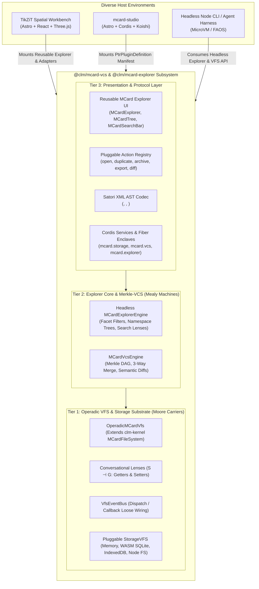
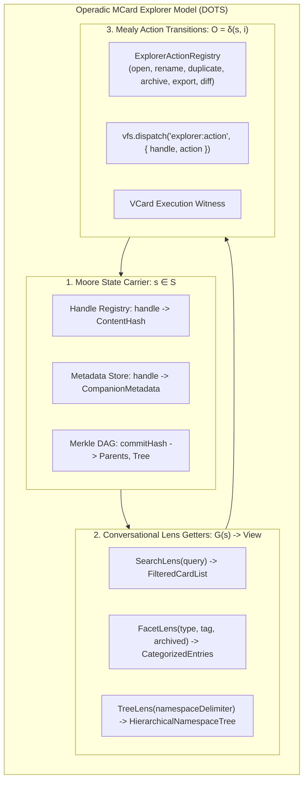

# Proposal: Sprints 25–29 — Operadic MCard Virtual File System, Merkle-VCS & Reusable Explorer Subsystem

**Status:** Proposed; Active Architecture Series  
**Target:** Universal Operadic Virtual File System (`@clm/mcard-vcs`) & Reusable MCard Explorer Subsystem Grounded in `clm-kernel` and `mcard-studio`  
**Authors:** BMAD Engineering Roundtable:
- **Winston** (System Architect & Double Category Theorist)
- **Amelia** (Senior Software Engineer & Implementation Specialist)
- **Sally** (UX Designer & Reactive Lens Ergonomist)
- **John** (Product Manager & Ecosystem Bridge Lead)
- **Mary** (Business Analyst & Quality Auditor)

**Theoretical & Mathematical Foundations:**
- **Double Operadic Theory of Systems (DOTS)** (`Hub/Theory/Category Theory/Double Operadic Theory of Systems.md`):
  - **Module Triangle**: Target (Objects / State Types), Carrier (Morphisms / System Classes), Action (Evaluations / Morphisms).
  - **Moore Machines ($O = \lambda(s)$)**: Passive state carriers (MCards) whose outputs depend solely on the internal state.
  - **Mealy Machines ($O = \delta(s, i)$)**: Active computational transitions (PCards, VFS Mutations, Explorer Actions) whose outputs depend on state *and* input.
  - **Conversational Lenses ($S \dashv G$)** (`Getters, Setters, and the Conversational Lens.md`): Symmetric monoidal tangency; bidirectional Getters ($s \to a$) and Setters ($s \times b \to s'$) satisfying formal lens laws.
  - **The Four DOTS Programming Idioms**:
    1. **Getter / Setter**: Reactive state lenses for storage, lineage, and explorer queries.
    2. **Dispatch / Callback**: Loose event wiring for mutations, change listeners, and explorer action dispatchers.
    3. **Mealy / Moore Machines**: Static MCard containers and dynamic state progression transitions.
    4. **Porting / Inversion**: Baldwin Change-of-Base $\operatorname{Lan}_K F$ (porting across TikZiT, `mcard-studio`, and headless agents) and Cordis dependency inversion ($\dashv$).
- **Cubical Logic Model (CLM)**: The Tri-Database Persistent Storage Substrate (`knowledge.db`, `executionLog.db`, `mcard.db`), Invariants INV-02 (Content-Addressable Identity), INV-05 (Tri-Database Separation), and INV-09 (Zero-FS Hermeticity).
- **Existing Codebase Foundations**:
  - `clm-kernel` (v0.0.1): `MCardFileSystem`, `StorageBackend`, `CASBackendPlugin`, `detectOptimalStorageBackend`, `registerFileSystemService`, `TriDatabaseManager`.
  - `mcard-studio`: `src/services/vfs/` (`vfsCore.ts`, `vfsCordis.ts`, `vfsVersions.ts`, `vfsMutations.ts`), `src/components/studio/` (`ExplorerPanel.astro`, `MCardFileTree.tsx`), `PtrPluginRegistry.ts`, `KoishiChatConsole.tsx`.
  - TikZiT: `src/components/workbench/CorpusExplorerDrawer.tsx`, `src/services/clm/corpusExplorerService.ts`, `VersionPopover.tsx`.
- **Cordis Meta-Framework & Satori Protocol**:
  - Cordis Five Pillars: Empty Root Context ($\bot$), Fibers (5-state lifecycle), `DisposableList` LIFO unwinding, Coeffects Injection, and Hot Module Replacement (HMR).
  - Satori XML AST Normalization (`<card>`, `<version-dag>`, `<diff-view>`, `<mcard-explorer>`, `<execute>`).

---

## 1. Executive Summary & Problem Statement

### 1.1 The Challenge: Siloed Storage and Fragmented Explorer UIs
Across the CLM ecosystem, three parallel systems independently browse and manipulate MCards:
1. **TikZiT**: Operates `CorpusExplorerDrawer.tsx` (backed by `corpusExplorerService.ts`), providing diagram search, type filtering (`draft`, `diagram`, `example`), CID hash inspection, and diagram export actions.
2. **`mcard-studio`**: Operates `ExplorerPanel.astro` and `MCardFileTree.tsx` (backed by `src/services/vfs/`), providing tree-based asset browsing, card count badges, and Petri Net marking inspection.
3. **`clm-kernel`**: Provides `MCardFileSystem` and `TriDatabaseManager` as low-level storage primitives, but lacks an operadic explorer engine or UI viewlet abstraction.

This fragmentation introduces acute problems:
- **Redundant Development**: Both TikZiT and `mcard-studio` independently maintain bespoke search filters, hash display pills, and lineage audit rows.
- **Inconsistent UX**: Exploring cards, inspecting Merkle lineages, and triggering card mutations feels completely different between TikZiT and `mcard-studio`.
- **Host Entanglement**: TikZiT's explorer cannot be used in `mcard-studio`, and `mcard-studio`'s tree cannot be embedded in TikZiT or third-party web apps (e.g. Obsidian or VS Code).

### 1.2 The Strategic Vision: A Unified Operadic Subsystem with Reusable Explorer
This proposal expands **Sprints 25–29** to deliver an integrated, modular engine containing:
1. **Headless Operadic VFS & Storage Kernel**: Grounded on `clm-kernel`'s `MCardFileSystem`, featuring DOTS Getter/Setter lenses, Dispatch/Callback wiring, and pluggable `StorageVFS` backends.
2. **Content-Addressed Merkle-VCS Engine**: Git-caliber Mealy machine versioning with `CommitMCard` DAGs, branch references (`refs/heads/*`), semantic graph AST diffs, and deterministic 3-way merges.
3. **Reusable MCard Explorer Subsystem (`@clm/mcard-explorer`)**:
   - **Headless Explorer Core**: Pure state machine managing search queries, facet filters, namespace trees, and active selections.
   - **Pluggable Action Registry**: Host applications register domain-specific actions (`open`, `duplicate`, `archive`, `export`, `diff`, `inspectMarking`) executed as Mealy transitions.
   - **Universal UI Viewlets**: Reusable React/Astro components (`MCardExplorer`, `MCardSearchBar`, `MCardTree`, `MCardEntryRow`) and Satori hypermedia elements (`<mcard-explorer>`).
4. **Cordis Inversion & `mcard-studio` Plugin Bridge**: Standard `PtrPluginDefinition` manifest enabling `mcard-studio` to mount the entire storage, VCS, and explorer suite via `PtrPluginRegistry.ts`.
5. **Upstream Evolution Blueprint (`RFC-CLM-002-OPERADIC-VFS.md`)**: Informs how `clm-kernel` v0.2.0 should natively absorb operadic lenses and Merkle lineage.



---

## 2. Architectural Colloquy: The BMAD Roundtable

### 2.1 Winston (System Architect)
> *"Let us examine the ontology of the MCard Explorer through the **Double Operadic Theory of Systems (DOTS)**:
>
> 1. **The Explorer State as a Moore Carrier**: At any given moment, the set of cards, their content hashes, their companion metadata, and their namespaces constitute an immutable state snapshot ($s \in \mathcal{S}$). An explorer query is a **Getter Lens ($G: \mathcal{S} \to \mathcal{A}$)** projecting a filtered, faceted subset of that state.
> 2. **Explorer Actions as Mealy Morphisms**: When a user or agent clicks 'archive', 'duplicate', 'rename', or 'checkout', this is an input intent $i$ applied to state $s$, yielding an output state $s'$ and a verifiable action receipt ($O = \delta(s, i)$).
> 3. **The Pluggable Action Registry**: To make the Explorer truly reusable, the core explorer cannot know about TikZiT's canvas or `mcard-studio`'s Petri Net markings. The core explorer engine only knows card handles, hashes, and an abstract `ActionRegistry`. Each host application registers its custom action morphisms via dependency injection.
> 4. **Cordis Inversion**: The Explorer service must be mounted onto the Cordis Context as `ctx.mcard.explorer`. All active queries and event subscriptions must register with the fiber's `DisposableList` so that closing an explorer drawer leaves zero dangling listeners."*

### 2.2 Amelia (Senior Software Engineer)
> *"Looking at the code in `src/components/workbench/CorpusExplorerDrawer.tsx` (TikZiT) and `src/components/studio/views/fileTree/` (`mcard-studio`):
>
> Right now, both components duplicate:
> - Search debouncing and query filtering.
> - Displaying abbreviated content hashes (`CID: bafk...` or `urn:mcard:blake3:...`).
> - Handling active item selection and keyboard arrow navigation.
> - Sorting by creation or modification timestamps.
>
> We will split this cleanly into:
> - `src/packages/mcard-vcs/explorer/core/`: `MCardExplorerEngine.ts` (pure TypeScript, zero DOM, $\le 220$ LOC).
> - `src/packages/mcard-vcs/explorer/ui/`: `MCardExplorer.tsx`, `MCardTree.tsx`, `MCardSearchBar.tsx`, `MCardEntryRow.tsx` (React/Astro compatible, $\le 200$ LOC each).
> - `src/packages/mcard-vcs/explorer/actions/`: `ExplorerActionRegistry.ts` providing pre-built actions for standard VFS operations.
>
> In TikZiT, `CorpusExplorerDrawer.tsx` becomes a 60-line wrapper around `MCardExplorer`. In `mcard-studio`, `ExplorerPanel.astro` mounts the same `MCardExplorer` component with studio-specific facets!"*

### 2.3 Sally (UX Designer)
> *"From an ergonomics standpoint, making the Explorer a reusable subsystem solves huge user experience problems:
> 1. **Visual Parity**: Both TikZiT and `mcard-studio` will share the same polished design system: high-contrast CID hash pills, status badges (`draft`, `diagram`, `example`, `marking`), and smooth collapsible namespace sections.
> 2. **Keyboard Accessibility**: Arrow keys up/down navigate rows; Enter opens; Cmd+F focuses the search bar; Esc clears the filter.
> 3. **Satori Conversational Explorer**: In `mcard-studio`'s chat console (`KoishiChatConsole.tsx`), the AI agent can output:
>    ```xml
>    <mcard-explorer query="zx:diagrams:*" facet="diagram" active="zx:diagrams:bell-state" />
>    ```
>    which renders an interactive, browsable explorer card directly inside the chat stream! The user can click any card in the chat to open it in TikZiT's spatial canvas or the studio's inspector."*

### 2.4 John (Product Manager)
> *"This is the definition of true ecosystem leverage. By delivering a reusable MCard Explorer subsystem:
> 1. **TikZiT benefits immediately**: Cleaner architecture, faster search filtering, and zero UI regressions.
> 2. **`mcard-studio` gets an immediate upgrade**: The studio replaces its static `ExplorerPanel.astro` and file tree with a rich, reactive MCard Explorer supporting multi-modal search, Merkle version history, and Satori chat integration.
> 3. **Future applications get an instant explorer**: Any future tool in the PKC/Functionals workspace (e.g. an Obsidian MCard plugin, a VS Code extension, or a web dashboard) can drop in `@clm/mcard-explorer` and immediately have a production-grade card browser."*

### 2.5 Mary (Business Analyst)
> *"My primary concern is Contract B (Selector Stability) and zero-regression testing:
> 1. **Selector Preservation**: In Sprint 22, we audited TikZiT's literal `data-testid` selectors. The refactored `CorpusExplorerDrawer.tsx` must preserve every single selector:
>    - `drawer-corpus-explorer`
>    - `explorer-search-input`
>    - `corpus-entry-*`
>    - `btn-archive-card`, `btn-duplicate-card`, `btn-export-collection`
> 2. **DoD Compliance**: Every sprint must include explicit verification checkpoints testing the headless explorer engine, lens accessors, action registries, and cross-application rendering.
> 3. **466 Unit Tests**: All 466 existing Vitest tests must continue to pass 100% green without modification."*

---

## 3. Theoretical Framework: Operadic Lenses & Explorer Actions



### 3.1 The Explorer Lens Contract (`explorer/types.ts`)
```typescript
export interface ExplorerFilterOptions {
  query?: string;
  facet?: 'all' | 'diagram' | 'draft' | 'example' | 'archived' | 'marking';
  handlePrefix?: string;
  sortBy?: 'updatedAt' | 'createdAt' | 'title' | 'version';
  sortDirection?: 'asc' | 'desc';
}

export interface ExplorerEntryView {
  handle: string;
  cardHash: string;
  shortHash: string;
  title: string;
  type: string;
  badge: string;
  updatedAt: number;
  createdAt: number;
  archived: boolean;
  versionCount: number;
  tags?: string[];
  metadata?: Record<string, any>;
}

export interface NamespaceTreeNode {
  name: string;
  path: string;
  isFolder: boolean;
  children: NamespaceTreeNode[];
  entries: ExplorerEntryView[];
  count: number;
}

export interface ExplorerLens<S> {
  queryEntries(state: S, options: ExplorerFilterOptions): ExplorerEntryView[];
  buildNamespaceTree(state: S, options?: { delimiter?: string }): NamespaceTreeNode;
  resolveActiveEntry(state: S, activeHandle: string | null): ExplorerEntryView | null;
}
```

### 3.2 Pluggable Action Registry (`explorer/ExplorerActionRegistry.ts`)
```typescript
export interface ExplorerActionContext {
  handle: string;
  entry: ExplorerEntryView;
  storage: OperadicMCardVfs;
  vcs: MCardVcsEngine;
}

export interface ExplorerActionDefinition {
  id: string;
  label: string;
  icon?: string;
  shortcut?: string;
  isPrimary?: boolean;
  isEnabled?: (ctx: ExplorerActionContext) => boolean;
  execute: (ctx: ExplorerActionContext) => Promise<void>;
}

export class ExplorerActionRegistry {
  private actions = new Map<string, ExplorerActionDefinition>();

  public register(action: ExplorerActionDefinition): () => void {
    this.actions.set(action.id, action);
    return () => this.actions.delete(action.id);
  }

  public getAvailableActions(ctx: ExplorerActionContext): ExplorerActionDefinition[] {
    return Array.from(this.actions.values()).filter(a => !a.isEnabled || a.isEnabled(ctx));
  }

  public async executeAction(actionId: string, ctx: ExplorerActionContext): Promise<void> {
    const action = this.actions.get(actionId);
    if (!action) throw new Error(`[ExplorerActionRegistry] Unknown action: ${actionId}`);
    await action.execute(ctx);
  }
}
```

---

## 4. Architectural Decision Records (ADRs D22–D31)

- **D22 (Subsystem Boundary & Packaging)**: Package the subsystem as `@clm/mcard-vcs` and `@clm/mcard-explorer` under `src/packages/mcard-vcs/`, with strict zero-DOM isolation for core logic.
- **D23 (Grounded VFS & Zero-FS Hermeticity - INV-09)**: Built directly upon `clm-kernel`'s `MCardFileSystem` and `TriDatabaseManager`. Pluggable `StorageVFS` backends (Memory, WASM SQLite, IndexedDB, Node FS).
- **D24 (Content-Addressed Merkle DAG & Mealy VCS)**: Implement versioning as a formal Mealy state machine operating over a content-addressed Merkle DAG with parent commit hashes, branch refs, semantic graph diffs, and deterministic 3-way merges.
- **D25 (Conversational Lens & Dispatch API)**: Provide reactive Getters and Setters satisfying formal lens laws, with typed dispatch/callback event wiring for UI and agent observation.
- **D26 (Cordis Fiber Lifecycle & Reversible Effects)**: Mount storage transactions and merge sessions in Cordis Fibers with 5-state lifecycle and LIFO `DisposableList` unwinding.
- **D27 (Canonical `mcard-studio` PTR Plugin)**: Expose a standard `PtrPluginDefinition` manifest (`TikzitMCardVcsPlugin`) declaring Petri Net places, transitions, Satori tag renderers, and explorer viewlets for `mcard-studio`.
- **D28 (Upstream `clm-kernel` Evolution Blueprint)**: Formalize lessons into `RFC-CLM-002-OPERADIC-VFS.md` for `clm-kernel` v0.2.0.
- **D31 (Reusable MCard Explorer Architecture)**: Structure the MCard Explorer as an autonomous subsystem (`@clm/mcard-explorer`) consisting of a headless state machine (`MCardExplorerEngine`), a pluggable `ExplorerActionRegistry`, host-agnostic React/Astro UI components (`MCardExplorer`), and Satori hypermedia renderers.

---

## 5. Active Sprints 25–29 Roadmap Overview

| Sprint | Subsystem | Specification Document | Focus & Scope | Lead Agents | Status |
| :---: | :--- | :--- | :--- | :---: | :---: |
| **Proposal** | `architecture` | [`PROPOSAL-25-29-PORTABLE-MCARD-STORAGE-AND-VERSION-CONTROL.md`](PROPOSAL-25-29-PORTABLE-MCARD-STORAGE-AND-VERSION-CONTROL.md) | Master proposal, BMAD colloquy, DOTS foundations, ADRs D22–D31, and ecosystem convergence strategy. | Winston, Amelia, Sally, John & Mary | 📋 **Proposed** |
| **25** | `corpus` / `storage` | [`../../corpus/25-isolated-mcard-storage-kernel-and-vfs/SPRINT-25-ISOLATED-MCARD-STORAGE-KERNEL-AND-VFS.md`](../../corpus/25-isolated-mcard-storage-kernel-and-vfs/SPRINT-25-ISOLATED-MCARD-STORAGE-KERNEL-AND-VFS.md) | Operadic VFS grounded on `clm-kernel`'s `MCardFileSystem`; Getter/Setter lenses; Dispatch/Callback event wiring; Moore state carrier; handle namespace indexers. | Winston & Amelia | 📋 **Proposed** |
| **26** | `sync` / `vcs` | [`../../sync/26-content-addressed-version-control-and-merkle-lineage/SPRINT-26-CONTENT-ADDRESSED-VERSION-CONTROL-AND-MERKLE-LINEAGE.md`](../../sync/26-content-addressed-version-control-and-merkle-lineage/SPRINT-26-CONTENT-ADDRESSED-VERSION-CONTROL-AND-MERKLE-LINEAGE.md) | Mealy Machine VCS engine; Merkle DAG commits (`CommitMCard`); immutable branch refs; multi-modal semantic AST diffs; deterministic 3-way merge. | Winston & Amelia | 📋 **Proposed** |
| **27** | `orchestration` / `protocol` | [`../27-cordis-fiber-and-satori-protocol-adapters/SPRINT-27-CORDIS-FIBER-AND-SATORI-PROTOCOL-ADAPTERS.md`](../27-cordis-fiber-and-satori-protocol-adapters/SPRINT-27-CORDIS-FIBER-AND-SATORI-PROTOCOL-ADAPTERS.md) | Inversion of Control via Cordis Fibers; LIFO `DisposableList`; Satori XML/JSON AST codecs; conversational turn pipeline; Satori `<mcard-explorer>` tag codec. | Winston & Sally | 📋 **Proposed** |
| **28** | `orchestration` / `plugin` | [`../28-mcard-studio-plugin-and-cross-application-bridge/SPRINT-28-MCARD-STUDIO-PLUGIN-AND-CROSS-APPLICATION-BRIDGE.md`](../28-mcard-studio-plugin-and-cross-application-bridge/SPRINT-28-MCARD-STUDIO-PLUGIN-AND-CROSS-APPLICATION-BRIDGE.md) | Reusable `MCardExplorer` UI & `PtrPluginDefinition` manifest; Petri Net places/transitions; Satori tag renderers; `mcard-studio` ExplorerPanel integration; `clm-kernel` RFC. | Winston, John & Sally | 📋 **Proposed** |
| **29** | `verification` / `shell` | [`../../verification/29-tikzit-host-integration-and-verification-matrix/SPRINT-29-TIKZIT-HOST-INTEGRATION-AND-VERIFICATION-MATRIX.md`](../../verification/29-tikzit-host-integration-and-verification-matrix/SPRINT-29-TIKZIT-HOST-INTEGRATION-AND-VERIFICATION-MATRIX.md) | Re-anchor TikZiT `CorpusExplorerDrawer` on `MCardExplorer`; preserve all 196 testids; verify 466 tests green; cross-application roundtrip verification with `mcard-studio`. | Amelia & Mary | 📋 **Proposed** |
