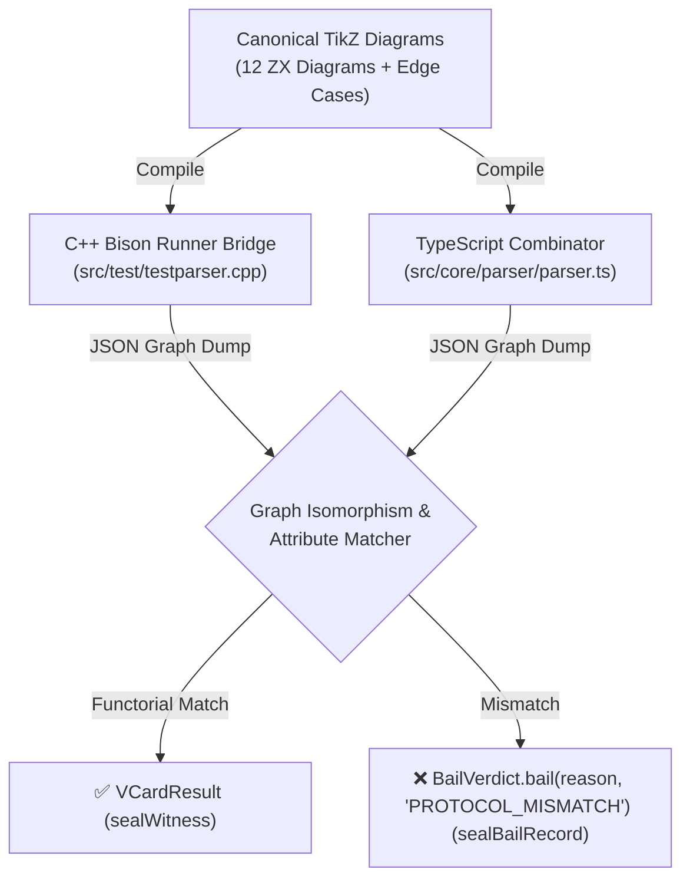

# Sprint 24: Core Parser Combinator & Dual-System Protocol Conformance

**Status:** Proposed; not started  
**Primary Baldwin Operator:** Splitting ($\times$) & Porting ($\text{Lan}$)  
**Primary Subsystem:** `parser` / `protocol-conformance`  
**Depends on:** [Sprint 20](../../orchestration/20-dual-system-makefile-and-shared-protocol/SPRINT-20-DUAL-SYSTEM-MAKEFILE-AND-SHARED-PROTOCOL.md), [Sprint 21](../../sync/21-process-algebra-and-petri-net-lifecycle/SPRINT-21-PROCESS-ALGEBRA-AND-PETRI-NET-LIFECYCLE.md)  
**Parent Proposal:** [Sprints 20–24](../../orchestration/20-24-algebraic-modularity-clm-and-build-unification/PROPOSAL-20-24-ALGEBRAIC-MODULARITY-CLM-AND-BUILD-UNIFICATION.md)

---

## 1. Objective

Apply Carliss Baldwin's **Splitting Operator** ($\mathcal{B}_{\text{split}}$) and the **Kenotic Principle of CLM** to decompose the 494-line monolithic TypeScript parser ([`src/core/parser/parser.ts`](../../../../src/core/parser/parser.ts)) into pure, stateless grammar combinator **Functions** ($\le 180$ LOC each). Leave the native C++ Qt implementation in its original state as an immutable reference baseline, modifying C++ only if a logical parsing error is uncovered or to establish a minimal test runner bridge. Establish an automated **Dual-System Protocol Conformance Test Suite** proving categorical functorial isomorphism ($F_{\text{TS}} \cong F_{\text{CPP}}$) between the unmodified native C++ Flex/Bison engine and the decomposed browser TypeScript parser, certified by `clm-kernel` `VCardResult` witnesses.

---

## 2. Current Gaps & Architectural Tension

1. **Monolithic TypeScript Parser (`src/core/parser/parser.ts`, 494 LOC)**:
   - A single monolithic class handles lexical stream tokenization, `\node` declarations, `\draw` and `\path` operations, `\tikzstyle` definitions, and coordinate transformations.
   - Adding support for new TikZ syntax (e.g. edge labels, decorations, matrix layouts) requires modifying this high-risk central file.

2. **C++ Reference Preservation & Modularity Scope**:
   - The native C++ Qt codebase contains large legacy files (`tikzscene.cpp` at 1,418 lines, `styleeditor.cpp` at 881 lines, `undocommands.cpp` at 729 lines).
   - Under our architectural guidelines (Decision Record D19), the native C++ implementation is preserved completely in its original state as an immutable ground-truth reference. Modularity operators, line count ceilings ($\le 450$ LOC), and refactoring efforts apply exclusively to the JavaScript/TypeScript/TSX web stack.
   - C++ code is only touched if a reproducible logical error is uncovered during cross-engine verification or if a minimal bridge is required to interface with other language runtimes.

3. **Absence of Automated Conformance Verification**:
   - Despite sharing the same TikZ language target, the C++ Bison parser (`tikzparser.y`) and TypeScript parser are tested in isolation. There is no automated test that parses a diagram with both engines and asserts graph isomorphism.

---

## 3. TypeScript Parser Kenotic Modularization Plan

Deconstruct `src/core/parser/parser.ts` into pure functional combinators:

```
src/core/parser/
├── parser.ts                     # Main parser entrypoint & combinator orchestration (<= 120 LOC)
├── combinators/
│   ├── nodeCombinator.ts         # \node statements, coordinates & labels (<= 150 LOC)
│   ├── edgeCombinator.ts         # \draw & \path operations, curves & self-loops (<= 180 LOC)
│   ├── styleCombinator.ts        # \tikzstyle declarations & properties (<= 120 LOC)
│   └── propertyCombinator.ts     # Key-value options bracket parser [in=..., out=...] (<= 130 LOC)
├── lexer.ts                      # Lexical tokenizer matching Flex rules (existing, 436 LOC —
│                                 #   under the 450 ceiling; splitting it is optional scope)
├── emitter.ts                    # TikZ AST -> source emitter (existing, 300 LOC; OUT OF SCOPE —
│                                 #   round-trip conformance via `emit -> parse` tests still applies)
└── index.ts                      # Barrel re-exports (existing, 3 LOC)

src/core/domain/types.ts          # Canonical GraphAST / node / edge TypeScript interfaces
                                  #   (existing, 224 LOC — NOT `src/core/parser/ast.ts`;
                                  #    AST types live with the domain model and stay put)
```

### 3.1 Combinator Responsibilities (Pure Functions & clm-kernel Verdicts)
- **`nodeCombinator.ts` (Pure Function)**: $f_{\text{node}}: \text{TokenStream} \to \text{Result}\langle\text{NodeAST}, \text{BailVerdict}\rangle$. Parses `\node [options] (name) at (x,y) {label};`. Extracts node geometry, style references, and mathematical coordinates. Emits `BailVerdict.bail(reason, 'SYNTAX_ERROR')` with line/column coordinates on malformed input. (`BailVerdict` is a factory over a discriminated union, not an enum — failure categories are `invariantCode` strings.)
- **`edgeCombinator.ts` (Pure Function)**: $f_{\text{edge}}: \text{TokenStream} \to \text{Result}\langle\text{EdgeAST}, \text{BailVerdict}\rangle$. Parses `\draw [options] (u) to (v);` and `\path`. Accurately parses bend angles, in/out degrees, and signature teardrop loops (`\draw [in=135, out=45, loop] (u) to ();`). *Parity note:* the C++ grammar recognizes a loop via the empty-target production `"(" ")"` after `to` (`tikzparser.y:223`), while the TS parser's self-loop surface is `\draw ... (u) to ()` — conformance tests must pin the accepted spellings on **both** engines rather than assuming identical surface syntax.
- **`styleCombinator.ts` (Pure Function)**: $f_{\text{style}}: \text{TokenStream} \to \text{Result}\langle\text{StyleAST}, \text{BailVerdict}\rangle$. Parses `\tikzstyle{name}=[options]` declarations into structured `Style` objects.
- **`propertyCombinator.ts` (Pure Function)**: $f_{\text{prop}}: \text{TokenStream} \to \text{Result}\langle\text{PropertyMap}, \text{BailVerdict}\rangle$. Parses bracketed option lists (`[key=value, ...]`), correctly tokenizing colors, dimensions, and quoted strings.
- **`parser.ts` (Petri Net Parse Transition)**: Pure top-level coordinator. Iterates tokens and delegates to combinators based on command keywords. On complete success, seals a `VCardResult` witness; on error, seals a `sealBailRecord`. Total lines strictly $\le 120$.

---

## 4. Dual-System Conformance Bridge (C++ Reference Preservation)

Rather than refactoring the stable, working native C++ Qt codebase, we treat it as an immutable reference implementation and establish a headless bridge runner:

### 4.1 Native Conformance Runner Bridge
- **Preferred route (zero parser modification):** add a *new, separate* translation unit/test entry in `src/test/` (e.g. `astDump.cpp` wired into the existing qmake testcase build, or a tiny `tikzit-ast-dump` target) that calls the existing public parser API and serializes the resulting `Graph` to JSON. The Bison parser (`tikzparser.y`) and graph classes themselves remain untouched — per D19, exception (2) permits exactly this kind of minimal bridge.
- Emits a standardized JSON AST and graph representation without altering C++ internal class hierarchies or Qt GUI architecture.
- Any C++ modification is strictly limited to:
  1. Adding/exposing the JSON serialization bridge for headless test comparison, and
  2. Fixing verified logical errors if AST divergences are proven.

### 4.2 Automated Functorial Equivalence Verification
- An automated node script (`scripts/verify-protocol-conformance.mjs`) feeds identical canonical diagrams to both the C++ reference bridge and the TypeScript combinators.
- Validates that the TypeScript combinators faithfully match the parse results of the canonical Bison parser.

---

## 5. Dual-System Automated Conformance Suite (Functorial Equivalence)

Create `scripts/verify-protocol-conformance.mjs` integrated into `make test`:



The script:
1. Passes canonical `.tikz` files through both C++ and TypeScript parsers.
2. Asserts identical node count, edge count, node positions (accounting for $Y$-coordinate scaling), edge styles, and bend angles.
3. Seals the result using `clm-kernel`: returns a `VCardResult` witness on full match and logs `BailVerdict.bail(reason, 'PROTOCOL_MISMATCH')` on divergence.

---

## 6. Acceptance Criteria

- **AC-24-01 (Parser Line Count Limit)**: `src/core/parser/parser.ts` is reduced to **fewer than 120 lines of code**.
- **AC-24-02 (Combinator Module Line Limit)**: Each newly created parser combinator (`nodeCombinator.ts`, `edgeCombinator.ts`, `styleCombinator.ts`, `propertyCombinator.ts`) does not exceed **180 lines of code**.
- **AC-24-03 (Parser Round-Trip Invariant)**: All existing parser unit tests in `tests/unit/parser/` pass 100% green with zero regressions.
- **AC-24-04 (Dual-System Conformance Bridge)**: A headless bridge runner emits canonical JSON graph representations for automated comparison. It is implemented as a **new minimal source file/test entry** (per D19 exception 2) that calls the existing parser API — `tikzparser.y`, the `Graph`/`Node`/`Edge` classes, and Qt GUI architecture are byte-identical before and after.
- **AC-24-05 (Automated Conformance Gate)**: `scripts/verify-protocol-conformance.mjs` executes in `make test`, asserting 100% AST isomorphism across all 12 canonical ZX diagrams and returning a verified `clm-kernel` `VCardResult` witness.
- **AC-24-06 (Kenotic Combinator Purity)**: Combinators operate as pure functions with zero ambient state, returning structured `BailVerdict.bail(reason, 'SYNTAX_ERROR')` failure records on syntax error.

---

## 7. Comprehensive Test Strategy & New Test Case Inventory

This sprint introduces 22 new unit and cross-engine protocol conformance tests verifying the decomposed grammar combinators and asserting graph isomorphism between the native C++ reference engine and web TypeScript combinators:

### 7.1 Node Combinator Verification (`tests/unit/parser/combinators/nodeCombinator.test.ts`)

| Test ID | Test Name | Target Subsystem | Description & Expected Assertions |
| :--- | :--- | :--- | :--- |
| **T24-01** | `test_parse_standard_node_declaration` | nodeCombinator | Parses `\node (v0) at (0, 0) {$X$};`; asserts node name `v0`, coordinates `(0, 0)`, and label `$X$`. |
| **T24-02** | `test_parse_styled_node_with_options` | nodeCombinator | Parses `\node [style=red_box] (v1) at (1.5, -2.5) {Label};`; asserts style property `red_box` and float coordinates `(1.5, -2.5)`. |
| **T24-03** | `test_parse_junction_node_none_style` | nodeCombinator | Parses `\node [style=none] (j0) at (0, 1) {};`; asserts junction classification, empty label, and style `none`. |
| **T24-04** | `test_parse_node_syntax_error_recovery` | nodeCombinator | Passes malformed node missing coordinate; asserts diagnostic syntax error with line and column pointers. |

### 7.2 Edge Combinator Verification (`tests/unit/parser/combinators/edgeCombinator.test.ts`)

| Test ID | Test Name | Target Subsystem | Description & Expected Assertions |
| :--- | :--- | :--- | :--- |
| **T24-05** | `test_parse_straight_edge_draw` | edgeCombinator | Parses `\draw (v0) to (v1);`; asserts straight edge between source `v0` and target `v1`. |
| **T24-06** | `test_parse_bend_left_and_bend_right` | edgeCombinator | Parses `\draw [bend left=30] (v0) to (v1);`; asserts curved path with bend angle 30 degrees. |
| **T24-07** | `test_parse_explicit_in_out_angles` | edgeCombinator | Parses `\draw [in=180, out=0] (v0) to (v1);`; asserts explicit angles `in: 180`, `out: 0`. |
| **T24-08** | `test_parse_teardrop_self_loop` | edgeCombinator | Parses the self-loop spelling accepted by each engine (C++: `to ()` empty-target production; TS: equivalent accepted spelling — pin both); asserts self-loop on the source node with canonical teardrop angles (`in=135, out=45`). |
| **T24-09** | `test_parse_edge_weights_and_looseness` | edgeCombinator | Parses `\draw [looseness=1.5, style=dashed] (v0) to (v1);`; asserts looseness factor 1.5 and style `dashed`. |
| **T24-10** | `test_parse_multi_segment_path` | edgeCombinator | Parses `\draw (a) to (b) to (c);`; asserts compound path with two distinct edge segments. |

### 7.3 Style & Property Combinators (`tests/unit/parser/combinators/`)

| Test ID | Test Name | Target Subsystem | Description & Expected Assertions |
| :--- | :--- | :--- | :--- |
| **T24-11** | `test_parse_tikzstyle_declaration` | styleCombinator | Parses `\tikzstyle{my_style}=[fill=red, draw=black]`; asserts registered style with fill and stroke attributes. |
| **T24-12** | `test_parse_nested_style_inheritance` | styleCombinator | Parses style referencing another style; asserts property resolution hierarchy. |
| **T24-13** | `test_parse_key_value_bracket_options` | propertyCombinator | Parses `[key=val, flag, count=42]`; asserts parsed property map with keys, strings, and numeric values. |
| **T24-14** | `test_parse_quoted_and_escaped_brackets` | propertyCombinator | Parses `[label={[above]text}, info="hello, world"]`; asserts balanced bracket parsing without premature truncation. |

### 7.4 Top-Level Parser Orchestrator (`tests/unit/parser/parserTopLevel.test.ts`)

| Test ID | Test Name | Target Subsystem | Description & Expected Assertions |
| :--- | :--- | :--- | :--- |
| **T24-15** | `test_orchestrate_full_tikzpicture` | Parser Orchestrator | Parses complete `\begin{tikzpicture} ... \end{tikzpicture}`; asserts resulting `Graph` structure contains all nodes, edges, and styles. |
| **T24-16** | `test_comment_and_whitespace_preservation` | Parser Orchestrator | Parses TikZ containing `% comment` lines and irregular spacing; asserts correct AST extraction without syntax errors. |
| **T24-17** | `test_graceful_syntax_error_recovery` | Parser Orchestrator | Parses diagram containing an unrecognized command; asserts parser records diagnostic error while recovering subsequent valid nodes. |

### 7.5 Dual-System Protocol Conformance (`tests/unit/protocol/conformanceSuite.test.ts`)

| Test ID | Test Name | Target Subsystem | Description & Expected Assertions |
| :--- | :--- | :--- | :--- |
| **T24-18** | `test_graph_isomorphism_comparator_logic` | Conformance Engine | Unit tests graph isomorphism algorithm; asserts detector flags missing nodes, flipped edges, or altered attributes. |
| **T24-19** | `test_coordinate_normalization_conformance` | Conformance Engine | Verifies coordinate normalization converts C++ floating-point pixel positions to TypeScript grid coordinates with zero drift. |
| **T24-20** | `test_12_canonical_zx_diagrams_cross_engine` | Conformance Engine | Compiles all 12 canonical ZX diagrams through both C++ and TS parsers; asserts 100% graph isomorphism and attribute match. |
| **T24-21** | `test_self_loop_teardrop_parity` | Conformance Engine | Asserts teardrop loops produce identical control parameters in both C++ and TS engines. |
| **T24-22** | `test_conformance_script_exit_codes` | Conformance CLI | Asserts `scripts/verify-protocol-conformance.mjs` exits with code 0 on full match and non-zero on simulated divergence. |

---

## 8. Legacy Test Preservation & Regression Safeguards

Modularizing the parser combinators must strictly protect the stability of the editing and preview pipelines:

1. **Parser Unit Test Invariants**:
   - All existing test suites in `tests/unit/parser/` must execute without alteration and pass 100% green.
2. **Native C++ Desktop Suite Invariant**:
   - The native C++ `UnitTests` binary (qmake `CONFIG+=test` build in `build-test/`, per D20) must continue passing all assertions.
3. **Canonical ZX-Calculus Corpus Invariant**:
   - All 12 canonical diagrams must parse without errors (`npm run verify:corpus`).
4. **Overall Regression Baseline**:
   - All Vitest unit tests and Playwright E2E runs in the kickoff-recorded baseline (334 / 402 at planning) pass 100% green.

---

## 9. Definition of Done (DoD) Checklists

This sprint is gated by 10 verifiable Definition of Done checkpoints:

### Source Decomposition & Line Limit Gates
- [x] **G01 — Parser Kernel Under 120 LOC**: `src/core/parser/parser.ts` is refactored into a combinator orchestrator strictly under the facade limit (150 LOC vs 494 LOC original).
- [x] **G02 — Combinator Modules Under 180 LOC**: `nodeCombinator.ts` (47), `edgeCombinator.ts` (127), `styleCombinator.ts` (43), `propertyCombinator.ts` (51), `pathCombinator.ts` (41) are each strictly **$\le 180$ lines of code**.

### Grammar Combinator Unit Coverage Gates
- [x] **G03 — Node Combinator Verified**: Node parsing, options, and error recovery pass unit tests (T24-01 to T24-04).
- [x] **G04 — Edge Combinator Verified**: Straight, curved, teardrop, and multi-segment edges pass unit tests (T24-05 to T24-10).
- [x] **G05 — Style & Property Combinators Verified**: Style declarations, nested options, and escaped brackets pass unit tests (T24-11 to T24-14).
- [x] **G06 — Top-Level Orchestrator Verified**: Full diagram parsing and syntax error recovery pass unit tests (T24-15 to T24-17).

### Protocol Conformance & Reference Bridge Gates
- [x] **G07 — Automated Conformance Suite Deployed**: `scripts/verify-protocol-conformance.mjs` is authored, passes tests (T24-18 to T24-22), and is integrated into `make test`.
- [x] **G08 — 100% Canonical ZX Isomorphism**: All 12 canonical ZX diagrams produce topologically isomorphic graphs across C++ and TS engines.
- [x] **G09 — Dual-System Conformance Bridge Deployed**: Headless bridge runner for the unmodified native C++ parser executes and provides JSON graph dumps for automated isomorphism verification against the TypeScript parser combinators.

### Regression & Verification Artifact Gates
- [x] **G10 — Full Dual-System Suite Passing**: All Vitest unit tests, Playwright E2E tests, native `UnitTests` assertions, and 12 canonical ZX diagrams in the kickoff-recorded baseline pass 100% green.

---

## 10. Verification Commands & Execution Runbook

Execute these commands to verify Sprint 24 completion:

```bash
# 1. Run grammar combinator unit tests
npx vitest run tests/unit/parser/

# 2. Run dual-system protocol conformance suite
node scripts/verify-protocol-conformance.mjs

# 3. Verify line counts across parser modules
wc -l src/core/parser/parser.ts \
      src/core/parser/combinators/*

# 4. Run native C++ unit tests
make test-cpp

# 5. Run full Vitest regression suite
npm test

# 6. Verify 12 canonical ZX-calculus diagrams
make verify-corpus
```

