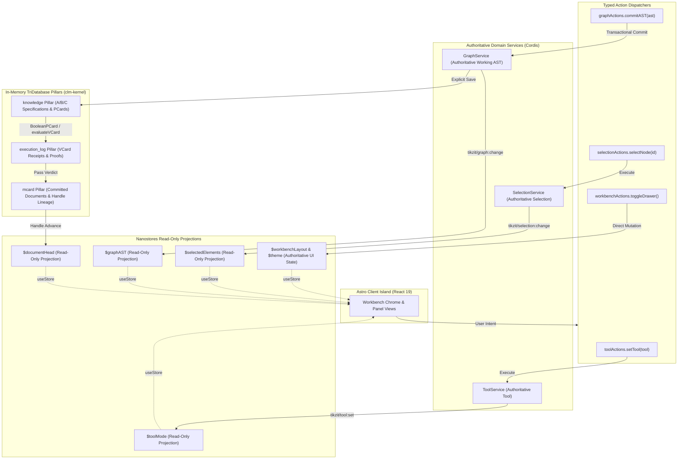

# Sprint 02B: Nanostores, Cordis, and CLM State Integration

> *"A resilient creative workbench requires an unequivocal state boundary. Nanostores owns reactive UI projections and client-side chrome; Cordis owns micro-kernel services and command execution; and clm-kernel provides verified MCard content addressing and PCard/VCard integrity gates behind typed adapters. Each mutable state has exactly one authoritative owner."*

---

## 1. Position and Architectural Scope

This sprint hardens the workbench state architecture and establishes a production-grade, in-memory **Cubical Logic Model (CLM)** integration for TikZiT Web. It bridges the graduated Sprint 02 Astro shell with Sprint 01's AST parser, preparing a deterministic, crash-resilient foundation for Sprint 03's Three.js canvas engine and Sprint 04's interactive gesture machines.

### 1.1 Current Baseline & Ground Truth
An exhaustive audit of the codebase, package dependencies, and compiler toolchain reveals the following concrete baseline:
1. **Installed Dependencies**:
   - `nanostores@1.5.4` and `@nanostores/react@2.0.1` are installed in `package.json`.
   - `cordis@4.0.0-rc.10` is pinned in lockfile; upstream API is under active development.
   - `clm-kernel@0.0.1` is installed with zero runtime node-sqlite lock-in, exposing verified primitives: `MCard`, `AgentDid`, `ContentHash`, `TriDatabaseManager`, `MCardCollection`, `MCardFileSystem`, `DynamicPCard`, `BooleanPCard`, `evaluateVCard`, and Cordis bridges (`registerFileSystemService`, `registerCollectionService`).
2. **TypeScript 7 Compiler Blocker & Parser Type Mismatches**:
   - Running `npx tsc --noEmit` fails immediately due to TypeScript 7 removing `baseUrl` and requiring leading `./` in `paths` (e.g. `"@/*": ["./src/*"]`).
   - Fixing `tsconfig.json` uncovers 15 latent type errors in `src/core/parser/emitter.ts` and `src/core/parser/parser.ts` (e.g., `PathData.edgeIds` vs `edges`, `TikzStyle.data` vs `properties`, `SafeParseResult.partialAST` vs `ast`, `ParseDiagnostic.severity`). While `esbuild` (used by Astro and Vitest) silently transpiles these, true TypeScript typechecking fails. Resolving these is a prerequisite gate.
3. **Current State & CLM Integration Gaps**:
   - State ownership in `src/stores/workbench.ts` currently mirrors mutable state between Cordis services and Nanostores stores with bidirectional event loops and equality checks.
   - Global module-level stores (`$toolMode`, `$workbenchLayout`, etc.) create cross-test state leakage and prevent clean multi-instance isolation.
   - `clm-kernel` is currently imported only in a single test file (`src/services/__tests__/clm-cordis.spec.ts`). Production code never registers `TriDatabaseManager`, `MCardFileSystem`, or `MCardCollection`.
   - The test in `clm-cordis.spec.ts` passes a raw string where `MCard.create()` requires a validated `AgentDid` instance.
   - In `clm-kernel`, `triadToPCardDefinition()` defaults `codeHash` to string `"0"` when no real `meta.c_hash` is provided. A real implementation hash is required.
   - Real browser bundling tests confirm that `MCard`, `AgentDid`, `TriDatabaseManager.newInMemory()`, and `MCardCollection` bundle cleanly in Astro 7 / Vite production builds (<350ms) without leaking Node-only modules. Durable browser storage (IndexedDB/OPFS) remains strictly deferred to Sprint 07.

---

## 2. Technical Findings & Root-Cause Remediation

| Finding | Evidence in Baseline | Root Cause | Target Direction & Remediation |
| :--- | :--- | :--- | :--- |
| **TS7 Validation Blocker** | `error TS5102: Option 'baseUrl' has been removed` and 15 parser type mismatches. | TypeScript 7 breaking changes and esbuild-only transpilation in Vitest. | Modernize `tsconfig.json` (remove `baseUrl`, fix `paths`); resolve parser/emitter interface mismatches (`edgeIds`, `partialAST`, `severity`). |
| **Duplicate State Ownership** | `$toolMode` and `ToolService.current`; `$selectedElements` and `SelectionService`; `$graphAST` and `GraphService.ast`. | Dual-write synchronization attempt with bidirectional listeners. | **Strict Unidirectional Flow**: Cordis services own domain state; Nanostores exposes **read-only projections** (`useStore`). Actions dispatch to Cordis. |
| **Global Store Singletons** | Module-scoped `$toolMode`, `$workbenchLayout` exported directly from `src/stores/workbench.ts`. | Single-file convenience pattern. | Introduce `createWorkbenchStores()` factory encapsulated in a `WorkbenchRuntime` instance provided via React Context. |
| **Untyped Cordis Event Bus** | Event payloads and names use `as any` (`'tool:set' as any`, `'selection:change' as any`). | Missing Cordis `Events` module augmentation. | Augment `interface Events` with typed, namespaced events (`tikzit/tool:set`, `tikzit/selection:change`, `tikzit/graph:change`). |
| **Command Identity Collisions** | `CommandService.register` overwrites previous handlers silently; unregister is not identity-safe. | Map-based registry with raw strings. | Enforce duplicate rejection; require namespaced IDs (`cmd:*`); return an identity-safe disposer. |
| **CLM Missing from Runtime** | Production workbench never imports or initializes `clm-kernel`. | Scope boundary in initial shell sprint. | Instantiate `TriDatabaseManager.newInMemory()` per runtime; register `'mcard.fs'` and `'mcard.collection'` into Cordis context. |
| **Unchecked Author DIDs** | `clm-cordis.spec.ts` passes raw string `'did:key:...'` to `MCard.create()`. | Duck-typing in JavaScript runtime. | Mandate `AgentDid.create(didString)`; validate author at MCard creation boundary. |
| **Triad Flattening Risk** | `triadToMCard()` collapses A/B/C into a single card; `triadToPCardDefinition()` falls back to `"0"`. | Upstream helper combines dimensions. | Create separate MCards for A, B, and C in `knowledge` pillar; triad index links their hashes; bind `codeHash` to verified C-card hash. |
| **Unchecked Save Gates** | Saves advance document state without invariant verification. | Missing pre/post condition execution. | Route explicit document saves through a `BooleanPCard` and `evaluateVCard()`; bail retains prior document head; receipts go to `executionLog`. |

---

## 3. Target Architecture & Authority Matrix

### 3.1 Strict State Authority Matrix

To prevent dual-source state desynchronization, every state slice is assigned exactly **one authoritative owner**. Nanostores serves exclusively as a reactive projection for domain states, and as the authoritative owner only for ephemeral UI chrome.



| State Slice | Authoritative Owner | Nanostores Projection | Persistence / CLM Pillar | Mutated Via |
| :--- | :--- | :--- | :--- | :--- |
| **Active Tool Mode** | `ToolService` (Cordis) | `$toolMode` (Read-only atom) | Ephemeral | `toolActions.setTool(t)` → `ToolService.setTool(t)` |
| **Selected Elements** | `SelectionService` (Cordis) | `$selectedElements` (Read-only map) | Ephemeral | `selectionActions.select*(...)` → `SelectionService` |
| **Active Working AST** | `GraphService` (Cordis) | `$graphAST` (Read-only atom) | Ephemeral working state | `graphActions.commitAST(ast)` → `GraphService.setAST(ast)` |
| **Committed TikZ Doc** | `MCardFileSystem` (clm-kernel) | `$documentHead` (Read-only map) | `mcard` pillar (content-addressed) | `saveDocument(handle, tikzText)` gated by `evaluateVCard` |
| **A/B/C Specifications** | `knowledge` pillar | None (Read on demand) | `knowledge` pillar | Registered once at runtime bootstrap |
| **Execution Receipts** | `executionLog` pillar | None (Audit trail) | `executionLog` pillar | Automatically emitted by `evaluateVCard` |
| **Drawer / Panel Chrome** | Nanostores (`$workbenchLayout`) | Authoritative store | Ephemeral (session) | `workbenchActions.toggleDrawer()`, etc. |
| **Theme (Dark/Light)** | Nanostores (`$theme`) | Authoritative store | `localStorage` (`tikzit:theme`) | `themeActions.setTheme(t)` |
| **Dockview Window Grid** | `DockviewApi` instance | Status indicator (`panelCount`) | `localStorage` / `mcard` snapshot | Dockview sashes, layout changes |

---

### 3.2 CLM Triad Contract for TikZiT Web

The Cubical Logic Model requires that any canonical process be stratified across the three categorical dimensions:
1. **Dimension A (Abstract Specification)**:
   - **URI**: `tikzit://spec/diagram-validation/v1`
   - **Pillar**: `knowledge`
   - **Payload**: Formal contract specifying grammar rules, coordinate snapping (0.25 unit increments), delimiter balance, and AST topological invariant requirements.
2. **Dimension C (Concrete Implementation)**:
   - **URI**: `tikzit://impl/typescript-parser/v1`
   - **Pillar**: `knowledge`
   - **Payload**: Canonical description of the TypeScript AST parser (`TikzParserService`), version metadata, engine runtime (`ts-runtime`), and declared Cordis coeffects (`['graph', 'command']`).
   - **Verification Requirement**: Its content hash (`c_hash`) is computed directly from the canonical parser source code. The `DynamicPCard.codeHash` **must match this hash exactly**. The helper fallback of `"0"` is rejected at runtime.
3. **Dimension B (Balanced Expectations)**:
   - **URI**: `tikzit://fixtures/pqp-corpus-benchmarks/v1`
   - **Pillar**: `knowledge`
   - **Payload**: The 12 canonical *Picturing Quantum Processes* (PQP) ZX-diagram fixtures and expected AST topologies.
4. **Triad Index MCard**:
   - **URI**: `tikzit://triad/diagram-pipeline/v1`
   - **Pillar**: `knowledge`
   - **Payload**: Root manifest linking `meta.a_hash`, `meta.c_hash`, and `meta.b_hash` to their verified dimension cards.

---

### 3.3 Gated Document Commit Pipeline

When saving a TikZ document:
1. The user triggers **Save Document** (`Cmd+S` or toolbar action).
2. The runtime invokes the **Parse & Validate** `BooleanPCard` registered in `knowledge`.
3. The engine evaluates the postcondition using `evaluateVCard(sandwich)`:
   - If parsing fails or topological invariants are violated:
     - The verdict is `BailVerdict.Bail`.
     - An audit receipt is minted into `executionLog`.
     - The document save is **aborted**; the previous active document head in `mcard` remains unchanged.
     - A typed diagnostic event (`tikzit/diagnostics:emit`) notifies UI subscribers.
   - If validation passes:
     - The verdict is `BailVerdict.Pass`.
     - An audit receipt is minted into `executionLog`.
     - The canonical `.tikz` markup is minted as a text MCard into the `mcard` filesystem via `putWithHandle(handle, card)`.
     - `$documentHead` updates its hash, and the status bar reflects the updated BLAKE3 CID.

---

### 3.4 Runtime Architecture & Context Lifecycle

To eliminate global singleton state and guarantee test hermeticity, the entire workbench runs inside a managed **`WorkbenchRuntime`**:

```typescript
export interface WorkbenchRuntime {
  readonly id: string;
  readonly ctx: Context;
  readonly stores: WorkbenchStores;
  readonly triDb: TriDatabaseManager;
  readonly mcardFs: MCardFileSystem;
  readonly mcardCollection: MCardCollection;
  readonly authorDid: AgentDid;
  readonly isDisposed: boolean;
  dispose(): void;
}

export interface WorkbenchStores {
  readonly $toolMode: ReadonlyAtom<ToolMode>;
  readonly $selectedElements: ReadonlyMap<SelectionState>;
  readonly $graphAST: ReadonlyAtom<GraphAST>;
  readonly $documentHead: ReadonlyAtom<DocumentHeadState>;
  readonly $workbenchLayout: MapStore<WorkbenchLayoutState>;
  readonly $theme: WritableAtom<'dark' | 'light'>;
}
```

- **React Context Delivery**: `TikzitSpatialWorkbench` instantiates exactly one `WorkbenchRuntime` in a top-level ref/factory and provides it down the component tree via `WorkbenchRuntimeContext.Provider`. Panel components consume the runtime via a custom hook: `useWorkbenchRuntime()`.
- **Zero Module Leaks**: No panel or service ever imports mutable singleton stores directly.
- **Idempotent Teardown**: Calling `runtime.dispose()` disposes:
  1. All Nanostores subscription bridges.
  2. Cordis micro-kernel context, unregistering all services and event listeners.
  3. Window keyboard listeners.
  4. TriDatabase in-memory filesystems.

---

## 4. Implementation Steps & Acceptance Criteria

| Step | Task | Deliverable Files | Acceptance Criteria |
| :--- | :--- | :--- | :--- |
| **02B.1** | **Modernize TS7 Config & Fix Parser Types** | `tsconfig.json`, `src/core/parser/emitter.ts`, `src/core/parser/parser.ts` | Remove `baseUrl`; fix paths to `"./src/*"`; resolve all 15 type errors in emitter/parser (`edgeIds`, `partialAST`, `severity`, etc.); `npx tsc --noEmit` runs with **0 errors**. |
| **02B.2** | **Isolated Store Factory** | `src/stores/createWorkbenchStores.ts` | Factory creates fresh, isolated instances of all atoms and maps. Two invocations share zero mutable state. |
| **02B.3** | **Typed Cordis Events & Commands** | `src/services/events.ts`, `src/services/kernel.ts` | Cordis `Events` interface augmented with typed namespaced events (`tikzit/tool:set`, `tikzit/selection:change`, `tikzit/graph:change`). Commands enforce duplicate detection and return identity-safe disposers. |
| **02B.4** | **In-Memory TriDatabase & Collection Adapter** | `src/services/clm/triDbAdapter.ts` | Instantiates `TriDatabaseManager.newInMemory()`; registers `mcard` pillar to Cordis as `'mcard.fs'` and `'mcard.collection'`; creates validated `AgentDid`. |
| **02B.5** | **A/B/C Triad Specification & PCard Setup** | `src/services/clm/triadDefinition.ts` | Creates distinct A, B, and C MCards in `knowledge` pillar; binds real implementation hash to `DynamicPCard.codeHash`; rejects `"0"` fallback. |
| **02B.6** | **Gated Save Pipeline with BooleanPCard** | `src/services/clm/documentCommitService.ts` | Implements `saveDocumentWithGate`; evaluates `BooleanPCard` via `evaluateVCard()`; bails block document handle advancement; receipts route to `executionLog`. |
| **02B.7** | **Unidirectional State Bridge** | `src/services/nanostores-bridge.ts` | Bridges Cordis service events to Nanostores read-only projections. Mutations strictly follow: User Action → Cordis Service → Event → Nanostores. Zero echo loops. |
| **02B.8** | **Unified Workbench Runtime Factory** | `src/services/createWorkbenchRuntime.ts`, `TikzitSpatialWorkbench.tsx` | Implements `createWorkbenchRuntime()`; wires into React island via Context Provider; `dispose()` is 100% idempotent and leak-free. |
| **02B.9** | **Integration Test Suite & Verification** | `tests/unit/shell/runtime.test.ts`, `tests/unit/clm/triad.test.ts`, `tests/unit/clm/gated-commit.test.ts`, `e2e/sprint-02/workbench-runtime.spec.ts` | 100% passing Vitest tests (unit/integration) and Playwright E2E shell tests. |

---

## 5. Detailed Test Plan

### 5.1 Deterministic Vitest Test Suites

1. **Runtime Isolation & Idempotent Teardown (`tests/unit/shell/runtime.test.ts`)**:
   - Calling `createWorkbenchRuntime()` twice creates distinct contexts, stores, and TriDBs.
   - Mutating tool or graph in runtime A does not affect runtime B.
   - Calling `runtime.dispose()` on runtime A cleans up all listeners and leaves runtime B fully operational.
   - Calling `dispose()` twice on the same runtime does not throw.
2. **Unidirectional State Flow & Zero Echo Loops (`tests/unit/shell/runtime.test.ts`)**:
   - Calling `ctx.tool.setTool('edge')` emits `tikzit/tool:set` and updates `stores.$toolMode`.
   - Stores are read-only to external callers; no write-back loops exist.
   - Calling `ctx.selection.selectNode('n1')` updates `stores.$selectedElements`.
3. **A/B/C Triad & Real Code Hash Integrity (`tests/unit/clm/triad.test.ts`)**:
   - Dimensions A, B, and C exist as separate MCards with unique content hashes in `knowledge` pillar.
   - Triad index MCard contains verified references to `a_hash`, `b_hash`, and `c_hash`.
   - `DynamicPCard.codeHash` matches `c_hash` exactly; helper fallback of `"0"` is rejected.
   - Structured payloads are deep-frozen and protected against post-creation caller mutation.
4. **Gated Document Commit & Execution Receipts (`tests/unit/clm/gated-commit.test.ts`)**:
   - Valid TikZ source passes `BooleanPCard` check; `mcard` filesystem records new card under handle `zx:demo`; `executionLog` records pass receipt.
   - Malformed TikZ source bails on `BooleanPCard` check; handle `zx:demo` retains prior hash; `executionLog` records bail receipt.
   - Consecutive edits advance handle history on `mcard` filesystem and preserve full content-addressed lineage.

### 5.2 Playwright End-to-End Suite (`e2e/sprint-02/workbench-shell.spec.ts`)
- Validate that the Astro client island mounts the unified runtime cleanly.
- Verify tool switching, drawer toggling, tab closure, depress/restore focal switch, and dark/light mode persistence work through the unidirectional runtime.
- Verify React 19 StrictMode double-mount leaves zero duplicate event listeners or leaked runtime instances.

---

## 6. Definition of Done (DoD)

Every checkbox must be verified and satisfied before Sprint 02B is graduated:

### 6.1 Baseline & Typecheck Gates
- [x] `tsconfig.json` updated for TypeScript 7; all 15 parser/emitter type errors resolved; `npx tsc --noEmit` exits with **0 errors**.
- [x] `npm run build` compiles the Astro 7 production bundle in <500ms with zero bundling warnings or Node module leaks.
- [x] `npm test` passes 100% of unit and integration tests.
- [x] `npx playwright test` passes 100% of end-to-end tests across the entire repository.

### 6.2 State Authority & Runtime Isolation
- [x] Single Authority rule enforced: Cordis owns domain state; Nanostores exposes read-only projections; client chrome is owned by per-runtime Nanostores.
- [x] `createWorkbenchStores()` and `createWorkbenchRuntime()` implemented; two runtimes share zero mutable state.
- [x] `TikzitSpatialWorkbench` provides the runtime through React Context; zero module-level store imports in panels.
- [x] Cordis `Events` augmented with typed namespaced events (`tikzit/tool:set`, `tikzit/selection:change`, `tikzit/graph:change`).
- [x] `CommandService` enforces duplicate detection and returns an identity-safe unregister function.
- [x] `runtime.dispose()` is verified idempotent and cleans all subscriptions, keybindings, and memory backends.

### 6.3 CLM / MCard Integration
- [x] `TriDatabaseManager.newInMemory()` integrated into runtime with strict pillar separation (`knowledge`, `mcard`, `executionLog`).
- [x] A, B, and C dimensions stored as separate MCards in `knowledge`; triad index links their verified hashes.
- [x] `DynamicPCard.codeHash` bound to verified C-card implementation hash (fallback of `"0"` rejected).
- [x] `AgentDid.create()` used for all author parameters.
- [x] Document commit gated by `BooleanPCard` and `evaluateVCard()`; bails preserve prior handle state; audit receipts route exclusively to `executionLog`.

---

## 7. Out of Scope and Dependencies

- **Out of Scope**:
  - Durable browser storage backends (SQL.js, IndexedDB, OPFS) and schema migrations (strictly Sprint 07).
  - WebGL Three.js canvas rendering and shaders (Sprint 03).
  - Interactive tool drag gestures and spring physics (Sprint 04).
  - Stylesheet palette and category inspector (Sprint 05).
  - External LLM / Satori conversational commands (deferred).
- **Dependencies**:
  - Graduated Sprint 00, 00-A, 01, and 02 artifacts.
  - Installed packages: `nanostores@1.5.4`, `@nanostores/react@2.0.1`, `cordis@4.0.0-rc.10`, `clm-kernel@0.0.1`.

---

## 8. References

- Graduated Sprint 02: [`SPRINT-02-ASTRO-SHELL-AND-CORDIS-RUNTIME.md`](./SPRINT-02-ASTRO-SHELL-AND-CORDIS-RUNTIME.md)
- Domain Model & Parser: [`src/core/domain/types.ts`](../../../../src/core/domain/types.ts), [`src/core/parser/parser.ts`](../../../../src/core/parser/parser.ts), [`src/core/parser/emitter.ts`](../../../../src/core/parser/emitter.ts)
- Runtime Implementation: [`src/services/kernel.ts`](../../../../src/services/kernel.ts), [`src/stores/workbench.ts`](../../../../src/stores/workbench.ts), [`TikzitSpatialWorkbench.tsx`](../../../../src/components/workbench/TikzitSpatialWorkbench.tsx)
- CLM Architecture Spike: [`SPIKE-CORDIS-CLM.md`](../../../architecture/SPIKE-CORDIS-CLM.md)
- CLM Kernel Repository: [https://github.com/xlp0/CLM](https://github.com/xlp0/CLM)
- Astro State Recipes: [https://docs.astro.build/en/recipes/sharing-state-islands/](https://docs.astro.build/en/recipes/sharing-state-islands/)