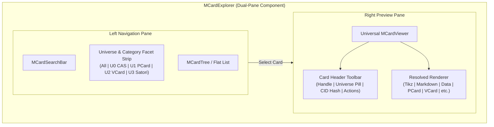

# Sprint 33: Universal Card Viewlet (`MCardViewer`) & Explorer Master Integration

**Sprint ID:** `SPRINT-33`  
**Subsystem Category:** `shell`  
**Target:** `@clm/mcard-explorer/ui` & Composite Dual-Pane Explorer  
**Dependencies:** Sprint 30 (`CardTypeJudgeService`), Sprint 31 (`RendererRegistry`), Sprint 32 (CLM Viewlets), Sprint 28 (`MCardExplorer`)  
**Target LOC:** $\le 250$ LOC per file (Contract D)  
**Ergonomic Goals:** Dual-pane split preview, universe-level facet filtering, seamless keyboard navigation  

---

## 1. Context & Motivation
With the type judgment pipeline (Sprint 30), the polyglot renderer registry (Sprint 31), and the higher-universe CLM viewlets (Sprint 32) established, the explorer requires a master composite viewlet: **`MCardViewer`**.

`MCardViewer` acts as the single universal entry point for rendering any card in the CLM ecosystem. It dynamically coordinates type judgment and renderer resolution, presenting a polished inspector complete with Universe badges ($U_0 \to U_5$), MIME type pills, Blake3 hash verification, and action affordances.

Sprint 33 integrates `MCardViewer` directly into `MCardExplorer.tsx`, transforming the explorer from a static handle list into a rich, dual-pane card browser equipped with Universe facet filters and responsive preview drawers.

---

## 2. Deliverables & Technical Architecture



### 2.1 Universal MCard Viewer (`src/packages/mcard-explorer/ui/MCardViewer.tsx`)
A modular composite viewlet ($\le 220$ LOC) adhering to Contract D. **D42 port discipline**: `MCardViewer` must never name `OperadicMCardVfs` or any `mcard-vcs` class — content arrives through the explorer-owned `CardContentProvider` port (defined in `mcard-explorer/core/datasource/types.ts`, implemented by `OperadicMCardVfs` in TikZiT and by `studioMCardFs` in mcard-studio):
```typescript
import type { CardContentProvider, CardContentDto } from '../core/datasource/types';
import type { RendererRegistry } from '../renderers/registry/RendererRegistry';
import type { TypeJudgment } from 'clm-kernel'; // root export only

export interface MCardViewerProps {
  /** Pre-fetched card (DTO, serializable — not a CardView class instance). */
  card?: CardContentDto | null;
  /** Handle to fetch via the provider port when `card` is absent. */
  handle?: string;
  /** D42 port — default resolved by the host adapter layer. */
  contentProvider?: CardContentProvider;
  registry?: RendererRegistry;
  /** Optional pre-computed judgment (viewer calls judge service only when absent). */
  typeJudgment?: TypeJudgment;
  onAction?: (actionId: string, payload?: unknown) => Promise<void>;
  className?: string;
}
```
**Key Capabilities**:
1. **Dynamic Resolution**: Fetches card content via `handle` + `CardContentProvider` port or receives `card` directly; evaluates type judgment if the DTO is unclassified.
2. **Registry Dispatch**: Dispatches to `RendererRegistry.resolve({ mimeType, handle, isBinary, universe, category, content })`.
3. **Adaptive Viewport (D44)**: Reads the resolved descriptor's `viewport` mode and re-shapes the preview container when the selected media type changes:
   - `fit` — `object-contain` centered fit, no scrollbars (SVG, PCard topology).
   - `scroll` — default vertical overflow pane (text, hex, VCard, Satori).
   - `zoom` — pan/zoom chrome (`+`/`-`/`reset`/`fit` controls, `data-testid="viewer-zoom-controls"`) for images and TikZ previews.
   - `paged` — pager chrome (`‹ page n/N ›`, `data-testid="viewer-pager"`) for PDFs and CSV/tabular sets.
   - `split` — dual-pane raw/rendered layout for Markdown/YAML/Data (collapses to tabs on narrow panes).
   Mode transitions apply a subtle fade/slide on selection change; the mode is exposed as `data-viewport-mode` on the container for E2E assertions.

   **Viewport-to-HypermediaNodeType Mapping (Gap 12):**

   | Viewport Mode | HypermediaNodeType | Semantic Role |
   |:---|:---|:---|
   | `fit` | `card` | Self-contained content node |
   | `scroll` | `text` | Flowing text/data content |
   | `zoom` | `container` → `card` | Interactive container wrapping spatial content |
   | `paged` | `container` → `card[]` | Sequential container with navigation |
   | `split` | `container` → `[text, card]` | Dual-pane layout |
4. **Card Header Toolbar**:
   - Handle title with namespace hierarchy.
   - Stratified Universe Badge: Color-coded pills (`U0 CAS`, `U1 PCard`, `U2 VCard`, `U3 Satori`).
   - Abbreviated Blake3 CID Hash (`blake3:7a4f...`) with click-to-copy button.
   - Category and MIME type badges.
   - **Descriptor Actions (D45)**: renders the resolved descriptor's `actions` as toolbar buttons — e.g. `openInCanvas`, `export.png`, `export.pdf`, `export.svg`, `export.tikz`, `download`, `copy` — each dispatched through `onAction(action.id, {handle, ...action.payload})`. Export ids are host-bridged (Sprint 34) to `diagramExportCoordinator.exportDiagramArtifact`, so a user can save the viewed diagram as PNG 1x/2x/4x, PDF, SVG, or verbatim TikZ/TeX **without leaving the viewer**.
   - **Action testid convention**: button testids are the action id sanitized — `data-testid="btn-viewer-action-${action.id.replace(/[^a-z0-9]+/gi, '-')}"` — so `export.png` renders `btn-viewer-action-export-png`. Sprint 32 and Sprint 34 conformance assertions use this convention (not a separate `btn-card-export-*` family).
5. **Resilient Shell**: Graceful empty state when no card is selected; loading spinner during fetch; error boundary that walks the `RendererRegistry.resolveAll()` candidate list on render throw — a failing viewlet degrades to the next matching descriptor, ending at `BinaryHexCardRenderer` (structural 100%-renderability, Sprint 31).
6. **Headless Rendering Fallback (Gap 1, 13)**: When running in a non-React environment (headless CLI, multi-agent harness), `MCardViewer` resolves the descriptor's `toHypermediaNode()` instead of mounting the React `component`. The resulting `HypermediaNode` tree is rendered via kernel `hypermediaToAnsi()` or `hypermediaToHtml()`, proving the system renders **without React**.
7. **Action Registry Unification (Gap 11)**: `MCardViewer.onAction` routes all action dispatches through the `ExplorerActionRegistry` from Sprint 25. The viewer action bridge (Sprint 34) **registers** its host-specific handlers via `ExplorerActionRegistry.register()` rather than bypassing it with a parallel dispatch path.

### 2.2 Dual-Pane Explorer Integration (`src/packages/mcard-explorer/ui/MCardExplorer.tsx`)
Refactors `MCardExplorer.tsx` to mount `MCardViewer` in an optional or responsive side-by-side split layout:
1. **Layout Modes**:
   - Split view: Left pane navigation (35–45% width) + Right pane `MCardViewer` (55–65% width).
   - Single pane: Standard tree/flat list with a toggleable slide-over preview drawer.
   - Preview Toggle CTA (`data-testid="toggle-preview-pane"`).
2. **Enhanced Universe & Category Facet Strip (`data-testid="mcard-facet-bar"`)**:
   - Extends existing facet filter with Universe options:
     - `all` (Complete corpus)
     - `diagram` / `U0_Mcard` (TikZ, ZX diagrams)
     - `markdown` / `text` (Documentation, notes)
     - `data` (JSON, YAML, CSV)
     - `process` / `U1_Pcard` (Petri nets, workflows)
     - `proof` / `U2_Vcard` (Hoare sandwiches, receipts)
     - `conversation` / `U3_Satori` (Dialogue turns, logs)
3. **Keyboard Ergonomics**:
   - `ArrowUp` / `ArrowDown`: Moves selection across card entries.
   - `Spacebar`: Opens/refreshes card in `MCardViewer`.
   - `Enter`: Executes default host action for active card.
   - `+` / `-` / `0`: Zoom in / out / reset when the resolved viewport mode is `zoom`.

### 2.3 Sample Media QA Harness (D45)
The `tests/fixtures/multimodal-media/` corpus (Sprint 31) is mounted by `npm run seed:media` so every viewport mode and renderer can be verified interactively: selecting `icon.png` switches the pane to `zoom` chrome, `paper.pdf` to `paged`, `notes.md` to `split`, `sample.tikz` to `zoom` with export buttons present. Fixture-driven component tests assert the `data-viewport-mode` attribute changes on selection.

### 2.4 Satori XML AST Speech Act Integration
Kernel `SatoriElementType` is a **closed union** — `<mcard-viewer>` is not a native element. Wire form uses `type: 'custom'` elements with `attrs` (same convention established for `<version-dag>`/`<mcard-explorer>` in graduated Sprints 27–28):
```xml
<custom name="mcard-viewer" handle="zx:diagrams:teleportation" universe="U0" view="preview" />
```
The codec emits/accepts this custom element; the **renderer for it lives on the host side** (TikZiT maps it to `MCardViewer`; `mcard-studio` maps it through its `SatoriNodeRenderer` `custom` dispatch — a studio-side porting deliverable, consistent with D30). Kernel `renderSatoriToHypermedia`/`hypermediaToHtml` provide the headless fallback rendering.

---

## 3. Definition of Done (DoD) Criteria

- [x] **33-DOD-01**: `src/packages/mcard-explorer/ui/MCardViewer.tsx` is authored ($\le 220$ LOC) coordinating `RendererRegistry` and type judgment, depending solely on the `CardContentProvider` port — **zero `mcard-vcs` imports** (verified by grep + Contract E gate).
- [x] **33-DOD-02**: `MCardViewer` displays header toolbar with Handle, Universe badge ($U_0 \to U_5$), CID hash copy button, MIME type pill (`data-testid="mcard-viewer"`), and descriptor-declared action buttons (`data-testid="btn-viewer-action-*"`).
- [x] **33-DOD-03**: `MCardExplorer.tsx` supports dual-pane split view with responsive preview drawer toggle (`data-testid="toggle-preview-pane"`).
- [x] **33-DOD-04**: Facet strip in `MCardExplorer` includes Universe filter chips (`U0 CAS`, `U1 PCard`, `U2 VCard`, `U3 Satori`) and categories (`data-testid="mcard-facet-bar"`).
- [x] **33-DOD-05**: Keyboard navigation is fully supported (Arrow keys navigate, Space previews, Enter opens).
- [x] **33-DOD-06**: Satori XML codec emits/accepts `type:'custom'` `mcard-viewer` elements per §2.4, with host-side rendering dispatch documented for both TikZiT and `mcard-studio`.
- [x] **33-DOD-07**: `tests/unit/mcard-explorer/ui/MCardViewer.test.tsx` passes with 100% green assertions across all universe levels, loading/error states, and headless `toHypermediaNode()` → `hypermediaToAnsi()` fallback (Gap 13).
- [x] **33-DOD-08**: `tests/unit/mcard-explorer/ui/MCardExplorerIntegration.test.tsx` passes, verifying dual-pane split view and facet switching.
- [x] **33-DOD-09**: Contract B selectors verified intact; Contract D LOC ceiling ($\le 250$ LOC per file) satisfied.
- [x] **33-DOD-10**: Existing 526 tests (across 95 test files) in the TikZiT test suite pass with zero regressions.
- [x] **33-DOD-11**: Adaptive viewport verified — selecting each D45 fixture media type switches `data-viewport-mode` correctly (`zoom` images/TikZ, `paged` PDF/CSV, `split` Markdown/YAML, `fit` SVG/PCard, `scroll` text/hex) with correct chrome per mode; export actions dispatch exact `onAction` payloads **through `ExplorerActionRegistry`** (Gap 11).
- [x] **33-DOD-12**: Viewport-to-`HypermediaNodeType` mapping (Gap 12) is documented and verified in tests; headless `MCardViewer` mode produces correct `HypermediaNode` trees for each viewport mode.
