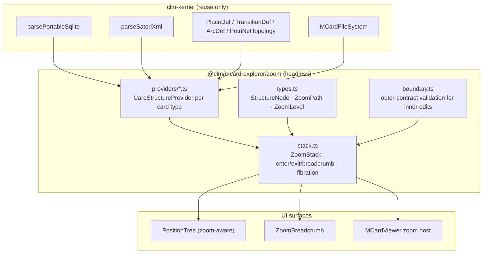

# Sprint 38: Operadic Zoom & Multi-Level Navigation

**Sprint ID:** `SPRINT-38`
**Subsystem Category:** `shell`
**Target:** `@clm/mcard-explorer/zoom` & zoom-aware tree/list surfaces
**Dependencies:** Sprint 36 (`Position`, `Direction`, registry), Sprint 37 (`CardInterface`, ports, `portsCompatible`), kernel root exports (`parsePortableSqlite`, `parseSatoriXml`, `PlaceDef`/`TransitionDef`/`ArcDef`/`PetriNetTopology`, `MCardFileSystem`)
**Target LOC:** ≤ 250 LOC per file (Contract D) · ≤ 150 LOC concern target (ADR D53/D54)
**Zero-DOM Gate:** Contract E — `zoom/` is 100% headless
**Kernel Stratum:** `@layer L4` (interface/membrane) consuming **L1** (`PetriNetTopology` and Petri defs), **L2** (`parsePortableSqlite`, `MCardFileSystem` via port), **L3** (`parseSatoriXml`) — all root-export only
**Host Boundary:** kenotic (ADR D55) — content arrives through `CardContentProvider`; no `cordis`/host-store imports
**Contract B Gate:** all existing selectors preserved; zoom selectors registered deliberately
**Status:** ✅ Completed / Graduated


---

## 1. Context & Motivation

The tree view is a **namespace tree, not a structure tree**. `MCardExplorerEngine.buildTree()` (`:134`) splits `item.handle` on `:` — so `zx:diagrams:ghz` becomes three nested folders that describe *naming*, not *containment*. A SQLite collection with 40 cards inside it is a single leaf. A Satori turn embedding three `<card>` references is a single leaf. A PCard with 12 places and 9 transitions is a single leaf. And folder nodes carry **zero affordances** (`MCardTree.tsx:34-45` — click toggles expansion and nothing else).

Two consequences:

1. **There is nowhere to go.** `OperadicMCardVfs` has no containment API, so the interface cannot descend into a card's interior. The vault's Semagrams result is the opposite: double-clicking a composite box in the string-diagram editor expands its internal diagram, and *dragging a resource across the abstraction boundary updates the outer contract* — see [[StudyNotes: Literature/Annotation/Transcription of Polynomial Interfaces|Transcription of Polynomial Interfaces]] (the `dwd-zoom` branch demonstration) and [[StudyNotes: Fleeting/Inbox/Semagrams|Semagrams]] ("operads capture 'subsystem → system' assembly").
2. **Hierarchy is not enforced.** Nothing prevents an edit inside a nested structure from violating the enclosing card's interface. The vault is explicit that this must be impossible: *"expanding a box reveals an inner string diagram, and dragging intermediate resources across the boundary enforces semantic consistency at the enclosing layer."*

This sprint makes structure navigable and boundary-consistent: **zoom is a fibration over positions**, and crossing a level boundary is a checked composition (Sprint 37's port legality, applied to containment).

> **Vault alignment.** [[StudyNotes: Literature/Reading notes/@Spencer_Breiner_Polynomial_Interfaces|Breiner §3]]: the bundle formulation $E \xrightarrow{\pi} B$ — a polynomial *is* a display map, and the fiber over a position is its local affordance set. Zooming is following $\pi$ downward; the outer contract is the base.

---

## 2. Deliverables & Technical Architecture



*Diagram: structure providers over kernel parsers, composed into a zoom stack consumed by three surfaces.*

### 2.1 `zoom/types.ts` — the fibration (≤ 120 LOC)

```typescript
/** A node in a card's internal structure. Children are positions (Sprint 36) when card-shaped. */
export interface StructureNode {
  readonly id: string;                    // stable within the parent card
  readonly label: string;
  readonly kind: 'card' | 'record' | 'place' | 'transition' | 'node' | 'edge'
                    | 'section' | 'element' | 'table' | 'field';
  /** When the node *is* a card (contained handle / embedded reference), its position handle. */
  readonly handle?: string;
  /** Provider-declared metadata (counts, types, kernel ids). */
  readonly meta?: Readonly<Record<string, unknown>>;
  readonly children?: readonly StructureNode[];
}

/** One level of descent: which card we are inside, via which provider. */
export interface ZoomLevel {
  readonly handle: string;
  readonly hash: string;
  readonly providerId: string;
  readonly nodes: readonly StructureNode[];
  /** Ports of the *enclosing* card, used for boundary validation (Sprint 37). */
  readonly outerInterface: CardInterface | null;
}

export interface ZoomPath {
  readonly levels: readonly ZoomLevel[];   // index 0 = root context
  readonly cursor: number;                 // active level index
}
```

### 2.2 `zoom/providers/` — structure projection per card type (≤ 90 LOC each)

Each provider is a pure function `content → StructureNode[]`, registered in a registry mirroring Sprint 36's direction registry:

| Provider | Card types | Structure derived | Kernel reuse |
| :--- | :--- | :--- | :--- |
| `SqliteStructureProvider` | `application/x-sqlite3` | Tables → fields; **contained cards** as `kind: 'card'` nodes with real handles | `parsePortableSqlite` (portable format), `MCardFileSystem` |
| `SatoriStructureProvider` | `application/vnd.satori.turn+xml` | Speech-act elements; nested `<card>` references as zoomable `card` nodes | `parseSatoriXml`, `SatoriElement` |
| `PcardStructureProvider` | `application/vnd.pcard+json` | Places / transitions / arcs as `kind: 'place' \| 'transition'` nodes with markings | `PlaceDef`, `TransitionDef`, `ArcDef`, `MarkingMap`, `PetriNetTopology` |
| `ZxGraphStructureProvider` | `application/vnd.zx-graph+json` | Spiders (nodes) and edges | — (JSON shape) |
| `TikzStructureProvider` | `text/x-tikz` | Nodes, edges, and style references from the diagram AST | existing parser output (no new parser) |
| `MarkdownStructureProvider` | `text/markdown` | Heading sections as `kind: 'section'`; fenced code blocks as `element` | — |
| `JsonYamlStructureProvider` | `application/json`, `text/yaml` | Top-level keys → nested keys; arrays as indexed `element` nodes | — |
| `HandleNamespaceProvider` | any | Operadic VFS namespace levels (`zx:diagrams:`, `zx:artifacts:`, …) as a *virtual* root structure | `listHandles(prefix)` via port |

**Rule (ADR D50):** a card type with no applicable provider resolves **no zoom direction** — the zoom affordance is absent, never an error dialog. This keeps the guardrail property: absence, not failure.

**Recursion bound:** zoom depth is bounded by a configured maximum (default 8) and a cycle guard on handle repetition, so a self-referential collection cannot produce an infinite stack.

### 2.3 `zoom/stack.ts` — the zoom stack (≤ 160 LOC)

```typescript
export class ZoomStack {
  constructor(private providers: StructureRegistry, private content: CardContentProvider) {}

  /** Resolve the zoom direction fiber for a position: empty when no provider applies. */
  resolveZoomDirections(position: Position): readonly Direction[];

  /** Descend into a node (or into the card itself when nodeHandle is omitted). */
  async enter(position: Position, nodeHandle?: string): Promise<ZoomPath>;

  /** Ascend one level; returns the new path (never throws at root — it is a no-op). */
  exit(): ZoomPath;

  /** Jump to an arbitrary ancestor (breadcrumb navigation). */
  to(cursor: number): ZoomPath;

  /** Current level's nodes, or empty when at root context. */
  nodes(): readonly StructureNode[];

  /** Breadcrumb projection: [{label, handle, cursor}]. */
  breadcrumb(): readonly ZoomCrumb[];
}

export interface ZoomCrumb { readonly label: string; readonly handle: string; readonly cursor: number; }
```

`ZoomStack` is headless and holds no DOM or store references; the host binds it to a surface.

### 2.4 `zoom/boundary.ts` — outer-contract validation (≤ 130 LOC)

The Semagrams boundary rule, implemented with Sprint 37's port machinery:

```typescript
/** Validate that a proposed inner mutation satisfies the enclosing card's interface. */
export async function validateBoundary(
  innerChange: CompositionPlan | { kind: 'edit'; nodeId: string },
  outerInterface: CardInterface,
  matcher: typeof portsCompatible
): Promise<BoundaryVerdict>;

export type BoundaryVerdict =
  | { ok: true }
  | { ok: false; violations: readonly { portId: string; reason: PortMatch & { ok: false } }[] };
```

Rules:
1. An inner composition that would **remove or retype** a port exposed by the outer interface is rejected (`violations` names the port and the mismatch reason).
2. An inner composition that **adds** ports is permitted (the outer interface is a lower bound, matching the vault's "internal modifications satisfy the outer interface boundaries").
3. A rejected boundary check produces **no commit direction** at the inner position — the user cannot attempt the edit, and the reason is available for diagnostics and the live-announcer (accessible explanation without an enabled-but-failing control).

### 2.5 Zoom-aware surfaces

| Surface | Change |
| :--- | :--- |
| `ui/PositionTree.tsx` (replaces `MCardTree.tsx`) | Folder nodes gain a resolved direction set (expand/collapse, zoom-enter, copy handle); a card node with an applicable provider shows a zoom affordance; a container card's children appear as a **second tree level** (containment) distinguished from the namespace level by `data-node-kind` |
| `ui/ZoomBreadcrumb.tsx` (≤ 90 LOC) | Renders `breadcrumb()`; each crumb is a position with a `zoom.to` direction; testids `zoom-breadcrumb`, `zoom-crumb-${cursor}` |
| `MCardViewer` zoom host | When a zoom path is active, the viewer renders the current level's structure beside the card, and the container attribute `data-zoom-depth` is set for E2E assertions |
| Keyboard | `Enter` on a card position = zoom enter (its default direction); `Backspace` = zoom exit; both resolve through the Sprint 36 fiber, so a card with no provider simply has no enter direction |

**Namespace vs. containment.** The existing `:`-namespace grouping is retained as the *root* projection (`HandleNamespaceProvider`), so no current behaviour is lost; containment appears as an additional, typed level. Users can distinguish them visually via `data-node-kind="namespace" | "card" | "place" | "section" | …`.

### 2.6 Kernel Layer Placement (ADR D57)

Zoom is **L4** reading structure that belongs to **L1/L2/L3**. The providers are *projections*, never parsers: each one calls the kernel codec that owns the format.

| Module | Declared stratum | Kernel symbols consumed | From | Layer note |
| :--- | :--- | :--- | :--- | :--- |
| `zoom/providers/SqliteStructureProvider.ts` | L4 | `parsePortableSqlite` | root export | L2 codec; contained cards read as handles |
| `zoom/providers/PcardStructureProvider.ts` | L4 | `PlaceDef`, `TransitionDef`, `ArcDef`, `MarkingMap`, `PetriNetTopology` | root export | L1 structures; **no** transition firing here |
| `zoom/providers/SatoriStructureProvider.ts` | L4 | `parseSatoriXml`, `SatoriElement` | root export | L3 codec |
| `zoom/providers/{Zx,Tikz,Markdown,JsonYaml}StructureProvider.ts` | L4 | — (JSON/AST shapes) | — | Format-shape reading only |
| `zoom/providers/HandleNamespaceProvider.ts` | L4 | — | — | Calls `listHandles(prefix)` **through a port** (L2 boundary) |
| `zoom/stack.ts`, `zoom/boundary.ts` | L4 | `portsCompatible` (Sprint 37, via façade) | `cards/index.ts` | Interface logic over ports |

**Provider rule (inherited from Sprint 37 §2.7):** a provider that parses a format the kernel already parses is a defect. The only permitted parsing is of shapes the kernel does not model (ZX JSON, TikZ AST nodes, Markdown headings, JSON/YAML keys).

### 2.7 `mcard-studio` Alignment (ADRs D54–D56)

`mcard-studio` is a *path-based* browser. Verified: `src/utils/artifactTree.ts` builds a tree by splitting artifact **paths**; `src/components/studio/views/fileTree/MCardFileTree.tsx` renders that folder tree; `src/pages/api/vfs/tree.ts` serves it. There is **no containment zoom** — a `.db` collection, a Satori turn with embedded `<card>` references, or a PCard net are opaque leaves. This sprint is therefore a *capability the studio gains*, not a convention it already has.

| Studio artefact (verified) | Relationship to this sprint | Action |
| :--- | :--- | :--- |
| `views/fileTree/FileTreeNode.tsx` — `TreeNode { name, fullPath, isDir, file, children }` | The studio's tree node shape. | Add `adapters/studioTreeNode.ts` (≤ 60 LOC) exporting `toStudioTreeNode(nodes: StructureNode[]): StudioTreeNode[]`, mirroring the `toCardViewletDefinition` / `toStudioPortDescriptor` parity pattern, so the studio renders containment with **its existing** `FileTreeNode`. |
| `views/fileTree/MCardFileTree.tsx` + `hooks/useFileTreeSync.ts` | The studio's tree orchestrator and VFS sync hook. | Our `PositionTree` is headless-safe and store-free; the studio keeps `useFileTreeSync` as its sync hook and feeds positions in. No studio rewrite required. |
| `.agents/skills/mcard-navigation/SKILL.md` — *"Left Sidebar: A tree view of folders/artifacts. Top Bar: Breadcrumbs and a 'Search…' button"* | The studio's navigation plan matches our `PositionTree` + `ZoomBreadcrumb` exactly. | Ship the default `NavigationProvider`s (`core.namespace` from `HandleNamespaceProvider`, `core.containment` from structure providers) so **both** hosts consume one tree and one breadcrumb; `encodeAddress`/`decodeAddress` satisfy the skill's "URL as State" principle. |
| Studio-only viewlets: `Spatial3dViewlet.tsx`, `WebappZenViewlet.tsx`, `MeshTopologyViewlet.tsx`, `MerkleProofViewlet.tsx`, `PayloadCasViewlet.tsx` | Card types the studio renders but has no structure model for. | The studio registers additional `StructureProvider`s for these (its own porting checklist item) — proving the provider seam is open without touching the package. |
| `src/services/vfs/vfsContent.ts`, `vfsVersions.ts` | Content and lineage supply. | `CardContentProvider` (D42) is implemented over `vfsContent`; `ZoomLevel` may attach lineage via `CardVcsPort`. |

### 2.8 Default `NavigationProvider`s (consuming Sprint 36 §2.9)

| Provider | Structure | Notes |
| :--- | :--- | :--- |
| `core.namespace` | `:`-segment handle namespaces via `listHandles(prefix)` through a port | Replaces the current `buildTree` behaviour without losing it (Contract B: `folder-*`, `tree-item-*` retained) |
| `core.containment` | `StructureProvider` output — contained cards, places/transitions, sections, keys | New; `data-node-kind` distinguishes levels |

Both are registered by default; the studio may add `studio.remote`-style providers per its navigation skill's plugin plan. Deep links: `#/card/<handle>` for a card position, `#/card/<handle>/<nodeId>` for a structure node; round-trip is asserted.

---

## 3. Definition of Done (DoD) Criteria

- [x] **38-DOD-01**: **Zoom & Structure Types** (`src/packages/mcard-explorer/zoom/types.ts`, $\le 120$ LOC).
  - **Observable Rule:** Exports `StructureNode`, `ZoomLevel`, `ZoomPath`, `ZoomCrumb`; kernel imports root-only (`'clm-kernel'`); type check compiles cleanly.
  - **Verification Command:** `npx tsc --noEmit && ! grep -rn "from 'clm-kernel/" src/packages/mcard-explorer/zoom/types.ts`
- [x] **38-DOD-02**: **Eight Structure Providers** (`src/packages/mcard-explorer/zoom/providers/*.ts`, $\le 90$ LOC each).
  - **Observable Rule:** Implements 8 providers (`sqlite.ts`, `satori.ts`, `pcard.ts`, `zx.ts`, `tikz.ts`, `markdown.ts`, `json.ts`, `namespace.ts`) with registry; `SqliteStructureProvider` extracts contained cards as real handles from fixture `.db` via `parsePortableSqlite`.
  - **Verification Command:** `npx vitest run tests/unit/mcard-explorer/zoom/providers.test.ts -t "SqliteStructureProvider"`
- [x] **38-DOD-03**: **Satori Conversational Structure Provider**.
  - **Observable Rule:** Surfaces nested `<card>` elements from `tests/fixtures/multimodal-media/turn.satori.xml` as zoomable child positions via kernel `parseSatoriXml`.
  - **Verification Command:** `npx vitest run tests/unit/mcard-explorer/zoom/providers.test.ts -t "SatoriStructureProvider"`
- [x] **38-DOD-04**: **PCard Petri Net Topology Structure Provider**.
  - **Observable Rule:** Projects places, transitions, and arcs directly from kernel `PetriNetTopology`; zero bespoke Petri parsing regexes in `zoom/` (grep-asserted).
  - **Verification Command:** `npx vitest run tests/unit/mcard-explorer/zoom/providers.test.ts -t "PcardStructureProvider" && ! grep -rn "places.*transitions" src/packages/mcard-explorer/zoom/`
- [x] **38-DOD-05**: **Zoom Navigation Stack Engine** (`src/packages/mcard-explorer/zoom/stack.ts`, $\le 160$ LOC).
  - **Observable Rule:** Implements `resolveZoomDirections`, `enter`, `exit`, `to`, `nodes`, `breadcrumb`. `exit()` at root level is an idempotent no-op (never throws). Enforces max depth bound ($\le 8$) and cycle prevention with isolated unit tests.
  - **Verification Command:** `npx vitest run tests/unit/mcard-explorer/zoom/stack.test.ts`
- [x] **38-DOD-06**: **Guardrail Absence for Leaf Cards**.
  - **Observable Rule:** A card type with no applicable structure provider resolves an empty zoom fiber: zoom affordance is absent from DOM (`queryByTestId('btn-zoom-enter') === null`); no disabled button or error banner rendered.
  - **Verification Command:** `npx vitest run tests/unit/mcard-explorer/zoom/stack.test.ts -t "guardrail absence"`
- [x] **38-DOD-07**: **Boundary Consistency Validation** (`src/packages/mcard-explorer/zoom/boundary.ts`, $\le 130$ LOC).
  - **Observable Rule:** Implements `validateBoundary(outerCard, innerMutation)`; boundary conflict yields `commitDirection === undefined` (no commit affordance) and dispatches accessible explanation to `data-testid="live-announcer"`.
  - **Verification Command:** `npx vitest run tests/unit/mcard-explorer/zoom/boundary.test.ts`
- [x] **38-DOD-08**: **Containment & Namespace Tree (`PositionTree.tsx`)**.
  - **Observable Rule:** `src/packages/mcard-explorer/ui/PositionTree.tsx` replaces `MCardTree.tsx`; renders namespace and containment levels with `data-node-kind` attribute; folder click triggers resolved zoom direction instead of hardcoded click handler; `MCardTree.tsx` deleted.
  - **Verification Command:** `npx vitest run tests/unit/mcard-explorer/ui/PositionTree.test.tsx && test ! -f src/packages/mcard-explorer/ui/MCardTree.tsx`
- [x] **38-DOD-09**: **Zoom Breadcrumb Viewlet** (`src/packages/mcard-explorer/ui/ZoomBreadcrumb.tsx`, $\le 90$ LOC).
  - **Observable Rule:** Renders `data-testid="zoom-breadcrumb"` with clickable crumb links `data-testid="zoom-crumb-${idx}"`; clicking crumb dispatches `zoom.to` direction; root crumb restores level 0.
  - **Verification Command:** `npx vitest run tests/unit/mcard-explorer/ui/ZoomBreadcrumb.test.tsx`
- [x] **38-DOD-10**: **Contract B Baseline Preservation**.
  - **Observable Rule:** All 295 baseline literal selectors + 17 dynamic prefix families pass check; `tree-item-*` and `folder-*` dynamic families preserved; new zoom selectors recorded.
  - **Verification Command:** `node scripts/audit-testids.mjs --check`
- [x] **38-DOD-11**: **Contract E Zero-DOM Isolation Gate**.
  - **Observable Rule:** `TARGET_DIRECTORIES` in `check-vcs-isolation.mjs` includes `mcard-explorer/zoom`; reports 0 DOM globals, 0 host imports, zero `mcard-vcs` concrete imports.
  - **Verification Command:** `node scripts/check-vcs-isolation.mjs`
- [x] **38-DOD-12**: **Zoom Package Unit Test Suite**.
  - **Observable Rule:** 100% pass across `tests/unit/mcard-explorer/zoom/{providers,stack,boundary}.test.ts`: fixture parsing, depth/cycle guards, breadcrumb clicks, and boundary rejection.
  - **Verification Command:** `npx vitest run tests/unit/mcard-explorer/zoom`
- [x] **38-DOD-13**: **Full Vitest Suite & TypeScript Compilation**.
  - **Observable Rule:** 100% pass with 0 regressions against the 670 passing baseline tests; `tsc --noEmit` exits with status 0.
  - **Verification Command:** `npx vitest run && npx tsc --noEmit`
- [x] **38-DOD-14**: **Concern Audit & Migration Ledger (ADR D53)**.
  - **Observable Rule:** All modules in `zoom/` $\le 150$ LOC; deletion of `MCardTree.tsx` (84 LOC) and addition of `PositionTree.tsx` recorded in evidence ledger.
  - **Verification Command:** `node scripts/audit-concerns.mjs`
- [x] **38-DOD-15**: **Kernel Codec Delegation & Layer Declarations (ADR D57)**.
  - **Observable Rule:** Every `zoom/` file carries `@layer L4` header; providers delegate parsing exclusively to kernel codecs (`parsePortableSqlite`, `parseSatoriXml`, etc.); grep asserts no duplicate parser implementations.
  - **Verification Command:** `grep -rn "@layer L4" src/packages/mcard-explorer/zoom/`
- [x] **38-DOD-16**: **Extensible Structure Provider Architecture (ADR D54)**.
  - **Observable Rule:** Registering a 9th structure provider in tests requires adding one file in `zoom/providers/` and registering it, modifying zero existing provider files.
  - **Verification Command:** `npx vitest run tests/unit/mcard-explorer/zoom/providers.test.ts -t "extensibility"`
- [x] **38-DOD-17**: **Studio Tree Node Parity (ADR D54)**.
  - **Observable Rule:** `zoom/adapters/studioTreeNode.ts` ($\le 60$ LOC) maps `StructureNode[]` into studio `TreeNode` shape (`name`, `fullPath`, `isDir`, `file`, `children`) with exact field parity.
  - **Verification Command:** `npx vitest run tests/conformance/studio-parity.test.ts -t "toStudioTreeNode"`
- [x] **38-DOD-18**: **Default Navigation Providers & Deep Links (ADR D56)**.
  - **Observable Rule:** `core.namespace` and `core.containment` providers registered by default; URL hash round-trip asserted for `#/card/<handle>` (card position) and `#/card/<handle>/<nodeId>` (contained node position).
  - **Verification Command:** `npx vitest run tests/unit/mcard-explorer/zoom/navigation.test.ts`
- [x] **38-DOD-19**: **Façade Discipline (ADR D54)**.
  - **Observable Rule:** `zoom/index.ts` is the exclusive public export; `src/packages/mcard-explorer/ui/` consumes only the façade (grep-asserted).
  - **Verification Command:** `! grep -rn "from '.*mcard-explorer/zoom/providers" src/packages/mcard-explorer/ui/`
- [x] **38-DOD-20**: **Kenotic Host Boundary (ADR D55)**.
  - **Observable Rule:** Zero `cordis`, `cordisClient`, or host-store imports in `zoom/`; content arrives exclusively via `CardContentProvider` argument.
  - **Verification Command:** `! grep -rn "cordis" src/packages/mcard-explorer/zoom/`
- [x] **38-DOD-21**: **Studio Extension Path Documentation**.
  - **Observable Rule:** Bin documentation names the exact studio viewlet registration points (`Spatial3dViewlet`, `WebappZenViewlet`, `MeshTopologyViewlet`, `MerkleProofViewlet`, `PayloadCasViewlet`) requiring zero package modifications.
  - **Verification Command:** `test -f docs/sprints/_active/SPRINT-38-OPERADIC-ZOOM-AND-MULTI-LEVEL-NAVIGATION.md`

---

## 4. Verification

| Gate | Command / artifact |
| :--- | :--- |
| Unit | `npx vitest run tests/unit/mcard-explorer/zoom` |
| Fixtures | `npm run seed:media` corpus (`collection.db`, `turn.satori.xml`, `workflow.pcard.json`, `sample.zx.json`) |
| Isolation | `make check-vcs-isolation` (extended targets) |
| Contract B | `node scripts/audit-testids.mjs --check` |
| Types | `npx tsc --noEmit` |
| Regression | `npx vitest run` |
| Studio parity | `tests/conformance/studio-parity.test.ts` — `toStudioTreeNode` field parity; `NavigationProvider` shape parity |
| Layer placement | grep gate for `@layer` headers, root-only kernel specifiers, and provider delegation to kernel codecs |

**Acceptance demonstration.** Selecting `collection.db` from the seeded corpus reveals a zoom affordance; entering it lists the collection's tables **and** its contained cards as first-class positions; entering one of those cards renders it in the viewer with `data-zoom-depth="2"`, and the breadcrumb walks back to the root. Attempting an inner composition that would retype a port exposed by the enclosing collection leaves the commit direction absent, with the reason announced through the live region.
